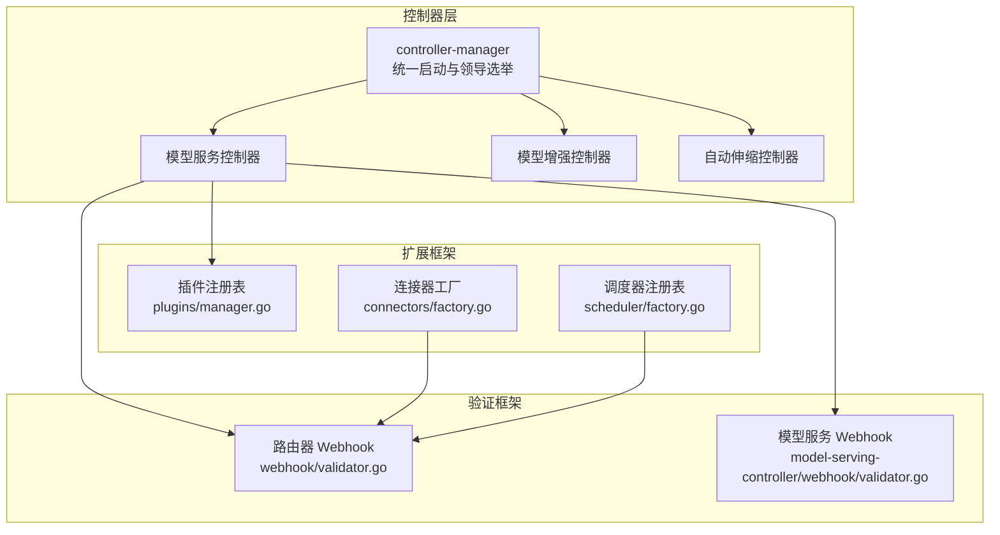
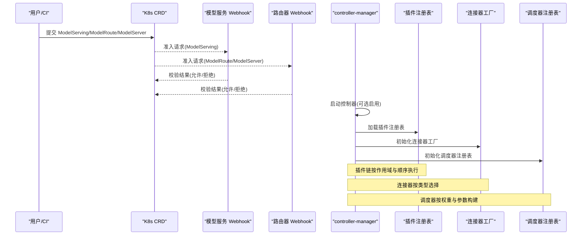
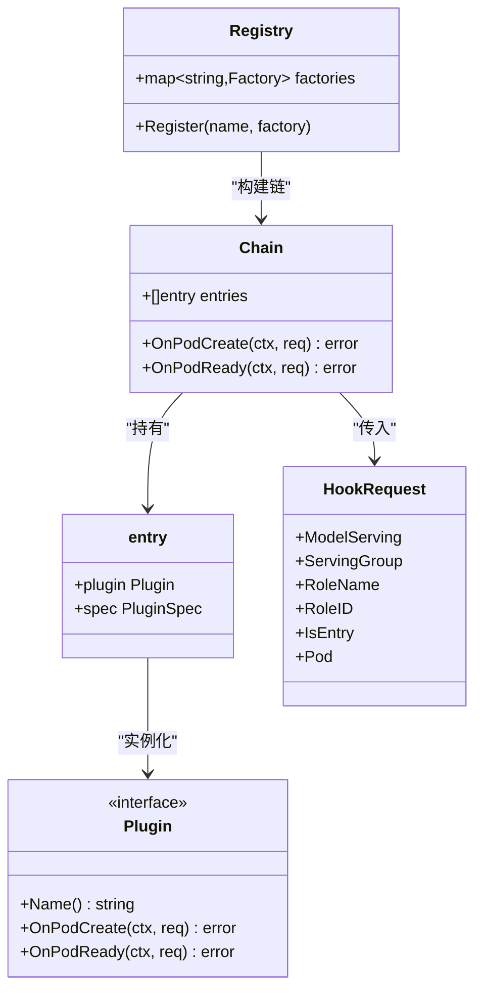
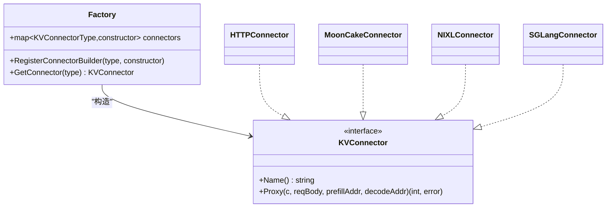
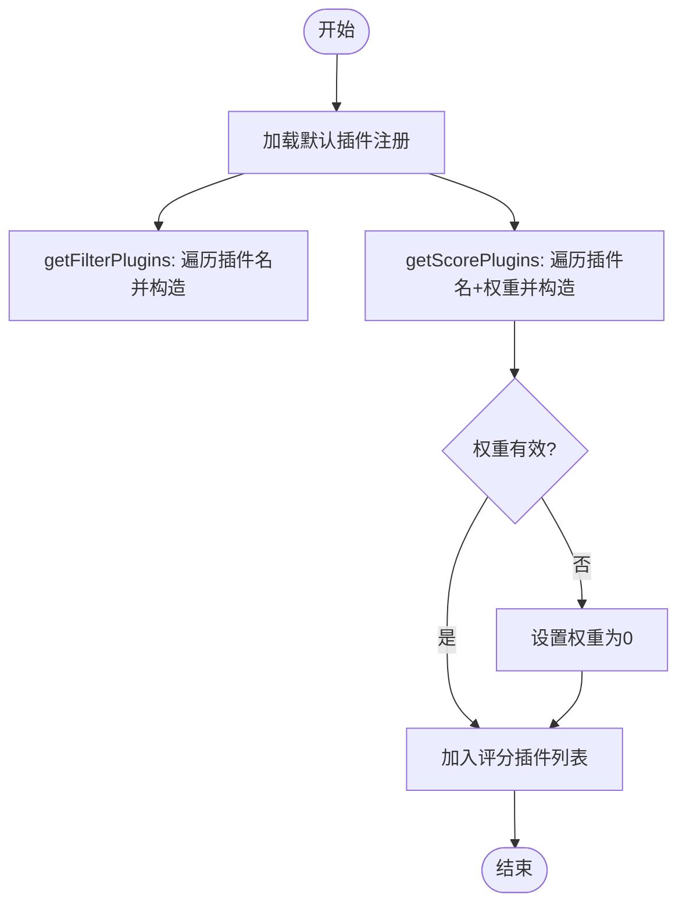
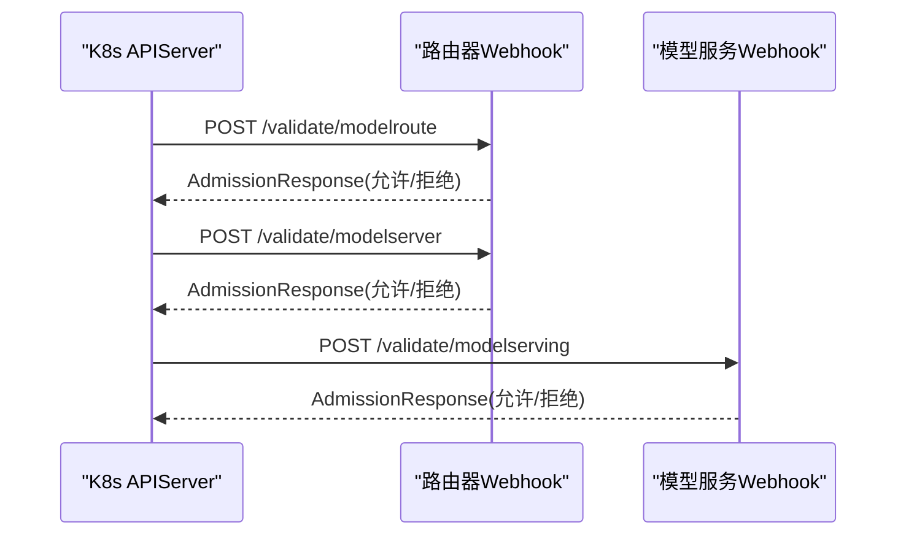
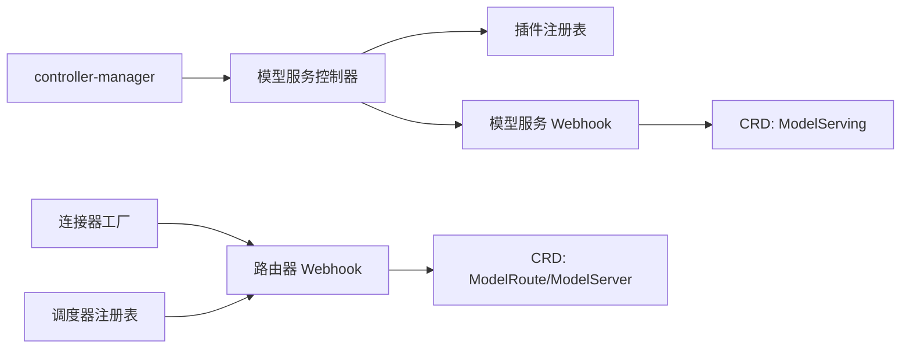

# 扩展机制设计

<cite>
**本文引用的文件**
- [pkg/model-serving-controller/plugins/manager.go](file://pkg/model-serving-controller/plugins/manager.go)
- [pkg/model-serving-controller/plugins/types.go](file://pkg/model-serving-controller/plugins/types.go)
- [pkg/model-serving-controller/plugins/demo_plugin.go](file://pkg/model-serving-controller/plugins/demo_plugin.go)
- [pkg/kthena-router/connectors/factory.go](file://pkg/kthena-router/connectors/factory.go)
- [pkg/kthena-router/connectors/interface.go](file://pkg/kthena-router/connectors/interface.go)
- [pkg/kthena-router/scheduler/factory.go](file://pkg/kthena-router/scheduler/factory.go)
- [pkg/kthena-router/scheduler/plugins/least_request.go](file://pkg/kthena-router/scheduler/plugins/least_request.go)
- [pkg/kthena-router/webhook/validator.go](file://pkg/kthena-router/webhook/validator.go)
- [pkg/model-serving-controller/webhook/validator.go](file://pkg/model-serving-controller/webhook/validator.go)
- [pkg/controller/controller.go](file://pkg/controller/controller.go)
- [client-go/applyconfiguration/workload/v1alpha1/pluginspec.go](file://client-go/applyconfiguration/workload/v1alpha1/pluginspec.go)
- [client-go/applyconfiguration/networking/v1alpha1/kvconnectorspec.go](file://client-go/applyconfiguration/networking/v1alpha1/kvconnectorspec.go)
</cite>

## 目录
1. [引言](#引言)
2. [项目结构](#项目结构)
3. [核心组件](#核心组件)
4. [架构总览](#架构总览)
5. [详细组件分析](#详细组件分析)
6. [依赖关系分析](#依赖关系分析)
7. [性能考量](#性能考量)
8. [故障排查指南](#故障排查指南)
9. [结论](#结论)
10. [附录](#附录)

## 引言
本文件面向 Kthena 的扩展机制设计，系统化阐述平台的插件化架构与扩展点，包括：
- 调度器插件、连接器插件与控制器插件的扩展点设计
- 工厂模式在连接器与调度器中的应用及新功能无缝集成方式
- CRD 扩展机制与 Webhook 验证框架的设计原理
- 插件生命周期管理、热插拔机制与版本兼容性策略
- 扩展开发最佳实践、API 设计原则与向后兼容性保障
- 如何通过扩展机制支持第三方集成与定制化需求

## 项目结构
Kthena 的扩展能力主要分布在以下模块：
- 控制器管理：统一启动与领导选举，按需启用模型服务、模型增强、自动伸缩等控制器
- 模型服务控制器插件框架：内置插件注册、链式调用、作用域控制与配置解码
- 路由器连接器工厂：基于类型选择不同 KV 缓存连接器，默认回退策略
- 路由器调度器插件注册表：按名称注册评分/过滤插件，构建调度链
- Webhook 验证：路由器与模型服务控制器各自的 Admission Webhook，负责资源校验

图表来源
- [pkg/controller/controller.go:52-141](file://pkg/controller/controller.go#L52-L141)
- [pkg/model-serving-controller/plugins/manager.go:60-80](file://pkg/model-serving-controller/plugins/manager.go#L60-L80)
- [pkg/kthena-router/connectors/factory.go:47-59](file://pkg/kthena-router/connectors/factory.go#L47-L59)
- [pkg/kthena-router/scheduler/factory.go:66-95](file://pkg/kthena-router/scheduler/factory.go#L66-L95)
- [pkg/kthena-router/webhook/validator.go:61-84](file://pkg/kthena-router/webhook/validator.go#L61-L84)
- [pkg/model-serving-controller/webhook/validator.go:46-79](file://pkg/model-serving-controller/webhook/validator.go#L46-L79)

章节来源
- [pkg/controller/controller.go:52-141](file://pkg/controller/controller.go#L52-L141)

## 核心组件
- 插件注册与链式执行（模型服务控制器）
  - 注册表：以名称映射到工厂函数，支持内置插件注册与查找
  - 链构建：根据插件规范列表构建有序执行链，按作用域判断是否运行
  - 生命周期钩子：OnPodCreate、OnPodReady，按顺序依次执行
  - 配置解码：内置 JSON 解码辅助，便于从 CRD 中读取插件配置
- 连接器工厂（路由器）
  - 类型驱动：根据 KVConnectorType 选择具体连接器实现
  - 默认回退：未注册类型时默认返回 HTTP 连接器
  - 内置注册：HTTP、LMCache、MoonCake、NIXL、SGLang 等
- 调度器插件注册表（路由器）
  - 名称驱动：按插件名注册评分/过滤插件构造器
  - 默认插件：GPU 缓存使用率、最低延迟、最少请求、随机、前缀缓存、KV 缓存感知、LoRA 亲和等
  - 构建调度链：根据权重与参数生成评分/过滤插件列表
- Webhook 验证（路由器与模型服务控制器）
  - 路由器：处理 ModelRoute 与 ModelServer 的准入校验
  - 模型服务：处理 ModelServing 的准入校验，覆盖名称、角色、副本、滚动更新、 Gang 策略、镜像等规则

章节来源
- [pkg/model-serving-controller/plugins/manager.go:30-80](file://pkg/model-serving-controller/plugins/manager.go#L30-L80)
- [pkg/model-serving-controller/plugins/types.go:27-44](file://pkg/model-serving-controller/plugins/types.go#L27-L44)
- [pkg/kthena-router/connectors/factory.go:21-60](file://pkg/kthena-router/connectors/factory.go#L21-L60)
- [pkg/kthena-router/scheduler/factory.go:29-95](file://pkg/kthena-router/scheduler/factory.go#L29-L95)
- [pkg/kthena-router/webhook/validator.go:38-84](file://pkg/kthena-router/webhook/validator.go#L38-L84)
- [pkg/model-serving-controller/webhook/validator.go:37-102](file://pkg/model-serving-controller/webhook/validator.go#L37-L102)

## 架构总览
Kthena 的扩展机制围绕“工厂 + 注册表 + 链式调用”的模式展开，结合 Kubernetes CRD 与 Webhook 实现声明式配置与强约束校验。

图表来源
- [pkg/controller/controller.go:52-141](file://pkg/controller/controller.go#L52-L141)
- [pkg/model-serving-controller/plugins/manager.go:60-112](file://pkg/model-serving-controller/plugins/manager.go#L60-L112)
- [pkg/kthena-router/connectors/factory.go:38-59](file://pkg/kthena-router/connectors/factory.go#L38-L59)
- [pkg/kthena-router/scheduler/factory.go:97-143](file://pkg/kthena-router/scheduler/factory.go#L97-L143)
- [pkg/kthena-router/webhook/validator.go:86-156](file://pkg/kthena-router/webhook/validator.go#L86-L156)
- [pkg/model-serving-controller/webhook/validator.go:45-102](file://pkg/model-serving-controller/webhook/validator.go#L45-L102)

## 详细组件分析

### 模型服务控制器插件框架
- 组件职责
  - 插件注册：内置插件在 init 中注册到默认注册表
  - 链构建：依据插件规范列表与注册表工厂实例化插件
  - 作用域判定：按角色、入口/工作 Pod、目标类型决定是否执行
  - 生命周期钩子：OnPodCreate 在 Pod 创建前进行就地变更；OnPodReady 在 Pod 就绪后触发
- 关键数据结构
  - Registry：名称 -> 工厂函数映射
  - Chain：有序插件条目列表
  - HookRequest：携带 ModelServing、角色、是否入口 Pod、Pod 对象等上下文
- 设计要点
  - 工厂函数解耦插件实现与实例化逻辑
  - 作用域控制避免对不相关 Pod 的误操作
  - JSON 配置解码简化内置插件的配置读取

图表来源
- [pkg/model-serving-controller/plugins/manager.go:30-112](file://pkg/model-serving-controller/plugins/manager.go#L30-L112)
- [pkg/model-serving-controller/plugins/types.go:27-44](file://pkg/model-serving-controller/plugins/types.go#L27-L44)

章节来源
- [pkg/model-serving-controller/plugins/manager.go:30-148](file://pkg/model-serving-controller/plugins/manager.go#L30-L148)
- [pkg/model-serving-controller/plugins/types.go:27-44](file://pkg/model-serving-controller/plugins/types.go#L27-L44)
- [pkg/model-serving-controller/plugins/demo_plugin.go:28-89](file://pkg/model-serving-controller/plugins/demo_plugin.go#L28-L89)

### 路由器连接器工厂
- 组件职责
  - 基于 KVConnectorType 选择具体连接器实现
  - 默认回退：未注册类型时返回 HTTP 连接器
  - 内置注册：HTTP、LMCache、MoonCake、NIXL、SGLang
- 接口契约
  - KVConnector：定义 Name 与 Proxy 方法，统一代理预填充-解码流程并协调 KV 缓存

图表来源
- [pkg/kthena-router/connectors/factory.go:21-60](file://pkg/kthena-router/connectors/factory.go#L21-L60)
- [pkg/kthena-router/connectors/interface.go:23-31](file://pkg/kthena-router/connectors/interface.go#L23-L31)

章节来源
- [pkg/kthena-router/connectors/factory.go:21-60](file://pkg/kthena-router/connectors/factory.go#L21-L60)
- [pkg/kthena-router/connectors/interface.go:23-31](file://pkg/kthena-router/connectors/interface.go#L23-L31)

### 路由器调度器插件注册表
- 组件职责
  - 注册评分/过滤插件构造器，按名称检索
  - 默认插件注册：GPU 缓存使用率、最少请求、随机、前缀缓存、KV 缓存感知、LoRA 亲和等
  - 构建调度链：根据权重与参数生成评分/过滤插件列表
- 关键流程
  - getFilterPlugins：遍历插件名，按注册表构造过滤插件
  - getScorePlugins：遍历插件名与权重，构造评分插件，处理无效权重与前缀缓存特例

图表来源
- [pkg/kthena-router/scheduler/factory.go:66-143](file://pkg/kthena-router/scheduler/factory.go#L66-L143)

章节来源
- [pkg/kthena-router/scheduler/factory.go:29-143](file://pkg/kthena-router/scheduler/factory.go#L29-L143)
- [pkg/kthena-router/scheduler/plugins/least_request.go:29-97](file://pkg/kthena-router/scheduler/plugins/least_request.go#L29-L97)

### Webhook 验证框架
- 路由器 Webhook
  - 处理 ModelRoute 与 ModelServer 的准入请求
  - 校验规则：至少指定 modelName 或 loraAdapters；每条规则至少有一个目标模型；空字符串校验等
- 模型服务 Webhook
  - 处理 ModelServing 的准入请求
  - 校验规则：生成名称长度、角色名格式、镜像合法性、副本与滚动更新配置、Gang 策略、Worker 副本与模板一致性、恢复策略与滚动策略配对等

图表来源
- [pkg/kthena-router/webhook/validator.go:86-156](file://pkg/kthena-router/webhook/validator.go#L86-L156)
- [pkg/model-serving-controller/webhook/validator.go:45-102](file://pkg/model-serving-controller/webhook/validator.go#L45-L102)

章节来源
- [pkg/kthena-router/webhook/validator.go:38-209](file://pkg/kthena-router/webhook/validator.go#L38-L209)
- [pkg/model-serving-controller/webhook/validator.go:37-420](file://pkg/model-serving-controller/webhook/validator.go#L37-L420)

## 依赖关系分析
- 控制器管理
  - controller-manager 统一初始化各控制器，并支持领导选举与多控制器并行运行
- 插件注册与链式执行
  - 插件注册表与链式执行依赖 CRD 中的 PluginSpec 列表与作用域配置
- 连接器与调度器
  - 连接器工厂依赖 KVConnectorType；调度器注册表依赖插件名与参数
- Webhook
  - 与 CRD 定义强耦合，校验逻辑直接基于 CRD 字段进行

图表来源
- [pkg/controller/controller.go:52-141](file://pkg/controller/controller.go#L52-L141)
- [pkg/model-serving-controller/plugins/manager.go:60-112](file://pkg/model-serving-controller/plugins/manager.go#L60-L112)
- [pkg/kthena-router/connectors/factory.go:38-59](file://pkg/kthena-router/connectors/factory.go#L38-L59)
- [pkg/kthena-router/scheduler/factory.go:97-143](file://pkg/kthena-router/scheduler/factory.go#L97-L143)
- [pkg/kthena-router/webhook/validator.go:86-156](file://pkg/kthena-router/webhook/validator.go#L86-L156)
- [pkg/model-serving-controller/webhook/validator.go:45-102](file://pkg/model-serving-controller/webhook/validator.go#L45-L102)

章节来源
- [pkg/controller/controller.go:52-141](file://pkg/controller/controller.go#L52-L141)

## 性能考量
- 插件链执行
  - 链式顺序执行，建议插件内部尽量轻量，避免阻塞
  - 作用域判定减少不必要的插件执行
- 连接器选择
  - 工厂模式按类型选择，注意默认回退成本（HTTP）与目标类型匹配度
- 调度器插件
  - 权重与参数解析存在常数开销，建议集中初始化与复用
  - 过滤与评分插件应避免重复计算，必要时引入缓存
- Webhook
  - 高并发场景下建议缩短超时时间与优化校验逻辑，避免阻塞 API Server

## 故障排查指南
- 插件相关
  - 插件未注册：检查插件是否在 init 中注册到默认注册表
  - 规范类型不支持：确认 PluginSpec.Type 是否为内置类型
  - 配置解码失败：检查 CRD 中的 config JSON 结构与字段名
  - 作用域不匹配：核对 PluginScope 的 Roles 与 Target 设置
- 连接器相关
  - 类型未找到：确认 KVConnectorType 是否在工厂中注册
  - 默认回退：若未注册，将使用 HTTP 连接器，需检查类型配置
- 调度器相关
  - 插件名不存在：检查插件名拼写与注册表
  - 权重异常：无效权重会被置零，检查权重配置
- Webhook 相关
  - 路由器校验失败：关注 ModelRoute 的规则与 loraAdapters 校验
  - 模型服务校验失败：关注角色名、副本、滚动更新、镜像与恢复策略/滚动策略配对

章节来源
- [pkg/model-serving-controller/plugins/manager.go:60-148](file://pkg/model-serving-controller/plugins/manager.go#L60-L148)
- [pkg/kthena-router/connectors/factory.go:38-59](file://pkg/kthena-router/connectors/factory.go#L38-L59)
- [pkg/kthena-router/scheduler/factory.go:97-143](file://pkg/kthena-router/scheduler/factory.go#L97-L143)
- [pkg/kthena-router/webhook/validator.go:158-198](file://pkg/kthena-router/webhook/validator.go#L158-L198)
- [pkg/model-serving-controller/webhook/validator.go:81-420](file://pkg/model-serving-controller/webhook/validator.go#L81-L420)

## 结论
Kthena 的扩展机制以“工厂 + 注册表 + 链式调用”为核心，配合 CRD 与 Webhook，实现了声明式配置、强约束校验与可插拔扩展。通过内置插件注册、连接器类型选择与调度器插件注册表，平台能够以最小侵入方式集成新功能，并通过作用域控制与默认回退策略保障稳定性与兼容性。

## 附录

### 扩展开发最佳实践
- 插件开发
  - 在 init 中注册插件到默认注册表，确保被链式执行识别
  - 使用 JSON 配置解码辅助读取 CRD 配置，保持配置简洁明确
  - 严格遵守作用域控制，避免对无关 Pod 的变更
- 连接器开发
  - 明确 Name 与 Proxy 行为，确保与 KV 缓存协调一致
  - 在工厂中注册类型映射，必要时提供默认回退
- 调度器插件开发
  - 正确实现 ScorePlugin/FilterPlugin 接口，合理处理权重与参数
  - 避免重复计算，提升评分/过滤效率
- Webhook 开发
  - 优先使用字段级校验工具链，保证错误信息清晰
  - 与 CRD 字段保持一致，避免语义冲突

### API 设计原则与向后兼容性
- API 设计
  - 采用声明式 CRD，将行为抽象为可配置项
  - 通过 ApplyConfiguration 生成器保持客户端一致性
- 兼容性
  - 插件注册表与工厂模式天然支持新增插件/连接器/插件实现而不破坏现有功能
  - Webhook 校验逐步增强，旧字段保持默认值或兼容逻辑
  - 调度器插件注册表保留默认插件，新增插件不影响既有权重与参数

章节来源
- [client-go/applyconfiguration/workload/v1alpha1/pluginspec.go:26-72](file://client-go/applyconfiguration/workload/v1alpha1/pluginspec.go#L26-L72)
- [client-go/applyconfiguration/networking/v1alpha1/kvconnectorspec.go:25-44](file://client-go/applyconfiguration/networking/v1alpha1/kvconnectorspec.go#L25-L44)
- [pkg/kthena-router/scheduler/factory.go:66-95](file://pkg/kthena-router/scheduler/factory.go#L66-L95)