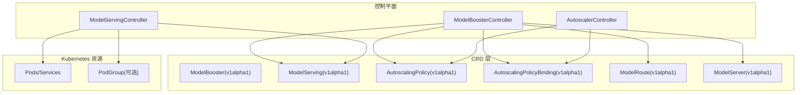
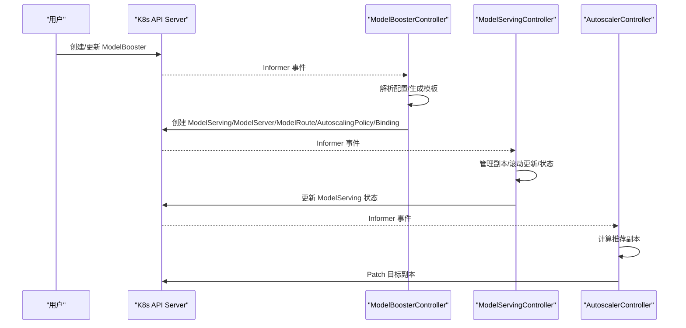
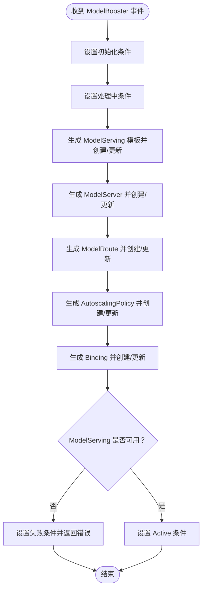
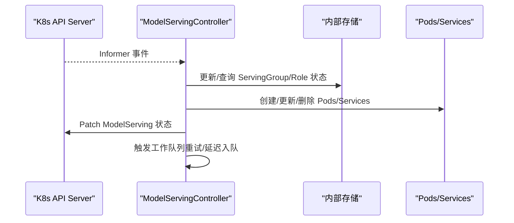
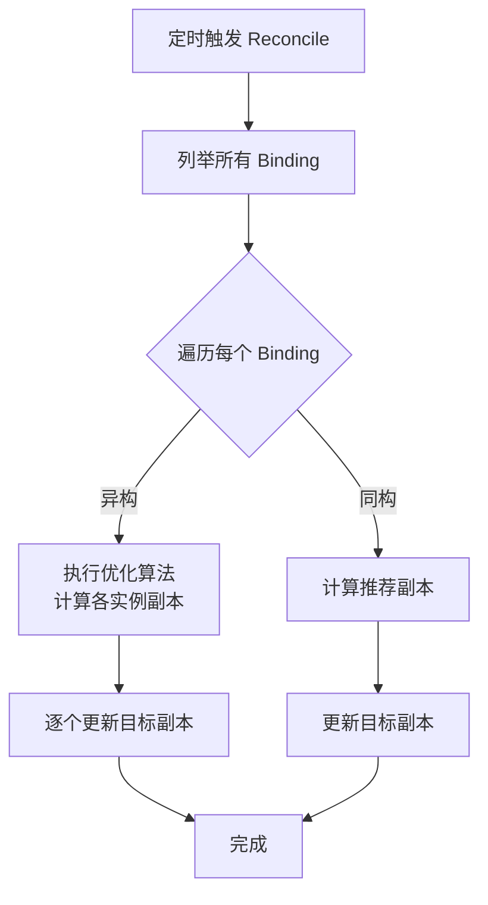
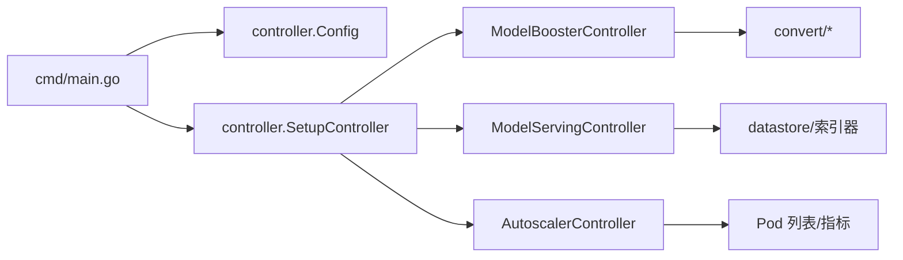

# 控制平面架构

<cite>
**本文引用的文件**
- [cmd/kthena-controller-manager/main.go](file://cmd/kthena-controller-manager/main.go)
- [pkg/controller/controller.go](file://pkg/controller/controller.go)
- [pkg/controller/config.go](file://pkg/controller/config.go)
- [pkg/model-booster-controller/controller/model_booster_controller.go](file://pkg/model-booster-controller/controller/model_booster_controller.go)
- [pkg/model-serving-controller/controller/model_serving_controller.go](file://pkg/model-serving-controller/controller/model_serving_controller.go)
- [pkg/autoscaler/controller/autoscale_controller.go](file://pkg/autoscaler/controller/autoscale_controller.go)
- [pkg/model-booster-controller/convert/model_serving.go](file://pkg/model-booster-controller/convert/model_serving.go)
- [pkg/model-booster-controller/convert/model_server.go](file://pkg/model-booster-controller/convert/model_server.go)
- [pkg/model-booster-controller/convert/model_route.go](file://pkg/model-booster-controller/convert/model_route.go)
- [pkg/model-booster-controller/convert/autoscaling.go](file://pkg/model-booster-controller/convert/autoscaling.go)
- [pkg/apis/workload/v1alpha1/model_booster_types.go](file://pkg/apis/workload/v1alpha1/model_booster_types.go)
- [pkg/apis/workload/v1alpha1/model_serving_types.go](file://pkg/apis/workload/v1alpha1/model_serving_types.go)
- [pkg/apis/workload/v1alpha1/autoscalingpolicy_types.go](file://pkg/apis/workload/v1alpha1/autoscalingpolicy_types.go)
- [pkg/apis/networking/v1alpha1/modelroute_types.go](file://pkg/apis/networking/v1alpha1/modelroute_types.go)
- [pkg/apis/networking/v1alpha1/modelserver_types.go](file://pkg/apis/networking/v1alpha1/modelserver_types.go)
</cite>

## 目录
1. [简介](#简介)
2. [项目结构](#项目结构)
3. [核心组件](#核心组件)
4. [架构总览](#架构总览)
5. [详细组件分析](#详细组件分析)
6. [依赖关系分析](#依赖关系分析)
7. [性能考量](#性能考量)
8. [故障排查指南](#故障排查指南)
9. [结论](#结论)
10. [附录](#附录)

## 简介
本文件面向平台管理员与开发者，系统化阐述 Kthena 控制平面的架构设计与实现细节。控制平面由三个核心控制器组成：ModelBoosterController、ModelServingController、AutoscalerController。它们通过 CRD 层次结构与资源转换流程，将高层声明式配置（如模型 Booster、模型服务、自动伸缩策略等）转化为底层 Kubernetes 资源（如 ModelServing、ModelServer、ModelRoute、AutoscalingPolicy 及其绑定），并维持状态同步、错误处理与健康检查。

## 项目结构
控制平面位于 cmd 与 pkg 两个层面：
- 启动入口：cmd/kthena-controller-manager/main.go 负责解析参数、初始化 Webhook、构建控制器配置，并调用 pkg/controller 进行控制器装配与运行。
- 控制器编排：pkg/controller/controller.go 统一初始化各控制器实例、设置 Informer 缓存同步、工作队列与领导者选举。
- 控制器实现：各控制器在独立子包中，分别负责资源转换、状态机与事件处理。
- CRD 定义：pkg/apis 下定义了 workload 与 networking 的 CRD 类型，作为控制面输入与状态的权威来源。

图示来源
- [cmd/kthena-controller-manager/main.go:54-111](file://cmd/kthena-controller-manager/main.go#L54-L111)
- [pkg/controller/controller.go:52-141](file://pkg/controller/controller.go#L52-L141)
- [pkg/apis/workload/v1alpha1/model_booster_types.go:26-48](file://pkg/apis/workload/v1alpha1/model_booster_types.go#L26-L48)
- [pkg/apis/workload/v1alpha1/model_serving_types.go:35-66](file://pkg/apis/workload/v1alpha1/model_serving_types.go#L35-L66)
- [pkg/apis/workload/v1alpha1/autoscalingpolicy_types.go:24-40](file://pkg/apis/workload/v1alpha1/autoscalingpolicy_types.go#L24-L40)
- [pkg/apis/networking/v1alpha1/modelroute_types.go:24-56](file://pkg/apis/networking/v1alpha1/modelroute_types.go#L24-L56)
- [pkg/apis/networking/v1alpha1/modelserver_types.go:23-50](file://pkg/apis/networking/v1alpha1/modelserver_types.go#L23-L50)

章节来源
- [cmd/kthena-controller-manager/main.go:54-111](file://cmd/kthena-controller-manager/main.go#L54-L111)
- [pkg/controller/controller.go:52-141](file://pkg/controller/controller.go#L52-L141)

## 核心组件
- ModelBoosterController：负责将 ModelBooster 的高层配置转换为 ModelServing、ModelServer、ModelRoute 以及 AutoscalingPolicy/Binding，并维护其状态条件。
- ModelServingController：管理 ModelServing 的副本、角色、滚动更新、就绪与失败处理、事件记录与 PodGroup 协调（若存在 CRD）。
- AutoscalerController：根据策略与绑定，周期性评估指标并更新目标副本数（支持同构与异构目标）。

章节来源
- [pkg/model-booster-controller/controller/model_booster_controller.go:53-81](file://pkg/model-booster-controller/controller/model_booster_controller.go#L53-L81)
- [pkg/model-serving-controller/controller/model_serving_controller.go:82-102](file://pkg/model-serving-controller/controller/model_serving_controller.go#L82-L102)
- [pkg/autoscaler/controller/autoscale_controller.go:47-62](file://pkg/autoscaler/controller/autoscale_controller.go#L47-L62)

## 架构总览
控制平面采用“声明式 + 控制循环”的模式：
- 用户提交 ModelBooster 等 CR；控制器监听并入队处理。
- ModelBoosterController 将高层配置转换为一组底层资源（ModelServing/ModelServer/ModelRoute/AutoscalingPolicy/Binding）。
- ModelServingController 负责实际工作负载的生命周期管理（Pods/Services/PodGroup）。
- AutoscalerController 周期性计算推荐副本并回写到目标资源。
- Webhook 提供准入校验与默认值注入，确保资源一致性与安全性。

图示来源
- [pkg/model-booster-controller/controller/model_booster_controller.go:188-233](file://pkg/model-booster-controller/controller/model_booster_controller.go#L188-L233)
- [pkg/model-serving-controller/controller/model_serving_controller.go:531-572](file://pkg/model-serving-controller/controller/model_serving_controller.go#L531-L572)
- [pkg/autoscaler/controller/autoscale_controller.go:122-171](file://pkg/autoscaler/controller/autoscale_controller.go#L122-L171)

## 详细组件分析

### ModelBoosterController：高层配置到底层资源的桥梁
职责与流程
- 监听 ModelBooster、ModelServing、ModelServer、ModelRoute、AutoscalingPolicy、AutoscalingPolicyBinding 的变更。
- 在每次 reconcile 中设置初始化/处理/成功/失败条件，逐步创建或更新对应资源。
- 通过转换模块将 ModelBooster.Spec.Backend 配置渲染为 ModelServing 模板，按后端类型（如 vLLM、vLLM Disaggregated）选择不同模板与命令。
- 生成对应的 ModelServer 与 ModelRoute，用于路由与流量接入。
- 生成 AutoscalingPolicy 与 Binding，限定最小/最大副本并绑定到目标 ModelServing。

关键数据结构与复杂度
- 使用 SharedIndexInformer 同步多类资源，缓存同步后进入工作队列进行处理。
- 条件状态机：初始化 → 处理中 → 成功/失败，避免重复工作。
- LoRA 更新场景使用 generation 特定缓存键，避免并发冲突。

图示来源
- [pkg/model-booster-controller/controller/model_booster_controller.go:188-233](file://pkg/model-booster-controller/controller/model_booster_controller.go#L188-L233)
- [pkg/model-booster-controller/convert/model_serving.go:56-73](file://pkg/model-booster-controller/convert/model_serving.go#L56-L73)
- [pkg/model-booster-controller/convert/model_server.go:37-92](file://pkg/model-booster-controller/convert/model_server.go#L37-L92)
- [pkg/model-booster-controller/convert/model_route.go:27-54](file://pkg/model-booster-controller/convert/model_route.go#L27-L54)
- [pkg/model-booster-controller/convert/autoscaling.go:27-43](file://pkg/model-booster-controller/convert/autoscaling.go#L27-L43)

章节来源
- [pkg/model-booster-controller/controller/model_booster_controller.go:53-115](file://pkg/model-booster-controller/controller/model_booster_controller.go#L53-L115)
- [pkg/model-booster-controller/controller/model_booster_controller.go:188-233](file://pkg/model-booster-controller/controller/model_booster_controller.go#L188-L233)
- [pkg/model-booster-controller/convert/model_serving.go:56-73](file://pkg/model-booster-controller/convert/model_serving.go#L56-L73)
- [pkg/model-booster-controller/convert/model_server.go:37-92](file://pkg/model-booster-controller/convert/model_server.go#L37-L92)
- [pkg/model-booster-controller/convert/model_route.go:27-54](file://pkg/model-booster-controller/convert/model_route.go#L27-L54)
- [pkg/model-booster-controller/convert/autoscaling.go:27-43](file://pkg/model-booster-controller/convert/autoscaling.go#L27-L43)

### ModelServingController：工作负载生命周期管理
职责与流程
- 监听 ModelServing、Pod、Service、PodGroup（可选）事件，维护内部存储与索引。
- 根据副本数变化执行扩容/缩容，支持分区更新与滚动策略。
- 处理 Pod 就绪/失败/删除事件，触发相应处理逻辑与重试/重建策略。
- 维护 ModelServing 的 Available/Progressing/UpdateInProgress 等状态条件。
- 与插件框架协作，按需注入环境变量、卷与容器命令。

关键数据结构与复杂度
- 使用索引器按 GroupName/RoleID 快速定位相关资源。
- 支持 ServingGroup/Role 两级滚动更新，保证更新过程中的稳定性。
- 通过 ControllerRevision 管理模板版本，确保回滚与恢复。

图示来源
- [pkg/model-serving-controller/controller/model_serving_controller.go:196-247](file://pkg/model-serving-controller/controller/model_serving_controller.go#L196-L247)
- [pkg/model-serving-controller/controller/model_serving_controller.go:531-572](file://pkg/model-serving-controller/controller/model_serving_controller.go#L531-L572)
- [pkg/model-serving-controller/controller/model_serving_controller.go:626-794](file://pkg/model-serving-controller/controller/model_serving_controller.go#L626-L794)

章节来源
- [pkg/model-serving-controller/controller/model_serving_controller.go:82-102](file://pkg/model-serving-controller/controller/model_serving_controller.go#L82-L102)
- [pkg/model-serving-controller/controller/model_serving_controller.go:196-247](file://pkg/model-serving-controller/controller/model_serving_controller.go#L196-L247)
- [pkg/model-serving-controller/controller/model_serving_controller.go:531-572](file://pkg/model-serving-controller/controller/model_serving_controller.go#L531-L572)
- [pkg/model-serving-controller/controller/model_serving_controller.go:626-794](file://pkg/model-serving-controller/controller/model_serving_controller.go#L626-L794)

### AutoscalerController：基于策略的目标伸缩
职责与流程
- 周期性遍历所有 AutoscalingPolicyBinding，按绑定类型选择同构或异构优化路径。
- 对同构目标，计算推荐副本并直接 Patch 到目标（ModelServing 或其 Role）。
- 对异构目标，基于多实例参数进行优化分配，再逐个更新目标副本。
- 维护 scaler/optimizer 实例映射，当策略或绑定变更时重建。

图示来源
- [pkg/autoscaler/controller/autoscale_controller.go:122-171](file://pkg/autoscaler/controller/autoscale_controller.go#L122-L171)
- [pkg/autoscaler/controller/autoscale_controller.go:251-348](file://pkg/autoscaler/controller/autoscale_controller.go#L251-L348)

章节来源
- [pkg/autoscaler/controller/autoscale_controller.go:47-62](file://pkg/autoscaler/controller/autoscale_controller.go#L47-L62)
- [pkg/autoscaler/controller/autoscale_controller.go:122-171](file://pkg/autoscaler/controller/autoscale_controller.go#L122-L171)
- [pkg/autoscaler/controller/autoscale_controller.go:251-348](file://pkg/autoscaler/controller/autoscale_controller.go#L251-L348)

## 依赖关系分析
- 控制器装配：cmd/main.go 通过 pkg/controller 初始化并启动控制器，支持领导者选举与工作线程数配置。
- 资源转换：ModelBoosterController 依赖转换模块将高层配置渲染为 ModelServing/ModelServer/ModelRoute/AutoscalingPolicy/Binding。
- 状态同步：各控制器通过 Informer 与工作队列实现事件驱动的状态同步；ModelServingController 还维护内部存储以加速查询。
- 错误处理：统一采用 rate-limited 重试与错误日志记录，失败时设置失败条件或延迟重试。

图示来源
- [cmd/kthena-controller-manager/main.go:54-111](file://cmd/kthena-controller-manager/main.go#L54-L111)
- [pkg/controller/controller.go:52-141](file://pkg/controller/controller.go#L52-L141)
- [pkg/controller/config.go:19-27](file://pkg/controller/config.go#L19-L27)

章节来源
- [cmd/kthena-controller-manager/main.go:54-111](file://cmd/kthena-controller-manager/main.go#L54-L111)
- [pkg/controller/controller.go:52-141](file://pkg/controller/controller.go#L52-L141)
- [pkg/controller/config.go:19-27](file://pkg/controller/config.go#L19-L27)

## 性能考量
- Informer 缓存与索引：ModelServingController 为 Pods/Services 注册索引器，显著降低查询成本。
- 工作队列退避：控制器普遍采用指数退避与速率限制，避免抖动与 API 压力。
- 分区更新与滚动策略：ModelServingController 支持分区与角色级滚动，减少更新窗口内的不一致。
- 自动伸缩周期：AutoscalerController 以固定周期扫描，避免高频变更带来的开销。

## 故障排查指南
常见问题与定位建议
- 控制器未启动或未成为领导者
  - 检查领导者选举开关与命名空间、租约配置。
  - 关注日志中“Start as leader”“leader election lost”等信息。
- ModelBooster 无法进入 Active
  - 检查 ModelServing 是否全部可用（Available 条件为 True）。
  - 查看失败条件与错误日志，确认转换与创建是否成功。
- ModelServing 滚动更新卡住
  - 检查分区配置与当前/更新修订号，确认索引器是否正确。
  - 关注 Pod 失败/重启事件与控制器错误日志。
- 自动伸缩未生效
  - 确认策略与绑定是否存在、目标引用是否正确。
  - 检查指标采集与 Pod 列表是否可读。

章节来源
- [pkg/model-serving-controller/controller/model_serving_controller.go:317-370](file://pkg/model-serving-controller/controller/model_serving_controller.go#L317-L370)
- [pkg/autoscaler/controller/autoscale_controller.go:122-171](file://pkg/autoscaler/controller/autoscale_controller.go#L122-L171)

## 结论
Kthena 控制平面通过清晰的三层抽象（高层声明、资源转换、底层执行）实现了从模型 Booster 到工作负载与路由的完整闭环。三个核心控制器职责明确、协作有序：ModelBoosterController 负责“蓝图生成”，ModelServingController 负责“执行落地”，AutoscalerController 负责“弹性保障”。借助 Informer、工作队列与状态机，系统具备良好的可观测性、可恢复性与扩展性。

## 附录

### 启动流程与健康检查
- 启动流程
  - 解析命令行参数与配置，初始化 klog。
  - 可选启动 Webhook 服务器（证书自动生成/加载、健康检查端点）。
  - 构建控制器配置并调用统一装配函数。
  - 若启用领导者选举，则仅一个实例对外提供服务。
- 健康检查
  - Webhook 服务器提供 /healthz 探针，返回 OK 表示服务可用。

章节来源
- [cmd/kthena-controller-manager/main.go:54-111](file://cmd/kthena-controller-manager/main.go#L54-L111)
- [cmd/kthena-controller-manager/main.go:202-207](file://cmd/kthena-controller-manager/main.go#L202-L207)
- [pkg/controller/controller.go:126-141](file://pkg/controller/controller.go#L126-L141)

### CRD 层次结构与资源转换
- ModelBooster → ModelServing/ModelServer/ModelRoute/AutoscalingPolicy/Binding
- ModelServing → Pods/Services/PodGroup（可选）
- AutoscalingPolicy/Binding → 目标（ModelServing 或其 Role）

章节来源
- [pkg/apis/workload/v1alpha1/model_booster_types.go:26-48](file://pkg/apis/workload/v1alpha1/model_booster_types.go#L26-L48)
- [pkg/apis/workload/v1alpha1/model_serving_types.go:35-66](file://pkg/apis/workload/v1alpha1/model_serving_types.go#L35-L66)
- [pkg/apis/workload/v1alpha1/autoscalingpolicy_types.go:24-40](file://pkg/apis/workload/v1alpha1/autoscalingpolicy_types.go#L24-L40)
- [pkg/apis/networking/v1alpha1/modelroute_types.go:24-56](file://pkg/apis/networking/v1alpha1/modelroute_types.go#L24-L56)
- [pkg/apis/networking/v1alpha1/modelserver_types.go:23-50](file://pkg/apis/networking/v1alpha1/modelserver_types.go#L23-L50)