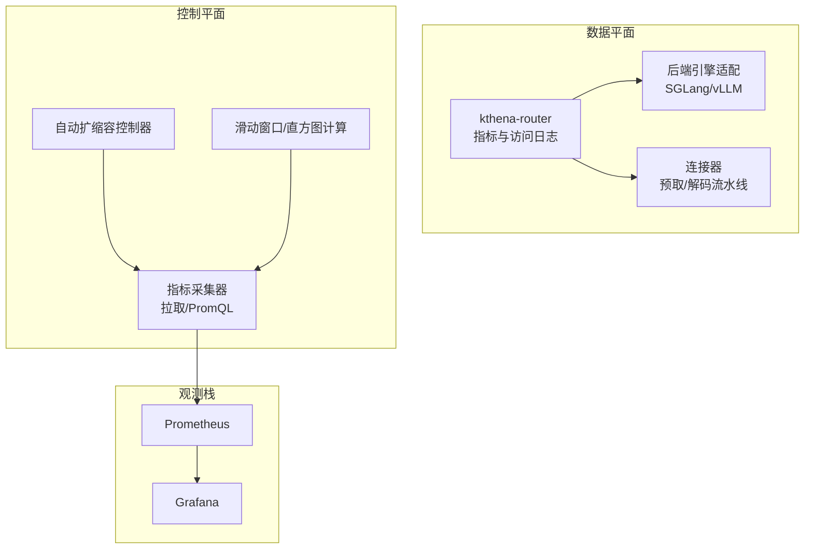
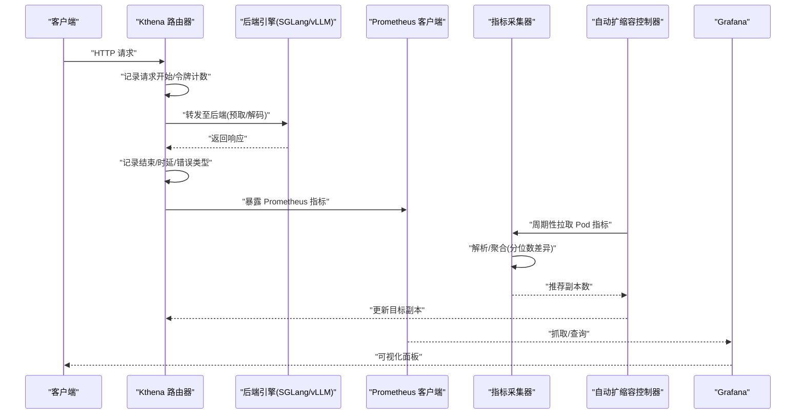
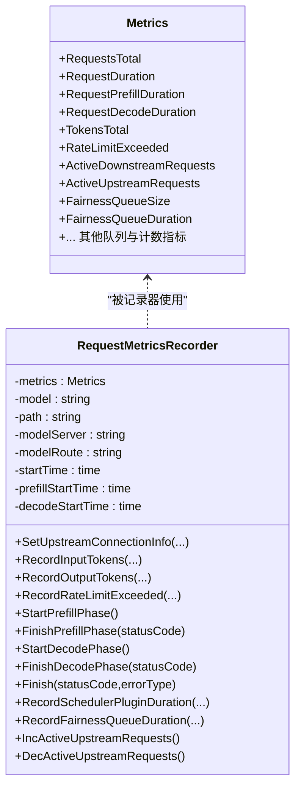
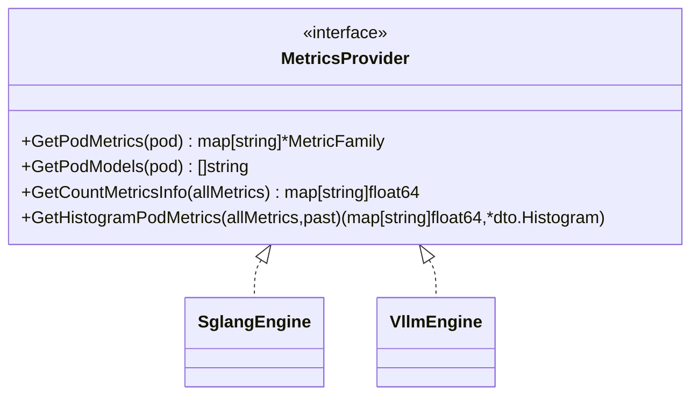
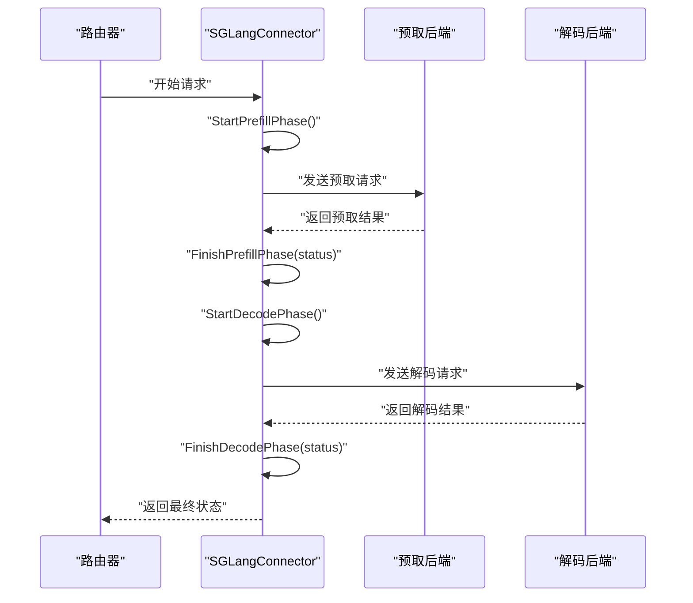
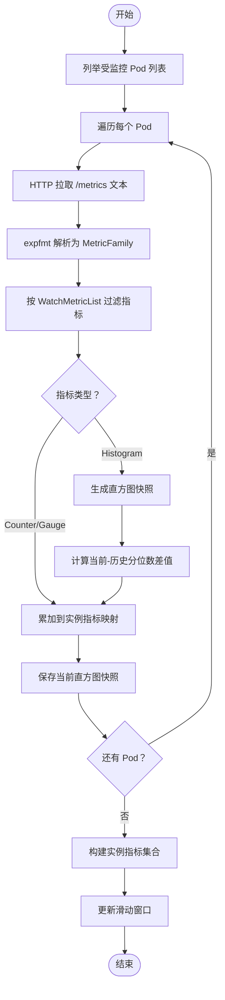
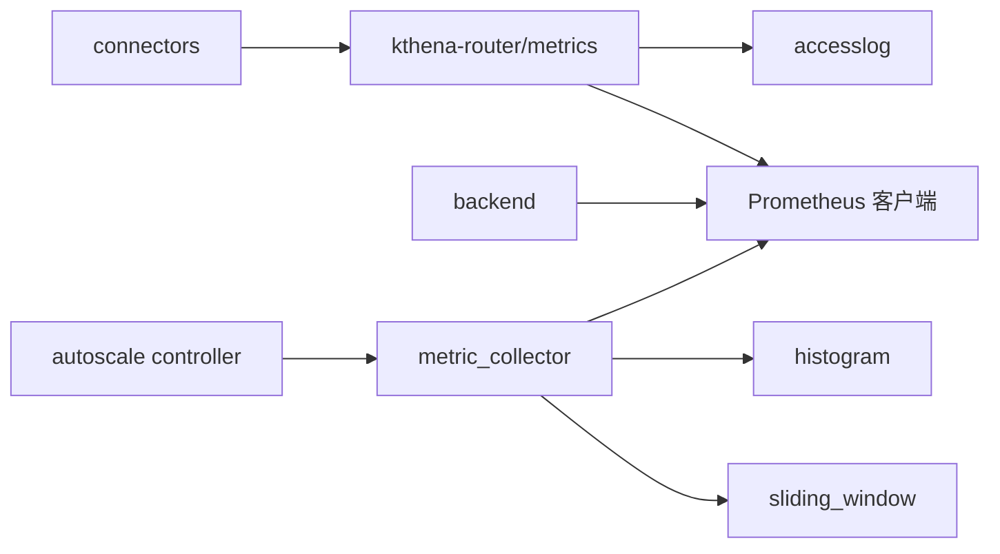

# 指标监控

<cite>
**本文引用的文件**   
- [pkg/kthena-router/metrics/metrics.go](file://pkg/kthena-router/metrics/metrics.go)
- [pkg/kthena-router/backend/backend.go](file://pkg/kthena-router/backend/backend.go)
- [pkg/kthena-router/connectors/sglang.go](file://pkg/kthena-router/connectors/sglang.go)
- [pkg/kthena-router/scheduler/plugins/tokenization/vllm.go](file://pkg/kthena-router/scheduler/plugins/tokenization/vllm.go)
- [pkg/autoscaler/autoscaler/metric_collector.go](file://pkg/autoscaler/autoscaler/metric_collector.go)
- [pkg/autoscaler/controller/autoscale_controller.go](file://pkg/autoscaler/controller/autoscale_controller.go)
- [pkg/autoscaler/datastructure/sliding_window.go](file://pkg/autoscaler/datastructure/sliding_window.go)
- [pkg/autoscaler/histogram/histogram.go](file://pkg/autoscaler/histogram/histogram.go)
- [docs/kthena/docs/general/prometheus.md](file://docs/kthena/docs/general/prometheus.md)
- [docs/kthena/docs/user-guide/router-observability.md](file://docs/kthena/docs/user-guide/router-observability.md)
- [docs/kthena/docs/reference/router-access-log-fields.md](file://docs/kthena/docs/reference/router-access-log-fields.md)
- [pkg/kthena-router/accesslog/logger.go](file://pkg/kthena-router/accesslog/logger.go)
- [pkg/kthena-router/accesslog/types.go](file://pkg/kthena-router/accesslog/types.go)
</cite>

## 目录
1. [简介](#简介)
2. [项目结构](#项目结构)
3. [核心组件](#核心组件)
4. [架构总览](#架构总览)
5. [详细组件分析](#详细组件分析)
6. [依赖分析](#依赖分析)
7. [性能考量](#性能考量)
8. [故障排查指南](#故障排查指南)
9. [结论](#结论)
10. [附录](#附录)

## 简介
本文件面向 Kthena 指标监控系统，聚焦数据平面如何采集与暴露关键性能指标（请求延迟、吞吐量、资源利用率、错误率等），覆盖不同推理引擎后端的指标采集机制与数据格式，阐述指标聚合策略、时间窗口与采样频率配置，并给出 Prometheus 导出格式与 Grafana 可视化建议，以及指标在自动扩缩容决策中的作用与反馈机制。同时提供运维配置指南与告警策略。

## 项目结构
围绕指标监控的关键代码分布在以下模块：
- 路由器指标与访问日志：kthena-router/metrics、kthena-router/accesslog
- 引擎后端指标适配：kthena-router/backend
- 连接器与推理流程：kthena-router/connectors
- 自动扩缩容控制器与指标采集：autoscaler/controller、autoscaler/autoscaler、autoscaler/datastructure、autoscaler/histogram
- 文档与参考：docs 下的 Prometheus 集成、可观测性与访问日志字段说明

**图表来源**
- [pkg/kthena-router/metrics/metrics.go:54-85](file://pkg/kthena-router/metrics/metrics.go#L54-L85)
- [pkg/kthena-router/backend/backend.go:30-40](file://pkg/kthena-router/backend/backend.go#L30-L40)
- [pkg/kthena-router/connectors/sglang.go:42-95](file://pkg/kthena-router/connectors/sglang.go#L42-L95)
- [pkg/autoscaler/controller/autoscale_controller.go:47-62](file://pkg/autoscaler/controller/autoscale_controller.go#L47-L62)
- [pkg/autoscaler/autoscaler/metric_collector.go:43-49](file://pkg/autoscaler/autoscaler/metric_collector.go#L43-L49)
- [pkg/autoscaler/datastructure/sliding_window.go:185-237](file://pkg/autoscaler/datastructure/sliding_window.go#L185-L237)
- [pkg/autoscaler/histogram/histogram.go:27-59](file://pkg/autoscaler/histogram/histogram.go#L27-L59)

**章节来源**
- [pkg/kthena-router/metrics/metrics.go:54-85](file://pkg/kthena-router/metrics/metrics.go#L54-L85)
- [pkg/kthena-router/backend/backend.go:30-40](file://pkg/kthena-router/backend/backend.go#L30-L40)
- [pkg/autoscaler/controller/autoscale_controller.go:47-62](file://pkg/autoscaler/controller/autoscale_controller.go#L47-L62)

## 核心组件
- 路由器指标体系：统一注册并暴露请求总量、时延分布（含预取/解码阶段）、令牌计数、速率限制、活跃请求数、公平队列状态等指标。
- 后端引擎指标适配：通过接口抽象不同推理引擎（如 SGLang、vLLM）的指标获取与直方图差异量化方法。
- 自动扩缩容指标采集：定时从目标 Pod 拉取 Prometheus 文本指标，解析并按策略（如分位数差值）聚合，驱动扩缩容决策。
- 访问日志：结构化输出每次请求的完整时序与关键元信息，便于离线分析与审计。

**章节来源**
- [pkg/kthena-router/metrics/metrics.go:54-85](file://pkg/kthena-router/metrics/metrics.go#L54-L85)
- [pkg/kthena-router/backend/backend.go:30-40](file://pkg/kthena-router/backend/backend.go#L30-L40)
- [pkg/autoscaler/autoscaler/metric_collector.go:98-129](file://pkg/autoscaler/autoscaler/metric_collector.go#L98-L129)

## 架构总览
下图展示从请求进入路由器到指标采集与可视化的全链路：

**图表来源**
- [pkg/kthena-router/metrics/metrics.go:225-290](file://pkg/kthena-router/metrics/metrics.go#L225-L290)
- [pkg/kthena-router/connectors/sglang.go:86-195](file://pkg/kthena-router/connectors/sglang.go#L86-L195)
- [pkg/autoscaler/autoscaler/metric_collector.go:131-183](file://pkg/autoscaler/autoscaler/metric_collector.go#L131-L183)
- [pkg/autoscaler/controller/autoscale_controller.go:251-348](file://pkg/autoscaler/controller/autoscale_controller.go#L251-L348)
- [docs/kthena/docs/general/prometheus.md:34-96](file://docs/kthena/docs/general/prometheus.md#L34-L96)

## 详细组件分析

### 路由器指标与访问日志
- 指标定义与注册：包含请求总量、端到端与阶段时延直方图、令牌计数、速率限制计数、活跃上游/下游请求数、公平队列规模与时延等。
- 记录器：支持按请求粒度记录预取/解码阶段时延、令牌使用、速率限制触发、插件执行时延等。
- 访问日志：结构化 JSON 输出，包含时间戳、方法、路径、协议、状态码、模型/路由/服务器/选中 Pod、请求 ID、输入/输出令牌数、总时延与各阶段耗时、错误信息等。

**图表来源**
- [pkg/kthena-router/metrics/metrics.go:54-85](file://pkg/kthena-router/metrics/metrics.go#L54-L85)
- [pkg/kthena-router/metrics/metrics.go:341-448](file://pkg/kthena-router/metrics/metrics.go#L341-L448)

**章节来源**
- [pkg/kthena-router/metrics/metrics.go:54-85](file://pkg/kthena-router/metrics/metrics.go#L54-L85)
- [pkg/kthena-router/metrics/metrics.go:225-448](file://pkg/kthena-router/metrics/metrics.go#L225-L448)
- [pkg/kthena-router/accesslog/logger.go:28-61](file://pkg/kthena-router/accesslog/logger.go#L28-L61)
- [pkg/kthena-router/accesslog/types.go:23-40](file://pkg/kthena-router/accesslog/types.go#L23-L40)
- [docs/kthena/docs/user-guide/router-observability.md:61-118](file://docs/kthena/docs/user-guide/router-observability.md#L61-L118)
- [docs/kthena/docs/reference/router-access-log-fields.md:83-123](file://docs/kthena/docs/reference/router-access-log-fields.md#L83-L123)

### 后端引擎指标适配与数据格式
- 接口抽象：通过 MetricsProvider 抽象不同引擎的指标获取、计数型与直方图型指标处理。
- 引擎注册：当前注册 SGLang 与 vLLM 提供者；可扩展其他引擎。
- 直方图差异：对同一指标的当前与历史直方图进行分位数差值计算，用于检测趋势变化。

**图表来源**
- [pkg/kthena-router/backend/backend.go:30-40](file://pkg/kthena-router/backend/backend.go#L30-L40)
- [pkg/kthena-router/backend/backend.go:67-72](file://pkg/kthena-router/backend/backend.go#L67-L72)

**章节来源**
- [pkg/kthena-router/backend/backend.go:30-40](file://pkg/kthena-router/backend/backend.go#L30-L40)
- [pkg/kthena-router/backend/backend.go:42-65](file://pkg/kthena-router/backend/backend.go#L42-L65)

### 连接器与推理流程中的指标采集
- SGLang 连接器：在预取/解码阶段分别记录阶段时延，结合路由器记录器完成端到端指标。
- vLLM 适配：提供分词接口适配，便于令牌统计与长度控制。

**图表来源**
- [pkg/kthena-router/connectors/sglang.go:86-195](file://pkg/kthena-router/connectors/sglang.go#L86-L195)
- [pkg/kthena-router/metrics/metrics.go:388-420](file://pkg/kthena-router/metrics/metrics.go#L388-L420)

**章节来源**
- [pkg/kthena-router/connectors/sglang.go:86-195](file://pkg/kthena-router/connectors/sglang.go#L86-L195)
- [pkg/kthena-router/scheduler/plugins/tokenization/vllm.go:24-40](file://pkg/kthena-router/scheduler/plugins/tokenization/vllm.go#L24-L40)

### 自动扩缩容指标采集与聚合
- 拉取与解析：从目标 Pod 的指标端点拉取 Prometheus 文本格式，解析计数、仪表盘与直方图指标。
- 聚合策略：对直方图采用“当前快照与历史快照的分位数差值”策略，过滤不匹配指标，确保仅关注目标指标。
- 时间窗口与采样：滑动窗口记录历史直方图快照，支持新鲜度判定与过期清理；采样周期由控制器同步周期与上下文超时控制。
- 决策闭环：控制器根据推荐副本数更新目标工作负载副本数，形成“采集→聚合→决策→执行”的闭环。

**图表来源**
- [pkg/autoscaler/autoscaler/metric_collector.go:131-183](file://pkg/autoscaler/autoscaler/metric_collector.go#L131-L183)
- [pkg/autoscaler/autoscaler/metric_collector.go:185-241](file://pkg/autoscaler/autoscaler/metric_collector.go#L185-L241)
- [pkg/autoscaler/histogram/histogram.go:61-122](file://pkg/autoscaler/histogram/histogram.go#L61-L122)
- [pkg/autoscaler/datastructure/sliding_window.go:185-237](file://pkg/autoscaler/datastructure/sliding_window.go#L185-L237)

**章节来源**
- [pkg/autoscaler/autoscaler/metric_collector.go:98-129](file://pkg/autoscaler/autoscaler/metric_collector.go#L98-L129)
- [pkg/autoscaler/autoscaler/metric_collector.go:131-183](file://pkg/autoscaler/autoscaler/metric_collector.go#L131-L183)
- [pkg/autoscaler/autoscaler/metric_collector.go:185-241](file://pkg/autoscaler/autoscaler/metric_collector.go#L185-L241)
- [pkg/autoscaler/histogram/histogram.go:61-122](file://pkg/autoscaler/histogram/histogram.go#L61-L122)
- [pkg/autoscaler/datastructure/sliding_window.go:185-237](file://pkg/autoscaler/datastructure/sliding_window.go#L185-L237)
- [pkg/autoscaler/controller/autoscale_controller.go:251-348](file://pkg/autoscaler/controller/autoscale_controller.go#L251-L348)

## 依赖分析
- 组件耦合与内聚：路由器指标与访问日志内聚于单一包；后端引擎适配通过接口解耦具体实现；自动扩缩容控制器通过指标采集器与滑动窗口/直方图模块解耦数据源与聚合算法。
- 外部依赖：Prometheus 客户端库、Prometheus 文本解码器、Kubernetes 客户端与 Informers。
- 潜在循环依赖：未见直接循环；控制器依赖采集器与数据结构模块，采集器依赖直方图与滑动窗口，形成清晰单向依赖。

**图表来源**
- [pkg/kthena-router/metrics/metrics.go:19-24](file://pkg/kthena-router/metrics/metrics.go#L19-L24)
- [pkg/kthena-router/backend/backend.go:22-28](file://pkg/kthena-router/backend/backend.go#L22-L28)
- [pkg/autoscaler/autoscaler/metric_collector.go:27-41](file://pkg/autoscaler/autoscaler/metric_collector.go#L27-L41)
- [pkg/autoscaler/datastructure/sliding_window.go:19-22](file://pkg/autoscaler/datastructure/sliding_window.go#L19-L22)
- [pkg/autoscaler/histogram/histogram.go:24-25](file://pkg/autoscaler/histogram/histogram.go#L24-L25)

**章节来源**
- [pkg/kthena-router/metrics/metrics.go:19-24](file://pkg/kthena-router/metrics/metrics.go#L19-L24)
- [pkg/kthena-router/backend/backend.go:22-28](file://pkg/kthena-router/backend/backend.go#L22-L28)
- [pkg/autoscaler/autoscaler/metric_collector.go:27-41](file://pkg/autoscaler/autoscaler/metric_collector.go#L27-L41)

## 性能考量
- 指标开销：直方图与滑动窗口操作为 O(1) 均摊，但需注意快照数量与标签基数；建议合理设置标签维度与桶数量。
- 采样与聚合：分位数差值计算避免了全量直方图合并，降低内存与 CPU 开销；新鲜度窗口可减少无效快照。
- I/O 与网络：指标拉取采用短超时与并发遍历，建议结合服务发现与重试策略，避免抖动放大。
- 访问日志：JSON 格式更利于下游处理；文本格式适合本地调试；建议生产环境启用 JSON 并控制输出位置。

[本节为通用指导，无需特定文件引用]

## 故障排查指南
- 指标缺失或为空：检查目标 Pod 是否正确暴露 /metrics、端口与路径是否匹配、标签选择器是否正确。
- 分位数差值异常：确认当前与历史直方图快照是否来自同一指标且桶一致；检查滑动窗口新鲜度判定。
- 扩缩容不生效：核对策略绑定、目标引用、当前副本数与推荐副本数；检查控制器日志与上下文超时。
- 访问日志问题：确认日志格式与输出配置；检查 JSON 序列化与写入权限。

**章节来源**
- [pkg/autoscaler/autoscaler/metric_collector.go:155-175](file://pkg/autoscaler/autoscaler/metric_collector.go#L155-L175)
- [pkg/autoscaler/autoscaler/metric_collector.go:214-234](file://pkg/autoscaler/autoscaler/metric_collector.go#L214-L234)
- [pkg/autoscaler/controller/autoscale_controller.go:173-222](file://pkg/autoscaler/controller/autoscale_controller.go#L173-L222)
- [pkg/kthena-router/accesslog/logger.go:70-98](file://pkg/kthena-router/accesslog/logger.go#L70-L98)

## 结论
Kthena 通过统一的路由器指标体系、引擎后端适配与自动扩缩容指标采集，实现了对请求延迟、吞吐量、资源利用率与错误率的全面监控。结合 Prometheus 与 Grafana，可快速构建可视化与告警体系；通过分位数差异等聚合策略，有效支撑扩缩容决策与运行稳定性保障。

[本节为总结，无需特定文件引用]

## 附录

### Prometheus 指标导出与 Grafana 可视化建议
- 指标命名与单位：遵循 Prometheus 命名规范，使用 _total、_seconds、_bytes 等后缀与单位。
- 关键指标清单：请求总量、端到端与阶段时延直方图、令牌计数、速率限制计数、活跃请求数、公平队列规模与时延等。
- 服务发现与抓取：通过 ServiceMonitor 或静态配置抓取 /metrics；合理设置抓取间隔与超时。
- Grafana 面板：包含请求速率、P95/P99 延迟、错误率、活跃模型数、按模型的请求率、内存/GPU 使用、扩缩容副本数等。

**章节来源**
- [docs/kthena/docs/general/prometheus.md:123-196](file://docs/kthena/docs/general/prometheus.md#L123-L196)
- [docs/kthena/docs/general/prometheus.md:198-402](file://docs/kthena/docs/general/prometheus.md#L198-L402)
- [docs/kthena/docs/general/prometheus.md:458-615](file://docs/kthena/docs/general/prometheus.md#L458-L615)

### 自动扩缩容决策与反馈机制
- 目标指标：控制器依据策略绑定的目标指标与阈值，从 Pod 指标端点拉取并聚合，计算推荐副本数。
- 时间窗口与采样：滑动窗口记录历史直方图快照，新鲜度判定避免陈旧数据影响；采样周期与上下文超时控制整体节奏。
- 反馈闭环：控制器更新目标工作负载副本数，形成“采集→聚合→决策→执行”的闭环，持续优化服务性能与成本。

**章节来源**
- [pkg/autoscaler/controller/autoscale_controller.go:251-348](file://pkg/autoscaler/controller/autoscale_controller.go#L251-L348)
- [pkg/autoscaler/autoscaler/metric_collector.go:98-129](file://pkg/autoscaler/autoscaler/metric_collector.go#L98-L129)
- [pkg/autoscaler/datastructure/sliding_window.go:185-237](file://pkg/autoscaler/datastructure/sliding_window.go#L185-L237)
- [pkg/autoscaler/histogram/histogram.go:61-122](file://pkg/autoscaler/histogram/histogram.go#L61-L122)

### 运维配置指南与告警策略
- 配置要点：启用访问日志（JSON 格式）、合理设置抓取间隔、标签保留策略、告警路由与静默规则。
- 告警示例：服务不可用、高延迟、高错误率、资源高占用、模型加载失败、扩缩容异常等。

**章节来源**
- [docs/kthena/docs/user-guide/router-observability.md:94-118](file://docs/kthena/docs/user-guide/router-observability.md#L94-L118)
- [docs/kthena/docs/general/prometheus.md:519-615](file://docs/kthena/docs/general/prometheus.md#L519-L615)