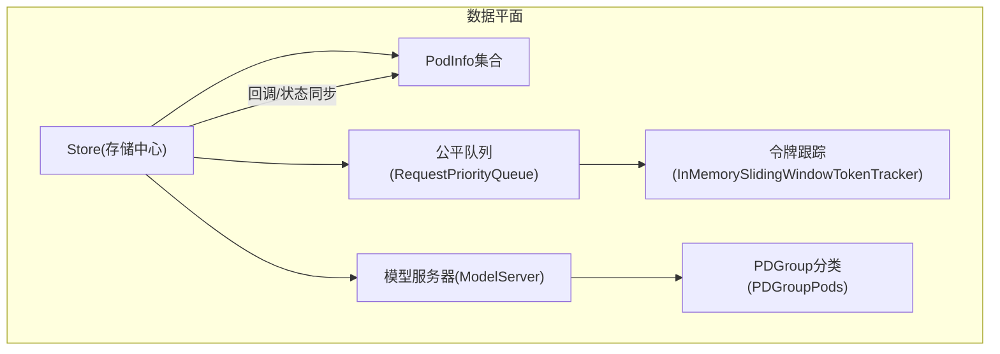
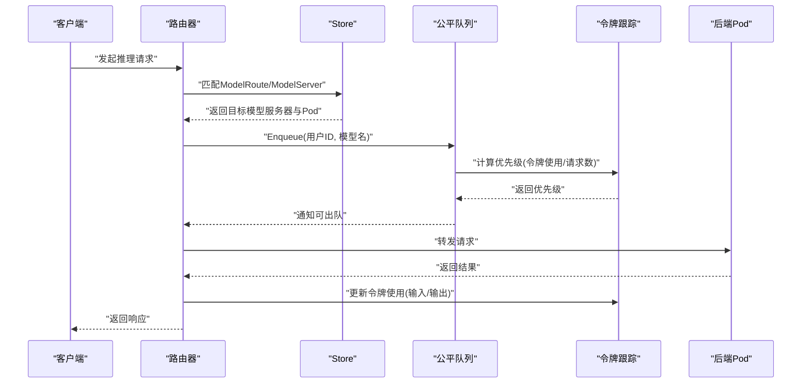
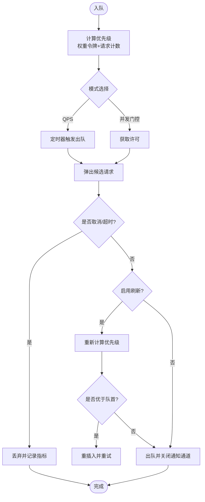
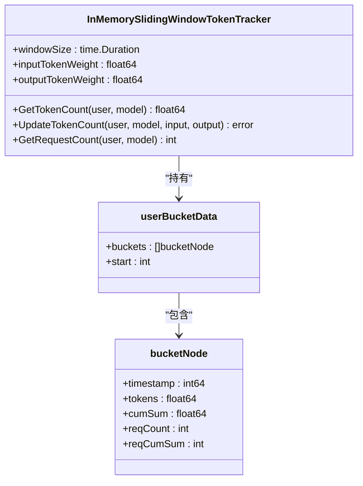
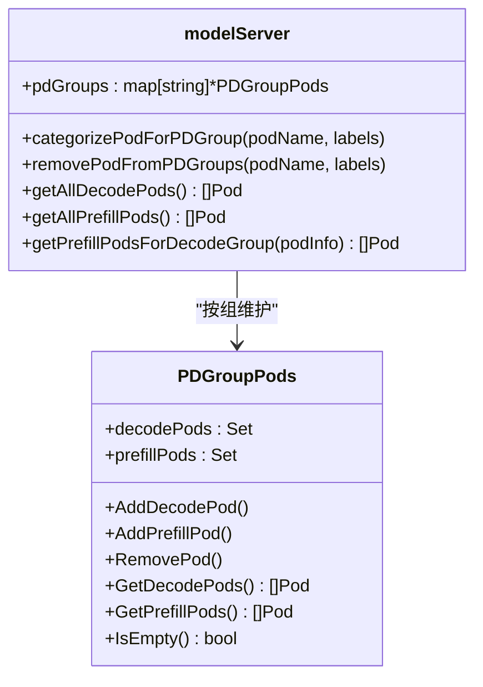
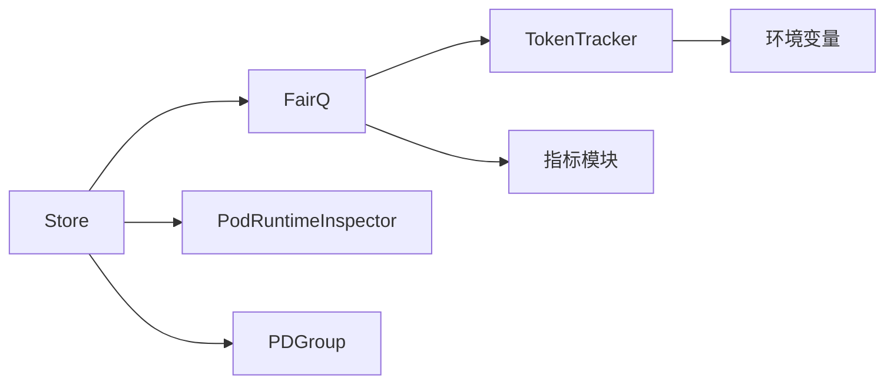

# 数据存储管理

<cite>
**本文引用的文件**
- [store.go](file://pkg/kthena-router/datastore/store.go)
- [model_server.go](file://pkg/kthena-router/datastore/model_server.go)
- [pdgroup_pods.go](file://pkg/kthena-router/datastore/pdgroup_pods.go)
- [fairness_queue.go](file://pkg/kthena-router/datastore/fairness_queue.go)
- [token_tracker.go](file://pkg/kthena-router/datastore/token_tracker.go)
- [rate-limit.md](file://docs/kthena/docs/user-guide/rate-limit.md)
- [fairness-scheduling.md](file://docs/kthena/docs/user-guide/fairness-scheduling.md)
- [router-observability.md](file://docs/kthena/docs/user-guide/router-observability.md)
- [lru.go](file://pkg/kthena-router/scheduler/plugins/cache/lru.go)
</cite>

## 目录
1. [简介](#简介)
2. [项目结构](#项目结构)
3. [核心组件](#核心组件)
4. [架构总览](#架构总览)
5. [详细组件分析](#详细组件分析)
6. [依赖关系分析](#依赖关系分析)
7. [性能考量与调优](#性能考量与调优)
8. [故障排查指南](#故障排查指南)
9. [结论](#结论)
10. [附录：环境变量与配置参考](#附录环境变量与配置参考)

## 简介
本技术文档聚焦于 Kthena 数据平面中的“数据存储管理”子系统，系统性阐述其如何维护模型服务器状态、排队队列与令牌跟踪等关键数据结构；深入解析公平队列的实现机制（队列管理、优先级计算、饥饿避免）；说明令牌跟踪系统如何支撑速率限制与并发控制；介绍预取-解码分组（PDGroup）的 Pod 管理与状态同步策略；并总结内存管理、缓存策略与持久化选项，最后给出面向系统工程师的性能调优与故障排查建议。

## 项目结构
数据存储管理位于 kthena-router 的 datastore 包中，围绕以下核心模块组织：
- 存储中心：统一持有模型服务器、Pod、路由、网关、推理池等资源的内存视图，并提供查询与回调机制
- 公平队列：按模型维度维护优先队列，结合令牌跟踪进行用户公平调度
- 令牌跟踪：基于滑动窗口统计用户在模型上的 token 使用量，用于公平评分与速率限制
- PDGroup 分类：按标签对 Pod 进行预取/解码分组，提升调度效率
- 缓存与可观测：提供 LRU 缓存接口与丰富的 Prometheus 指标

图表来源
- [store.go:280-342](file://pkg/kthena-router/datastore/store.go#L280-L342)
- [fairness_queue.go:102-145](file://pkg/kthena-router/datastore/fairness_queue.go#L102-L145)
- [token_tracker.go:56-110](file://pkg/kthena-router/datastore/token_tracker.go#L56-L110)
- [model_server.go:27-45](file://pkg/kthena-router/datastore/model_server.go#L27-L45)
- [pdgroup_pods.go:26-39](file://pkg/kthena-router/datastore/pdgroup_pods.go#L26-L39)

章节来源
- [store.go:161-240](file://pkg/kthena-router/datastore/store.go#L161-L240)
- [model_server.go:27-45](file://pkg/kthena-router/datastore/model_server.go#L27-L45)
- [pdgroup_pods.go:26-39](file://pkg/kthena-router/datastore/pdgroup_pods.go#L26-L39)
- [fairness_queue.go:31-64](file://pkg/kthena-router/datastore/fairness_queue.go#L31-L64)
- [token_tracker.go:27-32](file://pkg/kthena-router/datastore/token_tracker.go#L27-L32)

## 核心组件
- 存储中心 Store：统一管理模型服务器、Pod、路由、网关、推理池等资源；提供增删改查、匹配路由、回调注册、运行时指标更新与公平队列入队等能力
- 公平队列 RequestPriorityQueue：基于堆的优先队列，支持 QPS 模式与并发门控模式，具备请求取消、超时、优先级刷新与堆重建保护
- 令牌跟踪 TokenTracker：基于滑动窗口的令牌计数器，支持输入/输出权重，提供 per-user/per-model 的 token 总量与请求数统计
- 模型服务器 modelServer：记录 Pod 集合与 PDGroup 分类映射，支持按组检索解码/预取 Pod
- PDGroupPods：按 PD 组值维护解码/预取 Pod 集合，支持增删与空判定
- 回调与状态同步：通过回调函数对外广播资源变更事件，便于上层控制器或插件响应

章节来源
- [store.go:161-240](file://pkg/kthena-router/datastore/store.go#L161-L240)
- [fairness_queue.go:102-145](file://pkg/kthena-router/datastore/fairness_queue.go#L102-L145)
- [token_tracker.go:34-40](file://pkg/kthena-router/datastore/token_tracker.go#L34-L40)
- [model_server.go:27-45](file://pkg/kthena-router/datastore/model_server.go#L27-L45)
- [pdgroup_pods.go:26-39](file://pkg/kthena-router/datastore/pdgroup_pods.go#L26-L39)

## 架构总览
数据平面以 Store 为核心枢纽，围绕以下流程运转：
- 资源生命周期：接收模型服务器、Pod、路由、网关、推理池等资源事件，更新内存视图
- 运行时指标：周期性拉取后端 Pod 的指标与已加载模型，更新 PodInfo
- 公平调度：请求到达时提取用户标识，计算优先级并入队；按配置出队并释放许可
- 令牌统计：请求完成后更新令牌使用，用于后续公平评分与速率限制
- PDGroup：根据标签将 Pod 归类到预取/解码组，支持按组选择配对的解码/预取 Pod

图表来源
- [store.go:443-468](file://pkg/kthena-router/datastore/store.go#L443-L468)
- [fairness_queue.go:203-283](file://pkg/kthena-router/datastore/fairness_queue.go#L203-L283)
- [token_tracker.go:194-243](file://pkg/kthena-router/datastore/token_tracker.go#L194-L243)

## 详细组件分析

### 公平队列：优先级、队列管理与饥饿避免
- 优先级计算
  - 基于令牌跟踪的加权历史使用：weighted_tokens = input_tokens × inputWeight + output_tokens × outputWeight
  - 复合评分：priority = tokenWeight × weighted_tokens + requestNumWeight × requestCount
  - 同用户 FIFO：相同用户按到达时间排序；同优先级按到达时间排序
- 出队策略
  - QPS 模式：固定最大出队速率（MaxQPS），适合简单场景
  - 并发门控模式：MaxConcurrent 控制同时在途请求数，更贴合后端容量
- 饥饿避免与稳定性
  - 请求级超时与取消处理：跳过已取消/超时请求
  - 出队时优先级刷新：若候选请求刷新后优先级变差，允许有限次重插入
  - 堆重建保护：当队列长度低于阈值且刷新耗尽时，全量重算优先级并重建堆，平衡准确性与成本

图表来源
- [fairness_queue.go:71-88](file://pkg/kthena-router/datastore/fairness_queue.go#L71-L88)
- [fairness_queue.go:203-283](file://pkg/kthena-router/datastore/fairness_queue.go#L203-L283)
- [fairness_queue.go:297-319](file://pkg/kthena-router/datastore/fairness_queue.go#L297-L319)

章节来源
- [fairness_queue.go:31-64](file://pkg/kthena-router/datastore/fairness_queue.go#L31-L64)
- [fairness_queue.go:102-145](file://pkg/kthena-router/datastore/fairness_queue.go#L102-L145)
- [fairness_queue.go:203-283](file://pkg/kthena-router/datastore/fairness_queue.go#L203-L283)
- [fairness_queue.go:297-319](file://pkg/kthena-router/datastore/fairness_queue.go#L297-L319)

### 令牌跟踪：滑动窗口与速率限制支撑
- 滑动窗口设计
  - 时间窗口：默认 5 分钟，可通过环境变量调整（1 分钟至 1 小时）
  - 权重：输入/输出令牌分别乘以权重，形成加权令牌总量
  - 内存布局：用户→模型→桶数组，按时间戳单调递增，维护累计和
- 过期清理
  - 读写分离：读路径仅在需要时加锁修剪过期桶，避免频繁写锁
  - 批量压缩：当过半桶被裁剪时，整体复制并重置累计值，降低内存占用
- 速率限制与公平调度
  - 公平调度：优先级由令牌跟踪提供，避免单用户长期占用
  - 速率限制：可与本地/全局限流配合，基于令牌总量与窗口进行判断

图表来源
- [token_tracker.go:56-110](file://pkg/kthena-router/datastore/token_tracker.go#L56-L110)
- [token_tracker.go:117-156](file://pkg/kthena-router/datastore/token_tracker.go#L117-L156)
- [token_tracker.go:194-243](file://pkg/kthena-router/datastore/token_tracker.go#L194-L243)
- [token_tracker.go:245-307](file://pkg/kthena-router/datastore/token_tracker.go#L245-L307)
- [token_tracker.go:309-356](file://pkg/kthena-router/datastore/token_tracker.go#L309-L356)

章节来源
- [token_tracker.go:27-32](file://pkg/kthena-router/datastore/token_tracker.go#L27-L32)
- [token_tracker.go:56-110](file://pkg/kthena-router/datastore/token_tracker.go#L56-L110)
- [token_tracker.go:117-156](file://pkg/kthena-router/datastore/token_tracker.go#L117-L156)
- [token_tracker.go:194-243](file://pkg/kthena-router/datastore/token_tracker.go#L194-L243)
- [token_tracker.go:245-307](file://pkg/kthena-router/datastore/token_tracker.go#L245-L307)
- [token_tracker.go:309-356](file://pkg/kthena-router/datastore/token_tracker.go#L309-L356)

### PDGroup 分组与 Pod 管理
- 分组依据
  - 从模型服务器的 WorkloadSelector.PDGroup 获取分组键（GroupKey）与解码/预取标签集
  - Pod 标签匹配相应标签集即归类到对应组
- 查询接口
  - 获取某模型服务器的所有解码/预取 Pod
  - 获取与某个解码 Pod 同一组的预取 Pod 列表
- 状态同步
  - Pod 增删改时同步更新 PDGroup 映射，删除时清理空组

图表来源
- [model_server.go:76-103](file://pkg/kthena-router/datastore/model_server.go#L76-L103)
- [model_server.go:115-132](file://pkg/kthena-router/datastore/model_server.go#L115-L132)
- [model_server.go:134-156](file://pkg/kthena-router/datastore/model_server.go#L134-L156)
- [model_server.go:158-180](file://pkg/kthena-router/datastore/model_server.go#L158-L180)
- [pdgroup_pods.go:26-39](file://pkg/kthena-router/datastore/pdgroup_pods.go#L26-L39)
- [pdgroup_pods.go:41-75](file://pkg/kthena-router/datastore/pdgroup_pods.go#L41-L75)
- [pdgroup_pods.go:77-97](file://pkg/kthena-router/datastore/pdgroup_pods.go#L77-L97)

章节来源
- [model_server.go:76-103](file://pkg/kthena-router/datastore/model_server.go#L76-L103)
- [model_server.go:115-132](file://pkg/kthena-router/datastore/model_server.go#L115-L132)
- [model_server.go:134-156](file://pkg/kthena-router/datastore/model_server.go#L134-L156)
- [model_server.go:158-180](file://pkg/kthena-router/datastore/model_server.go#L158-L180)
- [pdgroup_pods.go:26-39](file://pkg/kthena-router/datastore/pdgroup_pods.go#L26-L39)
- [pdgroup_pods.go:41-75](file://pkg/kthena-router/datastore/pdgroup_pods.go#L41-L75)
- [pdgroup_pods.go:77-97](file://pkg/kthena-router/datastore/pdgroup_pods.go#L77-L97)

### 存储中心：资源管理与回调
- 资源管理
  - 模型服务器：增删改查、Pod 关联、PDGroup 分类
  - Pod：增删改查、引擎/模型/指标更新、模型服务器归属
  - 路由/网关/推理池：增删改查、匹配规则与目标选择
- 公平队列集成
  - 按模型维度维护等待队列，支持动态创建与关闭
  - 提供队列长度统计，辅助调度决策
- 回调机制
  - 注册回调函数，资源变更时异步触发，便于外部控制器联动

章节来源
- [store.go:280-342](file://pkg/kthena-router/datastore/store.go#L280-L342)
- [store.go:443-468](file://pkg/kthena-router/datastore/store.go#L443-L468)
- [store.go:470-485](file://pkg/kthena-router/datastore/store.go#L470-L485)
- [store.go:1267-1283](file://pkg/kthena-router/datastore/store.go#L1267-L1283)

## 依赖关系分析
- Store 依赖
  - Pod 运行时检查器：从后端获取指标与已加载模型
  - 公平队列：按模型维度管理等待队列
  - 令牌跟踪：提供用户-模型维度的令牌统计
  - PDGroup：模型服务器内的 Pod 分组
- 公平队列依赖
  - 令牌跟踪：计算优先级
  - 指标模块：记录队列大小、等待时长、出队次数等
- 令牌跟踪依赖
  - 环境变量：窗口大小与权重
  - 时间：当前时间戳与过期切点
- 缓存接口
  - LRU 缓存抽象：提供通用的缓存操作接口，便于插件扩展

图表来源
- [store.go:344-349](file://pkg/kthena-router/datastore/store.go#L344-L349)
- [fairness_queue.go:114-116](file://pkg/kthena-router/datastore/fairness_queue.go#L114-L116)
- [token_tracker.go:66-94](file://pkg/kthena-router/datastore/token_tracker.go#L66-L94)
- [lru.go:23-39](file://pkg/kthena-router/scheduler/plugins/cache/lru.go#L23-L39)

章节来源
- [store.go:344-349](file://pkg/kthena-router/datastore/store.go#L344-L349)
- [fairness_queue.go:114-116](file://pkg/kthena-router/datastore/fairness_queue.go#L114-L116)
- [token_tracker.go:66-94](file://pkg/kthena-router/datastore/token_tracker.go#L66-L94)
- [lru.go:23-39](file://pkg/kthena-router/scheduler/plugins/cache/lru.go#L23-L39)

## 性能考量与调优
- 公平队列参数
  - MaxConcurrent：与后端并发能力匹配，避免过度放水或阻塞
  - MaxQPS：在无并发门控时作为固定速率，需结合后端吞吐设定
  - PriorityRefreshRetries：开启出队时优先级刷新，提高公平性但增加 CPU 开销
  - RebuildThreshold：控制堆重建频率，平衡准确性和成本
- 令牌跟踪参数
  - WindowSize：窗口越短越敏感，越长越平滑；结合业务波动选择
  - TokenWeights：输入/输出权重影响优先级，需与实际成本匹配
- 观测与指标
  - 公平队列指标：队列大小、等待时长、出队次数、在途请求数、优先级刷新/堆重建次数
  - 请求与延迟指标：端到端时延、预取/解码阶段时延、活跃上游/下游请求数
  - 令牌指标：输入/输出令牌总数
- 速率限制
  - 本地/全局限流结合使用，确保跨副本一致性与成本控制
  - 令牌总量与窗口决定限流阈值，需与公平调度协同

章节来源
- [fairness-scheduling.md:94-116](file://docs/kthena/docs/user-guide/fairness-scheduling.md#L94-L116)
- [fairness-scheduling.md:118-144](file://docs/kthena/docs/user-guide/fairness-scheduling.md#L118-L144)
- [router-observability.md:53-66](file://docs/kthena/docs/user-guide/router-observability.md#L53-L66)
- [router-observability.md:36-46](file://docs/kthena/docs/user-guide/router-observability.md#L36-L46)
- [rate-limit.md:95-131](file://docs/kthena/docs/user-guide/rate-limit.md#L95-L131)

## 故障排查指南
- 公平调度未生效
  - 确认已设置 userId，否则无法公平调度
  - 检查公平队列环境变量是否正确注入
- 低吞吐或高延迟
  - 若 MaxConcurrent=0，队列处于固定 QPS 模式，适当提高 MaxQPS 或启用并发门控
  - 观察队列大小与等待时长指标，定位瓶颈
- 队列堆积
  - 检查后端并发上限与队列门控是否匹配
  - 启用优先级刷新与合理阈值，避免队列过期导致的不公平
- 令牌统计异常
  - 核对窗口大小与权重设置，确认数值有效
  - 检查令牌更新路径是否在请求完成后执行
- 调试与可观测
  - 使用调试端点查看路由表、模型服务器与 Pod 视图
  - 结合访问日志与 Prometheus 指标进行根因分析

章节来源
- [fairness-scheduling.md:217-234](file://docs/kthena/docs/user-guide/fairness-scheduling.md#L217-L234)
- [router-observability.md:169-294](file://docs/kthena/docs/user-guide/router-observability.md#L169-L294)

## 结论
Kthena 数据存储管理通过 Store 统一承载资源状态，借助公平队列与令牌跟踪实现用户公平与速率控制，结合 PDGroup 提升预取-解码配对效率。系统提供完善的可观测性与灵活的环境变量配置，既满足生产级稳定性，又便于性能调优与故障排查。建议在部署时结合后端容量与业务特征，合理设置公平队列与令牌跟踪参数，并持续监控关键指标以保障服务质量。

## 附录：环境变量与配置参考
- 公平调度核心
  - ENABLE_FAIRNESS_SCHEDULING：启用开关
  - FAIRNESS_WINDOW_SIZE：滑动窗口大小（默认 5 分钟，推荐 1 小时）
  - FAIRNESS_INPUT_TOKEN_WEIGHT / FAIRNESS_OUTPUT_TOKEN_WEIGHT：令牌权重
  - FAIRNESS_QUEUE_TIMEOUT：队列等待超时
  - FAIRNESS_MAX_CONCURRENT / FAIRNESS_MAX_QPS：出队模式与速率
  - FAIRNESS_PRIORITY_TOKEN_WEIGHT / FAIRNESS_PRIORITY_REQUEST_NUM_WEIGHT：优先级权重
  - FAIRNESS_PRIORITY_REFRESH_RETRIES / FAIRNESS_REBUILD_THRESHOLD：刷新与堆重建阈值
- 速率限制
  - 本地/全局限流配置见速率限制文档示例
- 可观测性
  - 访问日志格式与输出位置
  - Prometheus 指标端口与路径

章节来源
- [fairness-scheduling.md:94-116](file://docs/kthena/docs/user-guide/fairness-scheduling.md#L94-L116)
- [fairness-scheduling.md:118-144](file://docs/kthena/docs/user-guide/fairness-scheduling.md#L118-L144)
- [rate-limit.md:95-131](file://docs/kthena/docs/user-guide/rate-limit.md#L95-L131)
- [router-observability.md:94-129](file://docs/kthena/docs/user-guide/router-observability.md#L94-L129)