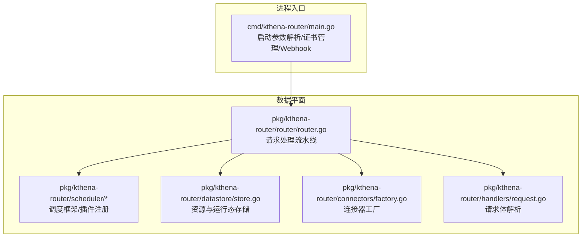
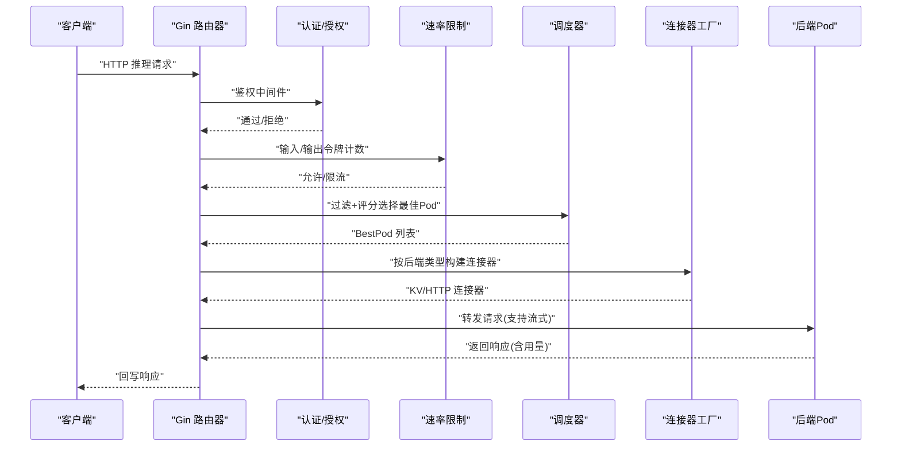
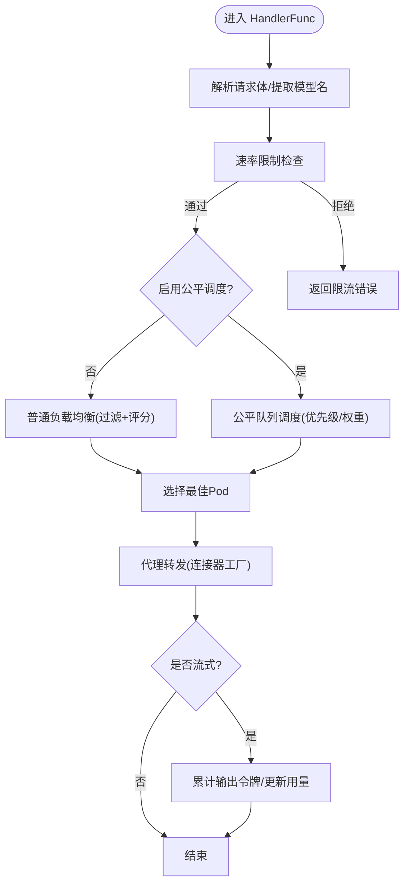
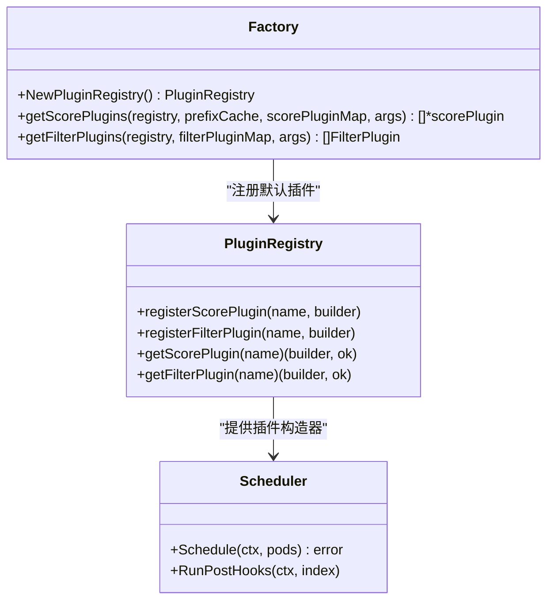
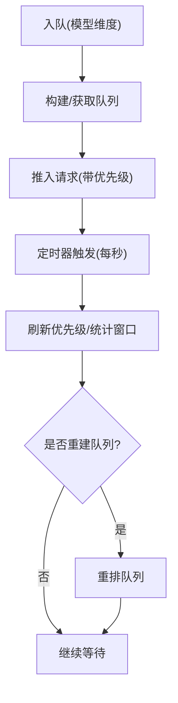
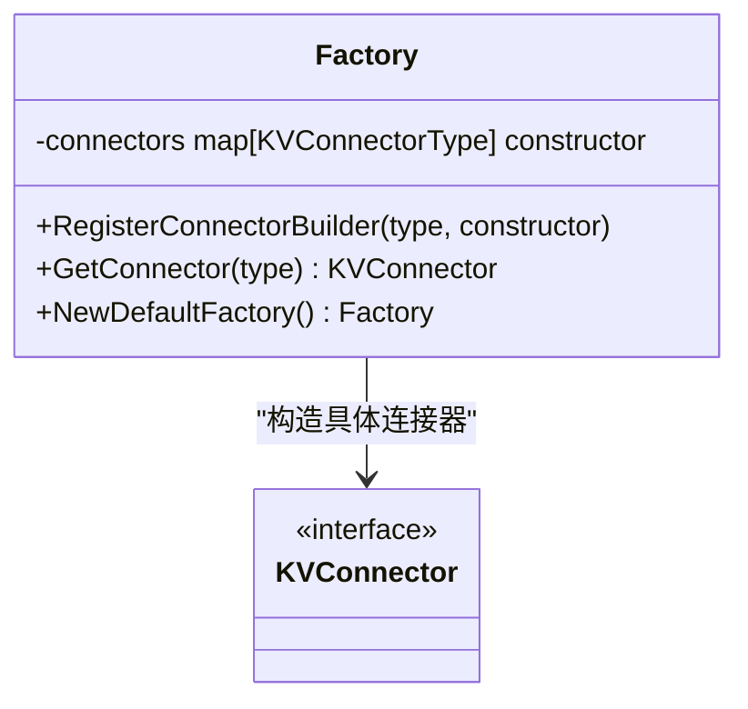
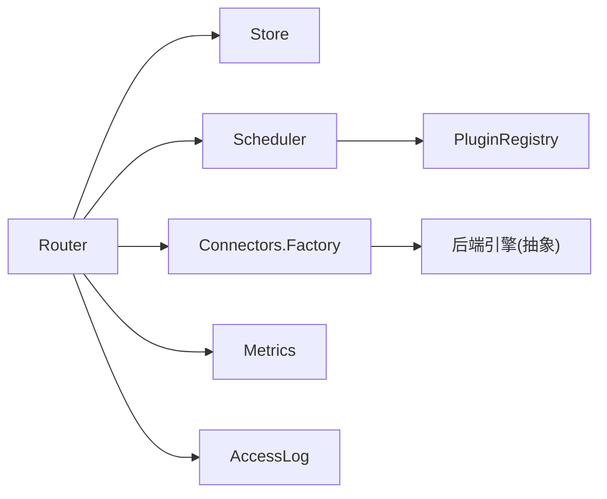

# 数据平面架构

<cite>
**本文引用的文件**
- [cmd/kthena-router/main.go](file://cmd/kthena-router/main.go)
- [pkg/kthena-router/router/router.go](file://pkg/kthena-router/router/router.go)
- [pkg/kthena-router/scheduler/scheduler.go](file://pkg/kthena-router/scheduler/scheduler.go)
- [pkg/kthena-router/scheduler/factory.go](file://pkg/kthena-router/scheduler/factory.go)
- [pkg/kthena-router/connectors/factory.go](file://pkg/kthena-router/connectors/factory.go)
- [pkg/kthena-router/datastore/store.go](file://pkg/kthena-router/datastore/store.go)
- [pkg/kthena-router/handlers/request.go](file://pkg/kthena-router/handlers/request.go)
</cite>

## 目录
1. [简介](#简介)
2. [项目结构](#项目结构)
3. [核心组件](#核心组件)
4. [架构总览](#架构总览)
5. [详细组件分析](#详细组件分析)
6. [依赖分析](#依赖分析)
7. [性能考虑](#性能考虑)
8. [故障排查指南](#故障排查指南)
9. [结论](#结论)
10. [附录](#附录)

## 简介
本文件面向系统工程师与运维人员，系统化阐述 Kthena 数据平面（Kthena Router）的架构与实现，重点覆盖以下方面：
- 请求处理流水线：认证授权、速率限制、公平调度、负载均衡、代理转发五个阶段
- 可插拔调度器设计：过滤插件与评分插件的注册与执行机制
- 低延迟请求路由与智能负载均衡：基于运行时指标与队列优先级的决策
- 连接器工厂模式：统一抽象不同推理引擎后端（如 vLLM、SGLang、MoonCake、NIXL）
- 性能优化策略、扩展性设计与高可用架构

## 项目结构
Kthena Router 作为独立进程，通过 Gin Web 框架对外提供 OpenAI 兼容接口，内部以“存储层 + 调度器 + 连接器”为核心，围绕请求生命周期进行编排。

图表来源
- [cmd/kthena-router/main.go:40-122](file://cmd/kthena-router/main.go#L40-L122)
- [pkg/kthena-router/router/router.go:73-169](file://pkg/kthena-router/router/router.go#L73-L169)
- [pkg/kthena-router/scheduler/factory.go:30-95](file://pkg/kthena-router/scheduler/factory.go#L30-L95)
- [pkg/kthena-router/datastore/store.go:161-240](file://pkg/kthena-router/datastore/store.go#L161-L240)
- [pkg/kthena-router/connectors/factory.go:21-59](file://pkg/kthena-router/connectors/factory.go#L21-L59)
- [pkg/kthena-router/handlers/request.go:27-54](file://pkg/kthena-router/handlers/request.go#L27-L54)

章节来源
- [cmd/kthena-router/main.go:40-122](file://cmd/kthena-router/main.go#L40-L122)
- [pkg/kthena-router/router/router.go:73-169](file://pkg/kthena-router/router/router.go#L73-L169)

## 核心组件
- 路由器 Router：封装认证、速率限制、调度、代理等能力，统一处理请求生命周期
- 存储 Store：集中管理模型服务器、Pod、Gateway/HTTPRoute/InferencePool 等资源，维护运行时指标与排队状态
- 调度器 Scheduler：基于插件框架执行过滤与评分，选择最佳目标 Pod
- 连接器工厂 ConnectorFactory：按后端类型创建适配器，屏蔽不同推理引擎差异
- 请求处理器 Handlers：对 OpenAI 兼容请求体进行最小化解析，提取关键字段

章节来源
- [pkg/kthena-router/router/router.go:73-169](file://pkg/kthena-router/router/router.go#L73-L169)
- [pkg/kthena-router/datastore/store.go:161-240](file://pkg/kthena-router/datastore/store.go#L161-L240)
- [pkg/kthena-router/scheduler/scheduler.go:25-28](file://pkg/kthena-router/scheduler/scheduler.go#L25-L28)
- [pkg/kthena-router/connectors/factory.go:21-59](file://pkg/kthena-router/connectors/factory.go#L21-L59)
- [pkg/kthena-router/handlers/request.go:27-54](file://pkg/kthena-router/handlers/request.go#L27-L54)

## 架构总览
Kthena Router 的请求在进入后，依次经历认证授权、速率限制、公平调度/负载均衡、代理转发到后端 Pod，并在上游返回时更新令牌用量与访问日志。

图表来源
- [pkg/kthena-router/router/router.go:204-315](file://pkg/kthena-router/router/router.go#L204-L315)
- [pkg/kthena-router/router/router.go:317-464](file://pkg/kthena-router/router/router.go#L317-L464)
- [pkg/kthena-router/router/router.go:714-780](file://pkg/kthena-router/router/router.go#L714-L780)
- [pkg/kthena-router/connectors/factory.go:38-59](file://pkg/kthena-router/connectors/factory.go#L38-L59)

## 详细组件分析

### 请求处理流水线
- 认证授权：通过 JWT 鉴权器在路由层注入中间件，失败则终止并记录错误
- 速率限制：统一令牌桶限流器按模型维度统计输入/输出令牌，超过阈值返回限流错误
- 公平调度/负载均衡：根据是否启用公平调度，分别走普通调度或公平队列调度；调度器执行过滤与评分插件，选择最佳 Pod
- 代理转发：根据后端类型选择连接器，支持 HTTP/KV/ MoonCake/NIXL/SGLang 等；支持流式输出，边收边写
- 访问日志与指标：贯穿请求生命周期记录模型名、令牌用量、排队长度、上游/下游请求数等

图表来源
- [pkg/kthena-router/router/router.go:204-315](file://pkg/kthena-router/router/router.go#L204-L315)
- [pkg/kthena-router/router/router.go:317-464](file://pkg/kthena-router/router/router.go#L317-L464)
- [pkg/kthena-router/router/router.go:714-780](file://pkg/kthena-router/router/router.go#L714-L780)

章节来源
- [pkg/kthena-router/router/router.go:204-315](file://pkg/kthena-router/router/router.go#L204-L315)
- [pkg/kthena-router/router/router.go:317-464](file://pkg/kthena-router/router/router.go#L317-L464)
- [pkg/kthena-router/router/router.go:714-780](file://pkg/kthena-router/router/router.go#L714-L780)

### 可插拔调度器设计
- 插件注册：通过插件注册表注册评分与过滤插件，支持默认插件集合（GPU缓存使用、最低延迟、最少请求、随机、前缀缓存、KV感知、LoRA亲和）
- 插件权重：评分插件支持权重配置，最终得分按加权聚合
- 执行流程：先执行过滤插件筛候选，再对候选执行评分插件打分，选择最优者

图表来源
- [pkg/kthena-router/scheduler/factory.go:30-95](file://pkg/kthena-router/scheduler/factory.go#L30-L95)
- [pkg/kthena-router/scheduler/scheduler.go:25-28](file://pkg/kthena-router/scheduler/scheduler.go#L25-L28)

章节来源
- [pkg/kthena-router/scheduler/factory.go:30-95](file://pkg/kthena-router/scheduler/factory.go#L30-L95)
- [pkg/kthena-router/scheduler/scheduler.go:25-28](file://pkg/kthena-router/scheduler/scheduler.go#L25-L28)

### 公平调度与优先级
- 公平队列：按模型维度维护等待队列，周期性刷新优先级，支持最大并发、最大 QPS、重建阈值等配置
- 优先级计算：结合令牌用量与请求数，支持环境变量权重配置，动态调整排队顺序
- 超时控制：支持公平队列超时时间配置，默认 60 秒

图表来源
- [pkg/kthena-router/datastore/store.go:443-468](file://pkg/kthena-router/datastore/store.go#L443-L468)
- [pkg/kthena-router/datastore/store.go:351-404](file://pkg/kthena-router/datastore/store.go#L351-L404)
- [pkg/kthena-router/router/router.go:193-200](file://pkg/kthena-router/router/router.go#L193-L200)

章节来源
- [pkg/kthena-router/datastore/store.go:443-468](file://pkg/kthena-router/datastore/store.go#L443-L468)
- [pkg/kthena-router/datastore/store.go:351-404](file://pkg/kthena-router/datastore/store.go#L351-L404)
- [pkg/kthena-router/router/router.go:193-200](file://pkg/kthena-router/router/router.go#L193-L200)

### 连接器工厂模式与多后端支持
- 工厂职责：按 KVConnectorType 创建对应连接器实例，内置默认映射（HTTP/LMCache/MoonCake/NIXL/SGLang）
- 后端抽象：屏蔽 vLLM、SGLang、MoonCake、NIXL 等引擎差异，统一请求构建与转发
- 默认行为：未匹配类型时回退到 HTTP 连接器

图表来源
- [pkg/kthena-router/connectors/factory.go:21-59](file://pkg/kthena-router/connectors/factory.go#L21-L59)

章节来源
- [pkg/kthena-router/connectors/factory.go:21-59](file://pkg/kthena-router/connectors/factory.go#L21-L59)

### 速率限制与令牌统计
- 统一令牌桶：按模型维度维护输入/输出令牌速率与总量限制
- 实时更新：上游返回时累计输出令牌，用于后续请求的输出速率限制
- 多维限流：支持请求次数、输入令牌、输出令牌三类维度的限流策略

章节来源
- [pkg/kthena-router/router/router.go:91-118](file://pkg/kthena-router/router/router.go#L91-L118)
- [pkg/kthena-router/router/router.go:266-292](file://pkg/kthena-router/router/router.go#L266-L292)
- [pkg/kthena-router/router/router.go:742-764](file://pkg/kthena-router/router/router.go#L742-L764)

### 认证授权与请求解析
- JWT 鉴权：在路由层注入鉴权中间件，失败直接中止并记录错误
- 请求体解析：最小化解析 OpenAI 兼容请求体，仅提取模型名用于后续限流与路由

章节来源
- [pkg/kthena-router/router/router.go:798-800](file://pkg/kthena-router/router/router.go#L798-L800)
- [pkg/kthena-router/handlers/request.go:27-54](file://pkg/kthena-router/handlers/request.go#L27-L54)

## 依赖分析
- 组件耦合
  - Router 依赖 Store（资源与运行态）、Scheduler（调度插件）、Connectors（后端抽象）、AccessLog/Metrics（可观测）
  - Scheduler 依赖插件注册表与上下文（模型、提示、PDGroup、指标记录器）
  - Connectors 工厂与后端类型解耦，便于扩展新引擎
- 外部依赖
  - Gin：HTTP 路由与中间件
  - Kubernetes API/Gateway API：资源发现与路由匹配
  - Prometheus：指标采集与上报

图表来源
- [pkg/kthena-router/router/router.go:73-169](file://pkg/kthena-router/router/router.go#L73-L169)
- [pkg/kthena-router/scheduler/factory.go:30-95](file://pkg/kthena-router/scheduler/factory.go#L30-L95)
- [pkg/kthena-router/connectors/factory.go:21-59](file://pkg/kthena-router/connectors/factory.go#L21-L59)

章节来源
- [pkg/kthena-router/router/router.go:73-169](file://pkg/kthena-router/router/router.go#L73-L169)
- [pkg/kthena-router/scheduler/factory.go:30-95](file://pkg/kthena-router/scheduler/factory.go#L30-L95)
- [pkg/kthena-router/connectors/factory.go:21-59](file://pkg/kthena-router/connectors/factory.go#L21-L59)

## 性能考虑
- 低延迟路径
  - Gin 中间件链短、按需解析请求体，避免重复拷贝
  - 速率限制前置，快速失败减少无效转发
  - 公平队列按秒刷新，降低抖动
- 调度效率
  - 过滤插件先行筛除不可用 Pod，减少评分开销
  - 评分插件权重可调，聚焦关键指标（如 TTFT/TPOT、GPU 缓存命中）
- 代理吞吐
  - 支持流式输出，边收边写，降低端到端延迟
  - 连接器工厂按类型选择最优实现，避免不必要的协议转换
- 资源隔离
  - 模型维度限流，避免单模型影响全局
  - 公平队列按用户/模型维度排队，抑制长尾

## 故障排查指南
- 常见问题定位
  - 路由失败：检查模型路由/HTTPRoute 是否匹配，确认 Store 中资源同步状态
  - 限流错误：核对模型限流配置与令牌统计，关注输入/输出令牌阈值
  - 调度异常：查看过滤/评分插件执行日志，确认候选 Pod 与权重配置
  - 代理失败：检查后端 Pod 状态、端口映射与连接器类型
- 关键观测点
  - 访问日志：模型名、令牌用量、路由信息、错误码
  - 指标：下游/上游活跃请求数、排队长度、TTFT/TPOT 分布
  - 公平队列：每模型队列长度、优先级刷新频率

章节来源
- [pkg/kthena-router/router/router.go:204-315](file://pkg/kthena-router/router/router.go#L204-L315)
- [pkg/kthena-router/router/router.go:317-464](file://pkg/kthena-router/router/router.go#L317-L464)
- [pkg/kthena-router/router/router.go:714-780](file://pkg/kthena-router/router/router.go#L714-L780)

## 结论
Kthena 数据平面通过“存储 + 调度 + 连接器”的清晰分层，实现了低延迟、可扩展、可观测的推理请求路由与负载均衡。其可插拔调度器与连接器工厂模式为多后端与多策略提供了强大扩展能力；公平调度与令牌统计保障了资源公平与稳定性；结合流式代理与指标体系，满足生产级推理服务的高可用需求。

## 附录
- 启动参数与证书管理：入口程序负责参数解析、Webhook 证书生成与更新、调试端口暴露
- 环境变量
  - 公平调度相关：FAIRNESS_QUEUE_TIMEOUT、FAIRNESS_PRIORITY_TOKEN_WEIGHT、FAIRNESS_PRIORITY_REQUEST_NUM_WEIGHT、FAIRNESS_WINDOW_SIZE、FAIRNESS_INPUT_TOKEN_WEIGHT、FAIRNESS_OUTPUT_TOKEN_WEIGHT、FAIRNESS_MAX_CONCURRENT、FAIRNESS_MAX_QPS、FAIRNESS_PRIORITY_REFRESH_RETRIES、FAIRNESS_REBUILD_THRESHOLD
  - 访问日志：ACCESS_LOG_ENABLED、ACCESS_LOG_FORMAT、ACCESS_LOG_OUTPUT

章节来源
- [cmd/kthena-router/main.go:67-102](file://cmd/kthena-router/main.go#L67-L102)
- [pkg/kthena-router/router/router.go:125-150](file://pkg/kthena-router/router/router.go#L125-L150)
- [pkg/kthena-router/router/router.go:173-191](file://pkg/kthena-router/router/router.go#L173-L191)
- [pkg/kthena-router/datastore/store.go:70-111](file://pkg/kthena-router/datastore/store.go#L70-L111)
- [pkg/kthena-router/datastore/store.go:351-404](file://pkg/kthena-router/datastore/store.go#L351-L404)