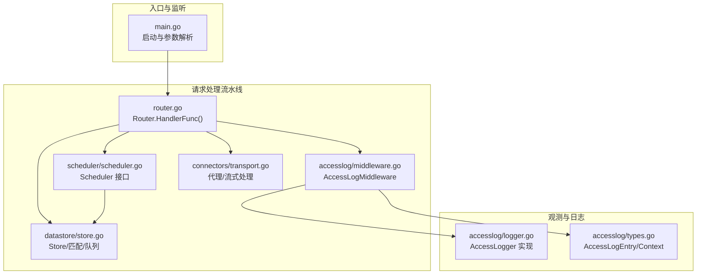
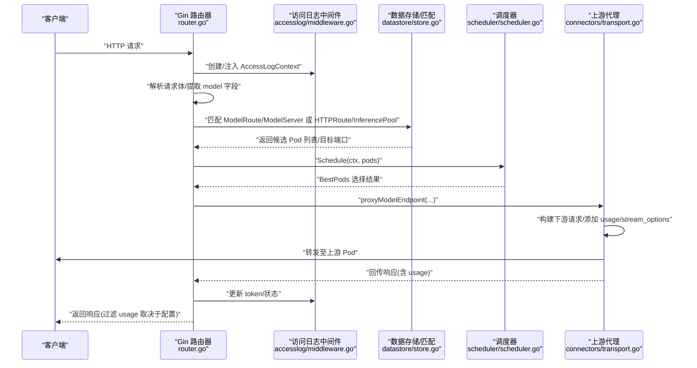
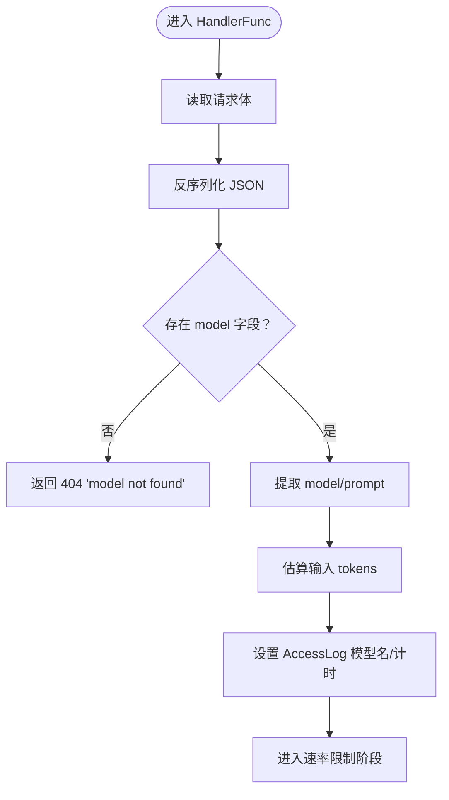
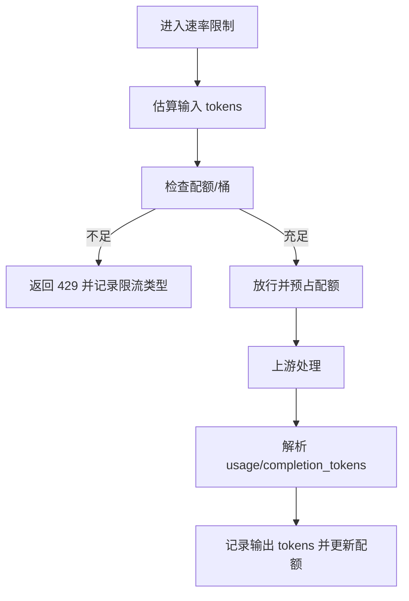
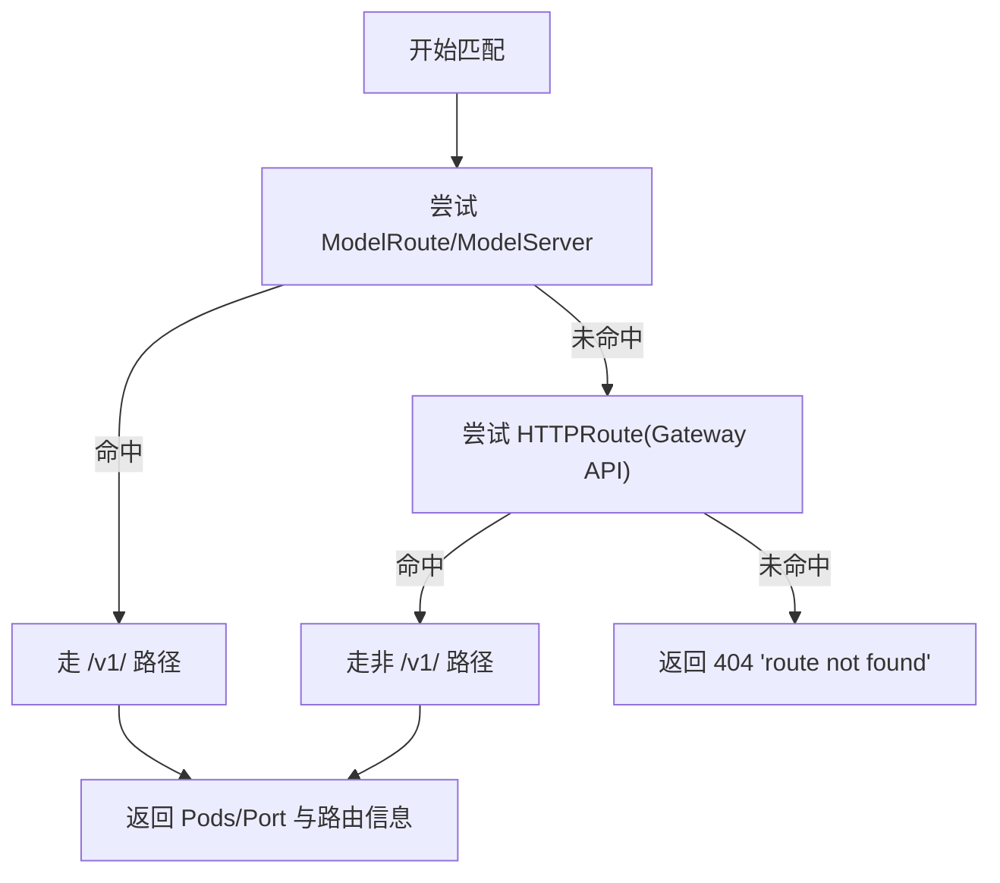
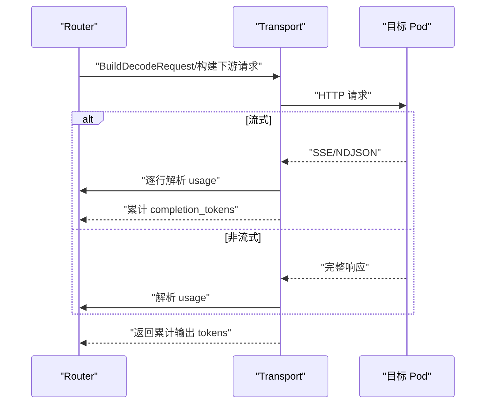
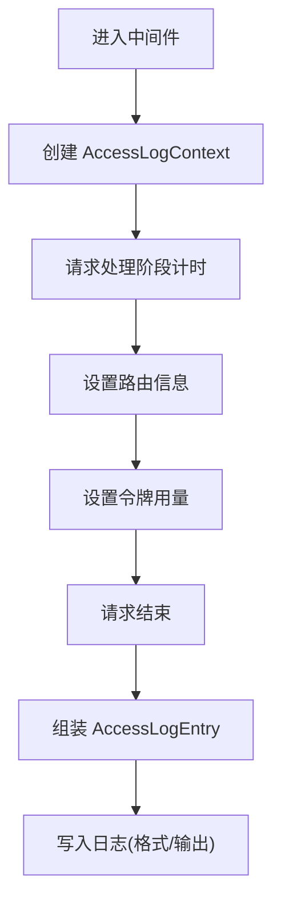
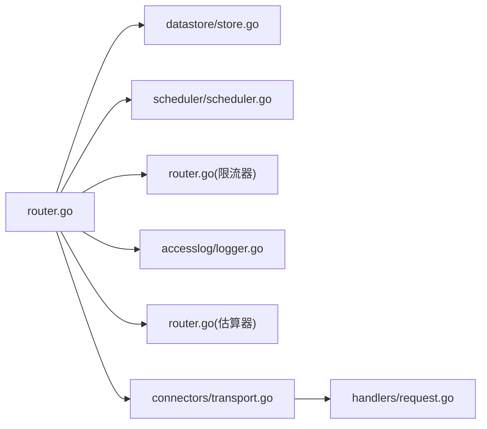

# 请求处理流水线

<cite>
**本文引用的文件**
- [cmd/kthena-router/main.go](file://cmd/kthena-router/main.go)
- [pkg/kthena-router/router/router.go](file://pkg/kthena-router/router/router.go)
- [pkg/kthena-router/accesslog/logger.go](file://pkg/kthena-router/accesslog/logger.go)
- [pkg/kthena-router/accesslog/types.go](file://pkg/kthena-router/accesslog/types.go)
- [pkg/kthena-router/accesslog/middleware.go](file://pkg/kthena-router/accesslog/middleware.go)
- [pkg/kthena-router/connectors/transport.go](file://pkg/kthena-router/connectors/transport.go)
- [pkg/kthena-router/datastore/store.go](file://pkg/kthena-router/datastore/store.go)
- [pkg/kthena-router/scheduler/scheduler.go](file://pkg/kthena-router/scheduler/scheduler.go)
- [pkg/kthena-router/handlers/request.go](file://pkg/kthena-router/handlers/request.go)
</cite>

## 目录
1. [简介](#简介)
2. [项目结构](#项目结构)
3. [核心组件](#核心组件)
4. [架构总览](#架构总览)
5. [详细组件分析](#详细组件分析)
6. [依赖分析](#依赖分析)
7. [性能考虑](#性能考虑)
8. [故障排查指南](#故障排查指南)
9. [结论](#结论)
10. [附录](#附录)

## 简介
本文件面向开发者与运维工程师，系统性阐述 Kthena 路由器（kthena-router）在数据平面中的请求处理流水线。该流水线覆盖从请求进入、解析与校验、认证授权、速率限制、令牌化估算、路由决策、负载均衡、到上游代理转发的全链路过程，并对访问日志记录、并发模型、超时与重试策略进行深入说明，辅以图示帮助理解。

## 项目结构
围绕请求处理流水线的关键模块分布如下：
- 入口与服务启动：cmd/kthena-router/main.go
- 路由与流水线编排：pkg/kthena-router/router/router.go
- 访问日志：accesslog/logger.go、accesslog/types.go、accesslog/middleware.go
- 上游代理与分发：connectors/transport.go
- 数据存储与调度：datastore/store.go、scheduler/scheduler.go
- 请求体解析辅助：handlers/request.go

**图表来源**
- [cmd/kthena-router/main.go:100-122](file://cmd/kthena-router/main.go#L100-L122)
- [pkg/kthena-router/router/router.go:204-315](file://pkg/kthena-router/router/router.go#L204-L315)
- [pkg/kthena-router/accesslog/middleware.go:30-63](file://pkg/kthena-router/accesslog/middleware.go#L30-L63)
- [pkg/kthena-router/scheduler/scheduler.go:25-28](file://pkg/kthena-router/scheduler/scheduler.go#L25-L28)
- [pkg/kthena-router/datastore/store.go:178-240](file://pkg/kthena-router/datastore/store.go#L178-L240)
- [pkg/kthena-router/connectors/transport.go:48-78](file://pkg/kthena-router/connectors/transport.go#L48-L78)
- [pkg/kthena-router/accesslog/logger.go:69-98](file://pkg/kthena-router/accesslog/logger.go#L69-L98)
- [pkg/kthena-router/accesslog/types.go:23-56](file://pkg/kthena-router/accesslog/types.go#L23-L56)

**章节来源**
- [cmd/kthena-router/main.go:100-122](file://cmd/kthena-router/main.go#L100-L122)
- [pkg/kthena-router/router/router.go:204-315](file://pkg/kthena-router/router/router.go#L204-L315)

## 核心组件
- Router：请求处理流水线的编排者，负责解析请求、速率限制、令牌估算、路由匹配、调度与代理转发。
- AccessLog 中间件与 Logger：贯穿请求生命周期，记录时间线、路由信息、令牌用量与错误信息。
- Store：统一的数据源，提供模型服务器/LoRA/HTTPRoute/Gateway/InferencePool 的匹配与公平调度队列。
- Scheduler：抽象的调度接口，用于选择最佳 Pod 并执行后置钩子。
- Transport：封装上游代理，支持非流式与流式响应处理、使用统计与透传。

**章节来源**
- [pkg/kthena-router/router/router.go:73-89](file://pkg/kthena-router/router/router.go#L73-L89)
- [pkg/kthena-router/accesslog/middleware.go:30-63](file://pkg/kthena-router/accesslog/middleware.go#L30-L63)
- [pkg/kthena-router/accesslog/logger.go:69-98](file://pkg/kthena-router/accesslog/logger.go#L69-L98)
- [pkg/kthena-router/datastore/store.go:161-240](file://pkg/kthena-router/datastore/store.go#L161-L240)
- [pkg/kthena-router/scheduler/scheduler.go:25-28](file://pkg/kthena-router/scheduler/scheduler.go#L25-L28)
- [pkg/kthena-router/connectors/transport.go:48-78](file://pkg/kthena-router/connectors/transport.go#L48-L78)

## 架构总览
下图展示一次典型请求从进入路由器到返回客户端的端到端流程，以及各阶段的输入输出与错误处理要点。

**图表来源**
- [pkg/kthena-router/router/router.go:204-315](file://pkg/kthena-router/router/router.go#L204-L315)
- [pkg/kthena-router/accesslog/middleware.go:30-63](file://pkg/kthena-router/accesslog/middleware.go#L30-L63)
- [pkg/kthena-router/datastore/store.go:178-240](file://pkg/kthena-router/datastore/store.go#L178-L240)
- [pkg/kthena-router/scheduler/scheduler.go:25-28](file://pkg/kthena-router/scheduler/scheduler.go#L25-L28)
- [pkg/kthena-router/connectors/transport.go:110-145](file://pkg/kthena-router/connectors/transport.go#L110-L145)

## 详细组件分析

### 1) 请求进入与解析（Parse & Validate）
- 输入：HTTP 请求体（JSON），需包含 model 字段；路径可能为 /v1/ 或 Gateway API 匹配的其他路径。
- 处理：
  - 读取并反序列化请求体；
  - 提取 model 字段作为后续路由与限流依据；
  - 解析 prompt 以计算输入 token 数量；
  - 设置 AccessLog 模型名与初始计时点。
- 输出：ModelRequest 映射、AccessLogContext、metricsRecorder。
- 错误：缺失 model 或解析失败时返回 400/404，并写入 AccessLog 错误字段。

**图表来源**
- [pkg/kthena-router/router/router.go:466-486](file://pkg/kthena-router/router/router.go#L466-L486)
- [pkg/kthena-router/router/router.go:241-265](file://pkg/kthena-router/router/router.go#L241-L265)

**章节来源**
- [pkg/kthena-router/router/router.go:204-265](file://pkg/kthena-router/router/router.go#L204-L265)
- [pkg/kthena-router/handlers/request.go:34-54](file://pkg/kthena-router/handlers/request.go#L34-L54)

### 2) 认证授权（Auth）
- 当前 Router 暴露 Auth 方法，内部委托给 JWT 认证器。具体认证策略由配置决定。
- 建议：在 Gin 中间件栈中挂载该方法，确保在路由匹配之前完成鉴权。

**章节来源**
- [pkg/kthena-router/router/router.go:798-800](file://pkg/kthena-router/router/router.go#L798-L800)

### 3) 速率限制（Rate Limit）
- 统一速率限制器按模型维度维护令牌桶，支持输入/输出 token 与请求数三类指标。
- 流程：
  - 使用估算的输入 tokens 预占；
  - 若触发限流，记录限流类型并返回 429；
  - 上游返回 usage 后，实时记录输出 tokens 以动态调整配额。
- 错误：超过配额时返回 429，AccessLog 写入限流类型与消息。

**图表来源**
- [pkg/kthena-router/router/router.go:266-292](file://pkg/kthena-router/router/router.go#L266-L292)
- [pkg/kthena-router/router/router.go:742-764](file://pkg/kthena-router/router/router.go#L742-L764)

**章节来源**
- [pkg/kthena-router/router/router.go:266-292](file://pkg/kthena-router/router/router.go#L266-L292)
- [pkg/kthena-router/router/router.go:742-764](file://pkg/kthena-router/router/router.go#L742-L764)

### 4) 令牌化估算（Tokenizer）
- 使用简单估算器对 prompt 文本进行 token 数量估算，用于限流与指标上报。
- 回退策略：估算失败时采用字符长度近似，避免阻塞请求。

**章节来源**
- [pkg/kthena-router/router/router.go:98-99](file://pkg/kthena-router/router/router.go#L98-L99)
- [pkg/kthena-router/router/router.go:250-256](file://pkg/kthena-router/router/router.go#L250-L256)

### 5) 路由决策（Match & Select）
- 支持两类路由：
  - ModelRoute/ModelServer：优先匹配，支持 LoRA 适配器；
  - Gateway API/Inference Extension：匹配 HTTPRoute，选择 InferencePool。
- 匹配逻辑：
  - 优先尝试 ModelRoute/ModelServer；
  - 若非 /v1/ 路径或未命中，则尝试 Gateway API 的 HTTPRoute；
  - 支持 URL 重写（Host/Path）。
- 结果：确定目标 Pod 列表、目标端口与路由元信息，写入 AccessLog。

**图表来源**
- [pkg/kthena-router/router/router.go:317-402](file://pkg/kthena-router/router/router.go#L317-L402)
- [pkg/kthena-router/router/router.go:500-622](file://pkg/kthena-router/router/router.go#L500-L622)

**章节来源**
- [pkg/kthena-router/router/router.go:317-402](file://pkg/kthena-router/router/router.go#L317-L402)
- [pkg/kthena-router/router/router.go:500-622](file://pkg/kthena-router/router/router.go#L500-L622)

### 6) 负载均衡与调度（Scheduler）
- 将候选 Pod 交由调度器选择最佳目标，支持公平调度队列与权重。
- 输出：BestPods 列表，供后续代理使用。

**章节来源**
- [pkg/kthena-router/router/router.go:426-439](file://pkg/kthena-router/router/router.go#L426-L439)
- [pkg/kthena-router/scheduler/scheduler.go:25-28](file://pkg/kthena-router/scheduler/scheduler.go#L25-L28)
- [pkg/kthena-router/datastore/store.go:443-468](file://pkg/kthena-router/datastore/store.go#L443-L468)

### 7) 代理转发（Proxy）
- 构建下游请求：
  - 对非 PD 聚合模式：直接转发，必要时追加 usage 请求；
  - 对 PD 聚合模式：先向 prefill Pod 发送一次性预填充请求，再向 decode Pod 发送解码请求。
- 流式处理：
  - 识别 SSE/NDJSON 流式响应；
  - 边读边转发，同时解析 usage 累计输出 tokens；
  - 非流式响应：复制响应体并解析 usage。
- 错误：单 Pod 失败时尝试下一个，全部失败返回 503。

**图表来源**
- [pkg/kthena-router/router/router.go:714-780](file://pkg/kthena-router/router/router.go#L714-L780)
- [pkg/kthena-router/connectors/transport.go:110-145](file://pkg/kthena-router/connectors/transport.go#L110-L145)
- [pkg/kthena-router/connectors/transport.go:175-205](file://pkg/kthena-router/connectors/transport.go#L175-L205)
- [pkg/kthena-router/connectors/transport.go:207-226](file://pkg/kthena-router/connectors/transport.go#L207-L226)

**章节来源**
- [pkg/kthena-router/router/router.go:714-780](file://pkg/kthena-router/router/router.go#L714-L780)
- [pkg/kthena-router/connectors/transport.go:48-78](file://pkg/kthena-router/connectors/transport.go#L48-L78)
- [pkg/kthena-router/connectors/transport.go:175-226](file://pkg/kthena-router/connectors/transport.go#L175-L226)

### 8) 访问日志记录（AccessLog）
- 中间件在请求进入时生成 AccessLogContext，在请求结束时汇总并落盘。
- 字段覆盖：标准 HTTP 信息、AI 路由信息（模型/路由/服务器/选中 Pod）、Gateway API 信息、令牌用量、耗时分解（请求/上游/响应）。
- 支持 JSON/文本两种格式，可输出到 stdout/stderr/文件。

**图表来源**
- [pkg/kthena-router/accesslog/middleware.go:30-63](file://pkg/kthena-router/accesslog/middleware.go#L30-L63)
- [pkg/kthena-router/accesslog/types.go:64-97](file://pkg/kthena-router/accesslog/types.go#L64-L97)
- [pkg/kthena-router/accesslog/types.go:169-223](file://pkg/kthena-router/accesslog/types.go#L169-L223)
- [pkg/kthena-router/accesslog/logger.go:69-98](file://pkg/kthena-router/accesslog/logger.go#L69-L98)
- [pkg/kthena-router/accesslog/logger.go:138-208](file://pkg/kthena-router/accesslog/logger.go#L138-L208)

**章节来源**
- [pkg/kthena-router/accesslog/middleware.go:30-63](file://pkg/kthena-router/accesslog/middleware.go#L30-L63)
- [pkg/kthena-router/accesslog/types.go:23-56](file://pkg/kthena-router/accesslog/types.go#L23-L56)
- [pkg/kthena-router/accesslog/logger.go:69-98](file://pkg/kthena-router/accesslog/logger.go#L69-L98)

## 依赖分析
- Router 依赖：
  - Store：提供路由匹配、Pod 列表、公平队列；
  - Scheduler：抽象调度接口；
  - RateLimiter：统一速率限制；
  - AccessLogger：访问日志；
  - Tokenizer：估算输入 tokens；
  - Connectors Factory：上游连接器工厂（用于 PD 聚合场景）。
- Transport 依赖：
  - Gin 上下文与 HTTP 客户端；
  - handlers：解析流式响应 usage。

**图表来源**
- [pkg/kthena-router/router/router.go:73-89](file://pkg/kthena-router/router/router.go#L73-L89)
- [pkg/kthena-router/datastore/store.go:161-240](file://pkg/kthena-router/datastore/store.go#L161-L240)
- [pkg/kthena-router/scheduler/scheduler.go:25-28](file://pkg/kthena-router/scheduler/scheduler.go#L25-L28)
- [pkg/kthena-router/connectors/transport.go:19-31](file://pkg/kthena-router/connectors/transport.go#L19-L31)
- [pkg/kthena-router/handlers/request.go:20-25](file://pkg/kthena-router/handlers/request.go#L20-L25)

**章节来源**
- [pkg/kthena-router/router/router.go:73-89](file://pkg/kthena-router/router/router.go#L73-L89)
- [pkg/kthena-router/connectors/transport.go:19-31](file://pkg/kthena-router/connectors/transport.go#L19-L31)

## 性能考虑
- 并发模型
  - Gin 默认基于 goroutine 并发处理请求，Router 在每个请求内串行执行流水线步骤，但通过 Store 的原子与互斥保护保证并发安全。
  - 上游代理在单个 Pod 失败时会尝试下一个，具备基础重试能力。
- 超时与重试
  - 当前实现未显式设置 HTTP 转发超时与重试次数；如需增强，可在 Transport 层引入自定义 RoundTripper 并配置超时与指数退避重试。
- 日志开销
  - AccessLog 支持 JSON/文本与多输出目标；生产环境建议使用 JSON 并输出到 stdout，避免磁盘 IO 影响。
- 令牌估算
  - 估算失败时采用回退策略，避免阻塞；若对精度敏感，可替换更精确的分词器实现。

[本节为通用性能建议，不直接分析具体文件]

## 故障排查指南
- 常见错误与定位
  - 路由未匹配：检查 ModelRoute/HTTPRoute 是否正确绑定，路径匹配规则是否符合。
  - 速率限制：查看 AccessLog 中限流类型与配额状态，确认输入/输出令牌估算是否合理。
  - 上游不可达：观察代理阶段错误日志与重试行为，确认目标 Pod 状态与网络连通性。
  - 日志异常：确认 AccessLog 配置（格式/输出/开关），检查写入权限与磁盘空间。
- 关键日志字段
  - 错误类型与消息：error.type/error.message
  - 路由信息：model_name/model_route/model_server/selected_pod
  - Gateway API：gateway/http_route/inference_pool
  - 令牌用量：tokens=input/output
  - 耗时分解：timings=total(ms)、request/upstream/response 分段

**章节来源**
- [pkg/kthena-router/router/router.go:343-401](file://pkg/kthena-router/router/router.go#L343-L401)
- [pkg/kthena-router/router/router.go:285-291](file://pkg/kthena-router/router/router.go#L285-L291)
- [pkg/kthena-router/accesslog/types.go:58-62](file://pkg/kthena-router/accesslog/types.go#L58-L62)
- [pkg/kthena-router/accesslog/logger.go:100-128](file://pkg/kthena-router/accesslog/logger.go#L100-L128)

## 结论
Kthena 路由器的请求处理流水线以 Router 为核心，结合 Store 的路由与调度能力、Transport 的代理与流式处理、AccessLog 的可观测性，形成高内聚、低耦合的模块化架构。通过速率限制与令牌估算保障资源公平使用，通过 Gateway API 支持灵活路由与 URL 重写，通过访问日志提供完整的端到端追踪。建议在生产环境中进一步完善超时与重试策略、优化日志输出与格式，并根据业务需求扩展认证授权与调度插件。

[本节为总结性内容，不直接分析具体文件]

## 附录
- 启动参数与功能开关
  - 端口、TLS、Webhook、Gateway API、调试端口等均可通过命令行参数配置。
- 环境变量
  - 访问日志格式/输出开关；
  - 公平调度窗口、权重、并发与 QPS；
  - 令牌权重与窗口大小等。

**章节来源**
- [cmd/kthena-router/main.go:67-80](file://cmd/kthena-router/main.go#L67-L80)
- [pkg/kthena-router/router/router.go:125-168](file://pkg/kthena-router/router/router.go#L125-L168)
- [pkg/kthena-router/datastore/store.go:70-111](file://pkg/kthena-router/datastore/store.go#L70-L111)