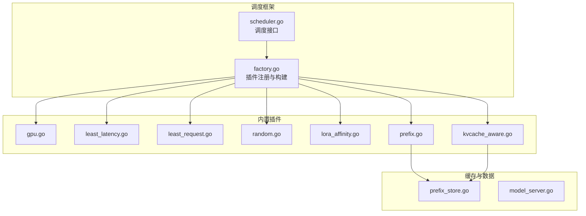
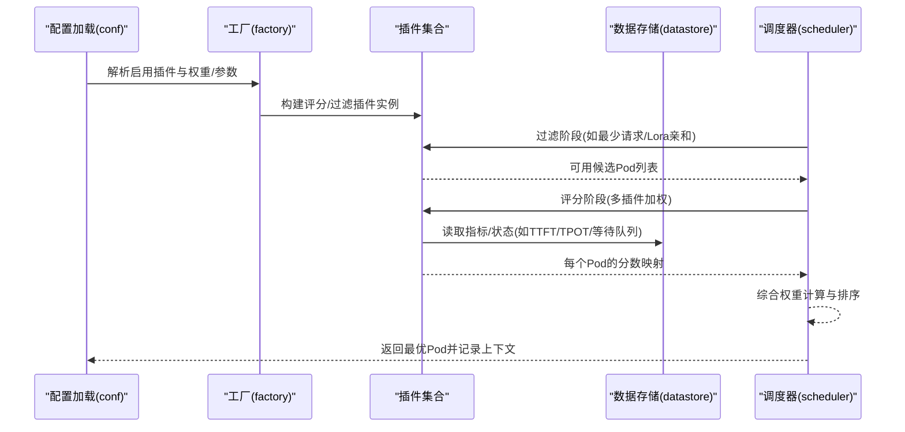
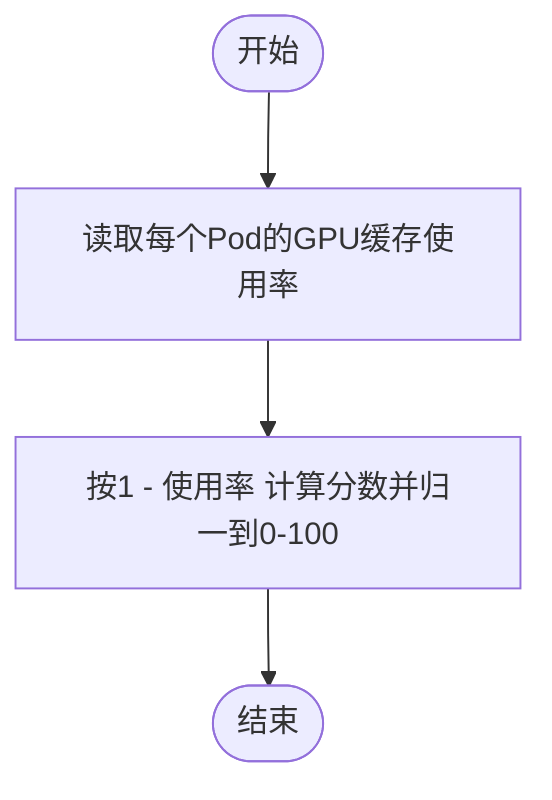
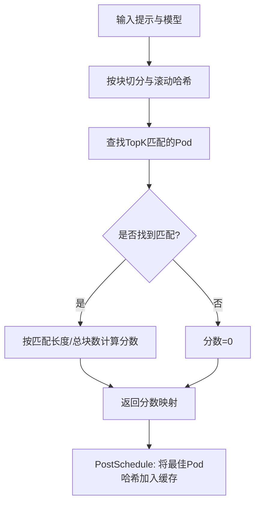
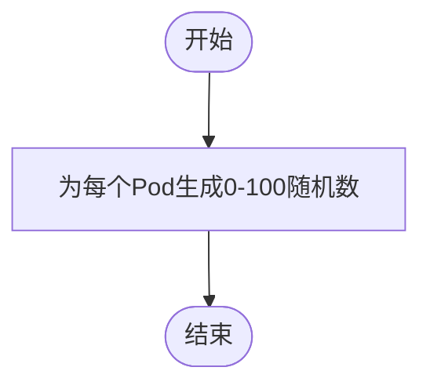
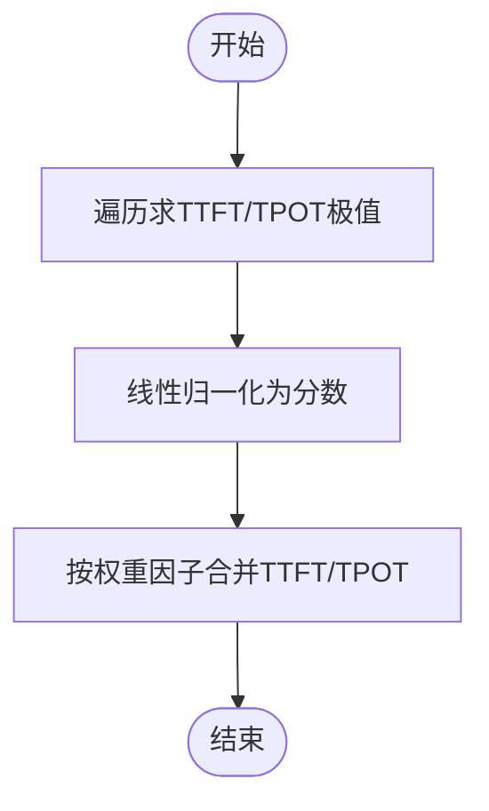
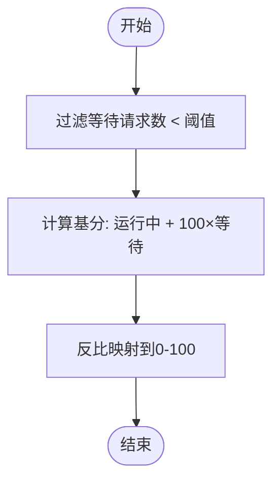
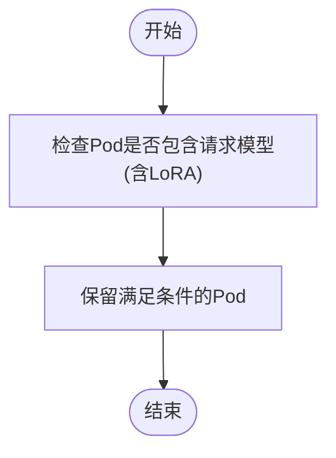
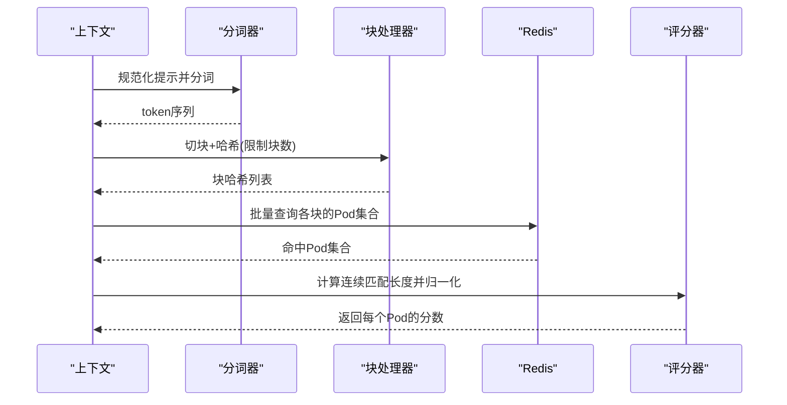
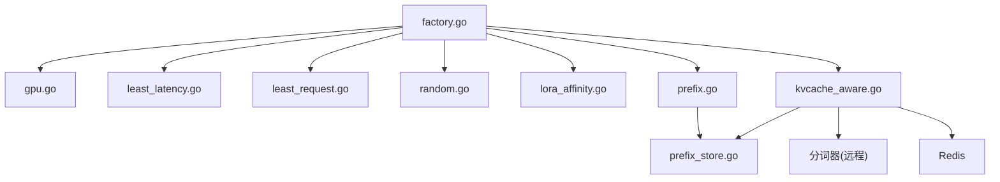

# 内置插件详解

<cite>
**本文引用的文件**
- [factory.go](file://pkg/kthena-router/scheduler/factory.go)
- [scheduler.go](file://pkg/kthena-router/scheduler/scheduler.go)
- [conf.go](file://pkg/kthena-router/scheduler/plugins/conf/conf.go)
- [gpu.go](file://pkg/kthena-router/scheduler/plugins/gpu.go)
- [least_latency.go](file://pkg/kthena-router/scheduler/plugins/least_latency.go)
- [least_request.go](file://pkg/kthena-router/scheduler/plugins/least_request.go)
- [random.go](file://pkg/kthena-router/scheduler/plugins/random.go)
- [lora_affinity.go](file://pkg/kthena-router/scheduler/plugins/lora_affinity.go)
- [prefix.go](file://pkg/kthena-router/scheduler/plugins/prefix.go)
- [kvcache_aware.go](file://pkg/kthena-router/scheduler/plugins/kvcache_aware.go)
- [prefix_store.go](file://pkg/kthena-router/scheduler/plugins/cache/prefix_store.go)
- [model_server.go](file://pkg/kthena-router/datastore/model_server.go)
</cite>

## 目录
1. [引言](#引言)
2. [项目结构](#项目结构)
3. [核心组件](#核心组件)
4. [架构总览](#架构总览)
5. [详细组件分析](#详细组件分析)
6. [依赖分析](#依赖分析)
7. [性能考量](#性能考量)
8. [故障排查指南](#故障排查指南)
9. [结论](#结论)
10. [附录：配置与最佳实践](#附录配置与最佳实践)

## 引言
本文件面向 Kthena 路由器调度器的内置调度插件，系统化梳理并解释以下插件的设计目标、实现要点、配置参数、性能特征与适用场景：
- GPU 资源插件（GPU 缓存使用率）
- 前缀匹配插件（Prefix Cache）
- 随机选择插件（Random）
- 最少延迟插件（Least Latency）
- 最少请求插件（Least Request）
- LoRA 亲和性插件（Lora Affinity）
- KVCache Aware 插件（KV Cache 亲和）

同时给出插件间的协同机制、冲突处理策略以及用户在实际部署中的配置与选型建议。

## 项目结构
Kthena 的调度插件位于路由器子系统的调度模块中，采用“插件注册 + 工厂构建”的方式统一管理。默认插件在工厂中集中注册，并通过配置文件进行启用、权重与参数注入。

**图表来源**
- [factory.go:66-95](file://pkg/kthena-router/scheduler/factory.go#L66-L95)
- [scheduler.go:25-28](file://pkg/kthena-router/scheduler/scheduler.go#L25-L28)
- [prefix.go:116-156](file://pkg/kthena-router/scheduler/plugins/prefix.go#L116-L156)
- [kvcache_aware.go:107-140](file://pkg/kthena-router/scheduler/plugins/kvcache_aware.go#L107-L140)

**章节来源**
- [factory.go:66-95](file://pkg/kthena-router/scheduler/factory.go#L66-L95)
- [scheduler.go:25-28](file://pkg/kthena-router/scheduler/scheduler.go#L25-L28)

## 核心组件
- 插件注册中心：负责内置插件的注册与按名称检索，支持评分与过滤两类插件。
- 插件工厂：根据配置生成具体插件实例，处理权重、参数与前置条件（如 PrefixCache 的特殊构造）。
- 配置加载：从配置文件解析启用的插件、权重、参数，执行冲突检测（尤其是随机插件）。

关键点：
- 默认注册包含 GPU 使用率、最少延迟、最少请求、随机、前缀缓存、KVCache Aware 等评分插件；最少请求同时作为过滤插件；LoRA 亲和性仅作为过滤插件。
- 工厂在获取评分插件时对权重做校验与兜底；前缀缓存插件需要传入数据存储以构建本地缓存。

**章节来源**
- [factory.go:66-95](file://pkg/kthena-router/scheduler/factory.go#L66-L95)
- [factory.go:114-143](file://pkg/kthena-router/scheduler/factory.go#L114-L143)
- [conf.go:82-103](file://pkg/kthena-router/scheduler/plugins/conf/conf.go#L82-L103)

## 架构总览
下图展示一次调度流程中插件参与的关键步骤：配置加载 → 插件构建 → 过滤阶段（可选）→ 评分阶段（多插件加权）→ 合成最终得分 → 选择最优 Pod。

**图表来源**
- [conf.go:82-103](file://pkg/kthena-router/scheduler/plugins/conf/conf.go#L82-L103)
- [factory.go:114-143](file://pkg/kthena-router/scheduler/factory.go#L114-L143)
- [least_request.go:62-66](file://pkg/kthena-router/scheduler/plugins/least_request.go#L62-L66)
- [least_latency.go:65-96](file://pkg/kthena-router/scheduler/plugins/least_latency.go#L65-L96)
- [gpu.go:41-49](file://pkg/kthena-router/scheduler/plugins/gpu.go#L41-L49)
- [kvcache_aware.go:153-192](file://pkg/kthena-router/scheduler/plugins/kvcache_aware.go#L153-L192)

## 详细组件分析

### GPU 资源插件（GPU 缓存使用率）
- 设计目标：基于 GPU 缓存使用率进行打分，优先选择缓存空闲度更高的 Pod，提升后续推理命中率。
- 实现要点：
  - 评分函数直接使用 GPU 缓存使用率的线性变换，范围映射到 0-100。
  - 适用于具备 GPU 缓存监控能力的数据源。
- 性能特征：
  - 时间复杂度 O(N)，N 为候选 Pod 数量。
  - 对 GPU 资源紧张场景友好，避免重复解码 KV。
- 适用场景：
  - 多轮对话、长上下文续写等高缓存复用需求。
- 配置参数：无显式参数，依赖运行时指标可用性。

**图表来源**
- [gpu.go:41-49](file://pkg/kthena-router/scheduler/plugins/gpu.go#L41-L49)

**章节来源**
- [gpu.go:26-49](file://pkg/kthena-router/scheduler/plugins/gpu.go#L26-L49)

### 前缀匹配插件（Prefix Cache）
- 设计目标：通过滚动哈希与 LRU 前缀缓存，识别与当前请求最相似的历史请求，提升 KV 缓存命中概率。
- 实现要点：
  - 将提示文本切分为固定大小的块，使用 xxHash 生成带前缀依赖的滚动哈希。
  - 三层数组结构：model → hash → pod 集合，配合 LRU 记录每个 Pod 的哈希序列，支持容量与 Top-K 匹配。
  - 评分：匹配长度占总块数的比例 × 100。
  - 支持 PostSchedule 将最佳 Pod 的哈希加入缓存，形成正反馈。
- 性能特征：
  - 哈希生成与匹配为 O(B)（B 为块数），缓存查询为 O(TopK)。
  - 通过最大块数限制与 LRU 容量控制内存占用。
- 适用场景：
  - 高重复度提示（如模板化问答、批量生成）。
- 配置参数：
  - blockSizeToHash：块大小（字节）
  - maxBlocksToMatch：最大匹配块数
  - maxHashCacheSize：每个模型的哈希缓存容量
  - topKMatches：返回的最高匹配候选数量

**图表来源**
- [prefix.go:162-188](file://pkg/kthena-router/scheduler/plugins/prefix.go#L162-L188)
- [prefix_store.go:138-195](file://pkg/kthena-router/scheduler/plugins/cache/prefix_store.go#L138-L195)

**章节来源**
- [prefix.go:88-156](file://pkg/kthena-router/scheduler/plugins/prefix.go#L88-L156)
- [prefix_store.go:67-94](file://pkg/kthena-router/scheduler/plugins/cache/prefix_store.go#L67-L94)

### 随机选择插件（Random）
- 设计目标：仅用于测试验证，不建议与其他评分插件混用。
- 实现要点：
  - 为每个 Pod 生成 0-100 的随机分数。
  - 若与其他评分插件共存，将被自动移除并发出警告。
- 性能特征：
  - 时间复杂度 O(N)，但无实际调度价值。
- 适用场景：
  - 功能验证、基准对比（需单独启用）。

**图表来源**
- [random.go:58-73](file://pkg/kthena-router/scheduler/plugins/random.go#L58-L73)
- [conf.go:105-125](file://pkg/kthena-router/scheduler/plugins/conf/conf.go#L105-L125)

**章节来源**
- [random.go:29-52](file://pkg/kthena-router/scheduler/plugins/random.go#L29-L52)
- [conf.go:105-125](file://pkg/kthena-router/scheduler/plugins/conf/conf.go#L105-L125)

### 最少延迟插件（Least Latency）
- 设计目标：基于 TTFT/TPOT 指标进行评分，优先选择延迟更低的 Pod。
- 实现要点：
  - 先遍历求得 TTFT/TPOT 的最小值与最大值，再线性归一化为 0-100 分。
  - 通过权重因子组合 TTFT 与 TPOT 的贡献。
- 性能特征：
  - 时间复杂度 O(N)，包含两次遍历（求极值与计算）。
  - 当所有 Pod 延迟一致时，全部获得满分。
- 适用场景：
  - 对首 token 延迟敏感的实时交互类任务。

**图表来源**
- [least_latency.go:65-96](file://pkg/kthena-router/scheduler/plugins/least_latency.go#L65-L96)
- [least_latency.go:98-130](file://pkg/kthena-router/scheduler/plugins/least_latency.go#L98-L130)

**章节来源**
- [least_latency.go:32-59](file://pkg/kthena-router/scheduler/plugins/least_latency.go#L32-L59)
- [least_latency.go:65-96](file://pkg/kthena-router/scheduler/plugins/least_latency.go#L65-L96)

### 最少请求插件（Least Request）
- 设计目标：优先选择等待队列较短、运行中请求数较少的 Pod，实现更公平的负载均衡。
- 实现要点：
  - 过滤阶段：保留等待请求数小于阈值的 Pod。
  - 评分阶段：以“运行中 + 100×等待”为基分，反比映射到 0-100。
  - 参数：maxWaitingRequests（默认 10）。
- 性能特征：
  - 时间复杂度 O(N)，对等待队列敏感。
- 适用场景：
  - 流量波动大、需要快速收敛到低等待状态的任务。

**图表来源**
- [least_request.go:62-66](file://pkg/kthena-router/scheduler/plugins/least_request.go#L62-L66)
- [least_request.go:68-96](file://pkg/kthena-router/scheduler/plugins/least_request.go#L68-L96)

**章节来源**
- [least_request.go:29-56](file://pkg/kthena-router/scheduler/plugins/least_request.go#L29-L56)
- [least_request.go:62-96](file://pkg/kthena-router/scheduler/plugins/least_request.go#L62-L96)

### LoRA 亲和性插件（Lora Affinity）
- 设计目标：确保请求仅路由到已加载指定 LoRA 适配器的 Pod，避免运行时加载开销。
- 实现要点：
  - 过滤阶段：仅保留包含请求模型（含 LoRA）的 Pod。
- 性能特征：
  - 时间复杂度 O(N)，过滤成本低。
- 适用场景：
  - 多 LoRA 场景或严格模型一致性要求的任务。

**图表来源**
- [lora_affinity.go:43-47](file://pkg/kthena-router/scheduler/plugins/lora_affinity.go#L43-L47)

**章节来源**
- [lora_affinity.go:25-47](file://pkg/kthena-router/scheduler/plugins/lora_affinity.go#L25-L47)

### KVCache Aware 插件（KV Cache 亲和）
- 设计目标：基于 token 级别块哈希与 Redis 分布式缓存，评估不同 Pod 的 KV 块命中潜力，实现更精准的缓存复用。
- 实现要点：
  - 提示规范化与分词：通过远程分词器服务获取 token 序列。
  - 块哈希：将 token 切分为固定大小块，逐块计算标准化哈希，形成链式依赖。
  - Redis 查询：批量查询各块哈希对应的 Pod 名称集合。
  - 评分：累计连续匹配的块数，按比例映射到 0-100。
  - 参数：blockSizeToHash、maxBlocksToMatch。
- 性能特征：
  - 分词与哈希为 O(B)，Redis 批量查询 O(B)；整体受块数与网络延迟影响。
  - 通过最大块数限制与哈希缓存减少查询压力。
- 适用场景：
  - 长上下文、高重复度提示、跨节点 KV 复用需求。

**图表来源**
- [kvcache_aware.go:146-192](file://pkg/kthena-router/scheduler/plugins/kvcache_aware.go#L146-L192)
- [kvcache_aware.go:194-238](file://pkg/kthena-router/scheduler/plugins/kvcache_aware.go#L194-L238)
- [kvcache_aware.go:247-299](file://pkg/kthena-router/scheduler/plugins/kvcache_aware.go#L247-L299)

**章节来源**
- [kvcache_aware.go:48-140](file://pkg/kthena-router/scheduler/plugins/kvcache_aware.go#L48-L140)
- [kvcache_aware.go:153-192](file://pkg/kthena-router/scheduler/plugins/kvcache_aware.go#L153-L192)

## 依赖分析
- 插件注册与构建：
  - 工厂集中注册评分与过滤插件，前缀缓存需注入数据存储；随机插件若与其他评分插件共存会被移除。
- 数据访问：
  - 前缀缓存依赖本地三层映射与 LRU；KVCache Aware 依赖 Redis 与分词器。
- 调度接口：
  - 调度器接口定义了 Schedule 与 RunPostHooks，便于插件在评分后写回上下文（如前缀缓存）。

**图表来源**
- [factory.go:66-95](file://pkg/kthena-router/scheduler/factory.go#L66-L95)
- [prefix.go:116-156](file://pkg/kthena-router/scheduler/plugins/prefix.go#L116-L156)
- [kvcache_aware.go:107-140](file://pkg/kthena-router/scheduler/plugins/kvcache_aware.go#L107-L140)

**章节来源**
- [factory.go:66-95](file://pkg/kthena-router/scheduler/factory.go#L66-L95)
- [prefix_store.go:67-94](file://pkg/kthena-router/scheduler/plugins/cache/prefix_store.go#L67-L94)

## 性能考量
- 计算复杂度：
  - 前缀缓存与 KVCache Aware 的主要开销在于哈希与外部查询；可通过限制块数与缓存容量控制成本。
  - 最少延迟与 GPU 使用率均为单次遍历；最少请求为两次遍历（求极值与评分）。
- I/O 与网络：
  - KVCache Aware 依赖 Redis 与远程分词器，需关注超时与失败重试策略。
- 内存与缓存：
  - 前缀缓存采用 LRU 与分片哈希，降低锁竞争与内存占用。
- 权重与冲突：
  - 随机插件不应与其它评分插件混合；工厂会自动移除并告警。

[本节为通用指导，无需特定文件引用]

## 故障排查指南
- 插件未生效：
  - 检查配置文件中插件是否启用、权重是否为负（会被置零）、参数是否正确解析。
- 前缀缓存异常：
  - 确认提示文本非空、模型名存在；检查哈希块大小与最大块数设置；观察 LRU 是否正常淘汰。
- KVCache Aware 失败：
  - 检查 Redis 客户端初始化与连通性；确认分词器服务可达；关注批处理查询耗时。
- 最少延迟/请求评分异常：
  - 确保指标数据可用且非负；检查权重因子与阈值设置。
- 随机插件冲突：
  - 若与其他评分插件同时启用，将被自动移除；请单独启用以进行对比测试。

**章节来源**
- [conf.go:82-103](file://pkg/kthena-router/scheduler/plugins/conf/conf.go#L82-L103)
- [conf.go:105-125](file://pkg/kthena-router/scheduler/plugins/conf/conf.go#L105-L125)
- [kvcache_aware.go:194-238](file://pkg/kthena-router/scheduler/plugins/kvcache_aware.go#L194-L238)

## 结论
Kthena 的内置调度插件围绕“缓存复用、延迟控制、公平负载”三大目标设计，既提供轻量级指标驱动的评分（GPU 使用率、最少延迟、最少请求），也提供基于前缀与 KV 块的智能缓存感知（前缀缓存、KVCache Aware）。通过工厂化的注册与配置加载，用户可以灵活组合插件并安全地进行参数调优。建议在生产环境中优先启用缓存感知类插件，并结合业务特征调整块大小、最大块数与等待阈值，以获得更稳定的吞吐与延迟表现。

[本节为总结性内容，无需特定文件引用]

## 附录：配置与最佳实践
- 插件启用与权重
  - 在配置文件中通过 plugins.score.enabled 与 plugins.filter.enabled 控制启用项；权重为整数，工厂会进行有效性检查。
- 参数建议
  - 前缀缓存：blockSizeToHash 建议与平均 token 字节数匹配（默认 64）；maxBlocksToMatch 控制最长匹配长度；maxHashCacheSize 与 topK 根据并发与内存预算设定。
  - KVCache Aware：blockSizeToHash 与前缀缓存一致；maxBlocksToMatch 控制批处理规模；Redis 与分词器稳定性优先。
  - 最少延迟：TTFTTPOTWeightFactor 根据业务对首 token 与后续 token 的敏感度调整。
  - 最少请求：maxWaitingRequests 根据队列长度与 SLA 调整。
- 冲突与禁用
  - 随机插件不应与其他评分插件混用；工厂会自动移除并告警。
- 协同策略
  - 过滤阶段先用最少请求与 LoRA 亲和性缩小候选集，再用缓存感知与延迟/资源插件进行精细打分。
  - 前缀缓存与 KVCache Aware 可并行使用，前者侧重本地热点，后者侧重分布式 KV 命中。

**章节来源**
- [conf.go:38-61](file://pkg/kthena-router/scheduler/plugins/conf/conf.go#L38-L61)
- [conf.go:82-103](file://pkg/kthena-router/scheduler/plugins/conf/conf.go#L82-L103)
- [least_request.go:39-56](file://pkg/kthena-router/scheduler/plugins/least_request.go#L39-L56)
- [least_latency.go:42-59](file://pkg/kthena-router/scheduler/plugins/least_latency.go#L42-L59)
- [prefix.go:107-156](file://pkg/kthena-router/scheduler/plugins/prefix.go#L107-L156)
- [kvcache_aware.go:66-140](file://pkg/kthena-router/scheduler/plugins/kvcache_aware.go#L66-L140)