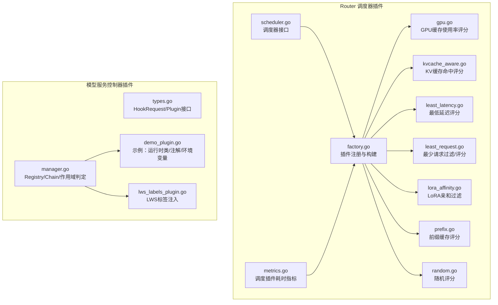
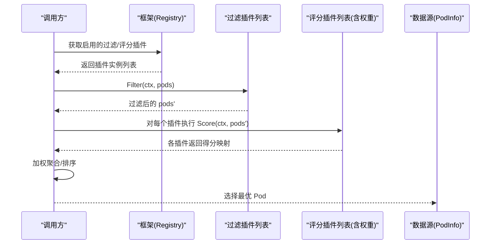
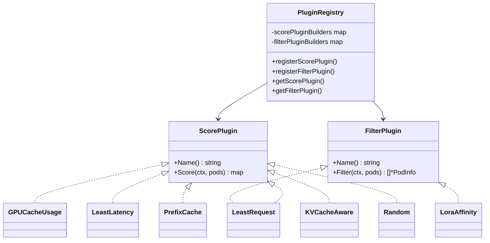
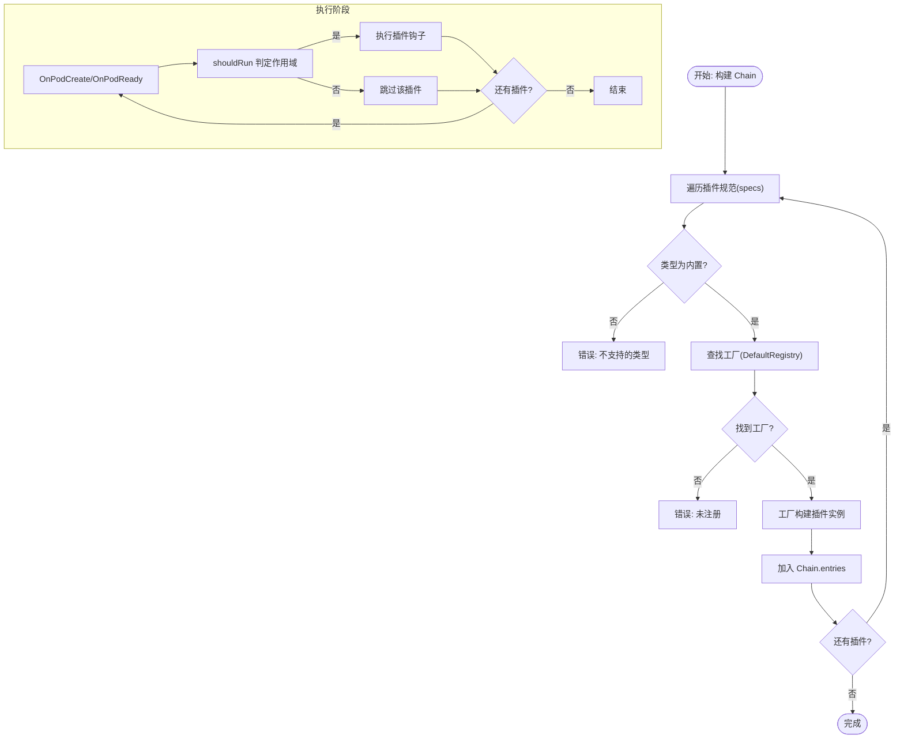
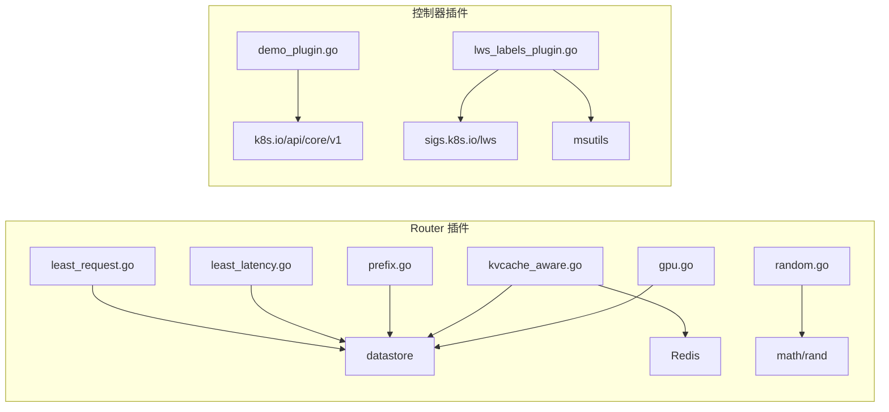

# 插件系统

<cite>
**本文引用的文件**
- [types.go](file://pkg/model-serving-controller/plugins/types.go)
- [manager.go](file://pkg/model-serving-controller/plugins/manager.go)
- [demo_plugin.go](file://pkg/model-serving-controller/plugins/demo_plugin.go)
- [lws_labels_plugin.go](file://pkg/model-serving-controller/plugins/lws_labels_plugin.go)
- [factory.go](file://pkg/kthena-router/scheduler/factory.go)
- [scheduler.go](file://pkg/kthena-router/scheduler/scheduler.go)
- [gpu.go](file://pkg/kthena-router/scheduler/plugins/gpu.go)
- [kvcache_aware.go](file://pkg/kthena-router/scheduler/plugins/kvcache_aware.go)
- [least_latency.go](file://pkg/kthena-router/scheduler/plugins/least_latency.go)
- [least_request.go](file://pkg/kthena-router/scheduler/plugins/least_request.go)
- [lora_affinity.go](file://pkg/kthena-router/scheduler/plugins/lora_affinity.go)
- [prefix.go](file://pkg/kthena-router/scheduler/plugins/prefix.go)
- [random.go](file://pkg/kthena-router/scheduler/plugins/random.go)
- [metrics.go](file://pkg/kthena-router/metrics/metrics.go)
- [config-router.md](file://docs/kthena/docs/user-guide/config-router.md)
- [kthena-router.md](file://docs/kthena/docs/architecture/kthena-router.md)
- [router/index.md](file://docs/kthena/blog/router/index.md)
- [pluginscope.go](file://client-go/applyconfiguration/workload/v1alpha1/pluginscope.go)
- [pluginspec.go](file://client-go/applyconfiguration/workload/v1alpha1/pluginspec.go)
</cite>

## 目录
1. [简介](#简介)
2. [项目结构](#项目结构)
3. [核心组件](#核心组件)
4. [架构总览](#架构总览)
5. [详细组件分析](#详细组件分析)
6. [依赖分析](#依赖分析)
7. [性能考虑](#性能考虑)
8. [故障排查指南](#故障排查指南)
9. [结论](#结论)
10. [附录](#附录)

## 简介
本文件面向 Kthena 的两类插件体系：模型推理路由（Router）侧的“调度器插件”与“模型服务控制器（Model Serving Controller）侧的“工作负载插件”。前者通过可插拔的过滤与评分插件对后端 Pod 进行实时筛选与打分，以实现低延迟、高吞吐与公平性的综合调度；后者通过插件链在 Pod 生命周期钩子上进行细粒度注入与标注，提升与 LWS 等基础设施的协同能力。

本文将系统阐述：
- 插件注册机制与工厂模式
- 插件生命周期与作用域控制
- 不同类型插件的职责与实现原理
- 插件间协作、优先级与组合策略
- 开发指南、最佳实践与性能优化建议

## 项目结构
围绕插件系统的关键目录与文件如下：
- Router 调度器插件
  - 注册与构建：factory.go
  - 接口与调度器：scheduler.go
  - 具体插件：gpu.go、kvcache_aware.go、least_latency.go、least_request.go、lora_affinity.go、prefix.go、random.go
  - 指标：metrics.go
  - 文档：config-router.md、kthena-router.md、blog/router/index.md
- 模型服务控制器插件
  - 类型与接口：types.go
  - 注册与执行链：manager.go
  - 内置插件：demo_plugin.go、lws_labels_plugin.go
  - CRD 配置片段：pluginscope.go、pluginspec.go

**图示来源**
- [factory.go:1-144](file://pkg/kthena-router/scheduler/factory.go#L1-144)
- [scheduler.go:1-29](file://pkg/kthena-router/scheduler/scheduler.go#L1-29)
- [gpu.go:1-50](file://pkg/kthena-router/scheduler/plugins/gpu.go#L1-50)
- [kvcache_aware.go:1-356](file://pkg/kthena-router/scheduler/plugins/kvcache_aware.go#L1-356)
- [least_latency.go:1-131](file://pkg/kthena-router/scheduler/plugins/least_latency.go#L1-131)
- [least_request.go:1-97](file://pkg/kthena-router/scheduler/plugins/least_request.go#L1-97)
- [lora_affinity.go:1-48](file://pkg/kthena-router/scheduler/plugins/lora_affinity.go#L1-48)
- [prefix.go:1-249](file://pkg/kthena-router/scheduler/plugins/prefix.go#L1-249)
- [random.go:1-74](file://pkg/kthena-router/scheduler/plugins/random.go#L1-74)
- [metrics.go:48-85](file://pkg/kthena-router/metrics/metrics.go#L48-85)
- [types.go:1-45](file://pkg/model-serving-controller/plugins/types.go#L1-45)
- [manager.go:1-148](file://pkg/model-serving-controller/plugins/manager.go#L1-148)
- [demo_plugin.go:1-89](file://pkg/model-serving-controller/plugins/demo_plugin.go#L1-89)
- [lws_labels_plugin.go:1-113](file://pkg/model-serving-controller/plugins/lws_labels_plugin.go#L1-113)

**章节来源**
- [factory.go:1-144](file://pkg/kthena-router/scheduler/factory.go#L1-144)
- [scheduler.go:1-29](file://pkg/kthena-router/scheduler/scheduler.go#L1-29)
- [manager.go:1-148](file://pkg/model-serving-controller/plugins/manager.go#L1-148)
- [types.go:1-45](file://pkg/model-serving-controller/plugins/types.go#L1-45)

## 核心组件
- Router 调度器插件
  - 插件注册中心：按名称注册评分/过滤插件构造器
  - 插件接口：统一的 ScorePlugin/FilterPlugin 接口
  - 默认插件：GPU 使用率、最少请求、最低延迟、前缀缓存、KV 缓存、LoRA 亲和、随机
  - 执行流程：先过滤，再加权评分，最后选择最优 Pod
- 模型服务控制器插件
  - 插件接口：OnPodCreate/OnPodReady 生命周期钩子
  - 注册与链式执行：Registry 维护工厂映射，Chain 按顺序执行并支持作用域过滤
  - 作用域控制：按角色（RoleName）与目标（Entry/Worker/All）决定是否执行
  - 内置插件：示例插件（运行时类/注解/环境变量）、LWS 标签注入

**章节来源**
- [factory.go:29-95](file://pkg/kthena-router/scheduler/factory.go#L29-95)
- [scheduler.go:25-28](file://pkg/kthena-router/scheduler/scheduler.go#L25-28)
- [manager.go:30-147](file://pkg/model-serving-controller/plugins/manager.go#L30-147)
- [types.go:27-44](file://pkg/model-serving-controller/plugins/types.go#L27-44)

## 架构总览
Router 调度器采用“框架 + 多插件”的组合式架构。调度器根据配置加载启用的插件，依次执行过滤与评分，并结合权重得到最终候选集合，再进行选择。

**图示来源**
- [factory.go:97-143](file://pkg/kthena-router/scheduler/factory.go#L97-143)
- [scheduler.go:25-28](file://pkg/kthena-router/scheduler/scheduler.go#L25-28)

## 详细组件分析

### Router 调度器插件体系
- 插件注册与工厂
  - 通过 PluginRegistry 维护名称到构造器的映射，支持评分与过滤两类插件
  - 默认插件集中注册，便于统一启用/禁用
- 插件接口
  - ScorePlugin：按 Pod 返回得分映射
  - FilterPlugin：过滤不满足条件的 Pod
- 典型插件
  - GPU 使用率评分：基于 GPU KV 缓存使用率反向打分
  - 最少请求：过滤等待队列超限的 Pod，并按运行/等待数量打分
  - 最低延迟：基于 TTFT/TPOT 的线性归一化打分
  - 前缀缓存：滚动哈希 + LRU 缓存，按最长公共前缀长度打分
  - KV 缓存：基于 Redis 的块级哈希匹配，计算跨 Pod 命中长度
  - LoRA 亲和：仅保留已加载目标 LoRA 的 Pod
  - 随机：仅用于测试，避免与有意义评分混用

**图示来源**
- [factory.go:29-95](file://pkg/kthena-router/scheduler/factory.go#L29-95)
- [gpu.go:24-49](file://pkg/kthena-router/scheduler/plugins/gpu.go#L24-49)
- [least_request.go:29-96](file://pkg/kthena-router/scheduler/plugins/least_request.go#L29-96)
- [least_latency.go:30-96](file://pkg/kthena-router/scheduler/plugins/least_latency.go#L30-96)
- [prefix.go:88-156](file://pkg/kthena-router/scheduler/plugins/prefix.go#L88-156)
- [kvcache_aware.go:48-140](file://pkg/kthena-router/scheduler/plugins/kvcache_aware.go#L48-140)
- [lora_affinity.go:25-47](file://pkg/kthena-router/scheduler/plugins/lora_affinity.go#L25-47)
- [random.go:29-73](file://pkg/kthena-router/scheduler/plugins/random.go#L29-73)

**章节来源**
- [factory.go:29-143](file://pkg/kthena-router/scheduler/factory.go#L29-143)
- [gpu.go:24-49](file://pkg/kthena-router/scheduler/plugins/gpu.go#L24-49)
- [least_request.go:29-96](file://pkg/kthena-router/scheduler/plugins/least_request.go#L29-96)
- [least_latency.go:30-130](file://pkg/kthena-router/scheduler/plugins/least_latency.go#L30-130)
- [prefix.go:88-248](file://pkg/kthena-router/scheduler/plugins/prefix.go#L88-248)
- [kvcache_aware.go:48-355](file://pkg/kthena-router/scheduler/plugins/kvcache_aware.go#L48-355)
- [lora_affinity.go:25-47](file://pkg/kthena-router/scheduler/plugins/lora_affinity.go#L25-47)
- [random.go:29-73](file://pkg/kthena-router/scheduler/plugins/random.go#L29-73)

### 模型服务控制器插件体系
- 接口与生命周期
  - Plugin 接口定义 Name()/OnPodCreate()/OnPodReady()
  - HookRequest 提供 ModelServing、ServingGroup、RoleName/ID、是否入口 Pod、以及待注入的 Pod
- 注册与执行链
  - Registry 维护插件名到工厂函数映射
  - Chain 按配置顺序构建插件实例，执行时根据 Scope 判定是否运行
- 作用域控制
  - 支持按 RoleName 与 Target（Entry/Worker/All）过滤插件执行
- 内置插件
  - 示例插件：修改 RuntimeClassName、注解、容器环境变量
  - LWS 标签插件：为 LWS 系统注入 SetName/GroupIndex/WorkerIndex/GroupUniqueHash 等标签

**图示来源**
- [manager.go:59-147](file://pkg/model-serving-controller/plugins/manager.go#L59-147)
- [types.go:27-44](file://pkg/model-serving-controller/plugins/types.go#L27-44)

**章节来源**
- [types.go:27-44](file://pkg/model-serving-controller/plugins/types.go#L27-44)
- [manager.go:30-147](file://pkg/model-serving-controller/plugins/manager.go#L30-147)
- [demo_plugin.go:28-88](file://pkg/model-serving-controller/plugins/demo_plugin.go#L28-88)
- [lws_labels_plugin.go:34-112](file://pkg/model-serving-controller/plugins/lws_labels_plugin.go#L34-112)

### 插件协作机制、优先级与组合策略
- 协作流程
  - 过滤阶段：过滤掉明显不合适的 Pod（如等待队列超限、缺少 LoRA）
  - 评分阶段：各评分插件独立输出得分，支持不同维度（延迟、请求量、缓存命中潜力、GPU 使用率）
  - 组合策略：将各插件得分按权重聚合，选择最高分 Pod
- 权重与稳定性
  - 权重为非负整数，非法值会被修正为 0
  - 建议将“最少请求”作为基础过滤，配合“最低延迟/前缀缓存/KV 缓存”进行精细化打分
- 作用域与顺序
  - 控制器侧：Chain 顺序即执行顺序，作用域由 Scope 决定
  - 路由器侧：过滤插件先于评分插件执行，评分插件可并行或串行组合，最终取最优

**章节来源**
- [factory.go:97-143](file://pkg/kthena-router/scheduler/factory.go#L97-143)
- [least_request.go:62-96](file://pkg/kthena-router/scheduler/plugins/least_request.go#L62-96)
- [prefix.go:162-206](file://pkg/kthena-router/scheduler/plugins/prefix.go#L162-206)
- [manager.go:82-112](file://pkg/model-serving-controller/plugins/manager.go#L82-112)

## 依赖分析
- Router 调度器插件
  - 依赖关系：插件实现依赖 datastore 的 PodInfo 指标；前缀缓存依赖本地存储；KV 缓存依赖 Redis；随机插件依赖标准库随机数
  - 关键耦合点：插件参数通过 YAML 解析传入；前缀缓存与 KV 缓存均涉及外部存储读写
- 模型服务控制器插件
  - 依赖关系：插件通过 HookRequest 访问 Pod 规格与元数据；LWS 插件依赖 LWS 标签常量与工具函数
  - 关键耦合点：作用域判定依赖 ModelServing 的 OwnerReference 与 ServingGroup

**图示来源**
- [least_request.go:19-27](file://pkg/kthena-router/scheduler/plugins/least_request.go#L19-27)
- [least_latency.go:19-28](file://pkg/kthena-router/scheduler/plugins/least_latency.go#L19-28)
- [prefix.go:73-86](file://pkg/kthena-router/scheduler/plugins/prefix.go#L73-86)
- [kvcache_aware.go:30-46](file://pkg/kthena-router/scheduler/plugins/kvcache_aware.go#L30-46)
- [gpu.go:19-22](file://pkg/kthena-router/scheduler/plugins/gpu.go#L19-22)
- [random.go:19-27](file://pkg/kthena-router/scheduler/plugins/random.go#L19-27)
- [demo_plugin.go:19-26](file://pkg/model-serving-controller/plugins/demo_plugin.go#L19-26)
- [lws_labels_plugin.go:19-32](file://pkg/model-serving-controller/plugins/lws_labels_plugin.go#L19-32)

**章节来源**
- [kvcache_aware.go:30-46](file://pkg/kthena-router/scheduler/plugins/kvcache_aware.go#L30-46)
- [prefix.go:73-86](file://pkg/kthena-router/scheduler/plugins/prefix.go#L73-86)
- [demo_plugin.go:19-26](file://pkg/model-serving-controller/plugins/demo_plugin.go#L19-26)
- [lws_labels_plugin.go:19-32](file://pkg/model-serving-controller/plugins/lws_labels_plugin.go#L19-32)

## 性能考虑
- 插件执行开销
  - 前缀缓存与 KV 缓存均涉及外部存储访问，应合理设置最大块数与缓存容量，避免过度查询
  - 最少请求评分使用线性归一化，复杂度 O(n)，在 Pod 数量较多时需关注计算时间
- 指标观测
  - 调度插件耗时指标可用于定位瓶颈，建议在生产中开启相应监控
- 组合策略
  - 将“最少请求”作为过滤器，降低后续评分压力
  - “最低延迟/前缀缓存/KV 缓存”可并行评估，注意权重分配与一致性

**章节来源**
- [metrics.go:67-68](file://pkg/kthena-router/metrics/metrics.go#L67-68)
- [least_request.go:68-96](file://pkg/kthena-router/scheduler/plugins/least_request.go#L68-96)
- [prefix.go:162-206](file://pkg/kthena-router/scheduler/plugins/prefix.go#L162-206)
- [kvcache_aware.go:194-238](file://pkg/kthena-router/scheduler/plugins/kvcache_aware.go#L194-238)

## 故障排查指南
- 插件未注册/类型不支持
  - 现象：构建 Chain 报错“插件未注册/类型不支持”
  - 排查：确认插件名拼写、是否在默认注册表中注册、类型是否为内置
- 作用域不匹配
  - 现象：插件未执行
  - 排查：检查 Scope.Roles 与当前 RoleName 是否匹配；检查 Scope.Target 与 IsEntry/Worker 是否一致
- 参数解析失败
  - 现象：插件初始化失败或使用默认参数
  - 排查：核对 YAML 参数格式与字段名；确保参数范围有效
- 外部依赖异常
  - 现象：前缀缓存/ KV 缓存查询失败
  - 排查：检查 Redis 可达性与键空间；确认模型名与哈希规则一致

**章节来源**
- [manager.go:59-80](file://pkg/model-serving-controller/plugins/manager.go#L59-80)
- [manager.go:122-139](file://pkg/model-serving-controller/plugins/manager.go#L122-139)
- [factory.go:114-143](file://pkg/kthena-router/scheduler/factory.go#L114-143)
- [kvcache_aware.go:107-140](file://pkg/kthena-router/scheduler/plugins/kvcache_aware.go#L107-140)

## 结论
Kthena 的插件系统通过清晰的接口与工厂注册机制，实现了调度器与控制器两侧的可扩展性。Router 侧以“过滤 + 评分 + 选择”的流水线组合多维指标，控制器侧以生命周期钩子与作用域控制实现细粒度注入。通过合理的参数配置与组合策略，可在低延迟、高吞吐与资源公平之间取得平衡。

## 附录

### 插件开发指南（Router）
- 实现步骤
  - 定义插件名与参数结构（YAML 解析）
  - 实现 ScorePlugin 或 FilterPlugin 接口
  - 在注册表中注册插件构造器
- 最佳实践
  - 参数校验与默认值处理
  - 外部依赖（Redis/远程分词器）的超时与降级
  - 评分范围标准化，避免负值与溢出
- 性能建议
  - 控制最大块数与缓存大小
  - 评分插件尽量避免重复计算

**章节来源**
- [factory.go:66-95](file://pkg/kthena-router/scheduler/factory.go#L66-95)
- [least_latency.go:46-58](file://pkg/kthena-router/scheduler/plugins/least_latency.go#L46-58)
- [prefix.go:114-156](file://pkg/kthena-router/scheduler/plugins/prefix.go#L114-156)
- [kvcache_aware.go:107-140](file://pkg/kthena-router/scheduler/plugins/kvcache_aware.go#L107-140)

### 插件开发指南（控制器）
- 实现步骤
  - 实现 Plugin 接口（Name/OnPodCreate/OnPodReady）
  - 在 init 中注册到 DefaultRegistry
  - 使用 DecodeJSON 解析配置
- 最佳实践
  - 仅在必要时修改 PodSpec，避免不必要的变更
  - 作用域判定前置，减少无效执行
- 性能建议
  - 避免在 OnPodReady 中做重 IO 操作
  - 合理使用指针与拷贝，减少内存占用

**章节来源**
- [types.go:37-44](file://pkg/model-serving-controller/plugins/types.go#L37-44)
- [manager.go:30-57](file://pkg/model-serving-controller/plugins/manager.go#L30-57)
- [demo_plugin.go:43-54](file://pkg/model-serving-controller/plugins/demo_plugin.go#L43-54)

### 配置参考（Router）
- 插件启用/禁用与权重
  - Filter 与 Score 的 enabled/disabled 列表
  - Score 插件的权重字典
- 典型参数
  - 最少请求：maxWaitingRequests
  - 最低延迟：TTFTTPOTWeightFactor
  - 前缀缓存：blockSizeToHash、maxBlocksToMatch、maxHashCacheSize、topKMatches

**章节来源**
- [config-router.md:15-35](file://docs/kthena/docs/user-guide/config-router.md#L15-L35)
- [router/index.md:191-229](file://docs/kthena/blog/router/index.md#L191-L229)

### CRD 配置片段（控制器）
- PluginSpec：插件名称、类型、配置、作用域
- PluginScope：Roles、Target（Entry/Worker/All）

**章节来源**
- [pluginspec.go](file://client-go/applyconfiguration/workload/v1alpha1/pluginspec.go)
- [pluginscope.go](file://client-go/applyconfiguration/workload/v1alpha1/pluginscope.go)