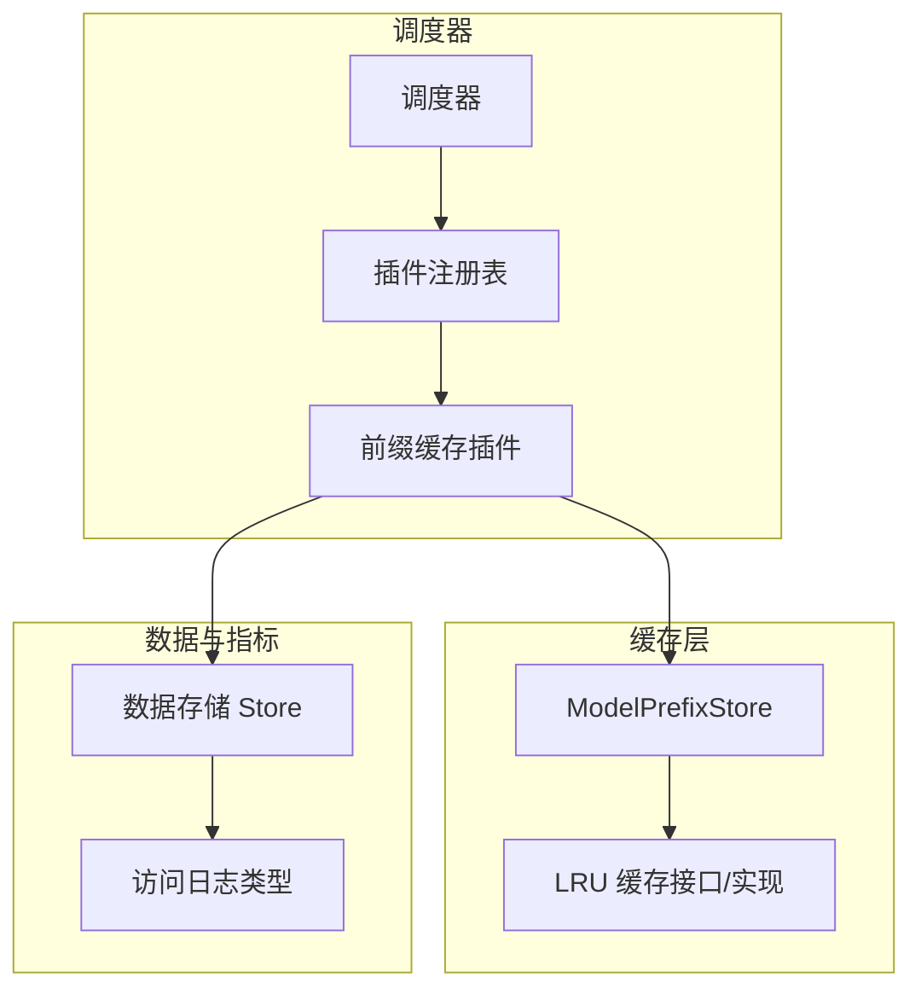
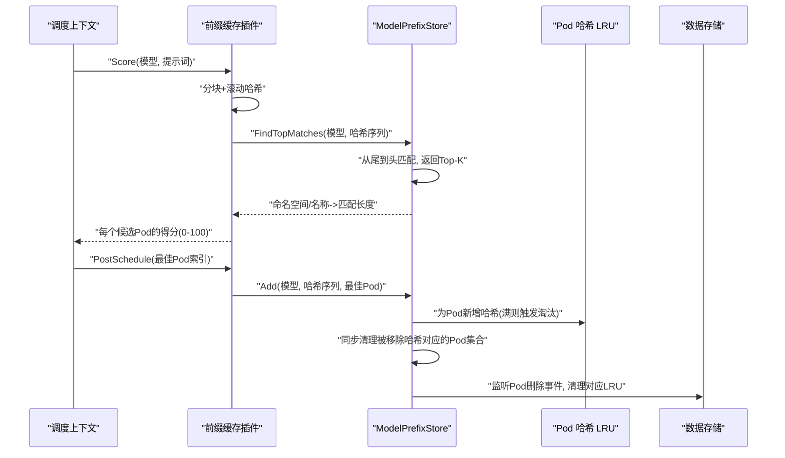
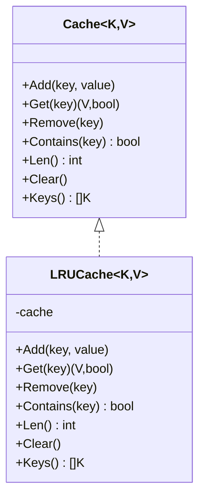
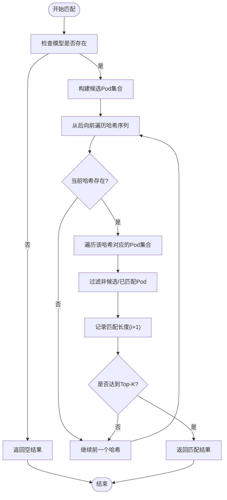
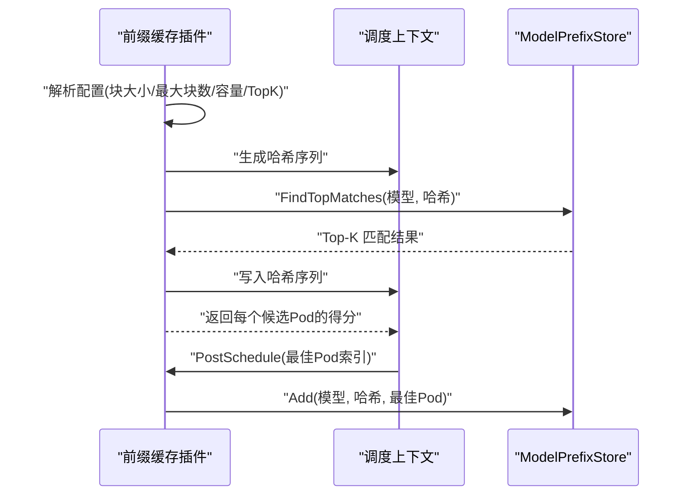
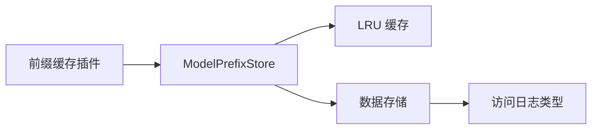

# 缓存管理

<cite>
**本文引用的文件**
- [lru.go](file://pkg/kthena-router/scheduler/plugins/cache/lru.go)
- [prefix_store.go](file://pkg/kthena-router/scheduler/plugins/cache/prefix_store.go)
- [prefix.go](file://pkg/kthena-router/scheduler/plugins/prefix.go)
- [scheduler_impl.go](file://pkg/kthena-router/scheduler/scheduler_impl.go)
- [factory_test.go](file://pkg/kthena-router/scheduler/factory_test.go)
- [prefix_store_test.go](file://pkg/kthena-router/scheduler/plugins/cache/prefix_store_test.go)
- [store.go](file://pkg/kthena-router/datastore/store.go)
- [types.go](file://pkg/kthena-router/accesslog/types.go)
- [short_system_prompt.html](file://docs/kthena/blog/2025-09-09-benchmark/reports/short_system_prompt.html)
- [long_system_prompt.html](file://docs/kthena/blog/2025-09-09-benchmark/reports/long_system_prompt.html)
</cite>

## 目录
1. [简介](#简介)
2. [项目结构](#项目结构)
3. [核心组件](#核心组件)
4. [架构总览](#架构总览)
5. [详细组件分析](#详细组件分析)
6. [依赖分析](#依赖分析)
7. [性能考量](#性能考量)
8. [故障排查指南](#故障排查指南)
9. [结论](#结论)
10. [附录](#附录)

## 简介
本文件面向 Kthena 调度器中的缓存管理系统，系统性阐述其架构设计与实现要点，覆盖 LRU 缓存抽象、前缀存储（ModelPrefixStore）机制、调度插件集成方式、并发访问控制、缓存命中率优化策略、容量与清理机制、以及在高并发场景下的性能监控与调优建议。目标是帮助开发者在推理工作负载中高效利用缓存，提升调度性能与资源利用率。

## 项目结构
缓存相关能力主要分布在以下模块：
- 缓存抽象层：LRU 接口与实现，统一缓存操作语义
- 前缀缓存存储：基于模型维度的三段式映射与分片锁，支持 Top-K 匹配与 LRU 淘汰
- 调度插件：前缀缓存评分插件，将前缀匹配结果转化为调度权重
- 调度器：默认启用前缀缓存插件，并通过配置参数控制行为
- 数据源与指标：数据存储与运行时指标更新，支撑缓存命中后的调度决策

**图表来源**
- [scheduler_impl.go:59-88](file://pkg/kthena-router/scheduler/scheduler_impl.go#L59-L88)
- [prefix.go:116-156](file://pkg/kthena-router/scheduler/plugins/prefix.go#L116-L156)
- [prefix_store.go:82-94](file://pkg/kthena-router/scheduler/plugins/cache/prefix_store.go#L82-L94)
- [lru.go:23-87](file://pkg/kthena-router/scheduler/plugins/cache/lru.go#L23-L87)
- [store.go:1168-1188](file://pkg/kthena-router/datastore/store.go#L1168-L1188)
- [types.go:173-197](file://pkg/kthena-router/accesslog/types.go#L173-L197)

**章节来源**
- [scheduler_impl.go:59-88](file://pkg/kthena-router/scheduler/scheduler_impl.go#L59-L88)
- [prefix.go:116-156](file://pkg/kthena-router/scheduler/plugins/prefix.go#L116-L156)
- [prefix_store.go:82-94](file://pkg/kthena-router/scheduler/plugins/cache/prefix_store.go#L82-L94)
- [lru.go:23-87](file://pkg/kthena-router/scheduler/plugins/cache/lru.go#L23-L87)
- [store.go:1168-1188](file://pkg/kthena-router/datastore/store.go#L1168-L1188)
- [types.go:173-197](file://pkg/kthena-router/accesslog/types.go#L173-L197)

## 核心组件
- LRU 缓存接口与实现：定义通用缓存操作（增删查、存在性、长度、清空、键序列），并以 hashicorp/golang-lru 作为底层实现，支持淘汰回调。
- ModelPrefixStore：三层映射结构（模型 -> 哈希 -> Pod 集合），采用分片哈希降低锁竞争；每个 Pod 维护独立 LRU，记录该 Pod 的哈希集合，用于淘汰同步清理。
- 前缀缓存插件：将请求提示词切分为固定大小块，滚动计算哈希，按最长前缀匹配返回 Top-K Pod，评分范围 0-100。
- 调度器集成：默认启用前缀缓存插件，支持通过配置参数调整块大小、最大匹配块数、哈希缓存容量与 Top-K 数量。

**章节来源**
- [lru.go:23-87](file://pkg/kthena-router/scheduler/plugins/cache/lru.go#L23-L87)
- [prefix_store.go:67-94](file://pkg/kthena-router/scheduler/plugins/cache/prefix_store.go#L67-L94)
- [prefix.go:107-156](file://pkg/kthena-router/scheduler/plugins/prefix.go#L107-L156)
- [scheduler_impl.go:65-77](file://pkg/kthena-router/scheduler/scheduler_impl.go#L65-L77)

## 架构总览
调度流程中，前缀缓存插件负责：
- 对输入提示词进行分块与滚动哈希
- 查询 ModelPrefixStore 获取 Top-K 匹配的 Pod
- 将匹配长度转换为 0-100 的分数
- 在 PostSchedule 阶段将最佳 Pod 与其哈希加入缓存

**图表来源**
- [prefix.go:162-206](file://pkg/kthena-router/scheduler/plugins/prefix.go#L162-L206)
- [prefix_store.go:138-195](file://pkg/kthena-router/scheduler/plugins/cache/prefix_store.go#L138-L195)
- [prefix_store.go:197-238](file://pkg/kthena-router/scheduler/plugins/cache/prefix_store.go#L197-L238)
- [prefix_store.go:96-124](file://pkg/kthena-router/scheduler/plugins/cache/prefix_store.go#L96-L124)

## 详细组件分析

### LRU 缓存抽象与实现
- 设计要点
  - 泛型接口统一缓存操作，便于替换实现
  - 使用淘汰回调，确保数据一致性（如 Pod 删除或 LRU 淘汰时同步清理三层映射）
- 并发与性能
  - 通过外部锁保护容器状态，避免竞态
  - 淘汰回调异步执行，降低阻塞风险

**图表来源**
- [lru.go:23-87](file://pkg/kthena-router/scheduler/plugins/cache/lru.go#L23-L87)

**章节来源**
- [lru.go:23-87](file://pkg/kthena-router/scheduler/plugins/cache/lru.go#L23-L87)

### ModelPrefixStore：前缀存储与匹配
- 结构设计
  - 三层映射：模型 -> 哈希 -> Pod 集合
  - 分片哈希：32 个分片，降低热点竞争
  - Pod 级 LRU：记录每个 Pod 的哈希序列，容量由配置决定
- 匹配算法
  - 从哈希序列末尾向前匹配，一旦命中即确定此前所有块均匹配
  - 返回 Top-K 最长匹配的 Pod 及匹配长度
- 淘汰与清理
  - Pod 删除事件触发：回收该 Pod 的哈希集合
  - LRU 淘汰回调：同步清理三层映射中的对应条目
  - 模型级空桶检测：若某模型映射为空则删除顶层键

**图表来源**
- [prefix_store.go:138-195](file://pkg/kthena-router/scheduler/plugins/cache/prefix_store.go#L138-L195)

**章节来源**
- [prefix_store.go:67-94](file://pkg/kthena-router/scheduler/plugins/cache/prefix_store.go#L67-L94)
- [prefix_store.go:138-195](file://pkg/kthena-router/scheduler/plugins/cache/prefix_store.go#L138-L195)
- [prefix_store.go:197-238](file://pkg/kthena-router/scheduler/plugins/cache/prefix_store.go#L197-L238)
- [prefix_store.go:240-260](file://pkg/kthena-router/scheduler/plugins/cache/prefix_store.go#L240-L260)

### 前缀缓存插件：评分与调度集成
- 初始化与配置
  - 支持块大小、最大匹配块数、哈希缓存容量、Top-K 参数
  - 默认值与参数校验逻辑
- 评分流程
  - 计算滚动哈希序列
  - 写入上下文哈希以便后续使用
  - 查找 Top-K 匹配并计算得分（匹配块数/总块数×100）
- 后处理
  - 在 PostSchedule 中将最佳 Pod 与其哈希加入缓存

**图表来源**
- [prefix.go:116-156](file://pkg/kthena-router/scheduler/plugins/prefix.go#L116-L156)
- [prefix.go:162-206](file://pkg/kthena-router/scheduler/plugins/prefix.go#L162-L206)

**章节来源**
- [prefix.go:107-156](file://pkg/kthena-router/scheduler/plugins/prefix.go#L107-L156)
- [prefix.go:162-206](file://pkg/kthena-router/scheduler/plugins/prefix.go#L162-L206)

### 调度器配置与插件加载
- 默认启用前缀缓存插件，权重为 1
- 支持通过配置文件覆盖默认参数（块大小、最大块数、容量、Top-K）
- 工厂测试验证了插件注册与初始化行为

**章节来源**
- [scheduler_impl.go:65-77](file://pkg/kthena-router/scheduler/scheduler_impl.go#L65-L77)
- [factory_test.go:49-72](file://pkg/kthena-router/scheduler/factory_test.go#L49-L72)

## 依赖分析
- 插件到存储：前缀缓存插件依赖 ModelPrefixStore 进行匹配与缓存写入
- 存储到缓存：ModelPrefixStore 使用 LRU 缓存管理每个 Pod 的哈希集合
- 存储到数据源：ModelPrefixStore 注册 Pod 删除回调，从数据存储获取事件并清理
- 指标与日志：数据存储更新 Pod 指标，访问日志类型计算各阶段耗时，辅助评估缓存收益

**图表来源**
- [prefix.go:148-155](file://pkg/kthena-router/scheduler/plugins/prefix.go#L148-L155)
- [prefix_store.go:82-94](file://pkg/kthena-router/scheduler/plugins/cache/prefix_store.go#L82-L94)
- [lru.go:47-53](file://pkg/kthena-router/scheduler/plugins/cache/lru.go#L47-L53)
- [store.go:1168-1188](file://pkg/kthena-router/datastore/store.go#L1168-L1188)
- [types.go:173-197](file://pkg/kthena-router/accesslog/types.go#L173-L197)

**章节来源**
- [prefix.go:148-155](file://pkg/kthena-router/scheduler/plugins/prefix.go#L148-L155)
- [prefix_store.go:82-94](file://pkg/kthena-router/scheduler/plugins/cache/prefix_store.go#L82-L94)
- [lru.go:47-53](file://pkg/kthena-router/scheduler/plugins/cache/lru.go#L47-L53)
- [store.go:1168-1188](file://pkg/kthena-router/datastore/store.go#L1168-L1188)
- [types.go:173-197](file://pkg/kthena-router/accesslog/types.go#L173-L197)

## 性能考量
- 命中率优化
  - 合理设置块大小与最大匹配块数，平衡匹配精度与计算开销
  - 适当提高 Top-K 与哈希缓存容量，增加相似请求的复用机会
- 内存管理
  - Pod 级 LRU 容量直接影响内存占用与淘汰频率，需结合并发与历史复用情况调优
  - 分片哈希降低锁粒度，减少热点冲突
- 并发访问控制
  - 三层映射与分片锁配合，查询路径尽量只读锁，写入路径加锁但范围有限
  - 淘汰回调异步执行，避免阻塞主流程
- 性能监控与基准
  - 基准报告对比了“Least Request”、“Least Request+KV Cache”、“Least Request+Prefix Cache”等策略的吞吐与 TTFT/TPOT 指标，可据此评估缓存带来的收益

**章节来源**
- [prefix_store.go:34-38](file://pkg/kthena-router/scheduler/plugins/cache/prefix_store.go#L34-L38)
- [prefix_store.go:74-79](file://pkg/kthena-router/scheduler/plugins/cache/prefix_store.go#L74-L79)
- [short_system_prompt.html:214-272](file://docs/kthena/blog/2025-09-09-benchmark/reports/short_system_prompt.html#L214-L272)
- [long_system_prompt.html:214-272](file://docs/kthena/blog/2025-09-09-benchmark/reports/long_system_prompt.html#L214-L272)

## 故障排查指南
- 常见问题
  - 匹配结果为空：确认模型名一致、提示词非空、最大匹配块数足够
  - 命中率低：检查块大小是否过小导致碎片化，或 Top-K 太小未覆盖足够候选
  - 内存占用过高：降低 Pod 哈希 LRU 容量或减少模型数量
  - 并发异常：关注淘汰回调与查询路径的锁顺序，避免死锁
- 调试建议
  - 打开日志级别，观察插件初始化与配置解析过程
  - 在高并发压力下，使用测试用例覆盖并发 Add/Find/删除场景
  - 关注 Pod 删除事件是否正确触发清理，避免悬挂条目

**章节来源**
- [prefix_store_test.go:329-434](file://pkg/kthena-router/scheduler/plugins/cache/prefix_store_test.go#L329-L434)
- [prefix_store_test.go:502-664](file://pkg/kthena-router/scheduler/plugins/cache/prefix_store_test.go#L502-L664)

## 结论
Kthena 的缓存管理通过 LRU 抽象与 ModelPrefixStore 的三层映射实现了高效的前缀匹配与调度评分。合理的参数配置与并发控制策略能在高并发场景下显著提升缓存命中率与整体调度性能。建议结合基准报告与实际业务特征持续调优，确保在吞吐与延迟之间取得最佳平衡。

## 附录
- 配置参数说明（来自插件参数与默认值）
  - blockSizeToHash：每块字节数，默认 64
  - maxBlocksToMatch：最大匹配块数，默认 128
  - maxHashCacheSize：每个 Pod 哈希 LRU 容量，默认 50000
  - topKMatches：返回 Top-K 匹配，默认 5

**章节来源**
- [prefix.go:107-112](file://pkg/kthena-router/scheduler/plugins/prefix.go#L107-L112)
- [prefix.go:117-146](file://pkg/kthena-router/scheduler/plugins/prefix.go#L117-L146)