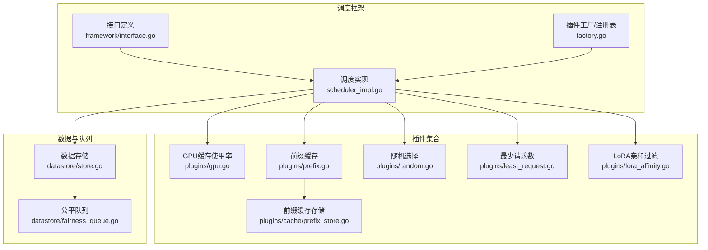
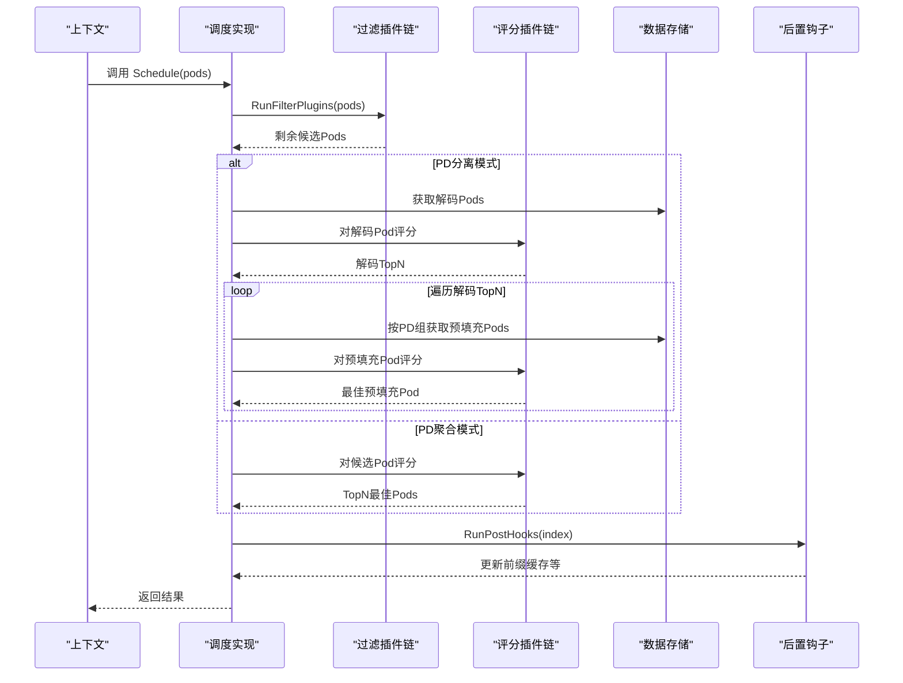
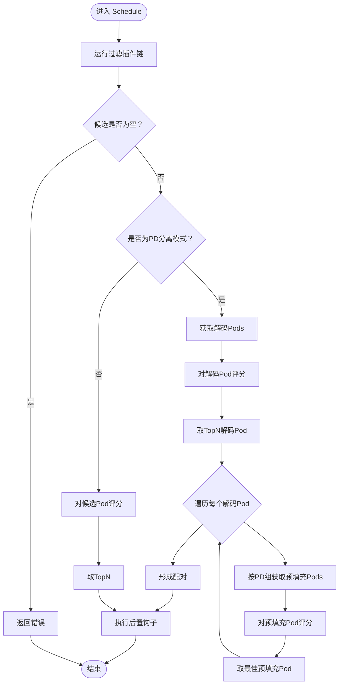
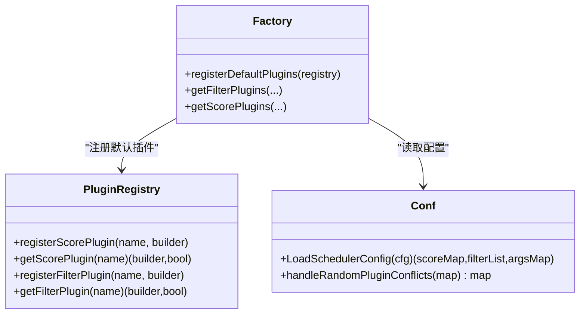
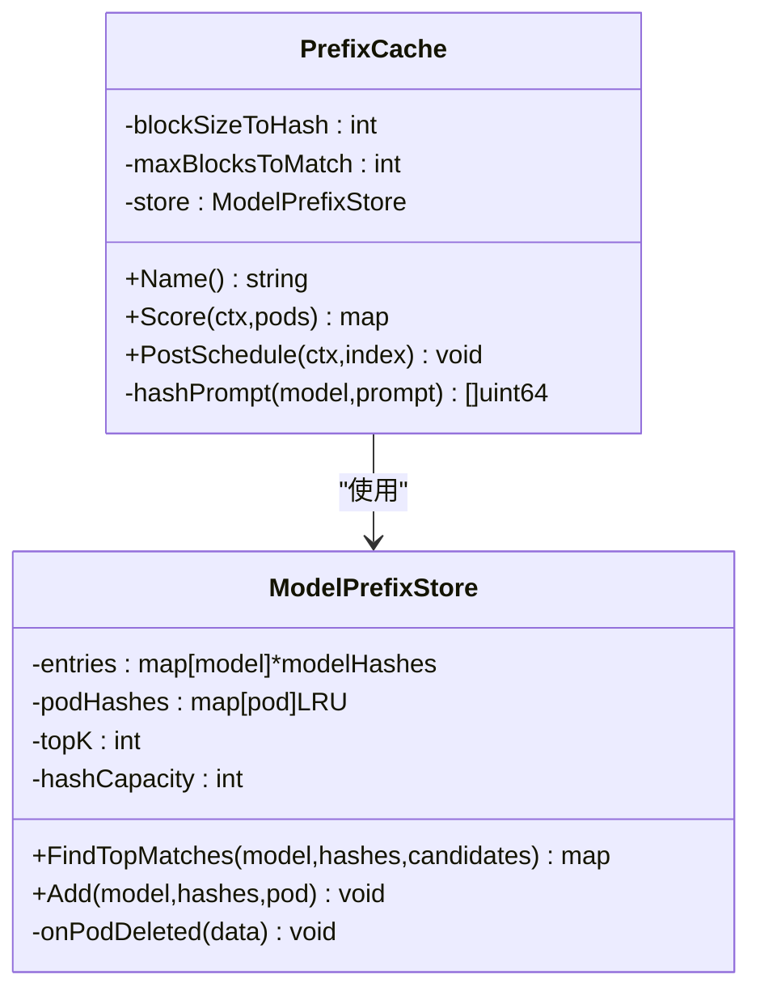
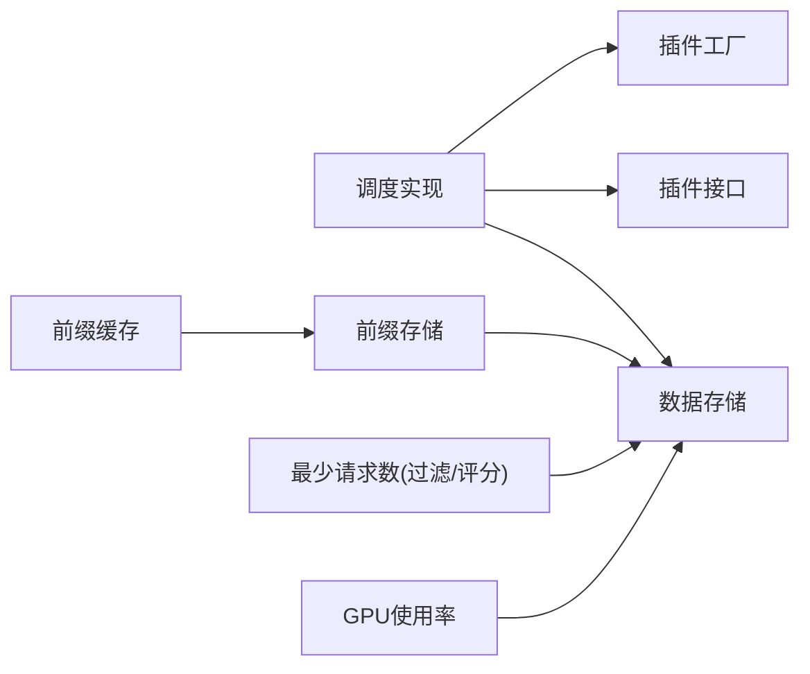

# 调度器系统

<cite>
**本文引用的文件**
- [pkg/kthena-router/scheduler/scheduler.go](file://pkg/kthena-router/scheduler/scheduler.go)
- [pkg/kthena-router/scheduler/scheduler_impl.go](file://pkg/kthena-router/scheduler/scheduler_impl.go)
- [pkg/kthena-router/scheduler/factory.go](file://pkg/kthena-router/scheduler/factory.go)
- [pkg/kthena-router/scheduler/framework/interface.go](file://pkg/kthena-router/scheduler/framework/interface.go)
- [pkg/kthena-router/scheduler/plugins/conf/conf.go](file://pkg/kthena-router/scheduler/plugins/conf/conf.go)
- [pkg/kthena-router/scheduler/plugins/gpu.go](file://pkg/kthena-router/scheduler/plugins/gpu.go)
- [pkg/kthena-router/scheduler/plugins/prefix.go](file://pkg/kthena-router/scheduler/plugins/prefix.go)
- [pkg/kthena-router/scheduler/plugins/random.go](file://pkg/kthena-router/scheduler/plugins/random.go)
- [pkg/kthena-router/scheduler/plugins/least_request.go](file://pkg/kthena-router/scheduler/plugins/least_request.go)
- [pkg/kthena-router/scheduler/plugins/lora_affinity.go](file://pkg/kthena-router/scheduler/plugins/lora_affinity.go)
- [pkg/kthena-router/scheduler/plugins/cache/prefix_store.go](file://pkg/kthena-router/scheduler/plugins/cache/prefix_store.go)
- [pkg/kthena-router/datastore/store.go](file://pkg/kthena-router/datastore/store.go)
- [pkg/kthena-router/datastore/fairness_queue.go](file://pkg/kthena-router/datastore/fairness_queue.go)
</cite>

## 目录
1. [简介](#简介)
2. [项目结构](#项目结构)
3. [核心组件](#核心组件)
4. [架构总览](#架构总览)
5. [详细组件分析](#详细组件分析)
6. [依赖分析](#依赖分析)
7. [性能考虑](#性能考虑)
8. [故障排查指南](#故障排查指南)
9. [结论](#结论)
10. [附录](#附录)

## 简介
本文件面向系统架构师与插件开发者，系统化阐述 Kthena 调度器的可插拔设计与实现细节。内容覆盖框架接口定义、插件注册机制、调度执行流程、过滤与评分插件协作、多模型路由、公平调度、网络拓扑感知、性能优化与扩展性设计。通过分层讲解与图示，帮助读者快速理解并高效扩展调度能力。

## 项目结构
调度器位于 kthena-router 子模块中，采用“框架接口 + 插件工厂 + 数据存储 + 公平队列”的分层组织方式：
- 框架接口：定义调度上下文、过滤与评分插件、后置钩子接口
- 工厂与注册表：集中注册默认插件，按配置动态构建插件实例
- 插件实现：GPU 缓存使用率、前缀缓存、随机、最少请求数等
- 数据存储：统一维护 Pod 信息、模型路由、PD 分离组、公平队列
- 公平队列：基于令牌计数与请求量的优先级调度

图表来源
- [pkg/kthena-router/scheduler/framework/interface.go:28-66](file://pkg/kthena-router/scheduler/framework/interface.go#L28-L66)
- [pkg/kthena-router/scheduler/scheduler_impl.go:101-165](file://pkg/kthena-router/scheduler/scheduler_impl.go#L101-L165)
- [pkg/kthena-router/scheduler/factory.go:66-95](file://pkg/kthena-router/scheduler/factory.go#L66-L95)
- [pkg/kthena-router/scheduler/plugins/prefix.go:162-188](file://pkg/kthena-router/scheduler/plugins/prefix.go#L162-L188)
- [pkg/kthena-router/scheduler/plugins/cache/prefix_store.go:138-195](file://pkg/kthena-router/scheduler/plugins/cache/prefix_store.go#L138-L195)
- [pkg/kthena-router/datastore/store.go:162-240](file://pkg/kthena-router/datastore/store.go#L162-L240)
- [pkg/kthena-router/datastore/fairness_queue.go:31-116](file://pkg/kthena-router/datastore/fairness_queue.go#L31-L116)

章节来源
- [pkg/kthena-router/scheduler/scheduler.go:25-28](file://pkg/kthena-router/scheduler/scheduler.go#L25-L28)
- [pkg/kthena-router/scheduler/factory.go:29-63](file://pkg/kthena-router/scheduler/factory.go#L29-L63)

## 核心组件
- 调度器接口与实现
  - 接口定义了调度入口与后置钩子调用点
  - 实现负责过滤、评分、PD 分离模式下的配对与回填、TopN 选择
- 插件框架
  - 过滤插件：在评分前剔除不合法候选
  - 评分插件：对候选 Pod 打分，支持权重聚合
  - 后置钩子：评分后写入缓存或状态更新
- 插件注册表
  - 默认注册 GPU 使用率、最少请求数、随机、前缀缓存、KV 缓存感知、LoRA 亲和等
  - 支持从配置解析启用列表与参数
- 数据存储与公平队列
  - 统一维护 Pod 指标、模型路由、PD 分组、回调事件
  - 公平队列按用户令牌与请求数计算优先级，支持并发与 QPS 模式

章节来源
- [pkg/kthena-router/scheduler/scheduler.go:25-28](file://pkg/kthena-router/scheduler/scheduler.go#L25-L28)
- [pkg/kthena-router/scheduler/scheduler_impl.go:101-165](file://pkg/kthena-router/scheduler/scheduler_impl.go#L101-L165)
- [pkg/kthena-router/scheduler/factory.go:66-95](file://pkg/kthena-router/scheduler/factory.go#L66-L95)
- [pkg/kthena-router/datastore/store.go:162-240](file://pkg/kthena-router/datastore/store.go#L162-L240)
- [pkg/kthena-router/datastore/fairness_queue.go:31-116](file://pkg/kthena-router/datastore/fairness_queue.go#L31-L116)

## 架构总览
调度器以“可插拔插件 + 上下文驱动”的方式工作，核心流程如下：
- 输入：上下文（模型名、提示词、目标模型服务器、PD 分组、指标记录器）
- 过滤阶段：依次应用过滤插件，每步记录耗时并校验是否全部淘汰
- 评分阶段：对剩余候选打分，按权重累加，TopN 输出
- PD 分离模式：先选解码 Pod，再按 PD 组匹配预填充 Pod，形成配对
- 后置钩子：将最佳 Pod 的哈希写入前缀缓存，提升后续命中

图表来源
- [pkg/kthena-router/scheduler/scheduler_impl.go:101-165](file://pkg/kthena-router/scheduler/scheduler_impl.go#L101-L165)
- [pkg/kthena-router/scheduler/scheduler_impl.go:167-229](file://pkg/kthena-router/scheduler/scheduler_impl.go#L167-L229)

## 详细组件分析

### 调度器接口与实现
- 接口职责
  - 定义调度入口与后置钩子调用点，便于扩展新阶段
- 实现要点
  - 过滤阶段：逐个插件过滤，记录耗时；若某插件清空候选则报错
  - 评分阶段：遍历插件，按权重累加得分；最终排序取 TopN
  - PD 分离：先取解码 Pod，再按 PD 组匹配预填充 Pod，形成配对
  - 后置钩子：将最佳 Pod 及其哈希写入前缀缓存

图表来源
- [pkg/kthena-router/scheduler/scheduler_impl.go:101-165](file://pkg/kthena-router/scheduler/scheduler_impl.go#L101-L165)
- [pkg/kthena-router/scheduler/scheduler_impl.go:167-229](file://pkg/kthena-router/scheduler/scheduler_impl.go#L167-L229)

章节来源
- [pkg/kthena-router/scheduler/scheduler.go:25-28](file://pkg/kthena-router/scheduler/scheduler.go#L25-L28)
- [pkg/kthena-router/scheduler/scheduler_impl.go:101-229](file://pkg/kthena-router/scheduler/scheduler_impl.go#L101-L229)

### 插件注册与配置加载
- 注册表
  - 提供注册/获取分数与过滤插件构造器的方法
  - 默认注册 GPU 使用率、最少请求数、随机、前缀缓存、KV 缓存感知、LoRA 亲和
- 配置加载
  - 从 YAML 中解析启用的过滤与评分插件及权重
  - 处理随机插件与其他评分插件冲突的情况（仅保留独立的随机插件）

图表来源
- [pkg/kthena-router/scheduler/factory.go:29-63](file://pkg/kthena-router/scheduler/factory.go#L29-L63)
- [pkg/kthena-router/scheduler/factory.go:66-95](file://pkg/kthena-router/scheduler/factory.go#L66-L95)
- [pkg/kthena-router/scheduler/plugins/conf/conf.go:82-103](file://pkg/kthena-router/scheduler/plugins/conf/conf.go#L82-L103)

章节来源
- [pkg/kthena-router/scheduler/factory.go:29-95](file://pkg/kthena-router/scheduler/factory.go#L29-L95)
- [pkg/kthena-router/scheduler/plugins/conf/conf.go:82-125](file://pkg/kthena-router/scheduler/plugins/conf/conf.go#L82-L125)

### 过滤插件与评分插件协作
- 过滤插件
  - 最少请求数：按等待/运行请求数阈值过滤
  - LoRA 亲和：仅保留包含当前模型的 Pod
- 评分插件
  - GPU 缓存使用率：越低优先级越高
  - 最少请求数：综合等待与运行请求数，越低优先级越高
  - 随机：用于测试，不应与其它评分插件混用
  - 前缀缓存：基于滚动哈希的最长公共前缀匹配，返回命中比例得分
  - KV 缓存感知：结合 KV 缓存命中优化（实现位于插件目录）

协作机制
- 过滤阶段确保候选健康、可用
- 评分阶段对候选进行量化打分，按权重聚合，最终 TopN 决策
- 前缀缓存作为评分插件参与，同时在后置钩子中写入最佳 Pod 的哈希

章节来源
- [pkg/kthena-router/scheduler/plugins/least_request.go:62-96](file://pkg/kthena-router/scheduler/plugins/least_request.go#L62-L96)
- [pkg/kthena-router/scheduler/plugins/lora_affinity.go:43-47](file://pkg/kthena-router/scheduler/plugins/lora_affinity.go#L43-L47)
- [pkg/kthena-router/scheduler/plugins/gpu.go:41-49](file://pkg/kthena-router/scheduler/plugins/gpu.go#L41-L49)
- [pkg/kthena-router/scheduler/plugins/random.go:58-73](file://pkg/kthena-router/scheduler/plugins/random.go#L58-L73)
- [pkg/kthena-router/scheduler/plugins/prefix.go:162-188](file://pkg/kthena-router/scheduler/plugins/prefix.go#L162-L188)

### 前缀缓存插件与存储
- 设计目标
  - 基于滚动哈希的前缀匹配，加速相似提示的推理命中
- 关键特性
  - 块大小与最大块数可配置，默认块大小约等于 vLLM token 块大小
  - LRU 缓存管理哈希，自动清理与同步删除
  - 三层数组结构：模型 -> 哈希 -> Pod 集合，支持分片降低锁竞争
- 匹配策略
  - 从末尾向前匹配，首个命中即确定最长匹配长度
  - 评分 = 命中块数 / 总块数 × 100

图表来源
- [pkg/kthena-router/scheduler/plugins/prefix.go:99-156](file://pkg/kthena-router/scheduler/plugins/prefix.go#L99-L156)
- [pkg/kthena-router/scheduler/plugins/cache/prefix_store.go:67-94](file://pkg/kthena-router/scheduler/plugins/cache/prefix_store.go#L67-L94)
- [pkg/kthena-router/scheduler/plugins/cache/prefix_store.go:138-195](file://pkg/kthena-router/scheduler/plugins/cache/prefix_store.go#L138-L195)

章节来源
- [pkg/kthena-router/scheduler/plugins/prefix.go:19-71](file://pkg/kthena-router/scheduler/plugins/prefix.go#L19-L71)
- [pkg/kthena-router/scheduler/plugins/cache/prefix_store.go:138-261](file://pkg/kthena-router/scheduler/plugins/cache/prefix_store.go#L138-L261)

### 多模型路由与 PD 分离调度
- 多模型路由
  - 数据存储维护模型路由映射，支持主模型与 LoRA 适配器组合
  - 路由匹配与回调机制保证路由变更时的实时生效
- PD 分离
  - 解码与预填充 Pod 按 PD 组进行配对，提升推理吞吐
  - 通过 O(1) 查询直接获取解码/预填充 Pod 列表，避免全量扫描

章节来源
- [pkg/kthena-router/datastore/store.go:178-240](file://pkg/kthena-router/datastore/store.go#L178-L240)
- [pkg/kthena-router/datastore/store.go:572-635](file://pkg/kthena-router/datastore/store.go#L572-L635)
- [pkg/kthena-router/scheduler/scheduler_impl.go:108-158](file://pkg/kthena-router/scheduler/scheduler_impl.go#L108-L158)

### 公平调度与网络拓扑感知
- 公平调度
  - 基于令牌计数与请求次数的复合优先级，支持重试刷新与堆重建
  - 支持并发许可与 QPS 两种出队模式，可配置窗口与权重
- 网络拓扑感知
  - 当前调度器未直接暴露网络拓扑字段；可通过扩展上下文与插件实现拓扑感知（如按节点/区域打分）

章节来源
- [pkg/kthena-router/datastore/fairness_queue.go:31-116](file://pkg/kthena-router/datastore/fairness_queue.go#L31-L116)
- [pkg/kthena-router/datastore/fairness_queue.go:120-145](file://pkg/kthena-router/datastore/fairness_queue.go#L120-L145)
- [pkg/kthena-router/datastore/fairness_queue.go:203-283](file://pkg/kthena-router/datastore/fairness_queue.go#L203-L283)
- [pkg/kthena-router/datastore/store.go:70-111](file://pkg/kthena-router/datastore/store.go#L70-L111)

## 依赖分析
- 组件耦合
  - 调度实现依赖插件接口与数据存储；插件通过上下文访问指标与模型信息
  - 前缀缓存依赖存储中的回调机制，实现 Pod 删除后的自动清理
- 外部依赖
  - Prometheus 指标、xxHash 哈希库、istio slices 工具集
- 循环依赖
  - 未发现循环导入；插件与存储通过接口解耦

图表来源
- [pkg/kthena-router/scheduler/scheduler_impl.go:101-165](file://pkg/kthena-router/scheduler/scheduler_impl.go#L101-L165)
- [pkg/kthena-router/scheduler/plugins/prefix.go:162-188](file://pkg/kthena-router/scheduler/plugins/prefix.go#L162-L188)
- [pkg/kthena-router/scheduler/plugins/cache/prefix_store.go:90-94](file://pkg/kthena-router/scheduler/plugins/cache/prefix_store.go#L90-L94)
- [pkg/kthena-router/scheduler/plugins/least_request.go:62-96](file://pkg/kthena-router/scheduler/plugins/least_request.go#L62-L96)
- [pkg/kthena-router/scheduler/plugins/gpu.go:41-49](file://pkg/kthena-router/scheduler/plugins/gpu.go#L41-L49)

章节来源
- [pkg/kthena-router/scheduler/scheduler_impl.go:101-165](file://pkg/kthena-router/scheduler/scheduler_impl.go#L101-L165)
- [pkg/kthena-router/scheduler/plugins/prefix.go:162-188](file://pkg/kthena-router/scheduler/plugins/prefix.go#L162-L188)
- [pkg/kthena-router/scheduler/plugins/cache/prefix_store.go:90-94](file://pkg/kthena-router/scheduler/plugins/cache/prefix_store.go#L90-L94)

## 性能考虑
- 时间复杂度
  - 过滤阶段：O(P×F)，P 为候选数，F 为过滤插件数
  - 评分阶段：O(P×S)，S 为评分插件数；TopN 排序 O(P log P)
  - 前缀匹配：单次查询近似 O(B)（B 为块数），命中集较小
- 空间复杂度
  - 前缀缓存：按 Pod LRU 管理哈希，容量可配置
  - 公平队列：堆存储请求项，支持并发安全与通知通道
- 优化建议
  - 将高成本插件（如前缀缓存）置于过滤之后，减少候选规模
  - 合理设置 TopN 与块大小，平衡命中率与内存占用
  - 在 PD 分离模式下利用 O(1) 查询，避免全量扫描
  - 通过环境变量调整公平队列参数，适应不同负载特征

[本节为通用性能讨论，无需列出具体文件来源]

## 故障排查指南
- 常见问题
  - 过滤后候选为空：检查过滤插件阈值与 Pod 指标；确认至少保留一个候选
  - PD 分离找不到配对：确认 PD 组标签一致与预填充 Pod 存在
  - 前缀缓存未命中：检查块大小与提示长度；确认哈希未被 LRU 清理
  - 公平队列优先级异常：检查令牌计数与权重配置，必要时启用重试刷新与堆重建
- 排查步骤
  - 开启调试日志，观察每插件耗时与最终 TopN
  - 校验配置文件中的插件启用列表与参数
  - 观察指标与队列长度，定位背压与延迟瓶颈

章节来源
- [pkg/kthena-router/scheduler/scheduler_impl.go:167-184](file://pkg/kthena-router/scheduler/scheduler_impl.go#L167-L184)
- [pkg/kthena-router/scheduler/scheduler_impl.go:108-158](file://pkg/kthena-router/scheduler/scheduler_impl.go#L108-L158)
- [pkg/kthena-router/scheduler/plugins/conf/conf.go:105-125](file://pkg/kthena-router/scheduler/plugins/conf/conf.go#L105-L125)
- [pkg/kthena-router/datastore/fairness_queue.go:203-283](file://pkg/kthena-router/datastore/fairness_queue.go#L203-L283)

## 结论
Kthena 调度器通过清晰的插件化框架与可配置策略，实现了灵活高效的模型推理调度。其核心优势在于：
- 明确的过滤/评分分工与权重聚合
- PD 分离模式下的高吞吐配对
- 基于滚动哈希的前缀缓存与 LRU 管理
- 公平队列的令牌与请求优先级控制
建议在生产环境中结合业务特征，合理配置插件与参数，并通过监控与日志持续优化调度效果。

[本节为总结性内容，无需列出具体文件来源]

## 附录
- 插件开发指引
  - 实现 framework.FilterPlugin 或 framework.ScorePlugin 接口
  - 在工厂中注册插件构造器
  - 通过上下文访问 Pod 指标与模型信息
  - 注意线程安全与性能开销
- 配置参考
  - 插件启用列表与权重
  - 插件参数（如前缀缓存块大小、最大块数、缓存容量、TopK）
  - 公平队列并发与 QPS、权重与刷新策略

章节来源
- [pkg/kthena-router/scheduler/framework/interface.go:49-66](file://pkg/kthena-router/scheduler/framework/interface.go#L49-L66)
- [pkg/kthena-router/scheduler/factory.go:66-95](file://pkg/kthena-router/scheduler/factory.go#L66-L95)
- [pkg/kthena-router/scheduler/plugins/conf/conf.go:28-61](file://pkg/kthena-router/scheduler/plugins/conf/conf.go#L28-L61)
- [pkg/kthena-router/scheduler/plugins/prefix.go:107-112](file://pkg/kthena-router/scheduler/plugins/prefix.go#L107-L112)
- [pkg/kthena-router/datastore/fairness_queue.go:31-52](file://pkg/kthena-router/datastore/fairness_queue.go#L31-L52)