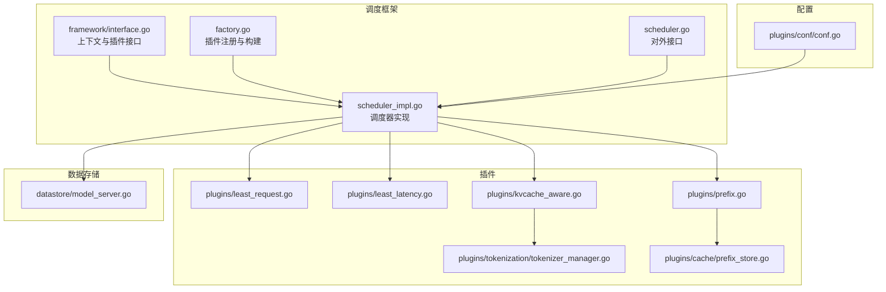
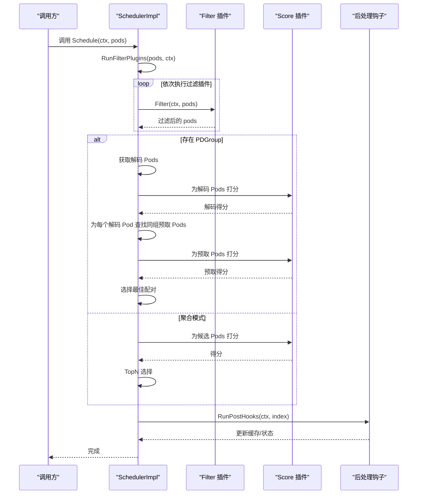
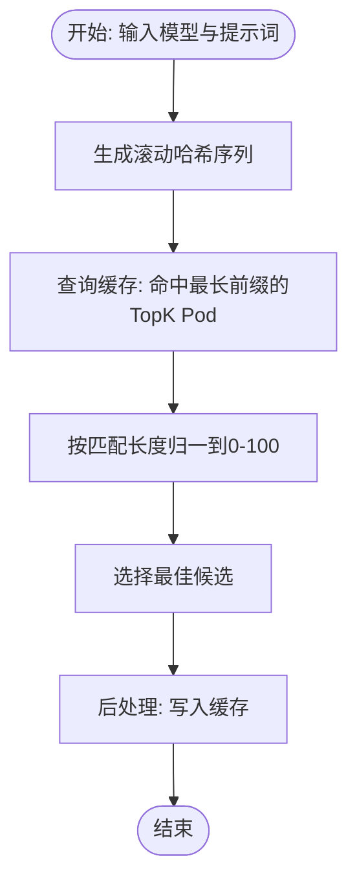
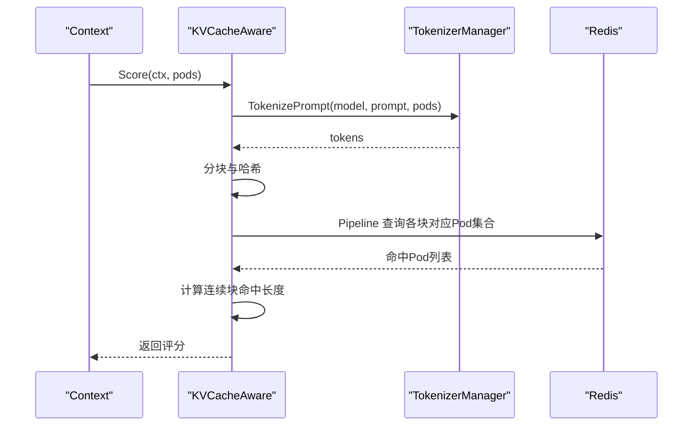
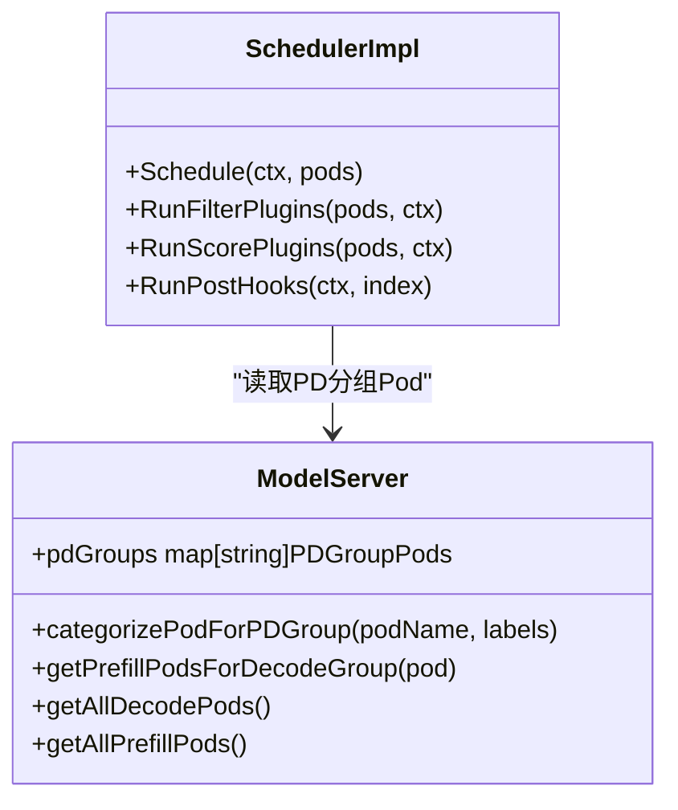
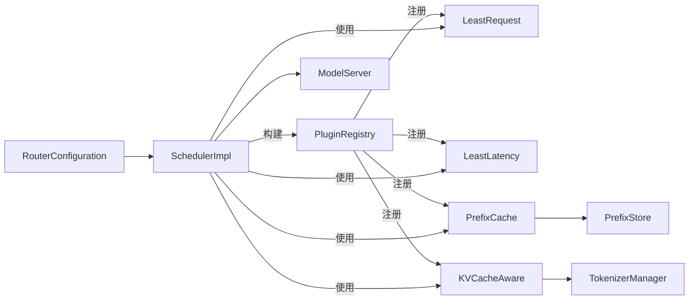

# 调度框架

<cite>
**本文引用的文件**
- [pkg/kthena-router/scheduler/scheduler.go](file://pkg/kthena-router/scheduler/scheduler.go)
- [pkg/kthena-router/scheduler/scheduler_impl.go](file://pkg/kthena-router/scheduler/scheduler_impl.go)
- [pkg/kthena-router/scheduler/framework/interface.go](file://pkg/kthena-router/scheduler/framework/interface.go)
- [pkg/kthena-router/scheduler/factory.go](file://pkg/kthena-router/scheduler/factory.go)
- [pkg/kthena-router/scheduler/plugins/conf/conf.go](file://pkg/kthena-router/scheduler/plugins/conf/conf.go)
- [pkg/kthena-router/scheduler/plugins/least_request.go](file://pkg/kthena-router/scheduler/plugins/least_request.go)
- [pkg/kthena-router/scheduler/plugins/least_latency.go](file://pkg/kthena-router/scheduler/plugins/least_latency.go)
- [pkg/kthena-router/scheduler/plugins/prefix.go](file://pkg/kthena-router/scheduler/plugins/prefix.go)
- [pkg/kthena-router/scheduler/plugins/kvcache_aware.go](file://pkg/kthena-router/scheduler/plugins/kvcache_aware.go)
- [pkg/kthena-router/scheduler/plugins/cache/prefix_store.go](file://pkg/kthena-router/scheduler/plugins/cache/prefix_store.go)
- [pkg/kthena-router/scheduler/plugins/tokenization/tokenizer_manager.go](file://pkg/kthena-router/scheduler/plugins/tokenization/tokenizer_manager.go)
- [pkg/kthena-router/datastore/model_server.go](file://pkg/kthena-router/datastore/model_server.go)
</cite>

## 目录
1. [引言](#引言)
2. [项目结构](#项目结构)
3. [核心组件](#核心组件)
4. [架构总览](#架构总览)
5. [详细组件分析](#详细组件分析)
6. [依赖分析](#依赖分析)
7. [性能考虑](#性能考虑)
8. [故障排查指南](#故障排查指南)
9. [结论](#结论)
10. [附录：实现与扩展指南](#附录实现与扩展指南)

## 引言
本文件面向开发者与运维工程师，系统化阐述 Kthena 路由器调度框架的设计与实现，重点覆盖以下方面：
- 调度器接口设计与上下文模型
- 过滤与评分插件的调用顺序与结果聚合
- PD（Prefill-Decode）解耦调度与聚合调度两种模式
- 插件扩展点与配置加载机制
- 性能特征、错误处理与调试方法
- 基于现有实现的扩展与自定义开发指南

## 项目结构
调度相关代码主要位于 pkg/kthena-router/scheduler 及其子目录，围绕“框架接口 + 工厂注册 + 插件实现 + 配置解析 + 数据存储”组织。

图示来源
- [pkg/kthena-router/scheduler/framework/interface.go:28-67](file://pkg/kthena-router/scheduler/framework/interface.go#L28-L67)
- [pkg/kthena-router/scheduler/factory.go:29-144](file://pkg/kthena-router/scheduler/factory.go#L29-L144)
- [pkg/kthena-router/scheduler/scheduler_impl.go:101-165](file://pkg/kthena-router/scheduler/scheduler_impl.go#L101-L165)
- [pkg/kthena-router/scheduler/plugins/least_request.go:34-97](file://pkg/kthena-router/scheduler/plugins/least_request.go#L34-L97)
- [pkg/kthena-router/scheduler/plugins/least_latency.go:37-131](file://pkg/kthena-router/scheduler/plugins/least_latency.go#L37-L131)
- [pkg/kthena-router/scheduler/plugins/prefix.go:99-206](file://pkg/kthena-router/scheduler/plugins/prefix.go#L99-L206)
- [pkg/kthena-router/scheduler/plugins/kvcache_aware.go:71-356](file://pkg/kthena-router/scheduler/plugins/kvcache_aware.go#L71-L356)
- [pkg/kthena-router/scheduler/plugins/tokenization/tokenizer_manager.go:36-148](file://pkg/kthena-router/scheduler/plugins/tokenization/tokenizer_manager.go#L36-L148)
- [pkg/kthena-router/scheduler/plugins/cache/prefix_store.go:68-261](file://pkg/kthena-router/scheduler/plugins/cache/prefix_store.go#L68-L261)
- [pkg/kthena-router/scheduler/plugins/conf/conf.go:28-153](file://pkg/kthena-router/scheduler/plugins/conf/conf.go#L28-L153)
- [pkg/kthena-router/datastore/model_server.go:27-195](file://pkg/kthena-router/datastore/model_server.go#L27-L195)

章节来源
- [pkg/kthena-router/scheduler/scheduler.go:25-29](file://pkg/kthena-router/scheduler/scheduler.go#L25-L29)
- [pkg/kthena-router/scheduler/scheduler_impl.go:101-165](file://pkg/kthena-router/scheduler/scheduler_impl.go#L101-L165)
- [pkg/kthena-router/scheduler/framework/interface.go:28-67](file://pkg/kthena-router/scheduler/framework/interface.go#L28-L67)
- [pkg/kthena-router/scheduler/factory.go:66-144](file://pkg/kthena-router/scheduler/factory.go#L66-L144)
- [pkg/kthena-router/scheduler/plugins/conf/conf.go:69-153](file://pkg/kthena-router/scheduler/plugins/conf/conf.go#L69-L153)

## 核心组件
- 调度器接口与实现
  - 对外接口定义了调度入口与后处理钩子，便于统一调度流程控制。
  - 实现中封装过滤与评分阶段，并在 PD 解耦模式下进行预取-解码配对选择。
- 框架上下文
  - Context 承载模型名、提示词、PD 组信息、候选 Pod 列表以及指标记录器等，贯穿插件链路。
- 插件体系
  - ScorePlugin/FilterPlugin/PostScheduleHook 三类插件接口，支持可插拔扩展。
  - 默认注册包含最少请求数、最低延迟、前缀缓存、KV 缓存感知、LoRA 亲和等插件。
- 配置与工厂
  - 支持从配置文件加载插件启用列表、权重与参数；工厂负责构建与注册。

章节来源
- [pkg/kthena-router/scheduler/scheduler.go:25-29](file://pkg/kthena-router/scheduler/scheduler.go#L25-L29)
- [pkg/kthena-router/scheduler/scheduler_impl.go:101-165](file://pkg/kthena-router/scheduler/scheduler_impl.go#L101-L165)
- [pkg/kthena-router/scheduler/framework/interface.go:28-67](file://pkg/kthena-router/scheduler/framework/interface.go#L28-L67)
- [pkg/kthena-router/scheduler/factory.go:66-144](file://pkg/kthena-router/scheduler/factory.go#L66-L144)
- [pkg/kthena-router/scheduler/plugins/conf/conf.go:82-153](file://pkg/kthena-router/scheduler/plugins/conf/conf.go#L82-L153)

## 架构总览
调度流程分为两阶段：过滤与评分。在 PD 解耦模式下，先按组获取解码 Pod，再为每个解码 Pod 匹配同组的预取 Pod 并各自打分，最终选出最佳配对；在聚合模式下直接对候选 Pod 打分并取 TopN。

图示来源
- [pkg/kthena-router/scheduler/scheduler_impl.go:101-165](file://pkg/kthena-router/scheduler/scheduler_impl.go#L101-L165)
- [pkg/kthena-router/scheduler/scheduler_impl.go:167-223](file://pkg/kthena-router/scheduler/scheduler_impl.go#L167-L223)
- [pkg/kthena-router/scheduler/scheduler_impl.go:225-229](file://pkg/kthena-router/scheduler/scheduler_impl.go#L225-L229)

## 详细组件分析

### 调度器接口与实现
- 接口职责
  - Schedule(ctx, pods): 执行调度主流程，返回错误或成功。
  - RunPostHooks(ctx, index): 在调度完成后执行后处理钩子（如更新前缀缓存）。
- 实现要点
  - 先执行过滤插件，若某插件将候选清空则立即报错。
  - PD 解耦模式：从存储中按组获取解码与预取 Pod，分别打分并配对；若无有效配对则报错。
  - 聚合模式：直接对候选 Pod 打分并取 TopN。
  - 评分阶段对每个插件的耗时进行记录，便于可观测性。

章节来源
- [pkg/kthena-router/scheduler/scheduler.go:25-29](file://pkg/kthena-router/scheduler/scheduler.go#L25-L29)
- [pkg/kthena-router/scheduler/scheduler_impl.go:101-165](file://pkg/kthena-router/scheduler/scheduler_impl.go#L101-L165)
- [pkg/kthena-router/scheduler/scheduler_impl.go:167-223](file://pkg/kthena-router/scheduler/scheduler_impl.go#L167-L223)
- [pkg/kthena-router/scheduler/scheduler_impl.go:225-229](file://pkg/kthena-router/scheduler/scheduler_impl.go#L225-L229)

### 框架上下文与插件接口
- Context 字段
  - 模型名、提示词、哈希序列、模型服务器名称、PD 分组对象、解码/预取/最佳候选 Pod 列表、指标记录器。
- 插件接口
  - FilterPlugin: 过滤无效候选。
  - ScorePlugin: 为通过过滤的候选打分（0-100），支持加权聚合。
  - PostScheduleHook: 调度完成后的后处理（如写入缓存）。

章节来源
- [pkg/kthena-router/scheduler/framework/interface.go:28-67](file://pkg/kthena-router/scheduler/framework/interface.go#L28-L67)

### 插件注册与工厂
- 注册中心
  - 提供 Score/Filter 插件构建器注册与检索。
  - 默认注册：最少请求数、最少延迟、随机、前缀缓存、KV 缓存感知、LoRA 亲和。
- 构建流程
  - 从配置加载启用列表、权重与参数映射。
  - 根据权重与参数构建插件实例，前缀缓存作为后处理钩子参与。

章节来源
- [pkg/kthena-router/scheduler/factory.go:29-144](file://pkg/kthena-router/scheduler/factory.go#L29-L144)
- [pkg/kthena-router/scheduler/plugins/conf/conf.go:82-153](file://pkg/kthena-router/scheduler/plugins/conf/conf.go#L82-L153)

### 最少请求数插件（Filter + Score）
- 过滤逻辑
  - 仅保留等待请求数低于阈值的 Pod。
- 评分逻辑
  - 基于运行中请求数与等待请求数计算基础分，等待请求数权重放大，最终归一到 0-100。
- 参数
  - 最大等待请求数（默认值来自配置）。

章节来源
- [pkg/kthena-router/scheduler/plugins/least_request.go:34-97](file://pkg/kthena-router/scheduler/plugins/least_request.go#L34-L97)

### 最少延迟插件（Score）
- 评分依据
  - 计算 TTFT 与 TPOT 的最小最大值，线性归一到 0-100，按权重因子组合。
- 参数
  - TTFT/TPOT 权重因子（默认值来自配置）。

章节来源
- [pkg/kthena-router/scheduler/plugins/least_latency.go:37-131](file://pkg/kthena-router/scheduler/plugins/least_latency.go#L37-L131)

### 前缀缓存插件（Score + PostSchedule）
- 设计目标
  - 基于滚动哈希的前缀匹配，提升缓存命中率，减少重复计算。
- 核心流程
  - Prompt 分块哈希，生成滚动哈希序列；查询缓存命中最长前缀的 TopK Pod；按匹配长度归一到 0-100。
  - 后处理阶段将最佳 Pod 与哈希写回缓存。
- 参数
  - 块大小、最大匹配块数、哈希缓存容量、TopK 结果数。
- 缓存实现
  - 三层结构：模型 -> 哈希 -> Pod 集合；每 Pod 维护哈希 LRU，淘汰时同步清理三层结构。

图示来源
- [pkg/kthena-router/scheduler/plugins/prefix.go:162-206](file://pkg/kthena-router/scheduler/plugins/prefix.go#L162-L206)
- [pkg/kthena-router/scheduler/plugins/cache/prefix_store.go:138-195](file://pkg/kthena-router/scheduler/plugins/cache/prefix_store.go#L138-L195)

章节来源
- [pkg/kthena-router/scheduler/plugins/prefix.go:99-206](file://pkg/kthena-router/scheduler/plugins/prefix.go#L99-L206)
- [pkg/kthena-router/scheduler/plugins/cache/prefix_store.go:68-261](file://pkg/kthena-router/scheduler/plugins/cache/prefix_store.go#L68-L261)

### KV 缓存感知插件（Score）
- 设计目标
  - 基于 Redis 的分布式 KV 块匹配，结合分词器将输入转为 token 块，统计跨块命中比例作为评分。
- 关键步骤
  - 从候选 Pod 中随机挑选一个 Pod 作为分词器源，将提示词分词为 token 序列。
  - 将 token 分块并计算标准化哈希，批量查询 Redis 中各块对应的 Pod 名称集合。
  - 统计各 Pod 的连续块命中长度，归一到 0-100。
- 参数
  - 块大小、最大匹配块数。
- 依赖
  - Redis 客户端、远程分词器管理器。

图示来源
- [pkg/kthena-router/scheduler/plugins/kvcache_aware.go:153-192](file://pkg/kthena-router/scheduler/plugins/kvcache_aware.go#L153-L192)
- [pkg/kthena-router/scheduler/plugins/kvcache_aware.go:194-238](file://pkg/kthena-router/scheduler/plugins/kvcache_aware.go#L194-L238)
- [pkg/kthena-router/scheduler/plugins/kvcache_aware.go:247-299](file://pkg/kthena-router/scheduler/plugins/kvcache_aware.go#L247-L299)
- [pkg/kthena-router/scheduler/plugins/tokenization/tokenizer_manager.go:89-148](file://pkg/kthena-router/scheduler/plugins/tokenization/tokenizer_manager.go#L89-L148)

章节来源
- [pkg/kthena-router/scheduler/plugins/kvcache_aware.go:71-356](file://pkg/kthena-router/scheduler/plugins/kvcache_aware.go#L71-L356)
- [pkg/kthena-router/scheduler/plugins/tokenization/tokenizer_manager.go:36-148](file://pkg/kthena-router/scheduler/plugins/tokenization/tokenizer_manager.go#L36-L148)

### PD 解耦调度与存储协作
- 存储能力
  - 按 PDGroup 对解码/预取 Pod 进行分类；提供 O(1) 查找解码/预取集合。
- 调度流程
  - 获取解码 Pod 列表，逐个为其查找同组预取 Pod，分别打分并配对，确保有效配对存在。
- 失败处理
  - 若无任何有效配对，返回错误。

图示来源
- [pkg/kthena-router/datastore/model_server.go:27-195](file://pkg/kthena-router/datastore/model_server.go#L27-L195)
- [pkg/kthena-router/scheduler/scheduler_impl.go:101-165](file://pkg/kthena-router/scheduler/scheduler_impl.go#L101-L165)

章节来源
- [pkg/kthena-router/datastore/model_server.go:76-180](file://pkg/kthena-router/datastore/model_server.go#L76-L180)
- [pkg/kthena-router/scheduler/scheduler_impl.go:108-158](file://pkg/kthena-router/scheduler/scheduler_impl.go#L108-L158)

## 依赖分析
- 组件耦合
  - SchedulerImpl 依赖插件注册中心与存储接口；插件之间低耦合，通过 Context 传递信息。
  - 前缀缓存与 KV 缓存感知插件共享分词与哈希能力，但前者本地缓存，后者依赖外部 Redis。
- 配置驱动
  - 插件启用、权重与参数均来自配置解析模块，支持运行时热切换。

图示来源
- [pkg/kthena-router/scheduler/factory.go:66-144](file://pkg/kthena-router/scheduler/factory.go#L66-L144)
- [pkg/kthena-router/scheduler/scheduler_impl.go:59-99](file://pkg/kthena-router/scheduler/scheduler_impl.go#L59-L99)
- [pkg/kthena-router/scheduler/plugins/conf/conf.go:69-103](file://pkg/kthena-router/scheduler/plugins/conf/conf.go#L69-L103)
- [pkg/kthena-router/scheduler/plugins/kvcache_aware.go:107-140](file://pkg/kthena-router/scheduler/plugins/kvcache_aware.go#L107-L140)
- [pkg/kthena-router/scheduler/plugins/prefix.go:116-156](file://pkg/kthena-router/scheduler/plugins/prefix.go#L116-L156)

章节来源
- [pkg/kthena-router/scheduler/factory.go:66-144](file://pkg/kthena-router/scheduler/factory.go#L66-L144)
- [pkg/kthena-router/scheduler/plugins/conf/conf.go:82-153](file://pkg/kthena-router/scheduler/plugins/conf/conf.go#L82-L153)

## 性能考虑
- 时间复杂度
  - 过滤阶段：O(N×P)，N 为候选 Pod 数，P 为过滤插件数。
  - 评分阶段：O(N×S)，S 为评分插件数；若启用前缀缓存，查询为 O(K)（K 为 TopK）。
  - PD 解耦：对每个解码 Pod 查找同组预取 Pod 并打分，整体约 O(N_d×(N_p+N_s))。
- 空间复杂度
  - 前缀缓存：每模型维护哈希到 Pod 的映射与每 Pod 的哈希 LRU，容量受配置限制。
  - KV 缓存感知：Redis 中以块哈希为键存储 Pod 名称集合，查询为批量管道。
- 优化建议
  - 控制评分插件数量与权重，避免过度聚合导致评分退化。
  - 合理设置前缀缓存与 KV 缓存参数，平衡命中率与内存占用。
  - 使用 PD 解耦模式时，确保 PDGroup 标签正确，减少无效预取查询。

[本节为通用性能讨论，不直接分析具体文件]

## 故障排查指南
- 常见错误
  - 过滤阶段将候选清空：检查过滤插件阈值与当前负载情况。
  - PD 解耦模式无有效配对：确认 PDGroup 标签与存储中的分组是否一致。
  - KV 缓存感知失败：检查 Redis 连接、键格式与分词器可用性。
- 调试方法
  - 开启详细日志（V(4)）查看评分明细与 TopN 选择过程。
  - 使用指标记录器观察插件耗时，定位瓶颈。
  - 验证配置文件解析与插件参数反序列化。

章节来源
- [pkg/kthena-router/scheduler/scheduler_impl.go:167-185](file://pkg/kthena-router/scheduler/scheduler_impl.go#L167-L185)
- [pkg/kthena-router/scheduler/scheduler_impl.go:108-158](file://pkg/kthena-router/scheduler/scheduler_impl.go#L108-L158)
- [pkg/kthena-router/scheduler/plugins/kvcache_aware.go:194-238](file://pkg/kthena-router/scheduler/plugins/kvcache_aware.go#L194-L238)

## 结论
Kthena 调度框架通过清晰的接口抽象与插件化设计，实现了灵活且可扩展的推理请求调度。其 PD 解耦模式与多插件评分聚合机制，能够兼顾低延迟与高缓存命中率。配合配置驱动与可观测性指标，开发者可在不修改核心代码的前提下快速定制调度策略。

[本节为总结性内容，不直接分析具体文件]

## 附录：实现与扩展指南
- 新增过滤插件
  - 实现 FilterPlugin 接口，注册到 PluginRegistry。
  - 在配置中将其加入 Filter.enabled 列表。
- 新增评分插件
  - 实现 ScorePlugin 接口，注册到 PluginRegistry。
  - 在配置中将其加入 Score.enabled 并设置权重。
- 自定义后处理钩子
  - 实现 PostScheduleHook 接口，在调度完成后执行清理或写回操作。
- 配置加载
  - 使用 RouterConfiguration 与 SchedulerConfiguration 加载插件启用、权重与参数。
  - 注意随机插件与其他评分插件不可同时启用，工厂会自动移除冲突项。
- PD 解耦集成
  - 确保模型服务器的 PDGroup 标签正确，存储层按组分类解码/预取 Pod。
- KV 缓存感知注意事项
  - 确保 Redis 可用且键空间正确；分词器端点可达；合理设置块大小与最大匹配块数。

章节来源
- [pkg/kthena-router/scheduler/factory.go:66-144](file://pkg/kthena-router/scheduler/factory.go#L66-L144)
- [pkg/kthena-router/scheduler/plugins/conf/conf.go:82-153](file://pkg/kthena-router/scheduler/plugins/conf/conf.go#L82-L153)
- [pkg/kthena-router/datastore/model_server.go:76-132](file://pkg/kthena-router/datastore/model_server.go#L76-L132)
- [pkg/kthena-router/scheduler/plugins/kvcache_aware.go:107-140](file://pkg/kthena-router/scheduler/plugins/kvcache_aware.go#L107-L140)