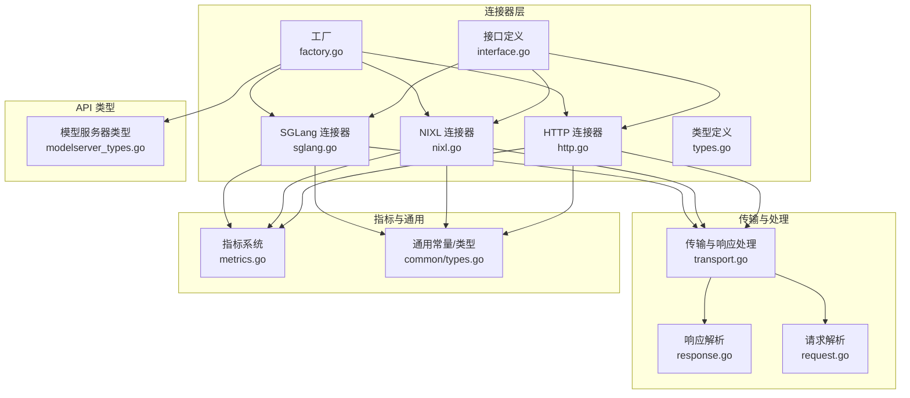
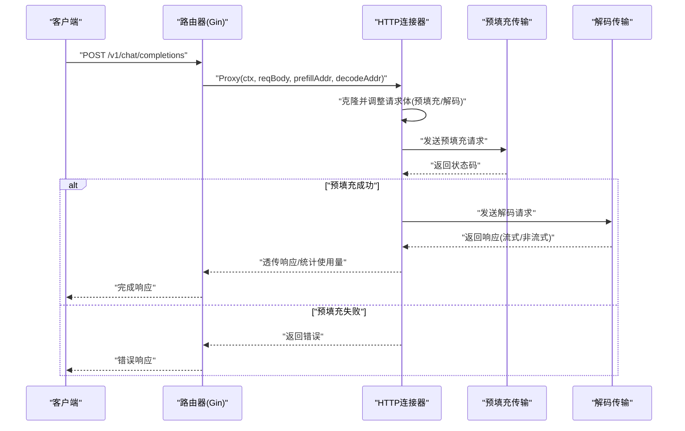
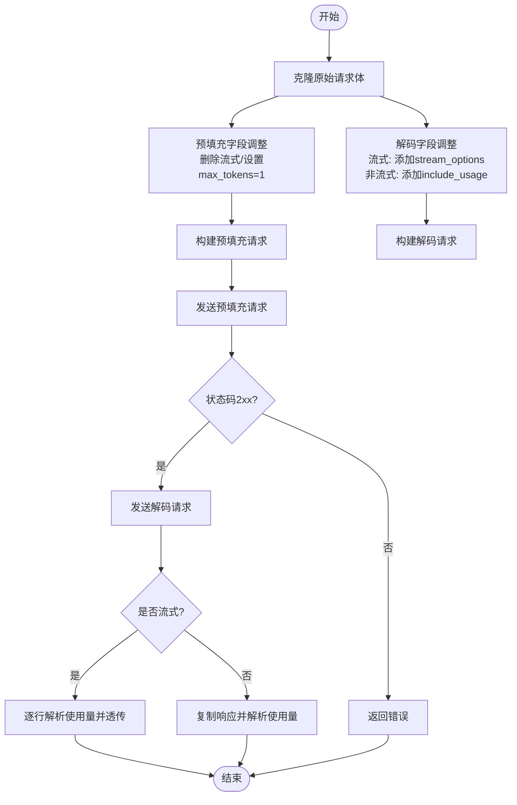
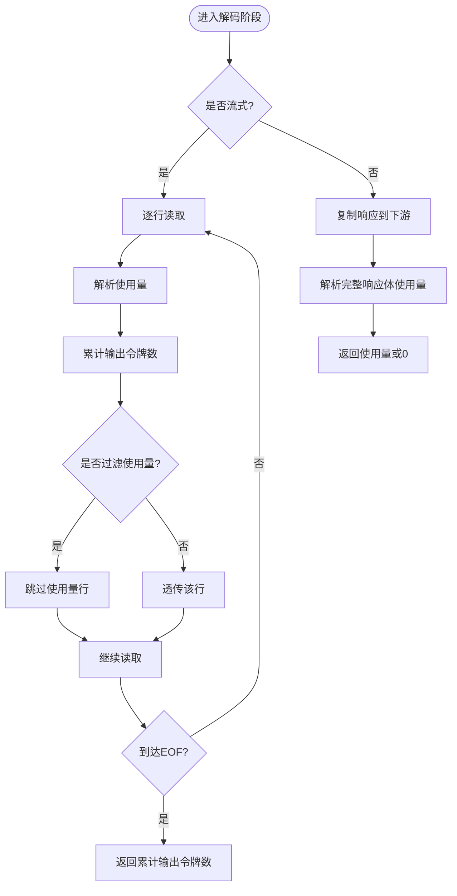
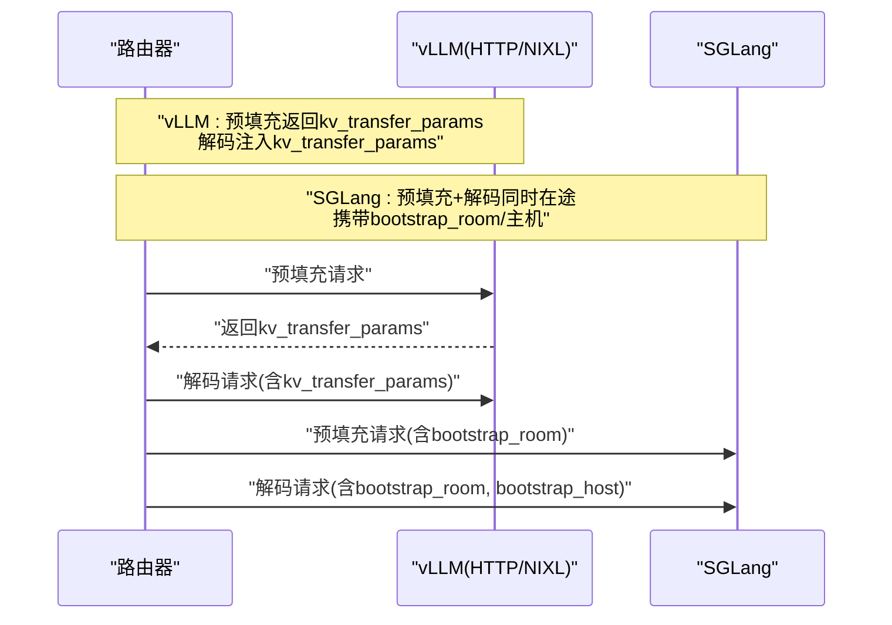
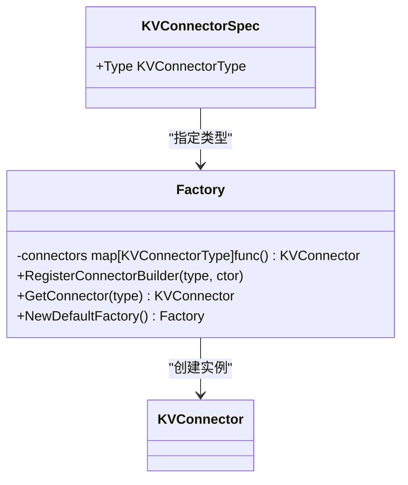
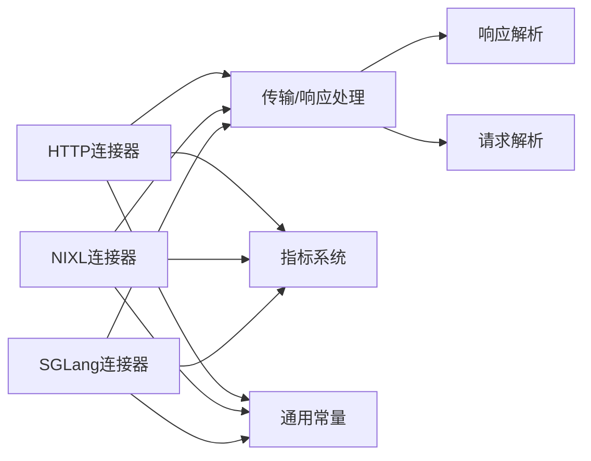

# HTTP 连接器

<cite>
**本文引用的文件**
- [http.go](file://pkg/kthena-router/connectors/http.go)
- [transport.go](file://pkg/kthena-router/connectors/transport.go)
- [interface.go](file://pkg/kthena-router/connectors/interface.go)
- [factory.go](file://pkg/kthena-router/connectors/factory.go)
- [types.go](file://pkg/kthena-router/connectors/types.go)
- [nixl.go](file://pkg/kthena-router/connectors/nixl.go)
- [sglang.go](file://pkg/kthena-router/connectors/sglang.go)
- [response.go](file://pkg/kthena-router/handlers/response.go)
- [request.go](file://pkg/kthena-router/handlers/request.go)
- [types.go](file://pkg/kthena-router/common/types.go)
- [metrics.go](file://pkg/kthena-router/metrics/metrics.go)
- [modelserver_types.go](file://pkg/apis/networking/v1alpha1/modelserver_types.go)
- [connectors_test.go](file://pkg/kthena-router/connectors/connectors_test.go)
</cite>

## 目录
1. [简介](#简介)
2. [项目结构](#项目结构)
3. [核心组件](#核心组件)
4. [架构总览](#架构总览)
5. [详细组件分析](#详细组件分析)
6. [依赖分析](#依赖分析)
7. [性能考虑](#性能考虑)
8. [故障排查指南](#故障排查指南)
9. [结论](#结论)
10. [附录](#附录)

## 简介
本文件面向 kthena 路由器中的 HTTP 连接器，系统性阐述其实现机制与运行流程，覆盖以下方面：
- HTTP 客户端配置与传输层封装
- 请求预填充（prefill）与解码（decode）阶段的请求构建与传输
- 响应处理流程：非流式与流式响应的差异处理、使用量统计与透传
- 针对不同推理引擎（如 vLLM、SGLang）的 HTTP API 差异适配策略
- 连接池管理、重试机制与超时控制策略
- 性能优化技巧、安全配置与调试方法
- 使用示例与故障排查指南

## 项目结构
HTTP 连接器位于 kthena 路由器模块中，围绕“请求体转换—预填充—解码—响应透传”的主干流程组织代码，并通过工厂模式支持多种 KV 缓存传输策略（HTTP/NIXL/SGLang），同时与指标系统、处理器模块协同工作。



**图表来源**
- [http.go:28-120](file://pkg/kthena-router/connectors/http.go#L28-L120)
- [transport.go:33-227](file://pkg/kthena-router/connectors/transport.go#L33-L227)
- [interface.go:23-31](file://pkg/kthena-router/connectors/interface.go#L23-L31)
- [factory.go:21-60](file://pkg/kthena-router/connectors/factory.go#L21-L60)
- [types.go:19-28](file://pkg/kthena-router/connectors/types.go#L19-L28)
- [nixl.go:34-205](file://pkg/kthena-router/connectors/nixl.go#L34-L205)
- [sglang.go:42-222](file://pkg/kthena-router/connectors/sglang.go#L42-L222)
- [response.go:27-87](file://pkg/kthena-router/handlers/response.go#L27-L87)
- [request.go:29-54](file://pkg/kthena-router/handlers/request.go#L29-L54)
- [metrics.go:54-448](file://pkg/kthena-router/metrics/metrics.go#L54-L448)
- [types.go:19-38](file://pkg/kthena-router/common/types.go#L19-L38)
- [modelserver_types.go:104-142](file://pkg/apis/networking/v1alpha1/modelserver_types.go#L104-L142)

**章节来源**
- [http.go:1-120](file://pkg/kthena-router/connectors/http.go#L1-L120)
- [transport.go:1-227](file://pkg/kthena-router/connectors/transport.go#L1-L227)
- [factory.go:1-60](file://pkg/kthena-router/connectors/factory.go#L1-L60)

## 核心组件
- 接口层：统一的 KVConnector 接口，定义名称与代理方法，确保不同连接器具备一致行为契约。
- HTTP 连接器：默认实现，负责预填充与解码阶段的请求构建、传输与响应处理。
- 传输与响应处理：封装底层 RoundTrip、流式/非流式响应处理、使用量解析与透传。
- 工厂与类型：注册并选择具体连接器实现；定义 KV 传输参数结构。
- 指标系统：记录请求耗时、令牌用量、并发请求数等关键指标。
- 处理器模块：解析 OpenAI 兼容请求与响应，提取模型名与使用量信息。
- 通用常量：统一上下文键值，如 token 使用量标记。

**章节来源**
- [interface.go:23-31](file://pkg/kthena-router/connectors/interface.go#L23-L31)
- [http.go:28-120](file://pkg/kthena-router/connectors/http.go#L28-L120)
- [transport.go:33-227](file://pkg/kthena-router/connectors/transport.go#L33-L227)
- [factory.go:21-60](file://pkg/kthena-router/connectors/factory.go#L21-L60)
- [types.go:19-28](file://pkg/kthena-router/connectors/types.go#L19-L28)
- [metrics.go:54-448](file://pkg/kthena-router/metrics/metrics.go#L54-L448)
- [response.go:27-87](file://pkg/kthena-router/handlers/response.go#L27-L87)
- [request.go:29-54](file://pkg/kthena-router/handlers/request.go#L29-L54)
- [types.go:19-38](file://pkg/kthena-router/common/types.go#L19-L38)

## 架构总览
HTTP 连接器在路由层作为 KV 缓存协调器，串联预填充与解码两个阶段。其核心流程如下：
- 输入请求体经克隆后进行字段调整（移除/设置流式选项、限制最大生成长度等）
- 构建预填充请求并发送至 prefill 地址，等待状态码校验
- 构建解码请求并发送至 decode 地址，按是否流式分别处理响应
- 在过程中通过指标记录器统计各阶段耗时与并发数



**图表来源**
- [http.go:64-119](file://pkg/kthena-router/connectors/http.go#L64-L119)
- [transport.go:33-78](file://pkg/kthena-router/connectors/transport.go#L33-L78)

**章节来源**
- [http.go:64-119](file://pkg/kthena-router/connectors/http.go#L64-L119)
- [transport.go:33-78](file://pkg/kthena-router/connectors/transport.go#L33-L78)

## 详细组件分析

### HTTP 连接器类图
```mermaid
classDiagram
class KVConnector {
+Name() string
+Proxy(c, reqBody, prefillAddr, decodeAddr) (int, error)
}
class HTTPConnector {
-prefillRequest *http.Request
-decodeRequest *http.Request
+Name() string
+Proxy(c, reqBody, prefillAddr, decodeAddr) (int, error)
}
class NIXLConnector {
-name string
-prefillRequest *http.Request
-decodeRequestBody map[string]interface{}
+Name() string
+Proxy(c, reqBody, prefillAddr, decodeAddr) (int, error)
}
class SGLangConnector {
-prefillRequest *http.Request
-decodeRequest *http.Request
-bootstrapRoom int64
-lastPrefillAddr string
-lastDecodeAddr string
+Name() string
+Proxy(c, reqBody, prefillAddr, decodeAddr) (int, error)
}
KVConnector <|.. HTTPConnector
KVConnector <|.. NIXLConnector
KVConnector <|.. SGLangConnector
```

**图表来源**
- [interface.go:23-31](file://pkg/kthena-router/connectors/interface.go#L23-L31)
- [http.go:28-43](file://pkg/kthena-router/connectors/http.go#L28-L43)
- [nixl.go:34-51](file://pkg/kthena-router/connectors/nixl.go#L34-L51)
- [sglang.go:42-70](file://pkg/kthena-router/connectors/sglang.go#L42-L70)

**章节来源**
- [interface.go:23-31](file://pkg/kthena-router/connectors/interface.go#L23-L31)
- [http.go:28-43](file://pkg/kthena-router/connectors/http.go#L28-L43)
- [nixl.go:34-51](file://pkg/kthena-router/connectors/nixl.go#L34-L51)
- [sglang.go:42-70](file://pkg/kthena-router/connectors/sglang.go#L42-L70)

### 请求构建与传输流程
- 预填充请求构建：移除流式相关字段，将最大生成长度限制为 1，以满足仅预热 KV 缓存的需求。
- 解码请求构建：根据是否流式决定是否添加使用量统计开关；非流式请求显式要求使用量返回。
- 传输层封装：统一使用默认传输 RoundTrip 发送请求，对状态码进行校验，失败时返回错误。



**图表来源**
- [transport.go:80-123](file://pkg/kthena-router/connectors/transport.go#L80-L123)
- [transport.go:125-145](file://pkg/kthena-router/connectors/transport.go#L125-L145)
- [transport.go:169-227](file://pkg/kthena-router/connectors/transport.go#L169-L227)

**章节来源**
- [transport.go:80-123](file://pkg/kthena-router/connectors/transport.go#L80-L123)
- [transport.go:125-145](file://pkg/kthena-router/connectors/transport.go#L125-L145)
- [transport.go:169-227](file://pkg/kthena-router/connectors/transport.go#L169-L227)

### 响应处理与使用量统计
- 流式响应：按行读取 SSE/NDJSON，解析包含使用量的数据行，累加输出令牌数；可按需过滤使用量行。
- 非流式响应：复制响应到下游，解析完整响应体中的使用量信息。
- 上下文标记：在流式场景下通过上下文键值标记是否需要透传使用量。



**图表来源**
- [transport.go:169-205](file://pkg/kthena-router/connectors/transport.go#L169-L205)
- [transport.go:207-227](file://pkg/kthena-router/connectors/transport.go#L207-L227)
- [response.go:68-87](file://pkg/kthena-router/handlers/response.go#L68-L87)

**章节来源**
- [transport.go:169-205](file://pkg/kthena-router/connectors/transport.go#L169-L205)
- [transport.go:207-227](file://pkg/kthena-router/connectors/transport.go#L207-L227)
- [response.go:68-87](file://pkg/kthena-router/handlers/response.go#L68-L87)

### 不同推理引擎的 HTTP API 差异适配
- vLLM（HTTP/NIXL）：通过预填充阶段返回的 KV 传输参数，在解码阶段注入参数以完成 KV 缓存传递。
- SGLang：要求预填充与解码请求同时在途，以建立引导房间（bootstrap_room）与引导主机（bootstrap_host）交换元数据，确保 KV 缓存正确传递。
- 通用 HTTP：直接透传请求与响应，不做额外 KV 参数注入。



**图表来源**
- [nixl.go:114-145](file://pkg/kthena-router/connectors/nixl.go#L114-L145)
- [nixl.go:147-173](file://pkg/kthena-router/connectors/nixl.go#L147-L173)
- [sglang.go:86-195](file://pkg/kthena-router/connectors/sglang.go#L86-L195)

**章节来源**
- [nixl.go:114-145](file://pkg/kthena-router/connectors/nixl.go#L114-L145)
- [nixl.go:147-173](file://pkg/kthena-router/connectors/nixl.go#L147-L173)
- [sglang.go:86-195](file://pkg/kthena-router/connectors/sglang.go#L86-L195)

### 工厂与类型体系
- 工厂：注册并选择连接器实现，默认 HTTP；支持 LMCache（复用 HTTP 实现）、NIXL、MoonCake、SGLang。
- 类型：KVTransferParams 描述远程预填充/解码与目标主机/端口等传输参数。



**图表来源**
- [factory.go:21-60](file://pkg/kthena-router/connectors/factory.go#L21-L60)
- [modelserver_types.go:113-120](file://pkg/apis/networking/v1alpha1/modelserver_types.go#L113-L120)

**章节来源**
- [factory.go:21-60](file://pkg/kthena-router/connectors/factory.go#L21-L60)
- [types.go:19-28](file://pkg/kthena-router/connectors/types.go#L19-L28)
- [modelserver_types.go:113-120](file://pkg/apis/networking/v1alpha1/modelserver_types.go#L113-L120)

## 依赖分析
- 组件耦合
  - HTTP/NIXL/SGLang 连接器均实现统一接口，降低上层调用复杂度。
  - 传输与响应处理模块被多连接器共享，提升内聚性与复用性。
  - 指标系统与通用常量贯穿于请求生命周期，便于观测与调试。
- 外部依赖
  - Gin 用于上下文与流式写入。
  - Prometheus 客户端用于指标采集。
  - OpenAI 兼容响应解析用于使用量统计。



**图表来源**
- [http.go:28-43](file://pkg/kthena-router/connectors/http.go#L28-L43)
- [nixl.go:34-51](file://pkg/kthena-router/connectors/nixl.go#L34-L51)
- [sglang.go:42-70](file://pkg/kthena-router/connectors/sglang.go#L42-L70)
- [transport.go:33-78](file://pkg/kthena-router/connectors/transport.go#L33-L78)
- [metrics.go:54-86](file://pkg/kthena-router/metrics/metrics.go#L54-L86)
- [types.go:19-38](file://pkg/kthena-router/common/types.go#L19-L38)

**章节来源**
- [http.go:28-43](file://pkg/kthena-router/connectors/http.go#L28-L43)
- [nixl.go:34-51](file://pkg/kthena-router/connectors/nixl.go#L34-L51)
- [sglang.go:42-70](file://pkg/kthena-router/connectors/sglang.go#L42-L70)
- [transport.go:33-78](file://pkg/kthena-router/connectors/transport.go#L33-L78)
- [metrics.go:54-86](file://pkg/kthena-router/metrics/metrics.go#L54-L86)
- [types.go:19-38](file://pkg/kthena-router/common/types.go#L19-L38)

## 性能考虑
- 连接池与传输
  - 默认传输使用 Go 标准库 HTTP 客户端连接池，建议结合上游服务端的 keep-alive 与连接复用策略，减少握手开销。
  - 对高并发场景，可在上游服务端启用更积极的连接复用与队列背压，避免连接耗尽。
- 流式响应
  - 流式场景下按行解析使用量，注意网络抖动导致的行不完整读取，建议在上游服务端保证每条数据行的完整性与分隔符一致性。
- 指标与可观测性
  - 利用请求时延、阶段时延与并发请求数指标定位瓶颈；结合令牌用量指标评估吞吐与成本。
- 超时与重试
  - 当前 HTTP 连接器未内置重试逻辑，建议在上游服务端或网关层配置合理的超时与重试策略，避免单点失败放大。

[本节为通用性能建议，无需特定文件引用]

## 故障排查指南
- 常见问题
  - 预填充失败：检查 prefill 地址可达性、协议与端口、上游服务状态码。
  - 解码失败：确认解码地址正确、请求体字段符合上游 API 要求（如流式开关、使用量开关）。
  - 流式使用量缺失：核对是否设置了流式选项与使用量开关，以及上游服务是否支持在流式中返回使用量。
- 调试方法
  - 启用日志：观察预填充与解码阶段的日志级别，定位失败节点。
  - 指标核对：对比请求总量、阶段时延与并发数，识别异常峰值。
  - 单元测试参考：通过测试用例验证请求体字段调整与上下文标记行为。
- 参考测试
  - 验证预填充请求体字段（移除流式、设置 max_tokens=1）、解码请求体字段（非流式 include_usage、流式 stream_options）。
  - 验证上下文标记（流式时设置 token 使用量键值）。

**章节来源**
- [connectors_test.go:107-532](file://pkg/kthena-router/connectors/connectors_test.go#L107-L532)
- [transport.go:80-145](file://pkg/kthena-router/connectors/transport.go#L80-L145)
- [transport.go:169-227](file://pkg/kthena-router/connectors/transport.go#L169-L227)

## 结论
HTTP 连接器通过标准化的请求构建与传输流程，实现了对不同推理引擎的兼容适配。配合工厂模式与指标系统，能够在多引擎环境下稳定地完成预填充与解码阶段的 KV 缓存协调。针对性能与可靠性，建议结合上游服务端能力与网关层策略，合理配置连接池、超时与重试，以获得最佳吞吐与稳定性。

[本节为总结性内容，无需特定文件引用]

## 附录

### 使用示例（步骤说明）
- 配置模型服务器与连接器类型
  - 在模型服务器规范中指定推理引擎与连接器类型（默认 HTTP）。
- 构建请求体
  - 非流式：确保包含使用量开关；流式：设置流式开关与使用量开关。
- 发起请求
  - 将请求交由路由器，内部通过 HTTP 连接器完成预填充与解码阶段的传输与响应透传。
- 观测与调优
  - 通过指标面板查看请求时延、阶段时延与并发数，结合日志定位问题。

**章节来源**
- [modelserver_types.go:23-50](file://pkg/apis/networking/v1alpha1/modelserver_types.go#L23-L50)
- [modelserver_types.go:113-120](file://pkg/apis/networking/v1alpha1/modelserver_types.go#L113-L120)
- [http.go:64-119](file://pkg/kthena-router/connectors/http.go#L64-L119)
- [transport.go:125-145](file://pkg/kthena-router/connectors/transport.go#L125-L145)