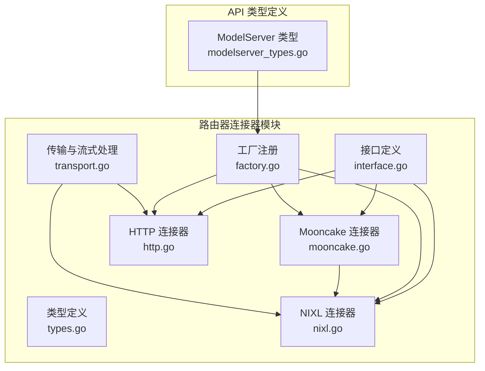
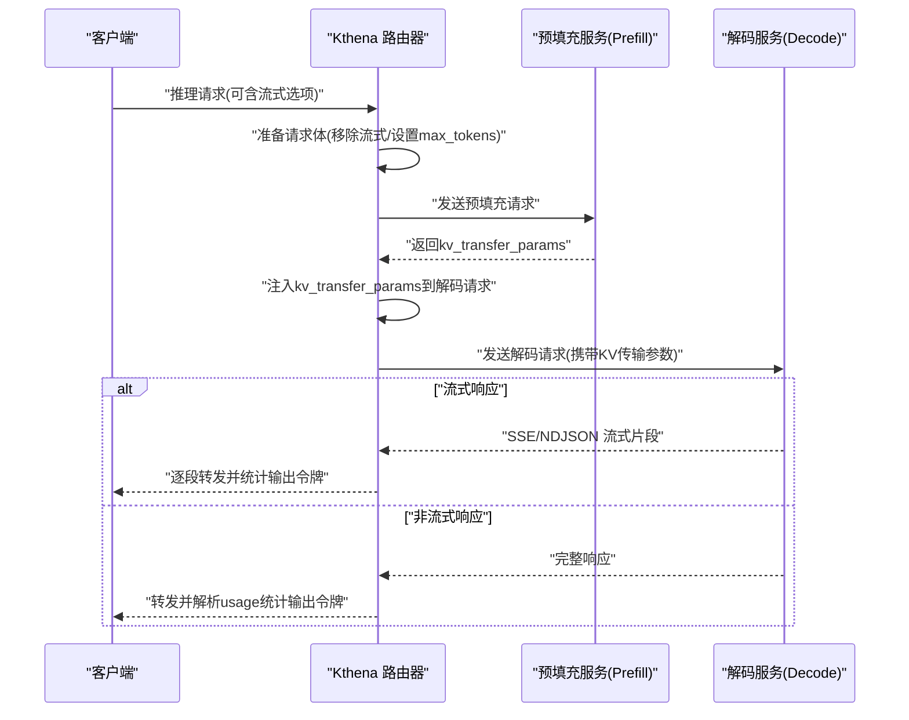
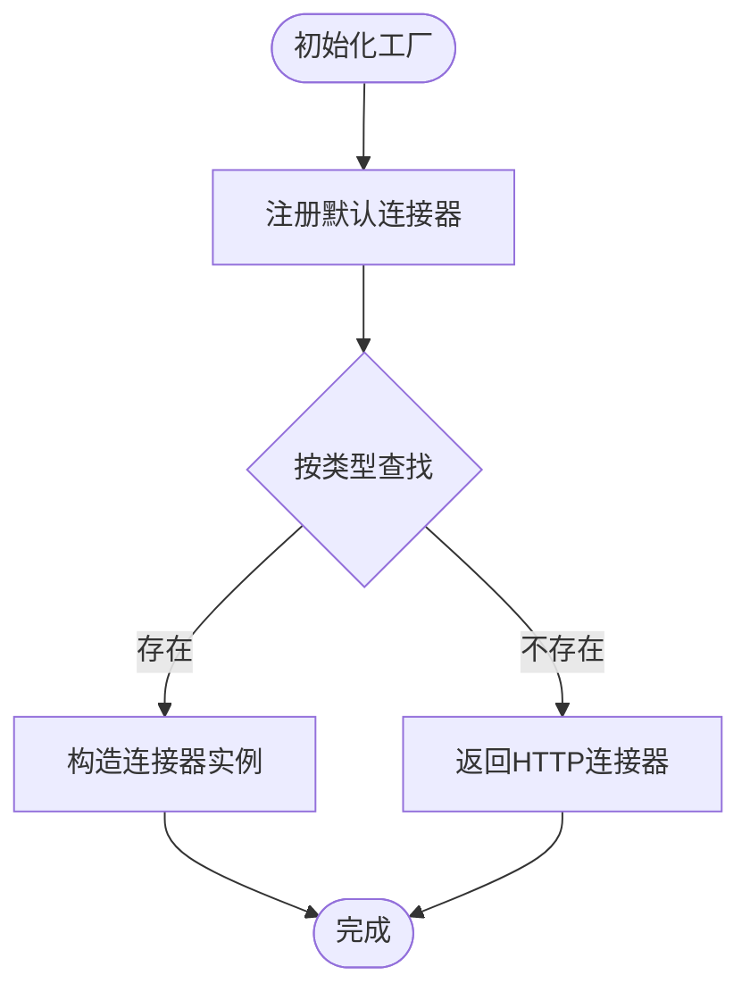
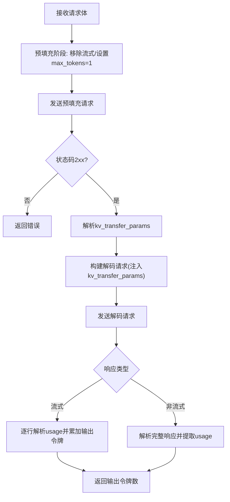
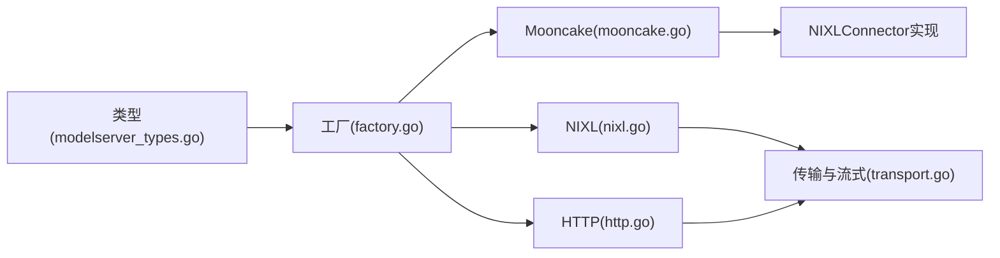

# Mooncake NPU 连接器

<cite>
**本文引用的文件**
- [mooncake.go](file://pkg/kthena-router/connectors/mooncake.go)
- [nixl.go](file://pkg/kthena-router/connectors/nixl.go)
- [types.go](file://pkg/kthena-router/connectors/types.go)
- [factory.go](file://pkg/kthena-router/connectors/factory.go)
- [interface.go](file://pkg/kthena-router/connectors/interface.go)
- [transport.go](file://pkg/kthena-router/connectors/transport.go)
- [http.go](file://pkg/kthena-router/connectors/http.go)
- [modelserver_types.go](file://pkg/apis/networking/v1alpha1/modelserver_types.go)
- [vllm-ascend-mooncake.md](file://docs/kthena/docs/user-guide/prefill-decode-disaggregation/vllm-ascend-mooncake.md)
- [prefill-decode-disaggregation.yaml（模型增强器示例）](file://docs/kthena/docs/assets/examples/model-booster/prefill-decode-disaggregation.yaml)
- [prefill-decode-disaggregation.yaml（模型服务示例）](file://examples/model-serving/prefill-decode-disaggregation.yaml)
- [Dockerfile.mooncake-npu-a3](file://docker/Dockerfile.mooncake-npu-a3)
- [metrics.go](file://pkg/kthena-router/metrics/metrics.go)
</cite>

## 目录
1. [简介](#简介)
2. [项目结构](#项目结构)
3. [核心组件](#核心组件)
4. [架构总览](#架构总览)
5. [详细组件分析](#详细组件分析)
6. [依赖分析](#依赖分析)
7. [性能考虑](#性能考虑)
8. [故障排查指南](#故障排查指南)
9. [结论](#结论)
10. [附录](#附录)

## 简介
本技术文档聚焦于 Mooncake NPU 连接器在 Kthena 中的实现与应用，系统阐述其与 Ascend NPU 硬件的集成方式、专用推理协议、内存管理与计算调度策略，并给出部署与性能优化建议。Mooncake 在 vLLM Ascend 场景中作为 KV 缓存跨阶段传输的桥接层，通过 MooncakeConnector 实现预填充（Prefill）与解码（Decode）阶段之间的高效数据传递，从而提升端到端吞吐与延迟表现。

## 项目结构
围绕 Mooncake NPU 连接器的关键代码位于 kthena 路由器模块的 connectors 子目录，配合 CRD 类型定义与用户指南文档，形成从接口抽象到具体实现再到部署实践的完整闭环。



**图表来源**
- [interface.go:23-31](file://pkg/kthena-router/connectors/interface.go#L23-L31)
- [types.go:19-27](file://pkg/kthena-router/connectors/types.go#L19-L27)
- [factory.go:47-59](file://pkg/kthena-router/connectors/factory.go#L47-L59)
- [mooncake.go:19-25](file://pkg/kthena-router/connectors/mooncake.go#L19-L25)
- [nixl.go:34-46](file://pkg/kthena-router/connectors/nixl.go#L34-L46)
- [http.go:28-38](file://pkg/kthena-router/connectors/http.go#L28-L38)
- [transport.go:33-78](file://pkg/kthena-router/connectors/transport.go#L33-L78)
- [modelserver_types.go:104-120](file://pkg/apis/networking/v1alpha1/modelserver_types.go#L104-L120)

**章节来源**
- [factory.go:47-59](file://pkg/kthena-router/connectors/factory.go#L47-L59)
- [mooncake.go:19-25](file://pkg/kthena-router/connectors/mooncake.go#L19-L25)
- [nixl.go:34-46](file://pkg/kthena-router/connectors/nixl.go#L34-L46)
- [http.go:28-38](file://pkg/kthena-router/connectors/http.go#L28-L38)
- [transport.go:33-78](file://pkg/kthena-router/connectors/transport.go#L33-L78)
- [modelserver_types.go:104-120](file://pkg/apis/networking/v1alpha1/modelserver_types.go#L104-L120)

## 核心组件
- KVConnector 接口：统一抽象不同后端的 KV 缓存传输能力，定义名称与预填充/解码全流程代理方法。
- 工厂模式：集中注册并按类型选择具体连接器实现，支持 Mooncake、NIXL、HTTP 等。
- Mooncake 连接器：在 Ascend 场景下复用 NIXL 的实现，以适配 Mooncake 的 KV 传输语义。
- 传输与流式处理：封装预填充与解码请求构建、响应流式转发、令牌用量统计等通用逻辑。
- 类型与参数：KVTransferParams 定义跨阶段传输所需的远程标识与地址信息；ModelServer 类型定义 KVConnectorSpec 以声明使用 Mooncake。

**章节来源**
- [interface.go:23-31](file://pkg/kthena-router/connectors/interface.go#L23-L31)
- [factory.go:47-59](file://pkg/kthena-router/connectors/factory.go#L47-L59)
- [mooncake.go:19-25](file://pkg/kthena-router/connectors/mooncake.go#L19-L25)
- [nixl.go:53-112](file://pkg/kthena-router/connectors/nixl.go#L53-L112)
- [transport.go:80-145](file://pkg/kthena-router/connectors/transport.go#L80-L145)
- [types.go:19-27](file://pkg/kthena-router/connectors/types.go#L19-L27)
- [modelserver_types.go:104-120](file://pkg/apis/networking/v1alpha1/modelserver_types.go#L104-L120)

## 架构总览
Mooncake NPU 连接器在 Kthena 路由器中的职责是协调预填充与解码阶段的 KV 缓存传输，确保端到端推理链路的低延迟与高吞吐。整体流程如下：



**图表来源**
- [nixl.go:53-112](file://pkg/kthena-router/connectors/nixl.go#L53-L112)
- [transport.go:48-78](file://pkg/kthena-router/connectors/transport.go#L48-L78)
- [transport.go:175-205](file://pkg/kthena-router/connectors/transport.go#L175-L205)
- [transport.go:207-226](file://pkg/kthena-router/connectors/transport.go#L207-L226)

**章节来源**
- [nixl.go:53-112](file://pkg/kthena-router/connectors/nixl.go#L53-L112)
- [transport.go:48-78](file://pkg/kthena-router/connectors/transport.go#L48-L78)
- [transport.go:175-226](file://pkg/kthena-router/connectors/transport.go#L175-L226)

## 详细组件分析

### 组件一：Mooncake 连接器（复用 NIXL）
- 设计要点
  - MooncakeConnector 在 Ascend 场景下行为与 NIXL 类似，因此直接复用 NIXLConnector 的实现，仅在工厂注册时命名为“mooncake”。
  - 该设计降低维护成本，同时保证与 vLLM Ascend 的 Mooncake 传输协议兼容。
- 关键流程
  - 预填充阶段：构建预填充请求，移除流式参数并设置最大生成长度为 1，发送至预填充服务并解析返回的 kv_transfer_params。
  - 解码阶段：将 kv_transfer_params 注入解码请求，发送至解码服务，并根据响应类型进行流式或非流式转发。
- 性能影响
  - 通过预填充阶段的最小化生成长度，减少 KV 缓存生成开销；随后在解码阶段利用 KV 缓存避免重复计算，显著降低端到端延迟。

```mermaid
classDiagram
class KVConnector {
+Name() string
+Proxy(c, reqBody, prefillAddr, decodeAddr) (int, error)
}
class NIXLConnector {
-name string
-prefillRequest *http.Request
-decodeRequestBody map[string]interface{}
+Name() string
+Proxy(c, reqBody, prefillAddr, decodeAddr) (int, error)
-prefill(req, addr) (interface{}, error)
-buildDecodeRequest(c, reqBody, params) *http.Request
-decode(c, req, addr) (int, error)
}
class MooncakeConnector {
+Name() string
+Proxy(c, reqBody, prefillAddr, decodeAddr) (int, error)
}
class HTTPConnector {
+Name() string
+Proxy(c, reqBody, prefillAddr, decodeAddr) (int, error)
}
KVConnector <|.. NIXLConnector
KVConnector <|.. HTTPConnector
MooncakeConnector <|-- NIXLConnector : "复用实现"
```

**图表来源**
- [interface.go:23-31](file://pkg/kthena-router/connectors/interface.go#L23-L31)
- [nixl.go:34-46](file://pkg/kthena-router/connectors/nixl.go#L34-L46)
- [nixl.go:53-112](file://pkg/kthena-router/connectors/nixl.go#L53-L112)
- [mooncake.go:19-25](file://pkg/kthena-router/connectors/mooncake.go#L19-L25)
- [http.go:28-38](file://pkg/kthena-router/connectors/http.go#L28-L38)

**章节来源**
- [mooncake.go:19-25](file://pkg/kthena-router/connectors/mooncake.go#L19-L25)
- [nixl.go:53-112](file://pkg/kthena-router/connectors/nixl.go#L53-L112)
- [interface.go:23-31](file://pkg/kthena-router/connectors/interface.go#L23-L31)

### 组件二：工厂与类型系统
- 工厂注册
  - 默认工厂注册了 HTTP、LMCache（HTTP）、MoonCake、NIXL、SGLang 等连接器类型，便于按需选择。
  - 当未匹配到指定类型时，默认回退到 HTTP 连接器。
- 类型定义
  - KVConnectorType 枚举包含 http、lmcache、nixl、mooncake 四种类型。
  - KVConnectorSpec 在 ModelServer 中用于声明 KVConnector 类型，从而启用 Mooncake。



**图表来源**
- [factory.go:47-59](file://pkg/kthena-router/connectors/factory.go#L47-L59)

**章节来源**
- [factory.go:47-59](file://pkg/kthena-router/connectors/factory.go#L47-L59)
- [modelserver_types.go:104-120](file://pkg/apis/networking/v1alpha1/modelserver_types.go#L104-L120)

### 组件三：传输与流式处理
- 预填充与解码请求构建
  - 预填充阶段移除流式参数并将最大生成长度设为 1，确保仅生成 KV 缓存。
  - 解码阶段根据是否流式请求决定是否开启 token usage 捕获。
- 响应处理
  - 流式响应：逐行读取 SSE/NDJSON，解析 usage 并累加输出令牌数。
  - 非流式响应：解析完整 JSON，提取 usage 中的输出令牌数。
- 指标记录
  - 预填充与解码阶段分别记录持续时间直方图，便于端到端与阶段级性能分析。



**图表来源**
- [transport.go:80-90](file://pkg/kthena-router/connectors/transport.go#L80-L90)
- [transport.go:175-205](file://pkg/kthena-router/connectors/transport.go#L175-L205)
- [transport.go:207-226](file://pkg/kthena-router/connectors/transport.go#L207-L226)

**章节来源**
- [transport.go:80-90](file://pkg/kthena-router/connectors/transport.go#L80-L90)
- [transport.go:175-226](file://pkg/kthena-router/connectors/transport.go#L175-L226)
- [metrics.go:107-123](file://pkg/kthena-router/metrics/metrics.go#L107-L123)

### 组件四：NPU 硬件与驱动集成
- 硬件要求
  - 华为昇腾 NPU 节点（如 Ascend 910 或兼容设备），并正确安装 Ascend 驱动与运行时。
  - Kubernetes 集群需配置 Ascend 设备插件，以便调度器识别 huawei.com/ascend-1980 资源。
- 运行时镜像
  - 使用基于 Ascend vLLM 的官方镜像，内置 Mooncake 仓库与编译脚本，自动配置 HCCL 库路径与设备环境变量。
- 网络与通信
  - 利用 HCCL（华为集合通信库）在 NPU 节点间进行高效通信，确保预填充与解码阶段的 KV 缓存传输低延迟、高带宽。

**章节来源**
- [vllm-ascend-mooncake.md:44-54](file://docs/kthena/docs/user-guide/prefill-decode-disaggregation/vllm-ascend-mooncake.md#L44-L54)
- [Dockerfile.mooncake-npu-a3:1-26](file://docker/Dockerfile.mooncake-npu-a3#L1-L26)
- [prefill-decode-disaggregation.yaml（模型服务示例）:49-67](file://examples/model-serving/prefill-decode-disaggregation.yaml#L49-L67)

## 依赖分析
- 组件耦合
  - Mooncake 连接器通过工厂注册间接依赖 NIXL 实现；NIXL 与 HTTP 连接器共享传输与流式处理逻辑，降低重复代码。
  - 类型系统（KVConnectorType、KVConnectorSpec）为上层 CRD 提供约束，确保连接器类型与配置一致。
- 外部依赖
  - 与 Ascend 驱动、HCCL、Kubernetes 设备插件紧密耦合，资源调度与网络通信均依赖这些基础设施。
- 循环依赖
  - 未发现循环导入；接口与实现分层清晰，工厂仅负责实例化，不持有具体实现细节。



**图表来源**
- [factory.go:47-59](file://pkg/kthena-router/connectors/factory.go#L47-L59)
- [mooncake.go:19-25](file://pkg/kthena-router/connectors/mooncake.go#L19-L25)
- [nixl.go:34-46](file://pkg/kthena-router/connectors/nixl.go#L34-L46)
- [http.go:28-38](file://pkg/kthena-router/connectors/http.go#L28-L38)
- [transport.go:33-78](file://pkg/kthena-router/connectors/transport.go#L33-L78)
- [modelserver_types.go:104-120](file://pkg/apis/networking/v1alpha1/modelserver_types.go#L104-L120)

**章节来源**
- [factory.go:47-59](file://pkg/kthena-router/connectors/factory.go#L47-L59)
- [modelserver_types.go:104-120](file://pkg/apis/networking/v1alpha1/modelserver_types.go#L104-L120)

## 性能考虑
- 计算调度
  - 预填充阶段采用最小化生成长度（max_tokens=1）以快速生成 KV 缓存，降低首 token 延迟。
  - 解码阶段启用 KV 缓存复用，避免重复注意力计算，提高吞吐。
- 内存管理
  - 通过资源限制 huawei.com/ascend-1980，结合 gpu-memory-utilization 参数，平衡显存占用与并发度。
  - 共享内存卷与 HCCN 配置文件挂载，减少跨进程/跨节点数据拷贝。
- 网络与通信
  - 使用 HCCL 在 NPU 节点间进行高效通信，降低 KV 缓存传输延迟。
  - 传输层对流式响应进行逐行解析与转发，避免一次性缓冲大块数据。
- 指标观测
  - 预填充与解码阶段分别记录直方图，便于定位瓶颈；输出令牌统计可用于评估吞吐与效率。

**章节来源**
- [transport.go:80-90](file://pkg/kthena-router/connectors/transport.go#L80-L90)
- [transport.go:175-226](file://pkg/kthena-router/connectors/transport.go#L175-L226)
- [metrics.go:107-123](file://pkg/kthena-router/metrics/metrics.go#L107-L123)
- [prefill-decode-disaggregation.yaml（模型服务示例）:85-93](file://examples/model-serving/prefill-decode-disaggregation.yaml#L85-L93)

## 故障排查指南
- 常见问题
  - 预填充失败：检查预填充服务健康状态与日志，确认 kv_transfer_params 是否返回；若状态码非 2xx，路由器会直接返回错误。
  - 解码阶段无输出：确认解码请求已注入 kv_transfer_params；检查流式与非流式分支的 usage 解析逻辑。
  - NPU 设备不可用：确认 AscendRealDevices 环境变量已设置且设备插件正常；检查 huawei.com/ascend-1980 资源是否被正确分配。
- 排查步骤
  - 查看路由器日志中预填充与解码阶段的请求 URL 与状态码。
  - 对比预填充与解码阶段的直方图指标，判断瓶颈发生在哪个阶段。
  - 若为流式响应，确认 Content-Type 为 text/event-stream 或 application/x-ndjson，并验证逐行解析是否成功。

**章节来源**
- [nixl.go:114-144](file://pkg/kthena-router/connectors/nixl.go#L114-L144)
- [transport.go:48-78](file://pkg/kthena-router/connectors/transport.go#L48-L78)
- [transport.go:175-205](file://pkg/kthena-router/connectors/transport.go#L175-L205)

## 结论
Mooncake NPU 连接器通过复用 NIXL 的实现，在 Ascend 环境下实现了高效的预填充与解码阶段 KV 缓存传输。结合 HCCL、资源调度与指标体系，该方案在端到端延迟、吞吐与稳定性方面具备良好表现。部署时需确保 Ascend 驱动、设备插件与网络配置正确，并依据工作负载调整资源与内存参数以获得最佳性能。

## 附录
- 部署参考
  - 使用 ModelBooster 或 ModelServing 部署预填充-解码分离的推理服务，配置 kv_connector 为 Mooncake 并设置 kv_connector_module_path 与额外配置。
  - 示例清单展示了如何在 prefill 与 decode 角色中分别配置 kv_connector、端口、rank、并行度等参数。
- 参考文档
  - vLLM Ascend（Mooncake）用户指南提供了完整的前置条件、部署步骤与最佳实践说明。

**章节来源**
- [vllm-ascend-mooncake.md:55-81](file://docs/kthena/docs/user-guide/prefill-decode-disaggregation/vllm-ascend-mooncake.md#L55-L81)
- [prefill-decode-disaggregation.yaml（模型增强器示例）:83-98](file://docs/kthena/docs/assets/examples/model-booster/prefill-decode-disaggregation.yaml#L83-L98)
- [prefill-decode-disaggregation.yaml（模型服务示例）:82-83](file://examples/model-serving/prefill-decode-disaggregation.yaml#L82-L83)