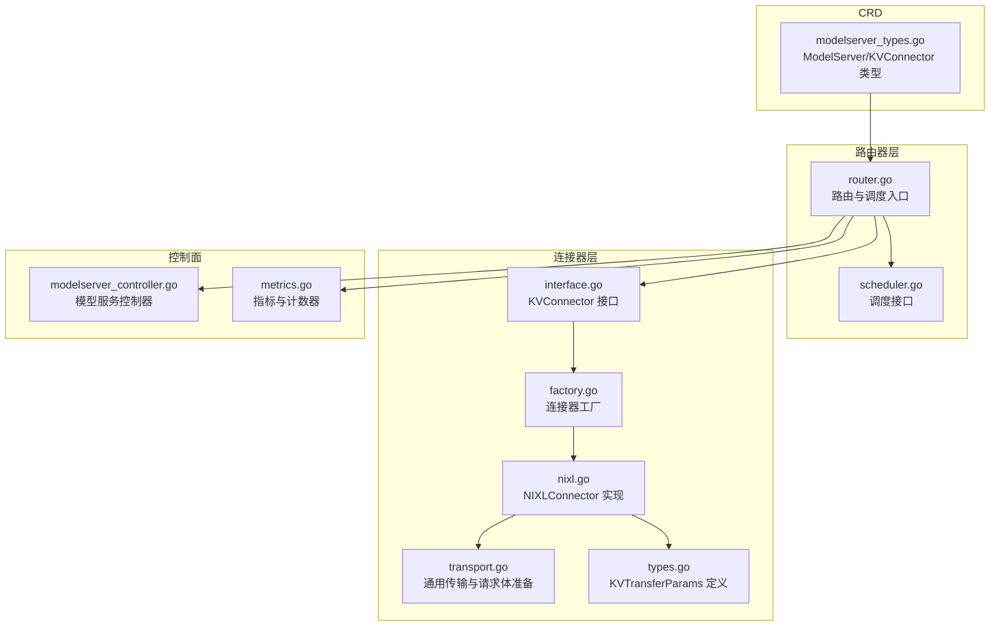
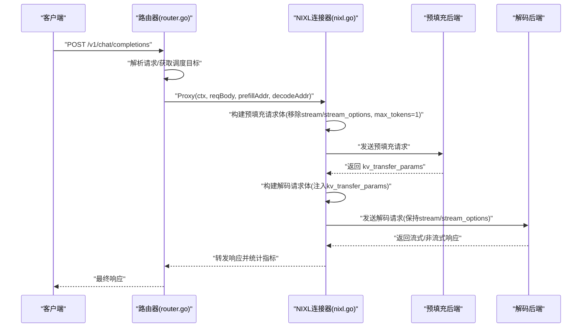
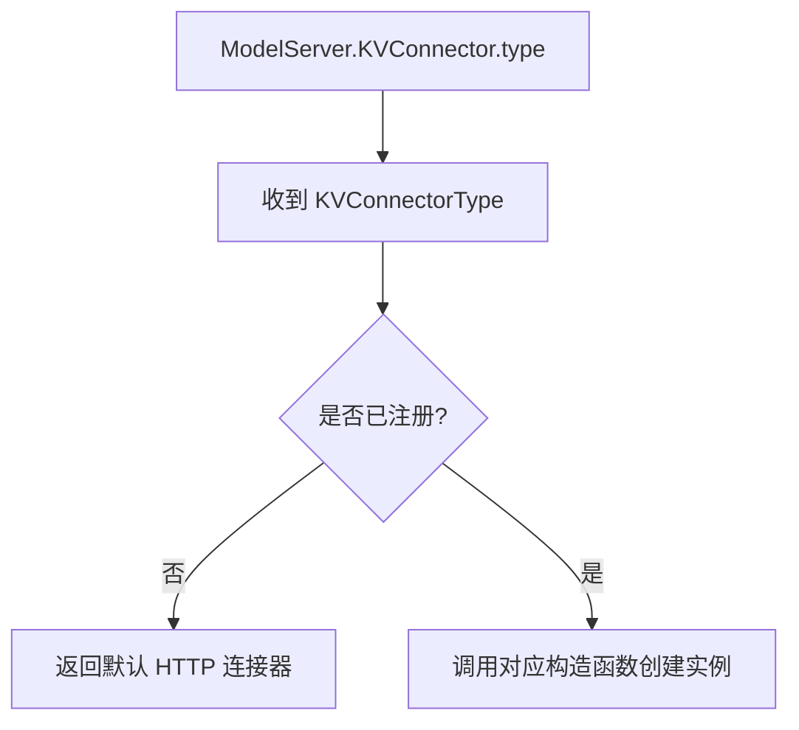
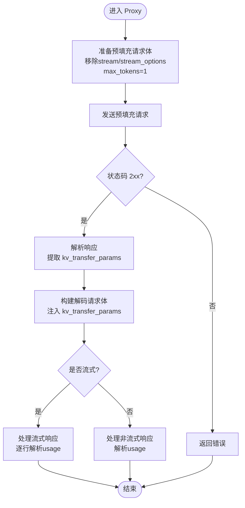
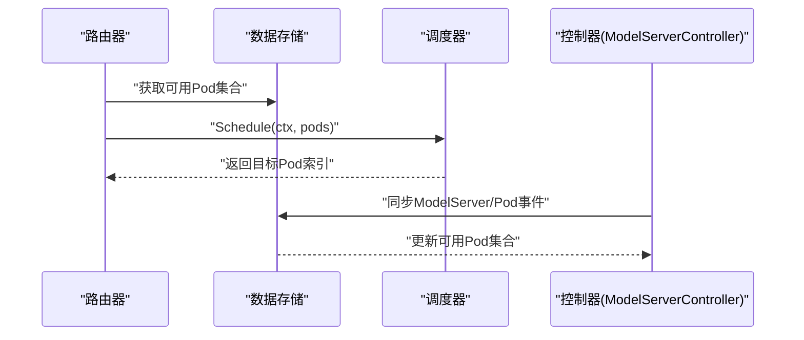
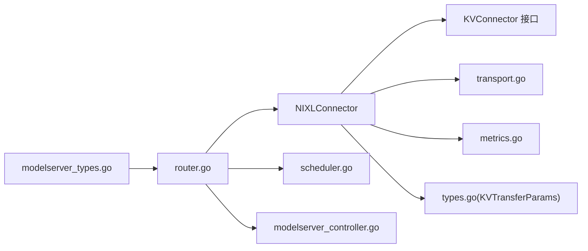

# NixL 连接器

<cite>
**本文引用的文件**
- [nixl.go](file://pkg/kthena-router/connectors/nixl.go)
- [nixl_test.go](file://pkg/kthena-router/connectors/nixl_test.go)
- [factory.go](file://pkg/kthena-router/connectors/factory.go)
- [interface.go](file://pkg/kthena-router/connectors/interface.go)
- [types.go](file://pkg/kthena-router/connectors/types.go)
- [transport.go](file://pkg/kthena-router/connectors/transport.go)
- [router.go](file://pkg/kthena-router/router/router.go)
- [modelserver_controller.go](file://pkg/kthena-router/controller/modelserver_controller.go)
- [scheduler.go](file://pkg/kthena-router/scheduler/scheduler.go)
- [metrics.go](file://pkg/kthena-router/metrics/metrics.go)
- [modelserver_types.go](file://pkg/apis/networking/v1alpha1/modelserver_types.go)
- [ModelServer-ds1.5b.yaml](file://examples/kthena-router/ModelServer-ds1.5b.yaml)
- [ModelRouteSimple.yaml](file://examples/kthena-router/ModelRouteSimple.yaml)
- [network-topology.md](file://docs/kthena/docs/user-guide/network-topology.md)
- [multi-node-inference.md](file://docs/kthena/docs/user-guide/multi-node-inference.md)
- [prometheus.md](file://docs/kthena/docs/general/prometheus.md)
</cite>

## 目录
1. [简介](#简介)
2. [项目结构](#项目结构)
3. [核心组件](#核心组件)
4. [架构总览](#架构总览)
5. [详细组件分析](#详细组件分析)
6. [依赖关系分析](#依赖关系分析)
7. [性能考量](#性能考量)
8. [故障排查指南](#故障排查指南)
9. [结论](#结论)
10. [附录](#附录)

## 简介
本文件面向 Kthena 的 NixL 连接器，系统性阐述其在 NixL 推理平台中的集成方式、通信协议与数据流，以及如何支撑预填充-解码（Prefill-Decode）拆分推理的分布式架构。文档覆盖以下要点：
- 预填充-解码拆分流程与 KV 缓存传递参数
- 与 Kthena 路由器、调度器、控制器的协作机制
- 集群管理、网络拓扑与多节点推理支持
- 负载均衡与故障恢复策略
- 性能监控指标与运维最佳实践
- 集成示例与配置参考

## 项目结构
围绕 NixL 连接器的关键代码位于 kthena-router 子模块中，主要文件如下：
- 连接器接口与工厂：interface.go、factory.go
- NixL 连接器实现：nixl.go、types.go
- 通用传输与请求体准备：transport.go
- 路由器与调度：router.go、scheduler.go
- 控制器与存储：modelserver_controller.go
- 指标与监控：metrics.go
- CRD 类型定义：modelserver_types.go
- 示例与用户指南：ModelServer-ds1.5b.yaml、ModelRouteSimple.yaml、network-topology.md、multi-node-inference.md、prometheus.md



**图表来源**
- [router.go:404-439](file://pkg/kthena-router/router/router.go#L404-L439)
- [scheduler.go:25-28](file://pkg/kthena-router/scheduler/scheduler.go#L25-L28)
- [interface.go:24-31](file://pkg/kthena-router/connectors/interface.go#L24-L31)
- [factory.go:39-45](file://pkg/kthena-router/connectors/factory.go#L39-L45)
- [nixl.go:34-51](file://pkg/kthena-router/connectors/nixl.go#L34-L51)
- [transport.go:48-78](file://pkg/kthena-router/connectors/transport.go#L48-L78)
- [types.go:20-27](file://pkg/kthena-router/connectors/types.go#L20-L27)
- [modelserver_controller.go:178-250](file://pkg/kthena-router/controller/modelserver_controller.go#L178-L250)
- [metrics.go:54-85](file://pkg/kthena-router/metrics/metrics.go#L54-L85)
- [modelserver_types.go:113-120](file://pkg/apis/networking/v1alpha1/modelserver_types.go#L113-L120)

**章节来源**
- [router.go:404-439](file://pkg/kthena-router/router/router.go#L404-L439)
- [factory.go:39-45](file://pkg/kthena-router/connectors/factory.go#L39-L45)
- [nixl.go:34-51](file://pkg/kthena-router/connectors/nixl.go#L34-L51)
- [transport.go:48-78](file://pkg/kthena-router/connectors/transport.go#L48-L78)
- [modelserver_controller.go:178-250](file://pkg/kthena-router/controller/modelserver_controller.go#L178-L250)
- [metrics.go:54-85](file://pkg/kthena-router/metrics/metrics.go#L54-L85)
- [modelserver_types.go:113-120](file://pkg/apis/networking/v1alpha1/modelserver_types.go#L113-L120)

## 核心组件
- KVConnector 接口：统一抽象不同 KV 缓存连接器的代理行为，定义名称与预填充-解码全流程代理方法。
- NIXLConnector：实现基于 NixL 的 KV 缓存转移，负责构建预填充请求、发送预填充、解析返回的 kv_transfer_params，并在解码阶段注入该参数以完成跨节点 KV 数据传递。
- 工厂模式：根据 CRD 中的 KVConnector 类型选择具体连接器，默认注册 HTTP、NixL、MoonCake、SGLang 等连接器。
- 通用传输工具：提供预填充/解码请求体准备、流式响应处理、非流式响应处理等通用逻辑。
- 调度与控制器：路由器通过调度器选择目标 Pod；控制器维护 ModelServer 与 Pod 的绑定关系，确保可用后端集合正确更新。

**章节来源**
- [interface.go:24-31](file://pkg/kthena-router/connectors/interface.go#L24-L31)
- [nixl.go:34-51](file://pkg/kthena-router/connectors/nixl.go#L34-L51)
- [factory.go:39-45](file://pkg/kthena-router/connectors/factory.go#L39-L45)
- [transport.go:80-90](file://pkg/kthena-router/connectors/transport.go#L80-L90)
- [scheduler.go:25-28](file://pkg/kthena-router/scheduler/scheduler.go#L25-L28)
- [modelserver_controller.go:178-250](file://pkg/kthena-router/controller/modelserver_controller.go#L178-L250)

## 架构总览
下图展示 NixL 连接器在 Kthena 推理链路中的位置与交互：



**图表来源**
- [nixl.go:53-112](file://pkg/kthena-router/connectors/nixl.go#L53-L112)
- [nixl.go:114-145](file://pkg/kthena-router/connectors/nixl.go#L114-L145)
- [nixl.go:163-173](file://pkg/kthena-router/connectors/nixl.go#L163-L173)
- [transport.go:48-78](file://pkg/kthena-router/connectors/transport.go#L48-L78)
- [router.go:404-439](file://pkg/kthena-router/router/router.go#L404-L439)

## 详细组件分析

### NIXLConnector 组件
- 角色与职责
  - 实现 KVConnector 接口，提供预填充-解码两阶段代理能力
  - 在预填充阶段向预填充后端发起请求并提取 kv_transfer_params
  - 在解码阶段将 kv_transfer_params 注入请求体，驱动后端进行 KV 缓存迁移
- 关键方法
  - Name(): 返回连接器类型名
  - Proxy(): 执行完整流程，包含预填充、解码阶段的指标记录与上游请求数量管理
  - prefill(): 发送预填充请求并解析返回的 kv_transfer_params
  - buildDecodeRequest()/decode(): 构建并发送解码请求，处理流式/非流式响应
- 请求体处理
  - 预填充阶段：移除 stream/stream_options，将 max_tokens/max_completion_tokens 设为 1
  - 解码阶段：保留原始请求体字段，按需添加 include_usage 或 stream_options.include_usage

```mermaid
classDiagram
class KVConnector {
+Name() string
+Proxy(c, reqBody, prefillAddr, decodeAddr) (int, error)
}
class NIXLConnector {
-name string
-prefillRequest *http.Request
-decodeRequestBody map[string,interface{}]
+Name() string
+Proxy(c, reqBody, prefillAddr, decodeAddr) (int, error)
-prefill(req, addr) (interface{}, error)
-buildDecodeRequest(c, reqBody, kvTransferParams) *http.Request
-decode(c, req, addr) (int, error)
}
class KVTransferParams {
+DoRemoteDecode bool
+DoRemotePrefill bool
+RemoteEngineID *string
+RemoteBlockIDs []string
+RemoteHost *string
+RemotePort *int
}
KVConnector <|.. NIXLConnector
NIXLConnector --> KVTransferParams : "使用"
```

**图表来源**
- [interface.go:24-31](file://pkg/kthena-router/connectors/interface.go#L24-L31)
- [nixl.go:34-51](file://pkg/kthena-router/connectors/nixl.go#L34-L51)
- [nixl.go:114-173](file://pkg/kthena-router/connectors/nixl.go#L114-L173)
- [types.go:20-27](file://pkg/kthena-router/connectors/types.go#L20-L27)

**章节来源**
- [nixl.go:34-51](file://pkg/kthena-router/connectors/nixl.go#L34-L51)
- [nixl.go:53-112](file://pkg/kthena-router/connectors/nixl.go#L53-L112)
- [nixl.go:114-173](file://pkg/kthena-router/connectors/nixl.go#L114-L173)
- [types.go:20-27](file://pkg/kthena-router/connectors/types.go#L20-L27)

### 工厂与类型注册
- 工厂模式用于按类型创建连接器实例
- 默认注册包括 HTTP、NixL、MoonCake、SGLang 等
- 通过 CRD 中的 KVConnectorSpec.type 字段选择连接器类型



**图表来源**
- [factory.go:39-45](file://pkg/kthena-router/connectors/factory.go#L39-L45)
- [factory.go:47-59](file://pkg/kthena-router/connectors/factory.go#L47-L59)
- [modelserver_types.go:113-120](file://pkg/apis/networking/v1alpha1/modelserver_types.go#L113-L120)

**章节来源**
- [factory.go:39-45](file://pkg/kthena-router/connectors/factory.go#L39-L45)
- [factory.go:47-59](file://pkg/kthena-router/connectors/factory.go#L47-L59)
- [modelserver_types.go:113-120](file://pkg/apis/networking/v1alpha1/modelserver_types.go#L113-L120)

### 通用传输与请求体准备
- 预填充请求体准备：删除 stream/stream_options，设置 max_tokens/max_completion_tokens 为 1
- 解码请求体准备：非流式请求添加 include_usage；流式请求按需添加 stream_options.include_usage
- 流式响应处理：逐行解析 SSE/NDJSON，提取 token 使用信息并可过滤 usage 行
- 非流式响应处理：复制响应体到下游并解析 usage



**图表来源**
- [transport.go:80-90](file://pkg/kthena-router/connectors/transport.go#L80-L90)
- [transport.go:125-145](file://pkg/kthena-router/connectors/transport.go#L125-L145)
- [transport.go:169-205](file://pkg/kthena-router/connectors/transport.go#L169-L205)
- [transport.go:207-226](file://pkg/kthena-router/connectors/transport.go#L207-L226)
- [nixl.go:53-112](file://pkg/kthena-router/connectors/nixl.go#L53-L112)

**章节来源**
- [transport.go:80-90](file://pkg/kthena-router/connectors/transport.go#L80-L90)
- [transport.go:125-145](file://pkg/kthena-router/connectors/transport.go#L125-L145)
- [transport.go:169-205](file://pkg/kthena-router/connectors/transport.go#L169-L205)
- [transport.go:207-226](file://pkg/kthena-router/connectors/transport.go#L207-L226)
- [nixl.go:53-112](file://pkg/kthena-router/connectors/nixl.go#L53-L112)

### 路由器、调度与控制器
- 路由器：解析请求、获取调度上下文、调用调度器选择目标 Pod
- 调度器：根据上下文与可用 Pod 集合执行调度策略
- 控制器：监听 ModelServer/Pod 变化，维护可用后端集合与绑定关系



**图表来源**
- [router.go:404-439](file://pkg/kthena-router/router/router.go#L404-L439)
- [scheduler.go:25-28](file://pkg/kthena-router/scheduler/scheduler.go#L25-L28)
- [modelserver_controller.go:178-250](file://pkg/kthena-router/controller/modelserver_controller.go#L178-L250)

**章节来源**
- [router.go:404-439](file://pkg/kthena-router/router/router.go#L404-L439)
- [scheduler.go:25-28](file://pkg/kthena-router/scheduler/scheduler.go#L25-L28)
- [modelserver_controller.go:178-250](file://pkg/kthena-router/controller/modelserver_controller.go#L178-L250)

### 集群管理、负载均衡与故障恢复
- 集群管理
  - 通过 ModelServer CRD 选择后端工作负载与端口
  - 支持 KVConnectorSpec.type 指定连接器类型（如 nixl）
- 负载均衡
  - 调度器根据上下文与可用 Pod 集合进行选择
  - 控制器维护可用 Pod 集合，避免不可用 Pod 被选中
- 故障恢复
  - 预填充失败时直接返回错误，不进入解码阶段
  - 解码阶段错误会触发错误状态码记录与上游请求数量递减
  - 重试策略由 ModelServer.TrafficPolicy.Retry 配置

**章节来源**
- [modelserver_types.go:47-49](file://pkg/apis/networking/v1alpha1/modelserver_types.go#L47-L49)
- [modelserver_types.go:134-142](file://pkg/apis/networking/v1alpha1/modelserver_types.go#L134-L142)
- [nixl.go:93-112](file://pkg/kthena-router/connectors/nixl.go#L93-L112)
- [nixl.go:163-173](file://pkg/kthena-router/connectors/nixl.go#L163-L173)
- [modelserver_controller.go:328-339](file://pkg/kthena-router/controller/modelserver_controller.go#L328-L339)

### 网络拓扑与多节点推理
- 网络拓扑
  - 借助 Volcano HyperNode 与 PodGroup 实现跨节点低延迟部署
  - 支持硬约束/软约束与最高允许层级配置
- 多节点推理
  - 通过 MinRoleReplicas 与 PodGroup 的 minTaskMember 映射，实现角色级组批启动
  - 结合网络拓扑策略降低跨节点通信延迟

**章节来源**
- [network-topology.md:21-52](file://docs/kthena/docs/user-guide/network-topology.md#L21-L52)
- [network-topology.md:118-206](file://docs/kthena/docs/user-guide/network-topology.md#L118-L206)
- [multi-node-inference.md:325-354](file://docs/kthena/docs/user-guide/multi-node-inference.md#L325-L354)

### 性能监控与指标
- 指标体系
  - 请求总量、时延直方图（整体、预填充、解码）
  - Token 计数（输入/输出）
  - 公平队列大小与时延、取消/出队次数
  - 活跃上游/下游请求数
- 记录时机
  - 预填充/解码阶段开始与结束分别记录时延
  - 上下游请求数在阶段开始/结束时增减
  - 输出 token 数在流式/非流式解析后记录

**章节来源**
- [metrics.go:54-85](file://pkg/kthena-router/metrics/metrics.go#L54-L85)
- [metrics.go:341-444](file://pkg/kthena-router/metrics/metrics.go#L341-L444)
- [nixl.go:69-111](file://pkg/kthena-router/connectors/nixl.go#L69-L111)
- [nixl.go:101-111](file://pkg/kthena-router/connectors/nixl.go#L101-L111)

## 依赖关系分析
- 组件耦合
  - NIXLConnector 依赖 Gin 上下文、HTTP 传输、指标记录器
  - 与通用传输工具解耦，便于扩展其他连接器
- 外部依赖
  - CRD 类型定义（ModelServer/KVConnectorSpec）
  - Volcano 网络拓扑与 PodGroup
  - Prometheus 指标导出



**图表来源**
- [nixl.go:34-51](file://pkg/kthena-router/connectors/nixl.go#L34-L51)
- [transport.go:48-78](file://pkg/kthena-router/connectors/transport.go#L48-L78)
- [metrics.go:54-85](file://pkg/kthena-router/metrics/metrics.go#L54-L85)
- [types.go:20-27](file://pkg/kthena-router/connectors/types.go#L20-L27)
- [router.go:404-439](file://pkg/kthena-router/router/router.go#L404-L439)
- [scheduler.go:25-28](file://pkg/kthena-router/scheduler/scheduler.go#L25-L28)
- [modelserver_controller.go:178-250](file://pkg/kthena-router/controller/modelserver_controller.go#L178-L250)
- [modelserver_types.go:113-120](file://pkg/apis/networking/v1alpha1/modelserver_types.go#L113-L120)

**章节来源**
- [nixl.go:34-51](file://pkg/kthena-router/connectors/nixl.go#L34-L51)
- [router.go:404-439](file://pkg/kthena-router/router/router.go#L404-L439)
- [modelserver_types.go:113-120](file://pkg/apis/networking/v1alpha1/modelserver_types.go#L113-L120)

## 性能考量
- 预填充阶段优化
  - 将 max_tokens/max_completion_tokens 设为 1，减少预填充计算与 KV 写入开销
  - 移除流式参数，避免预填充阶段产生不必要的流式开销
- 解码阶段优化
  - 仅在需要时添加 usage 相关字段，避免额外序列化成本
  - 流式响应按行解析，及时透传并统计 usage
- 指标与可观测性
  - 分阶段记录时延，定位瓶颈（预填充 vs 解码）
  - 统计活跃上游/下游请求数，辅助容量规划与限流策略

[本节为通用指导，无需特定文件来源]

## 故障排查指南
- 预填充失败
  - 现象：Proxy 返回错误，不进入解码阶段
  - 排查：检查预填充后端地址、网络连通性、超时配置
- 解码失败
  - 现象：解码阶段错误，记录错误状态码并递减上游请求数
  - 排查：确认 kv_transfer_params 是否正确注入；检查解码后端日志
- 流式响应异常
  - 现象：usage 未正确统计或被过滤
  - 排查：确认 stream_options.include_usage 设置；检查上游是否开启流式
- 指标缺失
  - 现象：Prometheus 无法抓取指标
  - 排查：确认 metrics 端点可达、ServiceMonitor 配置正确、目标状态正常

**章节来源**
- [nixl.go:93-112](file://pkg/kthena-router/connectors/nixl.go#L93-L112)
- [nixl.go:163-173](file://pkg/kthena-router/connectors/nixl.go#L163-L173)
- [transport.go:169-205](file://pkg/kthena-router/connectors/transport.go#L169-L205)
- [prometheus.md:900-927](file://docs/kthena/docs/general/prometheus.md#L900-L927)

## 结论
NixL 连接器通过预填充-解码拆分与 KV 缓存参数传递，在 Kthena 中实现了高性能、低延迟的分布式推理链路。结合路由器调度、控制器维护与网络拓扑策略，系统具备良好的可扩展性与稳定性。配合完善的指标体系与运维最佳实践，可满足生产环境对性能与可靠性的要求。

[本节为总结性内容，无需特定文件来源]

## 附录

### 集成示例与配置参考
- ModelServer 示例（指定 vLLM 与端口）
  - 参考路径：[ModelServer-ds1.5b.yaml:1-16](file://examples/kthena-router/ModelServer-ds1.5b.yaml#L1-L16)
- ModelRoute 示例（将路由规则指向 ModelServer）
  - 参考路径：[ModelRouteSimple.yaml:1-12](file://examples/kthena-router/ModelRouteSimple.yaml#L1-L12)
- 网络拓扑与多节点推理
  - 参考路径：[network-topology.md:118-206](file://docs/kthena/docs/user-guide/network-topology.md#L118-L206)
  - 参考路径：[multi-node-inference.md:325-354](file://docs/kthena/docs/user-guide/multi-node-inference.md#L325-L354)
- 监控与告警
  - 参考路径：[prometheus.md:829-927](file://docs/kthena/docs/general/prometheus.md#L829-L927)

**章节来源**
- [ModelServer-ds1.5b.yaml:1-16](file://examples/kthena-router/ModelServer-ds1.5b.yaml#L1-L16)
- [ModelRouteSimple.yaml:1-12](file://examples/kthena-router/ModelRouteSimple.yaml#L1-L12)
- [network-topology.md:118-206](file://docs/kthena/docs/user-guide/network-topology.md#L118-L206)
- [multi-node-inference.md:325-354](file://docs/kthena/docs/user-guide/multi-node-inference.md#L325-L354)
- [prometheus.md:829-927](file://docs/kthena/docs/general/prometheus.md#L829-L927)