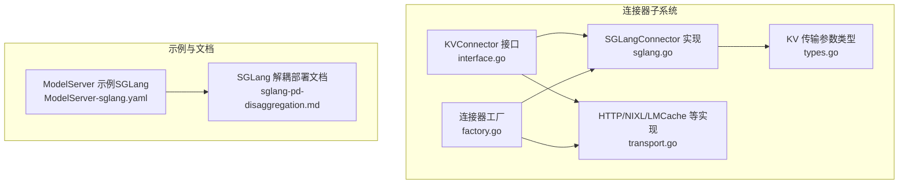
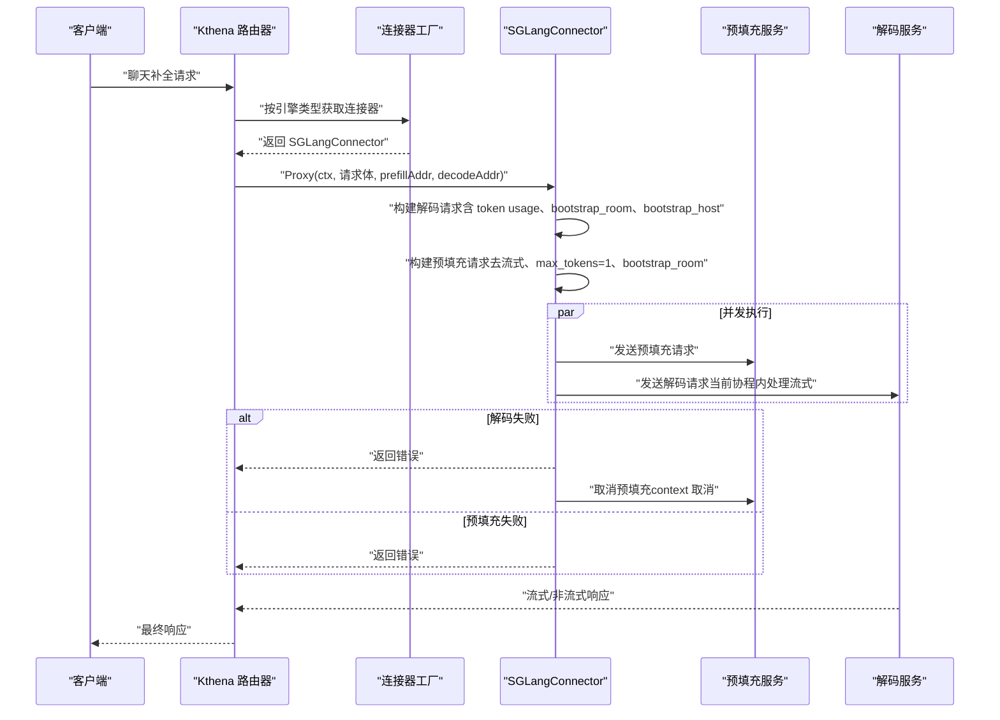
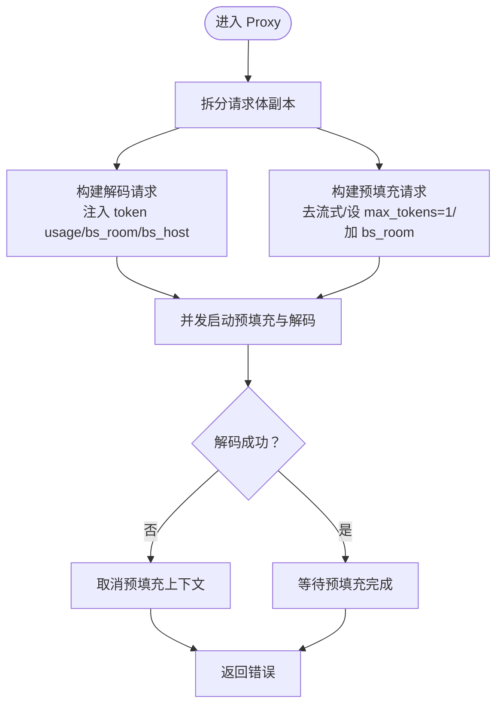
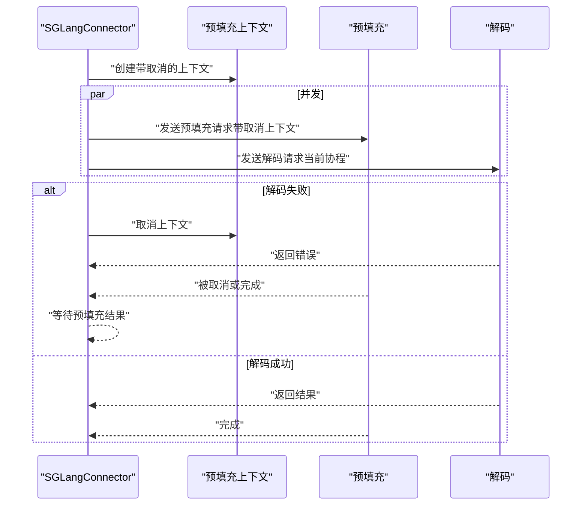
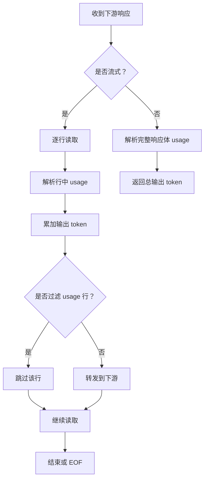
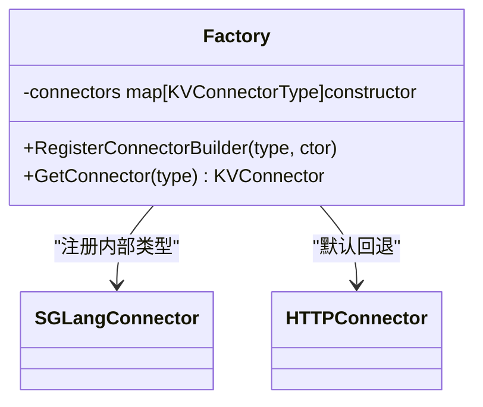
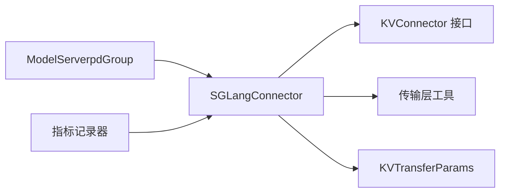

# SGLang 连接器

<cite>
**本文引用的文件**
- [sglang.go](file://pkg/kthena-router/connectors/sglang.go)
- [interface.go](file://pkg/kthena-router/connectors/interface.go)
- [factory.go](file://pkg/kthena-router/connectors/factory.go)
- [transport.go](file://pkg/kthena-router/connectors/transport.go)
- [types.go](file://pkg/kthena-router/connectors/types.go)
- [ModelServer-sglang.yaml](file://examples/kthena-router/ModelServer-sglang.yaml)
- [sglang-pd-disaggregation.md](file://docs/kthena/docs/user-guide/prefill-decode-disaggregation/sglang-pd-disaggregation.md)
- [runtime.md](file://docs/kthena/docs/user-guide/runtime.md)
- [metrics.go](file://pkg/kthena-router/metrics/metrics.go)
</cite>

## 目录
1. [简介](#简介)
2. [项目结构](#项目结构)
3. [核心组件](#核心组件)
4. [架构总览](#架构总览)
5. [组件详解](#组件详解)
6. [依赖关系分析](#依赖关系分析)
7. [性能与优化](#性能与优化)
8. [故障排查指南](#故障排查指南)
9. [结论](#结论)
10. [附录](#附录)

## 简介
本文件系统性阐述 Kthena 路由层中 SGLang 连接器的实现机制与集成方式，重点覆盖：
- 与 SGLang 推理引擎的预填充-解码（Prefill-Decode）解耦协议对接
- 协议适配与请求构建：bootstrap_room、bootstrap_host 的生成与传递
- 并发执行与错误传播：预填充与解码阶段的并发启动与失败快速回滚
- 调度与资源管理：基于 PD 组的路由选择与资源隔离
- 性能特征与优化：延迟与吞吐权衡、并发策略与缓存传输后端
- 配置参数、调优建议与监控指标
- 实践案例与基准测试参考路径

## 项目结构
SGLang 连接器位于路由模块的连接器子系统中，采用“接口 + 工厂 + 具体实现”的分层设计，并通过通用传输层完成请求转发与流式响应处理。



**图表来源**
- [sglang.go:1-222](file://pkg/kthena-router/connectors/sglang.go#L1-L222)
- [interface.go:1-32](file://pkg/kthena-router/connectors/interface.go#L1-L32)
- [factory.go:1-60](file://pkg/kthena-router/connectors/factory.go#L1-L60)
- [transport.go:1-227](file://pkg/kthena-router/connectors/transport.go#L1-L227)
- [types.go:1-28](file://pkg/kthena-router/connectors/types.go#L1-L28)
- [ModelServer-sglang.yaml:1-16](file://examples/kthena-router/ModelServer-sglang.yaml#L1-L16)
- [sglang-pd-disaggregation.md:1-281](file://docs/kthena/docs/user-guide/prefill-decode-disaggregation/sglang-pd-disaggregation.md#L1-L281)

**章节来源**
- [sglang.go:1-222](file://pkg/kthena-router/connectors/sglang.go#L1-L222)
- [interface.go:1-32](file://pkg/kthena-router/connectors/interface.go#L1-L32)
- [factory.go:1-60](file://pkg/kthena-router/connectors/factory.go#L1-L60)
- [transport.go:1-227](file://pkg/kthena-router/connectors/transport.go#L1-L227)
- [types.go:1-28](file://pkg/kthena-router/connectors/types.go#L1-L28)
- [ModelServer-sglang.yaml:1-16](file://examples/kthena-router/ModelServer-sglang.yaml#L1-L16)
- [sglang-pd-disaggregation.md:1-281](file://docs/kthena/docs/user-guide/prefill-decode-disaggregation/sglang-pd-disaggregation.md#L1-L281)

## 核心组件
- KVConnector 接口：定义连接器名称与预填充-解码全流程代理方法
- SGLangConnector：实现 SGLang 解耦推理的连接器，负责构建并并发执行预填充与解码请求
- 连接器工厂：按类型注册并返回具体连接器实例
- 通用传输层：封装预填充/解码代理、流式与非流式响应处理、请求体预处理等
- KV 传输参数类型：抽象跨引擎的 KV 缓存传输参数结构

关键职责与行为：
- 构建预填充请求：移除流式选项、限制 max_tokens 为 1，确保仅做一次前缀计算
- 构建解码请求：注入 token 使用统计、携带 bootstrap_room 与 bootstrap_host
- 并发执行：预填充与解码同时发起，解码失败时取消预填充以避免超时
- 流式输出：透传 SSE/NDJSON 流，解析增量 token 使用并可过滤 usage 行
- 指标记录：在存在指标记录器时，分别记录预填充与解码阶段状态与活跃上游请求数

**章节来源**
- [interface.go:23-31](file://pkg/kthena-router/connectors/interface.go#L23-L31)
- [sglang.go:50-70](file://pkg/kthena-router/connectors/sglang.go#L50-L70)
- [factory.go:38-59](file://pkg/kthena-router/connectors/factory.go#L38-L59)
- [transport.go:33-78](file://pkg/kthena-router/connectors/transport.go#L33-L78)
- [transport.go:80-90](file://pkg/kthena-router/connectors/transport.go#L80-L90)
- [transport.go:175-205](file://pkg/kthena-router/connectors/transport.go#L175-L205)
- [metrics.go:236-264](file://pkg/kthena-router/metrics/metrics.go#L236-L264)

## 架构总览
SGLang 连接器在路由层扮演“协议适配器”角色，将上层统一的推理请求转换为符合 SGLang 预填充-解码解耦协议的两个子请求，并协调 KV 缓存的传输与生命周期。



**图表来源**
- [sglang.go:86-195](file://pkg/kthena-router/connectors/sglang.go#L86-L195)
- [transport.go:48-78](file://pkg/kthena-router/connectors/transport.go#L48-L78)
- [transport.go:175-205](file://pkg/kthena-router/connectors/transport.go#L175-L205)

## 组件详解

### SGLangConnector 类与方法
- 字段
  - prefillRequest/decodeRequest：复用的预填充与解码请求对象（按地址变化重建）
  - bootstrapRoom：全局唯一的房间号，用于 KV 缓存交换
  - lastPrefillAddr/lastDecodeAddr：缓存上次地址，避免重复构造
- 方法
  - Name：返回连接器类型名
  - Proxy：主流程，构建请求、并发执行、错误传播与指标记录
  - prefill/decode：分别对预填充与解码进行代理转发
  - buildRequest：序列化请求体并克隆原始请求

```mermaid
classDiagram
class KVConnector {
+Name() string
+Proxy(c, reqBody, prefillAddr, decodeAddr) (int, error)
}
class SGLangConnector {
-prefillRequest *http.Request
-decodeRequest *http.Request
-bootstrapRoom int64
-lastPrefillAddr string
-lastDecodeAddr string
+Name() string
+Proxy(c, reqBody, prefillAddr, decodeAddr) (int, error)
-prefill(req, addr) error
-decode(c, req, addr) (int, error)
}
class TransportLayer {
+prefillerProxy(req) error
+decoderProxy(c, req) (int, error)
+preparePrefillBody(reqBody)
+addTokenUsage(c, reqBody) map[string]interface{}
}
KVConnector <|.. SGLangConnector
SGLangConnector --> TransportLayer : "使用"
```

**图表来源**
- [interface.go:23-31](file://pkg/kthena-router/connectors/interface.go#L23-L31)
- [sglang.go:50-70](file://pkg/kthena-router/connectors/sglang.go#L50-L70)
- [sglang.go:197-209](file://pkg/kthena-router/connectors/sglang.go#L197-L209)
- [transport.go:33-78](file://pkg/kthena-router/connectors/transport.go#L33-L78)
- [transport.go:80-90](file://pkg/kthena-router/connectors/transport.go#L80-L90)
- [transport.go:125-145](file://pkg/kthena-router/connectors/transport.go#L125-L145)

**章节来源**
- [sglang.go:50-70](file://pkg/kthena-router/connectors/sglang.go#L50-L70)
- [sglang.go:86-195](file://pkg/kthena-router/connectors/sglang.go#L86-L195)
- [sglang.go:197-209](file://pkg/kthena-router/connectors/sglang.go#L197-L209)
- [transport.go:33-78](file://pkg/kthena-router/connectors/transport.go#L33-L78)
- [transport.go:80-90](file://pkg/kthena-router/connectors/transport.go#L80-L90)
- [transport.go:125-145](file://pkg/kthena-router/connectors/transport.go#L125-L145)

### 预填充与解码请求构建
- 预填充请求
  - 去除流式字段，设置 max_tokens/max_completion_tokens 为 1
  - 注入 bootstrap_room
- 解码请求
  - 复制原始请求体，注入 token usage（流式 include_usage 或非流式 include_usage）
  - 注入 bootstrap_room 与 bootstrap_host（即预填充节点 IP）



**图表来源**
- [sglang.go:105-132](file://pkg/kthena-router/connectors/sglang.go#L105-L132)
- [sglang.go:134-171](file://pkg/kthena-router/connectors/sglang.go#L134-L171)
- [transport.go:80-90](file://pkg/kthena-router/connectors/transport.go#L80-L90)
- [transport.go:125-145](file://pkg/kthena-router/connectors/transport.go#L125-L145)

**章节来源**
- [sglang.go:105-132](file://pkg/kthena-router/connectors/sglang.go#L105-L132)
- [transport.go:80-90](file://pkg/kthena-router/connectors/transport.go#L80-L90)
- [transport.go:125-145](file://pkg/kthena-router/connectors/transport.go#L125-L145)

### 并发与错误传播
- 预填充与解码并发启动，共享一个带取消的上下文
- 若解码失败，立即取消预填充上下文，避免长时间等待
- 预填充完成后根据其结果决定最终返回状态



**图表来源**
- [sglang.go:144-171](file://pkg/kthena-router/connectors/sglang.go#L144-L171)

**章节来源**
- [sglang.go:144-171](file://pkg/kthena-router/connectors/sglang.go#L144-L171)

### 流式响应处理
- 判断响应是否为 SSE/NDJSON
- 流式场景下逐行解析 usage，累加输出 token 数
- 可根据上下文开关过滤 usage 行，仅透传文本内容
- 非流式场景解析响应体中的 usage 字段



**图表来源**
- [transport.go:169-173](file://pkg/kthena-router/connectors/transport.go#L169-L173)
- [transport.go:175-205](file://pkg/kthena-router/connectors/transport.go#L175-L205)
- [transport.go:207-226](file://pkg/kthena-router/connectors/transport.go#L207-L226)

**章节来源**
- [transport.go:169-173](file://pkg/kthena-router/connectors/transport.go#L169-L173)
- [transport.go:175-205](file://pkg/kthena-router/connectors/transport.go#L175-L205)
- [transport.go:207-226](file://pkg/kthena-router/connectors/transport.go#L207-L226)

### 连接器工厂与类型注册
- 工厂按类型注册默认连接器
- SGLang 内部类型通过工厂注册，不暴露给用户配置枚举
- 未匹配类型时回退为 HTTP 连接器



**图表来源**
- [factory.go:22-45](file://pkg/kthena-router/connectors/factory.go#L22-L45)
- [factory.go:47-59](file://pkg/kthena-router/connectors/factory.go#L47-L59)

**章节来源**
- [factory.go:22-45](file://pkg/kthena-router/connectors/factory.go#L22-L45)
- [factory.go:47-59](file://pkg/kthena-router/connectors/factory.go#L47-L59)

## 依赖关系分析
- SGLangConnector 依赖
  - 接口：KVConnector
  - 传输层：prefillerProxy/decoderProxy、preparePrefillBody、addTokenUsage
  - 类型：KVTransferParams（抽象 KV 传输参数）
  - 工具：随机数生成 bootstrap_room、地址解析 bootstrap_host
- 与调度/路由的关系
  - 通过 ModelServer 的 pdGroup 识别 prefill/decode 角色
  - 通过工作负载标签选择对应 Pod 地址
- 与监控的关系
  - 在存在指标记录器时，记录预填充/解码阶段状态与活跃上游请求数



**图表来源**
- [sglang.go:36-40](file://pkg/kthena-router/connectors/sglang.go#L36-L40)
- [types.go:19-27](file://pkg/kthena-router/connectors/types.go#L19-L27)
- [sglang-pd-disaggregation.md:184-189](file://docs/kthena/docs/user-guide/prefill-decode-disaggregation/sglang-pd-disaggregation.md#L184-L189)
- [metrics.go:236-264](file://pkg/kthena-router/metrics/metrics.go#L236-L264)

**章节来源**
- [sglang.go:36-40](file://pkg/kthena-router/connectors/sglang.go#L36-L40)
- [types.go:19-27](file://pkg/kthena-router/connectors/types.go#L19-L27)
- [sglang-pd-disaggregation.md:184-189](file://docs/kthena/docs/user-guide/prefill-decode-disaggregation/sglang-pd-disaggregation.md#L184-L189)
- [metrics.go:236-264](file://pkg/kthena-router/metrics/metrics.go#L236-L264)

## 性能与优化
- 并发策略
  - 预填充与解码并发启动，减少端到端延迟；解码失败时立即取消预填充，避免资源浪费
- 预填充优化
  - 将 max_tokens 设置为 1，仅做一次前缀计算，显著降低预填充阶段的计算与 KV 写入开销
- 流式传输
  - 透传 SSE/NDJSON，边生成边输出；在流式场景下可选择过滤 usage 行，减少下游解析负担
- 指标观测
  - 记录预填充/解码阶段耗时、活跃上游请求数、输出 token 数，便于定位瓶颈
- 引擎级标准化
  - 对 SGLang/VLLM 等引擎的关键指标进行标准化命名，统一 Prometheus/Grafana 展示

调优建议
- 合理设置解码超时与预填充超时，避免长尾请求阻塞
- 在高并发场景下，适当增加解码副本数量，平衡预填充与解码的资源占用
- 使用流量策略（如全局/模型级限流）控制突发流量，保障端到端延迟稳定

**章节来源**
- [sglang.go:134-171](file://pkg/kthena-router/connectors/sglang.go#L134-L171)
- [transport.go:80-90](file://pkg/kthena-router/connectors/transport.go#L80-L90)
- [transport.go:175-205](file://pkg/kthena-router/connectors/transport.go#L175-L205)
- [metrics.go:236-264](file://pkg/kthena-router/metrics/metrics.go#L236-L264)
- [runtime.md:121-134](file://docs/kthena/docs/user-guide/runtime.md#L121-L134)

## 故障排查指南
常见问题与定位要点
- 预填充超时或报错
  - 症状：预填充阶段超时或返回 KVTransferError
  - 原因：预填充先发，解码尚未到达，导致无法建立 KV 缓存交换
  - 处理：确认并发执行已生效；检查解码请求是否携带正确的 bootstrap_host 与 bootstrap_room
- 解码失败
  - 症状：解码返回错误码
  - 处理：查看日志中预填充是否被取消；检查解码服务健康状态与网络连通性
- 流式输出异常
  - 症状：下游接收不到增量 token 或出现 usage 行
  - 处理：确认请求体中是否启用 include_usage；检查过滤开关是否开启

定位步骤
- 查看路由层日志中 prefill/decode 的目标地址与 bootstrap_room
- 检查解码服务的健康探针与端口暴露
- 对比预填充与解码的响应状态码与耗时指标

**章节来源**
- [sglang.go:80-85](file://pkg/kthena-router/connectors/sglang.go#L80-L85)
- [sglang.go:164-168](file://pkg/kthena-router/connectors/sglang.go#L164-L168)
- [transport.go:175-205](file://pkg/kthena-router/connectors/transport.go#L175-L205)

## 结论
SGLang 连接器通过严格的预填充-解码协议适配与并发执行策略，在保证 KV 缓存正确传递的同时，有效降低了端到端延迟并提升了吞吐能力。结合工厂化注册、通用传输层与指标体系，实现了对不同推理引擎的可扩展支持与可观测性增强。配合 PD 组路由与限流策略，可在多副本与高并发场景下保持稳定的性能表现。

## 附录

### 配置参数与调优清单
- 路由层
  - 连接器类型：自动选择 SGLang（内部类型），无需用户显式配置
  - 指标记录器：启用以采集阶段耗时与活跃请求数
- ModelServer（SGLang）
  - inferenceEngine：设置为 SGLang
  - workloadSelector：匹配预填充/解码角色标签
  - trafficPolicy.timeout：根据模型规模与并发调整
- 示例参考
  - ModelServer（SGLang）示例：[ModelServer-sglang.yaml:1-16](file://examples/kthena-router/ModelServer-sglang.yaml#L1-L16)
  - 完整部署与验证步骤：[SGLang 解耦部署文档:1-281](file://docs/kthena/docs/user-guide/prefill-decode-disaggregation/sglang-pd-disaggregation.md#L1-L281)

**章节来源**
- [ModelServer-sglang.yaml:13](file://examples/kthena-router/ModelServer-sglang.yaml#L13)
- [sglang-pd-disaggregation.md:173-217](file://docs/kthena/docs/user-guide/prefill-decode-disaggregation/sglang-pd-disaggregation.md#L173-L217)

### 监控指标
- 标准化指标（SGLang/VLLM 引擎）
  - kthena:generation_tokens_total
  - kthena:num_requests_waiting
  - kthena:time_to_first_token_seconds
  - kthena:time_per_output_token_seconds
  - kthena:e2e_request_latency_seconds
- 连接器特定
  - 预填充/解码阶段耗时、活跃上游请求数、输出 token 数

参考
- [runtime.md:121-134](file://docs/kthena/docs/user-guide/runtime.md#L121-L134)
- [metrics.go:236-264](file://pkg/kthena-router/metrics/metrics.go#L236-L264)

**章节来源**
- [runtime.md:121-134](file://docs/kthena/docs/user-guide/runtime.md#L121-L134)
- [metrics.go:236-264](file://pkg/kthena-router/metrics/metrics.go#L236-L264)

### 实践案例与基准测试
- 实践案例
  - 使用 ModelServing 定义 prefill/decode 角色，ModelServer 指定 inferenceEngine 为 SGLang，ModelRoute 将请求路由至该 ModelServer
  - 参考：[SGLang 解耦部署文档:1-281](file://docs/kthena/docs/user-guide/prefill-decode-disaggregation/sglang-pd-disaggregation.md#L1-L281)
- 基准测试
  - 文档中提供了部署后的验证步骤与期望响应格式，可用于对比不同配置下的端到端延迟与吞吐
  - 参考：[SGLang 验证与示例请求:237-280](file://docs/kthena/docs/user-guide/prefill-decode-disaggregation/sglang-pd-disaggregation.md#L237-L280)

**章节来源**
- [sglang-pd-disaggregation.md:237-280](file://docs/kthena/docs/user-guide/prefill-decode-disaggregation/sglang-pd-disaggregation.md#L237-L280)