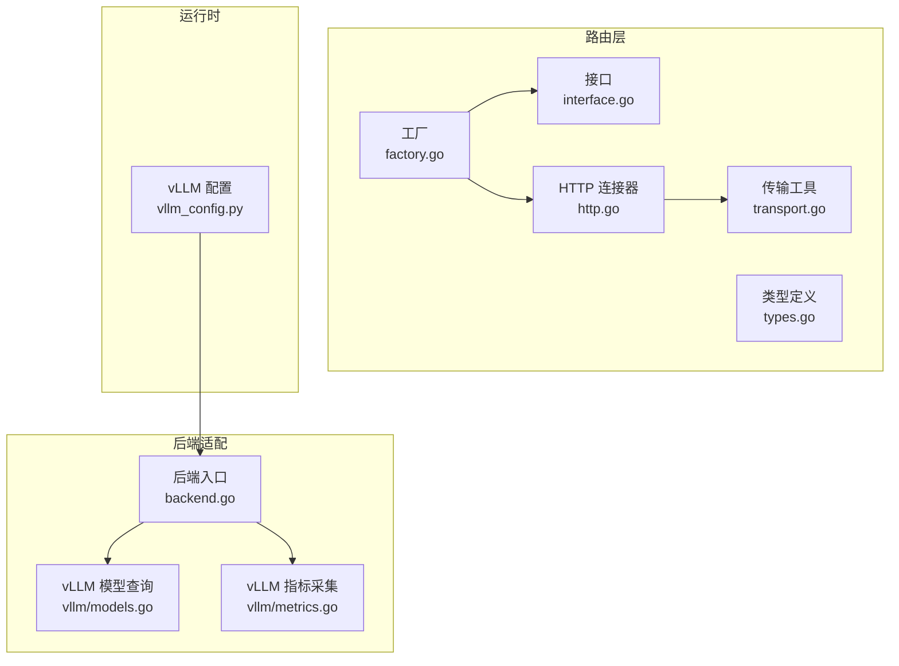
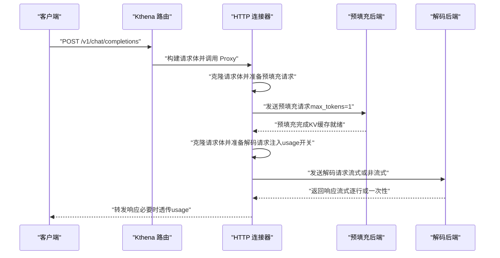
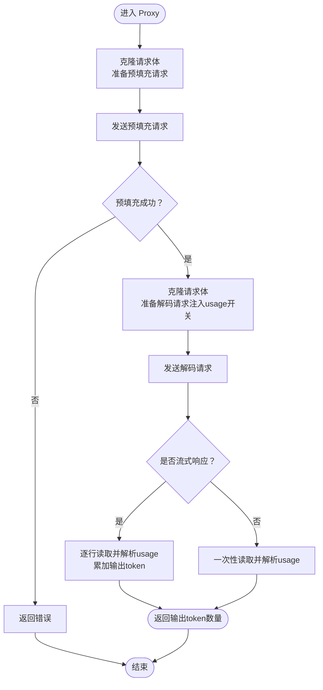
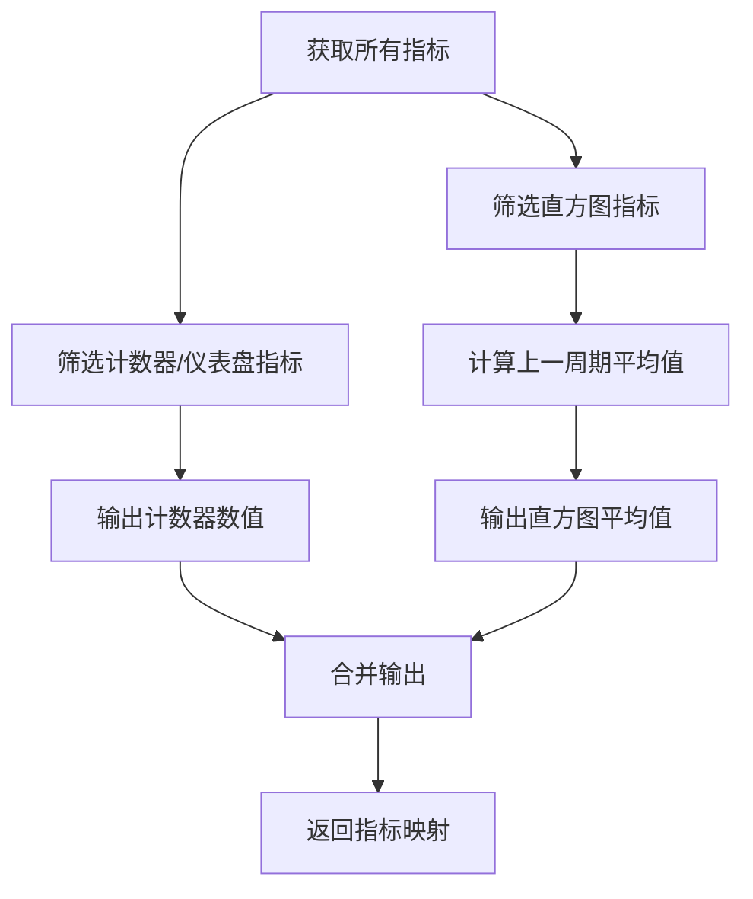
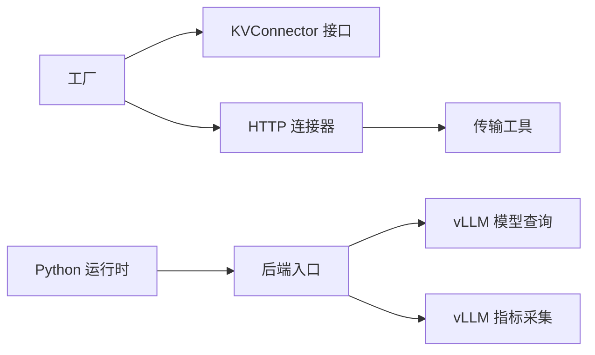

# vLLM 连接器

<cite>
**本文引用的文件**
- [factory.go](file://pkg/kthena-router/connectors/factory.go)
- [interface.go](file://pkg/kthena-router/connectors/interface.go)
- [types.go](file://pkg/kthena-router/connectors/types.go)
- [http.go](file://pkg/kthena-router/connectors/http.go)
- [transport.go](file://pkg/kthena-router/connectors/transport.go)
- [backend.go](file://pkg/kthena-router/backend/backend.go)
- [vllm/models.go](file://pkg/kthena-router/backend/vllm/models.go)
- [vllm/metrics.go](file://pkg/kthena-router/backend/vllm/metrics.go)
- [vllm_config.py](file://python/kthena/runtime/vllm_config.py)
- [vllm-pd-disaggregation.md](file://docs/kthena/docs/user-guide/prefill-decode-disaggregation/vllm-pd-disaggregation.md)
- [mooncake.go](file://pkg/kthena-router/connectors/mooncake.go)
</cite>

## 目录
1. [简介](#简介)
2. [项目结构](#项目结构)
3. [核心组件](#核心组件)
4. [架构总览](#架构总览)
5. [详细组件分析](#详细组件分析)
6. [依赖关系分析](#依赖关系分析)
7. [性能考量](#性能考量)
8. [故障排查指南](#故障排查指南)
9. [结论](#结论)
10. [附录](#附录)

## 简介
本文件面向 vLLM 连接器的技术文档，系统性阐述其在 Kthena 路由层中的实现方式、与 vLLM 推理引擎的集成路径、API 协议适配策略、以及性能指标采集与监控机制。重点覆盖以下方面：
- vLLM 特有请求格式与响应结构的处理（预填充-解码拆分、流式与非流式、使用量统计）
- 连接器如何适配 OpenAI 兼容 API，并在预填充阶段进行请求体裁剪与参数重写
- 指标采集与聚合：GPU 缓存占用、等待/运行中的请求数、首 Token 时间、输出 Token 时延等
- 配置项与优化参数建议、最佳实践与常见问题定位

## 项目结构
围绕 vLLM 连接器的关键代码分布在如下模块：
- 连接器工厂与接口：注册与选择不同 KV 传输连接器
- HTTP 连接器：通用 HTTP 代理实现，支持预填充与解码阶段分离
- 传输层工具：请求体克隆、预填充请求体准备、流式/非流式响应处理、使用量统计透传
- vLLM 后端：模型列表查询、Prometheus 指标解析与聚合
- Python 运行时：vLLM 相关配置数据类
- 文档：vLLM 预填充-解码拆分部署与验证流程

**图示来源**
- [factory.go:21-60](file://pkg/kthena-router/connectors/factory.go#L21-L60)
- [interface.go:23-31](file://pkg/kthena-router/connectors/interface.go#L23-L31)
- [types.go:19-28](file://pkg/kthena-router/connectors/types.go#L19-L28)
- [http.go:28-120](file://pkg/kthena-router/connectors/http.go#L28-L120)
- [transport.go:33-227](file://pkg/kthena-router/connectors/transport.go#L33-L227)
- [backend.go:30-83](file://pkg/kthena-router/backend/backend.go#L30-L83)
- [vllm/models.go:30-71](file://pkg/kthena-router/backend/vllm/models.go#L30-L71)
- [vllm/metrics.go:58-120](file://pkg/kthena-router/backend/vllm/metrics.go#L58-L120)
- [vllm_config.py:18-31](file://python/kthena/runtime/vllm_config.py#L18-L31)

**章节来源**
- [factory.go:21-60](file://pkg/kthena-router/connectors/factory.go#L21-L60)
- [http.go:28-120](file://pkg/kthena-router/connectors/http.go#L28-L120)
- [transport.go:33-227](file://pkg/kthena-router/connectors/transport.go#L33-L227)
- [backend.go:30-83](file://pkg/kthena-router/backend/backend.go#L30-L83)
- [vllm/models.go:30-71](file://pkg/kthena-router/backend/vllm/models.go#L30-L71)
- [vllm/metrics.go:58-120](file://pkg/kthena-router/backend/vllm/metrics.go#L58-L120)
- [vllm_config.py:18-31](file://python/kthena/runtime/vllm_config.py#L18-L31)

## 核心组件
- 工厂与接口
  - 工厂负责注册与获取 KV 连接器实例，默认回退到 HTTP 连接器
  - KVConnector 接口定义名称与预填充-解码全流程代理方法
- HTTP 连接器
  - 将一次推理请求拆分为“预填充”和“解码”两个阶段，分别向不同后端地址发送
  - 在上下文中标注是否需要透传 token 使用量统计
- 传输工具
  - 构建预填充请求体：移除流式字段并强制 max_tokens/max_completion_tokens=1
  - 构建解码请求体：根据是否流式自动注入 usage 统计开关
  - 流式响应按行解析，提取使用量并可选择过滤 usage 行
- vLLM 后端适配
  - 模型列表查询：调用 /v1/models 获取已加载模型 ID 列表
  - 指标采集：从 /metrics 解析计数器与直方图，计算上一周期平均值用于调度决策

**章节来源**
- [factory.go:33-60](file://pkg/kthena-router/connectors/factory.go#L33-L60)
- [interface.go:23-31](file://pkg/kthena-router/connectors/interface.go#L23-L31)
- [http.go:63-120](file://pkg/kthena-router/connectors/http.go#L63-L120)
- [transport.go:80-145](file://pkg/kthena-router/connectors/transport.go#L80-L145)
- [transport.go:175-227](file://pkg/kthena-router/connectors/transport.go#L175-L227)
- [vllm/models.go:38-71](file://pkg/kthena-router/backend/vllm/models.go#L38-L71)
- [vllm/metrics.go:71-120](file://pkg/kthena-router/backend/vllm/metrics.go#L71-L120)

## 架构总览
vLLM 连接器在路由层通过 HTTP 连接器实现对 OpenAI 兼容 API 的代理，结合预填充-解码拆分策略，确保 KV 缓存跨阶段传递正确完成。

**图示来源**
- [http.go:63-120](file://pkg/kthena-router/connectors/http.go#L63-L120)
- [transport.go:92-123](file://pkg/kthena-router/connectors/transport.go#L92-L123)
- [transport.go:175-227](file://pkg/kthena-router/connectors/transport.go#L175-L227)

## 详细组件分析

### HTTP 连接器与请求体适配
- 预填充阶段
  - 请求体被克隆并移除流式相关字段，强制最大生成步数为 1，避免预填充阶段产生过多输出
  - 发送至预填充后端地址，成功后再进入解码阶段
- 解码阶段
  - 请求体同样被克隆，针对流式请求注入 usage 透传开关；非流式请求显式要求 usage 返回
  - 发送至解码后端地址，按响应类型进行处理
- 响应处理
  - 流式：按行读取 SSE/NDJSON，解析 usage 并累加输出 token 数，可按需过滤 usage 行
  - 非流式：一次性读取响应体，解析 JSON 中的 usage 字段

**图示来源**
- [http.go:63-120](file://pkg/kthena-router/connectors/http.go#L63-L120)
- [transport.go:80-145](file://pkg/kthena-router/connectors/transport.go#L80-L145)
- [transport.go:175-227](file://pkg/kthena-router/connectors/transport.go#L175-L227)

**章节来源**
- [http.go:63-120](file://pkg/kthena-router/connectors/http.go#L63-L120)
- [transport.go:80-145](file://pkg/kthena-router/connectors/transport.go#L80-L145)
- [transport.go:175-227](file://pkg/kthena-router/connectors/transport.go#L175-L227)

### vLLM 指标采集与聚合
- 指标来源
  - vLLM 提供 Prometheus 指标端点，路由层通过统一解析函数获取指标家族
- 支持的指标
  - 计数器/仪表盘：GPU 缓存使用率、等待中的请求数、运行中的请求数
  - 直方图：首 Token 时间、输出单 Token 的时延
- 聚合策略
  - 对直方图指标采用“上一周期平均值”策略，避免历史累积影响首次观测
  - 将两类指标合并返回，供调度与可观测性使用

**图示来源**
- [vllm/metrics.go:71-120](file://pkg/kthena-router/backend/vllm/metrics.go#L71-L120)

**章节来源**
- [vllm/metrics.go:29-56](file://pkg/kthena-router/backend/vllm/metrics.go#L29-L56)
- [vllm/metrics.go:71-120](file://pkg/kthena-router/backend/vllm/metrics.go#L71-L120)

### vLLM 模型列表查询
- 通过调用后端 /v1/models 接口，解析返回的模型 ID 列表
- 用于路由层识别后端已加载模型，辅助匹配与健康检查

**章节来源**
- [vllm/models.go:38-71](file://pkg/kthena-router/backend/vllm/models.go#L38-L71)

### 连接器注册与默认行为
- 工厂注册了多种连接器类型，未命中时默认回退到 HTTP 连接器
- MoonCake 连接器在 Ascend 场景下复用 NIXL 实现

**章节来源**
- [factory.go:47-60](file://pkg/kthena-router/connectors/factory.go#L47-L60)
- [mooncake.go:19-26](file://pkg/kthena-router/connectors/mooncake.go#L19-L26)

## 依赖关系分析
- 路由层依赖连接器工厂与 HTTP 连接器，后者依赖传输工具完成请求体构建与响应处理
- 后端适配层依赖 vLLM 指标与模型查询能力，统一通过后端入口暴露给调度与监控
- Python 运行时提供 vLLM 配置数据结构，便于外部进程读取与初始化

**图示来源**
- [factory.go:33-60](file://pkg/kthena-router/connectors/factory.go#L33-L60)
- [http.go:28-120](file://pkg/kthena-router/connectors/http.go#L28-L120)
- [transport.go:33-227](file://pkg/kthena-router/connectors/transport.go#L33-L227)
- [backend.go:37-83](file://pkg/kthena-router/backend/backend.go#L37-L83)
- [vllm/models.go:30-71](file://pkg/kthena-router/backend/vllm/models.go#L30-L71)
- [vllm/metrics.go:58-120](file://pkg/kthena-router/backend/vllm/metrics.go#L58-L120)
- [vllm_config.py:18-31](file://python/kthena/runtime/vllm_config.py#L18-L31)

**章节来源**
- [backend.go:37-83](file://pkg/kthena-router/backend/backend.go#L37-L83)

## 性能考量
- 预填充阶段强制 max_tokens=1，显著降低首 Token 前的计算开销，缩短 TTFT
- 流式响应按行处理，边解码边转发，降低端到端延迟
- 指标聚合采用上一周期平均值，避免历史偏差，提升调度稳定性
- 建议在高并发场景下启用流式输出以改善用户体验，并配合使用量统计进行计费与成本控制

[本节为通用性能讨论，不直接分析具体文件]

## 故障排查指南
- 预填充失败
  - 现象：预填充阶段返回非 2xx 状态码或网络异常
  - 排查：确认预填充后端地址可达、端口正确、模型已加载
- 解码阶段无响应或超时
  - 现象：解码阶段长时间无响应
  - 排查：检查解码后端健康状态、网络连通性、是否存在阻塞的流式处理
- 使用量统计缺失
  - 现象：响应中缺少 usage 字段
  - 排查：确认请求体中是否启用了 usage 注入（流式自动注入，非流式显式开启）
- 指标采集异常
  - 现象：无法从 /metrics 获取期望指标
  - 排查：确认 vLLM 指标端口配置、Prometheus 抓取权限与网络策略

**章节来源**
- [transport.go:33-78](file://pkg/kthena-router/connectors/transport.go#L33-L78)
- [transport.go:125-145](file://pkg/kthena-router/connectors/transport.go#L125-L145)
- [vllm/metrics.go:71-80](file://pkg/kthena-router/backend/vllm/metrics.go#L71-L80)

## 结论
vLLM 连接器通过 HTTP 连接器与传输工具实现了对 OpenAI 兼容 API 的高效代理，并在预填充-解码拆分策略下保证 KV 缓存的正确传递。结合 vLLM 指标采集与模型查询能力，路由层能够实现更精准的调度与可观测性。建议在生产环境中启用流式输出与使用量统计，配合直方图指标的上一周期平均值策略，获得更稳定与低延迟的服务体验。

[本节为总结性内容，不直接分析具体文件]

## 附录

### vLLM 集成示例与最佳实践
- 示例配置参考：预填充-解码拆分部署与验证流程
  - 包含 ModelServing、ModelServer、ModelRoute 的 YAML 定义与 curl 测试命令
  - 参考路径：[vllm-pd-disaggregation.md:20-327](file://docs/kthena/docs/user-guide/prefill-decode-disaggregation/vllm-pd-disaggregation.md#L20-L327)
- 最佳实践
  - 启用流式输出以提升交互体验
  - 明确设置 max_tokens 与 max_completion_tokens，避免预填充阶段产生多余输出
  - 使用使用量统计进行计费与成本控制
  - 定期抓取 vLLM 指标，关注 GPU 缓存使用率与排队情况

**章节来源**
- [vllm-pd-disaggregation.md:20-327](file://docs/kthena/docs/user-guide/prefill-decode-disaggregation/vllm-pd-disaggregation.md#L20-L327)

### vLLM 连接器配置与优化参数
- 连接器类型
  - 默认 HTTP 连接器，适用于大多数场景
  - MoonCake 连接器在 Ascend 场景下复用 NIXL 实现
- 关键参数
  - 预填充阶段强制 max_tokens/max_completion_tokens=1
  - 解码阶段自动注入 usage 透传开关（流式），或显式开启 include_usage（非流式）
  - 指标端口默认 8000，可通过 vLLM 配置调整
- Python 运行时配置
  - 提供 vLLM 相关配置数据类，便于外部进程读取与初始化

**章节来源**
- [factory.go:47-60](file://pkg/kthena-router/connectors/factory.go#L47-L60)
- [mooncake.go:19-26](file://pkg/kthena-router/connectors/mooncake.go#L19-L26)
- [transport.go:80-145](file://pkg/kthena-router/connectors/transport.go#L80-L145)
- [vllm/metrics.go:64-69](file://pkg/kthena-router/backend/vllm/metrics.go#L64-L69)
- [vllm_config.py:18-31](file://python/kthena/runtime/vllm_config.py#L18-L31)