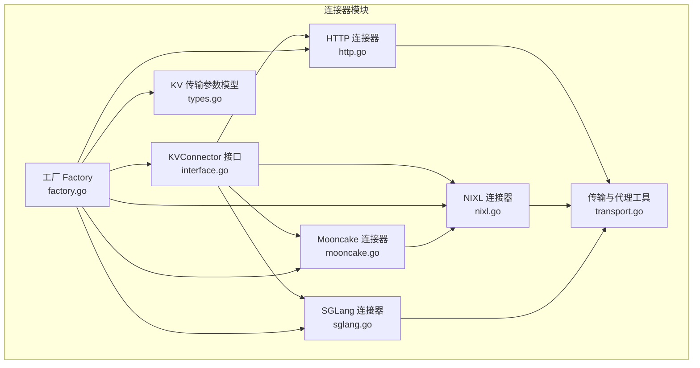
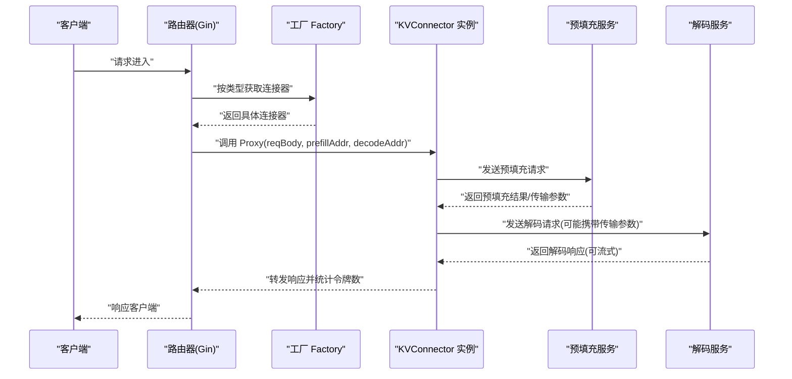
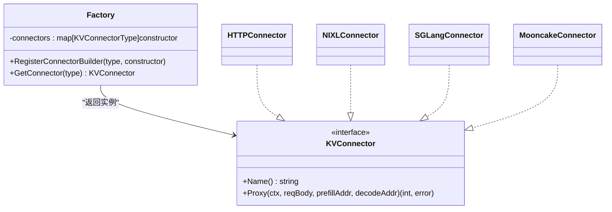
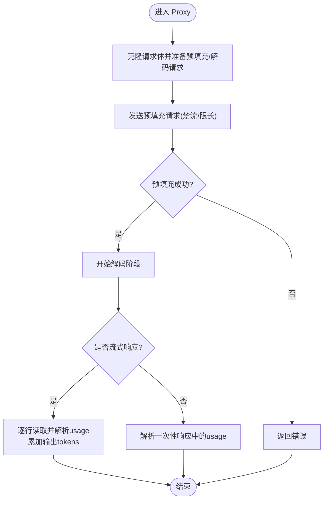
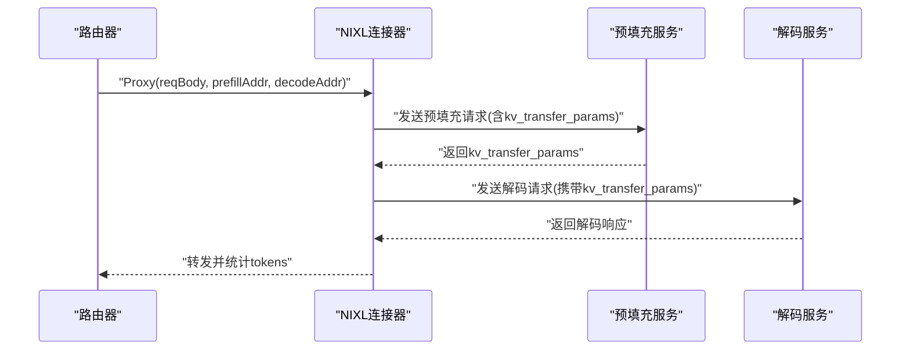
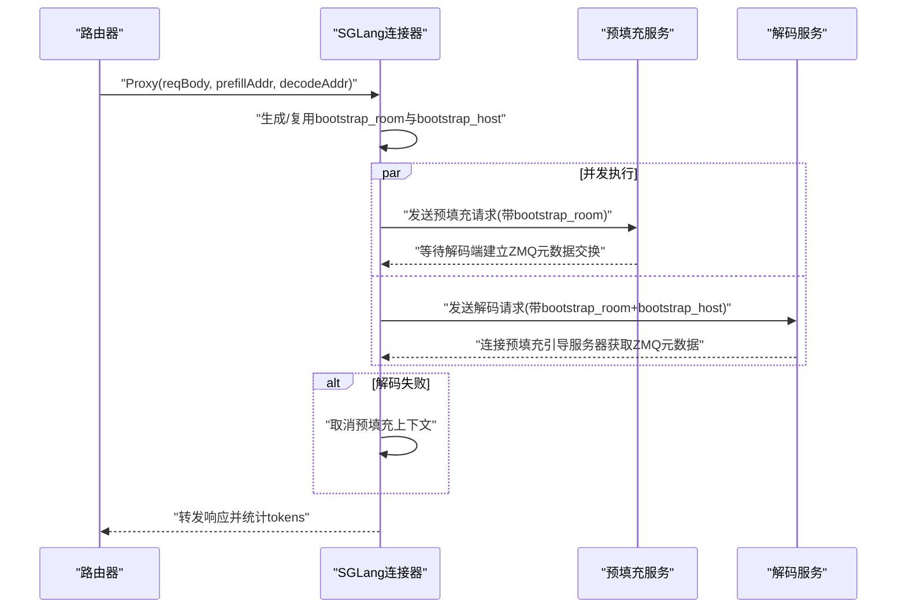
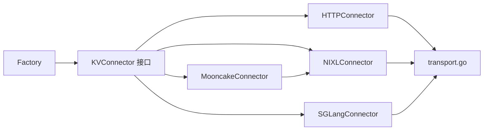

# 连接器工厂

<cite>
**本文引用的文件**
- [factory.go](file://pkg/kthena-router/connectors/factory.go)
- [interface.go](file://pkg/kthena-router/connectors/interface.go)
- [types.go](file://pkg/kthena-router/connectors/types.go)
- [http.go](file://pkg/kthena-router/connectors/http.go)
- [nixl.go](file://pkg/kthena-router/connectors/nixl.go)
- [sglang.go](file://pkg/kthena-router/connectors/sglang.go)
- [mooncake.go](file://pkg/kthena-router/connectors/mooncake.go)
- [transport.go](file://pkg/kthena-router/connectors/transport.go)
- [connectors_test.go](file://pkg/kthena-router/connectors/connectors_test.go)
</cite>

## 目录
1. [简介](#简介)
2. [项目结构](#项目结构)
3. [核心组件](#核心组件)
4. [架构总览](#架构总览)
5. [详细组件分析](#详细组件分析)
6. [依赖分析](#依赖分析)
7. [性能考量](#性能考量)
8. [故障排查指南](#故障排查指南)
9. [结论](#结论)
10. [附录：扩展与集成指南](#附录扩展与集成指南)

## 简介
本文件系统性阐述 Kthena 路由器中的“连接器工厂”设计与实现，重点覆盖：
- 工厂模式的设计理念与注册/实例化流程
- KV 缓存连接器接口抽象与各实现（vLLM、SGLang、Mooncake NPU、NixL）
- 协议差异处理、性能特征与资源需求
- 健康检查、故障转移与负载均衡机制
- 扩展开发与第三方推理引擎集成方案

## 项目结构
Kthena 路由器的连接器位于 pkg/kthena-router/connectors 目录，采用“接口 + 工厂 + 多实现”的分层设计：
- 接口层：统一的 KVConnector 抽象
- 工厂层：按类型注册并实例化具体连接器
- 实现层：HTTP/NIXL/SGLang/Mooncake 等连接器
- 辅助层：请求构建、预填充/解码代理、流式响应处理等通用逻辑

图表来源
- [interface.go:23-31](file://pkg/kthena-router/connectors/interface.go#L23-L31)
- [factory.go:21-59](file://pkg/kthena-router/connectors/factory.go#L21-L59)
- [http.go:28-38](file://pkg/kthena-router/connectors/http.go#L28-L38)
- [nixl.go:34-46](file://pkg/kthena-router/connectors/nixl.go#L34-L46)
- [sglang.go:42-65](file://pkg/kthena-router/connectors/sglang.go#L42-L65)
- [mooncake.go:19-25](file://pkg/kthena-router/connectors/mooncake.go#L19-L25)
- [transport.go:33-78](file://pkg/kthena-router/connectors/transport.go#L33-L78)
- [types.go:19-27](file://pkg/kthena-router/connectors/types.go#L19-L27)

章节来源
- [factory.go:21-59](file://pkg/kthena-router/connectors/factory.go#L21-L59)
- [interface.go:23-31](file://pkg/kthena-router/connectors/interface.go#L23-L31)
- [http.go:28-38](file://pkg/kthena-router/connectors/http.go#L28-L38)
- [nixl.go:34-46](file://pkg/kthena-router/connectors/nixl.go#L34-L46)
- [sglang.go:42-65](file://pkg/kthena-router/connectors/sglang.go#L42-L65)
- [mooncake.go:19-25](file://pkg/kthena-router/connectors/mooncake.go#L19-L25)
- [transport.go:33-78](file://pkg/kthena-router/connectors/transport.go#L33-L78)
- [types.go:19-27](file://pkg/kthena-router/connectors/types.go#L19-L27)

## 核心组件
- 工厂 Factory：集中管理连接器构造器映射，支持默认注册与按类型获取实例；未知类型回退到 HTTP 连接器。
- KVConnector 接口：统一的名称标识与预填充-解码完整流程代理方法。
- 传输与代理工具：封装预填充/解码阶段的 HTTP 代理、流式/非流式响应处理、请求体预处理（去流式、限制 max_tokens）。
- KVTransferParams：跨阶段传递 KV 缓存传输参数的数据结构。

章节来源
- [factory.go:21-59](file://pkg/kthena-router/connectors/factory.go#L21-L59)
- [interface.go:23-31](file://pkg/kthena-router/connectors/interface.go#L23-L31)
- [transport.go:33-78](file://pkg/kthena-router/connectors/transport.go#L33-L78)
- [types.go:19-27](file://pkg/kthena-router/connectors/types.go#L19-L27)

## 架构总览
连接器工厂通过类型键选择具体实现，所有实现均遵循统一的 Proxy 流程：先预填充（prefill），再解码（decode）。不同连接器在预填充与解码之间的协调策略存在差异，例如 SGLang 需要并发启动以完成引导握手，而 NIXL 在预填充后从响应中提取 KV 传输参数并在解码时注入。

图表来源
- [factory.go:38-45](file://pkg/kthena-router/connectors/factory.go#L38-L45)
- [http.go:64-119](file://pkg/kthena-router/connectors/http.go#L64-L119)
- [nixl.go:54-112](file://pkg/kthena-router/connectors/nixl.go#L54-L112)
- [sglang.go:86-195](file://pkg/kthena-router/connectors/sglang.go#L86-L195)
- [transport.go:33-78](file://pkg/kthena-router/connectors/transport.go#L33-L78)

## 详细组件分析

### 工厂模式与注册机制
- 注册表：以枚举类型为键，值为构造函数，支持动态扩展。
- 默认工厂：内置 HTTP、LMCache（复用 HTTP）、Mooncake（复用 NIXL）、NIXL、SGLang 的注册。
- 获取策略：若未注册则回退至 HTTP 连接器，保证健壮性。

图表来源
- [factory.go:21-59](file://pkg/kthena-router/connectors/factory.go#L21-L59)
- [interface.go:23-31](file://pkg/kthena-router/connectors/interface.go#L23-L31)
- [http.go:28-38](file://pkg/kthena-router/connectors/http.go#L28-L38)
- [nixl.go:34-46](file://pkg/kthena-router/connectors/nixl.go#L34-L46)
- [sglang.go:42-65](file://pkg/kthena-router/connectors/sglang.go#L42-L65)
- [mooncake.go:19-25](file://pkg/kthena-router/connectors/mooncake.go#L19-L25)

章节来源
- [factory.go:21-59](file://pkg/kthena-router/connectors/factory.go#L21-L59)

### HTTP 连接器
- 设计定位：通用 HTTP 传输，适用于 LMCache、MoonCakeStore 等基于 HTTP 的 KV 缓存。
- 预填充/解码流程：
  - 预填充：移除流式字段，限制 max_tokens/max_completion_tokens 到 1，避免实际生成。
  - 解码：根据是否流式决定是否注入 token usage 统计。
- 流式处理：识别 SSE/NDJSON，逐行解析 usage 并累加输出 token 数量；非流式则解析 JSON 中的 usage 字段。

图表来源
- [http.go:64-119](file://pkg/kthena-router/connectors/http.go#L64-L119)
- [transport.go:80-145](file://pkg/kthena-router/connectors/transport.go#L80-L145)
- [transport.go:169-226](file://pkg/kthena-router/connectors/transport.go#L169-L226)

章节来源
- [http.go:28-119](file://pkg/kthena-router/connectors/http.go#L28-L119)
- [transport.go:33-78](file://pkg/kthena-router/connectors/transport.go#L33-L78)
- [transport.go:80-145](file://pkg/kthena-router/connectors/transport.go#L80-L145)
- [transport.go:169-226](file://pkg/kthena-router/connectors/transport.go#L169-L226)

### NIXL 连接器
- 设计定位：高性能分布式内存 KV 缓存，通过预填充阶段返回 kv_transfer_params，在解码阶段注入该参数完成缓存迁移。
- 关键差异：
  - 预填充：显式设置 kv_transfer_params.DoRemoteDecode=true, DoRemotePrefill=false。
  - 解码：从预填充响应中提取 kv_transfer_params，并将其写入解码请求体。
- 流式处理：沿用统一的流式/非流式响应处理逻辑。

图表来源
- [nixl.go:54-112](file://pkg/kthena-router/connectors/nixl.go#L54-L112)
- [nixl.go:115-144](file://pkg/kthena-router/connectors/nixl.go#L115-L144)
- [nixl.go:147-161](file://pkg/kthena-router/connectors/nixl.go#L147-L161)
- [nixl.go:164-173](file://pkg/kthena-router/connectors/nixl.go#L164-L173)
- [types.go:19-27](file://pkg/kthena-router/connectors/types.go#L19-L27)

章节来源
- [nixl.go:34-112](file://pkg/kthena-router/connectors/nixl.go#L34-L112)
- [types.go:19-27](file://pkg/kthena-router/connectors/types.go#L19-L27)

### SGLang 连接器
- 设计定位：专用于 SGLang 拆分式（prefill-decode）推理，要求预填充与解码同时进行以完成 ZMQ 元数据交换。
- 关键差异：
  - 引导参数：bootstrap_room（随机整数）贯穿预填充与解码；bootstrap_host（预填充 Pod IP）用于解码端定位引导服务器。
  - 并发策略：预填充与解码必须并发启动；若解码失败，预填充上下文被取消，避免悬挂等待。
  - 请求体处理：预填充前移除流式字段并限制 max_tokens/max_completion_tokens；解码保留流式配置并注入 usage。
- 流式处理：沿用统一的流式/非流式响应处理逻辑。

图表来源
- [sglang.go:86-195](file://pkg/kthena-router/connectors/sglang.go#L86-L195)
- [sglang.go:197-209](file://pkg/kthena-router/connectors/sglang.go#L197-L209)

章节来源
- [sglang.go:42-65](file://pkg/kthena-router/connectors/sglang.go#L42-L65)
- [sglang.go:86-195](file://pkg/kthena-router/connectors/sglang.go#L86-L195)

### Mooncake NPU 连接器
- 设计定位：Mooncake NPU 在 vLLM-Ascend 场景下的行为与 NIXL 类似，因此直接复用 NIXL 实现，仅命名不同。
- 适用场景：需要利用 NPU 加速的推理场景，且希望沿用 NIXL 的 KV 传输协议。

章节来源
- [mooncake.go:19-25](file://pkg/kthena-router/connectors/mooncake.go#L19-L25)
- [nixl.go:34-46](file://pkg/kthena-router/connectors/nixl.go#L34-L46)

### KVTransferParams 数据模型
- 字段含义：控制是否远程预填充/解码、目标远端引擎 ID、块 ID 列表、远端主机与端口等。
- 使用场景：NIXL/SGLang 在预填充后/或解码前注入该参数，驱动下游服务进行 KV 缓存迁移。

章节来源
- [types.go:19-27](file://pkg/kthena-router/connectors/types.go#L19-L27)

## 依赖分析
- 组件内聚与耦合：
  - 工厂与实现之间通过接口解耦，便于新增连接器。
  - HTTP/NIXL/SGLang 均依赖 transport 层的通用代理与响应处理逻辑，降低重复。
- 外部依赖：
  - Gin 上下文用于流式处理与 token usage 上下文标记。
  - 日志库用于关键步骤记录。
- 潜在循环依赖：当前文件间无循环导入。

图表来源
- [factory.go:21-59](file://pkg/kthena-router/connectors/factory.go#L21-L59)
- [interface.go:23-31](file://pkg/kthena-router/connectors/interface.go#L23-L31)
- [http.go:28-38](file://pkg/kthena-router/connectors/http.go#L28-L38)
- [nixl.go:34-46](file://pkg/kthena-router/connectors/nixl.go#L34-L46)
- [sglang.go:42-65](file://pkg/kthena-router/connectors/sglang.go#L42-L65)
- [mooncake.go:19-25](file://pkg/kthena-router/connectors/mooncake.go#L19-L25)
- [transport.go:33-78](file://pkg/kthena-router/connectors/transport.go#L33-L78)

章节来源
- [factory.go:21-59](file://pkg/kthena-router/connectors/factory.go#L21-L59)
- [interface.go:23-31](file://pkg/kthena-router/connectors/interface.go#L23-L31)
- [transport.go:33-78](file://pkg/kthena-router/connectors/transport.go#L33-L78)

## 性能考量
- 预填充阶段优化：
  - HTTP/NIXL/SGLang 均会将 max_tokens/max_completion_tokens 限制为 1，减少预填充开销。
  - SGLang 强制并发启动预填充与解码，避免握手延迟导致的超时。
- 流式传输：
  - HTTP/NIXL/SGLang 均支持 SSE/NDJSON 流式响应，按行解析 usage 并累加输出 token 数，降低首字节延迟感知。
- 资源需求：
  - 预填充通常对 GPU/CPU 要求较低但需快速完成握手；解码阶段需更强算力与稳定的 KV 缓存迁移。
  - NIXL/SGLang 对网络与引导服务器的稳定性要求更高，建议部署在低延迟局域网内。

## 故障排查指南
- 常见问题与定位：
  - 预填充失败：检查 prefillAddr 可达性、请求体字段（max_tokens/max_completion_tokens 是否正确设置）、状态码。
  - 解码失败：检查 decodeAddr 可达性、是否携带正确的 kv_transfer_params（NIXL/SGLang）、bootstrap_host（SGLang）。
  - 流式响应异常：确认 Content-Type 为 text/event-stream 或 application/x-ndjson，确保逐行解析 usage。
- 工具与日志：
  - 使用 klog 记录关键步骤，便于定位预填充/解码阶段的错误。
  - 通过 metricsRecorder 统计阶段耗时与活跃上游请求数，辅助性能分析。
- 回退策略：
  - 未知连接器类型自动回退到 HTTP 连接器，保障基本可用性。

章节来源
- [http.go:64-119](file://pkg/kthena-router/connectors/http.go#L64-L119)
- [nixl.go:115-144](file://pkg/kthena-router/connectors/nixl.go#L115-L144)
- [sglang.go:197-209](file://pkg/kthena-router/connectors/sglang.go#L197-L209)
- [transport.go:33-78](file://pkg/kthena-router/connectors/transport.go#L33-L78)

## 结论
连接器工厂通过统一接口与工厂注册机制，实现了对多种推理引擎 KV 缓存传输策略的抽象与扩展。HTTP 连接器提供通用能力，NIXL/SGLang 分别针对高性能分布式内存与拆分式推理场景提供定制化支持，Mooncake NPU 则复用 NIXL 以适配 Ascend 生态。配合流式响应与指标统计，整体方案在协议差异、性能与可靠性方面具备良好平衡。

## 附录：扩展与集成指南
- 新增连接器步骤
  - 定义实现类型并实现 KVConnector 接口（Name/Proxy）。
  - 在工厂中注册构造函数（可参考默认工厂注册方式）。
  - 如需自定义请求体预处理或响应处理，可在 transport 层扩展或在连接器内部复用现有工具。
- 第三方推理引擎集成要点
  - 明确预填充与解码阶段的协议差异与握手要求（如 SGLang 的引导参数）。
  - 若需要跨阶段传递 KV 参数，定义类似 KVTransferParams 的结构并在预填充后注入解码请求。
  - 评估流式/非流式响应的兼容性，确保 usage 统计准确。
- 健康检查与弹性
  - 在路由层对 prefillAddr/decodeAddr 做可达性与存活探测。
  - 对于 SGLang，建议在解码失败时主动取消预填充上下文，避免资源浪费。
  - 结合指标监控（吞吐、P95/P99 延迟、活跃上游请求数）进行容量规划与扩缩容。

章节来源
- [factory.go:47-59](file://pkg/kthena-router/connectors/factory.go#L47-L59)
- [interface.go:23-31](file://pkg/kthena-router/connectors/interface.go#L23-L31)
- [transport.go:80-145](file://pkg/kthena-router/connectors/transport.go#L80-L145)
- [transport.go:169-226](file://pkg/kthena-router/connectors/transport.go#L169-L226)