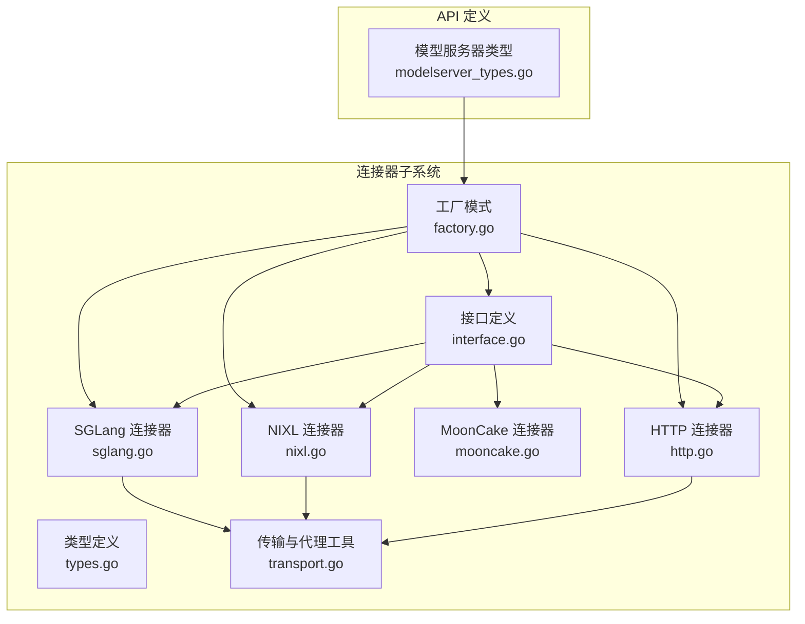
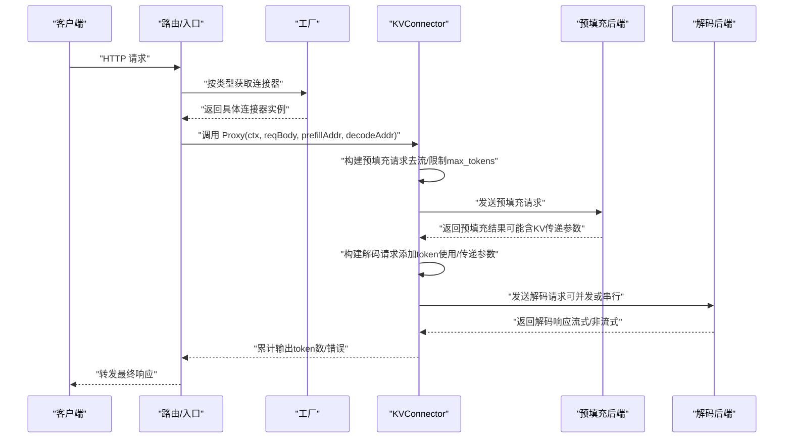
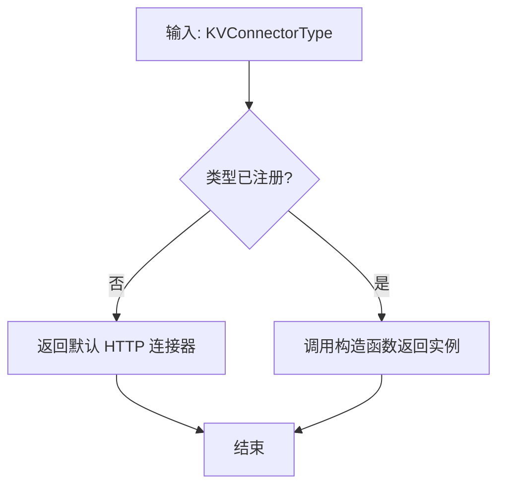
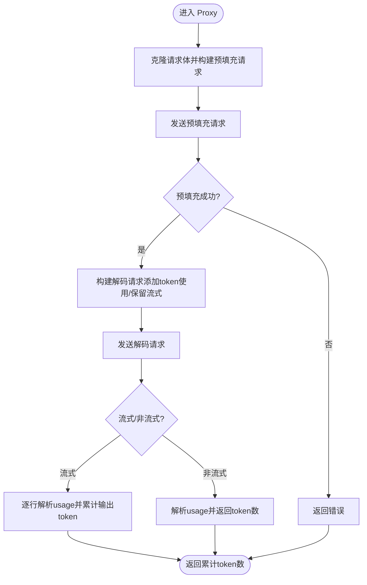
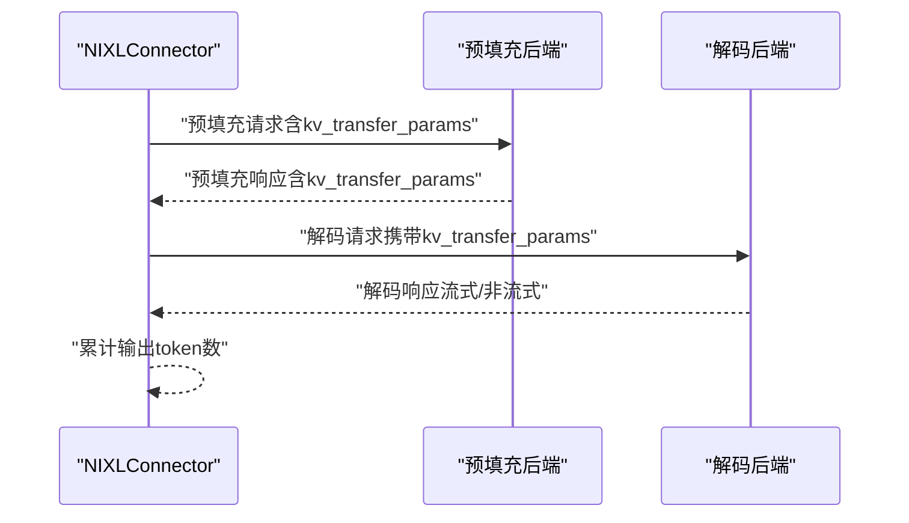
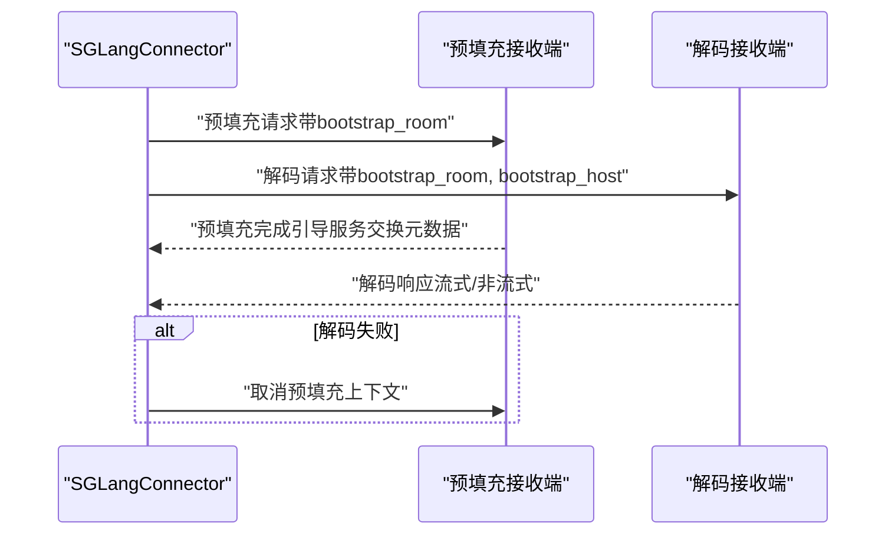
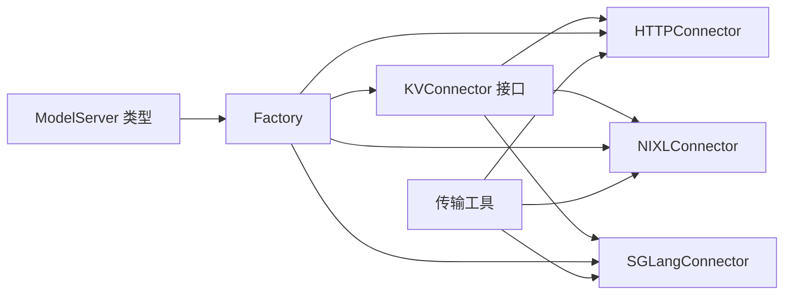

# 连接器接口抽象

<cite>
**本文引用的文件**
- [pkg/kthena-router/connectors/interface.go](file://pkg/kthena-router/connectors/interface.go)
- [pkg/kthena-router/connectors/types.go](file://pkg/kthena-router/connectors/types.go)
- [pkg/kthena-router/connectors/factory.go](file://pkg/kthena-router/connectors/factory.go)
- [pkg/kthena-router/connectors/http.go](file://pkg/kthena-router/connectors/http.go)
- [pkg/kthena-router/connectors/nixl.go](file://pkg/kthena-router/connectors/nixl.go)
- [pkg/kthena-router/connectors/mooncake.go](file://pkg/kthena-router/connectors/mooncake.go)
- [pkg/kthena-router/connectors/sglang.go](file://pkg/kthena-router/connectors/sglang.go)
- [pkg/kthena-router/connectors/transport.go](file://pkg/kthena-router/connectors/transport.go)
- [pkg/kthena-router/connectors/transport_test.go](file://pkg/kthena-router/connectors/transport_test.go)
- [pkg/kthena-router/connectors/connectors_test.go](file://pkg/kthena-router/connectors/connectors_test.go)
- [pkg/kthena-router/connectors/test_helpers.go](file://pkg/kthena-router/connectors/test_helpers.go)
- [pkg/apis/networking/v1alpha1/modelserver_types.go](file://pkg/apis/networking/v1alpha1/modelserver_types.go)
</cite>

## 目录
1. [简介](#简介)
2. [项目结构](#项目结构)
3. [核心组件](#核心组件)
4. [架构总览](#架构总览)
5. [详细组件分析](#详细组件分析)
6. [依赖关系分析](#依赖关系分析)
7. [性能考量](#性能考量)
8. [故障排查指南](#故障排查指南)
9. [结论](#结论)
10. [附录：最佳实践与扩展指南](#附录最佳实践与扩展指南)

## 简介
本文件围绕 KVConnector 接口及其配套实现，系统化阐述其设计理念、方法定义、生命周期管理、错误处理与超时控制策略，并给出扩展新连接器的最佳实践。KVConnector 的目标是为不同推理引擎（如 vLLM、SGLang 等）提供统一的 KV 缓存传递抽象，屏蔽底层差异，确保预填充（prefill）与解码（decode）阶段之间的状态一致性与高效协作。

## 项目结构
连接器相关代码集中在 kthena-router 的 connectors 子模块中，配合通用传输层工具与工厂模式完成注册与选择；API 类型定义位于 networking/v1alpha1，用于声明模型服务器与连接器配置。



**图表来源**
- [pkg/kthena-router/connectors/interface.go:23-31](file://pkg/kthena-router/connectors/interface.go#L23-L31)
- [pkg/kthena-router/connectors/types.go:19-27](file://pkg/kthena-router/connectors/types.go#L19-L27)
- [pkg/kthena-router/connectors/factory.go:21-59](file://pkg/kthena-router/connectors/factory.go#L21-L59)
- [pkg/kthena-router/connectors/http.go:28-119](file://pkg/kthena-router/connectors/http.go#L28-L119)
- [pkg/kthena-router/connectors/nixl.go:34-204](file://pkg/kthena-router/connectors/nixl.go#L34-L204)
- [pkg/kthena-router/connectors/mooncake.go:19-25](file://pkg/kthena-router/connectors/mooncake.go#L19-L25)
- [pkg/kthena-router/connectors/sglang.go:42-221](file://pkg/kthena-router/connectors/sglang.go#L42-L221)
- [pkg/kthena-router/connectors/transport.go:33-226](file://pkg/kthena-router/connectors/transport.go#L33-L226)
- [pkg/apis/networking/v1alpha1/modelserver_types.go:104-120](file://pkg/apis/networking/v1alpha1/modelserver_types.go#L104-L120)

**章节来源**
- [pkg/kthena-router/connectors/interface.go:23-31](file://pkg/kthena-router/connectors/interface.go#L23-L31)
- [pkg/kthena-router/connectors/factory.go:21-59](file://pkg/kthena-router/connectors/factory.go#L21-L59)
- [pkg/apis/networking/v1alpha1/modelserver_types.go:104-120](file://pkg/apis/networking/v1alpha1/modelserver_types.go#L104-L120)

## 核心组件
- KVConnector 接口：定义连接器名称与完整预填充-解码流程代理方法，屏蔽底层引擎差异。
- KVTransferParams：跨阶段 KV 缓存传递参数载体，承载远端执行标记与目标地址信息。
- 工厂模式：按类型注册与获取连接器实例，默认回退到 HTTP 连接器。
- 传输与代理工具：封装预填充与解码阶段的 HTTP 转发、流式与非流式响应处理、请求体预处理等。

**章节来源**
- [pkg/kthena-router/connectors/interface.go:23-31](file://pkg/kthena-router/connectors/interface.go#L23-L31)
- [pkg/kthena-router/connectors/types.go:19-27](file://pkg/kthena-router/connectors/types.go#L19-L27)
- [pkg/kthena-router/connectors/factory.go:21-59](file://pkg/kthena-router/connectors/factory.go#L21-L59)
- [pkg/kthena-router/connectors/transport.go:33-226](file://pkg/kthena-router/connectors/transport.go#L33-L226)

## 架构总览
KVConnector 将“请求预处理—预填充阶段—解码阶段—响应转发”串联为统一流程，不同连接器仅在预填充与解码阶段的具体行为上有所差异（如是否携带 KV 传递参数、是否并发启动等），但对外暴露一致的 Proxy 接口。



**图表来源**
- [pkg/kthena-router/connectors/factory.go:38-59](file://pkg/kthena-router/connectors/factory.go#L38-L59)
- [pkg/kthena-router/connectors/http.go:63-119](file://pkg/kthena-router/connectors/http.go#L63-L119)
- [pkg/kthena-router/connectors/nixl.go:53-112](file://pkg/kthena-router/connectors/nixl.go#L53-L112)
- [pkg/kthena-router/connectors/sglang.go:72-195](file://pkg/kthena-router/connectors/sglang.go#L72-L195)
- [pkg/kthena-router/connectors/transport.go:33-226](file://pkg/kthena-router/connectors/transport.go#L33-L226)

## 详细组件分析

### 接口与类型定义
- KVConnector 接口
  - Name(): 返回连接器类型名，便于日志与指标标识。
  - Proxy(c, reqBody, prefillAddr, decodeAddr): 执行完整预填充-解码流程，返回解码阶段输出 token 数与错误。
- KVTransferParams
  - 描述跨阶段 KV 传递的关键字段：是否走远端解码/预填充、远端引擎 ID、块 ID 列表、主机与端口等。

```mermaid
classDiagram
class KVConnector {
+Name() string
+Proxy(c, reqBody, prefillAddr, decodeAddr) (int, error)
}
class HTTPConnector {
-prefillRequest *http.Request
-decodeRequest *http.Request
+Name() string
+Proxy(...) (int, error)
}
class NIXLConnector {
-name string
-prefillRequest *http.Request
-decodeRequestBody map[string]interface{}
+Name() string
+Proxy(...) (int, error)
}
class SGLangConnector {
-prefillRequest *http.Request
-decodeRequest *http.Request
-bootstrapRoom int64
-lastPrefillAddr string
-lastDecodeAddr string
+Name() string
+Proxy(...) (int, error)
}
class Factory {
-connectors map[KVConnectorType]func() KVConnector
+RegisterConnector(...)
+GetConnector(type) KVConnector
}
class KVTransferParams {
+DoRemoteDecode bool
+DoRemotePrefill bool
+RemoteEngineID *string
+RemoteBlockIDs []string
+RemoteHost *string
+RemotePort *int
}
KVConnector <|.. HTTPConnector
KVConnector <|.. NIXLConnector
KVConnector <|.. SGLangConnector
Factory --> KVConnector : "创建/选择"
NIXLConnector --> KVTransferParams : "使用"
```

**图表来源**
- [pkg/kthena-router/connectors/interface.go:23-31](file://pkg/kthena-router/connectors/interface.go#L23-L31)
- [pkg/kthena-router/connectors/http.go:28-119](file://pkg/kthena-router/connectors/http.go#L28-L119)
- [pkg/kthena-router/connectors/nixl.go:34-204](file://pkg/kthena-router/connectors/nixl.go#L34-L204)
- [pkg/kthena-router/connectors/sglang.go:42-221](file://pkg/kthena-router/connectors/sglang.go#L42-L221)
- [pkg/kthena-router/connectors/factory.go:21-59](file://pkg/kthena-router/connectors/factory.go#L21-L59)
- [pkg/kthena-router/connectors/types.go:19-27](file://pkg/kthena-router/connectors/types.go#L19-L27)

**章节来源**
- [pkg/kthena-router/connectors/interface.go:23-31](file://pkg/kthena-router/connectors/interface.go#L23-L31)
- [pkg/kthena-router/connectors/types.go:19-27](file://pkg/kthena-router/connectors/types.go#L19-L27)

### 工厂模式与默认注册
- 工厂负责按类型注册与获取连接器实例，默认未命中时回退到 HTTP 连接器。
- 默认工厂注册了 HTTP、LMCache（复用 HTTP）、MoonCake（复用 NIXL 实现）、NIXL、SGLang（内部自动选择）等连接器。



**图表来源**
- [pkg/kthena-router/connectors/factory.go:38-59](file://pkg/kthena-router/connectors/factory.go#L38-L59)

**章节来源**
- [pkg/kthena-router/connectors/factory.go:21-59](file://pkg/kthena-router/connectors/factory.go#L21-L59)

### HTTP 连接器
- 设计定位：最简实现，适用于无需复杂 KV 传递的场景，或作为默认回退。
- 关键行为：
  - 预填充阶段：移除流式参数，限制 max_tokens/max_completion_tokens 为 1，避免实际生成。
  - 解码阶段：根据请求是否流式决定是否追加 token 使用统计；透传原始请求体其余字段。
  - 响应处理：支持流式与非流式，累计输出 token 数。



**图表来源**
- [pkg/kthena-router/connectors/http.go:63-119](file://pkg/kthena-router/connectors/http.go#L63-L119)
- [pkg/kthena-router/connectors/transport.go:80-226](file://pkg/kthena-router/connectors/transport.go#L80-L226)

**章节来源**
- [pkg/kthena-router/connectors/http.go:28-119](file://pkg/kthena-router/connectors/http.go#L28-L119)
- [pkg/kthena-router/connectors/transport.go:80-226](file://pkg/kthena-router/connectors/transport.go#L80-L226)

### NIXL 连接器
- 设计定位：高性能分布式内存 KV 缓存传递，基于 NIXL 协议。
- 关键行为：
  - 预填充阶段：设置 kv_transfer_params（指示远端解码、本地预填充），发送预填充请求并解析返回的 KV 传递参数。
  - 解码阶段：将 KV 传递参数注入解码请求体，发送解码请求并处理流式/非流式响应。
  - 与 HTTP 的差异：显式携带 KV 传递参数，预填充返回值用于后续解码。



**图表来源**
- [pkg/kthena-router/connectors/nixl.go:53-112](file://pkg/kthena-router/connectors/nixl.go#L53-L112)
- [pkg/kthena-router/connectors/transport.go:33-78](file://pkg/kthena-router/connectors/transport.go#L33-L78)

**章节来源**
- [pkg/kthena-router/connectors/nixl.go:34-204](file://pkg/kthena-router/connectors/nixl.go#L34-L204)
- [pkg/kthena-router/connectors/transport.go:33-78](file://pkg/kthena-router/connectors/transport.go#L33-L78)

### MoonCake 连接器
- 设计定位：与 NIXL 行为相似，当前通过组合 NIXLConnector 实现，名称与行为区分。
- 关键行为：复用 NIXL 的请求构建与 KV 传递逻辑。

**章节来源**
- [pkg/kthena-router/connectors/mooncake.go:19-25](file://pkg/kthena-router/connectors/mooncake.go#L19-L25)

### SGLang 连接器
- 设计定位：针对 SGLang 拆分式（prefill/decode）推理的专用连接器。
- 关键行为：
  - 预填充与解码必须同时发起，以保证解码端能连接预填充端的引导服务交换 ZMQ 元数据。
  - 通过 bootstrap_room 与 bootstrap_host 协调 KV 缓存传递。
  - 解码失败会取消预填充上下文，避免悬挂等待。



**图表来源**
- [pkg/kthena-router/connectors/sglang.go:72-195](file://pkg/kthena-router/connectors/sglang.go#L72-L195)

**章节来源**
- [pkg/kthena-router/connectors/sglang.go:42-221](file://pkg/kthena-router/connectors/sglang.go#L42-L221)

### 传输与代理工具
- prefillerProxy/decoderProxy：统一预填充与解码阶段的 HTTP 转发、状态码校验、响应头复制与内容写入。
- 请求体预处理：preparePrefillBody 移除流式参数并将 max_tokens/max_completion_tokens 设为 1。
- 请求构建：buildPrefillRequest/BuildDecodeRequest 分别面向预填充与解码阶段，注入必要参数。
- 响应处理：isStreamingResponse 判定流式类型；handleStreamingResponse/handleNonStreamingResponse 分别处理累计 token 与 usage 解析。

**章节来源**
- [pkg/kthena-router/connectors/transport.go:33-226](file://pkg/kthena-router/connectors/transport.go#L33-L226)

## 依赖关系分析
- 接口与实现：HTTP/NIXL/SGLang 均实现 KVConnector；工厂负责实例化与选择。
- 外部依赖：Gin 上下文用于流式写入与上下文键值存储；Kubernetes 日志库用于调试输出。
- API 类型：模型服务器类型定义了连接器类型枚举与默认值，驱动工厂注册与运行时选择。



**图表来源**
- [pkg/kthena-router/connectors/interface.go:23-31](file://pkg/kthena-router/connectors/interface.go#L23-L31)
- [pkg/kthena-router/connectors/factory.go:21-59](file://pkg/kthena-router/connectors/factory.go#L21-L59)
- [pkg/apis/networking/v1alpha1/modelserver_types.go:104-120](file://pkg/apis/networking/v1alpha1/modelserver_types.go#L104-L120)
- [pkg/kthena-router/connectors/transport.go:33-226](file://pkg/kthena-router/connectors/transport.go#L33-L226)

**章节来源**
- [pkg/kthena-router/connectors/factory.go:21-59](file://pkg/kthena-router/connectors/factory.go#L21-L59)
- [pkg/apis/networking/v1alpha1/modelserver_types.go:104-120](file://pkg/apis/networking/v1alpha1/modelserver_types.go#L104-L120)

## 性能考量
- 并发策略：SGLang 连接器采用并发启动预填充与解码，降低整体延迟；HTTP/NIXL 串行顺序执行。
- 流式处理：对 SSE/NDJSON 流式响应进行逐行解析与累计 token，避免一次性缓冲大响应体。
- 请求裁剪：预填充阶段强制 max_tokens/max_completion_tokens=1，减少计算与网络开销。
- 指标埋点：连接器在关键阶段记录上游请求数与状态码，便于观测与优化。

[本节为通用指导，不直接分析具体文件]

## 故障排查指南
- 常见错误来源
  - 预填充/解码 HTTP 调用失败：检查 prefillAddr/decodeAddr 可达性与协议（http/https）。
  - SGLang 引导失败：确认预填充与解码请求同时到达，且 bootstrap_room 一致、bootstrap_host 正确。
  - 流式响应解析异常：检查 Content-Type 是否为 text/event-stream 或 application/x-ndjson。
- 调试建议
  - 开启 klog 详细级别查看请求 URL 与状态码。
  - 在 Gin 上下文中检查 token usage 相关键值是否存在。
  - 使用测试用例思路构造最小复现，验证请求体预处理与响应解析路径。

**章节来源**
- [pkg/kthena-router/connectors/transport.go:33-226](file://pkg/kthena-router/connectors/transport.go#L33-L226)
- [pkg/kthena-router/connectors/sglang.go:72-195](file://pkg/kthena-router/connectors/sglang.go#L72-L195)
- [pkg/kthena-router/connectors/transport_test.go:1-649](file://pkg/kthena-router/connectors/transport_test.go#L1-L649)

## 结论
KVConnector 抽象通过统一的接口与工厂模式，将不同推理引擎的 KV 缓存传递差异收敛为一致的调用语义。HTTP 连接器提供默认兼容能力，NIXL 与 MoonCake 提供高性能 KV 传递，SGLang 适配拆分式推理的并发与引导协议。结合传输层工具与完善的测试覆盖，该抽象既满足工程可用性，也为扩展新连接器提供了清晰的边界与最佳实践。

[本节为总结性内容，不直接分析具体文件]

## 附录：最佳实践与扩展指南

### 生命周期管理
- 初始化：通过工厂注册连接器构造器，确保在应用启动时完成默认注册。
- 运行期：根据模型服务器配置选择连接器类型；若类型未知，回退至 HTTP 连接器。
- 清理：连接器自身不持有长连接池，遵循 Go http.Transport 的默认生命周期管理。

**章节来源**
- [pkg/kthena-router/connectors/factory.go:21-59](file://pkg/kthena-router/connectors/factory.go#L21-L59)

### 错误处理机制
- 统一错误包装：预填充/解码阶段的 HTTP 错误均被包装为带上下文的错误，便于定位。
- 上下文传播：通过 Gin 上下文传递 token usage 标记与指标记录器，避免全局状态。
- 失败快速返回：SGLang 在解码失败时主动取消预填充上下文，避免资源浪费。

**章节来源**
- [pkg/kthena-router/connectors/transport.go:33-78](file://pkg/kthena-router/connectors/transport.go#L33-L78)
- [pkg/kthena-router/connectors/sglang.go:144-195](file://pkg/kthena-router/connectors/sglang.go#L144-L195)

### 超时控制策略
- API 层面：模型服务器类型定义了请求超时与重试策略，连接器在 Proxy 中保持对上游请求的并发与状态管理，但不直接设置连接器内的超时。
- 建议：在部署侧为后端服务配置合理的连接/读写超时，避免阻塞；在路由层结合指标观察延迟分布，动态调整并发策略。

**章节来源**
- [pkg/apis/networking/v1alpha1/modelserver_types.go:122-142](file://pkg/apis/networking/v1alpha1/modelserver_types.go#L122-L142)

### 扩展新连接器步骤
- 实现 KVConnector 接口：至少实现 Name 与 Proxy 方法。
- 注册到工厂：在默认工厂中注册新类型与构造函数。
- 配置映射：在模型服务器类型中为新类型提供合法枚举值与默认值。
- 测试覆盖：参考现有测试用例，覆盖请求体预处理、响应解析、并发/错误分支等场景。

**章节来源**
- [pkg/kthena-router/connectors/interface.go:23-31](file://pkg/kthena-router/connectors/interface.go#L23-L31)
- [pkg/kthena-router/connectors/factory.go:21-59](file://pkg/kthena-router/connectors/factory.go#L21-L59)
- [pkg/apis/networking/v1alpha1/modelserver_types.go:104-120](file://pkg/apis/networking/v1alpha1/modelserver_types.go#L104-L120)
- [pkg/kthena-router/connectors/connectors_test.go:1-532](file://pkg/kthena-router/connectors/connectors_test.go#L1-L532)