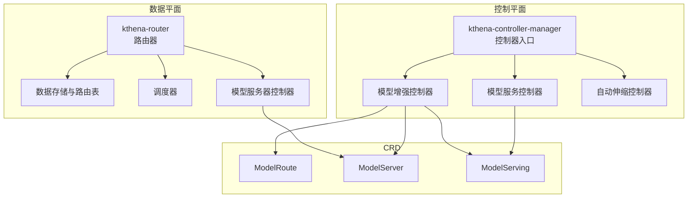
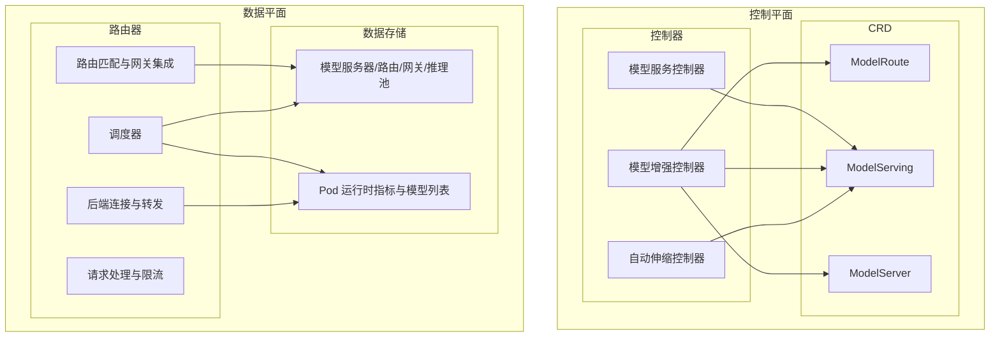
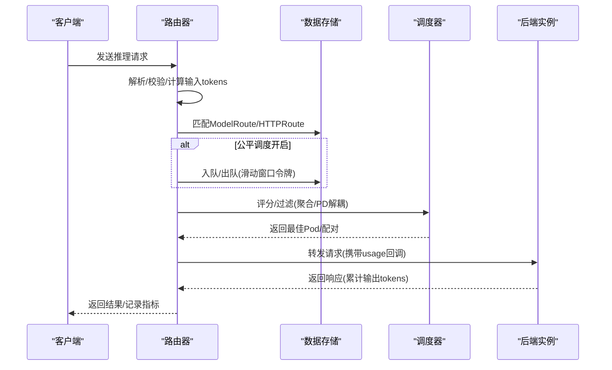
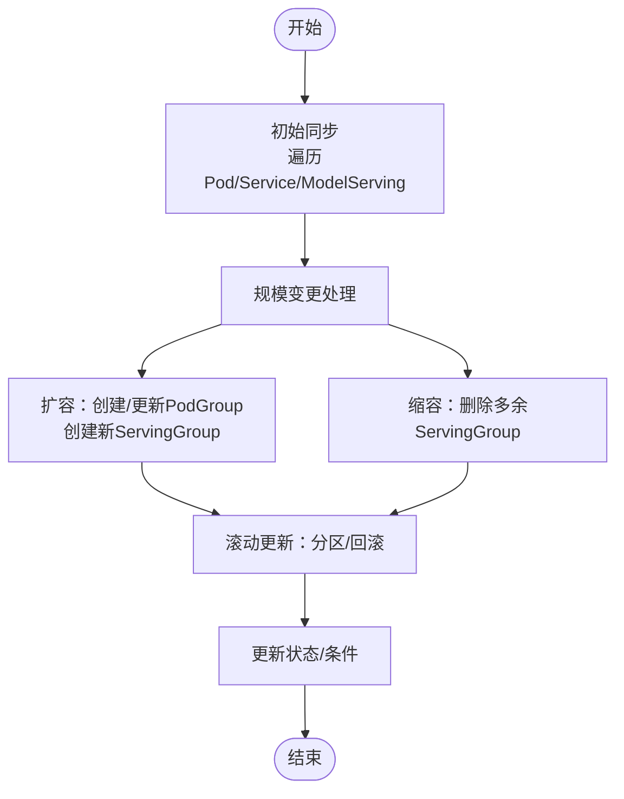
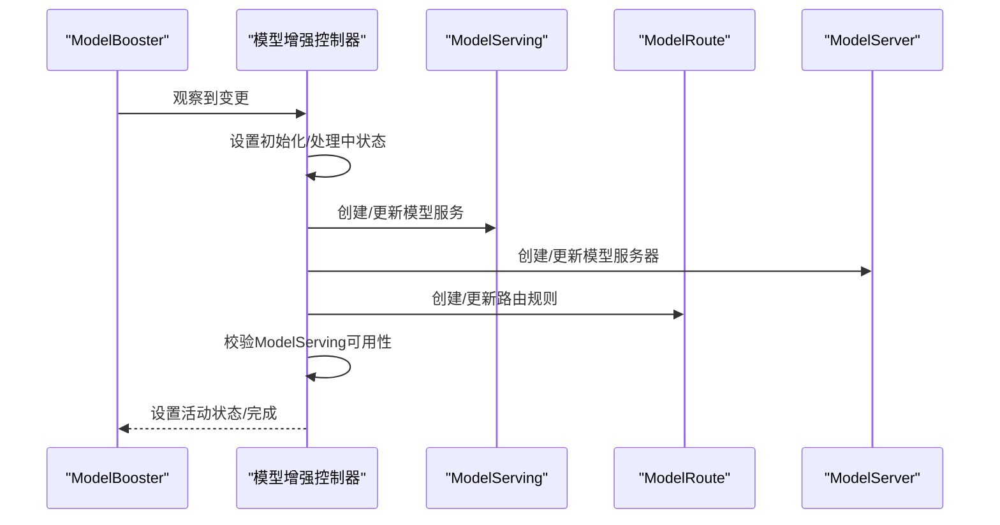
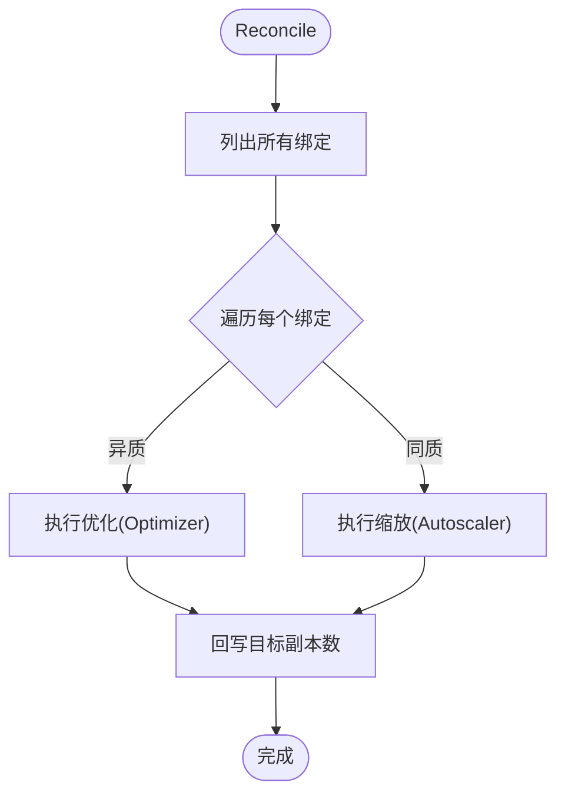
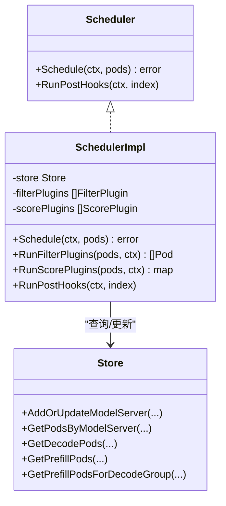
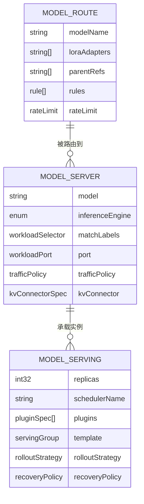
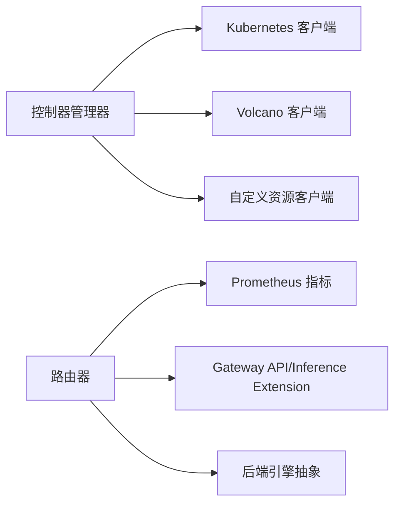

# 架构设计

<cite>
**本文引用的文件**
- [cmd/kthena-controller-manager/main.go](file://cmd/kthena-controller-manager/main.go)
- [pkg/controller/controller.go](file://pkg/controller/controller.go)
- [cmd/kthena-router/main.go](file://cmd/kthena-router/main.go)
- [pkg/kthena-router/router/router.go](file://pkg/kthena-router/router/router.go)
- [pkg/kthena-router/datastore/store.go](file://pkg/kthena-router/datastore/store.go)
- [pkg/kthena-router/scheduler/scheduler.go](file://pkg/kthena-router/scheduler/scheduler.go)
- [pkg/kthena-router/scheduler/scheduler_impl.go](file://pkg/kthena-router/scheduler/scheduler_impl.go)
- [pkg/kthena-router/controller/modelserver_controller.go](file://pkg/kthena-router/controller/modelserver_controller.go)
- [pkg/apis/networking/v1alpha1/modelroute_types.go](file://pkg/apis/networking/v1alpha1/modelroute_types.go)
- [pkg/apis/networking/v1alpha1/modelserver_types.go](file://pkg/apis/networking/v1alpha1/modelserver_types.go)
- [pkg/apis/workload/v1alpha1/model_serving_types.go](file://pkg/apis/workload/v1alpha1/model_serving_types.go)
- [pkg/model-serving-controller/controller/model_serving_controller.go](file://pkg/model-serving-controller/controller/model_serving_controller.go)
- [pkg/model-booster-controller/controller/model_booster_controller.go](file://pkg/model-booster-controller/controller/model_booster_controller.go)
- [pkg/autoscaler/controller/autoscale_controller.go](file://pkg/autoscaler/controller/autoscale_controller.go)
- [charts/kthena/values.yaml](file://charts/kthena/values.yaml)
</cite>

## 目录
1. [简介](#简介)
2. [项目结构](#项目结构)
3. [核心组件](#核心组件)
4. [架构总览](#架构总览)
5. [详细组件分析](#详细组件分析)
6. [依赖分析](#依赖分析)
7. [性能考量](#性能考量)
8. [故障排查指南](#故障排查指南)
9. [结论](#结论)
10. [附录](#附录)

## 简介
本架构设计文档面向 Kthena 平台，系统性阐述其“控制平面与数据平面分离”的设计理念与实现方式，解析控制平面（Kthena 控制器）与数据平面（Kthena 路由器）的职责边界、交互关系与数据流；深入剖析 Kthena-controller-manager 的控制器架构模式、Kthena-router 的路由与调度机制，以及各控制器（模型服务、模型增强、自动伸缩）的工作原理。同时，文档说明平台如何通过 CRD 扩展 Kubernetes API 来管理 LLM 推理工作负载，并给出架构图、组件交互图、性能与高可用特性、技术权衡与约束，帮助系统设计者与架构师快速理解并高效落地。

## 项目结构
Kthena 采用分层与功能域结合的组织方式：
- 控制平面：以 kthena-controller-manager 为核心，包含多个控制器（模型服务、模型增强、自动伸缩），负责基于 CRD 的声明式编排与运维。
- 数据平面：以 kthena-router 为核心，负责推理请求的接入、路由匹配、调度与转发。
- CRD 定义：位于 pkg/apis 下，分别覆盖 networking（模型路由/服务器）与 workload（模型服务等）两大领域。
- Helm Chart：位于 charts/kthena，统一打包部署控制平面与数据平面组件及其参数化配置。



**图表来源**
- [cmd/kthena-controller-manager/main.go:54-111](file://cmd/kthena-controller-manager/main.go#L54-L111)
- [pkg/controller/controller.go:52-141](file://pkg/controller/controller.go#L52-L141)
- [cmd/kthena-router/main.go:40-122](file://cmd/kthena-router/main.go#L40-L122)
- [pkg/kthena-router/router/router.go:91-169](file://pkg/kthena-router/router/router.go#L91-L169)
- [pkg/apis/networking/v1alpha1/modelroute_types.go:24-56](file://pkg/apis/networking/v1alpha1/modelroute_types.go#L24-L56)
- [pkg/apis/networking/v1alpha1/modelserver_types.go:23-50](file://pkg/apis/networking/v1alpha1/modelserver_types.go#L23-L50)
- [pkg/apis/workload/v1alpha1/model_serving_types.go:35-66](file://pkg/apis/workload/v1alpha1/model_serving_types.go#L35-L66)

**章节来源**
- [cmd/kthena-controller-manager/main.go:54-111](file://cmd/kthena-controller-manager/main.go#L54-L111)
- [pkg/controller/controller.go:52-141](file://pkg/controller/controller.go#L52-L141)
- [cmd/kthena-router/main.go:40-122](file://cmd/kthena-router/main.go#L40-L122)
- [pkg/kthena-router/router/router.go:91-169](file://pkg/kthena-router/router/router.go#L91-L169)
- [charts/kthena/values.yaml:1-97](file://charts/kthena/values.yaml#L1-L97)

## 核心组件
- 控制器入口与控制器编排
  - 控制器管理器入口负责解析参数、初始化客户端、启动控制器集合，并支持领导者选举与工作线程数配置。
  - 控制器编排模块按需启用模型服务、模型增强、自动伸缩控制器，统一注册事件处理器与工作队列。
- 路由器与调度
  - 路由器负责解析请求、速率限制、认证、公平调度、网关 API 匹配、后端选择与转发。
  - 调度器采用插件化框架，支持过滤与评分阶段，针对预填/解码（PD）解耦场景进行优化。
- 数据存储
  - 统一的数据存储负责维护模型服务器、Pod、路由规则、网关与推理池等资源状态，支持回调与滑动窗口令牌跟踪。
- CRD 与控制器
  - ModelRoute/ModelServer/ModelServing 等 CRD 定义了推理工作负载的声明式接口；对应控制器负责将声明转化为实际的集群资源与运行时行为。

**章节来源**
- [cmd/kthena-controller-manager/main.go:54-111](file://cmd/kthena-controller-manager/main.go#L54-L111)
- [pkg/controller/controller.go:52-141](file://pkg/controller/controller.go#L52-L141)
- [pkg/kthena-router/router/router.go:91-169](file://pkg/kthena-router/router/router.go#L91-L169)
- [pkg/kthena-router/scheduler/scheduler.go:25-28](file://pkg/kthena-router/scheduler/scheduler.go#L25-L28)
- [pkg/kthena-router/scheduler/scheduler_impl.go:59-99](file://pkg/kthena-router/scheduler/scheduler_impl.go#L59-L99)
- [pkg/kthena-router/datastore/store.go:161-240](file://pkg/kthena-router/datastore/store.go#L161-L240)
- [pkg/apis/networking/v1alpha1/modelroute_types.go:24-56](file://pkg/apis/networking/v1alpha1/modelroute_types.go#L24-L56)
- [pkg/apis/networking/v1alpha1/modelserver_types.go:23-50](file://pkg/apis/networking/v1alpha1/modelserver_types.go#L23-L50)
- [pkg/apis/workload/v1alpha1/model_serving_types.go:35-66](file://pkg/apis/workload/v1alpha1/model_serving_types.go#L35-L66)

## 架构总览
Kthena 将“控制”与“数据”严格分离：
- 控制平面：通过 CRD 声明推理工作负载与策略，控制器将其转换为实际的 Pod、Service、调度策略与扩缩容策略。
- 数据平面：接收外部请求，依据路由规则与调度策略选择后端实例，完成请求转发与可观测性记录。



**图表来源**
- [pkg/model-serving-controller/controller/model_serving_controller.go:104-247](file://pkg/model-serving-controller/controller/model_serving_controller.go#L104-L247)
- [pkg/model-booster-controller/controller/model_booster_controller.go:285-383](file://pkg/model-booster-controller/controller/model_booster_controller.go#L285-L383)
- [pkg/autoscaler/controller/autoscale_controller.go:64-96](file://pkg/autoscaler/controller/autoscale_controller.go#L64-L96)
- [pkg/kthena-router/router/router.go:204-315](file://pkg/kthena-router/router/router.go#L204-L315)
- [pkg/kthena-router/datastore/store.go:161-240](file://pkg/kthena-router/datastore/store.go#L161-L240)

## 详细组件分析

### 控制器管理器与控制器编排
- 启动流程
  - 解析命令行参数（kubeconfig、leader 选举、工作线程数、控制器白名单等）。
  - 初始化 Kubernetes 与自定义资源客户端，构建控制器集合。
  - 可选启动内置 Webhook 服务器（证书生成与更新）。
  - 启动控制器（模型服务、模型增强、自动伸缩），支持领导者选举保障单活。
- 控制器职责
  - 模型服务控制器：监听 ModelServing，管理 PodGroup、角色与滚动更新，维护状态。
  - 模型增强控制器：监听 ModelBooster，协调 ModelServing/ModelServer/ModelRoute/AutoscalingPolicyBinding 的创建与更新。
  - 自动伸缩控制器：周期性拉取绑定，计算推荐副本数并回写目标资源。

```mermaid
sequenceDiagram
participant CLI as "命令行"
participant CM as "控制器管理器"
participant CTRL as "控制器编排"
participant MSC as "模型服务控制器"
participant MBC as "模型增强控制器"
participant ASC as "自动伸缩控制器"
CLI->>CM : 解析参数/启动
CM->>CTRL : 初始化客户端/构建控制器
CM->>CTRL : 启动控制器集合
CTRL->>MSC : 启动模型服务控制器
CTRL->>MBC : 启动模型增强控制器
CTRL->>ASC : 启动自动伸缩控制器
Note over MSC,MBC,ASC : 支持领导者选举与多工作线程
```

**图表来源**
- [cmd/kthena-controller-manager/main.go:54-111](file://cmd/kthena-controller-manager/main.go#L54-L111)
- [pkg/controller/controller.go:52-141](file://pkg/controller/controller.go#L52-L141)

**章节来源**
- [cmd/kthena-controller-manager/main.go:54-111](file://cmd/kthena-controller-manager/main.go#L54-L111)
- [pkg/controller/controller.go:52-141](file://pkg/controller/controller.go#L52-L141)

### Kthena-router 路由与调度
- 请求处理链路
  - 解析与校验请求体，提取模型名与提示词，计算输入 token 数量并记录到访问日志与指标。
  - 应用统一速率限制（输入/输出/请求数），支持全局 Redis 限流。
  - 公平调度（可选）：基于滑动窗口令牌与权重计算优先级，入队等待，按 QPS 与并发上限出队。
  - 路由匹配：优先匹配 ModelRoute（含 LoRA 适配器），否则匹配 Gateway API 的 HTTPRoute 与 InferencePool。
  - 调度：在 PD 聚合模式下对解码/预填实例进行成对优选；在聚合模式下对候选实例评分排序。
  - 转发：根据目标端口与后端协议，将请求转发至最佳 Pod，并统计输出 token 与使用量。
- 关键模块
  - 路由器：封装 Gin 中间件、访问日志、指标、速率限制、认证与转发。
  - 数据存储：维护模型服务器、Pod、路由、网关与推理池映射，提供回调与令牌跟踪。
  - 调度器：插件化过滤与评分，支持 PD 解耦场景的预填/解码配对与前缀缓存优化。



**图表来源**
- [pkg/kthena-router/router/router.go:204-315](file://pkg/kthena-router/router/router.go#L204-L315)
- [pkg/kthena-router/datastore/store.go:443-468](file://pkg/kthena-router/datastore/store.go#L443-L468)
- [pkg/kthena-router/scheduler/scheduler_impl.go:101-165](file://pkg/kthena-router/scheduler/scheduler_impl.go#L101-L165)

**章节来源**
- [pkg/kthena-router/router/router.go:91-169](file://pkg/kthena-router/router/router.go#L91-L169)
- [pkg/kthena-router/router/router.go:204-315](file://pkg/kthena-router/router/router.go#L204-L315)
- [pkg/kthena-router/datastore/store.go:161-240](file://pkg/kthena-router/datastore/store.go#L161-L240)
- [pkg/kthena-router/scheduler/scheduler.go:25-28](file://pkg/kthena-router/scheduler/scheduler.go#L25-L28)
- [pkg/kthena-router/scheduler/scheduler_impl.go:59-99](file://pkg/kthena-router/scheduler/scheduler_impl.go#L59-L99)

### 模型服务控制器（ModelServing）
- 职责
  - 监听 ModelServing，管理 ServingGroup 与角色副本，维护 Headless Service，处理滚动更新与回滚。
  - 与 PodGroup（Volcano）集成，确保 Gang 调度语义与最小角色副本约束。
  - 通过工作队列与 Informer 机制实现幂等与低延迟的变更处理。
- 关键流程
  - 初始同步：遍历现有 Pod/Service/ModelServing，建立初始状态。
  - 规模变更：按期望副本数扩容/缩容，必要时重建或更新 PodGroup。
  - 滚动更新：支持按 ServingGroup 或 Role 级别分区更新，配合 ControllerRevision 保证一致性。



**图表来源**
- [pkg/model-serving-controller/controller/model_serving_controller.go:507-624](file://pkg/model-serving-controller/controller/model_serving_controller.go#L507-L624)
- [pkg/model-serving-controller/controller/model_serving_controller.go:626-794](file://pkg/model-serving-controller/controller/model_serving_controller.go#L626-L794)

**章节来源**
- [pkg/model-serving-controller/controller/model_serving_controller.go:104-247](file://pkg/model-serving-controller/controller/model_serving_controller.go#L104-L247)
- [pkg/model-serving-controller/controller/model_serving_controller.go:507-624](file://pkg/model-serving-controller/controller/model_serving_controller.go#L507-L624)
- [pkg/model-serving-controller/controller/model_serving_controller.go:626-794](file://pkg/model-serving-controller/controller/model_serving_controller.go#L626-L794)

### 模型增强控制器（ModelBooster）
- 职责
  - 将单一 ModelBooster 声明转换为一组 ModelServing/ModelServer/ModelRoute/AutoscalingPolicyBinding。
  - 监听相关资源变更，触发状态机推进，确保最终一致。
  - 提供 LoRA 适配器的生命周期管理与版本比较缓存。
- 关键流程
  - 创建/更新：设置初始化/处理中/活动等状态条件，逐步创建/更新各子资源。
  - 删除：监听删除事件，触发重建逻辑（由上层控制器接管）。



**图表来源**
- [pkg/model-booster-controller/controller/model_booster_controller.go:188-233](file://pkg/model-booster-controller/controller/model_booster_controller.go#L188-L233)
- [pkg/model-booster-controller/controller/model_booster_controller.go:235-255](file://pkg/model-booster-controller/controller/model_booster_controller.go#L235-L255)

**章节来源**
- [pkg/model-booster-controller/controller/model_booster_controller.go:188-233](file://pkg/model-booster-controller/controller/model_booster_controller.go#L188-L233)
- [pkg/model-booster-controller/controller/model_booster_controller.go:235-255](file://pkg/model-booster-controller/controller/model_booster_controller.go#L235-L255)

### 自动伸缩控制器（Autoscaler）
- 职责
  - 周期性拉取自动伸缩策略绑定，计算推荐副本数。
  - 支持同质目标（Homogeneous）与异质目标（Heterogeneous）两种模式。
  - 针对 ModelServing 或其角色进行回写更新。
- 关键流程
  - Reconcile：遍历绑定，区分优化与缩放路径，调用相应算法模块。
  - 更新：构造 Patch 请求，更新目标资源副本数。



**图表来源**
- [pkg/autoscaler/controller/autoscale_controller.go:124-171](file://pkg/autoscaler/controller/autoscale_controller.go#L124-L171)
- [pkg/autoscaler/controller/autoscale_controller.go:251-348](file://pkg/autoscaler/controller/autoscale_controller.go#L251-L348)

**章节来源**
- [pkg/autoscaler/controller/autoscale_controller.go:98-120](file://pkg/autoscaler/controller/autoscale_controller.go#L98-L120)
- [pkg/autoscaler/controller/autoscale_controller.go:124-171](file://pkg/autoscaler/controller/autoscale_controller.go#L124-L171)
- [pkg/autoscaler/controller/autoscale_controller.go:251-348](file://pkg/autoscaler/controller/autoscale_controller.go#L251-L348)

### 路由与调度插件化框架
- 插件注册与默认配置
  - 默认启用若干评分与过滤插件，支持通过配置文件覆盖。
  - 过滤阶段剔除不可用实例；评分阶段综合多维度指标加权打分。
- PD 解耦优化
  - 在存在 PDGroup 时，先从存储中直接获取解码实例，再为每个解码实例匹配同组预填实例，形成稳定的配对。
  - 评分后取前 N 个最优组合返回给上游。



**图表来源**
- [pkg/kthena-router/scheduler/scheduler.go:25-28](file://pkg/kthena-router/scheduler/scheduler.go#L25-L28)
- [pkg/kthena-router/scheduler/scheduler_impl.go:40-99](file://pkg/kthena-router/scheduler/scheduler_impl.go#L40-L99)
- [pkg/kthena-router/datastore/store.go:572-635](file://pkg/kthena-router/datastore/store.go#L572-L635)

**章节来源**
- [pkg/kthena-router/scheduler/scheduler.go:25-28](file://pkg/kthena-router/scheduler/scheduler.go#L25-L28)
- [pkg/kthena-router/scheduler/scheduler_impl.go:59-99](file://pkg/kthena-router/scheduler/scheduler_impl.go#L59-L99)
- [pkg/kthena-router/datastore/store.go:572-635](file://pkg/kthena-router/datastore/store.go#L572-L635)

### CRD 扩展与工作负载管理
- ModelRoute
  - 定义模型名称、LoRA 适配器、父级网关引用、路由规则与速率限制。
- ModelServer
  - 定义推理引擎类型、工作负载选择器、端口协议、流量策略与 KV 连接器。
- ModelServing
  - 定义副本数、调度器名称、插件链、模板、滚动策略与恢复策略。



**图表来源**
- [pkg/apis/networking/v1alpha1/modelroute_types.go:24-56](file://pkg/apis/networking/v1alpha1/modelroute_types.go#L24-L56)
- [pkg/apis/networking/v1alpha1/modelserver_types.go:23-50](file://pkg/apis/networking/v1alpha1/modelserver_types.go#L23-L50)
- [pkg/apis/workload/v1alpha1/model_serving_types.go:35-66](file://pkg/apis/workload/v1alpha1/model_serving_types.go#L35-L66)

**章节来源**
- [pkg/apis/networking/v1alpha1/modelroute_types.go:24-56](file://pkg/apis/networking/v1alpha1/modelroute_types.go#L24-L56)
- [pkg/apis/networking/v1alpha1/modelserver_types.go:23-50](file://pkg/apis/networking/v1alpha1/modelserver_types.go#L23-L50)
- [pkg/apis/workload/v1alpha1/model_serving_types.go:35-66](file://pkg/apis/workload/v1alpha1/model_serving_types.go#L35-L66)

## 依赖分析
- 控制平面依赖
  - Kubernetes 客户端与 Informer：用于监听 CRD 与原生资源。
  - Volcano 客户端：用于 PodGroup/Gang 调度。
  - 自定义资源客户端：用于 CRD 的读写。
- 数据平面依赖
  - Prometheus 指标库：用于收集与上报运行时指标。
  - Gateway API 与 Inference Extension：用于 HTTPRoute 与 InferencePool 的匹配与路由。
  - 后端引擎抽象：支持 vLLM/SGLang 等不同推理引擎的指标与模型列表获取。



**图表来源**
- [pkg/controller/controller.go:64-73](file://pkg/controller/controller.go#L64-L73)
- [pkg/kthena-router/datastore/store.go:135-149](file://pkg/kthena-router/datastore/store.go#L135-L149)

**章节来源**
- [pkg/controller/controller.go:64-73](file://pkg/controller/controller.go#L64-L73)
- [pkg/kthena-router/datastore/store.go:135-149](file://pkg/kthena-router/datastore/store.go#L135-L149)

## 性能考量
- 可扩展性
  - 控制器采用 Informer + 工作队列，具备良好的水平扩展能力；可通过增加工作线程数与启用领导者选举提升吞吐。
  - 路由器支持公平调度与滑动窗口令牌，避免热点用户/模型导致的拥塞。
- 高可用
  - 控制器管理器支持领导者选举，确保单活；Webhook 服务器支持证书自动轮换与 CA Bundle 更新。
  - 路由器支持 TLS 与健康检查端点，便于 Ingress/LB 层面的高可用部署。
- 性能特征
  - 调度器评分阶段仅对候选实例进行打分，TopN 返回减少后续转发成本。
  - PD 解耦场景下的预填/解码配对查询为 O(1)，降低查找开销。
- 技术权衡
  - 公平调度引入额外排队与令牌跟踪，适合多租户/高并发场景；关闭可降低延迟但牺牲公平性。
  - 全局速率限制依赖 Redis，需要考虑网络与一致性权衡。

[本节为通用指导，无需具体文件分析]

## 故障排查指南
- 控制器启动失败
  - 检查 kubeconfig/master 地址、QPS/Burst 参数是否合理。
  - 查看控制器日志，确认是否成功创建客户端与 Informer。
- 路由器无法转发
  - 检查 ModelRoute/ModelServer 是否正确匹配，Pod 是否处于 Ready 状态。
  - 查看访问日志中的错误字段（如模型匹配、Pod 发现、端口发现、代理失败）。
- 公平调度异常
  - 检查环境变量（窗口大小、权重、最大 QPS、并发）是否符合预期。
  - 查看等待队列长度与令牌跟踪状态。
- 自动伸缩不生效
  - 检查策略绑定是否存在、目标资源类型是否为 ModelServing/Role。
  - 查看控制器日志中的推荐副本数与回写错误。

**章节来源**
- [cmd/kthena-controller-manager/main.go:127-236](file://cmd/kthena-controller-manager/main.go#L127-L236)
- [pkg/kthena-router/router/router.go:204-315](file://pkg/kthena-router/router/router.go#L204-L315)
- [pkg/kthena-router/datastore/store.go:443-468](file://pkg/kthena-router/datastore/store.go#L443-L468)
- [pkg/autoscaler/controller/autoscale_controller.go:251-348](file://pkg/autoscaler/controller/autoscale_controller.go#L251-L348)

## 结论
Kthena 通过清晰的控制平面与数据平面分离，结合 CRD 扩展与控制器编排，实现了对 LLM 推理工作负载的声明式管理；借助路由器的路由匹配、速率限制与调度插件化框架，平台在多租户、高并发与复杂拓扑场景下具备良好的可扩展性与高可用性。通过 Helm Chart 参数化与 Webhook 证书管理，部署与运维体验得到显著提升。建议在生产环境中启用领导者选举、公平调度与全局速率限制，并结合监控与告警体系持续优化。

[本节为总结，无需具体文件分析]

## 附录
- Helm Chart 参数要点
  - 控制平面：镜像仓库/标签、Webhook 证书、启用/禁用等。
  - 数据平面：路由器镜像、端口、调试端口、TLS、Webhook、公平调度与 Gateway API 开关。
- 常用环境变量
  - 公平调度：窗口大小、输入/输出令牌权重、最大 QPS、并发上限、优先级刷新重试次数、重建阈值。
  - 访问日志：格式、输出位置、开关。
  - 速率限制：单位、输入/输出令牌配额、全局 Redis 地址。

**章节来源**
- [charts/kthena/values.yaml:1-97](file://charts/kthena/values.yaml#L1-L97)
- [pkg/kthena-router/datastore/store.go:70-111](file://pkg/kthena-router/datastore/store.go#L70-L111)
- [pkg/kthena-router/router/router.go:125-169](file://pkg/kthena-router/router/router.go#L125-L169)