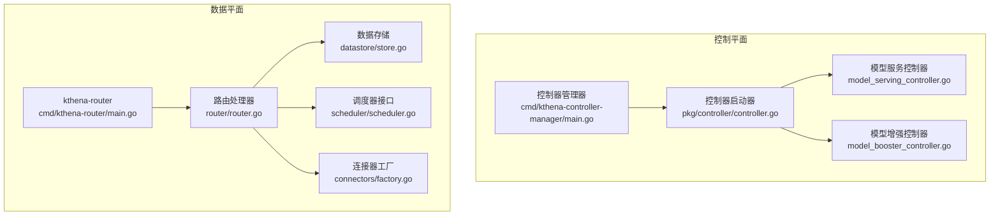
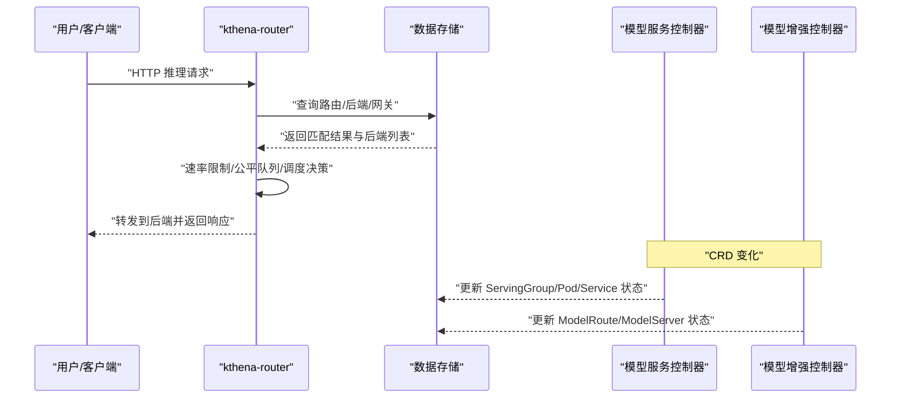
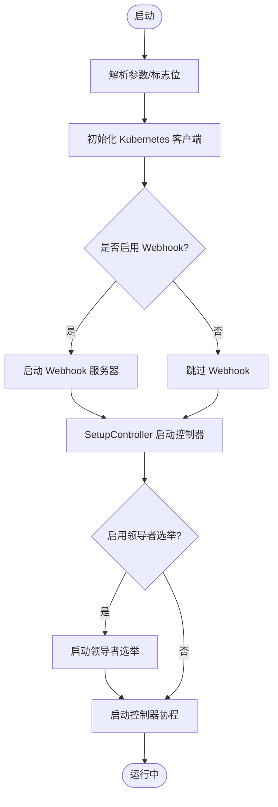
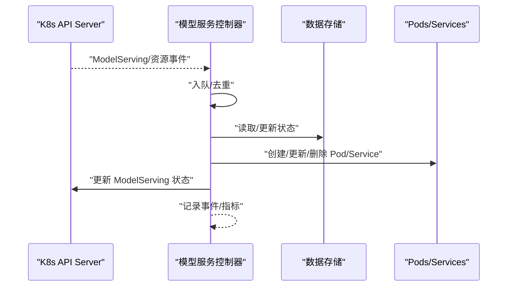
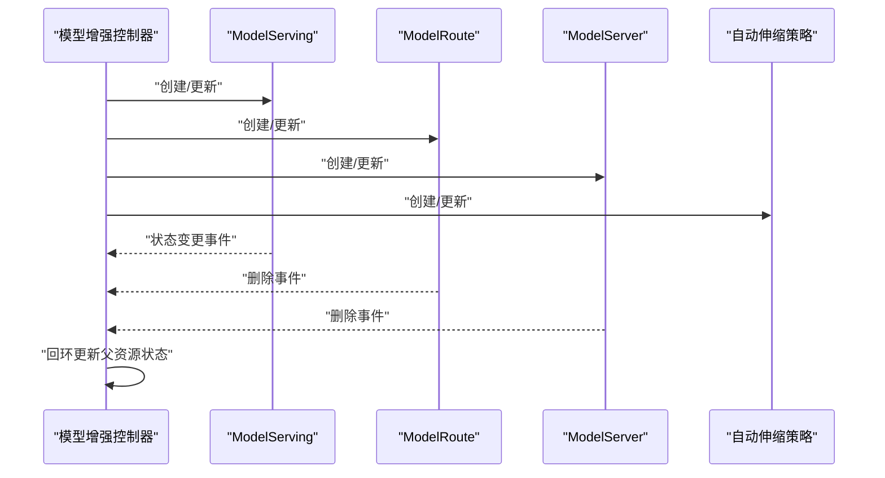
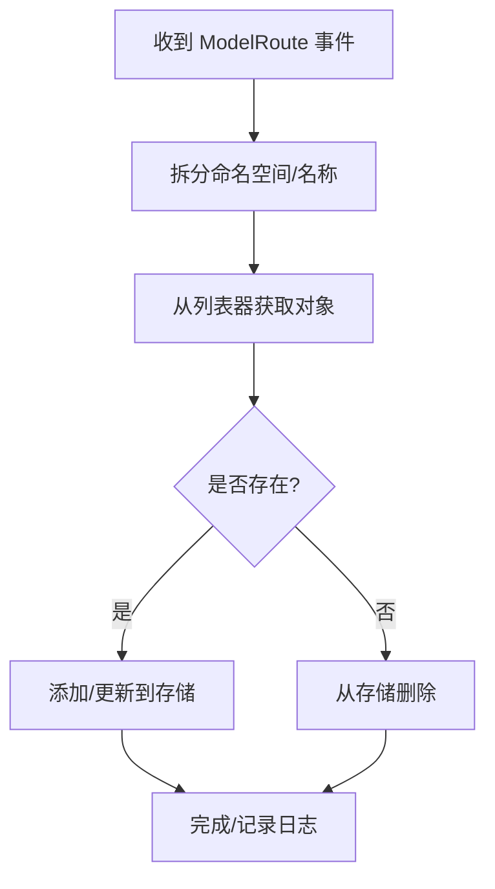
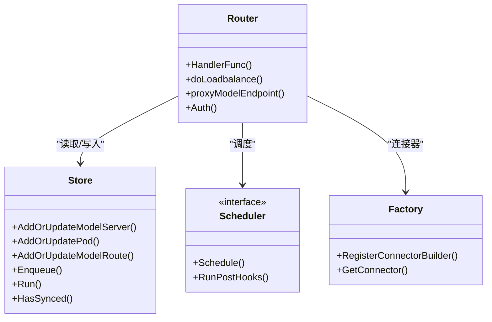
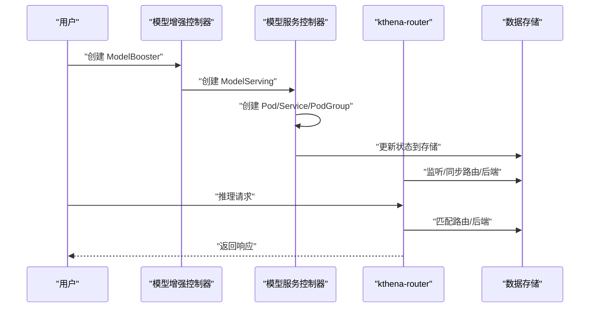
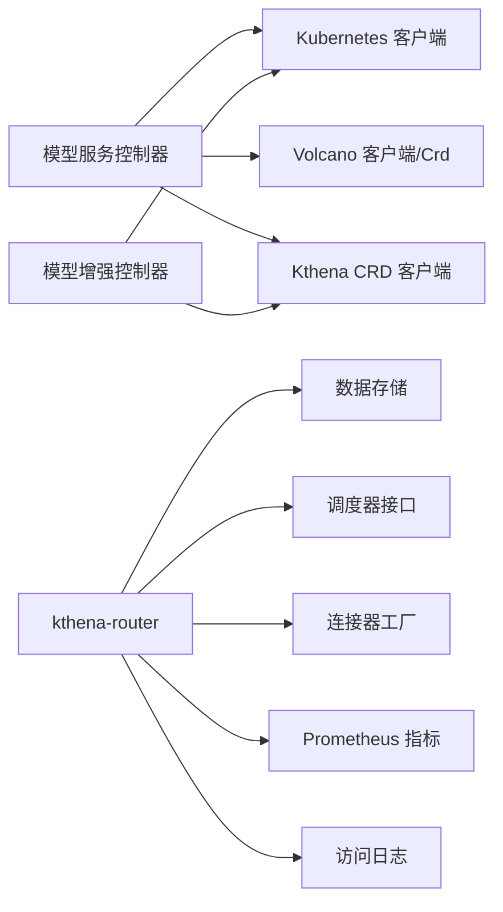

# 组件交互设计

<cite>
**本文引用的文件**
- [cmd/kthena-controller-manager/main.go](file://cmd/kthena-controller-manager/main.go)
- [pkg/controller/controller.go](file://pkg/controller/controller.go)
- [pkg/model-serving-controller/controller/model_serving_controller.go](file://pkg/model-serving-controller/controller/model_serving_controller.go)
- [pkg/model-booster-controller/controller/model_booster_controller.go](file://pkg/model-booster-controller/controller/model_booster_controller.go)
- [cmd/kthena-router/main.go](file://cmd/kthena-router/main.go)
- [pkg/kthena-router/controller/modelroute_controller.go](file://pkg/kthena-router/controller/modelroute_controller.go)
- [pkg/kthena-router/datastore/store.go](file://pkg/kthena-router/datastore/store.go)
- [pkg/kthena-router/router/router.go](file://pkg/kthena-router/router/router.go)
- [pkg/kthena-router/scheduler/scheduler.go](file://pkg/kthena-router/scheduler/scheduler.go)
- [pkg/kthena-router/connectors/factory.go](file://pkg/kthena-router/connectors/factory.go)
- [pkg/kthena-router/datastore/model_server.go](file://pkg/kthena-router/datastore/model_server.go)
- [pkg/kthena-router/metrics/metrics.go](file://pkg/kthena-router/metrics/metrics.go)
- [pkg/kthena-router/accesslog/logger.go](file://pkg/kthena-router/accesslog/logger.go)
- [pkg/apis/networking/v1alpha1/modelroute_types.go](file://pkg/apis/networking/v1alpha1/modelroute_types.go)
- [pkg/apis/workload/v1alpha1/model_serving_types.go](file://pkg/apis/workload/v1alpha1/model_serving_types.go)
</cite>

## 目录
1. [简介](#简介)
2. [项目结构](#项目结构)
3. [核心组件](#核心组件)
4. [架构总览](#架构总览)
5. [详细组件分析](#详细组件分析)
6. [依赖关系分析](#依赖关系分析)
7. [性能考量](#性能考量)
8. [故障排查指南](#故障排查指南)
9. [结论](#结论)
10. [附录](#附录)

## 简介
本文件面向系统架构师与高级工程师，系统化阐述 Kthena 在控制平面与数据平面之间的交互设计。重点包括：
- 控制平面：控制器管理器（controller-manager）与路由控制器（kthena-router）如何通过 CRD 变化驱动状态变更与资源编排。
- 数据平面：路由层如何基于控制平面提供的路由与后端信息进行请求调度、速率限制、公平队列与可观测性。
- 协同机制：从 CRD 创建到推理实例上线的全生命周期，组件间的消息传递、事件驱动与异步处理策略。
- 错误传播、重试与故障隔离：控制器与路由层在异常场景下的容错与恢复。

## 项目结构
Kthena 由两大部分组成：
- 控制平面：控制器管理器负责运行多个控制器（模型服务控制器、模型增强控制器、自动伸缩控制器），监听 CRD 变化并编排工作负载。
- 数据平面：kthena-router 提供统一入口，解析请求、匹配路由、调度到后端 Pod，并提供速率限制、公平队列与访问日志等能力。

图表来源
- [cmd/kthena-controller-manager/main.go:54-111](file://cmd/kthena-controller-manager/main.go#L54-L111)
- [pkg/controller/controller.go:52-141](file://pkg/controller/controller.go#L52-L141)
- [cmd/kthena-router/main.go:121-122](file://cmd/kthena-router/main.go#L121-L122)
- [pkg/kthena-router/router/router.go:91-169](file://pkg/kthena-router/router/router.go#L91-L169)

章节来源
- [cmd/kthena-controller-manager/main.go:54-111](file://cmd/kthena-controller-manager/main.go#L54-L111)
- [pkg/controller/controller.go:52-141](file://pkg/controller/controller.go#L52-L141)
- [cmd/kthena-router/main.go:121-122](file://cmd/kthena-router/main.go#L121-L122)

## 核心组件
- 控制器管理器：解析参数、初始化客户端、启动 Webhook、选择性启用控制器并进入主循环。
- 模型服务控制器：监听 ModelServing 及其子资源变化，维护 ServingGroup、角色副本、滚动更新、Pod/Service/PodGroup 状态同步。
- 模型增强控制器：监听 ModelBooster，协调 ModelServing、ModelServer、ModelRoute、自动伸缩策略的创建与更新。
- kthena-router：监听 ModelRoute、Pod、Gateway/HTTPRoute/InferencePool 等，构建内存数据视图，执行请求解析、速率限制、公平队列与调度，代理到后端。
- 调度器与连接器：调度器根据上下文选择最佳 Pod；连接器工厂按类型选择 HTTP/KV 连接器实现。

章节来源
- [pkg/model-serving-controller/controller/model_serving_controller.go:104-247](file://pkg/model-serving-controller/controller/model_serving_controller.go#L104-L247)
- [pkg/model-booster-controller/controller/model_booster_controller.go:285-383](file://pkg/model-booster-controller/controller/model_booster_controller.go#L285-L383)
- [pkg/kthena-router/controller/modelroute_controller.go:46-85](file://pkg/kthena-router/controller/modelroute_controller.go#L46-L85)
- [pkg/kthena-router/router/router.go:91-169](file://pkg/kthena-router/router/router.go#L91-L169)

## 架构总览
控制平面与数据平面通过 CRD 与 Kubernetes API 形成闭环：
- 控制平面：CRD 变化触发控制器事件，控制器更新工作负载与状态，同时更新数据平面的数据存储。
- 数据平面：数据存储承载路由、后端、网关与队列等状态，路由层据此进行请求调度与限流。

图表来源
- [pkg/kthena-router/router/router.go:204-315](file://pkg/kthena-router/router/router.go#L204-L315)
- [pkg/kthena-router/datastore/store.go:754-800](file://pkg/kthena-router/datastore/store.go#L754-L800)
- [pkg/model-serving-controller/controller/model_serving_controller.go:531-572](file://pkg/model-serving-controller/controller/model_serving_controller.go#L531-L572)
- [pkg/model-booster-controller/controller/model_booster_controller.go:190-233](file://pkg/model-booster-controller/controller/model_booster_controller.go#L190-L233)

## 详细组件分析

### 控制器管理器与控制器启动
- 启动流程：解析命令行参数，初始化客户端与 Webhook；根据配置启用控制器集合；可选启用领导者选举；启动各控制器协程。
- Webhook：独立进程，负责校验与注入，证书自动生成与更新。
- 领导者选举：使用 Lease 资源，确保同一时间仅一个控制器实例处于领导者状态。

图表来源
- [cmd/kthena-controller-manager/main.go:54-111](file://cmd/kthena-controller-manager/main.go#L54-L111)
- [pkg/controller/controller.go:52-141](file://pkg/controller/controller.go#L52-L141)

章节来源
- [cmd/kthena-controller-manager/main.go:54-111](file://cmd/kthena-controller-manager/main.go#L54-L111)
- [pkg/controller/controller.go:143-192](file://pkg/controller/controller.go#L143-L192)

### 模型服务控制器（数据平面编排）
- 事件监听：对 Pod/Service/ModelServing/PodGroup 进行事件监听，过滤出属于该控制器的资源。
- 关键职责：
  - 副本管理：根据期望副本数与当前 ServingGroup 数量进行扩容/缩容。
  - 角色管理：根据模板生成或更新角色副本，支持分区更新。
  - 滚动更新：基于 ControllerRevision 与分区策略进行受控升级。
  - Headless Service：为每个 ServingGroup 维护无头服务。
  - 状态更新：汇总并上报 ModelServing 的条件与状态。
- 工作队列：统一处理事件，带指数退避与最大重试次数。

图表来源
- [pkg/model-serving-controller/controller/model_serving_controller.go:196-247](file://pkg/model-serving-controller/controller/model_serving_controller.go#L196-L247)
- [pkg/model-serving-controller/controller/model_serving_controller.go:531-572](file://pkg/model-serving-controller/controller/model_serving_controller.go#L531-L572)

章节来源
- [pkg/model-serving-controller/controller/model_serving_controller.go:104-247](file://pkg/model-serving-controller/controller/model_serving_controller.go#L104-L247)
- [pkg/model-serving-controller/controller/model_serving_controller.go:574-624](file://pkg/model-serving-controller/controller/model_serving_controller.go#L574-L624)

### 模型增强控制器（跨资源编排）
- 事件监听：ModelBooster、ModelServing、ModelServer、ModelRoute、自动伸缩策略及其绑定。
- 编排流程：当 ModelBooster 发生变更时，协调创建/更新对应的 ModelServing、ModelServer、ModelRoute 与自动伸缩策略；当子资源状态变化时触发回环更新以推进父资源状态。
- 条件管理：设置初始化、处理中、失败、活跃等条件，用于对外展示健康状态。

图表来源
- [pkg/model-booster-controller/controller/model_booster_controller.go:190-233](file://pkg/model-booster-controller/controller/model_booster_controller.go#L190-L233)
- [pkg/model-booster-controller/controller/model_booster_controller.go:410-474](file://pkg/model-booster-controller/controller/model_booster_controller.go#L410-L474)

章节来源
- [pkg/model-booster-controller/controller/model_booster_controller.go:285-383](file://pkg/model-booster-controller/controller/model_booster_controller.go#L285-L383)

### 路由控制器（数据平面路由）
- 事件监听：ModelRoute，监听新增/更新/删除事件，入队处理。
- 处理逻辑：从列表器获取对象，写入数据存储；删除时清理对应路由信息；初始同步完成后标记已就绪。
- 重试机制：工作队列带指数退避与最大重试次数，避免瞬时错误导致的无限重试。

图表来源
- [pkg/kthena-router/controller/modelroute_controller.go:130-151](file://pkg/kthena-router/controller/modelroute_controller.go#L130-L151)

章节来源
- [pkg/kthena-router/controller/modelroute_controller.go:46-85](file://pkg/kthena-router/controller/modelroute_controller.go#L46-L85)
- [pkg/kthena-router/controller/modelroute_controller.go:118-128](file://pkg/kthena-router/controller/modelroute_controller.go#L118-L128)

### 数据平面：路由与调度
- 数据存储：
  - 维护 ModelServer、Pod、ModelRoute、Gateway/HTTPRoute/InferencePool 等映射。
  - 支持 PDGroup 分类（预填充/解码），便于高效调度。
  - 公平队列与令牌跟踪，支持按用户/模型维度统计与限流。
- 路由处理器：
  - 解析请求体，提取模型名与提示词，计算输入令牌数。
  - 应用速率限制（本地/全局 Redis）。
  - 公平队列：按用户与令牌权重计算优先级，超时与重建阈值可配置。
  - 调度：根据上下文选择最佳 Pod；支持 PD 解耦模式通过 KV 连接器代理。
  - 访问日志：结构化输出，包含路由、后端、令牌与耗时等字段。
  - 指标：Prometheus 指标覆盖请求总量、时延、令牌、活跃请求数、队列长度与优先级刷新等。

图表来源
- [pkg/kthena-router/datastore/store.go:162-240](file://pkg/kthena-router/datastore/store.go#L162-L240)
- [pkg/kthena-router/router/router.go:91-169](file://pkg/kthena-router/router/router.go#L91-L169)
- [pkg/kthena-router/scheduler/scheduler.go:25-28](file://pkg/kthena-router/scheduler/scheduler.go#L25-L28)
- [pkg/kthena-router/connectors/factory.go:33-59](file://pkg/kthena-router/connectors/factory.go#L33-L59)

章节来源
- [pkg/kthena-router/datastore/store.go:316-430](file://pkg/kthena-router/datastore/store.go#L316-L430)
- [pkg/kthena-router/router/router.go:204-315](file://pkg/kthena-router/router/router.go#L204-L315)
- [pkg/kthena-router/metrics/metrics.go:54-85](file://pkg/kthena-router/metrics/metrics.go#L54-L85)
- [pkg/kthena-router/accesslog/logger.go:69-98](file://pkg/kthena-router/accesslog/logger.go#L69-L98)

### CRD 与模型部署生命周期
- CRD 定义：ModelRoute 描述模型路由规则、匹配条件、目标模型与速率限制；ModelServing 定义推理实例模板、滚动更新策略与插件链。
- 生命周期流程：
  - 用户创建 ModelBooster → 控制器创建 ModelServing/ModelServer/ModelRoute/自动伸缩策略。
  - 控制器管理器启动模型服务控制器 → 监听并编排 Pod/Service/PodGroup → 更新状态。
  - 路由控制器监听 ModelRoute → 写入数据存储 → 路由层匹配后端 → 公平队列/限流 → 调度 → 代理到后端。
  - 网关 API（Gateway/HTTPRoute/InferencePool）可作为路由扩展，路由层支持匹配与路径改写。

图表来源
- [pkg/apis/networking/v1alpha1/modelroute_types.go:24-56](file://pkg/apis/networking/v1alpha1/modelroute_types.go#L24-L56)
- [pkg/apis/workload/v1alpha1/model_serving_types.go:35-66](file://pkg/apis/workload/v1alpha1/model_serving_types.go#L35-L66)
- [pkg/model-serving-controller/controller/model_serving_controller.go:531-572](file://pkg/model-serving-controller/controller/model_serving_controller.go#L531-L572)
- [pkg/kthena-router/router/router.go:317-464](file://pkg/kthena-router/router/router.go#L317-L464)

章节来源
- [pkg/apis/networking/v1alpha1/modelroute_types.go:172-194](file://pkg/apis/networking/v1alpha1/modelroute_types.go#L172-L194)
- [pkg/apis/workload/v1alpha1/model_serving_types.go:240-262](file://pkg/apis/workload/v1alpha1/model_serving_types.go#L240-L262)

## 依赖关系分析
- 控制平面依赖：
  - Kubernetes 客户端与 Informer，用于监听 CRD 与原生资源。
  - Volcano 客户端与 CRD（PodGroup），用于批处理与调度。
  - 自定义客户端（client-go），用于访问 Kthena CRD。
- 数据平面依赖：
  - 数据存储（并发安全 Map/原子布尔）承载路由、后端、网关与队列状态。
  - 调度器接口与连接器工厂，支持扩展不同调度策略与后端协议。
  - Prometheus 指标与访问日志模块，提供可观测性。

图表来源
- [pkg/model-serving-controller/controller/model_serving_controller.go:104-125](file://pkg/model-serving-controller/controller/model_serving_controller.go#L104-L125)
- [pkg/model-booster-controller/controller/model_booster_controller.go:285-307](file://pkg/model-booster-controller/controller/model_booster_controller.go#L285-L307)
- [pkg/kthena-router/router/router.go:91-169](file://pkg/kthena-router/router/router.go#L91-L169)
- [pkg/kthena-router/metrics/metrics.go:87-223](file://pkg/kthena-router/metrics/metrics.go#L87-223)
- [pkg/kthena-router/accesslog/logger.go:69-98](file://pkg/kthena-router/accesslog/logger.go#L69-L98)

章节来源
- [pkg/kthena-router/datastore/store.go:280-342](file://pkg/kthena-router/datastore/store.go#L280-L342)

## 性能考量
- 控制器侧：
  - Informer 缓存与索引（按组名/角色 ID）减少遍历成本。
  - 工作队列指数退避与最大重试，避免风暴。
  - 领导者选举保障单实例运行，避免重复工作。
- 路由侧：
  - 公平队列与令牌跟踪，支持按用户/模型维度限流与优先级调度。
  - PDGroup 分类加速预填充/解码阶段的配对与调度。
  - 指标与访问日志可配置输出格式与目标，平衡可观测性与开销。

## 故障排查指南
- 控制器异常：
  - 查看控制器日志与事件，确认工作队列是否堆积；检查重试次数与错误类型。
  - 若启用领导者选举，确认是否丢失领导者。
- 路由异常：
  - 检查访问日志错误字段，定位解析、匹配、调度或代理阶段的问题。
  - 核对速率限制配置与全局 Redis 设置。
  - 检查公平队列长度与超时配置，评估是否需要调整权重或阈值。
- CRD 不生效：
  - 确认 CRD 是否安装、版本是否兼容。
  - 检查控制器是否启用对应 CRD 对应的控制器。

章节来源
- [pkg/kthena-router/accesslog/logger.go:100-136](file://pkg/kthena-router/accesslog/logger.go#L100-L136)
- [pkg/kthena-router/router/router.go:266-292](file://pkg/kthena-router/router/router.go#L266-L292)
- [pkg/kthena-router/datastore/store.go:410-430](file://pkg/kthena-router/datastore/store.go#L410-L430)

## 结论
Kthena 通过清晰的控制平面与数据平面分离，实现了从 CRD 到推理实例上线的全链路自动化。控制平面负责资源编排与状态收敛，数据平面负责请求接入、路由与调度。两者通过 CRD 与内部数据存储协同，配合工作队列、领导者选举、公平队列与指标体系，形成高可用、可观测且可扩展的推理平台。

## 附录
- 关键环境变量与配置项：
  - 公平队列：FAIRNESS_MAX_CONCURRENT、FAIRNESS_MAX_QPS、FAIRNESS_QUEUE_TIMEOUT、FAIRNESS_PRIORITY_TOKEN_WEIGHT、FAIRNESS_PRIORITY_REQUEST_NUM_WEIGHT。
  - 访问日志：ACCESS_LOG_ENABLED、ACCESS_LOG_FORMAT、ACCESS_LOG_OUTPUT。
  - 速率限制：全局 Redis 配置（如需）。
- 命令行参数参考：
  - 控制器管理器：kubeconfig、master、workers、controllers、leader-elect、kube-api-qps/burst、webhook 相关。
  - kthena-router：port、tls-cert/tls-key、enable-webhook、enable-gateway-api、enable-gateway-api-inference-extension、webhook-port、debug-port、kube-api-qps/burst。

章节来源
- [pkg/kthena-router/datastore/store.go:351-404](file://pkg/kthena-router/datastore/store.go#L351-L404)
- [pkg/kthena-router/accesslog/logger.go:138-208](file://pkg/kthena-router/accesslog/logger.go#L138-L208)
- [cmd/kthena-controller-manager/main.go:69-85](file://cmd/kthena-controller-manager/main.go#L69-L85)
- [cmd/kthena-router/main.go:67-81](file://cmd/kthena-router/main.go#L67-L81)