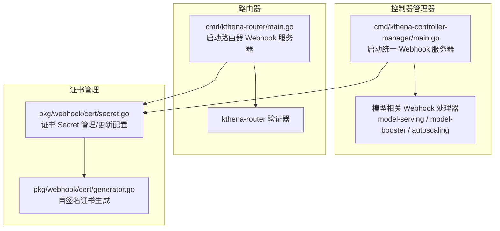
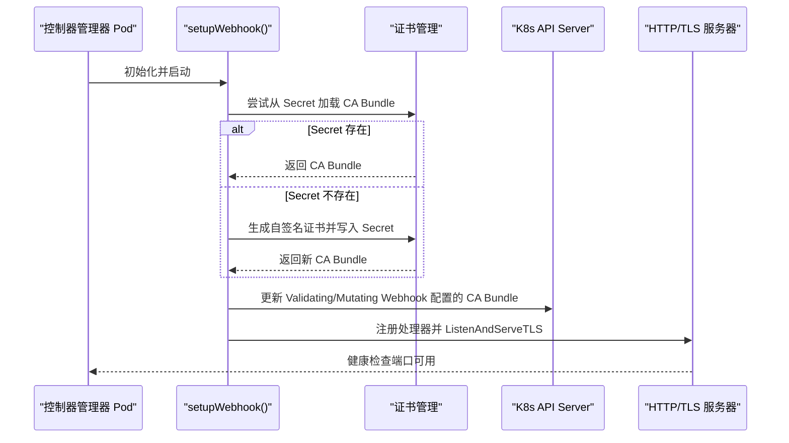
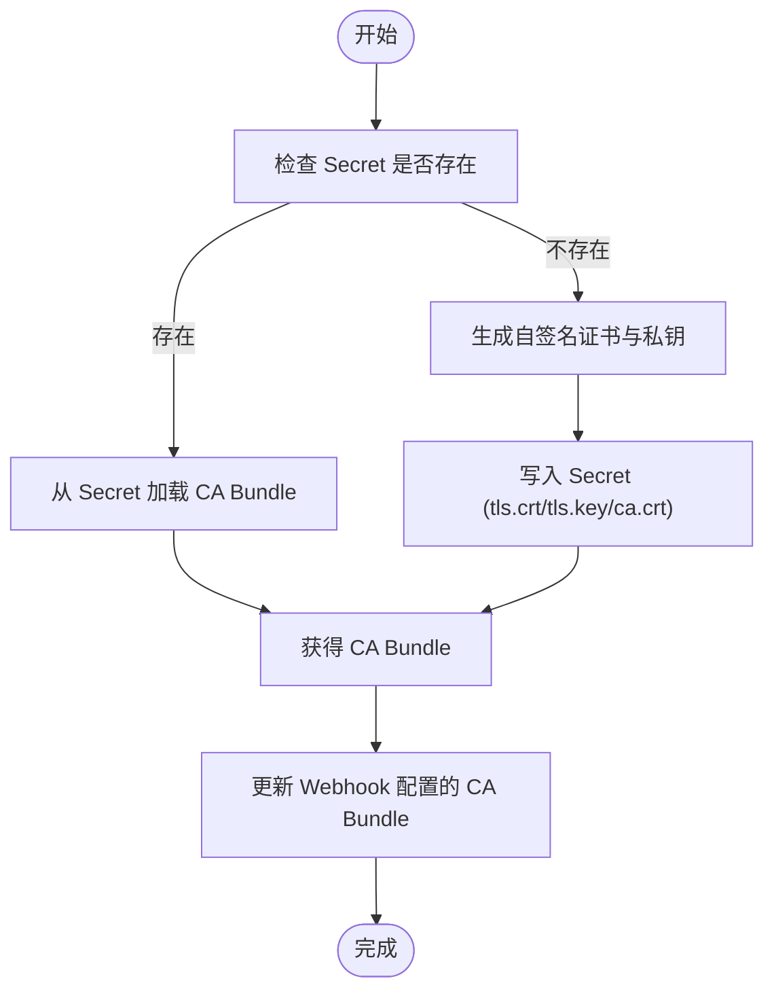
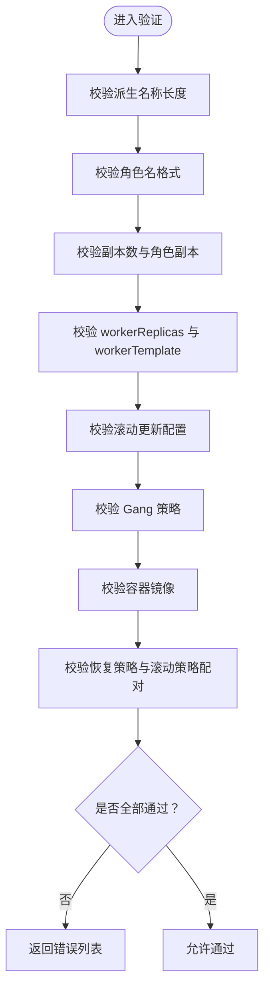
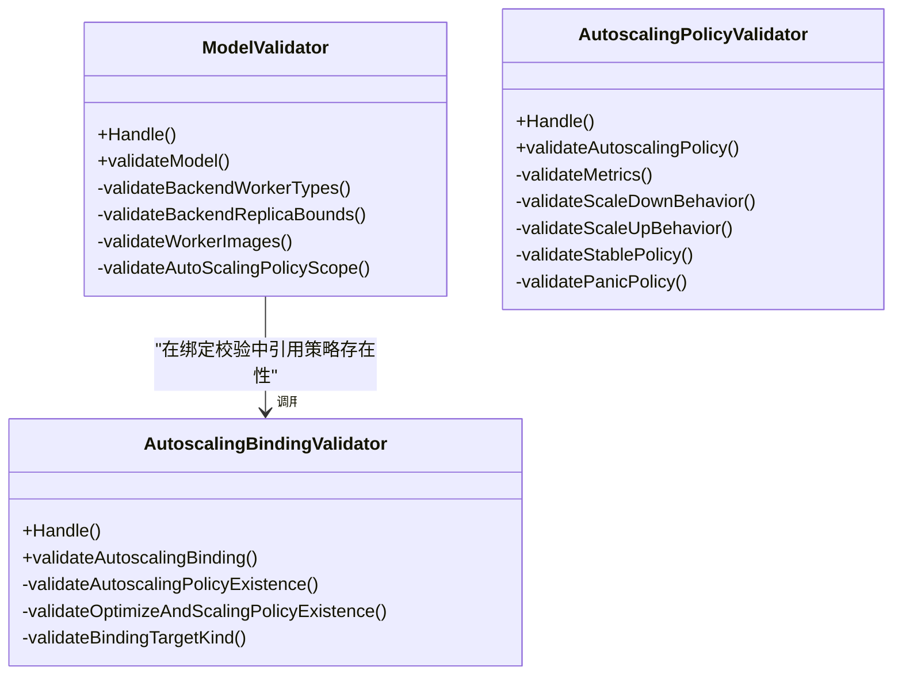
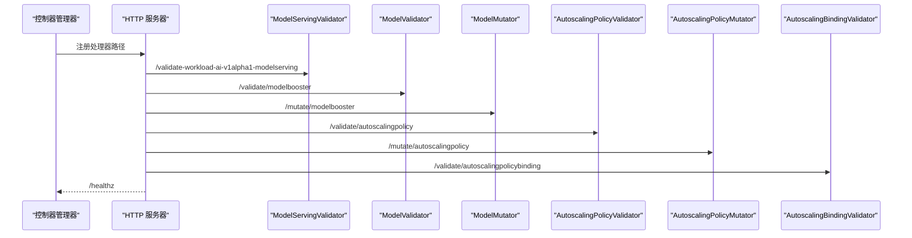
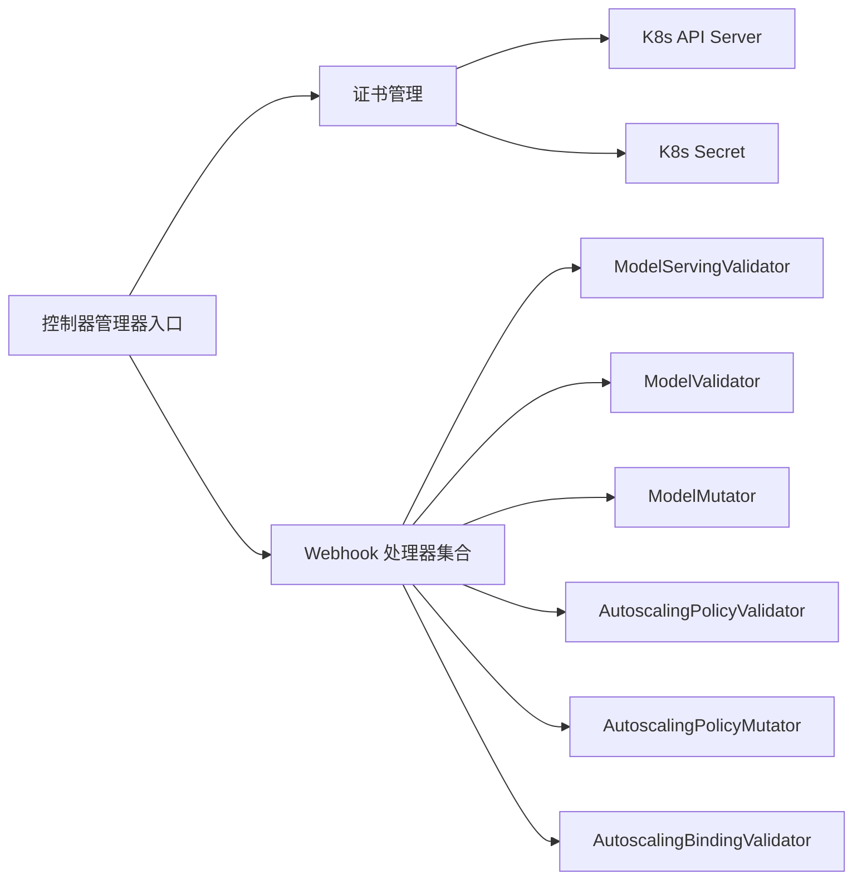

# Webhook 系统

<cite>
**本文引用的文件**
- [cmd/kthena-controller-manager/main.go](file://cmd/kthena-controller-manager/main.go)
- [cmd/kthena-router/main.go](file://cmd/kthena-router/main.go)
- [pkg/webhook/cert/generator.go](file://pkg/webhook/cert/generator.go)
- [pkg/webhook/cert/secret.go](file://pkg/webhook/cert/secret.go)
- [pkg/model-serving-controller/webhook/validator.go](file://pkg/model-serving-controller/webhook/validator.go)
- [pkg/model-serving-controller/webhook/validator_test.go](file://pkg/model-serving-controller/webhook/validator_test.go)
- [pkg/model-booster-controller/webhook/model_validator.go](file://pkg/model-booster-controller/webhook/model_validator.go)
- [pkg/model-booster-controller/webhook/autoscaling_binding_validator.go](file://pkg/model-booster-controller/webhook/autoscaling_binding_validator.go)
- [pkg/model-booster-controller/webhook/autoscalingpolicy_validator.go](file://pkg/model-booster-controller/webhook/autoscalingpolicy_validator.go)
</cite>

## 目录
1. [简介](#简介)
2. [项目结构](#项目结构)
3. [核心组件](#核心组件)
4. [架构总览](#架构总览)
5. [详细组件分析](#详细组件分析)
6. [依赖分析](#依赖分析)
7. [性能考量](#性能考量)
8. [故障排查指南](#故障排查指南)
9. [结论](#结论)
10. [附录](#附录)

## 简介
本文件系统性梳理 Kthena 平台的 Webhook 系统，覆盖以下关键主题：
- 在 Kubernetes 中的 Webhook 类型与职责：验证型 Webhook（Validating）与变更型 Webhook（Mutating）的区别与典型场景。
- 证书管理（Certificate Management）：自动生成、轮换与分发机制，确保 Webhook 服务器与 API Server 之间的 TLS 通信安全。
- 模型服务 Webhook 验证器（ModelServingValidator）：对模型服务资源的字段校验、引用完整性检查与一致性规则。
- 模型增强 Webhook：对自动扩缩容策略、绑定关系等进行验证，保障资源间引用正确性与策略合法性。
- 安全、性能与故障排查建议，以及可操作的配置示例与调试技巧。

## 项目结构
Kthena 的 Webhook 系统由两部分组成：
- 控制器管理器内置的统一 Webhook 服务器：负责处理模型相关资源的验证与变更请求。
- 路由器内置的 Webhook 服务器：负责路由相关资源的验证。

两者均通过相同的证书管理流程，确保在集群内以 TLS 方式与 API Server 交互。

图表来源
- [cmd/kthena-controller-manager/main.go:127-236](file://cmd/kthena-controller-manager/main.go#L127-L236)
- [cmd/kthena-router/main.go:135-195](file://cmd/kthena-router/main.go#L135-L195)
- [pkg/webhook/cert/generator.go:50-140](file://pkg/webhook/cert/generator.go#L50-L140)
- [pkg/webhook/cert/secret.go:39-107](file://pkg/webhook/cert/secret.go#L39-L107)

章节来源
- [cmd/kthena-controller-manager/main.go:127-236](file://cmd/kthena-controller-manager/main.go#L127-L236)
- [cmd/kthena-router/main.go:135-195](file://cmd/kthena-router/main.go#L135-L195)
- [pkg/webhook/cert/generator.go:50-140](file://pkg/webhook/cert/generator.go#L50-L140)
- [pkg/webhook/cert/secret.go:39-107](file://pkg/webhook/cert/secret.go#L39-L107)

## 核心组件
- 统一 Webhook 服务器（控制器管理器）
  - 负责注册多个处理器路径，分别处理模型服务、模型增强、自动扩缩容策略与绑定关系的验证/变更。
  - 提供健康检查端点，支持 TLS 启动。
- 路由器 Webhook 服务器
  - 为路由相关资源提供验证能力，同样具备证书管理与健康检查。
- 证书管理模块
  - 支持从 Secret 加载现有证书；若不存在则自签发并写入 Secret；并在必要时更新 Validating/Mutating Webhook 配置中的 CA Bundle。

章节来源
- [cmd/kthena-controller-manager/main.go:186-201](file://cmd/kthena-controller-manager/main.go#L186-L201)
- [cmd/kthena-router/main.go:185-194](file://cmd/kthena-router/main.go#L185-L194)
- [pkg/webhook/cert/secret.go:109-181](file://pkg/webhook/cert/secret.go#L109-L181)

## 架构总览
下图展示 Webhook 服务器启动、证书准备与处理器注册的关键流程：

图表来源
- [cmd/kthena-controller-manager/main.go:153-184](file://cmd/kthena-controller-manager/main.go#L153-L184)
- [pkg/webhook/cert/secret.go:109-144](file://pkg/webhook/cert/secret.go#L109-L144)
- [pkg/webhook/cert/secret.go:146-181](file://pkg/webhook/cert/secret.go#L146-L181)

## 详细组件分析

### 证书管理（Certificate Management）
- 自动证书生成
  - 若未从 Secret 获取到 CA Bundle，则根据服务 DNS 名称生成自签名证书与私钥，并写入 Secret。
  - 生成的证书包含 CA 证书、服务证书与私钥，满足 TLS 握手需求。
- 证书加载与复用
  - 优先从指定命名空间的 Secret 读取证书；若存在则直接复用，避免重复生成。
- CA Bundle 分发
  - 当成功获取或生成 CA Bundle 后，尝试更新集群中 Validating 与 Mutating Webhook 配置的 CA Bundle 字段，确保 API Server 可信任该 Webhook 服务器。
- 证书轮换与更新
  - 代码未显式实现定期轮换逻辑；当前行为是首次缺失时生成并写入 Secret，后续复用。如需轮换，可删除对应 Secret 以触发重新生成。

图表来源
- [pkg/webhook/cert/secret.go:39-107](file://pkg/webhook/cert/secret.go#L39-L107)
- [pkg/webhook/cert/generator.go:50-140](file://pkg/webhook/cert/generator.go#L50-L140)
- [pkg/webhook/cert/secret.go:109-181](file://pkg/webhook/cert/secret.go#L109-L181)

章节来源
- [pkg/webhook/cert/secret.go:39-107](file://pkg/webhook/cert/secret.go#L39-L107)
- [pkg/webhook/cert/generator.go:50-140](file://pkg/webhook/cert/generator.go#L50-L140)
- [pkg/webhook/cert/secret.go:109-181](file://pkg/webhook/cert/secret.go#L109-L181)

### 模型服务 Webhook 验证器（ModelServingValidator）
- 职责
  - 对模型服务资源进行准入校验，拒绝不合法的配置，保证后续控制器能稳定执行。
- 关键校验点
  - 自动生成名称长度校验：基于资源名、副本数、角色名、角色副本与工作副本组合生成的派生名称必须符合 DNS-1035 规范。
  - 角色名格式校验：角色名必须符合 DNS-1035 标签格式。
  - 副本数与角色副本校验：replicas 与各角色 replicas 必须为非负整数；至少需要一个角色。
  - Worker 副本与模板关联：当 workerReplicas > 0 时，必须提供 workerTemplate。
  - 滚动更新配置校验：maxUnavailable 与 partition 必须为有效整数或百分比，且 maxUnavailable 不能为 0；分区值允许为 0 或百分比，但不得超过总副本。
  - Gang 策略校验：minRoleReplicas 的键必须存在于角色列表，且其值不得大于对应角色的副本数，同时必须非负。
  - 工作容器镜像校验：容器镜像字符串必须满足基本格式要求（非空、不含空格等）。
  - 恢复策略与滚动策略配对校验：在默认生效策略下，不允许出现不兼容的组合。
- 错误聚合
  - 所有校验错误会汇总为多行消息返回，便于用户一次性定位问题。

图表来源
- [pkg/model-serving-controller/webhook/validator.go:82-102](file://pkg/model-serving-controller/webhook/validator.go#L82-L102)
- [pkg/model-serving-controller/webhook/validator.go:104-121](file://pkg/model-serving-controller/webhook/validator.go#L104-L121)
- [pkg/model-serving-controller/webhook/validator.go:123-137](file://pkg/model-serving-controller/webhook/validator.go#L123-L137)
- [pkg/model-serving-controller/webhook/validator.go:169-198](file://pkg/model-serving-controller/webhook/validator.go#L169-L198)
- [pkg/model-serving-controller/webhook/validator.go:260-281](file://pkg/model-serving-controller/webhook/validator.go#L260-L281)
- [pkg/model-serving-controller/webhook/validator.go:283-308](file://pkg/model-serving-controller/webhook/validator.go#L283-L308)
- [pkg/model-serving-controller/webhook/validator.go:200-258](file://pkg/model-serving-controller/webhook/validator.go#L200-L258)
- [pkg/model-serving-controller/webhook/validator.go:318-370](file://pkg/model-serving-controller/webhook/validator.go#L318-L370)
- [pkg/model-serving-controller/webhook/validator.go:372-419](file://pkg/model-serving-controller/webhook/validator.go#L372-L419)

章节来源
- [pkg/model-serving-controller/webhook/validator.go:82-102](file://pkg/model-serving-controller/webhook/validator.go#L82-L102)
- [pkg/model-serving-controller/webhook/validator.go:104-121](file://pkg/model-serving-controller/webhook/validator.go#L104-L121)
- [pkg/model-serving-controller/webhook/validator.go:123-137](file://pkg/model-serving-controller/webhook/validator.go#L123-L137)
- [pkg/model-serving-controller/webhook/validator.go:169-198](file://pkg/model-serving-controller/webhook/validator.go#L169-L198)
- [pkg/model-serving-controller/webhook/validator.go:200-258](file://pkg/model-serving-controller/webhook/validator.go#L200-L258)
- [pkg/model-serving-controller/webhook/validator.go:260-281](file://pkg/model-serving-controller/webhook/validator.go#L260-L281)
- [pkg/model-serving-controller/webhook/validator.go:283-308](file://pkg/model-serving-controller/webhook/validator.go#L283-L308)
- [pkg/model-serving-controller/webhook/validator.go:318-370](file://pkg/model-serving-controller/webhook/validator.go#L318-L370)
- [pkg/model-serving-controller/webhook/validator.go:372-419](file://pkg/model-serving-controller/webhook/validator.go#L372-L419)

### 模型增强 Webhook（模型 Booster）
- 模型资源验证（ModelValidator）
  - 后端类型与工作副本数量约束：特定后端类型要求固定数量的工作副本，且类型必须匹配。
  - 后端最小/最大副本边界校验：最小副本不得大于最大副本；最大副本总数受限。
  - 容器镜像格式校验：镜像字符串必须满足基本格式要求。
  - 自动扩缩容策略作用域校验：若未设置模型级策略，则最小/最大副本必须相等且大于 0；若设置了策略，则最小副本需非负。
- 自动扩缩容策略验证（AutoscalingPolicyValidator）
  - 指标目标值必须大于 0 且有限；指标名不可重复。
  - 稳定期与稳定窗口时间范围限制（0~30 分钟）。
  - Panic 模式持续时间范围限制（0~30 分钟）。
- 自动扩缩容绑定关系验证（AutoscalingBindingValidator）
  - 策略存在性校验：绑定引用的策略必须存在。
  - 目标类型校验：异构/同构目标二选一，且同构目标的 Kind 必须为 ModelServing，子目标 Kind 必须为 Role。
  - 同构目标名称与子目标名称必填校验。

图表来源
- [pkg/model-booster-controller/webhook/model_validator.go:76-94](file://pkg/model-booster-controller/webhook/model_validator.go#L76-L94)
- [pkg/model-booster-controller/webhook/model_validator.go:96-151](file://pkg/model-booster-controller/webhook/model_validator.go#L96-L151)
- [pkg/model-booster-controller/webhook/model_validator.go:153-174](file://pkg/model-booster-controller/webhook/model_validator.go#L153-L174)
- [pkg/model-booster-controller/webhook/model_validator.go:176-191](file://pkg/model-booster-controller/webhook/model_validator.go#L176-L191)
- [pkg/model-booster-controller/webhook/model_validator.go:217-243](file://pkg/model-booster-controller/webhook/model_validator.go#L217-L243)
- [pkg/model-booster-controller/webhook/autoscalingpolicy_validator.go:84-105](file://pkg/model-booster-controller/webhook/autoscalingpolicy_validator.go#L84-L105)
- [pkg/model-booster-controller/webhook/autoscalingpolicy_validator.go:107-136](file://pkg/model-booster-controller/webhook/autoscalingpolicy_validator.go#L107-L136)
- [pkg/model-booster-controller/webhook/autoscalingpolicy_validator.go:138-178](file://pkg/model-booster-controller/webhook/autoscalingpolicy_validator.go#L138-L178)
- [pkg/model-booster-controller/webhook/autoscalingpolicy_validator.go:180-206](file://pkg/model-booster-controller/webhook/autoscalingpolicy_validator.go#L180-L206)
- [pkg/model-booster-controller/webhook/autoscalingpolicy_validator.go:208-233](file://pkg/model-booster-controller/webhook/autoscalingpolicy_validator.go#L208-L233)
- [pkg/model-booster-controller/webhook/autoscaling_binding_validator.go:86-104](file://pkg/model-booster-controller/webhook/autoscaling_binding_validator.go#L86-L104)
- [pkg/model-booster-controller/webhook/autoscaling_binding_validator.go:106-118](file://pkg/model-booster-controller/webhook/autoscaling_binding_validator.go#L106-L118)
- [pkg/model-booster-controller/webhook/autoscaling_binding_validator.go:120-129](file://pkg/model-booster-controller/webhook/autoscaling_binding_validator.go#L120-L129)
- [pkg/model-booster-controller/webhook/autoscaling_binding_validator.go:131-165](file://pkg/model-booster-controller/webhook/autoscaling_binding_validator.go#L131-L165)

章节来源
- [pkg/model-booster-controller/webhook/model_validator.go:76-94](file://pkg/model-booster-controller/webhook/model_validator.go#L76-L94)
- [pkg/model-booster-controller/webhook/model_validator.go:96-151](file://pkg/model-booster-controller/webhook/model_validator.go#L96-L151)
- [pkg/model-booster-controller/webhook/model_validator.go:153-174](file://pkg/model-booster-controller/webhook/model_validator.go#L153-L174)
- [pkg/model-booster-controller/webhook/model_validator.go:176-191](file://pkg/model-booster-controller/webhook/model_validator.go#L176-L191)
- [pkg/model-booster-controller/webhook/model_validator.go:217-243](file://pkg/model-booster-controller/webhook/model_validator.go#L217-L243)
- [pkg/model-booster-controller/webhook/autoscalingpolicy_validator.go:84-105](file://pkg/model-booster-controller/webhook/autoscalingpolicy_validator.go#L84-L105)
- [pkg/model-booster-controller/webhook/autoscalingpolicy_validator.go:107-136](file://pkg/model-booster-controller/webhook/autoscalingpolicy_validator.go#L107-L136)
- [pkg/model-booster-controller/webhook/autoscalingpolicy_validator.go:138-178](file://pkg/model-booster-controller/webhook/autoscalingpolicy_validator.go#L138-L178)
- [pkg/model-booster-controller/webhook/autoscalingpolicy_validator.go:180-206](file://pkg/model-booster-controller/webhook/autoscalingpolicy_validator.go#L180-L206)
- [pkg/model-booster-controller/webhook/autoscalingpolicy_validator.go:208-233](file://pkg/model-booster-controller/webhook/autoscalingpolicy_validator.go#L208-L233)
- [pkg/model-booster-controller/webhook/autoscaling_binding_validator.go:86-104](file://pkg/model-booster-controller/webhook/autoscaling_binding_validator.go#L86-L104)
- [pkg/model-booster-controller/webhook/autoscaling_binding_validator.go:106-118](file://pkg/model-booster-controller/webhook/autoscaling_binding_validator.go#L106-L118)
- [pkg/model-booster-controller/webhook/autoscaling_binding_validator.go:120-129](file://pkg/model-booster-controller/webhook/autoscaling_binding_validator.go#L120-L129)
- [pkg/model-booster-controller/webhook/autoscaling_binding_validator.go:131-165](file://pkg/model-booster-controller/webhook/autoscaling_binding_validator.go#L131-L165)

### Webhook 服务器启动与处理器注册
- 控制器管理器
  - 注册路径：
    - /validate-workload-ai-v1alpha1-modelserving → 模型服务验证
    - /validate/modelbooster → 模型增强验证
    - /mutate/modelbooster → 模型增强变更
    - /validate/autoscalingpolicy → 自动扩缩容策略验证
    - /mutate/autoscalingpolicy → 自动扩缩容策略变更
    - /validate/autoscalingpolicybinding → 自动扩缩容绑定关系验证
  - 提供 /healthz 健康检查。
- 路由器
  - 注册路由器专用验证器，同样提供健康检查端口。

图表来源
- [cmd/kthena-controller-manager/main.go:186-201](file://cmd/kthena-controller-manager/main.go#L186-L201)
- [cmd/kthena-router/main.go:185-194](file://cmd/kthena-router/main.go#L185-L194)

章节来源
- [cmd/kthena-controller-manager/main.go:186-201](file://cmd/kthena-controller-manager/main.go#L186-L201)
- [cmd/kthena-router/main.go:185-194](file://cmd/kthena-router/main.go#L185-L194)

## 依赖分析
- 组件耦合
  - 控制器管理器的 Webhook 服务器与证书管理模块松耦合：证书管理仅负责生成/加载/更新，不直接参与业务校验。
  - 模型服务与模型增强的验证器彼此独立，但都遵循统一的 AdmissionReview 解析与响应模式。
- 外部依赖
  - Kubernetes API Server：用于读取/更新 Validating/Mutating Webhook 配置。
  - Kubernetes Secrets：用于持久化证书材料。
- 潜在循环依赖
  - 未发现循环导入；各模块职责清晰，接口边界明确。

图表来源
- [cmd/kthena-controller-manager/main.go:127-236](file://cmd/kthena-controller-manager/main.go#L127-L236)
- [pkg/webhook/cert/secret.go:109-181](file://pkg/webhook/cert/secret.go#L109-L181)

章节来源
- [cmd/kthena-controller-manager/main.go:127-236](file://cmd/kthena-controller-manager/main.go#L127-L236)
- [pkg/webhook/cert/secret.go:109-181](file://pkg/webhook/cert/secret.go#L109-L181)

## 性能考量
- Webhook 调用超时控制
  - 服务器在构造时设置 ReadTimeout 与 WriteTimeout，避免长时间阻塞导致资源占用。
- 证书准备等待
  - 启动前等待 TLS 证书与密钥文件就绪，防止早期失败重试风暴。
- API Server 访问限流
  - 通过命令行参数设置 QPS/Burst，降低对 API Server 的压力。
- 建议
  - 将证书存储于持久化卷或通过外部证书管理工具（如 cert-manager）注入，减少自签发带来的运维成本。
  - 对复杂校验逻辑进行缓存或短路判断，避免重复计算。

章节来源
- [cmd/kthena-controller-manager/main.go:209-217](file://cmd/kthena-controller-manager/main.go#L209-L217)
- [cmd/kthena-router/main.go:197-211](file://cmd/kthena-router/main.go#L197-L211)

## 故障排查指南
- 无法启动 Webhook 服务器
  - 现象：启动时报错“TLS 证书/密钥文件未找到”。
  - 排查：确认证书文件路径与权限；若使用 Secret 注入，请确认 Pod 已挂载；若使用自签发，请确认已成功写入 Secret。
  - 参考
    - [cmd/kthena-controller-manager/main.go:220-223](file://cmd/kthena-controller-manager/main.go#L220-L223)
    - [cmd/kthena-router/main.go:188-192](file://cmd/kthena-router/main.go#L188-L192)
- Webhook 未被 API Server 调用
  - 现象：创建资源无 Webhook 日志。
  - 排查：确认 Validating/Mutating Webhook 配置的 CA Bundle 已更新；检查 Webhook 配置的规则与命名空间匹配。
  - 参考
    - [pkg/webhook/cert/secret.go:109-144](file://pkg/webhook/cert/secret.go#L109-L144)
    - [pkg/webhook/cert/secret.go:146-181](file://pkg/webhook/cert/secret.go#L146-L181)
- 验证失败
  - 现象：创建/更新资源被拒绝，返回多条错误信息。
  - 排查：逐条对照验证器规则修正字段；可参考测试用例定位边界条件。
  - 参考
    - [pkg/model-serving-controller/webhook/validator_test.go](file://pkg/model-serving-controller/webhook/validator_test.go)
    - [pkg/model-booster-controller/webhook/model_validator.go:76-94](file://pkg/model-booster-controller/webhook/model_validator.go#L76-L94)
    - [pkg/model-booster-controller/webhook/autoscaling_binding_validator.go:86-104](file://pkg/model-booster-controller/webhook/autoscaling_binding_validator.go#L86-L104)

章节来源
- [cmd/kthena-controller-manager/main.go:220-223](file://cmd/kthena-controller-manager/main.go#L220-L223)
- [cmd/kthena-router/main.go:188-192](file://cmd/kthena-router/main.go#L188-L192)
- [pkg/webhook/cert/secret.go:109-144](file://pkg/webhook/cert/secret.go#L109-L144)
- [pkg/webhook/cert/secret.go:146-181](file://pkg/webhook/cert/secret.go#L146-L181)
- [pkg/model-serving-controller/webhook/validator_test.go](file://pkg/model-serving-controller/webhook/validator_test.go)
- [pkg/model-booster-controller/webhook/model_validator.go:76-94](file://pkg/model-booster-controller/webhook/model_validator.go#L76-L94)
- [pkg/model-booster-controller/webhook/autoscaling_binding_validator.go:86-104](file://pkg/model-booster-controller/webhook/autoscaling_binding_validator.go#L86-L104)

## 结论
Kthena 的 Webhook 系统通过统一的证书管理与服务器框架，为模型服务与模型增强提供了完善的准入控制能力。验证器覆盖了字段合法性、引用完整性与策略一致性等关键维度，配合健康检查与超时控制，能够在生产环境中稳定运行。建议结合外部证书管理工具与严格的配置审计，进一步提升安全性与可维护性。

## 附录
- 配置示例（路径参考）
  - 控制器管理器 Webhook 服务器端口与证书路径：[cmd/kthena-controller-manager/main.go:209-217](file://cmd/kthena-controller-manager/main.go#L209-L217)
  - 路由器 Webhook 服务器端口与证书路径：[cmd/kthena-router/main.go:74-77](file://cmd/kthena-router/main.go#L74-L77)
- 调试技巧
  - 使用 /healthz 端点快速判断服务器状态。
  - 查看控制器日志中的证书加载与 Webhook 配置更新记录，定位证书问题。
  - 通过测试用例（如模型服务验证器测试）理解边界条件与错误提示格式。