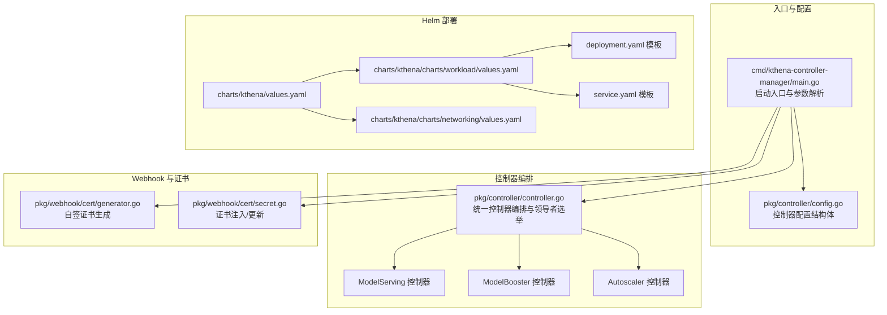
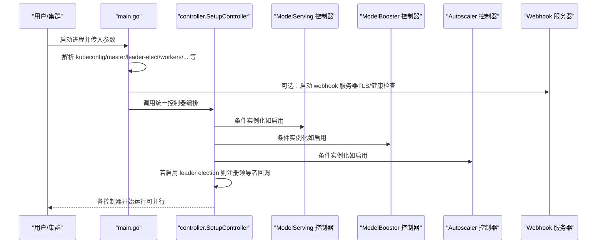
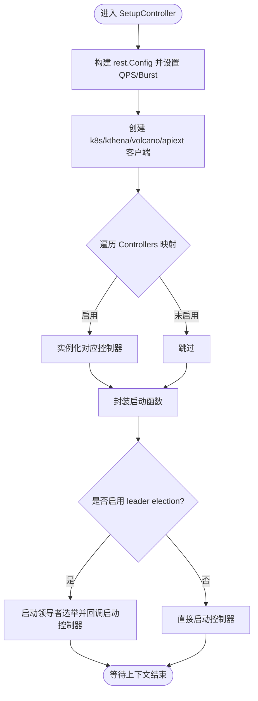
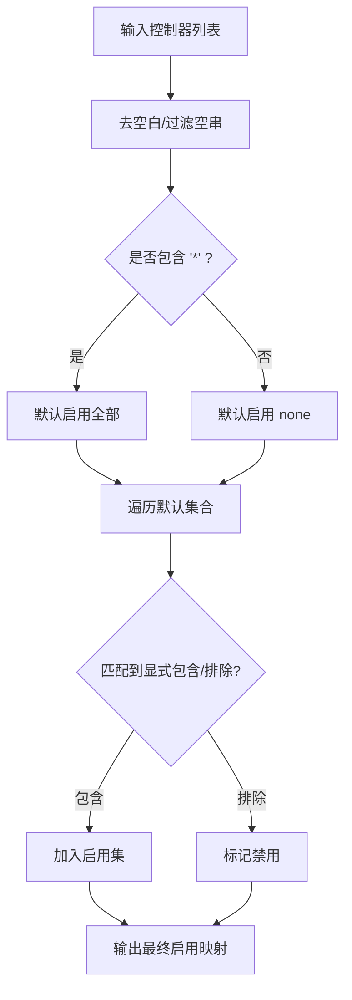
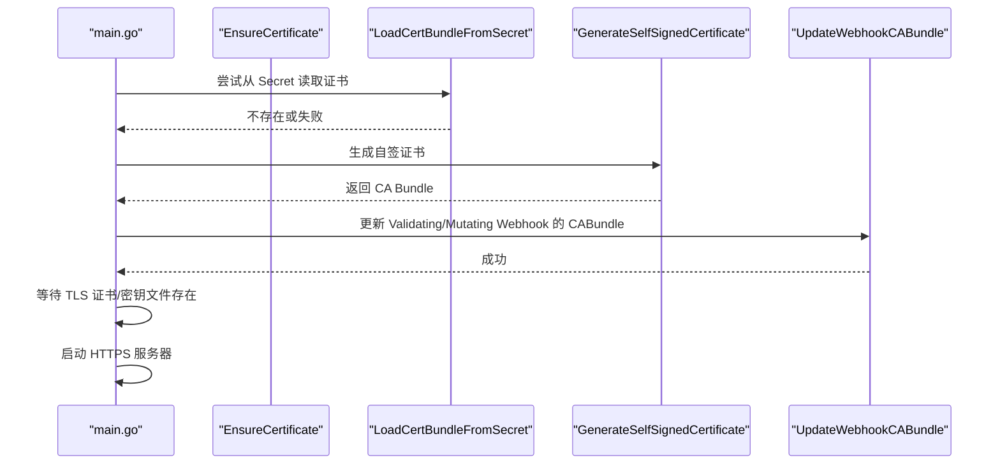
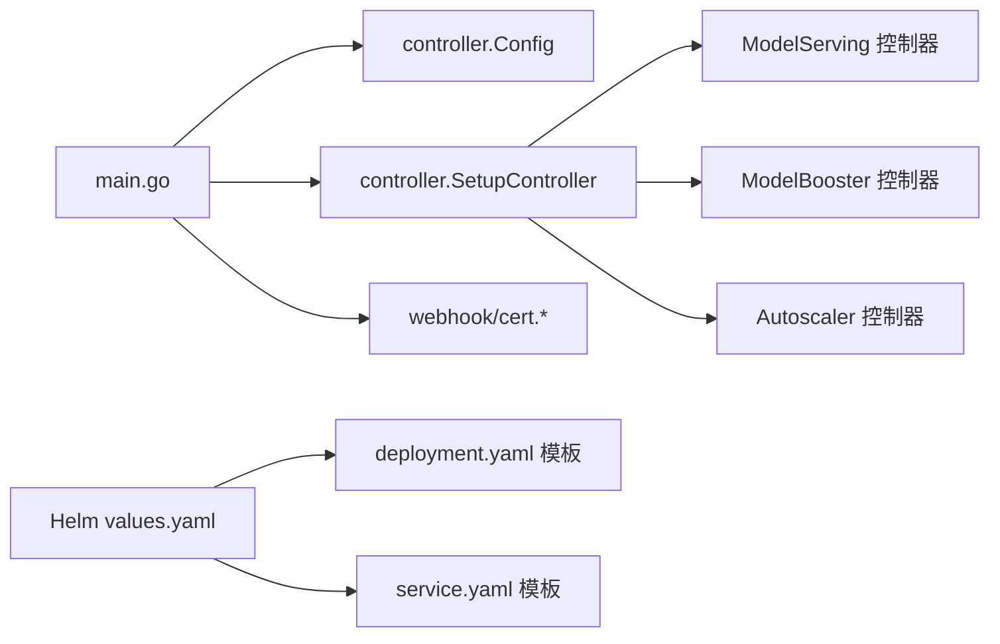

# Kthena 控制器管理器

<cite>
**本文引用的文件**
- [cmd/kthena-controller-manager/main.go](file://cmd/kthena-controller-manager/main.go)
- [pkg/controller/config.go](file://pkg/controller/config.go)
- [pkg/controller/controller.go](file://pkg/controller/controller.go)
- [pkg/webhook/cert/generator.go](file://pkg/webhook/cert/generator.go)
- [pkg/webhook/cert/secret.go](file://pkg/webhook/cert/secret.go)
- [pkg/model-serving-controller/controller/model_serving_controller.go](file://pkg/model-serving-controller/controller/model_serving_controller.go)
- [pkg/model-booster-controller/controller/model_booster_controller.go](file://pkg/model-booster-controller/controller/model_booster_controller.go)
- [pkg/autoscaler/controller/autoscale_controller.go](file://pkg/autoscaler/controller/autoscale_controller.go)
- [charts/kthena/values.yaml](file://charts/kthena/values.yaml)
- [charts/kthena/charts/workload/values.yaml](file://charts/kthena/charts/workload/values.yaml)
- [charts/kthena/charts/networking/values.yaml](file://charts/kthena/charts/networking/values.yaml)
- [charts/kthena/charts/workload/templates/kthena-controller-manager/component/deployment.yaml](file://charts/kthena/charts/workload/templates/kthena-controller-manager/component/deployment.yaml)
- [charts/kthena/charts/workload/templates/kthena-controller-manager/component/service.yaml](file://charts/kthena/charts/workload/templates/kthena-controller-manager/component/service.yaml)
- [docs/kthena/docs/getting-started/installation.md](file://docs/kthena/docs/getting-started/installation.md)
- [docs/kthena/docs/reference/helm-chart-values.md](file://docs/kthena/docs/reference/helm-chart-values.md)
- [README.md](file://README.md)
</cite>

## 目录
1. [简介](#简介)
2. [项目结构](#项目结构)
3. [核心组件](#核心组件)
4. [架构总览](#架构总览)
5. [详细组件分析](#详细组件分析)
6. [依赖分析](#依赖分析)
7. [性能考虑](#性能考虑)
8. [故障排查指南](#故障排查指南)
9. [结论](#结论)
10. [附录](#附录)

## 简介
本文件面向 Kthena 控制器管理器（统一控制器管理器）的技术文档，系统性阐述其架构设计与启动流程，说明如何协调模型服务（ModelServing）、模型增强（ModelBooster）、自动伸缩（Autoscaler）三大子控制器协同工作；详解配置参数（kubeconfig、master URL、leader election、workers 数量、kube API QPS/Burst、控制器选择等）；深入解析控制器选择机制与 webhook 集成（证书管理、健康检查、TLS 配置）；并提供 Helm 部署与启动命令示例、故障排查与性能优化建议。

## 项目结构
Kthena 控制器管理器位于 cmd/kthena-controller-manager，核心配置与控制器编排逻辑在 pkg/controller，webhook 证书生成与更新在 pkg/webhook/cert。Helm Chart 将控制器管理器作为 workload 子图表的一部分进行部署，提供默认值与模板。

**图示来源**
- [cmd/kthena-controller-manager/main.go:54-111](file://cmd/kthena-controller-manager/main.go#L54-L111)
- [pkg/controller/config.go:19-27](file://pkg/controller/config.go#L19-L27)
- [pkg/controller/controller.go:52-141](file://pkg/controller/controller.go#L52-L141)
- [pkg/webhook/cert/generator.go:50-140](file://pkg/webhook/cert/generator.go#L50-L140)
- [pkg/webhook/cert/secret.go:39-107](file://pkg/webhook/cert/secret.go#L39-L107)
- [charts/kthena/values.yaml:1-97](file://charts/kthena/values.yaml#L1-L97)
- [charts/kthena/charts/workload/values.yaml:1-51](file://charts/kthena/charts/workload/values.yaml#L1-L51)
- [charts/kthena/charts/networking/values.yaml:1-92](file://charts/kthena/charts/networking/values.yaml#L1-L92)
- [charts/kthena/charts/workload/templates/kthena-controller-manager/component/deployment.yaml:1-75](file://charts/kthena/charts/workload/templates/kthena-controller-manager/component/deployment.yaml#L1-L75)
- [charts/kthena/charts/workload/templates/kthena-controller-manager/component/service.yaml:1-19](file://charts/kthena/charts/workload/templates/kthena-controller-manager/component/service.yaml#L1-L19)

**章节来源**
- [cmd/kthena-controller-manager/main.go:54-111](file://cmd/kthena-controller-manager/main.go#L54-L111)
- [pkg/controller/config.go:19-27](file://pkg/controller/config.go#L19-L27)
- [pkg/controller/controller.go:52-141](file://pkg/controller/controller.go#L52-L141)
- [charts/kthena/values.yaml:1-97](file://charts/kthena/values.yaml#L1-L97)
- [charts/kthena/charts/workload/values.yaml:1-51](file://charts/kthena/charts/workload/values.yaml#L1-L51)
- [charts/kthena/charts/networking/values.yaml:1-92](file://charts/kthena/charts/networking/values.yaml#L1-L92)

## 核心组件
- 启动入口与参数解析：负责解析 kubeconfig、master URL、leader election、workers 数量、控制器选择列表、kube API QPS/Burst、webhook 开关与 TLS 参数，并初始化日志。
- 统一控制器编排：根据配置构建 Kubernetes 客户端、Volcano 客户端、CRD 客户端，按需实例化各子控制器，支持领导者选举与多实例运行。
- Webhook 服务器：在启用时启动 HTTPS 服务，处理模型校验/变更请求与健康检查，自动管理证书与 CA Bundle 更新。
- 证书管理：支持从 Secret 加载、自动生成自签证书、更新 Validating/Mutating Webhook 的 CA Bundle。

**章节来源**
- [cmd/kthena-controller-manager/main.go:69-85](file://cmd/kthena-controller-manager/main.go#L69-L85)
- [pkg/controller/config.go:19-27](file://pkg/controller/config.go#L19-L27)
- [pkg/controller/controller.go:52-141](file://pkg/controller/controller.go#L52-L141)
- [pkg/webhook/cert/secret.go:39-107](file://pkg/webhook/cert/secret.go#L39-L107)

## 架构总览
控制器管理器采用“统一入口 + 多子控制器”的架构。启动时解析参数，构建客户端，按配置启用对应控制器；若开启领导者选举，则仅一个实例对外提供控制能力；webhook 以独立进程方式运行，提供健康检查与多条验证/变更路径。

**图示来源**
- [cmd/kthena-controller-manager/main.go:103-111](file://cmd/kthena-controller-manager/main.go#L103-L111)
- [pkg/controller/controller.go:80-141](file://pkg/controller/controller.go#L80-L141)

## 详细组件分析

### 启动流程与参数解析
- 关键参数
  - kubeconfig：Kubernetes 集群访问凭据文件路径
  - master：API Server 地址（优先于 kubeconfig）
  - leader-elect：是否启用领导者选举
  - workers：工作线程数量（默认 5）
  - controllers：控制器选择列表，支持 "*" 全部、"+foo"/"-foo" 显式包含/排除
  - kube-api-qps/kube-api-burst：限制与 API Server 交互的速率与突发
  - enable-webhook：是否启用 webhook
  - webhook TLS：tls-cert-file、tls-private-key-file、port、webhook-timeout、cert-secret-name、service-name
- 启动步骤
  - 初始化 klog
  - 解析参数并打印
  - 可选启动 webhook 服务器
  - 调用统一控制器编排函数

**章节来源**
- [cmd/kthena-controller-manager/main.go:69-85](file://cmd/kthena-controller-manager/main.go#L69-L85)
- [cmd/kthena-controller-manager/main.go:103-111](file://cmd/kthena-controller-manager/main.go#L103-L111)

### 统一控制器编排与领导者选举
- 客户端构建：基于 master/kubeconfig 构建 rest.Config，设置 QPS/Burst，创建 kubernetes、kthena、volcano、apiextensions 客户端
- 控制器实例化：根据配置启用 modelserving、modelbooster、autoscaler 三类控制器
- 并发运行：每个启用的控制器独立 goroutine 运行
- 领导者选举：若启用则使用 Lease 类资源锁，配置租期、续租、重试周期，仅领导者实例启动控制器

**图示来源**
- [pkg/controller/controller.go:52-141](file://pkg/controller/controller.go#L52-L141)

**章节来源**
- [pkg/controller/controller.go:52-141](file://pkg/controller/controller.go#L52-L141)

### 控制器选择机制
- 默认全部启用：modelserving、modelbooster、autoscaler
- 选择规则：
  - 空列表或未指定：默认启用全部
  - 包含 "*"：表示启用全部
  - "+name" 或 "name"：显式包含
  - "-name"：显式排除
  - 同时出现 "+foo" 与 "-foo" 时，以包含为准

**图示来源**
- [cmd/kthena-controller-manager/main.go:268-331](file://cmd/kthena-controller-manager/main.go#L268-L331)

**章节来源**
- [cmd/kthena-controller-manager/main.go:268-331](file://cmd/kthena-controller-manager/main.go#L268-L331)

### Webhook 集成与证书管理
- 服务器
  - 端口与超时：通过参数配置，默认 8443，读写超时由 webhook-timeout 决定
  - TLS：最小版本为 TLS1.2
  - 健康检查：/healthz 返回 200 OK
  - 路由：
    - /validate-workload-ai-v1alpha1-modelserving
    - /validate/modelbooster、/mutate/modelbooster
    - /validate/autoscalingpolicy、/mutate/autoscalingpolicy
    - /validate/autoscalingpolicybinding
- 证书管理
  - 优先级：Secret -> 文件 -> 自动生成
  - 自动证书生成：根据 Service DNS 名称生成自签证书并写入 Secret
  - CA Bundle 注入：更新 ValidatingWebhookConfiguration 与 MutatingWebhookConfiguration 中的 ClientConfig.CABundle
  - 启动前等待证书文件就绪，避免 TLS 启动失败

**图示来源**
- [cmd/kthena-controller-manager/main.go:117-236](file://cmd/kthena-controller-manager/main.go#L117-L236)
- [pkg/webhook/cert/secret.go:39-107](file://pkg/webhook/cert/secret.go#L39-L107)
- [pkg/webhook/cert/generator.go:50-140](file://pkg/webhook/cert/generator.go#L50-L140)

**章节来源**
- [cmd/kthena-controller-manager/main.go:117-236](file://cmd/kthena-controller-manager/main.go#L117-L236)
- [pkg/webhook/cert/secret.go:109-181](file://pkg/webhook/cert/secret.go#L109-L181)
- [pkg/webhook/cert/generator.go:50-140](file://pkg/webhook/cert/generator.go#L50-L140)

### 子控制器职责概览
- ModelServing 控制器
  - 监听 ModelServing CRD，维护 PodGroup、Service、事件记录
  - 支持插件框架与 LWS（LeaderWorkerSet）控制器集成
- ModelBooster 控制器
  - 协调 LoRA 适配器、模型路由、模型服务与自动伸缩策略绑定
- Autoscaler 控制器
  - 周期性拉取策略绑定，计算目标副本数并回写至 ModelServing

**章节来源**
- [pkg/model-serving-controller/controller/model_serving_controller.go:82-102](file://pkg/model-serving-controller/controller/model_serving_controller.go#L82-L102)
- [pkg/model-booster-controller/controller/model_booster_controller.go:53-81](file://pkg/model-booster-controller/controller/model_booster_controller.go#L53-L81)
- [pkg/autoscaler/controller/autoscale_controller.go:47-62](file://pkg/autoscaler/controller/autoscale_controller.go#L47-L62)

## 依赖分析
- 启动入口依赖控制器编排模块与 webhook 工具
- 控制器编排依赖各子控制器包与客户端库
- Webhook 依赖证书生成与 Secret 更新工具
- Helm Chart 通过 values.yaml 与模板驱动部署，定义镜像、副本数、webhook 证书 Secret、探活端口等

**图示来源**
- [cmd/kthena-controller-manager/main.go:54-111](file://cmd/kthena-controller-manager/main.go#L54-L111)
- [pkg/controller/controller.go:52-141](file://pkg/controller/controller.go#L52-L141)
- [charts/kthena/values.yaml:1-97](file://charts/kthena/values.yaml#L1-L97)
- [charts/kthena/charts/workload/templates/kthena-controller-manager/component/deployment.yaml:1-75](file://charts/kthena/charts/workload/templates/kthena-controller-manager/component/deployment.yaml#L1-L75)
- [charts/kthena/charts/workload/templates/kthena-controller-manager/component/service.yaml:1-19](file://charts/kthena/charts/workload/templates/kthena-controller-manager/component/service.yaml#L1-L19)

**章节来源**
- [cmd/kthena-controller-manager/main.go:54-111](file://cmd/kthena-controller-manager/main.go#L54-L111)
- [pkg/controller/controller.go:52-141](file://pkg/controller/controller.go#L52-L141)
- [charts/kthena/values.yaml:1-97](file://charts/kthena/values.yaml#L1-L97)

## 性能考虑
- 控制器并发度：通过 workers 参数提升模型服务/增强/自动伸缩的处理吞吐
- API Server 限速：合理设置 kube-api-qps 与 kube-api-burst，避免对集群造成压力
- 领导者选举：在高可用场景下启用 leader-elect，确保单一实例对外提供控制能力
- Webhook 超时：根据集群延迟与后端响应时间调整 webhook-timeout，避免超时导致准入失败
- 证书加载：在容器启动阶段确保 TLS 证书文件存在，减少启动阻塞

[本节为通用指导，无需具体文件分析]

## 故障排查指南
- 启动失败（TLS 证书未就绪）
  - 现象：启动时报错提示 TLS 证书/密钥文件未找到
  - 排查：确认 Secret 是否已创建、文件路径是否正确、挂载是否生效
  - 参考
    - [cmd/kthena-controller-manager/main.go:252-266](file://cmd/kthena-controller-manager/main.go#L252-L266)
    - [pkg/webhook/cert/secret.go:39-107](file://pkg/webhook/cert/secret.go#L39-L107)
- webhook CA Bundle 未更新
  - 现象：准入 Webhook 校验失败
  - 排查：确认 Secret 中 CA 证书是否存在，是否成功更新 Validating/Mutating Webhook 的 CABundle
  - 参考
    - [pkg/webhook/cert/secret.go:109-181](file://pkg/webhook/cert/secret.go#L109-L181)
- 控制器未运行
  - 现象：未看到对应控制器日志
  - 排查：检查 controllers 参数是否包含对应控制器名；确认 leader election 是否启用且当前实例为领导者
  - 参考
    - [cmd/kthena-controller-manager/main.go:268-331](file://cmd/kthena-controller-manager/main.go#L268-L331)
    - [pkg/controller/controller.go:126-139](file://pkg/controller/controller.go#L126-L139)
- API Server 限流或超时
  - 现象：控制器频繁重试或超时
  - 排查：适当提高 kube-api-qps 与 kube-api-burst
  - 参考
    - [cmd/kthena-controller-manager/main.go:83-84](file://cmd/kthena-controller-manager/main.go#L83-L84)
    - [pkg/controller/config.go:25-26](file://pkg/controller/config.go#L25-L26)

**章节来源**
- [cmd/kthena-controller-manager/main.go:252-266](file://cmd/kthena-controller-manager/main.go#L252-L266)
- [pkg/webhook/cert/secret.go:109-181](file://pkg/webhook/cert/secret.go#L109-L181)
- [cmd/kthena-controller-manager/main.go:268-331](file://cmd/kthena-controller-manager/main.go#L268-L331)
- [pkg/controller/controller.go:126-139](file://pkg/controller/controller.go#L126-L139)
- [cmd/kthena-controller-manager/main.go:83-84](file://cmd/kthena-controller-manager/main.go#L83-L84)
- [pkg/controller/config.go:25-26](file://pkg/controller/config.go#L25-L26)

## 结论
Kthena 控制器管理器通过统一入口与配置编排，将模型服务、模型增强与自动伸缩三大控制器整合在同一进程中，结合领导者选举与 webhook 证书自动化管理，提供了生产级的控制平面能力。通过合理的参数配置与 Helm 部署，可在多租户、多后端的复杂环境中稳定运行。

[本节为总结，无需具体文件分析]

## 附录

### 配置参数总览（命令行与 Helm）
- 命令行参数
  - kubeconfig、master、leader-elect、workers、controllers、kube-api-qps、kube-api-burst、enable-webhook、tls-cert-file、tls-private-key-file、port、webhook-timeout、cert-secret-name、service-name
- Helm values（workload.controllerManager）
  - replicas、image、args、webhook.enabled、webhook.tls.certSecretName、webhook.tls.serviceName、controllers、kubeAPIQPS、kubeAPIBurst

**章节来源**
- [cmd/kthena-controller-manager/main.go:69-85](file://cmd/kthena-controller-manager/main.go#L69-L85)
- [charts/kthena/charts/workload/values.yaml:1-51](file://charts/kthena/charts/workload/values.yaml#L1-L51)

### 启动命令示例（Helm）
- 使用官方 Chart 安装
  - 参考安装文档中的 Helm 命令示例
- 自定义参数
  - 设置副本数、webhook 证书 Secret、控制器选择、API 限速等

**章节来源**
- [docs/kthena/docs/getting-started/installation.md:30-86](file://docs/kthena/docs/getting-started/installation.md#L30-L86)
- [docs/kthena/docs/reference/helm-chart-values.md:16-57](file://docs/kthena/docs/reference/helm-chart-values.md#L16-L57)

### 部署清单与模板要点
- Deployment 模板
  - 容器端口 8443，挂载 webhook 证书 Secret
  - 健康检查 /healthz（HTTPS），liveness/readiness 探针
- Service 模板
  - 暴露 443 端口，指向容器 8443

**章节来源**
- [charts/kthena/charts/workload/templates/kthena-controller-manager/component/deployment.yaml:24-68](file://charts/kthena/charts/workload/templates/kthena-controller-manager/component/deployment.yaml#L24-L68)
- [charts/kthena/charts/workload/templates/kthena-controller-manager/component/service.yaml:11-17](file://charts/kthena/charts/workload/templates/kthena-controller-manager/component/service.yaml#L11-L17)

### 架构与组件说明
- 控制器管理器定位：Kubernetes 原生的 LLM 推理生命周期控制平面
- 组件关系：控制器管理器协调三大控制器，webhook 提供准入校验与变更

**章节来源**
- [README.md:57-62](file://README.md#L57-L62)