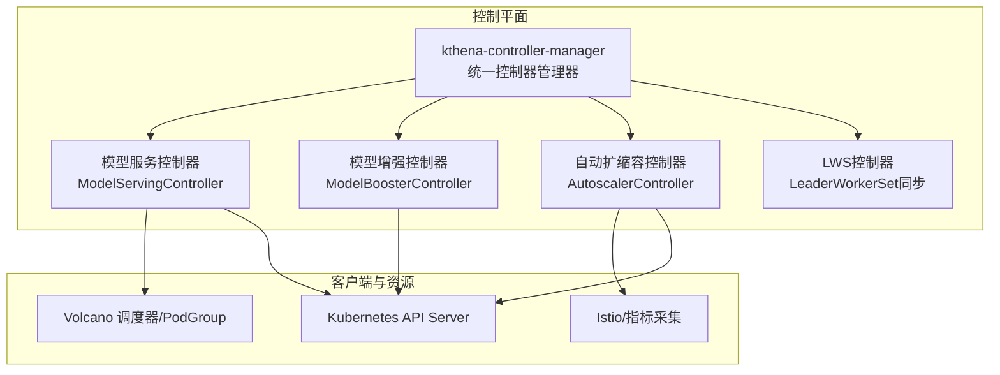
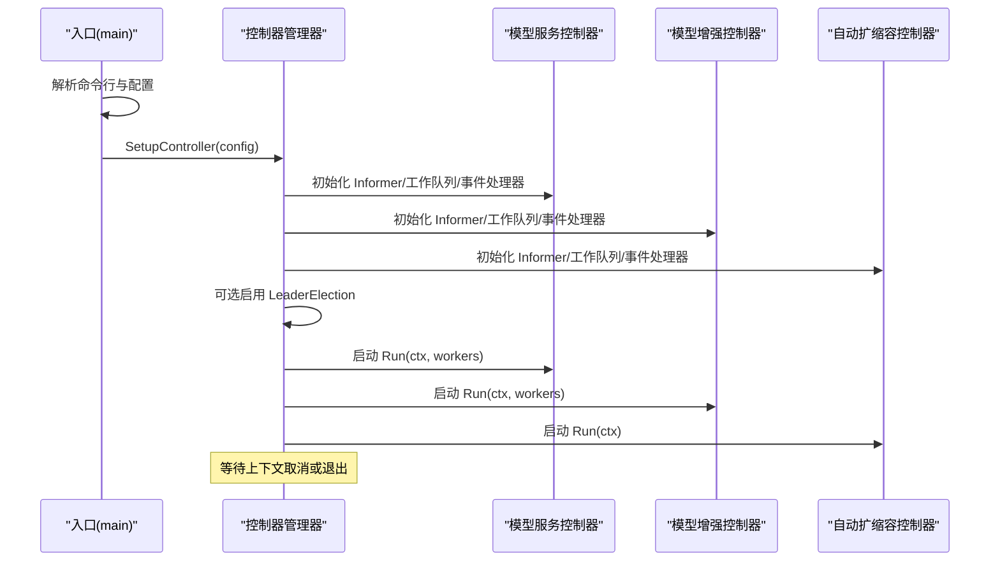
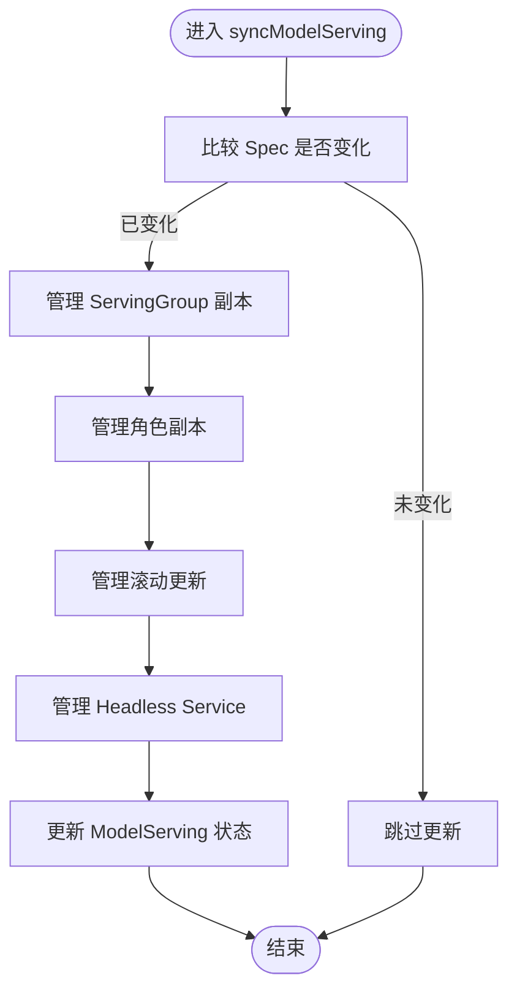
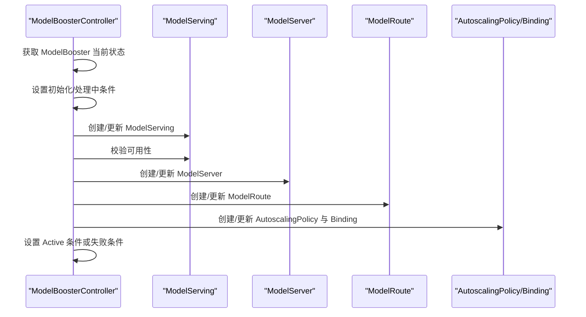
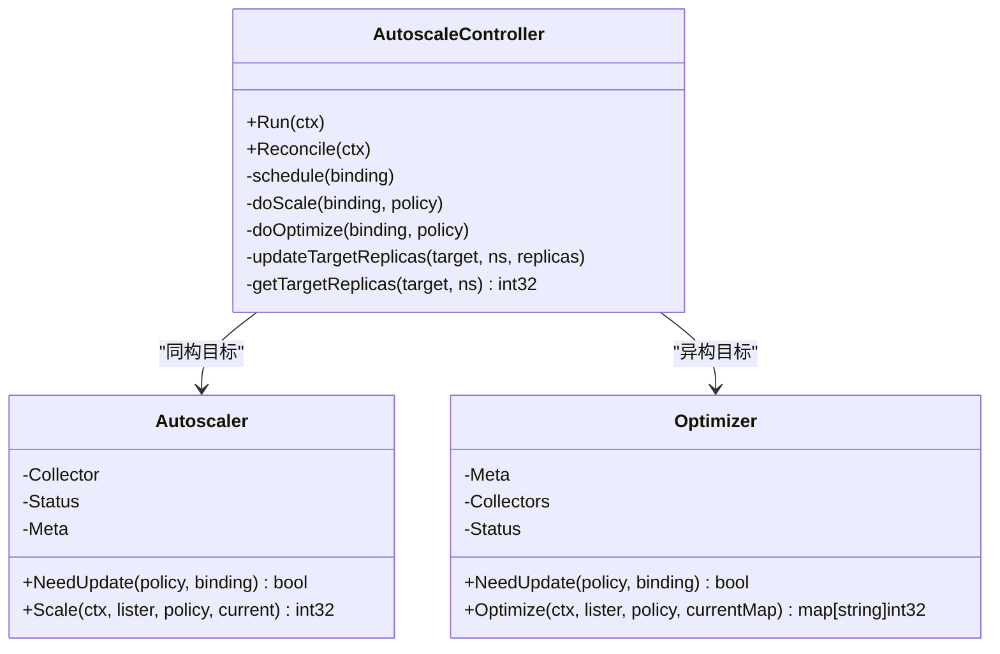
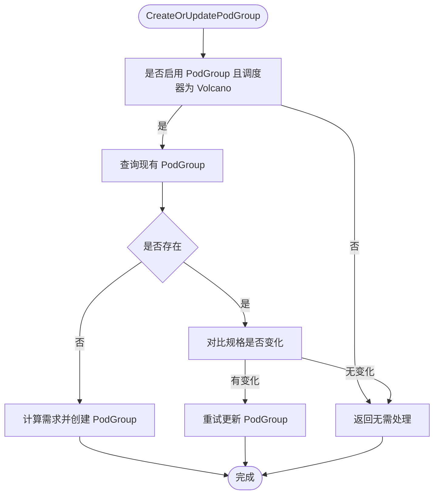
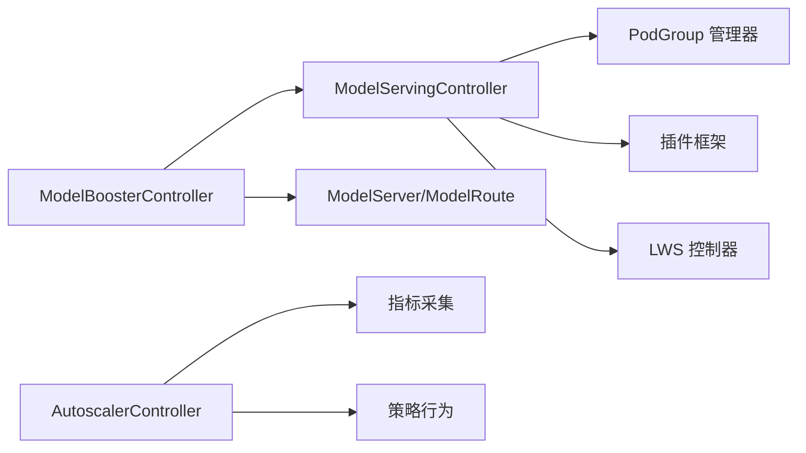

# 控制平面组件

<cite>
**本文引用的文件**
- [cmd/kthena-controller-manager/main.go](file://cmd/kthena-controller-manager/main.go)
- [pkg/controller/controller.go](file://pkg/controller/controller.go)
- [pkg/controller/config.go](file://pkg/controller/config.go)
- [pkg/model-serving-controller/controller/model_serving_controller.go](file://pkg/model-serving-controller/controller/model_serving_controller.go)
- [pkg/model-serving-controller/controller/lws_controller.go](file://pkg/model-serving-controller/controller/lws_controller.go)
- [pkg/model-serving-controller/podgroupmanager/manager.go](file://pkg/model-serving-controller/podgroupmanager/manager.go)
- [pkg/model-serving-controller/utils/utils.go](file://pkg/model-serving-controller/utils/utils.go)
- [pkg/model-serving-controller/plugins/manager.go](file://pkg/model-serving-controller/plugins/manager.go)
- [pkg/model-booster-controller/controller/model_booster_controller.go](file://pkg/model-booster-controller/controller/model_booster_controller.go)
- [pkg/autoscaler/controller/autoscale_controller.go](file://pkg/autoscaler/controller/autoscale_controller.go)
- [pkg/autoscaler/autoscaler/scaler.go](file://pkg/autoscaler/autoscaler/scaler.go)
- [pkg/autoscaler/autoscaler/optimizer.go](file://pkg/autoscaler/autoscaler/optimizer.go)
- [pkg/apis/workload/v1alpha1/model_serving_types.go](file://pkg/apis/workload/v1alpha1/model_serving_types.go)
- [pkg/apis/workload/v1alpha1/autoscalingpolicy_types.go](file://pkg/apis/workload/v1alpha1/autoscalingpolicy_types.go)
- [pkg/apis/workload/v1alpha1/model_booster_types.go](file://pkg/apis/workload/v1alpha1/model_booster_types.go)
</cite>

## 目录
1. [简介](#简介)
2. [项目结构](#项目结构)
3. [核心组件](#核心组件)
4. [架构总览](#架构总览)
5. [详细组件分析](#详细组件分析)
6. [依赖关系分析](#依赖关系分析)
7. [性能考量](#性能考量)
8. [故障排查指南](#故障排查指南)
9. [结论](#结论)
10. [附录](#附录)

## 简介
本文件面向 Kthena 平台控制平面组件，系统性阐述 kthena-controller-manager 统一控制器管理器的架构与启动流程，并深入解析三大核心控制器：模型服务控制器（ModelServingController）、模型增强控制器（ModelBoosterController）、自动扩缩容控制器（AutoscalerController）。内容涵盖各控制器的职责边界、数据流、滚动更新与扩缩容策略、错误处理与扩展点，并提供 Helm 值与配置参数说明及使用模式参考。

## 项目结构
Kthena 控制平面由一个统一入口控制器管理器负责加载与调度多个子控制器，同时提供可选的 Webhook 服务用于准入校验与变更注入。核心目录与文件如下：
- 入口与控制器管理器：cmd/kthena-controller-manager/main.go、pkg/controller/controller.go
- 模型服务控制器：pkg/model-serving-controller/controller/model_serving_controller.go、podgroupmanager/manager.go、utils/utils.go、plugins/manager.go
- 模型增强控制器：pkg/model-booster-controller/controller/model_booster_controller.go
- 自动扩缩容控制器：pkg/autoscaler/controller/autoscale_controller.go、autoscaler/scaler.go、autoscaler/optimizer.go
- CRD 类型定义：pkg/apis/workload/v1alpha1/*.go

图示来源
- [cmd/kthena-controller-manager/main.go:54-111](file://cmd/kthena-controller-manager/main.go#L54-L111)
- [pkg/controller/controller.go:52-141](file://pkg/controller/controller.go#L52-L141)

章节来源
- [cmd/kthena-controller-manager/main.go:54-111](file://cmd/kthena-controller-manager/main.go#L54-L111)
- [pkg/controller/controller.go:52-141](file://pkg/controller/controller.go#L52-L141)

## 核心组件
- 统一控制器管理器（kthena-controller-manager）
  - 解析命令行与配置，初始化 Kubernetes 客户端与自定义资源客户端
  - 可选启用 Webhook 服务器（验证/变更注入），支持证书自动生成与热更新
  - 支持控制器选择性启用（modelserving、modelbooster、autoscaler）
  - 支持 LeaderElection，确保集群内仅一个实例处于活跃状态
  - 启动各子控制器的 Informer 与工作队列，按配置并发运行
- 模型服务控制器（ModelServingController）
  - 协调 ModelServing 生命周期：副本管理、角色与 ServingGroup 管理、滚动更新、Headless Service 管理
  - 集成 PodGroup 管理器以支持 Volcano Gang 调度与网络拓扑策略
  - 支持插件框架对 Pod 创建/就绪阶段进行扩展
  - 支持 LeaderWorkerSet（LWS）同步，将 LWS 转换为 ModelServing
- 模型增强控制器（ModelBoosterController）
  - 将 ModelBooster 的声明式意图转换为 ModelServing、ModelServer、ModelRoute、AutoscalingPolicy 及绑定
  - 维护状态条件，跟踪观测代数，处理 LoRA 版本变更缓存
  - 通过 ConfigMap 注入下载器与运行时镜像等全局配置
- 自动扩缩容控制器（AutoscalerController）
  - 周期性遍历 AutoscalingPolicyBinding，根据 Homogeneous/Heterogeneous 目标计算推荐副本数
  - 对同构目标使用 Scaling 算法，对异构目标使用 Optimizer 进行成本驱动的资源分配
  - 通过 Status 记录历史与 Panic 模式，结合 Behavior 策略修正最终副本数

章节来源
- [pkg/controller/config.go:19-27](file://pkg/controller/config.go#L19-L27)
- [pkg/controller/controller.go:52-141](file://pkg/controller/controller.go#L52-L141)
- [pkg/model-serving-controller/controller/model_serving_controller.go:104-247](file://pkg/model-serving-controller/controller/model_serving_controller.go#L104-L247)
- [pkg/model-serving-controller/podgroupmanager/manager.go:74-142](file://pkg/model-serving-controller/podgroupmanager/manager.go#L74-L142)
- [pkg/model-serving-controller/controller/lws_controller.go:47-74](file://pkg/model-serving-controller/controller/lws_controller.go#L47-L74)
- [pkg/model-booster-controller/controller/model_booster_controller.go:285-383](file://pkg/model-booster-controller/controller/model_booster_controller.go#L285-L383)
- [pkg/autoscaler/controller/autoscale_controller.go:64-96](file://pkg/autoscaler/controller/autoscale_controller.go#L64-L96)

## 架构总览
统一控制器管理器在启动时根据配置决定启用哪些子控制器，并为每个控制器初始化 Informer、工作队列与事件处理器。控制器内部通过共享索引器（索引 Pod/Service/Role 等标签键）加速查询；在需要时集成 Volcano PodGroup 以支持高级调度与网络拓扑；扩缩容控制器通过指标采集与策略行为修正实现稳定扩容。

图示来源
- [cmd/kthena-controller-manager/main.go:54-111](file://cmd/kthena-controller-manager/main.go#L54-L111)
- [pkg/controller/controller.go:52-141](file://pkg/controller/controller.go#L52-L141)

## 详细组件分析

### 统一控制器管理器（kthena-controller-manager）
- 启动流程
  - 解析标志位：kubeconfig、master、Webhook 参数、LeaderElection、Workers 数量、控制器列表、K8s API QPS/Burst
  - 可选启动 Webhook 服务器：证书生成/加载、注册多路径处理器（模型服务校验、模型增强对象校验/变更、扩缩容策略校验/变更）、健康检查端点
  - 构建控制器配置，按需创建各子控制器实例
  - 在 LeaderElection 下启动控制器；否则直接启动
- 关键特性
  - 控制器选择：支持“全部启用”、“显式包含/排除”组合，如 “modelserving,modelbooster,-autoscaler”
  - 证书与 CA Bundle 更新：优先从 Secret 加载，其次尝试文件存在，最后自动生成并更新 Validating/Mutating Webhook 配置
  - 优雅关闭：监听终止信号，关闭 Webhook 服务器与控制器

章节来源
- [cmd/kthena-controller-manager/main.go:54-111](file://cmd/kthena-controller-manager/main.go#L54-L111)
- [cmd/kthena-controller-manager/main.go:127-236](file://cmd/kthena-controller-manager/main.go#L127-L236)
- [cmd/kthena-controller-manager/main.go:268-331](file://cmd/kthena-controller-manager/main.go#L268-L331)
- [pkg/controller/controller.go:52-141](file://pkg/controller/controller.go#L52-L141)

### 模型服务控制器（ModelServingController）
- 职责与范围
  - 监听 ModelServing、Pod、Service、PodGroup 等资源事件，维护内部存储（datastore）与工作队列
  - 管理 ServingGroup 副本数量、角色副本、滚动更新策略（ServingGroup/Role 级别）
  - 管理 Headless Service 与 Pod 环境变量注入（组大小、入口地址、工作节点索引）
  - 与 PodGroup 管理器协作，按需创建/更新 PodGroup，支持 Volcano 调度与网络拓扑
  - 插件框架：按 Scope 与 Target 条件执行 OnPodCreate/OnPodReady 钩子
  - LWS 同步：当 LWS CRD 存在时，将 LeaderWorkerSet 同步为 ModelServing 并回写状态
- 数据结构与复杂度
  - 工作队列采用指数退避限速，避免瞬时风暴
  - Informer 使用复合索引键（GroupName/RoleID）加速按组/角色查询
  - Pod/Service 列表器基于标签选择器过滤，减少无关事件处理
- 错误处理与扩展点
  - 失败 Pod/重启容器触发重建策略（依据 RecoveryPolicy）
  - 滚动更新中分区保护（Partition）与最大不可用（MaxUnavailable）策略
  - 插件注册与链式执行，支持按角色与目标类型裁剪执行
- 关键流程图（滚动更新）

图示来源
- [pkg/model-serving-controller/controller/model_serving_controller.go:531-572](file://pkg/model-serving-controller/controller/model_serving_controller.go#L531-L572)

章节来源
- [pkg/model-serving-controller/controller/model_serving_controller.go:104-247](file://pkg/model-serving-controller/controller/model_serving_controller.go#L104-L247)
- [pkg/model-serving-controller/controller/model_serving_controller.go:574-624](file://pkg/model-serving-controller/controller/model_serving_controller.go#L574-L624)
- [pkg/model-serving-controller/controller/model_serving_controller.go:626-794](file://pkg/model-serving-controller/controller/model_serving_controller.go#L626-L794)
- [pkg/model-serving-controller/utils/utils.go:51-84](file://pkg/model-serving-controller/utils/utils.go#L51-L84)
- [pkg/model-serving-controller/utils/utils.go:238-270](file://pkg/model-serving-controller/utils/utils.go#L238-L270)
- [pkg/model-serving-controller/plugins/manager.go:60-80](file://pkg/model-serving-controller/plugins/manager.go#L60-L80)

### 模型增强控制器（ModelBoosterController）
- 职责
  - 将 ModelBooster 的声明转换为 ModelServing、ModelServer、ModelRoute、AutoscalingPolicy 及绑定
  - 维护状态条件（Initialized/Active/Failed），记录 ObservedGeneration
  - 处理 LoRA 版本变更缓存，避免并发冲突
  - 从 ConfigMap 注入下载器与运行时镜像等全局配置
- 关键流程（Reconcile）

图示来源
- [pkg/model-booster-controller/controller/model_booster_controller.go:190-233](file://pkg/model-booster-controller/controller/model_booster_controller.go#L190-L233)
- [pkg/model-booster-controller/controller/model_booster_controller.go:235-255](file://pkg/model-booster-controller/controller/model_booster_controller.go#L235-L255)

章节来源
- [pkg/model-booster-controller/controller/model_booster_controller.go:285-383](file://pkg/model-booster-controller/controller/model_booster_controller.go#L285-L383)
- [pkg/model-booster-controller/controller/model_booster_controller.go:385-408](file://pkg/model-booster-controller/controller/model_booster_controller.go#L385-L408)
- [pkg/model-booster-controller/controller/model_booster_controller.go:410-474](file://pkg/model-booster-controller/controller/model_booster_controller.go#L410-L474)

### 自动扩缩容控制器（AutoscalerController）
- 职责
  - 周期性遍历所有 AutoscalingPolicyBinding，按 Homogeneous/Heterogeneous 目标计算推荐副本数
  - 同构目标：使用 MetricCollector 与 RecommendedInstancesAlgorithm 计算推荐值，结合 Behavior 与 Panic 模式修正
  - 异构目标：使用 Optimizer 将总副本按成本与最小/最大限制分配到不同后端
  - 通过 Patch 方式更新 ModelServing 的 replicas 或角色级 replicas 字段
- 算法要点
  - 推荐算法：考虑当前实例数、容忍度、就绪实例指标、未就绪实例数、外部指标
  - Panic 模式：当推荐值超过阈值百分比时刷新状态，短期内放宽限制
  - 稳定化窗口与选择策略（Or/And）平滑波动
- 关键类图

图示来源
- [pkg/autoscaler/controller/autoscale_controller.go:98-171](file://pkg/autoscaler/controller/autoscale_controller.go#L98-L171)
- [pkg/autoscaler/controller/autoscale_controller.go:251-348](file://pkg/autoscaler/controller/autoscale_controller.go#L251-L348)
- [pkg/autoscaler/autoscaler/scaler.go:40-58](file://pkg/autoscaler/autoscaler/scaler.go#L40-L58)
- [pkg/autoscaler/autoscaler/optimizer.go:126-144](file://pkg/autoscaler/autoscaler/optimizer.go#L126-L144)

章节来源
- [pkg/autoscaler/controller/autoscale_controller.go:64-96](file://pkg/autoscaler/controller/autoscale_controller.go#L64-L96)
- [pkg/autoscaler/controller/autoscale_controller.go:124-171](file://pkg/autoscaler/controller/autoscale_controller.go#L124-L171)
- [pkg/autoscaler/autoscaler/scaler.go:67-107](file://pkg/autoscaler/autoscaler/scaler.go#L67-L107)
- [pkg/autoscaler/autoscaler/optimizer.go:151-208](file://pkg/autoscaler/autoscaler/optimizer.go#L151-L208)

### PodGroup 管理与网络拓扑
- 功能
  - 检测 PodGroup CRD 存在性与 SubGroupPolicy 能力，动态启停 Informer
  - 计算每 ServingGroup 的最小成员数、最小角色成员数与最小资源集，用于 PodGroup 规模与队列绑定
  - 在启用 Volcano 调度且配置网络拓扑时，为 PodGroup 注入 NetworkTopology/SubGroupPolicy
  - 提供注解能力，将 Pod 与 PodGroup 关联
- 流程图（创建/更新 PodGroup）

图示来源
- [pkg/model-serving-controller/podgroupmanager/manager.go:227-249](file://pkg/model-serving-controller/podgroupmanager/manager.go#L227-L249)
- [pkg/model-serving-controller/podgroupmanager/manager.go:426-460](file://pkg/model-serving-controller/podgroupmanager/manager.go#L426-L460)

章节来源
- [pkg/model-serving-controller/podgroupmanager/manager.go:74-142](file://pkg/model-serving-controller/podgroupmanager/manager.go#L74-L142)
- [pkg/model-serving-controller/podgroupmanager/manager.go:251-261](file://pkg/model-serving-controller/podgroupmanager/manager.go#L251-L261)
- [pkg/model-serving-controller/podgroupmanager/manager.go:274-323](file://pkg/model-serving-controller/podgroupmanager/manager.go#L274-L323)
- [pkg/model-serving-controller/podgroupmanager/manager.go:426-460](file://pkg/model-serving-controller/podgroupmanager/manager.go#L426-L460)

### LWS 控制器（LeaderWorkerSet 同步）
- 功能
  - 发现 LWS CRD 存在即初始化 LWS 与 ModelServing Informer
  - 将 LWS 同步为同名 ModelServing，必要时创建或更新
  - 将 ModelServing 状态回写至 LWS
- 关键点
  - 通过 OwnerReference 将 LWS 与 ModelServing 关联
  - 仅在 LWS 存在时启用，不存在则禁用以避免依赖缺失

章节来源
- [pkg/model-serving-controller/controller/lws_controller.go:47-74](file://pkg/model-serving-controller/controller/lws_controller.go#L47-L74)
- [pkg/model-serving-controller/controller/lws_controller.go:202-250](file://pkg/model-serving-controller/controller/lws_controller.go#L202-L250)
- [pkg/model-serving-controller/controller/lws_controller.go:295-364](file://pkg/model-serving-controller/controller/lws_controller.go#L295-L364)

## 依赖关系分析
- 控制器耦合与内聚
  - ModelServingController 内聚于 ModelServing 生命周期管理，与 PodGroup 管理器松耦合（接口抽象）
  - ModelBoosterController 通过多个 Informer 与工作队列协调多类资源，状态机清晰
  - AutoscalerController 与指标采集与策略行为强相关，但通过接口隔离了具体算法实现
- 外部依赖
  - Volcano：PodGroup、队列、网络拓扑策略
  - Istio：指标采集（通过 PodLister 与指标目标）
  - Kubernetes：Informer、工作队列、事件记录、LeaderElection

图示来源
- [pkg/model-serving-controller/podgroupmanager/manager.go:74-142](file://pkg/model-serving-controller/podgroupmanager/manager.go#L74-L142)
- [pkg/model-serving-controller/plugins/manager.go:30-80](file://pkg/model-serving-controller/plugins/manager.go#L30-L80)
- [pkg/model-serving-controller/controller/lws_controller.go:91-145](file://pkg/model-serving-controller/controller/lws_controller.go#L91-L145)
- [pkg/autoscaler/controller/autoscale_controller.go:64-96](file://pkg/autoscaler/controller/autoscale_controller.go#L64-L96)

章节来源
- [pkg/model-serving-controller/podgroupmanager/manager.go:74-142](file://pkg/model-serving-controller/podgroupmanager/manager.go#L74-L142)
- [pkg/model-serving-controller/plugins/manager.go:30-80](file://pkg/model-serving-controller/plugins/manager.go#L30-L80)
- [pkg/model-serving-controller/controller/lws_controller.go:91-145](file://pkg/model-serving-controller/controller/lws_controller.go#L91-L145)
- [pkg/autoscaler/controller/autoscale_controller.go:64-96](file://pkg/autoscaler/controller/autoscale_controller.go#L64-L96)

## 性能考量
- Informer 缓存与索引
  - 使用复合索引键（GroupName/RoleID）降低查询开销，避免全量扫描
- 工作队列与速率限制
  - 默认控制器速率限制器配合指数退避，缓解瞬时压力
- 批量与最小化 API 调用
  - PodGroup 更新采用“对比规格变化”再更新，避免不必要的 Patch
  - 扩缩容控制器周期性批量处理，减少频繁 API 调用
- 资源与调度
  - PodGroup 最小成员与最小资源聚合计算，有助于 Volcano 更准确地进行资源预留与排队

## 故障排查指南
- Webhook 无法启动
  - 检查 TLS 证书文件是否存在、Secret 中 CA Bundle 是否正确、服务名称与命名空间是否匹配
  - 查看健康检查端点 /healthz 返回状态
- 控制器未运行
  - 确认控制器列表参数（如 -controllers="modelserving,modelbooster,autoscaler"）与 EnableLeaderElection
  - 查看日志中“Start as leader”或“Started controllers without leader election”
- 模型服务未就绪
  - 检查 Pod 条件（Ready）、重启次数、环境变量注入（GroupSize/EntryAddress/WorkerIndex）
  - 若使用 Volcano，确认 PodGroup 是否创建成功、队列名称与网络拓扑策略是否正确
- 扩缩容不生效
  - 检查 AutoscalingPolicyBinding 是否存在、Homogeneous/Heterogeneous 配置是否正确
  - 查看 Panic 模式与稳定化窗口设置，确认推荐值是否被修正
- LWS 同步异常
  - 确认 LWS CRD 是否安装，控制器日志是否提示“LeaderWorkerSet CRD not found”

章节来源
- [cmd/kthena-controller-manager/main.go:127-236](file://cmd/kthena-controller-manager/main.go#L127-L236)
- [pkg/controller/controller.go:126-139](file://pkg/controller/controller.go#L126-L139)
- [pkg/model-serving-controller/utils/utils.go:297-392](file://pkg/model-serving-controller/utils/utils.go#L297-L392)
- [pkg/model-serving-controller/podgroupmanager/manager.go:251-261](file://pkg/model-serving-controller/podgroupmanager/manager.go#L251-L261)
- [pkg/autoscaler/controller/autoscale_controller.go:124-171](file://pkg/autoscaler/controller/autoscale_controller.go#L124-L171)
- [pkg/model-serving-controller/controller/lws_controller.go:52-74](file://pkg/model-serving-controller/controller/lws_controller.go#L52-L74)

## 结论
Kthena 控制平面通过统一管理器将模型服务、模型增强与自动扩缩容三大能力整合，形成高内聚、低耦合的控制器体系。借助 Volcano PodGroup、Istio 指标与插件框架，平台实现了灵活的调度、可观测与扩展能力。建议在生产环境中启用 LeaderElection、合理配置 Workers 与速率限制，并结合业务流量特征调整扩缩容策略与 Panic 行为。

## 附录

### 配置参数与使用模式
- 控制器管理器（kthena-controller-manager）
  - -kubeconfig/-master：K8s API 地址与认证
  - -enable-webhook：是否启用 Webhook（默认开启）
  - -tls-cert-file/-tls-private-key-file：Webhook TLS 文件路径
  - -port/-webhook-timeout：Webhook 端口与超时
  - -cert-secret-name/-service-name：证书 Secret 名称与服务名
  - -leader-elect：启用 LeaderElection
  - -workers：控制器工作线程数
  - -controllers：控制器选择列表（支持“+/-/*”语法）
  - -kube-api-qps/-kube-api-burst：K8s API 限速
- 模型服务（ModelServing）
  - Replicas：ServingGroup 数量
  - SchedulerName：调度器名称（默认 Volcano）
  - Plugins：插件链配置（BuiltIn 类型）
  - RolloutStrategy：滚动更新策略（ServingGroupRollingUpdate/RoleRollingUpdate）
  - RecoveryPolicy：恢复策略（ServingGroupRecreate/RoleRecreate）
- 模型增强（ModelBooster）
  - Backend：后端类型、模型 URI、缓存 URI、最小/最大副本、Worker 列表
  - AutoscalingPolicy：可选扩缩容策略
  - ModelMatch：请求匹配规则
- 自动扩缩容（AutoscalingPolicy/AutoscalingPolicyBinding）
  - TolerancePercent：容忍度百分比
  - Metrics：指标与目标值
  - Behavior.ScaleUp/ScaleDown：稳定与紧急策略
  - HeterogeneousTarget：异构目标的成本分配与最小/最大副本
  - HomogeneousTarget：同构目标的最小/最大副本与目标

章节来源
- [cmd/kthena-controller-manager/main.go:69-85](file://cmd/kthena-controller-manager/main.go#L69-L85)
- [pkg/apis/workload/v1alpha1/model_serving_types.go:35-66](file://pkg/apis/workload/v1alpha1/model_serving_types.go#L35-L66)
- [pkg/apis/workload/v1alpha1/model_serving_types.go:133-182](file://pkg/apis/workload/v1alpha1/model_serving_types.go#L133-L182)
- [pkg/apis/workload/v1alpha1/model_booster_types.go:26-48](file://pkg/apis/workload/v1alpha1/model_booster_types.go#L26-L48)
- [pkg/apis/workload/v1alpha1/autoscalingpolicy_types.go:24-40](file://pkg/apis/workload/v1alpha1/autoscalingpolicy_types.go#L24-L40)