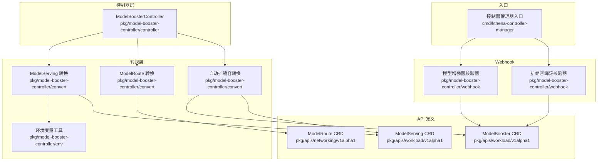
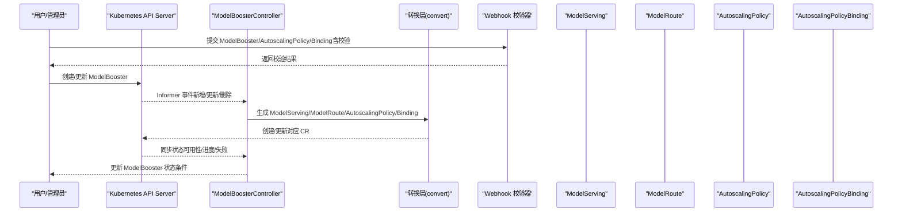
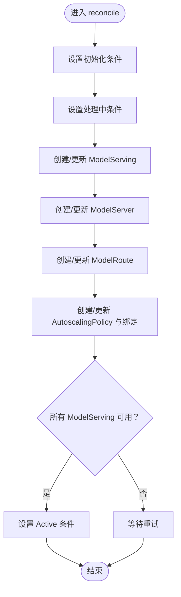
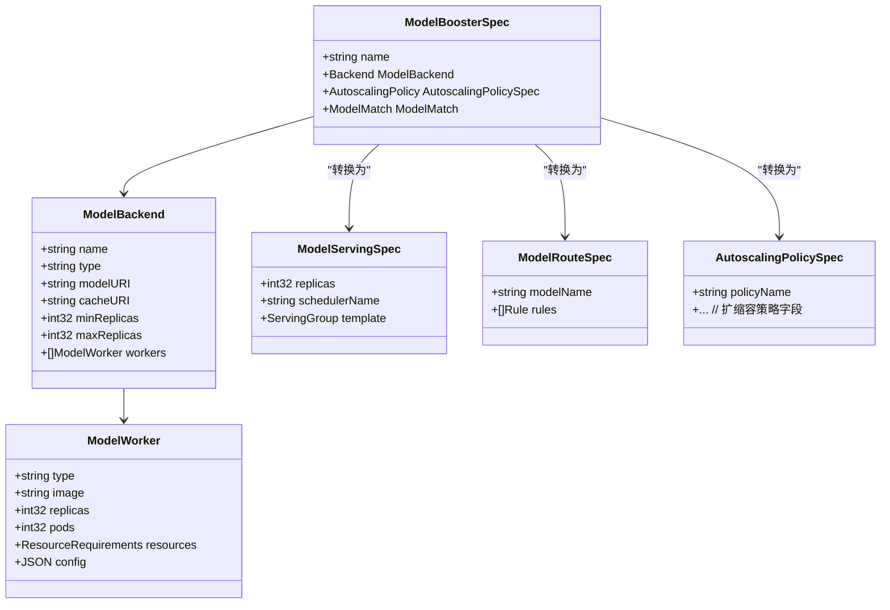
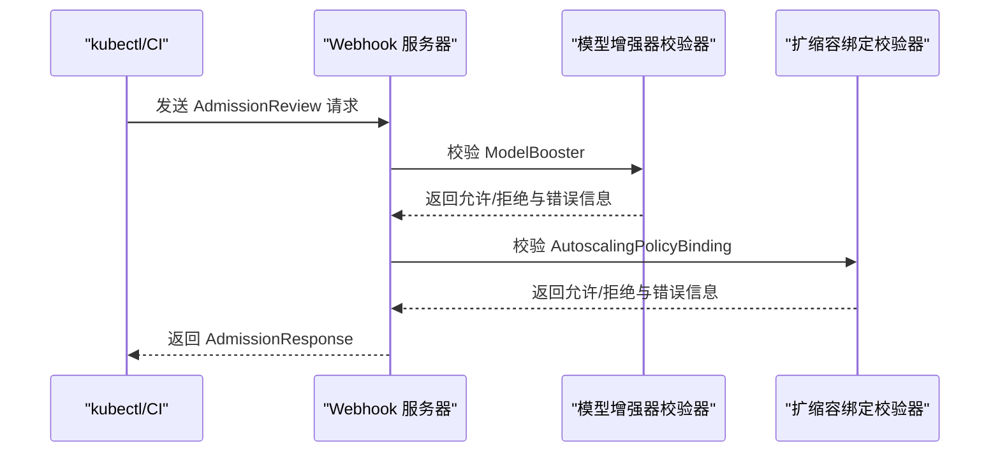
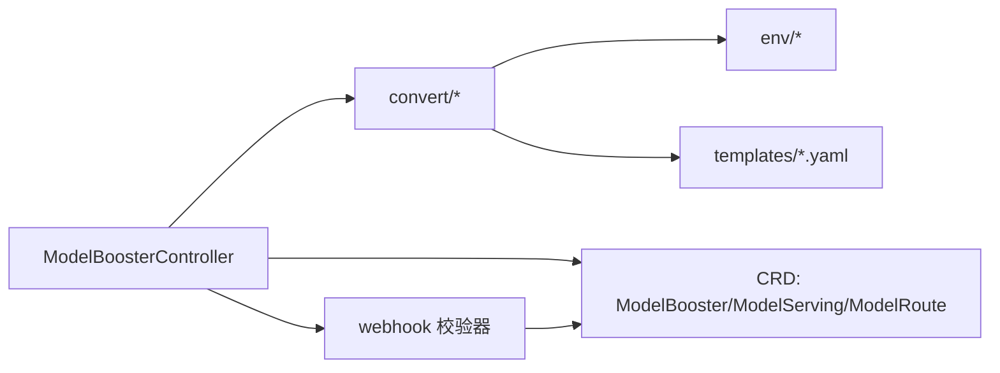

# 模型增强控制器

<cite>
**本文引用的文件**
- [pkg/model-booster-controller/controller/model_booster_controller.go](file://pkg/model-booster-controller/controller/model_booster_controller.go)
- [pkg/model-booster-controller/convert/model_serving.go](file://pkg/model-booster-controller/convert/model_serving.go)
- [pkg/model-booster-controller/convert/model_route.go](file://pkg/model-booster-controller/convert/model_route.go)
- [pkg/model-booster-controller/convert/autoscaling.go](file://pkg/model-booster-controller/convert/autoscaling.go)
- [pkg/model-booster-controller/webhook/model_validator.go](file://pkg/model-booster-controller/webhook/model_validator.go)
- [pkg/model-booster-controller/webhook/autoscaling_binding_validator.go](file://pkg/model-booster-controller/webhook/autoscaling_binding_validator.go)
- [pkg/model-booster-controller/env/env.go](file://pkg/model-booster-controller/env/env.go)
- [pkg/apis/workload/v1alpha1/model_booster_types.go](file://pkg/apis/workload/v1alpha1/model_booster_types.go)
- [pkg/apis/workload/v1alpha1/model_serving_types.go](file://pkg/apis/workload/v1alpha1/model_serving_types.go)
- [pkg/apis/networking/v1alpha1/modelroute_types.go](file://pkg/apis/networking/v1alpha1/modelroute_types.go)
- [cmd/kthena-controller-manager/main.go](file://cmd/kthena-controller-manager/main.go)
- [pkg/model-booster-controller/convert/templates/vllm.yaml](file://pkg/model-booster-controller/convert/templates/vllm.yaml)
- [pkg/model-booster-controller/convert/templates/vllm-pd.yaml](file://pkg/model-booster-controller/convert/templates/vllm-pd.yaml)
- [examples/kthena-router/ModelRouteSimple.yaml](file://examples/kthena-router/ModelRouteSimple.yaml)
- [examples/model-serving/sample.yaml](file://examples/model-serving/sample.yaml)
</cite>

## 目录
1. [简介](#简介)
2. [项目结构](#项目结构)
3. [核心组件](#核心组件)
4. [架构总览](#架构总览)
5. [详细组件分析](#详细组件分析)
6. [依赖分析](#依赖分析)
7. [性能考虑](#性能考虑)
8. [故障排查指南](#故障排查指南)
9. [结论](#结论)
10. [附录](#附录)

## 简介
本技术文档围绕“模型增强控制器”展开，系统阐述其在 K8s 生态中如何将用户声明式的模型增强配置转换为底层的模型服务与路由、自动扩缩容策略，并通过 webhook 实现严格的校验与默认值注入。文档重点覆盖以下方面：
- 自动扩缩容策略绑定：如何将策略与具体后端实例绑定，确保按角色或实例粒度进行弹性伸缩。
- 模型路由管理：如何根据模型匹配规则将请求路由到对应的模型服务实例。
- 配置转换：从用户配置到模板渲染、再到最终 CRD 资源的完整链路。
- webhook 验证器：模型增强器、自动扩缩容策略与绑定关系的准入校验。
- 使用模式与最佳实践：结合示例展示声明式配置与常见场景。

## 项目结构
模型增强控制器位于 pkg/model-booster-controller 目录下，主要由控制器、转换层（convert）、环境变量工具（env）、以及 webhook 校验器组成；同时与工作负载与网络相关 CRD 进行交互。

图表来源
- [pkg/model-booster-controller/controller/model_booster_controller.go:1-474](file://pkg/model-booster-controller/controller/model_booster_controller.go#L1-L474)
- [pkg/model-booster-controller/convert/model_serving.go:1-548](file://pkg/model-booster-controller/convert/model_serving.go#L1-L548)
- [pkg/model-booster-controller/convert/model_route.go:1-78](file://pkg/model-booster-controller/convert/model_route.go#L1-L78)
- [pkg/model-booster-controller/convert/autoscaling.go:1-92](file://pkg/model-booster-controller/convert/autoscaling.go#L1-L92)
- [pkg/model-booster-controller/webhook/model_validator.go:1-244](file://pkg/model-booster-controller/webhook/model_validator.go#L1-L244)
- [pkg/model-booster-controller/webhook/autoscaling_binding_validator.go:1-166](file://pkg/model-booster-controller/webhook/autoscaling_binding_validator.go#L1-L166)
- [pkg/apis/workload/v1alpha1/model_booster_types.go:1-208](file://pkg/apis/workload/v1alpha1/model_booster_types.go#L1-L208)
- [pkg/apis/workload/v1alpha1/model_serving_types.go:1-262](file://pkg/apis/workload/v1alpha1/model_serving_types.go#L1-L262)
- [pkg/apis/networking/v1alpha1/modelroute_types.go:1-194](file://pkg/apis/networking/v1alpha1/modelroute_types.go#L1-L194)
- [cmd/kthena-controller-manager/main.go:1-332](file://cmd/kthena-controller-manager/main.go#L1-L332)

章节来源
- [pkg/model-booster-controller/controller/model_booster_controller.go:1-474](file://pkg/model-booster-controller/controller/model_booster_controller.go#L1-L474)
- [cmd/kthena-controller-manager/main.go:1-332](file://cmd/kthena-controller-manager/main.go#L1-L332)

## 核心组件
- 控制器（ModelBoosterController）：负责监听 ModelBooster 变更，协调创建/更新 ModelServing、ModelRoute、AutoscalingPolicy 及其绑定，并维护状态条件。
- 转换层（convert）：将用户配置映射为具体的 ModelServing、ModelRoute、AutoscalingPolicy 与绑定对象，支持 vLLM 单机与拆分（prefill/decode）两种后端类型。
- Webhook 校验器：对 ModelBooster、AutoscalingPolicy、AutoscalingPolicyBinding 进行准入校验，保证配置合法性与一致性。
- 环境变量工具（env）：提供统一的环境变量读取与类型转换能力，便于模板渲染时注入运行时参数。
- API 定义：ModelBooster、ModelServing、ModelRoute 等 CRD 的结构定义与字段约束。

章节来源
- [pkg/model-booster-controller/controller/model_booster_controller.go:53-115](file://pkg/model-booster-controller/controller/model_booster_controller.go#L53-L115)
- [pkg/model-booster-controller/convert/model_serving.go:56-73](file://pkg/model-booster-controller/convert/model_serving.go#L56-L73)
- [pkg/model-booster-controller/webhook/model_validator.go:76-94](file://pkg/model-booster-controller/webhook/model_validator.go#L76-L94)
- [pkg/apis/workload/v1alpha1/model_booster_types.go:26-48](file://pkg/apis/workload/v1alpha1/model_booster_types.go#L26-L48)

## 架构总览
模型增强控制器以“声明式配置 → 转换 → 底层资源”的方式工作，控制器作为编排中枢，协调多类 CRD 的生命周期与状态。

图表来源
- [pkg/model-booster-controller/controller/model_booster_controller.go:188-233](file://pkg/model-booster-controller/controller/model_booster_controller.go#L188-L233)
- [pkg/model-booster-controller/convert/model_serving.go:56-73](file://pkg/model-booster-controller/convert/model_serving.go#L56-L73)
- [pkg/model-booster-controller/convert/model_route.go:27-54](file://pkg/model-booster-controller/convert/model_route.go#L27-L54)
- [pkg/model-booster-controller/convert/autoscaling.go:27-91](file://pkg/model-booster-controller/convert/autoscaling.go#L27-L91)
- [pkg/model-booster-controller/webhook/model_validator.go:40-74](file://pkg/model-booster-controller/webhook/model_validator.go#L40-L74)
- [pkg/model-booster-controller/webhook/autoscaling_binding_validator.go:50-84](file://pkg/model-booster-controller/webhook/autoscaling_binding_validator.go#L50-L84)

## 详细组件分析

### 控制器：ModelBoosterController
- 角色与职责
  - 统一管理 ModelBooster、ModelServing、ModelServer、ModelRoute、AutoscalingPolicy、AutoscalingPolicyBinding 的事件与同步。
  - 通过条件（Initialized/Active/Failed）反映当前处理阶段与结果。
  - 在 ModelServing 变化时触发关联的 ModelBooster 重新评估。
- 关键流程
  - reconcile：依次尝试创建/更新 ModelServing、ModelServer、ModelRoute、AutoscalingPolicy 及其绑定；若所有 ModelServing 均可用，则标记 Active。
  - isModelServingActive：检查目标 ModelServing 是否处于可用状态。
  - 状态更新：ObservedGeneration 记录处理代数，避免重复处理。
- 并发与队列
  - 使用带限速的工作队列处理事件，支持多 worker 并发执行。
- 配置加载
  - 从 ConfigMap 中读取下载器镜像与运行时镜像，用于模板渲染。

图表来源
- [pkg/model-booster-controller/controller/model_booster_controller.go:188-255](file://pkg/model-booster-controller/controller/model_booster_controller.go#L188-L255)

章节来源
- [pkg/model-booster-controller/controller/model_booster_controller.go:53-115](file://pkg/model-booster-controller/controller/model_booster_controller.go#L53-L115)
- [pkg/model-booster-controller/controller/model_booster_controller.go:188-255](file://pkg/model-booster-controller/controller/model_booster_controller.go#L188-L255)

### 转换层：配置到资源的映射
- ModelServing 转换
  - 支持 vLLM 与 vLLM 拆分（prefill/decode）两类后端。
  - 依据后端类型选择模板，填充元数据、卷挂载、环境变量、命令行参数、资源限制等。
  - 多节点场景下注入分布式启动脚本与参数。
- ModelRoute 转换
  - 基于 ModelMatch 与目标后端生成路由规则，将请求转发至对应 ModelServer。
- 自动扩缩容转换
  - 将用户指定的策略 Spec 转换为独立的 AutoscalingPolicy，并创建同名的 HomogeneousTarget 绑定，限定 MetricEndpoint 仅针对 leader 角色，确保基于入口实例指标进行扩缩容。

图表来源
- [pkg/apis/workload/v1alpha1/model_booster_types.go:26-148](file://pkg/apis/workload/v1alpha1/model_booster_types.go#L26-L148)
- [pkg/apis/workload/v1alpha1/model_serving_types.go:35-66](file://pkg/apis/workload/v1alpha1/model_serving_types.go#L35-L66)
- [pkg/apis/networking/v1alpha1/modelroute_types.go:24-70](file://pkg/apis/networking/v1alpha1/modelroute_types.go#L24-L70)
- [pkg/model-booster-controller/convert/model_serving.go:56-73](file://pkg/model-booster-controller/convert/model_serving.go#L56-L73)
- [pkg/model-booster-controller/convert/model_route.go:27-54](file://pkg/model-booster-controller/convert/model_route.go#L27-L54)
- [pkg/model-booster-controller/convert/autoscaling.go:27-91](file://pkg/model-booster-controller/convert/autoscaling.go#L27-L91)

章节来源
- [pkg/model-booster-controller/convert/model_serving.go:56-335](file://pkg/model-booster-controller/convert/model_serving.go#L56-L335)
- [pkg/model-booster-controller/convert/model_route.go:27-77](file://pkg/model-booster-controller/convert/model_route.go#L27-L77)
- [pkg/model-booster-controller/convert/autoscaling.go:27-91](file://pkg/model-booster-controller/convert/autoscaling.go#L27-L91)

### 模板与资源生成
- vLLM 单机模板
  - 包含 leader 角色（入口）与 worker 角色，支持 initContainer 下载权重、引擎容器参数注入、健康探针、生命周期钩子等。
- vLLM 拆分模板
  - 分离 prefill 与 decode 两个角色，分别配置不同环境变量与资源，支持缓存卷与共享内存挂载。
- 入口与运行时参数
  - 通过环境变量工具注入运行时端口、URL、指标路径等，支持从后端 Env/EnvFrom 注入。

章节来源
- [pkg/model-booster-controller/convert/templates/vllm.yaml:1-104](file://pkg/model-booster-controller/convert/templates/vllm.yaml#L1-L104)
- [pkg/model-booster-controller/convert/templates/vllm-pd.yaml](file://pkg/model-booster-controller/convert/templates/vllm-pd.yaml)
- [pkg/model-booster-controller/env/env.go:27-93](file://pkg/model-booster-controller/env/env.go#L27-L93)

### Webhook 验证器
- 模型增强器校验器
  - 校验后端副本边界、工作器类型与数量、容器镜像格式、模型级扩缩容与后端副本的关系等。
- 自动扩缩容绑定校验器
  - 校验策略存在性、绑定目标类型（Homogeneous/Heterogeneous 二选一且互斥）、目标 Kind 必须为 ModelServing、子角色名称与 Kind 约束等。

图表来源
- [cmd/kthena-controller-manager/main.go:186-207](file://cmd/kthena-controller-manager/main.go#L186-L207)
- [pkg/model-booster-controller/webhook/model_validator.go:40-94](file://pkg/model-booster-controller/webhook/model_validator.go#L40-L94)
- [pkg/model-booster-controller/webhook/autoscaling_binding_validator.go:50-104](file://pkg/model-booster-controller/webhook/autoscaling_binding_validator.go#L50-L104)

章节来源
- [pkg/model-booster-controller/webhook/model_validator.go:76-243](file://pkg/model-booster-controller/webhook/model_validator.go#L76-L243)
- [pkg/model-booster-controller/webhook/autoscaling_binding_validator.go:86-165](file://pkg/model-booster-controller/webhook/autoscaling_binding_validator.go#L86-L165)

### 配置转换流程详解
- 策略绑定
  - 生成同名的 AutoscalingPolicy 与 HomogeneousTarget 绑定，绑定目标为 ModelServing，指标选择 leader 角色，最小/最大副本继承自后端配置。
- 路由规则生成
  - 以 ModelMatch 为谓词，将请求匹配到目标 ModelServer；支持全局限流配置（可选）。
- 资源分配
  - 依据后端类型与 Worker 配置生成卷、环境变量、命令行参数与资源限制；多节点场景下注入分布式启动脚本。

章节来源
- [pkg/model-booster-controller/convert/autoscaling.go:45-91](file://pkg/model-booster-controller/convert/autoscaling.go#L45-L91)
- [pkg/model-booster-controller/convert/model_route.go:56-77](file://pkg/model-booster-controller/convert/model_route.go#L56-L77)
- [pkg/model-booster-controller/convert/model_serving.go:213-335](file://pkg/model-booster-controller/convert/model_serving.go#L213-L335)

## 依赖分析
- 控制器依赖转换层与 webhook 工具，向上游 CRD 与 K8s API 交互。
- 转换层依赖环境变量工具与模板文件，完成最终资源渲染。
- Webhook 依赖客户端访问 AutoscalingPolicy 资源以进行存在性校验。

图表来源
- [pkg/model-booster-controller/controller/model_booster_controller.go:324-382](file://pkg/model-booster-controller/controller/model_booster_controller.go#L324-L382)
- [pkg/model-booster-controller/convert/model_serving.go:470-498](file://pkg/model-booster-controller/convert/model_serving.go#L470-L498)
- [pkg/model-booster-controller/webhook/autoscaling_binding_validator.go:106-118](file://pkg/model-booster-controller/webhook/autoscaling_binding_validator.go#L106-L118)

章节来源
- [pkg/model-booster-controller/controller/model_booster_controller.go:324-382](file://pkg/model-booster-controller/controller/model_booster_controller.go#L324-L382)
- [pkg/model-booster-controller/convert/model_serving.go:470-498](file://pkg/model-booster-controller/convert/model_serving.go#L470-L498)
- [pkg/model-booster-controller/webhook/autoscaling_binding_validator.go:106-118](file://pkg/model-booster-controller/webhook/autoscaling_binding_validator.go#L106-L118)

## 性能考虑
- 模板渲染与 YAML 解析：模板采用嵌入式文件系统与一次性 YAML/JSON 解码，建议控制模板复杂度与变量数量，避免过深的层级替换。
- 扩缩容指标采集：绑定仅针对 leader 角色，减少不必要的指标查询开销；合理设置指标采集间隔与超时。
- 多节点分布式：多节点场景下通过脚本进行 leader/worker 启动协调，注意网络拓扑与调度器兼容性。
- 缓存卷与共享内存：拆分后端使用共享内存卷提升通信效率，需关注存储介质与容量规划。

## 故障排查指南
- 模型增强器校验失败
  - 检查后端类型与工作器数量是否匹配（如 vLLM 类型必须为单工作器且类型为 server）。
  - 确认 min/max 副本关系与是否启用模型级扩缩容策略一致。
  - 校验容器镜像格式是否符合规范。
- 扩缩容绑定校验失败
  - 确认策略名称存在且命名空间正确。
  - Homogeneous 与 Heterogeneous 目标二选一，且目标 Kind 必须为 ModelServing。
  - 子角色名称与 Kind 约束需满足要求。
- ModelServing 不可用
  - 查看控制器日志与 ModelServing 状态条件，确认引擎容器健康探针与生命周期钩子是否正常。
  - 检查卷挂载、环境变量与命令行参数是否正确。
- 路由不生效
  - 核对 ModelMatch 条件与请求头/URI/Body 是否匹配。
  - 确认 ModelRoute 绑定到正确的网关或命名空间。

章节来源
- [pkg/model-booster-controller/webhook/model_validator.go:76-243](file://pkg/model-booster-controller/webhook/model_validator.go#L76-L243)
- [pkg/model-booster-controller/webhook/autoscaling_binding_validator.go:86-165](file://pkg/model-booster-controller/webhook/autoscaling_binding_validator.go#L86-L165)
- [pkg/model-booster-controller/controller/model_booster_controller.go:235-255](file://pkg/model-booster-controller/controller/model_booster_controller.go#L235-L255)

## 结论
模型增强控制器通过清晰的职责划分与严格的准入校验，实现了从声明式配置到可运行模型服务与路由的自动化落地。其转换层以模板驱动的方式适配多种后端与部署形态，配合扩缩容绑定与路由规则，能够灵活应对不同规模与场景下的推理需求。建议在生产环境中结合监控与告警体系，持续优化扩缩容阈值与资源分配策略。

## 附录

### 配置示例与使用模式
- 简单模型路由示例
  - 示例展示了如何将特定模型名称的请求路由到指定的 ModelServer。
  - 参考路径：[examples/kthena-router/ModelRouteSimple.yaml:1-12](file://examples/kthena-router/ModelRouteSimple.yaml#L1-L12)
- ModelServing 角色与副本示例
  - 示例展示了拆分后端（prefill/decode）的角色定义与副本配置。
  - 参考路径：[examples/model-serving/sample.yaml:1-46](file://examples/model-serving/sample.yaml#L1-L46)

章节来源
- [examples/kthena-router/ModelRouteSimple.yaml:1-12](file://examples/kthena-router/ModelRouteSimple.yaml#L1-L12)
- [examples/model-serving/sample.yaml:1-46](file://examples/model-serving/sample.yaml#L1-L46)