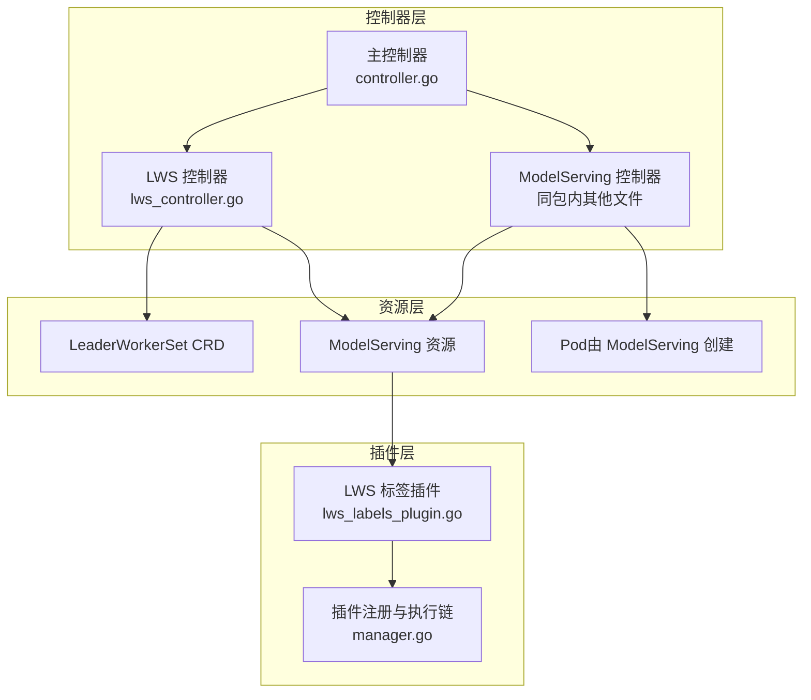
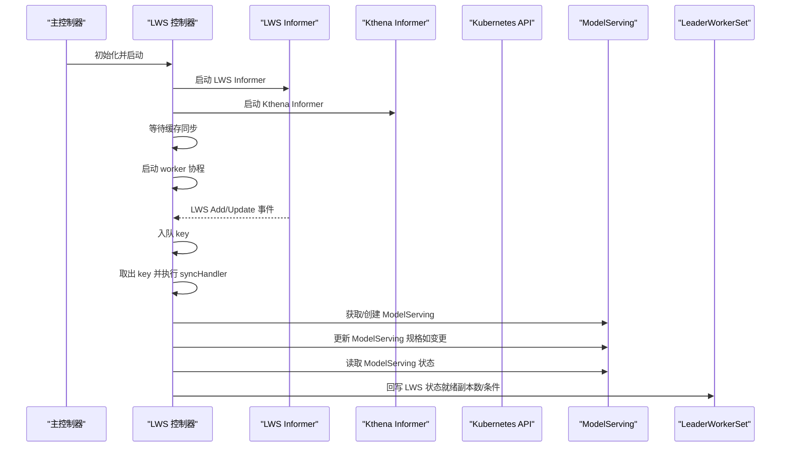
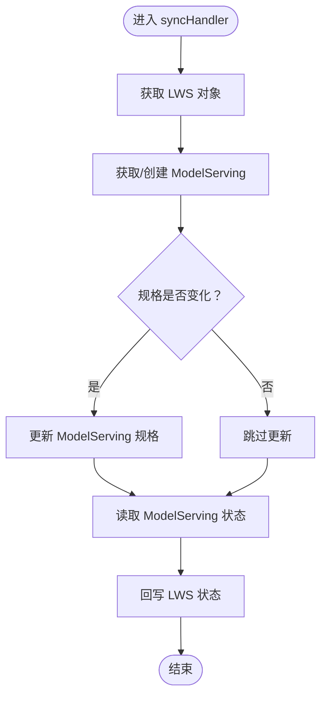
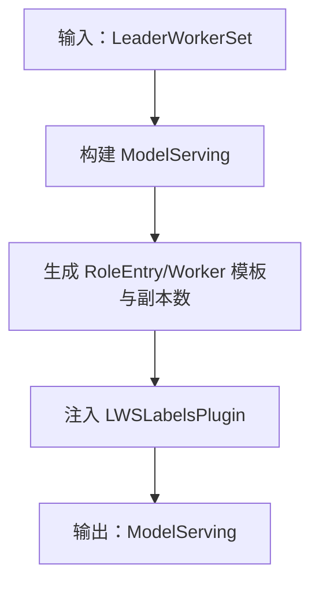
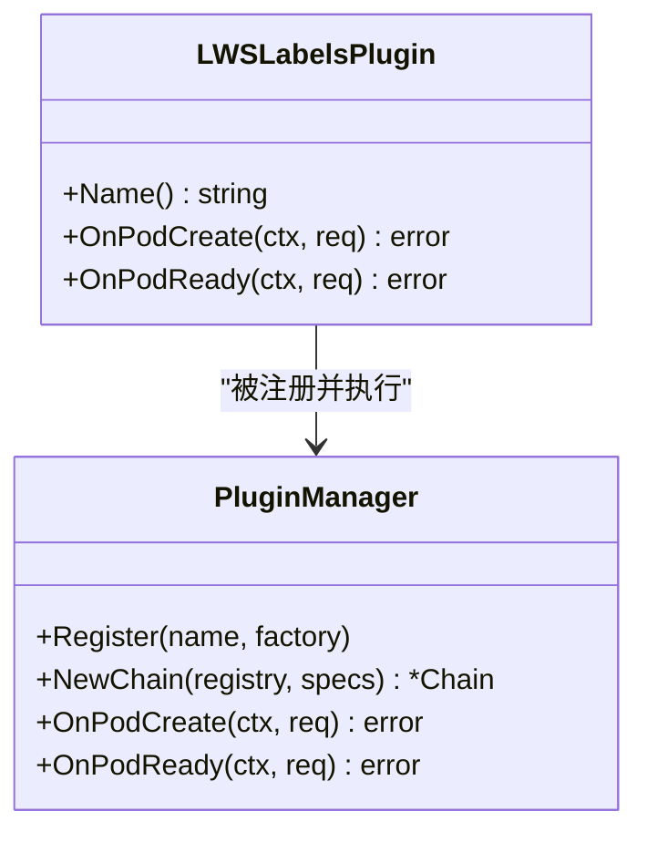
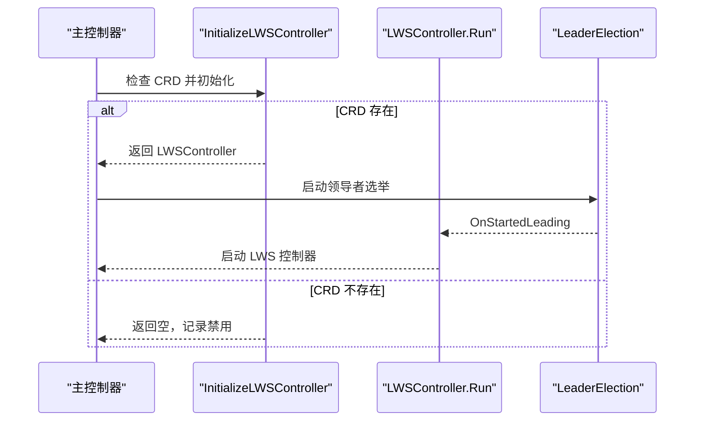
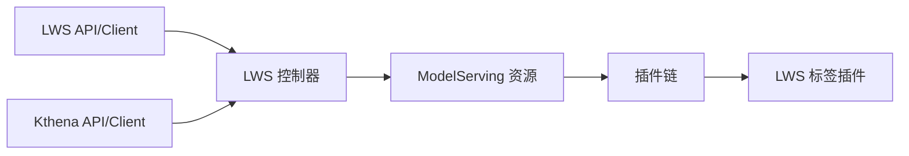

# LWS 控制器

<cite>
**本文引用的文件**
- [pkg/model-serving-controller/controller/lws_controller.go](file://pkg/model-serving-controller/controller/lws_controller.go)
- [pkg/model-serving-controller/controller/lws_controller_test.go](file://pkg/model-serving-controller/controller/lws_controller_test.go)
- [pkg/model-serving-controller/plugins/lws_labels_plugin.go](file://pkg/model-serving-controller/plugins/lws_labels_plugin.go)
- [pkg/model-serving-controller/plugins/manager.go](file://pkg/model-serving-controller/plugins/manager.go)
- [pkg/controller/controller.go](file://pkg/controller/controller.go)
- [docs/kthena/docs/user-guide/lws-integration.md](file://docs/kthena/docs/user-guide/lws-integration.md)
</cite>

## 目录
1. [简介](#简介)
2. [项目结构](#项目结构)
3. [核心组件](#核心组件)
4. [架构总览](#架构总览)
5. [详细组件分析](#详细组件分析)
6. [依赖关系分析](#依赖关系分析)
7. [性能考虑](#性能考虑)
8. [故障排查指南](#故障排查指南)
9. [结论](#结论)
10. [附录](#附录)

## 简介
本文件面向 LWS（LeaderWorkerSet）控制器，系统性阐述其在 Kthena 模型推理编排体系中的职责与实现机制。重点覆盖以下方面：
- 领导者选举与工作节点管理：通过 LWS CRD 描述多主机推理拓扑，控制器将其转换为 Kthena 内部的 ModelServing 资源，并注入标准标签以便识别领导者与工作者。
- 状态同步机制：将底层 Pod 的就绪状态聚合回 LWS 的 status 字段，便于使用标准 kubectl 命令观测进度。
- 架构设计：控制器采用 Informer + WorkQueue 的 Reconcile 循环，支持可选的 LeaderElection，确保高可用。
- 配置映射与最佳实践：基于官方用户指南，给出字段映射表、部署示例与排障建议。
- 性能调优与常见问题：结合实现细节，提出队列速率限制、缓存同步等待、日志级别等优化点。

## 项目结构
LWS 控制器位于模型推理子系统中，与 ModelServing 控制器、插件框架共同构成编排层。关键模块如下：
- 控制器入口与集成：在主控制器中按需初始化并启动 LWS 控制器。
- LWS 控制器：监听 LWS 资源，转换为 ModelServing 并回写 LWS 状态。
- 插件系统：内置 LWS 标签插件，为 Pod 注入 LWS 标签，支撑领导者/工作者识别。
- 用户指南：说明 LWS 与 ModelServing 的映射关系、部署流程与排障方法。

**图表来源**
- [pkg/controller/controller.go:80-124](file://pkg/controller/controller.go#L80-L124)
- [pkg/model-serving-controller/controller/lws_controller.go:47-74](file://pkg/model-serving-controller/controller/lws_controller.go#L47-L74)
- [pkg/model-serving-controller/plugins/lws_labels_plugin.go:34-46](file://pkg/model-serving-controller/plugins/lws_labels_plugin.go#L34-L46)
- [pkg/model-serving-controller/plugins/manager.go:34-80](file://pkg/model-serving-controller/plugins/manager.go#L34-L80)

**章节来源**
- [pkg/controller/controller.go:80-124](file://pkg/controller/controller.go#L80-L124)
- [docs/kthena/docs/user-guide/lws-integration.md:1-27](file://docs/kthena/docs/user-guide/lws-integration.md#L1-L27)

## 核心组件
- LWSController：负责监听 LWS 事件、构建/更新 ModelServing、回写 LWS 状态。
- LWSLabelsPlugin：为 Pod 注入 LWS 标签（SetName、GroupIndex、WorkerIndex、GroupUniqueHash），用于识别领导者与工作者。
- PluginManager：插件注册与执行链，按作用域与目标顺序执行插件钩子。
- 主控制器集成：按配置启用 LWS 支持，检查 CRD 存在性，初始化并启动控制器。

**章节来源**
- [pkg/model-serving-controller/controller/lws_controller.go:76-89](file://pkg/model-serving-controller/controller/lws_controller.go#L76-L89)
- [pkg/model-serving-controller/plugins/lws_labels_plugin.go:34-81](file://pkg/model-serving-controller/plugins/lws_labels_plugin.go#L34-L81)
- [pkg/model-serving-controller/plugins/manager.go:34-112](file://pkg/model-serving-controller/plugins/manager.go#L34-L112)
- [pkg/controller/controller.go:89-95](file://pkg/controller/controller.go#L89-L95)

## 架构总览
LWS 控制器的运行时架构围绕“Reconcile 循环 + Informer + WorkQueue”展开：
- 初始化阶段：检测 LWS CRD 是否存在；若存在则创建 LWS 与 Kthena Informer，构造 LWSController。
- 运行阶段：启动 Informer 缓存同步；启动多个 worker 协程从队列取任务；每个任务调用 syncHandler 完成一次 Reconcile。
- Reconcile 流程：根据 LWS 规范生成或更新 ModelServing；随后读取 ModelServing 的状态，聚合后写回 LWS 状态。
- 插件链：ModelServing 在创建 Pod 时触发插件链，LWSLabelsPlugin 注入 LWS 标签，便于上层路由与调度识别。

**图表来源**
- [pkg/model-serving-controller/controller/lws_controller.go:147-171](file://pkg/model-serving-controller/controller/lws_controller.go#L147-L171)
- [pkg/model-serving-controller/controller/lws_controller.go:202-250](file://pkg/model-serving-controller/controller/lws_controller.go#L202-L250)
- [pkg/controller/controller.go:111-118](file://pkg/controller/controller.go#L111-L118)

## 详细组件分析

### LWSController：Reconcile 与状态同步
- 事件监听与入队：对 LWS 的 Add/Update 事件进行入队；对 ModelServing 的变更事件进行反向追踪，定位对应的 LWS 并入队。
- Reconcile 步骤：
  1) 若对应 ModelServing 不存在则创建；若已存在则比较规格差异并按需更新。
  2) 重新获取 ModelServing 的最新状态，计算并回写 LWS 的 status 字段（副本总数、就绪副本数等）。
- 错误处理：对单个 key 的重试采用指数退避的限速队列；异常统一记录日志并继续处理下一个任务。

**图表来源**
- [pkg/model-serving-controller/controller/lws_controller.go:202-250](file://pkg/model-serving-controller/controller/lws_controller.go#L202-L250)

**章节来源**
- [pkg/model-serving-controller/controller/lws_controller.go:117-144](file://pkg/model-serving-controller/controller/lws_controller.go#L117-L144)
- [pkg/model-serving-controller/controller/lws_controller.go:147-200](file://pkg/model-serving-controller/controller/lws_controller.go#L147-L200)
- [pkg/model-serving-controller/controller/lws_controller.go:202-250](file://pkg/model-serving-controller/controller/lws_controller.go#L202-L250)

### LWS 规格到 ModelServing 的转换
- 复制元信息：名称、命名空间、OwnerReference 指向 LWS。
- 规格映射：
  - replicas → ModelServing.spec.replicas
  - leaderWorkerTemplate.leaderTemplate → Role.EntryTemplate（若为空则回退到 workerTemplate）
  - leaderWorkerTemplate.workerTemplate → Role.WorkerTemplate
  - leaderWorkerTemplate.size → WorkerReplicas = max(size-1, 0)
  - startupPolicy → 启动策略（映射到内部启动策略）
- 插件注入：自动添加 LWSLabelsPlugin，用于为 Pod 注入 LWS 标签。

**图表来源**
- [pkg/model-serving-controller/controller/lws_controller.go:295-364](file://pkg/model-serving-controller/controller/lws_controller.go#L295-L364)

**章节来源**
- [pkg/model-serving-controller/controller/lws_controller.go:295-364](file://pkg/model-serving-controller/controller/lws_controller.go#L295-L364)
- [docs/kthena/docs/user-guide/lws-integration.md:28-52](file://docs/kthena/docs/user-guide/lws-integration.md#L28-L52)

### LWSLabelsPlugin：领导者/工作者标签注入
- 作用时机：在 Pod 创建时执行，确保 Pod 具备 LWS 标签。
- 标签内容：
  - SetNameLabelKey：所属 LWS 名称
  - GroupIndexLabelKey：组索引
  - WorkerIndexLabelKey：工作者序号（从 Pod 名称推断）
  - GroupUniqueHashLabelKey：组唯一哈希
- 执行条件：仅当 Pod 所属 ModelServing 的 OwnerReference 指向 LWS 时生效。

**图表来源**
- [pkg/model-serving-controller/plugins/lws_labels_plugin.go:34-81](file://pkg/model-serving-controller/plugins/lws_labels_plugin.go#L34-L81)
- [pkg/model-serving-controller/plugins/manager.go:34-112](file://pkg/model-serving-controller/plugins/manager.go#L34-L112)

**章节来源**
- [pkg/model-serving-controller/plugins/lws_labels_plugin.go:50-81](file://pkg/model-serving-controller/plugins/lws_labels_plugin.go#L50-L81)
- [pkg/model-serving-controller/plugins/manager.go:60-112](file://pkg/model-serving-controller/plugins/manager.go#L60-L112)

### 主控制器集成与领导者选举
- LWS 支持按需启用：若集群存在 LWS CRD，则初始化 LWS 控制器并启动；否则记录日志并跳过。
- 控制器启动：ModelServing 控制器与 LWS 控制器分别独立启动；LWS 控制器固定使用 1 个 worker。
- 领导者选举：主控制器支持基于 Lease 的领导者选举，确保多实例部署时只有一个实例处于领导状态。

**图表来源**
- [pkg/controller/controller.go:89-95](file://pkg/controller/controller.go#L89-L95)
- [pkg/controller/controller.go:126-139](file://pkg/controller/controller.go#L126-L139)
- [pkg/model-serving-controller/controller/lws_controller.go:47-74](file://pkg/model-serving-controller/controller/lws_controller.go#L47-L74)

**章节来源**
- [pkg/controller/controller.go:89-124](file://pkg/controller/controller.go#L89-L124)
- [pkg/model-serving-controller/controller/lws_controller.go:47-74](file://pkg/model-serving-controller/controller/lws_controller.go#L47-L74)

## 依赖关系分析
- 外部依赖：sigs.k8s.io/lws 提供 LeaderWorkerSet 类型与客户端，Kthena 通过 Informer 监听其资源。
- 内部依赖：LWS 控制器依赖 Kthena 的 ModelServing 类型与客户端；插件系统通过注册表统一管理内置插件。
- 控制器耦合：LWS 控制器与 ModelServing 控制器解耦，通过 Informer 与状态回写实现松耦合协作。

**图表来源**
- [pkg/model-serving-controller/controller/lws_controller.go:35-44](file://pkg/model-serving-controller/controller/lws_controller.go#L35-L44)
- [pkg/model-serving-controller/plugins/manager.go:34-80](file://pkg/model-serving-controller/plugins/manager.go#L34-L80)
- [pkg/model-serving-controller/plugins/lws_labels_plugin.go:34-46](file://pkg/model-serving-controller/plugins/lws_labels_plugin.go#L34-L46)

**章节来源**
- [pkg/model-serving-controller/controller/lws_controller.go:35-44](file://pkg/model-serving-controller/controller/lws_controller.go#L35-L44)
- [pkg/model-serving-controller/plugins/manager.go:34-80](file://pkg/model-serving-controller/plugins/manager.go#L34-L80)

## 性能考虑
- 队列与重试：使用带速率限制的队列，对失败的任务进行指数退避重试，避免瞬时错误导致的级联放大。
- Informer 缓存：启动两个 Informer 并等待缓存同步，减少首次查询的延迟与 API 压力。
- 日志级别：在事件处理中使用较低日志级别（如 V(4)）记录对象处理细节，便于排障但不干扰生产日志噪声。
- 工作线程：LWS 控制器默认 1 个工作线程，适合 LWS 资源规模较小的场景；如需提升吞吐，可在部署层面增加实例数量（受领导者选举保护）。

**章节来源**
- [pkg/model-serving-controller/controller/lws_controller.go:111-115](file://pkg/model-serving-controller/controller/lws_controller.go#L111-L115)
- [pkg/model-serving-controller/controller/lws_controller.go:156-160](file://pkg/model-serving-controller/controller/lws_controller.go#L156-L160)
- [pkg/model-serving-controller/controller/lws_controller.go:276-278](file://pkg/model-serving-controller/controller/lws_controller.go#L276-L278)

## 故障排查指南
- LWS CRD 未安装：若返回“LWS 支持禁用”，请先安装 LWS CRD。
- 规格映射错误：检查 LWS 的 replicas、size、leaderTemplate/workerTemplate 是否符合预期；可通过对比 ModelServing 的生成结果定位问题。
- 状态不同步：确认 ModelServing 的状态已更新，再检查 LWS 状态回写是否成功；必要时查看控制器日志。
- Pod 标签缺失：若路由/调度无法识别领导者/工作者，请检查 LWSLabelsPlugin 是否被正确注入标签。
- 调度资源不足：若 LWS 不前进，检查 GPU/CPU/内存请求是否满足集群能力。

**章节来源**
- [pkg/model-serving-controller/controller/lws_controller.go:52-58](file://pkg/model-serving-controller/controller/lws_controller.go#L52-L58)
- [docs/kthena/docs/user-guide/lws-integration.md:188-192](file://docs/kthena/docs/user-guide/lws-integration.md#L188-L192)

## 结论
LWS 控制器通过“规格转换 + 状态回写 + 插件注入”的方式，将标准 LWS 资源无缝对接到 Kthena 编排体系，既保持了 LWS 的多主机推理表达能力，又继承了 Kthena 的路由与扩展能力。其设计遵循 Kubernetes 控制器模式，具备良好的可维护性与可扩展性。建议在生产环境中配合领导者选举与合理的日志级别，确保稳定性与可观测性。

## 附录

### 配置映射与部署示例
- 规格映射（LWS → ModelServing）
  - metadata.name → ModelServing 名称
  - spec.replicas → ModelServing.spec.replicas
  - spec.leaderWorkerTemplate.leaderTemplate → Role.EntryTemplate（为空时回退 workerTemplate）
  - spec.leaderWorkerTemplate.workerTemplate → Role.WorkerTemplate
  - spec.leaderWorkerTemplate.size → WorkerReplicas = max(size-1, 0)
  - spec.startupPolicy → 启动策略映射
- 状态映射（ModelServing → LWS）
  - 就绪组数 → status.readyReplicas
  - 组总数 → status.replicas
  - 条件汇总 → status.conditions

**章节来源**
- [docs/kthena/docs/user-guide/lws-integration.md:28-52](file://docs/kthena/docs/user-guide/lws-integration.md#L28-L52)

### 最佳实践
- 使用标准 LWS CRD 定义推理拓扑，无需额外安装 LWS 控制器。
- 在 LWS 中明确 leaderTemplate 与 workerTemplate，确保 Entry/Worker 的职责清晰。
- 关注资源请求与限制，确保集群可满足调度需求。
- 通过 kubectl 查看 LWS 状态，结合控制器日志进行排障。

**章节来源**
- [docs/kthena/docs/user-guide/lws-integration.md:1-27](file://docs/kthena/docs/user-guide/lws-integration.md#L1-L27)
- [docs/kthena/docs/user-guide/lws-integration.md:57-64](file://docs/kthena/docs/user-guide/lws-integration.md#L57-L64)