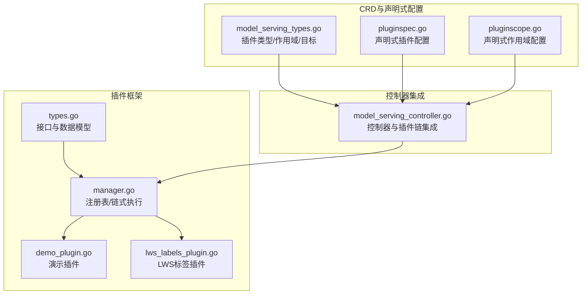
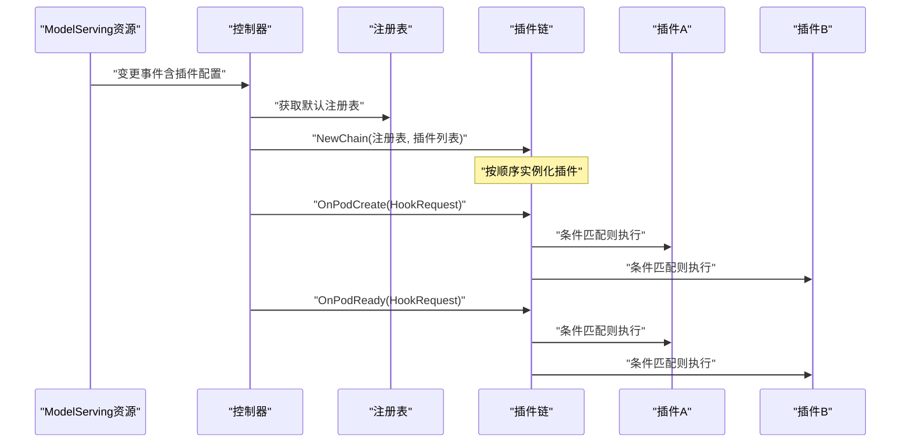
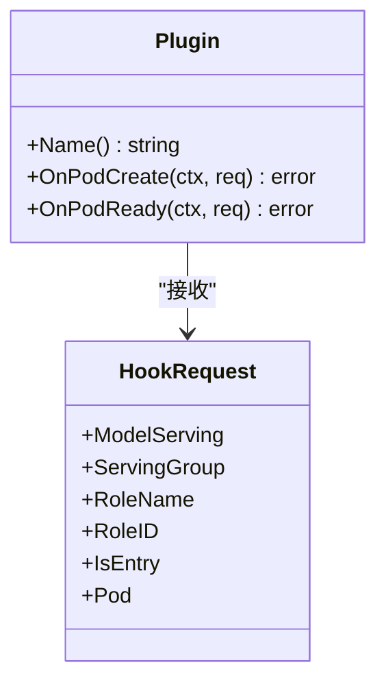
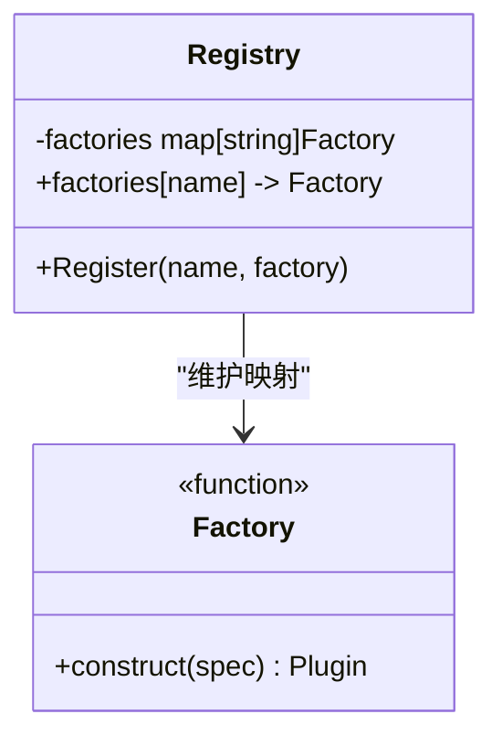
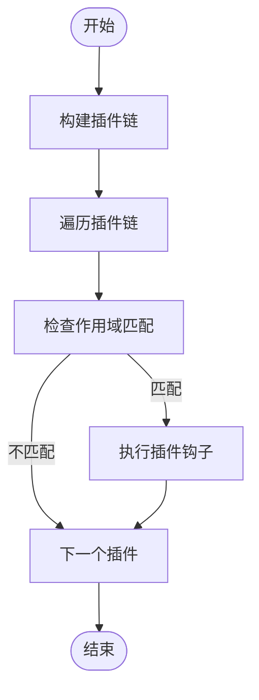
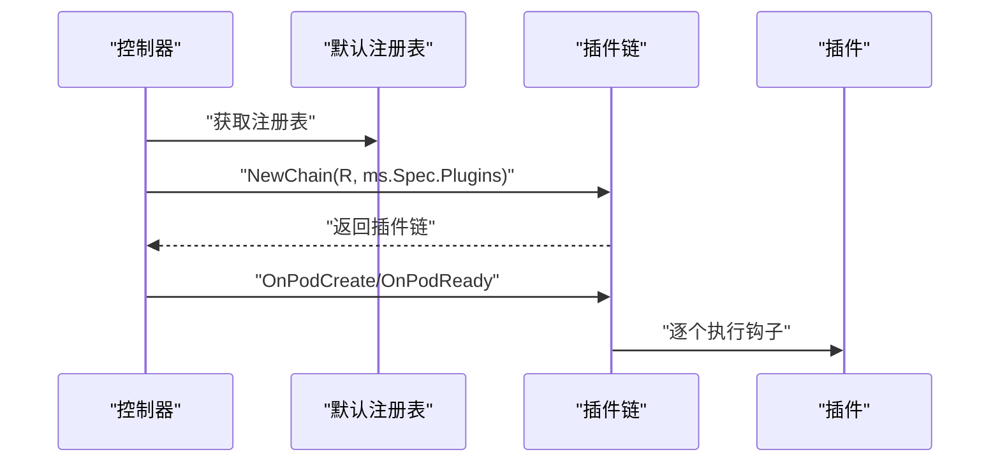
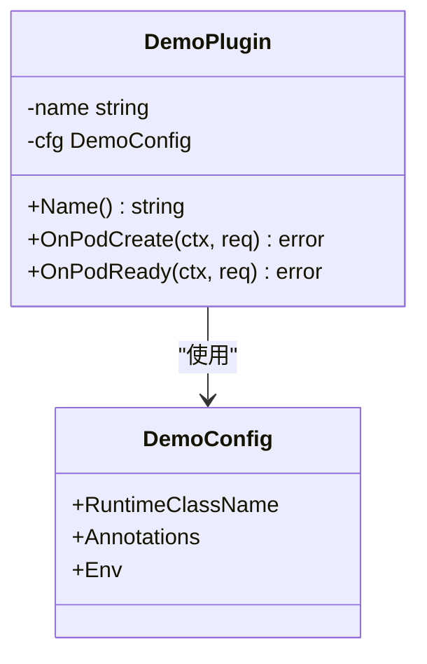
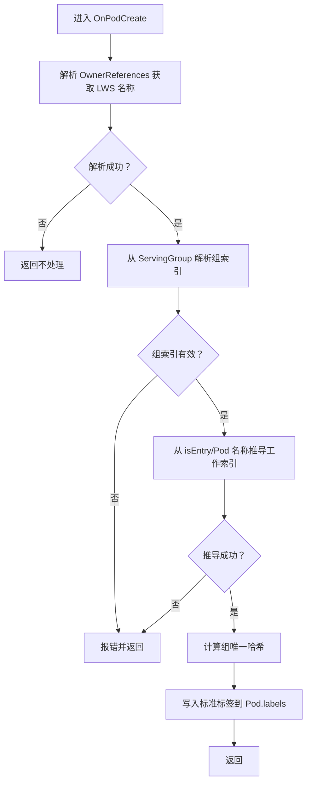
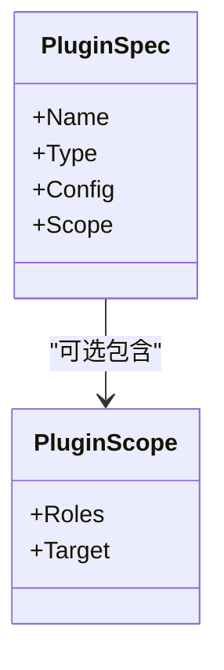

# 插件框架

<cite>
**本文引用的文件**
- [types.go](file://pkg/model-serving-controller/plugins/types.go)
- [manager.go](file://pkg/model-serving-controller/plugins/manager.go)
- [demo_plugin.go](file://pkg/model-serving-controller/plugins/demo_plugin.go)
- [lws_labels_plugin.go](file://pkg/model-serving-controller/plugins/lws_labels_plugin.go)
- [model_serving_controller.go](file://pkg/model-serving-controller/controller/model_serving_controller.go)
- [model_serving_types.go](file://pkg/apis/workload/v1alpha1/model_serving_types.go)
- [pluginspec.go](file://client-go/applyconfiguration/workload/v1alpha1/pluginspec.go)
- [pluginscope.go](file://client-go/applyconfiguration/workload/v1alpha1/pluginscope.go)
</cite>

## 目录
1. [简介](#简介)
2. [项目结构](#项目结构)
3. [核心组件](#核心组件)
4. [架构总览](#架构总览)
5. [组件详解](#组件详解)
6. [依赖关系分析](#依赖关系分析)
7. [性能考量](#性能考量)
8. [故障排查指南](#故障排查指南)
9. [结论](#结论)
10. [附录](#附录)

## 简介
本文件系统性阐述模型服务控制器（ModelServing Controller）的插件框架：从整体架构与设计理念出发，覆盖插件注册机制、生命周期管理、扩展点设计；深入解析插件管理器的插件发现、加载、初始化与执行流程；明确插件接口定义与实现规范；并以内置演示插件与LWS标准标签插件为例，说明具体实现与使用方式。最后提供插件开发指南、最佳实践、调试技巧与性能优化建议。

## 项目结构
插件框架位于模型服务控制器子模块中，围绕以下关键文件组织：
- 接口与数据模型：定义插件接口、钩子请求上下文、插件类型与作用域等
- 管理器：负责插件注册表、链式编排、按作用域筛选与执行
- 内置插件：演示插件（修改运行时类名、注解、环境变量）与LWS标签插件（为LeaderWorkerSet派生标签）
- 控制器集成：在控制器中构建插件链并在Pod生命周期钩子中调用
- CRD与声明式配置：ModelServing 的插件字段、插件类型、作用域与目标等

**图表来源**
- [types.go:27-44](file://pkg/model-serving-controller/plugins/types.go#L27-L44)
- [manager.go:30-147](file://pkg/model-serving-controller/plugins/manager.go#L30-L147)
- [demo_plugin.go:28-88](file://pkg/model-serving-controller/plugins/demo_plugin.go#L28-L88)
- [lws_labels_plugin.go:34-112](file://pkg/model-serving-controller/plugins/lws_labels_plugin.go#L34-L112)
- [model_serving_controller.go:104-171](file://pkg/model-serving-controller/controller/model_serving_controller.go#L104-L171)
- [model_serving_types.go:70-115](file://pkg/apis/workload/v1alpha1/model_serving_types.go#L70-L115)
- [pluginspec.go:26-71](file://client-go/applyconfiguration/workload/v1alpha1/pluginspec.go#L26-L71)
- [pluginscope.go:25-54](file://client-go/applyconfiguration/workload/v1alpha1/pluginscope.go#L25-L54)

**章节来源**
- [types.go:27-44](file://pkg/model-serving-controller/plugins/types.go#L27-L44)
- [manager.go:30-147](file://pkg/model-serving-controller/plugins/manager.go#L30-L147)
- [model_serving_controller.go:104-171](file://pkg/model-serving-controller/controller/model_serving_controller.go#L104-L171)
- [model_serving_types.go:70-115](file://pkg/apis/workload/v1alpha1/model_serving_types.go#L70-L115)
- [pluginspec.go:26-71](file://client-go/applyconfiguration/workload/v1alpha1/pluginspec.go#L26-L71)
- [pluginscope.go:25-54](file://client-go/applyconfiguration/workload/v1alpha1/pluginscope.go#L25-L54)

## 核心组件
- 插件接口与钩子
  - 插件需实现名称查询与两个生命周期钩子：OnPodCreate（创建前）、OnPodReady（就绪后）
  - 钩子接收上下文与HookRequest，后者携带所属ModelServing、角色信息、是否入口Pod以及待变更的Pod对象
- 注册表与工厂
  - Registry维护“插件名 -> 工厂函数”的映射，工厂根据PluginSpec构造具体插件实例
  - 默认注册表在包初始化阶段完成内置插件注册
- 插件链
  - Chain由多个已实例化的插件组成，按顺序执行
  - 支持基于作用域（角色白名单、目标类型）的条件执行
- 控制器集成
  - 控制器在需要时构建插件链，并在Pod生命周期事件中调用相应钩子

**章节来源**
- [types.go:27-44](file://pkg/model-serving-controller/plugins/types.go#L27-L44)
- [manager.go:30-147](file://pkg/model-serving-controller/plugins/manager.go#L30-L147)
- [model_serving_controller.go:104-171](file://pkg/model-serving-controller/controller/model_serving_controller.go#L104-L171)

## 架构总览
下图展示了插件框架在控制器中的工作流：控制器读取ModelServing的插件配置，构建插件链，随后在Pod创建与就绪事件中依次调用各插件的钩子。

**图表来源**
- [manager.go:59-112](file://pkg/model-serving-controller/plugins/manager.go#L59-L112)
- [model_serving_controller.go:2080-2080](file://pkg/model-serving-controller/controller/model_serving_controller.go#L2080-L2080)

**章节来源**
- [manager.go:59-112](file://pkg/model-serving-controller/plugins/manager.go#L59-L112)
- [model_serving_controller.go:2080-2080](file://pkg/model-serving-controller/controller/model_serving_controller.go#L2080-L2080)

## 组件详解

### 插件接口与生命周期
- 接口职责
  - Name：返回插件唯一标识
  - OnPodCreate：在控制器创建Pod之前调用，允许对HookRequest中的Pod进行原地变更
  - OnPodReady：在控制器观察到Pod运行且就绪后调用，用于后置处理
- 请求上下文
  - 包含所属ModelServing、ServingGroup、RoleName/RoleID、是否入口Pod、以及待变更的Pod对象

**图表来源**
- [types.go:27-44](file://pkg/model-serving-controller/plugins/types.go#L27-L44)

**章节来源**
- [types.go:27-44](file://pkg/model-serving-controller/plugins/types.go#L27-L44)

### 注册表与工厂
- 工厂函数
  - 通过工厂函数将PluginSpec转换为具体的插件实例
- 注册表
  - 提供注册与查询能力，默认注册表在包初始化时完成内置插件注册
- 类型约束
  - 当前仅支持BuiltIn类型的插件

**图表来源**
- [manager.go:30-46](file://pkg/model-serving-controller/plugins/manager.go#L30-L46)

**章节来源**
- [manager.go:30-46](file://pkg/model-serving-controller/plugins/manager.go#L30-L46)

### 插件链与作用域执行
- 插件链构建
  - 依据插件列表与注册表逐一实例化插件，若类型非BuiltIn或未注册则报错
- 条件执行
  - shouldRun根据插件作用域（角色白名单、目标类型）判断是否执行
  - 目标类型支持All/Entry/Worker；角色为空表示全部角色
- 执行顺序
  - 按插件在链中的顺序依次执行，任一插件失败即终止并返回错误

**图表来源**
- [manager.go:59-139](file://pkg/model-serving-controller/plugins/manager.go#L59-L139)

**章节来源**
- [manager.go:59-139](file://pkg/model-serving-controller/plugins/manager.go#L59-L139)

### 控制器集成与调用
- 控制器持有默认注册表，并在需要时调用NewChain生成插件链
- 在Pod生命周期事件中调用链上的钩子，实现对Pod的定制化处理

**图表来源**
- [model_serving_controller.go:104-171](file://pkg/model-serving-controller/controller/model_serving_controller.go#L104-L171)
- [manager.go:59-112](file://pkg/model-serving-controller/plugins/manager.go#L59-L112)

**章节来源**
- [model_serving_controller.go:104-171](file://pkg/model-serving-controller/controller/model_serving_controller.go#L104-L171)
- [manager.go:59-112](file://pkg/model-serving-controller/plugins/manager.go#L59-L112)

### 内置插件：演示插件
- 功能概述
  - 修改Pod的RuntimeClassName、注解与容器/Init容器环境变量
  - 通过DecodeJSON解析插件配置
- 实现要点
  - 在init中向默认注册表注册插件名与工厂
  - OnPodCreate中对Pod进行原地变更；OnPodReady为空操作
- 使用场景
  - 快速验证插件链执行效果与配置解析

**图表来源**
- [demo_plugin.go:28-88](file://pkg/model-serving-controller/plugins/demo_plugin.go#L28-L88)

**章节来源**
- [demo_plugin.go:28-88](file://pkg/model-serving-controller/plugins/demo_plugin.go#L28-L88)

### 内置插件：LWS标准标签插件
- 功能概述
  - 为LeaderWorkerSet派生的Pod设置标准标签：SetName、GroupIndex、WorkerIndex、GroupUniqueHash
- 实现要点
  - 从ModelServing的OwnerReferences中识别LeaderWorkerSet名称
  - 从ServingGroup与Pod名称推导组索引与工作节点索引
  - 对Pod标签进行原地更新
- 错误处理
  - 若无法解析索引或缺少必要信息，返回错误

**图表来源**
- [lws_labels_plugin.go:50-112](file://pkg/model-serving-controller/plugins/lws_labels_plugin.go#L50-L112)

**章节来源**
- [lws_labels_plugin.go:50-112](file://pkg/model-serving-controller/plugins/lws_labels_plugin.go#L50-L112)

### CRD与声明式配置
- 插件类型与目标
  - 类型：BuiltIn（当前唯一支持）
  - 目标：All/Entry/Worker（默认All）
- 作用域
  - Roles：角色白名单；Target：目标类型
- 声明式配置
  - 通过applyconfiguration生成的PluginSpec/PluginScope用于声明式应用

**图表来源**
- [model_serving_types.go:70-115](file://pkg/apis/workload/v1alpha1/model_serving_types.go#L70-L115)
- [pluginspec.go:26-71](file://client-go/applyconfiguration/workload/v1alpha1/pluginspec.go#L26-L71)
- [pluginscope.go:25-54](file://client-go/applyconfiguration/workload/v1alpha1/pluginscope.go#L25-L54)

**章节来源**
- [model_serving_types.go:70-115](file://pkg/apis/workload/v1alpha1/model_serving_types.go#L70-L115)
- [pluginspec.go:26-71](file://client-go/applyconfiguration/workload/v1alpha1/pluginspec.go#L26-L71)
- [pluginscope.go:25-54](file://client-go/applyconfiguration/workload/v1alpha1/pluginscope.go#L25-L54)

## 依赖关系分析
- 组件耦合
  - 控制器依赖默认注册表；插件链依赖注册表与插件实现
  - 插件实现依赖HookRequest上下文与Kubernetes API对象
- 外部依赖
  - Kubernetes API（Pod、OwnerReference、Label等）
  - LWS库（LeaderWorkerSet标签键与工具）

**图表来源**
- [manager.go:30-112](file://pkg/model-serving-controller/plugins/manager.go#L30-L112)
- [model_serving_controller.go:104-171](file://pkg/model-serving-controller/controller/model_serving_controller.go#L104-L171)

**章节来源**
- [manager.go:30-112](file://pkg/model-serving-controller/plugins/manager.go#L30-L112)
- [model_serving_controller.go:104-171](file://pkg/model-serving-controller/controller/model_serving_controller.go#L104-L171)

## 性能考量
- 插件链顺序与数量
  - 插件按顺序执行，链越长开销越大；建议仅启用必要插件并合理划分作用域
- 钩子内操作
  - OnPodCreate应避免重计算与昂贵I/O；尽量一次性完成所需变更
- 作用域过滤
  - 合理配置Roles与Target，减少不必要的插件执行
- 并发与批处理
  - 控制器层面的并发与批处理策略与插件执行相互独立，但应避免在插件中引入额外阻塞

## 故障排查指南
- 插件未生效
  - 检查插件类型是否为BuiltIn、插件名是否已在默认注册表注册
  - 核对作用域配置（Roles/Target）是否与实际Pod匹配
- 插件执行报错
  - 查看OnPodCreate/OnPodReady返回的错误信息，定位具体插件与原因
- LWS标签异常
  - 确认OwnerReferences中存在LeaderWorkerSet引用
  - 检查ServingGroup命名与Pod名称格式，确保可正确推导索引

**章节来源**
- [manager.go:66-78](file://pkg/model-serving-controller/plugins/manager.go#L66-L78)
- [lws_labels_plugin.go:87-112](file://pkg/model-serving-controller/plugins/lws_labels_plugin.go#L87-L112)

## 结论
该插件框架以简洁的接口与注册表机制为核心，结合声明式配置与作用域控制，实现了对Pod生命周期的可扩展定制。内置演示与LWS标签插件展示了典型用法。通过遵循接口规范、合理配置作用域与最小化钩子开销，可在保证稳定性的同时获得良好的可维护性与扩展性。

## 附录

### 开发自定义插件步骤
- 定义插件配置结构体（如需）
- 实现插件接口：Name、OnPodCreate、OnPodReady
- 在init中向默认注册表注册插件名与工厂
- 在ModelServing的plugins字段中声明插件（类型BuiltIn、可选配置与作用域）
- 部署并验证插件链执行效果

**章节来源**
- [demo_plugin.go:43-54](file://pkg/model-serving-controller/plugins/demo_plugin.go#L43-L54)
- [model_serving_types.go:70-115](file://pkg/apis/workload/v1alpha1/model_serving_types.go#L70-L115)

### 最佳实践
- 将插件逻辑聚焦于Pod对象的轻量级变更，避免复杂外部交互
- 使用作用域精确限定插件影响范围，降低副作用
- 在OnPodCreate中完成所有必要变更，避免在OnPodReady重复修改
- 为插件配置提供清晰的JSON Schema与示例，便于使用者理解

### 调试技巧
- 通过日志输出插件名称与执行结果，定位问题插件
- 使用最小化配置快速复现问题，逐步增加复杂度
- 在本地或测试集群中验证插件链顺序与作用域行为