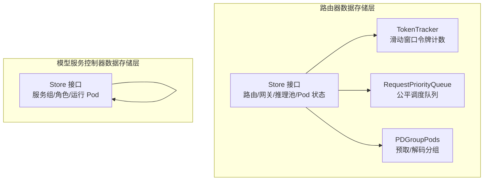
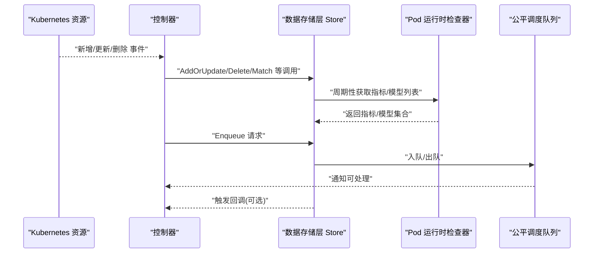
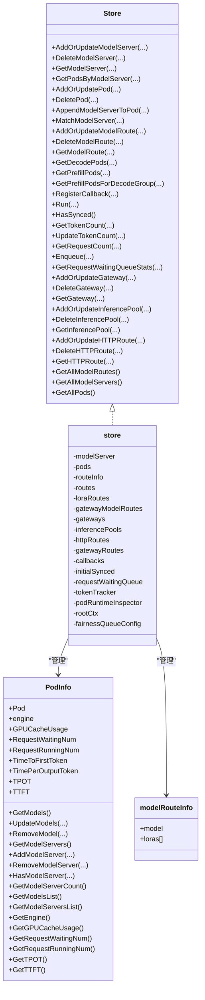
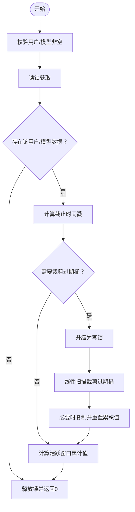
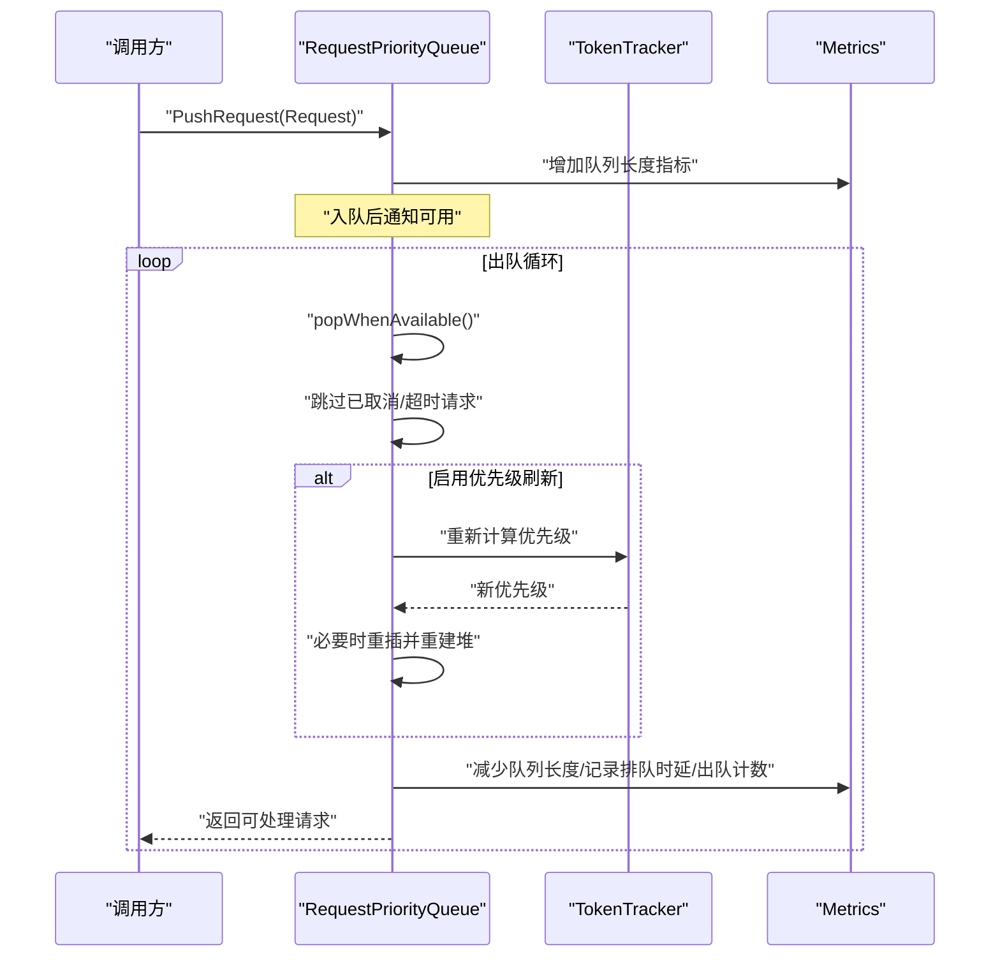
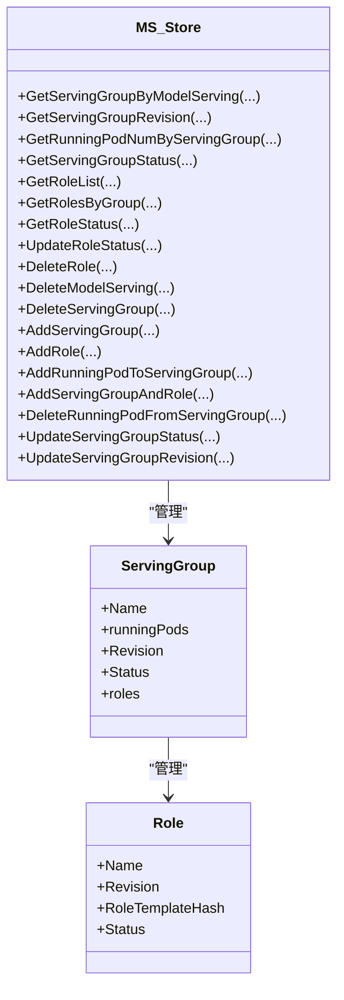
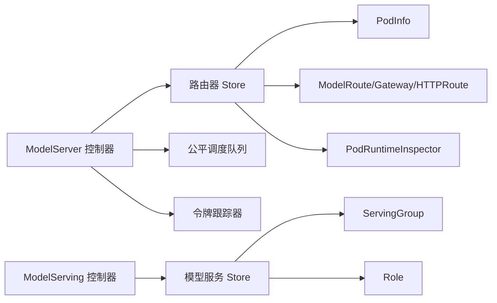

# 数据存储层

<cite>
**本文引用的文件**   
- [store.go](file://pkg/kthena-router/datastore/store.go)
- [token_tracker.go](file://pkg/kthena-router/datastore/token_tracker.go)
- [fairness_queue.go](file://pkg/kthena-router/datastore/fairness_queue.go)
- [pdgroup_pods.go](file://pkg/kthena-router/datastore/pdgroup_pods.go)
- [store.go](file://pkg/model-serving-controller/datastore/store.go)
- [store_test.go](file://pkg/kthena-router/datastore/store_test.go)
- [store_test.go](file://pkg/model-serving-controller/datastore/store_test.go)
- [modelserver_controller.go](file://pkg/kthena-router/controller/modelserver_controller.go)
- [model_serving_controller.go](file://pkg/model-serving-controller/controller/model_serving_controller.go)
- [fairness-scheduling.md](file://docs/kthena/docs/user-guide/fairness-scheduling.md)
</cite>

## 目录
1. [简介](#简介)
2. [项目结构](#项目结构)
3. [核心组件](#核心组件)
4. [架构总览](#架构总览)
5. [详细组件分析](#详细组件分析)
6. [依赖分析](#依赖分析)
7. [性能考虑](#性能考虑)
8. [故障排查指南](#故障排查指南)
9. [结论](#结论)
10. [附录](#附录)

## 简介
本技术文档聚焦于模型服务控制器的数据存储层，系统性阐述其核心架构与设计原则，涵盖状态跟踪机制、事件监听系统、缓存策略、存储接口设计、并发控制、状态管理（模型服务状态、服务组状态、角色状态）、事件监听与处理流程、配置与使用指南以及性能优化与故障排查建议。文档面向不同技术背景的读者，既提供高层概览，也包含代码级细节与可视化图示。

## 项目结构
数据存储层主要分布在两个子系统：
- 路由器数据存储层（kthena-router）：负责模型路由、网关、推理池、Pod 运行时指标与公平调度队列等。
- 模型服务控制器数据存储层（model-serving-controller）：负责服务组、角色、运行 Pod 的状态跟踪与查询。

图表来源
- [store.go:161-240](file://pkg/kthena-router/datastore/store.go#L161-L240)
- [token_tracker.go:34-64](file://pkg/kthena-router/datastore/token_tracker.go#L34-L64)
- [fairness_queue.go:31-116](file://pkg/kthena-router/datastore/fairness_queue.go#L31-L116)
- [pdgroup_pods.go:26-31](file://pkg/kthena-router/datastore/pdgroup_pods.go#L26-L31)
- [store.go:31-52](file://pkg/model-serving-controller/datastore/store.go#L31-L52)

章节来源
- [store.go:161-240](file://pkg/kthena-router/datastore/store.go#L161-L240)
- [store.go:31-52](file://pkg/model-serving-controller/datastore/store.go#L31-L52)

## 核心组件
- 存储接口与实现
  - 路由器数据存储接口：统一管理 ModelServer、Pod、ModelRoute、Gateway、InferencePool、HTTPRoute 等资源；支持匹配路由、PD 分组查询、回调注册、运行时指标与模型列表更新、令牌统计与请求排队等。
  - 模型服务控制器数据存储接口：统一管理服务组、角色、运行 Pod 的状态与查询。
- 状态跟踪与缓存
  - Pod 运行时指标与模型列表：周期性从后端引擎拉取并缓存在 PodInfo 中，提供只读访问与并发保护。
  - 滑动窗口令牌跟踪：按用户+模型维度维护令牌总量与请求数量，支持权重计算与过期清理。
- 公平调度队列
  - 基于优先队列的等待队列，支持容量门控或固定 QPS 出队；支持优先级刷新与堆重建以应对动态公平需求。
- PD 分组
  - 将 Pod 按标签归类到预取/解码分组，便于高效调度与配对。

章节来源
- [store.go:161-240](file://pkg/kthena-router/datastore/store.go#L161-L240)
- [store.go:31-52](file://pkg/model-serving-controller/datastore/store.go#L31-L52)
- [token_tracker.go:34-64](file://pkg/kthena-router/datastore/token_tracker.go#L34-L64)
- [fairness_queue.go:31-116](file://pkg/kthena-router/datastore/fairness_queue.go#L31-L116)
- [pdgroup_pods.go:26-31](file://pkg/kthena-router/datastore/pdgroup_pods.go#L26-L31)

## 架构总览
路由器数据存储层通过控制器事件驱动更新 Store，Store 内部以并发安全的数据结构维护资源映射与状态；同时通过回调系统通知上层模块；公平调度队列与令牌跟踪为流量治理提供支撑。

图表来源
- [modelserver_controller.go:178-200](file://pkg/kthena-router/controller/modelserver_controller.go#L178-L200)
- [store.go:410-430](file://pkg/kthena-router/datastore/store.go#L410-L430)
- [store.go:443-468](file://pkg/kthena-router/datastore/store.go#L443-L468)
- [fairness_queue.go:336-368](file://pkg/kthena-router/datastore/fairness_queue.go#L336-L368)

## 详细组件分析

### 组件一：路由器数据存储层 Store
- 设计要点
  - 并发安全：使用 sync.Map、互斥锁与原子布尔值保证读写一致性。
  - 资源聚合：统一管理 ModelServer、Pod、ModelRoute、Gateway、InferencePool、HTTPRoute。
  - 运行时指标：通过 PodRuntimeInspector 抽象，定期更新 PodInfo 中的 GPU 缓存、等待/运行中的请求、TPOT/TTFI 等指标与模型列表。
  - 公平调度：基于令牌跟踪与优先队列实现 per-model 公平排队。
  - 回调系统：注册资源事件回调，异步触发。
- 关键接口
  - 资源增删改查：AddOrUpdateModelServer/DeleteModelServer/GetModelServer/GetPodsByModelServer
  - Pod 生命周期：AddOrUpdatePod/DeletePod/AppendModelServerToPod
  - 路由匹配：MatchModelServer
  - PD 分组：GetDecodePods/GetPrefillPods/GetPrefillPodsForDecodeGroup
  - 公平调度：Enqueue/GetRequestWaitingQueueStats/GetTokenCount/UpdateTokenCount/GetRequestCount
  - 回调：RegisterCallback/Run/HasSynced
  - 网关/推理池/HTTPRoute：AddOrUpdateGateway/DeleteGateway/GetGateway/AddOrUpdateInferencePool/DeleteInferencePool/.../AddOrUpdateHTTPRoute/DeleteHTTPRoute/...
- 数据结构
  - PodInfo：封装 Pod、引擎类型、指标、模型集合、所属 ModelServer 集合及读写锁。
  - modelRouteInfo：记录 ModelRoute 的主模型与 LoRA 列表。
  - store：聚合各类资源映射、回调、令牌跟踪器、公平队列配置与上下文。

图表来源
- [store.go:161-240](file://pkg/kthena-router/datastore/store.go#L161-L240)
- [store.go:248-266](file://pkg/kthena-router/datastore/store.go#L248-L266)
- [store.go:268-278](file://pkg/kthena-router/datastore/store.go#L268-L278)
- [store.go:280-314](file://pkg/kthena-router/datastore/store.go#L280-L314)

章节来源
- [store.go:161-240](file://pkg/kthena-router/datastore/store.go#L161-L240)
- [store.go:248-266](file://pkg/kthena-router/datastore/store.go#L248-L266)
- [store.go:268-278](file://pkg/kthena-router/datastore/store.go#L268-L278)
- [store.go:280-314](file://pkg/kthena-router/datastore/store.go#L280-L314)

### 组件二：令牌跟踪器 TokenTracker
- 设计要点
  - 滑动窗口：按时间戳切片维护桶，支持过期裁剪与内存压缩。
  - 权重计算：输入/输出令牌分别加权，形成用户+模型维度的活跃用量。
  - 并发安全：读多写少场景下采用读写锁，必要时再升级为写锁。
- 关键接口
  - GetTokenCount/UpdateTokenCount/GetRequestCount
  - WithWindowSize/WithTokenWeights 配置项
- 复杂度
  - 查询/更新均摊 O(1)，最坏 O(B_u)（B_u 为用户维度桶数量）；空间 O(1) 额外开销（压缩后）。

图表来源
- [token_tracker.go:194-243](file://pkg/kthena-router/datastore/token_tracker.go#L194-L243)
- [token_tracker.go:245-307](file://pkg/kthena-router/datastore/token_tracker.go#L245-L307)
- [token_tracker.go:117-156](file://pkg/kthena-router/datastore/token_tracker.go#L117-L156)

章节来源
- [token_tracker.go:34-64](file://pkg/kthena-router/datastore/token_tracker.go#L34-L64)
- [token_tracker.go:194-243](file://pkg/kthena-router/datastore/token_tracker.go#L194-L243)
- [token_tracker.go:245-307](file://pkg/kthena-router/datastore/token_tracker.go#L245-L307)
- [token_tracker.go:117-156](file://pkg/kthena-router/datastore/token_tracker.go#L117-L156)

### 组件三：公平调度队列 RequestPriorityQueue
- 设计要点
  - 优先级：同用户 FIFO，不同用户按令牌用量排序；可选请求次数权重。
  - 两种模式：容量门控（semaphore）或固定 QPS（ticker）。
  - 动态优先级：支持出队时有限次刷新与堆重建，平衡公平与成本。
- 关键接口
  - NewRequestPriorityQueueWithConfig/Run/Close/Pop/Push
  - PushRequest/GetRequestWaitingQueueStats
- 配置项
  - MaxConcurrent/MaxQPS/MaxPriorityRefreshRetries/RebuildThreshold/TokenWeight/RequestNumWeight

图表来源
- [fairness_queue.go:183-199](file://pkg/kthena-router/datastore/fairness_queue.go#L183-L199)
- [fairness_queue.go:202-283](file://pkg/kthena-router/datastore/fairness_queue.go#L202-L283)
- [fairness_queue.go:336-368](file://pkg/kthena-router/datastore/fairness_queue.go#L336-L368)
- [fairness_queue.go:370-412](file://pkg/kthena-router/datastore/fairness_queue.go#L370-L412)

章节来源
- [fairness_queue.go:31-116](file://pkg/kthena-router/datastore/fairness_queue.go#L31-L116)
- [fairness_queue.go:183-199](file://pkg/kthena-router/datastore/fairness_queue.go#L183-L199)
- [fairness_queue.go:202-283](file://pkg/kthena-router/datastore/fairness_queue.go#L202-L283)
- [fairness_queue.go:336-368](file://pkg/kthena-router/datastore/fairness_queue.go#L336-L368)
- [fairness_queue.go:370-412](file://pkg/kthena-router/datastore/fairness_queue.go#L370-L412)

### 组件四：PD 分组容器 PDGroupPods
- 设计要点
  - 将 Pod 按标签分为预取/解码两类集合，支持并发安全的增删与查询。
  - 用于高效选择预取/解码配对，降低调度复杂度。
- 关键接口
  - AddDecodePod/AddPrefillPod/RemoveDecodePod/RemovePrefillPod/RemovePod/GetDecodePods/GetPrefillPods/IsEmpty

章节来源
- [pdgroup_pods.go:26-31](file://pkg/kthena-router/datastore/pdgroup_pods.go#L26-L31)
- [pdgroup_pods.go:41-67](file://pkg/kthena-router/datastore/pdgroup_pods.go#L41-L67)
- [pdgroup_pods.go:77-96](file://pkg/kthena-router/datastore/pdgroup_pods.go#L77-L96)

### 组件五：模型服务控制器数据存储层 Store
- 设计要点
  - 以模型服务为键，维护服务组、角色与运行 Pod 的状态与索引。
  - 提供并发安全的读写接口，支持排序与快照复制避免并发冲突。
- 关键接口
  - GetServingGroupByModelServing/GetServingGroupRevision/GetRunningPodNumByServingGroup
  - GetServingGroupStatus/GetRoleList/GetRolesByGroup/GetRoleStatus
  - UpdateRoleStatus/DeleteRole/DeleteModelServing/DeleteServingGroup
  - AddServingGroup/AddRole/AddRunningPodToServingGroup/AddServingGroupAndRole
  - DeleteRunningPodFromServingGroup/UpdateServingGroupStatus/UpdateServingGroupRevision

图表来源
- [store.go:31-52](file://pkg/model-serving-controller/datastore/store.go#L31-L52)
- [store.go:62-76](file://pkg/model-serving-controller/datastore/store.go#L62-L76)
- [store.go:70-76](file://pkg/model-serving-controller/datastore/store.go#L70-L76)

章节来源
- [store.go:31-52](file://pkg/model-serving-controller/datastore/store.go#L31-L52)
- [store.go:62-76](file://pkg/model-serving-controller/datastore/store.go#L62-L76)
- [store.go:104-127](file://pkg/model-serving-controller/datastore/store.go#L104-L127)
- [store.go:129-160](file://pkg/model-serving-controller/datastore/store.go#L129-L160)
- [store.go:162-187](file://pkg/model-serving-controller/datastore/store.go#L162-L187)

## 依赖分析
- 控制器与存储层耦合
  - 路由器控制器通过 informer 监听资源变化，将事件投递至工作队列，再调用 Store 执行状态更新与匹配。
  - 模型服务控制器同样通过 informer 与 Store 协作，维护服务组与角色状态。
- 外部依赖
  - Prometheus 客户端模型类型用于直方图指标的序列化与反序列化。
  - Istio sets 用于高效集合操作。
  - 后端引擎抽象（PodRuntimeInspector）用于指标与模型列表采集。

图表来源
- [modelserver_controller.go:75-112](file://pkg/kthena-router/controller/modelserver_controller.go#L75-L112)
- [model_serving_controller.go:143-171](file://pkg/model-serving-controller/controller/model_serving_controller.go#L143-L171)
- [store.go:135-149](file://pkg/kthena-router/datastore/store.go#L135-L149)
- [store.go:54-60](file://pkg/model-serving-controller/datastore/store.go#L54-L60)

章节来源
- [modelserver_controller.go:75-112](file://pkg/kthena-router/controller/modelserver_controller.go#L75-L112)
- [model_serving_controller.go:143-171](file://pkg/model-serving-controller/controller/model_serving_controller.go#L143-L171)
- [store.go:135-149](file://pkg/kthena-router/datastore/store.go#L135-L149)
- [store.go:54-60](file://pkg/model-serving-controller/datastore/store.go#L54-L60)

## 性能考虑
- 并发与锁粒度
  - 使用 sync.Map 与细粒度互斥锁（PodInfo、各资源映射）降低锁竞争；读多写少场景下优先读锁。
- 指标与模型列表更新
  - 定时轮询后端引擎指标，仅在必要时更新；Histogram 指标增量合并，避免全量覆盖。
- 公平调度
  - 默认 QPS 模式适合简单部署；高吞吐场景建议启用容量门控模式，将出队与实际并发绑定。
  - 合理设置优先级刷新重试次数与堆重建阈值，避免频繁重建带来的 CPU 开销。
- 令牌跟踪
  - 窗口大小与权重需结合业务特征调整；过小窗口导致频繁裁剪，过大窗口占用内存。
- PD 分组
  - 标签分类应尽量稳定，减少频繁移动导致的调度抖动。

## 故障排查指南
- Store 初始化与同步
  - 使用 HasSynced 判断初始同步是否完成；Run 启动后会周期性更新指标与模型列表。
- 公平调度异常
  - 检查环境变量配置（如最大并发、QPS、权重等），参考用户指南配置说明。
  - 观察队列长度与排队时延指标，确认是否因优先级刷新或堆重建导致延迟。
- 令牌跟踪异常
  - 确认用户/模型参数非空；检查窗口大小与权重是否合理；关注裁剪与压缩日志。
- 资源事件未生效
  - 确认控制器事件处理器已注册且工作队列正常；检查回调注册与触发逻辑。
- 测试验证
  - 参考单元测试用例，验证直方图更新、历史窗口裁剪、队列出队行为等关键路径。

章节来源
- [store.go:410-430](file://pkg/kthena-router/datastore/store.go#L410-L430)
- [store.go:487-489](file://pkg/kthena-router/datastore/store.go#L487-L489)
- [fairness-scheduling.md:118-162](file://docs/kthena/docs/user-guide/fairness-scheduling.md#L118-L162)
- [store_test.go:45-68](file://pkg/kthena-router/datastore/store_test.go#L45-L68)
- [store_test.go:70-118](file://pkg/kthena-router/datastore/store_test.go#L70-L118)
- [store_test.go:166-200](file://pkg/kthena-router/datastore/store_test.go#L166-L200)

## 结论
数据存储层通过清晰的接口设计、并发安全的数据结构与可配置的公平调度机制，有效支撑了模型服务与路由器的运行时状态管理与流量治理。结合控制器事件驱动与回调系统，实现了低耦合、高扩展的状态跟踪与事件处理能力。建议在生产环境中根据业务特征合理配置公平调度参数与令牌权重，并持续监控队列长度、排队时延与指标更新频率，以获得最佳性能与稳定性。

## 附录

### 配置与使用指南（路由器）
- 公平调度配置（环境变量）
  - ENABLE_FAIRNESS_SCHEDULING：全局开关
  - FAIRNESS_WINDOW_SIZE：滑动窗口时长
  - FAIRNESS_INPUT_TOKEN_WEIGHT/FAIRNESS_OUTPUT_TOKEN_WEIGHT：令牌权重
  - FAIRNESS_MAX_CONCURRENT/FAIRNESS_MAX_QPS：并发/速率限制
  - FAIRNESS_PRIORITY_REFRESH_RETRIES/FAIRNESS_REBUILD_THRESHOLD：优先级刷新与堆重建阈值
  - FAIRNESS_PRIORITY_TOKEN_WEIGHT/FAIRNESS_PRIORITY_REQUEST_NUM_WEIGHT：优先级评分权重
- 使用步骤
  - 创建 Store 实例并启动 Run；注册回调；在控制器中调用 AddOrUpdate/Match/Enqueue 等接口；通过 GetRequestWaitingQueueStats 获取队列统计。

章节来源
- [fairness-scheduling.md:118-162](file://docs/kthena/docs/user-guide/fairness-scheduling.md#L118-L162)
- [store.go:316-342](file://pkg/kthena-router/datastore/store.go#L316-L342)
- [store.go:410-430](file://pkg/kthena-router/datastore/store.go#L410-L430)
- [store.go:191-194](file://pkg/kthena-router/datastore/store.go#L191-L194)

### 配置与使用指南（模型服务控制器）
- 使用步骤
  - 在控制器中创建 datastore.New() 实例；通过 informer 注册事件；在事件处理函数中调用 Store 的增删改查接口；对外暴露查询接口供上层使用。
- 关键接口
  - AddServingGroup/AddRole/AddRunningPodToServingGroup/UpdateServingGroupStatus/UpdateServingGroupRevision/GetRoleList/GetRolesByGroup/UpdateRoleStatus 等。

章节来源
- [model_serving_controller.go:143-171](file://pkg/model-serving-controller/controller/model_serving_controller.go#L143-L171)
- [store.go:31-52](file://pkg/model-serving-controller/datastore/store.go#L31-L52)
- [store.go:104-127](file://pkg/model-serving-controller/datastore/store.go#L104-L127)
- [store.go:129-160](file://pkg/model-serving-controller/datastore/store.go#L129-L160)
- [store.go:162-187](file://pkg/model-serving-controller/datastore/store.go#L162-L187)