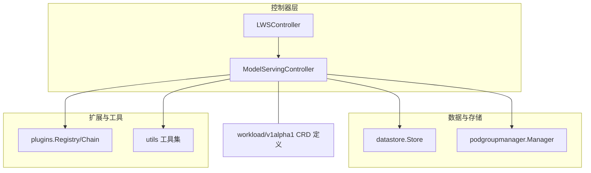
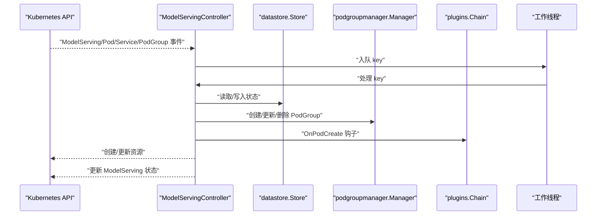
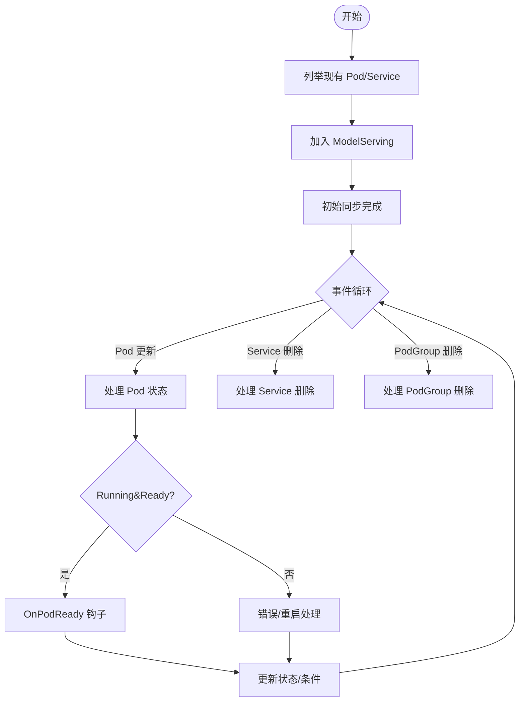
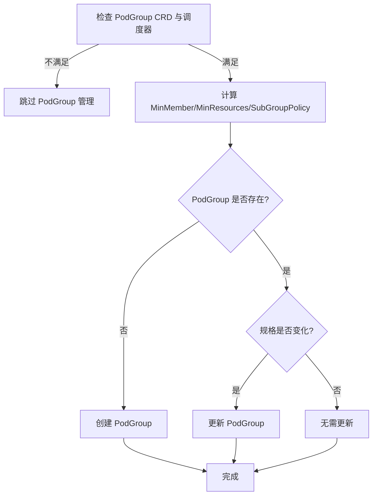
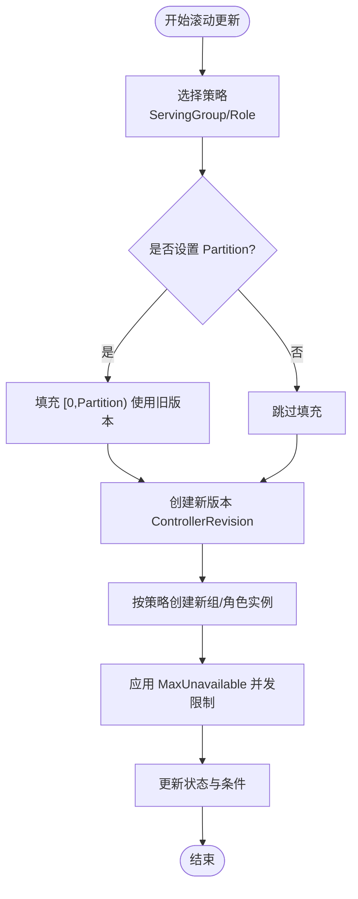
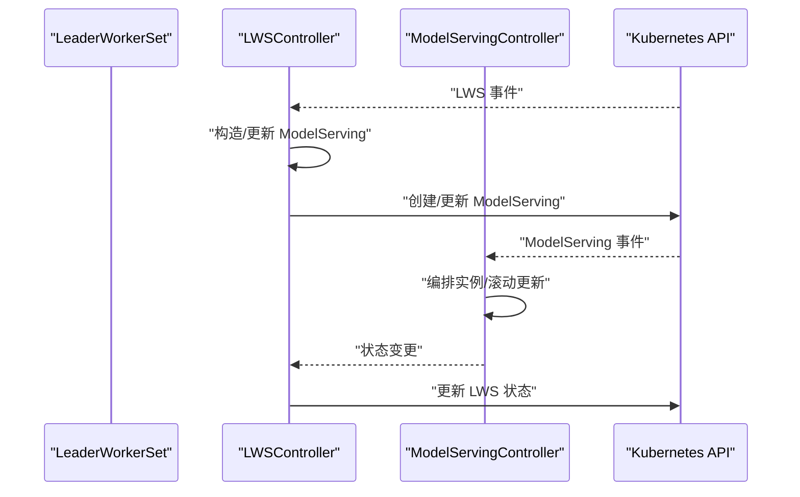
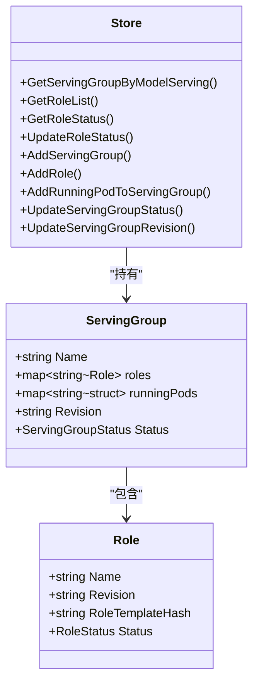
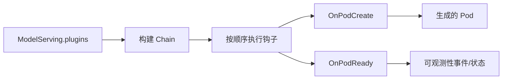
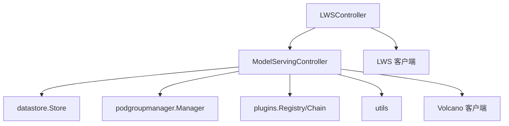

# 模型服务控制器

<cite>
**本文引用的文件**
- [pkg/model-serving-controller/controller/model_serving_controller.go](file://pkg/model-serving-controller/controller/model_serving_controller.go)
- [pkg/model-serving-controller/controller/lws_controller.go](file://pkg/model-serving-controller/controller/lws_controller.go)
- [pkg/model-serving-controller/datastore/store.go](file://pkg/model-serving-controller/datastore/store.go)
- [pkg/model-serving-controller/podgroupmanager/manager.go](file://pkg/model-serving-controller/podgroupmanager/manager.go)
- [pkg/model-serving-controller/plugins/manager.go](file://pkg/model-serving-controller/plugins/manager.go)
- [pkg/model-serving-controller/plugins/types.go](file://pkg/model-serving-controller/plugins/types.go)
- [pkg/model-serving-controller/plugins/demo_plugin.go](file://pkg/model-serving-controller/plugins/demo_plugin.go)
- [pkg/model-serving-controller/utils/utils.go](file://pkg/model-serving-controller/utils/utils.go)
- [pkg/apis/workload/v1alpha1/model_serving_types.go](file://pkg/apis/workload/v1alpha1/model_serving_types.go)
- [docs/kthena/docs/architecture/model-serving-controller.mdx](file://docs/kthena/docs/architecture/model-serving-controller.mdx)
- [docs/kthena/docs/user-guide/modelserving-plugin-framework.md](file://docs/kthena/docs/user-guide/modelserving-plugin-framework.md)
- [examples/model-serving/sample.yaml](file://examples/model-serving/sample.yaml)
</cite>

## 目录
1. [简介](#简介)
2. [项目结构](#项目结构)
3. [核心组件](#核心组件)
4. [架构总览](#架构总览)
5. [详细组件分析](#详细组件分析)
6. [依赖分析](#依赖分析)
7. [性能考虑](#性能考虑)
8. [故障排查指南](#故障排查指南)
9. [结论](#结论)
10. [附录](#附录)

## 简介
本技术文档围绕模型服务控制器展开，系统性阐述其职责边界与实现机制，覆盖以下主题：
- 模型生命周期管理：实例分组（ServingGroup）、角色（Role）、入口/工作节点（Entry/Worker）的生成与状态追踪
- PodGroup 管理：基于 Volcano 的 Gang 调度与网络拓扑策略集成
- 滚动更新策略：支持按 ServingGroup 或 Role 维度的滚动升级与分区保护
- LWS（LeaderWorkerSet）控制器：从 LWS 到 ModelServing 的映射、状态同步与领导者选举协同
- 数据存储层：内存态数据结构、索引键设计、事件监听与缓存策略
- 插件框架：插件注册、执行链、作用域控制与扩展点
- CRD 配置示例与最佳实践：部署、扩缩容、网络拓扑与调度器选择
- 性能调优与常见问题定位

## 项目结构
模型服务控制器位于 pkg/model-serving-controller 下，采用“按职责分层”的组织方式：
- controller：主控制器与 LWS 控制器
- datastore：内存态存储与查询接口
- podgroupmanager：PodGroup（Volcano）管理与 Gang 调度集成
- plugins：插件注册表、执行链与内置插件
- utils：通用工具函数（标签/索引、环境变量注入、条件计算等）
- apis/workload/v1alpha1：CRD 类型定义（ModelServing、RolloutStrategy、PluginSpec 等）

图表来源
- [pkg/model-serving-controller/controller/model_serving_controller.go:82-102](file://pkg/model-serving-controller/controller/model_serving_controller.go#L82-L102)
- [pkg/model-serving-controller/controller/lws_controller.go:77-89](file://pkg/model-serving-controller/controller/lws_controller.go#L77-L89)
- [pkg/model-serving-controller/datastore/store.go:31-52](file://pkg/model-serving-controller/datastore/store.go#L31-L52)
- [pkg/model-serving-controller/podgroupmanager/manager.go:58-72](file://pkg/model-serving-controller/podgroupmanager/manager.go#L58-L72)
- [pkg/model-serving-controller/plugins/manager.go:33-57](file://pkg/model-serving-controller/plugins/manager.go#L33-L57)
- [pkg/apis/workload/v1alpha1/model_serving_types.go:35-66](file://pkg/apis/workload/v1alpha1/model_serving_types.go#L35-L66)

章节来源
- [docs/kthena/docs/architecture/model-serving-controller.mdx:1-67](file://docs/kthena/docs/architecture/model-serving-controller.mdx#L1-L67)

## 核心组件
- ModelServingController：负责 ModelServing 资源的全生命周期编排，包括实例分组扩缩容、角色滚动更新、Headless Service 管理、状态上报与事件记录
- LWSController：当集群存在 LWS CRD 时启用，将 LWS 资源映射为 ModelServing，并同步状态
- datastore.Store：以内存为中心的状态机，维护 ServingGroup、Role、运行中 Pod 的索引与状态
- podgroupmanager.Manager：在启用 Volcano 时，为每个 ServingGroup 创建/更新/删除 PodGroup，支持 Gang 调度与网络拓扑子策略
- plugins：插件注册表与执行链，支持按角色与目标（Entry/Worker/All）作用域执行
- utils：提供标签索引、Pod 名称/环境变量生成、条件计算、分区与最大不可用数解析等

章节来源
- [pkg/model-serving-controller/controller/model_serving_controller.go:82-102](file://pkg/model-serving-controller/controller/model_serving_controller.go#L82-L102)
- [pkg/model-serving-controller/controller/lws_controller.go:77-89](file://pkg/model-serving-controller/controller/lws_controller.go#L77-L89)
- [pkg/model-serving-controller/datastore/store.go:31-52](file://pkg/model-serving-controller/datastore/store.go#L31-L52)
- [pkg/model-serving-controller/podgroupmanager/manager.go:58-72](file://pkg/model-serving-controller/podgroupmanager/manager.go#L58-L72)
- [pkg/model-serving-controller/plugins/manager.go:33-57](file://pkg/model-serving-controller/plugins/manager.go#L33-L57)
- [pkg/model-serving-controller/utils/utils.go:42-89](file://pkg/model-serving-controller/utils/utils.go#L42-L89)

## 架构总览
控制器通过 Informer 监听 Kubernetes 资源变更，入队后由工作线程逐个处理。核心流程如下：
- 监听 ModelServing、Pod、Service、PodGroup（可选）事件
- 计算期望副本数与当前状态，触发扩缩容或滚动更新
- 生成/更新 Headless Service，确保 Entry Pod 可发现
- 在启用 Volcano 时，为 ServingGroup 同步 PodGroup 规格与队列
- 执行插件链对 Pod 进行二次注入
- 更新 ModelServing 状态与条件

图表来源
- [pkg/model-serving-controller/controller/model_serving_controller.go:196-244](file://pkg/model-serving-controller/controller/model_serving_controller.go#L196-L244)
- [pkg/model-serving-controller/datastore/store.go:104-127](file://pkg/model-serving-controller/datastore/store.go#L104-L127)
- [pkg/model-serving-controller/podgroupmanager/manager.go:227-249](file://pkg/model-serving-controller/podgroupmanager/manager.go#L227-L249)
- [pkg/model-serving-controller/plugins/manager.go:83-112](file://pkg/model-serving-controller/plugins/manager.go#L83-L112)

## 详细组件分析

### 模型生命周期管理
- 实例分组（ServingGroup）与角色（Role）：控制器根据 ModelServing 的模板生成 Entry/Worker Pod，并为每个角色实例分配唯一 RoleID；通过标签索引快速定位资源
- Pod 生命周期：监听 Pod/Service/PodGroup 删除事件，清理运行中集合；对 Running/Ready、失败/重启场景分别处理
- Headless Service：为每个角色实例的入口 Pod 创建无头服务，便于跨 Pod 通信
- 条件与状态：根据进行中的分组、已更新分组与分区阈值设置 Available/Progressing/UpdateInProgress 条件

图表来源
- [pkg/model-serving-controller/controller/model_serving_controller.go:313-448](file://pkg/model-serving-controller/controller/model_serving_controller.go#L313-L448)
- [pkg/model-serving-controller/utils/utils.go:297-392](file://pkg/model-serving-controller/utils/utils.go#L297-L392)

章节来源
- [pkg/model-serving-controller/controller/model_serving_controller.go:249-624](file://pkg/model-serving-controller/controller/model_serving_controller.go#L249-L624)
- [pkg/model-serving-controller/utils/utils.go:238-270](file://pkg/model-serving-controller/utils/utils.go#L238-L270)

### PodGroup 管理与 Gang 调度
- 条件判断：仅当集群存在 PodGroup CRD 且调度器为 volcano 时启用
- 要求计算：汇总每个角色的最小成员数（Entry+Workers）、最小角色成员数、最小资源请求，用于 PodGroup 的 MinMember/MinResources/SubGroupPolicy
- 动态更新：当 ModelServing 变更时，比较并更新 PodGroup 规格；支持网络拓扑策略继承
- 清理逻辑：当移除网络拓扑或禁用 Gang 调度时，清理所有 PodGroup

图表来源
- [pkg/model-serving-controller/podgroupmanager/manager.go:251-261](file://pkg/model-serving-controller/podgroupmanager/manager.go#L251-L261)
- [pkg/model-serving-controller/podgroupmanager/manager.go:273-323](file://pkg/model-serving-controller/podgroupmanager/manager.go#L273-L323)
- [pkg/model-serving-controller/podgroupmanager/manager.go:425-460](file://pkg/model-serving-controller/podgroupmanager/manager.go#L425-L460)

章节来源
- [pkg/model-serving-controller/podgroupmanager/manager.go:50-210](file://pkg/model-serving-controller/podgroupmanager/manager.go#L50-L210)

### 滚动更新策略
- 支持两种策略：ServingGroupRollingUpdate（逐组更新）与 RoleRollingUpdate（逐角色更新）
- 分区保护：Partition 参数定义更新分界点，保证高序号组先更新，低序号组保持稳定
- 最大不可用：MaxUnavailable 控制并发度，支持绝对数或百分比
- 版本与修订：通过 ControllerRevision 记录模板快照，恢复或回滚时使用

图表来源
- [pkg/model-serving-controller/controller/model_serving_controller.go:549-571](file://pkg/model-serving-controller/controller/model_serving_controller.go#L549-L571)
- [pkg/model-serving-controller/controller/model_serving_controller.go:675-794](file://pkg/model-serving-controller/controller/model_serving_controller.go#L675-L794)
- [pkg/model-serving-controller/utils/utils.go:592-602](file://pkg/model-serving-controller/utils/utils.go#L592-L602)

章节来源
- [pkg/apis/workload/v1alpha1/model_serving_types.go:133-182](file://pkg/apis/workload/v1alpha1/model_serving_types.go#L133-L182)
- [pkg/model-serving-controller/utils/utils.go:417-480](file://pkg/model-serving-controller/utils/utils.go#L417-L480)

### LWS（LeaderWorkerSet）控制器
- 自检：启动前检测 LWS CRD 是否存在，不存在则不初始化
- 事件处理：监听 LWS 与 ModelServing 事件，将 LWS 的子资源变更映射到对应 ModelServing
- 映射规则：从 LWS 推导出对应的 ModelServing，复制副本数、模板与插件配置，注入内置 LWS 标签插件
- 状态同步：将 ModelServing 的可用副本数回写到 LWS 状态，保持与内部状态一致

图表来源
- [pkg/model-serving-controller/controller/lws_controller.go:47-74](file://pkg/model-serving-controller/controller/lws_controller.go#L47-L74)
- [pkg/model-serving-controller/controller/lws_controller.go:295-364](file://pkg/model-serving-controller/controller/lws_controller.go#L295-L364)
- [pkg/model-serving-controller/controller/lws_controller.go:366-378](file://pkg/model-serving-controller/controller/lws_controller.go#L366-L378)

章节来源
- [pkg/model-serving-controller/controller/lws_controller.go:76-200](file://pkg/model-serving-controller/controller/lws_controller.go#L76-L200)

### 数据存储层（datastore）
- 结构设计：以 NamespacedName 为外层键，ServingGroup 名称为中间键，Role 嵌套存储；运行中 Pod 以集合形式维护
- 查询接口：按 ModelServing 获取 ServingGroup 列表、按组获取角色列表、按组/角色/ID 获取状态、更新状态与修订
- 并发安全：读写锁保护，避免竞态；返回切片前进行深拷贝，防止外部修改影响内部状态
- 索引键：GroupName/RoleID 索引，加速按组/角色维度的查询

图表来源
- [pkg/model-serving-controller/datastore/store.go:31-102](file://pkg/model-serving-controller/datastore/store.go#L31-L102)
- [pkg/model-serving-controller/datastore/store.go:62-94](file://pkg/model-serving-controller/datastore/store.go#L62-L94)

章节来源
- [pkg/model-serving-controller/datastore/store.go:104-506](file://pkg/model-serving-controller/datastore/store.go#L104-L506)

### 插件框架
- 注册表：Registry 将插件名映射到工厂函数，支持多插件组合
- 执行链：Chain 按顺序执行 OnPodCreate/OnPodReady 钩子，支持按角色与目标（Entry/Worker/All）作用域过滤
- 内置插件：demo_plugin 展示如何注入 runtimeClassName、注解与环境变量
- 配置解码：统一使用 DecodeJSON 解析插件配置

图表来源
- [pkg/model-serving-controller/plugins/manager.go:60-80](file://pkg/model-serving-controller/plugins/manager.go#L60-L80)
- [pkg/model-serving-controller/plugins/manager.go:83-112](file://pkg/model-serving-controller/plugins/manager.go#L83-L112)
- [pkg/model-serving-controller/plugins/types.go:27-44](file://pkg/model-serving-controller/plugins/types.go#L27-L44)
- [pkg/model-serving-controller/plugins/demo_plugin.go:43-54](file://pkg/model-serving-controller/plugins/demo_plugin.go#L43-L54)

章节来源
- [docs/kthena/docs/user-guide/modelserving-plugin-framework.md:1-166](file://docs/kthena/docs/user-guide/modelserving-plugin-framework.md#L1-L166)

### CRD 配置示例与最佳实践
- 基础示例：展示多角色（prefill/decode）与 Worker 数量配置
- 插件使用：演示内置 demo-pod-tweaks 插件的配置与作用域
- 最佳实践建议：
  - 优先使用 role.entryTemplate/spec 与 role.workerTemplate/spec 直接配置；复杂跨域定制再引入插件
  - Gang 调度与网络拓扑需配合 Volcano 使用
  - 分区更新与最大不可用应结合业务 SLA 与资源容量评估

章节来源
- [examples/model-serving/sample.yaml:1-46](file://examples/model-serving/sample.yaml#L1-L46)
- [docs/kthena/docs/user-guide/modelserving-plugin-framework.md:110-166](file://docs/kthena/docs/user-guide/modelserving-plugin-framework.md#L110-L166)
- [pkg/apis/workload/v1alpha1/model_serving_types.go:35-182](file://pkg/apis/workload/v1alpha1/model_serving_types.go#L35-L182)

## 依赖分析
- 控制器依赖关系
  - ModelServingController 依赖 datastore、podgroupmanager、plugins、utils
  - LWSController 依赖 ModelServingController（通过事件回调）
- 外部依赖
  - Volcano PodGroup CRD 与客户端，用于 Gang 调度
  - LWS CRD 与客户端，用于 LWS 到 ModelServing 的映射
  - Kubernetes Informer/Workqueue 提供事件驱动与重试机制

图表来源
- [pkg/model-serving-controller/controller/model_serving_controller.go:104-171](file://pkg/model-serving-controller/controller/model_serving_controller.go#L104-L171)
- [pkg/model-serving-controller/controller/lws_controller.go:47-74](file://pkg/model-serving-controller/controller/lws_controller.go#L47-L74)

章节来源
- [pkg/model-serving-controller/podgroupmanager/manager.go:74-142](file://pkg/model-serving-controller/podgroupmanager/manager.go#L74-L142)
- [pkg/model-serving-controller/controller/lws_controller.go:91-145](file://pkg/model-serving-controller/controller/lws_controller.go#L91-L145)

## 性能考虑
- 缓存与索引
  - 通过 Informer 缓存与自定义索引（GroupName/RoleID）降低查询开销
  - datastore 返回切片前进行排序与拷贝，避免并发读写冲突
- 并发与限速
  - 工作队列采用指数退避与速率限制，避免雪崩效应
  - 批量操作（如创建 ControllerRevision、更新 PodGroup）尽量合并与去重
- 调度与资源
  - Gang 调度要求最小成员与资源聚合准确，避免频繁失败导致重试
  - 网络拓扑策略会增加调度约束，建议合理规划角色与副本数
- 插件执行
  - 插件链顺序执行，建议将轻量插件前置，耗时插件放在后方
  - 插件错误会导致重试，应确保插件幂等与快速失败

## 故障排查指南
- Pod 无法就绪
  - 检查 Pod 状态与容器重启计数；若处于错误或重启，控制器会进行错误处理与重建
  - 关注事件记录与条件状态，定位具体阶段（创建/就绪）
- Gang 调度失败
  - 确认 PodGroup CRD 是否安装、调度器是否为 volcano
  - 核对 MinMember/MinResources/SubGroupPolicy 是否与模板一致
- 滚动更新卡住
  - 检查 MaxUnavailable 与 Partition 设置是否合理
  - 查看条件 UpdateInProgress/Progressing 的消息，确认进行中的分组与已更新分组
- LWS 映射异常
  - 确认 LWS CRD 存在且控制器已初始化
  - 检查 LWS 与 ModelServing 的 OwnerReference 与标签一致性

章节来源
- [pkg/model-serving-controller/controller/model_serving_controller.go:313-448](file://pkg/model-serving-controller/controller/model_serving_controller.go#L313-L448)
- [pkg/model-serving-controller/podgroupmanager/manager.go:251-261](file://pkg/model-serving-controller/podgroupmanager/manager.go#L251-L261)
- [pkg/model-serving-controller/utils/utils.go:417-480](file://pkg/model-serving-controller/utils/utils.go#L417-L480)

## 结论
模型服务控制器通过清晰的分层设计与事件驱动机制，实现了对复杂推理服务的全生命周期管理。借助 PodGroup/Gang 调度、灵活的滚动更新策略、可扩展的插件框架以及完善的可观测性，能够在生产环境中稳定地支撑大规模模型推理任务。建议在实际部署中结合业务需求合理配置调度策略、分区更新与插件链，持续监控状态与事件，确保服务的高可用与高性能。

## 附录
- 相关文档
  - [模型服务控制器架构说明:1-67](file://docs/kthena/docs/architecture/model-serving-controller.mdx#L1-L67)
  - [模型服务插件框架用户指南:1-166](file://docs/kthena/docs/user-guide/modelserving-plugin-framework.md#L1-L166)
- 示例
  - [基础模型服务示例:1-46](file://examples/model-serving/sample.yaml#L1-L46)