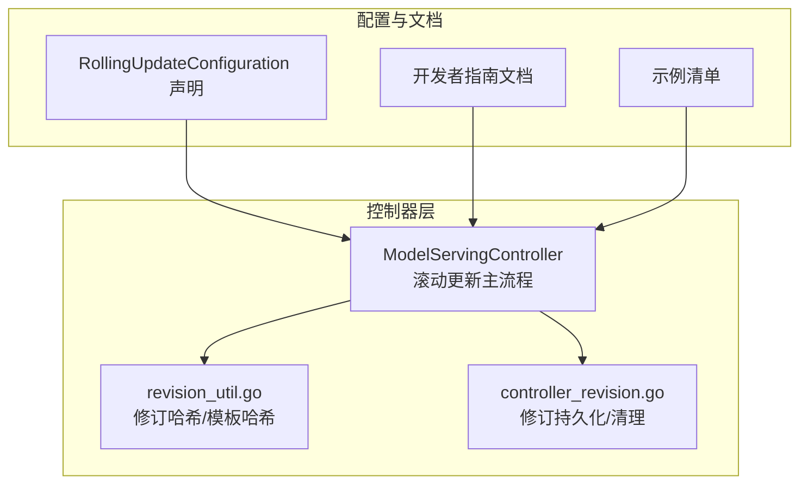
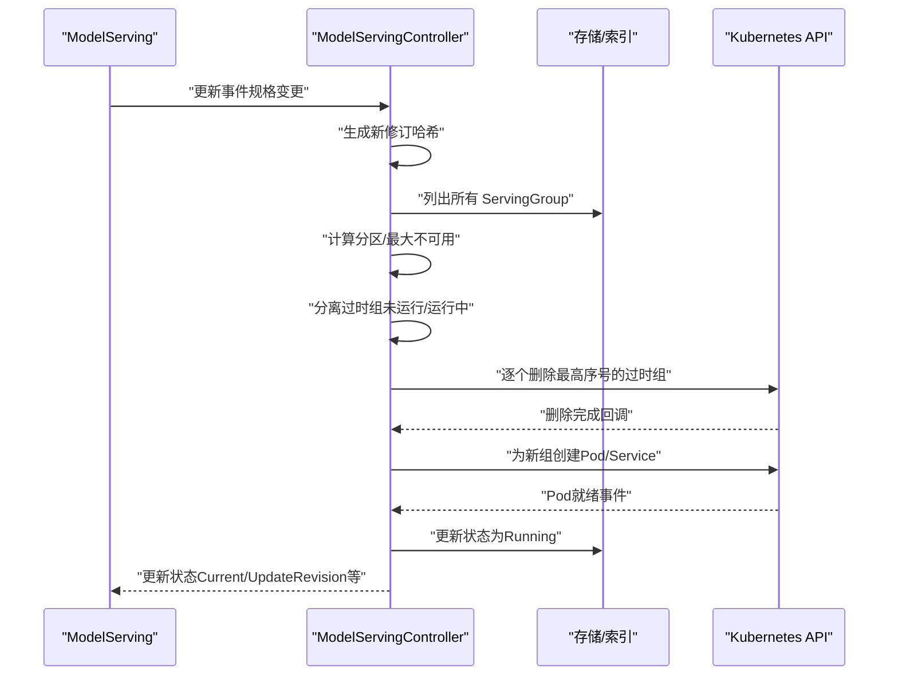
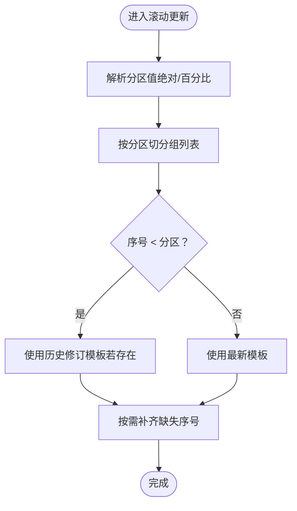
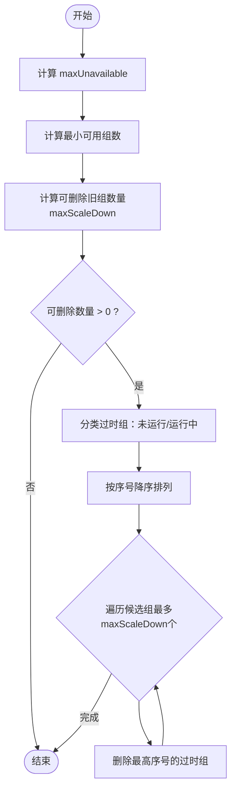
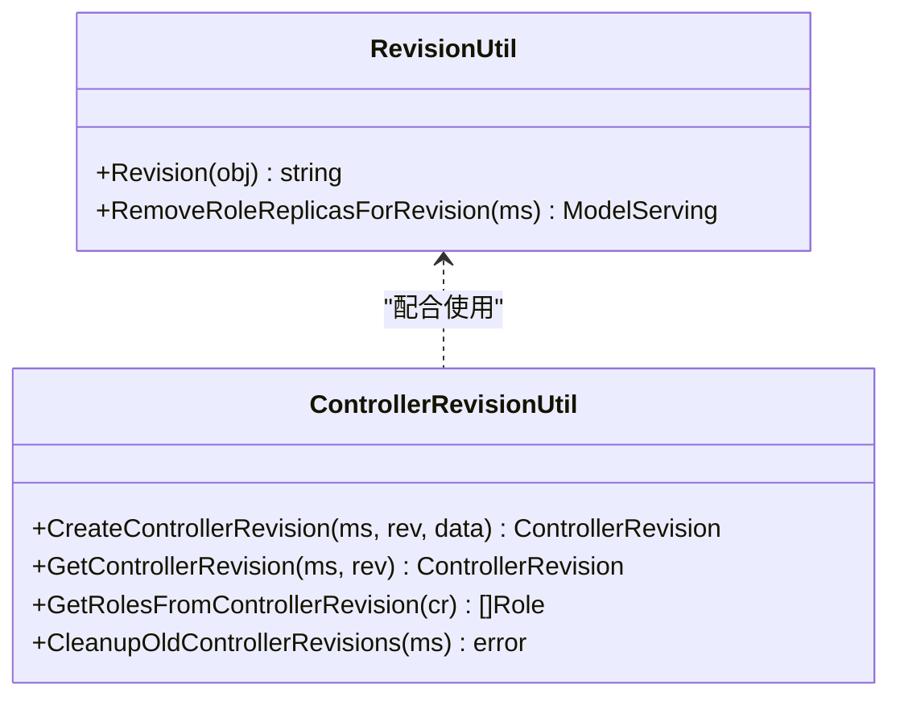
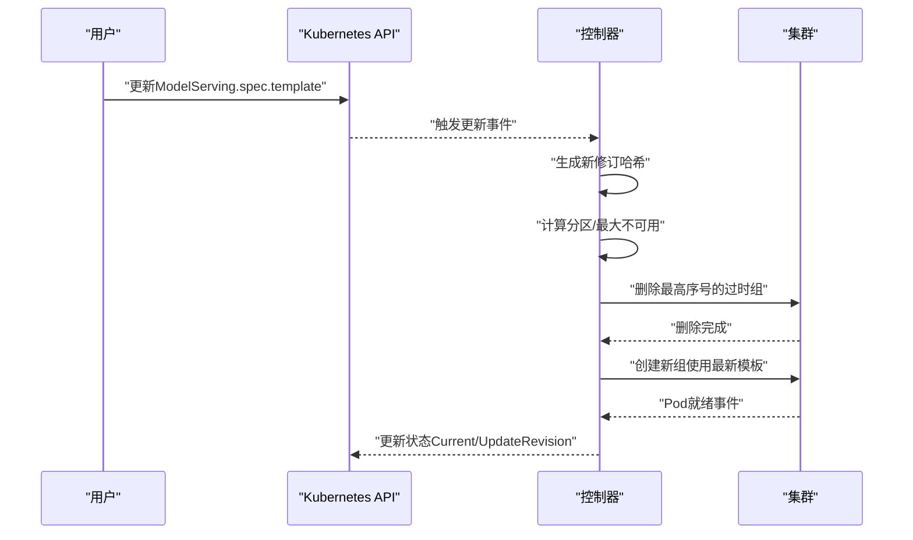
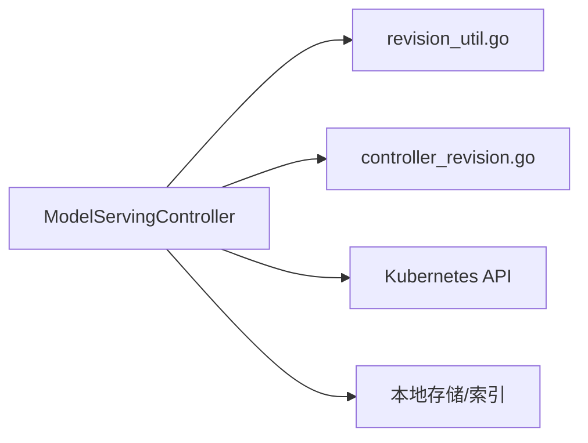

# 滚动更新策略

<cite>
**本文引用的文件**
- [pkg/model-serving-controller/controller/model_serving_controller.go](file://pkg/model-serving-controller/controller/model_serving_controller.go)
- [pkg/model-serving-controller/utils/revision_util.go](file://pkg/model-serving-controller/utils/revision_util.go)
- [pkg/model-serving-controller/utils/controller_revision.go](file://pkg/model-serving-controller/utils/controller_revision.go)
- [client-go/applyconfiguration/workload/v1alpha1/rollingupdateconfiguration.go](file://client-go/applyconfiguration/workload/v1alpha1/rollingupdateconfiguration.go)
- [docs/kthena/docs/developer-guide/model-serving-rolling-update.md](file://docs/kthena/docs/developer-guide/model-serving-rolling-update.md)
- [examples/model-serving/rollingupdate.yaml](file://examples/model-serving/rollingupdate.yaml)
- [pkg/model-serving-controller/controller/model_serving_controller_test.go](file://pkg/model-serving-controller/controller/model_serving_controller_test.go)
</cite>

## 目录
1. [简介](#简介)
2. [项目结构](#项目结构)
3. [核心组件](#核心组件)
4. [架构总览](#架构总览)
5. [详细组件分析](#详细组件分析)
6. [依赖分析](#依赖分析)
7. [性能考虑](#性能考虑)
8. [故障排查指南](#故障排查指南)
9. [结论](#结论)
10. [附录](#附录)

## 简介
本技术文档围绕模型服务控制器（ModelServing）的滚动更新策略展开，系统性阐述滚动更新的核心机制与实现原理，覆盖分区更新、最大不可用约束、并行更新控制、回滚与版本管理、控制器修订机制、触发条件与执行流程、分区更新的实现细节（含保护机制与更新顺序）、配置示例与最佳实践，以及更新失败处理与回滚操作指南。目标是帮助读者在不直接阅读源码的情况下，也能准确理解并正确使用该滚动更新能力。

## 项目结构
与滚动更新直接相关的核心代码位于模型服务控制器与工具模块中，并配套有开发者指南文档与示例清单：
- 控制器主逻辑：负责协调副本、角色、服务与状态更新，实现分区与最大不可用约束下的滚动更新。
- 版本与修订工具：负责修订哈希计算、控制器修订（ControllerRevision）的创建与清理。
- 配置应用声明：定义滚动更新配置项（如分区、最大不可用）的声明式结构。
- 文档与示例：提供滚动更新策略说明、配置示例与流程图解。

**图表来源**
- [pkg/model-serving-controller/controller/model_serving_controller.go:1091-1151](file://pkg/model-serving-controller/controller/model_serving_controller.go#L1091-L1151)
- [pkg/model-serving-controller/utils/revision_util.go:27-57](file://pkg/model-serving-controller/utils/revision_util.go#L27-L57)
- [pkg/model-serving-controller/utils/controller_revision.go:42-104](file://pkg/model-serving-controller/utils/controller_revision.go#L42-L104)
- [client-go/applyconfiguration/workload/v1alpha1/rollingupdateconfiguration.go:25-52](file://client-go/applyconfiguration/workload/v1alpha1/rollingupdateconfiguration.go#L25-L52)
- [docs/kthena/docs/developer-guide/model-serving-rolling-update.md:1-35](file://docs/kthena/docs/developer-guide/model-serving-rolling-update.md#L1-L35)
- [examples/model-serving/rollingupdate.yaml:1-50](file://examples/model-serving/rollingupdate.yaml#L1-L50)

**章节来源**
- [pkg/model-serving-controller/controller/model_serving_controller.go:1091-1151](file://pkg/model-serving-controller/controller/model_serving_controller.go#L1091-L1151)
- [pkg/model-serving-controller/utils/revision_util.go:27-57](file://pkg/model-serving-controller/utils/revision_util.go#L27-L57)
- [pkg/model-serving-controller/utils/controller_revision.go:42-104](file://pkg/model-serving-controller/utils/controller_revision.go#L42-L104)
- [client-go/applyconfiguration/workload/v1alpha1/rollingupdateconfiguration.go:25-52](file://client-go/applyconfiguration/workload/v1alpha1/rollingupdateconfiguration.go#L25-L52)
- [docs/kthena/docs/developer-guide/model-serving-rolling-update.md:1-35](file://docs/kthena/docs/developer-guide/model-serving-rolling-update.md#L1-L35)
- [examples/model-serving/rollingupdate.yaml:1-50](file://examples/model-serving/rollingupdate.yaml#L1-L50)

## 核心组件
- 模型服务控制器（ModelServingController）
  - 负责监听模型服务、Pod、Service、PodGroup 等资源事件，驱动副本与角色的扩缩容、滚动更新与状态同步。
  - 实现分区更新与最大不可用约束，确保滚动过程中可用性满足策略要求。
- 修订与版本工具
  - 通过哈希算法对模板进行稳定编码，用于区分不同版本；支持按角色移除副本字段以避免仅副本数变化导致的误判。
  - 提供控制器修订（ControllerRevision）的创建、查询与清理，保留当前与更新中的两个版本以便恢复与回滚。
- 配置声明
  - 定义滚动更新配置项（分区、最大不可用），作为策略输入参与滚动更新决策。

**章节来源**
- [pkg/model-serving-controller/controller/model_serving_controller.go:1091-1151](file://pkg/model-serving-controller/controller/model_serving_controller.go#L1091-L1151)
- [pkg/model-serving-controller/utils/revision_util.go:27-57](file://pkg/model-serving-controller/utils/revision_util.go#L27-L57)
- [pkg/model-serving-controller/utils/controller_revision.go:42-104](file://pkg/model-serving-controller/utils/controller_revision.go#L42-L104)
- [client-go/applyconfiguration/workload/v1alpha1/rollingupdateconfiguration.go:25-52](file://client-go/applyconfiguration/workload/v1alpha1/rollingupdateconfiguration.go#L25-L52)

## 架构总览
滚动更新在控制器内部的调用链如下：
- 同步入口根据模型服务规格生成新修订哈希；
- 计算分区与最大不可用，识别过时的 ServingGroup；
- 优先删除“未运行”的过时组，再删除“运行中但版本过时”的组；
- 删除顺序从最高序号开始，确保每次只删除一个组；
- 新组创建后，控制器持续检查可用性，逐步推进更新。

**图表来源**
- [pkg/model-serving-controller/controller/model_serving_controller.go:1091-1151](file://pkg/model-serving-controller/controller/model_serving_controller.go#L1091-L1151)
- [pkg/model-serving-controller/controller/model_serving_controller.go:1153-1196](file://pkg/model-serving-controller/controller/model_serving_controller.go#L1153-L1196)
- [pkg/model-serving-controller/controller/model_serving_controller.go:1240-1302](file://pkg/model-serving-controller/controller/model_serving_controller.go#L1240-L1302)

**章节来源**
- [pkg/model-serving-controller/controller/model_serving_controller.go:1091-1151](file://pkg/model-serving-controller/controller/model_serving_controller.go#L1091-L1151)
- [pkg/model-serving-controller/controller/model_serving_controller.go:1153-1196](file://pkg/model-serving-controller/controller/model_serving_controller.go#L1153-L1196)
- [pkg/model-serving-controller/controller/model_serving_controller.go:1240-1302](file://pkg/model-serving-controller/controller/model_serving_controller.go#L1240-L1302)

## 详细组件分析

### 分区更新（Partition）
- 分区值决定哪些序号的组会被更新，序号小于分区的组被视为“受保护”，不会被滚动更新。
- 分区既可为绝对数值，也可为百分比（基于副本总数计算），当百分比时需确保副本数非空。
- 受保护组在扩容时使用历史修订模板（若存在），否则回退到当前修订；新创建的组始终使用最新模板。

**图表来源**
- [pkg/model-serving-controller/controller/model_serving_controller.go:675-794](file://pkg/model-serving-controller/controller/model_serving_controller.go#L675-L794)
- [pkg/model-serving-controller/controller/model_serving_controller.go:801-839](file://pkg/model-serving-controller/controller/model_serving_controller.go#L801-L839)
- [pkg/model-serving-controller/controller/model_serving_controller.go:1906-1928](file://pkg/model-serving-controller/controller/model_serving_controller.go#L1906-L1928)

**章节来源**
- [pkg/model-serving-controller/controller/model_serving_controller.go:675-794](file://pkg/model-serving-controller/controller/model_serving_controller.go#L675-L794)
- [pkg/model-serving-controller/controller/model_serving_controller.go:801-839](file://pkg/model-serving-controller/controller/model_serving_controller.go#L801-L839)
- [pkg/model-serving-controller/controller/model_serving_controller.go:1906-1928](file://pkg/model-serving-controller/controller/model_serving_controller.go#L1906-L1928)

### 最大不可用与并行更新
- 最大不可用（maxUnavailable）用于限制同时处于“不可用”状态的组数量，从而保证整体可用性。
- 控制器根据“期望副本数 - 最大不可用”计算最小可用组数，进而推导出可删除的旧组数量（maxScaleDown）。
- 删除过时组时，优先处理“未运行”的组，再处理“运行中但版本过时”的组；删除顺序从最高序号开始，确保每次只删除一个组，且仅在新组完全就绪后再继续。

**图表来源**
- [pkg/model-serving-controller/controller/model_serving_controller.go:1091-1151](file://pkg/model-serving-controller/controller/model_serving_controller.go#L1091-L1151)
- [pkg/model-serving-controller/controller/model_serving_controller.go:1153-1196](file://pkg/model-serving-controller/controller/model_serving_controller.go#L1153-L1196)

**章节来源**
- [pkg/model-serving-controller/controller/model_serving_controller.go:1091-1151](file://pkg/model-serving-controller/controller/model_serving_controller.go#L1091-L1151)
- [pkg/model-serving-controller/controller/model_serving_controller.go:1153-1196](file://pkg/model-serving-controller/controller/model_serving_controller.go#L1153-L1196)

### 版本管理与控制器修订机制
- 修订哈希
  - 对模板进行深度哈希，生成稳定版本标识；在计算修订时会移除角色副本字段，避免仅副本数变化导致的误判。
- 控制器修订（ControllerRevision）
  - 在每次新版本创建时写入或更新修订记录；清理策略仅保留当前版本与更新版本，其余历史修订会被删除。
  - 支持从修订中恢复历史模板，用于分区保护组的重建与恢复。

**图表来源**
- [pkg/model-serving-controller/utils/revision_util.go:27-57](file://pkg/model-serving-controller/utils/revision_util.go#L27-L57)
- [pkg/model-serving-controller/utils/controller_revision.go:42-104](file://pkg/model-serving-controller/utils/controller_revision.go#L42-L104)
- [pkg/model-serving-controller/utils/controller_revision.go:152-206](file://pkg/model-serving-controller/utils/controller_revision.go#L152-L206)

**章节来源**
- [pkg/model-serving-controller/utils/revision_util.go:27-57](file://pkg/model-serving-controller/utils/revision_util.go#L27-L57)
- [pkg/model-serving-controller/utils/controller_revision.go:42-104](file://pkg/model-serving-controller/utils/controller_revision.go#L42-L104)
- [pkg/model-serving-controller/utils/controller_revision.go:152-206](file://pkg/model-serving-controller/utils/controller_revision.go#L152-L206)

### 触发条件与执行流程
- 触发条件
  - 模型服务规格变更（模板角色、镜像、环境变量等）导致新修订哈希产生。
  - 控制器在同步循环中计算分区与最大不可用，识别需要更新的组。
- 执行流程
  - 生成新修订 → 计算分区与最大不可用 → 分类过时组 → 从高序号开始删除 → 创建新组 → 等待就绪 → 更新状态。

**图表来源**
- [pkg/model-serving-controller/controller/model_serving_controller.go:547-572](file://pkg/model-serving-controller/controller/model_serving_controller.go#L547-L572)
- [pkg/model-serving-controller/controller/model_serving_controller.go:1091-1151](file://pkg/model-serving-controller/controller/model_serving_controller.go#L1091-L1151)
- [pkg/model-serving-controller/controller/model_serving_controller.go:1844-1903](file://pkg/model-serving-controller/controller/model_serving_controller.go#L1844-L1903)

**章节来源**
- [pkg/model-serving-controller/controller/model_serving_controller.go:547-572](file://pkg/model-serving-controller/controller/model_serving_controller.go#L547-L572)
- [pkg/model-serving-controller/controller/model_serving_controller.go:1091-1151](file://pkg/model-serving-controller/controller/model_serving_controller.go#L1091-L1151)
- [pkg/model-serving-controller/controller/model_serving_controller.go:1844-1903](file://pkg/model-serving-controller/controller/model_serving_controller.go#L1844-L1903)

### 分区更新实现细节
- 分区计算
  - 支持整数与百分比两种形式；百分比需基于副本总数计算，若副本为空则默认分区为0。
- 保护机制
  - 序号小于分区的组视为受保护，扩容时使用历史修订模板（若存在），否则回退到当前修订。
- 更新顺序
  - 删除过时组时，先处理“未运行”的组，再处理“运行中但版本过时”的组；删除顺序从最高序号开始，确保每次只删除一个组。

**章节来源**
- [pkg/model-serving-controller/controller/model_serving_controller.go:1906-1928](file://pkg/model-serving-controller/controller/model_serving_controller.go#L1906-L1928)
- [pkg/model-serving-controller/controller/model_serving_controller.go:675-794](file://pkg/model-serving-controller/controller/model_serving_controller.go#L675-L794)
- [pkg/model-serving-controller/controller/model_serving_controller.go:1153-1196](file://pkg/model-serving-controller/controller/model_serving_controller.go#L1153-L1196)

### 回滚策略
- 回滚触发点
  - 当新版本出现不可用或异常时，控制器通过清理旧修订（仅保留当前与更新版本）与状态回退机制，使服务尽快回到稳定状态。
- 回滚路径
  - 通过控制器修订机制恢复历史模板，重建受保护组；若未设置分区，则新建组直接使用最新模板。
- 失败处理
  - 控制器在Pod失败时进入“宽限期”，超过宽限期仍未就绪则删除并重建；同时回退角色/组状态，触发重新协调。

**章节来源**
- [pkg/model-serving-controller/utils/controller_revision.go:152-206](file://pkg/model-serving-controller/utils/controller_revision.go#L152-L206)
- [pkg/model-serving-controller/controller/model_serving_controller.go:1304-1389](file://pkg/model-serving-controller/controller/model_serving_controller.go#L1304-L1389)
- [pkg/model-serving-controller/controller/model_serving_controller.go:1391-1417](file://pkg/model-serving-controller/controller/model_serving_controller.go#L1391-L1417)

### 配置示例与最佳实践
- 配置示例
  - 使用滚动更新类型与分区参数，示例清单展示了如何配置最大不可用与分区。
- 最佳实践
  - 将关键组置于分区保护范围内，确保滚动过程中至少有部分实例保持稳定；
  - 合理设置最大不可用，避免在更新期间出现大规模不可用；
  - 结合健康检查与可观测性，及时发现并处理更新失败。

**章节来源**
- [examples/model-serving/rollingupdate.yaml:1-50](file://examples/model-serving/rollingupdate.yaml#L1-L50)
- [docs/kthena/docs/developer-guide/model-serving-rolling-update.md:1-35](file://docs/kthena/docs/developer-guide/model-serving-rolling-update.md#L1-L35)

## 依赖分析
- 组件耦合
  - 控制器主流程依赖修订工具与修订持久化工具；分区与最大不可用计算贯穿滚动更新全过程。
- 外部依赖
  - 依赖Kubernetes API（Pod/Service/ControllerRevision）与Informers事件流；通过存储层维护状态与索引。

**图表来源**
- [pkg/model-serving-controller/controller/model_serving_controller.go:1091-1151](file://pkg/model-serving-controller/controller/model_serving_controller.go#L1091-L1151)
- [pkg/model-serving-controller/utils/revision_util.go:27-57](file://pkg/model-serving-controller/utils/revision_util.go#L27-L57)
- [pkg/model-serving-controller/utils/controller_revision.go:42-104](file://pkg/model-serving-controller/utils/controller_revision.go#L42-L104)

**章节来源**
- [pkg/model-serving-controller/controller/model_serving_controller.go:1091-1151](file://pkg/model-serving-controller/controller/model_serving_controller.go#L1091-L1151)
- [pkg/model-serving-controller/utils/revision_util.go:27-57](file://pkg/model-serving-controller/utils/revision_util.go#L27-L57)
- [pkg/model-serving-controller/utils/controller_revision.go:42-104](file://pkg/model-serving-controller/utils/controller_revision.go#L42-L104)

## 性能考虑
- 事件处理与重试
  - 控制器采用工作队列与限速重试，避免在高频事件下造成压力峰值。
- 并发与顺序
  - 删除过时组按序号降序进行，减少并发冲突；仅在新组就绪后继续，降低抖动风险。
- 存储与索引
  - 通过索引器快速定位Pod/Service/Group，减少全量扫描开销。

[本节为通用指导，无需具体文件分析]

## 故障排查指南
- 常见问题
  - 更新停滞：检查最大不可用是否过大导致无法删除旧组；确认新组是否持续就绪。
  - 分区保护组未更新：确认分区值与序号范围；检查历史修订是否存在。
  - Pod反复失败：检查宽限期设置与失败后的重建策略；查看控制器事件与日志。
- 排查步骤
  - 查看模型服务状态（Current/UpdateRevision、可用副本数、观察代数）；
  - 检查控制器事件与日志，定位失败节点；
  - 验证修订记录与清理结果，确认是否保留了必要的历史模板。

**章节来源**
- [pkg/model-serving-controller/controller/model_serving_controller.go:1844-1903](file://pkg/model-serving-controller/controller/model_serving_controller.go#L1844-L1903)
- [pkg/model-serving-controller/controller/model_serving_controller.go:1304-1389](file://pkg/model-serving-controller/controller/model_serving_controller.go#L1304-L1389)
- [pkg/model-serving-controller/utils/controller_revision.go:152-206](file://pkg/model-serving-controller/utils/controller_revision.go#L152-L206)

## 结论
滚动更新策略通过“分区保护 + 最大不可用约束 + 有序删除与创建”的组合，在保障在线服务连续性的同时，实现了可控、可追踪的版本升级。结合修订与控制器修订机制，系统具备恢复与回滚能力；配合合理的配置与监控，可显著降低更新风险并提升发布效率。

## 附录
- 测试用例参考
  - 包含分区保护、历史修订恢复、重建行为等多场景测试，便于验证实现细节与边界条件。

**章节来源**
- [pkg/model-serving-controller/controller/model_serving_controller_test.go:2467-3434](file://pkg/model-serving-controller/controller/model_serving_controller_test.go#L2467-L3434)
- [pkg/model-serving-controller/controller/model_serving_controller_test.go:3567-3686](file://pkg/model-serving-controller/controller/model_serving_controller_test.go#L3567-L3686)
- [pkg/model-serving-controller/controller/model_serving_controller_test.go:6699-6754](file://pkg/model-serving-controller/controller/model_serving_controller_test.go#L6699-L6754)