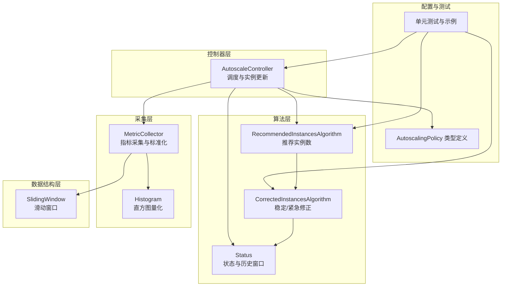
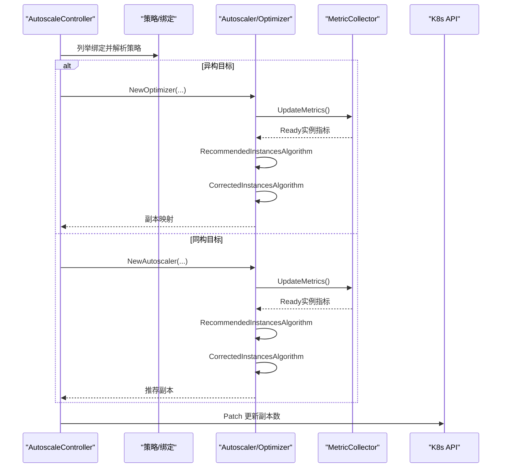
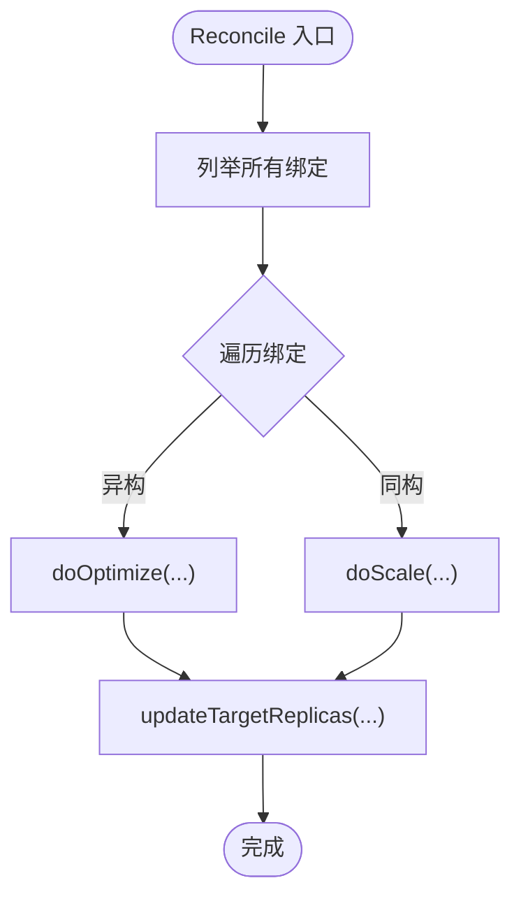
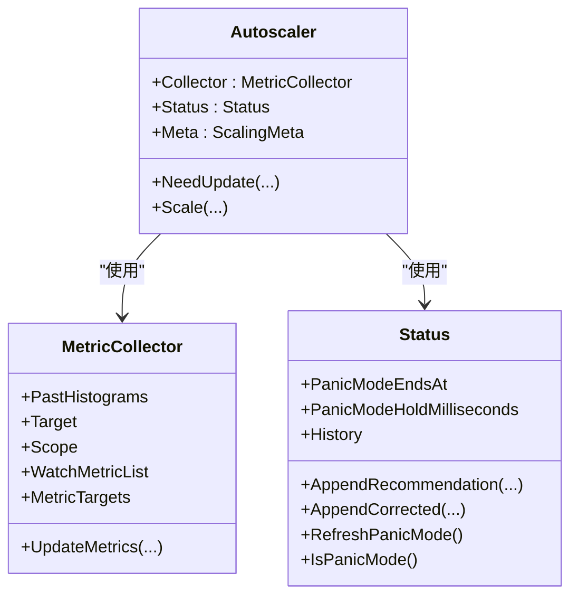
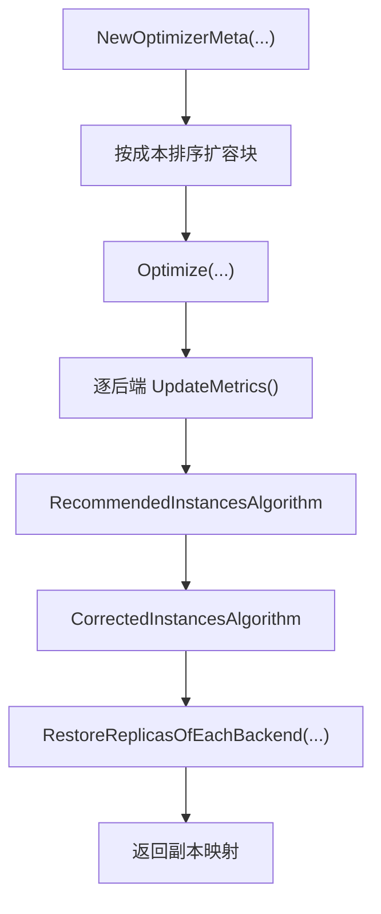
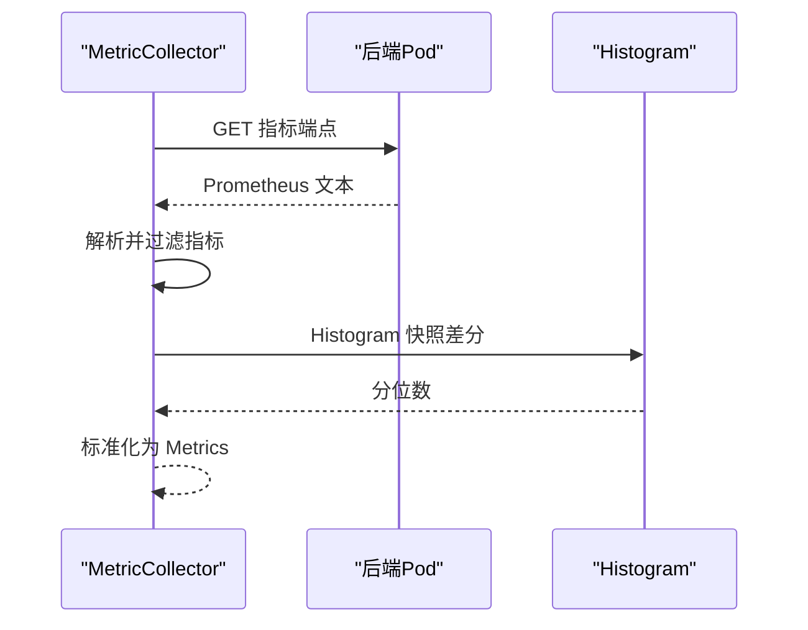
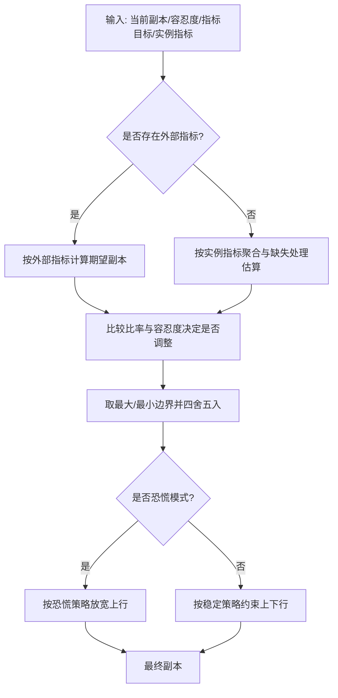
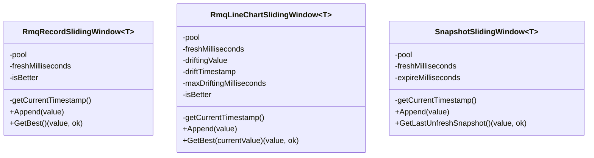
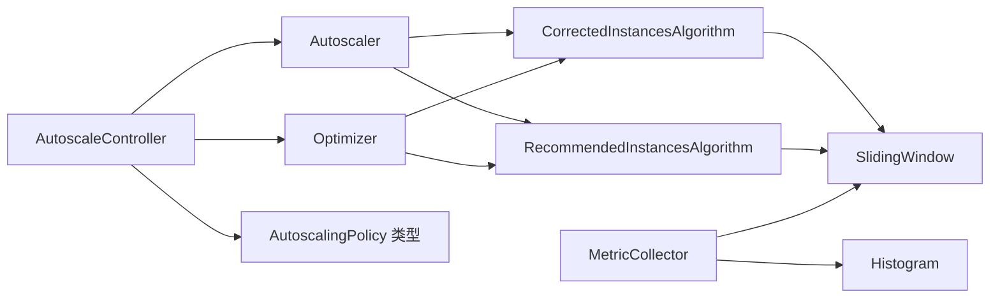

# 自动扩缩容控制器

<cite>
**本文引用的文件**
- [autoscale_controller.go](file://pkg/autoscaler/controller/autoscale_controller.go)
- [scaler.go](file://pkg/autoscaler/autoscaler/scaler.go)
- [optimizer.go](file://pkg/autoscaler/autoscaler/optimizer.go)
- [metric_collector.go](file://pkg/autoscaler/autoscaler/metric_collector.go)
- [status.go](file://pkg/autoscaler/autoscaler/status.go)
- [sliding_window.go](file://pkg/autoscaler/datastructure/sliding_window.go)
- [recommendation.go](file://pkg/autoscaler/algorithm/recommendation.go)
- [revision.go](file://pkg/autoscaler/algorithm/revision.go)
- [histogram.go](file://pkg/autoscaler/histogram/histogram.go)
- [settings.go](file://pkg/autoscaler/util/settings.go)
- [autoscalingpolicy_types.go](file://pkg/apis/workload/v1alpha1/autoscalingpolicy_types.go)
- [autoscale_controller_test.go](file://pkg/autoscaler/controller/autoscale_controller_test.go)
- [autoscaler.mdx](file://docs/kthena/docs/architecture/autoscaler.mdx)
- [prometheus.md](file://docs/kthena/docs/general/prometheus.md)
</cite>

## 目录
1. [引言](#引言)
2. [项目结构](#项目结构)
3. [核心组件](#核心组件)
4. [架构总览](#架构总览)
5. [详细组件分析](#详细组件分析)
6. [依赖分析](#依赖分析)
7. [性能考量](#性能考量)
8. [故障排查指南](#故障排查指南)
9. [结论](#结论)
10. [附录](#附录)

## 引言
本技术文档面向自动扩缩容控制器（Autoscaler），系统性阐述其架构设计与算法实现，重点覆盖：
- 成本驱动的扩缩容策略与优化器算法
- 推荐系统与稳定/紧急模式下的决策修正
- 指标采集与 Prometheus 集成、自定义指标支持与数据标准化
- 滑动窗口数据结构在时间窗口管理、数据聚合与趋势分析中的应用
- 扩缩容策略配置示例与调优指南
- 性能监控与故障诊断最佳实践

## 项目结构
自动扩缩容控制器位于 pkg/autoscaler 子目录，围绕“控制器-采集器-算法-数据结构”的分层组织：
- 控制器层：负责绑定与目标对象的调度、实例更新
- 算法层：推荐实例数计算与基于历史的稳定/紧急修正
- 数据结构层：滑动窗口与直方图量化工具
- 指标采集层：从 Pod 暴露的指标端点抓取并标准化

**图表来源**
- [autoscale_controller.go:47-96](file://pkg/autoscaler/controller/autoscale_controller.go#L47-L96)
- [scaler.go:28-53](file://pkg/autoscaler/autoscaler/scaler.go#L28-L53)
- [optimizer.go:29-144](file://pkg/autoscaler/autoscaler/optimizer.go#L29-L144)
- [metric_collector.go:43-129](file://pkg/autoscaler/autoscaler/metric_collector.go#L43-L129)
- [sliding_window.go:37-237](file://pkg/autoscaler/datastructure/sliding_window.go#L37-L237)
- [recommendation.go:27-171](file://pkg/autoscaler/algorithm/recommendation.go#L27-L171)
- [revision.go:26-122](file://pkg/autoscaler/algorithm/revision.go#L26-L122)
- [autoscalingpolicy_types.go:24-153](file://pkg/apis/workload/v1alpha1/autoscalingpolicy_types.go#L24-L153)

**章节来源**
- [autoscale_controller.go:47-120](file://pkg/autoscaler/controller/autoscale_controller.go#L47-L120)
- [autoscalingpolicy_types.go:24-153](file://pkg/apis/workload/v1alpha1/autoscalingpolicy_types.go#L24-L153)

## 核心组件
- 自动扩缩容控制器（AutoscaleController）
  - 负责监听策略与绑定，按周期触发同构/异构扩缩容流程，并更新目标副本数
- 同构缩放器（Autoscaler）
  - 针对单一目标的缩放逻辑，封装采集器、状态与元信息
- 异构优化器（Optimizer）
  - 多后端成本驱动的资源分配与扩容序列生成
- 指标采集器（MetricCollector）
  - 从 Pod 指标端点抓取 Prometheus 文本格式指标，标准化为统一 Metrics
- 状态与历史（Status）
  - 维护恐慌模式、稳定/紧急修正所需的历史滑动窗口
- 算法模块
  - 推荐实例数算法与稳定/紧急修正算法
- 滑动窗口与直方图
  - 时间窗口管理、趋势分析与直方图分位数计算

**章节来源**
- [autoscale_controller.go:47-96](file://pkg/autoscaler/controller/autoscale_controller.go#L47-L96)
- [scaler.go:28-53](file://pkg/autoscaler/autoscaler/scaler.go#L28-L53)
- [optimizer.go:29-144](file://pkg/autoscaler/autoscaler/optimizer.go#L29-L144)
- [metric_collector.go:43-129](file://pkg/autoscaler/autoscaler/metric_collector.go#L43-L129)
- [status.go:26-88](file://pkg/autoscaler/autoscaler/status.go#L26-L88)
- [recommendation.go:27-171](file://pkg/autoscaler/algorithm/recommendation.go#L27-L171)
- [revision.go:26-122](file://pkg/autoscaler/algorithm/revision.go#L26-L122)
- [sliding_window.go:37-237](file://pkg/autoscaler/datastructure/sliding_window.go#L37-L237)
- [histogram.go:27-123](file://pkg/autoscaler/histogram/histogram.go#L27-L123)

## 架构总览
控制器以周期任务驱动，依据绑定与策略选择同构或异构路径：
- 同构路径：单目标缩放，直接计算推荐副本并受稳定/紧急策略约束
- 异构路径：多后端成本建模，采用贪心+倍增策略生成扩容序列，再映射回各后端副本

**图表来源**
- [autoscale_controller.go:251-348](file://pkg/autoscaler/controller/autoscale_controller.go#L251-L348)
- [scaler.go:67-107](file://pkg/autoscaler/autoscaler/scaler.go#L67-L107)
- [optimizer.go:151-208](file://pkg/autoscaler/autoscaler/optimizer.go#L151-L208)
- [metric_collector.go:98-129](file://pkg/autoscaler/autoscaler/metric_collector.go#L98-L129)

## 详细组件分析

### 控制器：AutoscaleController
- 职责
  - 启动 Informer，等待缓存同步
  - 按周期遍历绑定，区分同构/异构目标，创建或复用缩放器/优化器
  - 读取当前副本，计算推荐副本，发起 Patch 更新
- 关键点
  - 通过 UID/命名空间/目标键维护缩放器/优化器缓存，避免重复创建
  - 对子角色（ModelServing 角色）支持 JSON Patch 更新特定角色副本

**图表来源**
- [autoscale_controller.go:124-171](file://pkg/autoscaler/controller/autoscale_controller.go#L124-L171)
- [autoscale_controller.go:251-348](file://pkg/autoscaler/controller/autoscale_controller.go#L251-L348)

**章节来源**
- [autoscale_controller.go:98-171](file://pkg/autoscaler/controller/autoscale_controller.go#L98-L171)
- [autoscale_controller.go:173-222](file://pkg/autoscaler/controller/autoscale_controller.go#L173-L222)
- [autoscale_controller.go:251-348](file://pkg/autoscaler/controller/autoscale_controller.go#L251-L348)

### 同构缩放器：Autoscaler
- 组成
  - MetricCollector：按策略目标抓取指标
  - Status：维护历史与恐慌模式
  - Meta：保存绑定与策略版本信息
- 流程
  - UpdateMetrics -> RecommendedInstancesAlgorithm -> CorrectedInstancesAlgorithm -> 更新状态

**图表来源**
- [scaler.go:28-53](file://pkg/autoscaler/autoscaler/scaler.go#L28-L53)
- [metric_collector.go:43-129](file://pkg/autoscaler/autoscaler/metric_collector.go#L43-L129)
- [status.go:26-88](file://pkg/autoscaler/autoscaler/status.go#L26-L88)

**章节来源**
- [scaler.go:28-107](file://pkg/autoscaler/autoscaler/scaler.go#L28-L107)

### 异构优化器：Optimizer
- 组成
  - 多个 MetricCollector（每个后端一个）
  - OptimizerMeta：成本扩展率、最小/最大副本、扩容顺序
  - Status：与同构相同
- 策略
  - 基于成本扩展率的倍增式扩容块排序，贪心填充可用容量，恢复到各后端副本映射

**图表来源**
- [optimizer.go:70-144](file://pkg/autoscaler/autoscaler/optimizer.go#L70-L144)
- [optimizer.go:151-208](file://pkg/autoscaler/autoscaler/optimizer.go#L151-L208)
- [autoscaler.mdx:38-46](file://docs/kthena/docs/architecture/autoscaler.mdx#L38-L46)

**章节来源**
- [optimizer.go:29-208](file://pkg/autoscaler/autoscaler/optimizer.go#L29-L208)
- [autoscaler.mdx:38-46](file://docs/kthena/docs/architecture/autoscaler.mdx#L38-L46)

### 指标采集器：MetricCollector
- 功能
  - 从 Pod 指标端点抓取 Prometheus 文本格式指标
  - 支持 Counter/Gauge/Histogram；Histogram 使用直方图快照差分计算指定分位数
  - 将指标标准化为统一 Metrics 映射，缺失指标补零
- 关键点
  - 仅采集命中 WatchMetricList 的指标
  - 通过 PastHistograms 缓存上次直方图快照，避免首次缺失

**图表来源**
- [metric_collector.go:131-183](file://pkg/autoscaler/autoscaler/metric_collector.go#L131-L183)
- [metric_collector.go:185-241](file://pkg/autoscaler/autoscaler/metric_collector.go#L185-L241)
- [histogram.go:61-122](file://pkg/autoscaler/histogram/histogram.go#L61-L122)

**章节来源**
- [metric_collector.go:98-250](file://pkg/autoscaler/autoscaler/metric_collector.go#L98-L250)
- [histogram.go:27-123](file://pkg/autoscaler/histogram/histogram.go#L27-L123)

### 算法：推荐与修正
- 推荐实例数算法
  - 支持外部指标与实例级指标两类
  - 实例级指标考虑就绪/未就绪实例与缺失指标的保守估计
- 稳定/紧急修正算法
  - 根据历史窗口（最大/最小推荐与已修正）与策略（绝对/百分比、Or/And）约束缩放幅度
  - 恐慌模式下放宽上行限制并设定持续时间

**图表来源**
- [recommendation.go:38-171](file://pkg/autoscaler/algorithm/recommendation.go#L38-L171)
- [revision.go:44-122](file://pkg/autoscaler/algorithm/revision.go#L44-L122)

**章节来源**
- [recommendation.go:27-171](file://pkg/autoscaler/algorithm/recommendation.go#L27-L171)
- [revision.go:26-122](file://pkg/autoscaler/algorithm/revision.go#L26-L122)

### 滑动窗口数据结构
- 记录型滑动窗口（最大/最小）
  - 维护时间窗口内最优值，用于稳定策略的历史比较
- 折线型滑动窗口（最大/最小）
  - 与当前值比较，用于稳定/恐慌策略的相对约束
- 快照滑动窗口
  - 保留最近一次非新鲜快照，用于直方图差分

**图表来源**
- [sliding_window.go:37-237](file://pkg/autoscaler/datastructure/sliding_window.go#L37-L237)

**章节来源**
- [sliding_window.go:37-237](file://pkg/autoscaler/datastructure/sliding_window.go#L37-L237)

### 配置与策略类型
- AutoscalingPolicy
  - 容差百分比、指标列表、行为配置（上/下行稳定策略、恐慌策略）
- 行为配置
  - 上行：稳定策略（周期、窗口、绝对/百分比、Or/And）、恐慌策略（阈值、周期、持续时间）
  - 下行：稳定策略（周期、窗口、绝对/百分比、Or/And）

**章节来源**
- [autoscalingpolicy_types.go:24-153](file://pkg/apis/workload/v1alpha1/autoscalingpolicy_types.go#L24-L153)

## 依赖分析
- 控制器依赖算法与数据结构，算法依赖滑动窗口与直方图
- 指标采集依赖 Prometheus 解码库与直方图模块
- 控制器与策略/绑定类型强耦合，通过 Informer 与 Lister 获取最新状态

**图表来源**
- [autoscale_controller.go:47-96](file://pkg/autoscaler/controller/autoscale_controller.go#L47-L96)
- [scaler.go:28-53](file://pkg/autoscaler/autoscaler/scaler.go#L28-L53)
- [optimizer.go:29-144](file://pkg/autoscaler/autoscaler/optimizer.go#L29-L144)
- [recommendation.go:27-171](file://pkg/autoscaler/algorithm/recommendation.go#L27-L171)
- [revision.go:26-122](file://pkg/autoscaler/algorithm/revision.go#L26-L122)
- [sliding_window.go:37-237](file://pkg/autoscaler/datastructure/sliding_window.go#L37-L237)
- [metric_collector.go:43-129](file://pkg/autoscaler/autoscaler/metric_collector.go#L43-L129)
- [histogram.go:27-123](file://pkg/autoscaler/histogram/histogram.go#L27-L123)

**章节来源**
- [autoscale_controller.go:47-96](file://pkg/autoscaler/controller/autoscale_controller.go#L47-L96)
- [scaler.go:28-53](file://pkg/autoscaler/autoscaler/scaler.go#L28-L53)
- [optimizer.go:29-144](file://pkg/autoscaler/autoscaler/optimizer.go#L29-L144)
- [recommendation.go:27-171](file://pkg/autoscaler/algorithm/recommendation.go#L27-L171)
- [revision.go:26-122](file://pkg/autoscaler/algorithm/revision.go#L26-L122)
- [sliding_window.go:37-237](file://pkg/autoscaler/datastructure/sliding_window.go#L37-L237)
- [metric_collector.go:43-129](file://pkg/autoscaler/autoscaler/metric_collector.go#L43-L129)
- [histogram.go:27-123](file://pkg/autoscaler/histogram/histogram.go#L27-L123)

## 性能考量
- 指标抓取超时与周期
  - 单次抓取超时与同步周期由配置常量控制，避免阻塞主循环
- 滑动窗口大小与过期策略
  - 窗口大小影响平滑度与响应速度，需结合业务波动性调优
- 直方图分位数计算
  - 差分计算减少内存占用，但要求前后直方图桶一致；异常时降级为 0 或默认快照

**章节来源**
- [settings.go:19-25](file://pkg/autoscaler/util/settings.go#L19-L25)
- [sliding_window.go:66-94](file://pkg/autoscaler/datastructure/sliding_window.go#L66-L94)
- [metric_collector.go:214-234](file://pkg/autoscaler/autoscaler/metric_collector.go#L214-L234)

## 故障排查指南
- 指标为空或不匹配
  - 检查 WatchMetricList 是否与策略指标名一致；确认后端指标端点可达且返回文本格式
- 实例未就绪或失败
  - 控制器会跳过未就绪实例或标记失败，导致推荐不稳定；检查 Pod 状态与容器健康
- 恐慌模式误触发
  - 提高 PanicThresholdPercent 或缩短 Hold 时间；确认业务流量特征
- 副本未更新
  - 检查控制器日志与 Patch 权限；核对目标 Kind/名称与命名空间

**章节来源**
- [metric_collector.go:100-129](file://pkg/autoscaler/autoscaler/metric_collector.go#L100-L129)
- [scaler.go:67-107](file://pkg/autoscaler/autoscaler/scaler.go#L67-L107)
- [autoscale_controller.go:173-222](file://pkg/autoscaler/controller/autoscale_controller.go#L173-L222)

## 结论
该自动扩缩容控制器通过清晰的分层设计与成熟的算法组合，实现了对同构与异构后端的成本驱动扩缩容。借助滑动窗口与直方图分位数，系统在保证稳定性的同时具备快速响应能力。配合完善的配置与监控体系，可满足生产环境的弹性需求。

## 附录

### 配置示例与调优要点
- 同构目标
  - 设置最小/最大副本、容差百分比、上/下行稳定策略与恐慌策略
  - 示例参考：[autoscale_controller_test.go:93-151](file://pkg/autoscaler/controller/autoscale_controller_test.go#L93-L151)
- 异构目标
  - 为每个后端设置最小/最大副本与成本，配置成本扩展率
  - 示例参考：[autoscale_controller_test.go:153-208](file://pkg/autoscaler/controller/autoscale_controller_test.go#L153-L208)
- 指标与端点
  - 在目标中配置指标端点 URI 与端口，确保后端暴露 Prometheus 文本格式指标
  - 参考：[prometheus.md:458-760](file://docs/kthena/docs/general/prometheus.md#L458-L760)

**章节来源**
- [autoscale_controller_test.go:93-208](file://pkg/autoscaler/controller/autoscale_controller_test.go#L93-L208)
- [prometheus.md:458-760](file://docs/kthena/docs/general/prometheus.md#L458-L760)