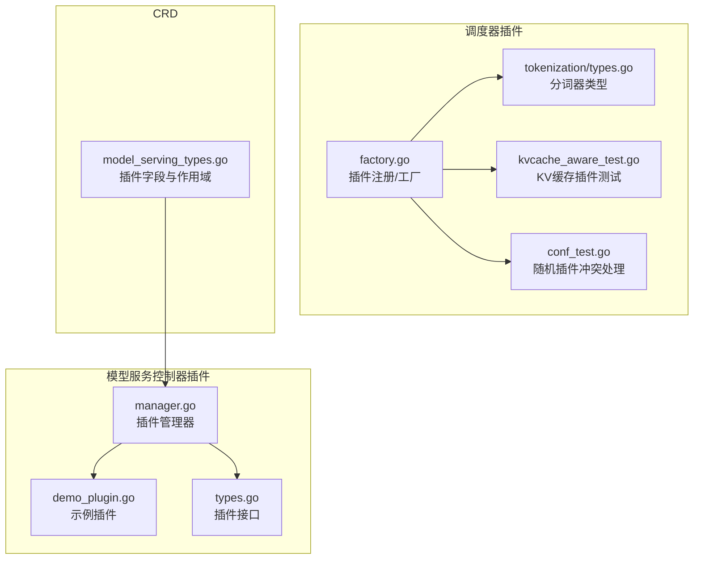
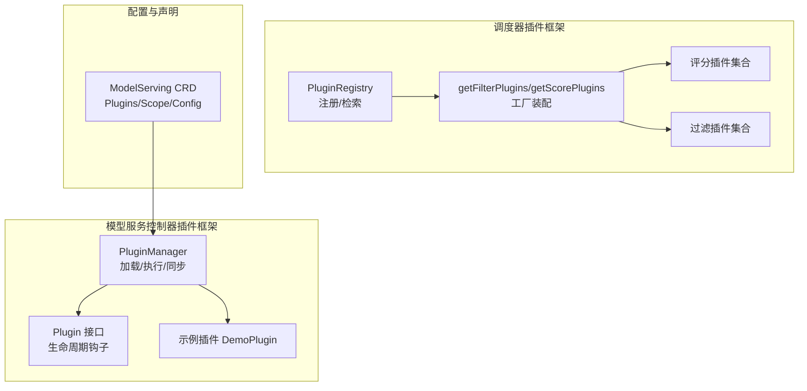
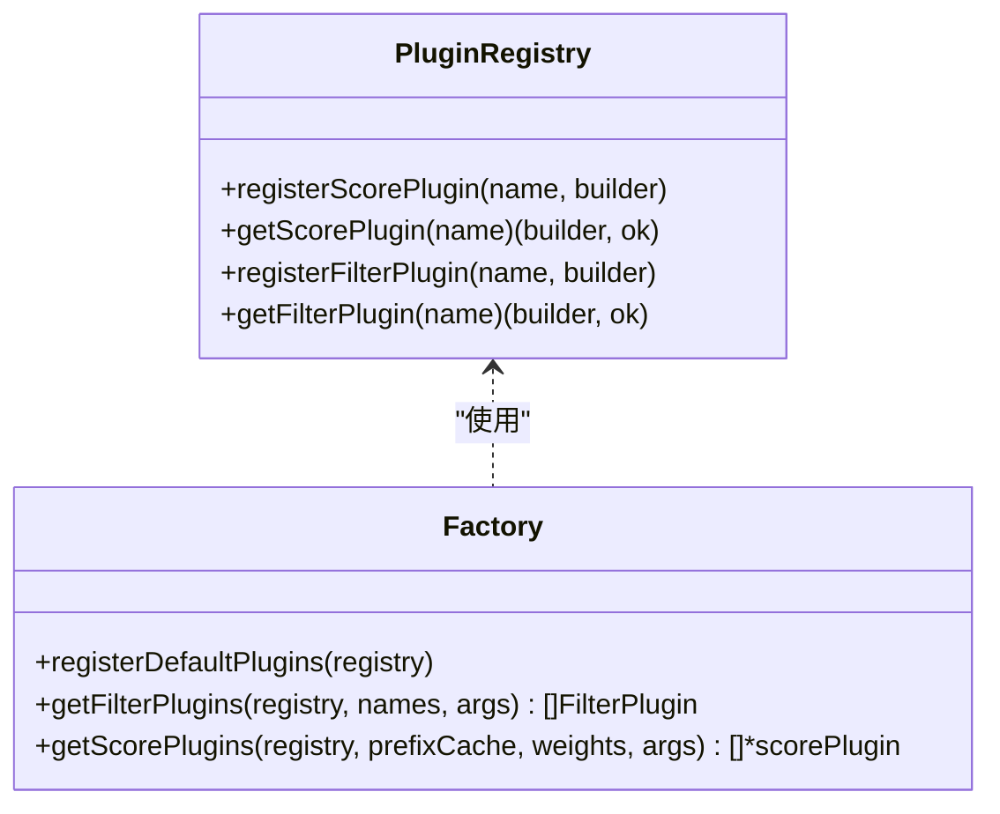
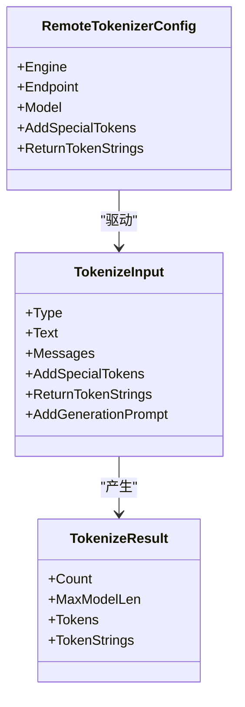
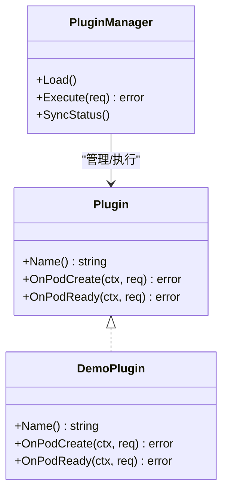
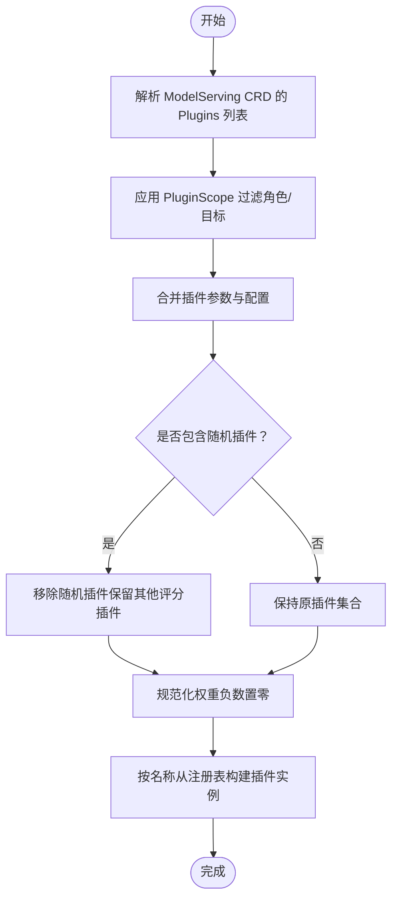
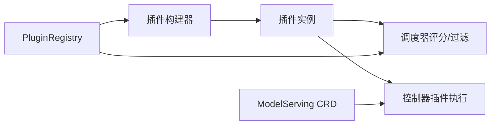

# 插件框架

<cite>
**本文引用的文件**   
- [factory.go](file://pkg/kthena-router/scheduler/factory.go)
- [factory_test.go](file://pkg/kthena-router/scheduler/factory_test.go)
- [types.go](file://pkg/kthena-router/scheduler/plugins/tokenization/types.go)
- [kvcache_aware_test.go](file://pkg/kthena-router/scheduler/plugins/kvcache_aware_test.go)
- [model_serving_types.go](file://pkg/apis/workload/v1alpha1/model_serving_types.go)
- [types.go](file://pkg/model-serving-controller/plugins/types.go)
- [manager.go](file://pkg/model-serving-controller/plugins/manager.go)
- [demo_plugin.go](file://pkg/model-serving-controller/plugins/demo_plugin.go)
- [conf_test.go](file://pkg/kthena-router/scheduler/plugins/conf/conf_test.go)
</cite>

## 目录
1. [引言](#引言)
2. [项目结构](#项目结构)
3. [核心组件](#核心组件)
4. [架构总览](#架构总览)
5. [组件详解](#组件详解)
6. [依赖关系分析](#依赖关系分析)
7. [性能考量](#性能考量)
8. [故障排查指南](#故障排查指南)
9. [结论](#结论)
10. [附录](#附录)

## 引言
本文件面向 Kthena 平台的插件框架，系统化阐述其设计理念与实现机制，覆盖插件注册、发现、加载与生命周期管理；深入解析模型服务控制器中的插件管理器（Plugin Manager）实现，包括插件接口定义、插件间通信与状态同步机制；详细介绍调度器插件系统，以分词器插件（Tokenizer Plugin）为例说明如何扩展调度算法；提供插件开发指南，包括接口规范、开发模板与测试方法；展示内置插件的功能与配置项，如 GPU 亲和性插件、KV 缓存感知插件等；最后给出性能优化建议与最佳实践。

## 项目结构
围绕插件框架的关键目录与文件如下：
- 调度器插件体系：位于 pkg/kthena-router/scheduler/plugins，包含插件注册、工厂与默认插件集合，以及分词器类型定义。
- 模型服务控制器插件体系：位于 pkg/model-serving-controller/plugins，包含插件接口、管理器与示例插件。
- CRD 中的插件声明：位于 pkg/apis/workload/v1alpha1，定义 ModelServing 的插件字段与作用域。

**图表来源**
- [factory.go:1-144](file://pkg/kthena-router/scheduler/factory.go#L1-L144)
- [types.go:1-78](file://pkg/kthena-router/scheduler/plugins/tokenization/types.go#L1-L78)
- [kvcache_aware_test.go:1-2082](file://pkg/kthena-router/scheduler/plugins/kvcache_aware_test.go#L1-L2082)
- [conf_test.go:66-123](file://pkg/kthena-router/scheduler/plugins/conf/conf_test.go#L66-L123)
- [manager.go](file://pkg/model-serving-controller/plugins/manager.go)
- [demo_plugin.go](file://pkg/model-serving-controller/plugins/demo_plugin.go)
- [types.go:1-45](file://pkg/model-serving-controller/plugins/types.go#L1-L45)
- [model_serving_types.go:44-115](file://pkg/apis/workload/v1alpha1/model_serving_types.go#L44-L115)

**章节来源**
- [factory.go:1-144](file://pkg/kthena-router/scheduler/factory.go#L1-L144)
- [types.go:1-78](file://pkg/kthena-router/scheduler/plugins/tokenization/types.go#L1-L78)
- [kvcache_aware_test.go:1-2082](file://pkg/kthena-router/scheduler/plugins/kvcache_aware_test.go#L1-L2082)
- [conf_test.go:66-123](file://pkg/kthena-router/scheduler/plugins/conf/conf_test.go#L66-L123)
- [manager.go](file://pkg/model-serving-controller/plugins/manager.go)
- [demo_plugin.go](file://pkg/model-serving-controller/plugins/demo_plugin.go)
- [types.go:1-45](file://pkg/model-serving-controller/plugins/types.go#L1-L45)
- [model_serving_types.go:44-115](file://pkg/apis/workload/v1alpha1/model_serving_types.go#L44-L115)

## 核心组件
- 调度器插件注册与工厂
  - 插件注册表负责注册与检索评分/过滤插件构建器，并在运行时按权重与参数实例化插件。
  - 默认插件集合包含 GPU 缓存使用率、最低延迟、最少请求、随机、前缀缓存与 KV 缓存感知等。
- 分词器插件与类型
  - 定义分词输入输出与远程分词器配置，支持 completion/chat 两种输入类型。
- 模型服务控制器插件接口与管理器
  - 插件接口定义生命周期钩子（OnPodCreate、OnPodReady），管理器负责加载、执行与状态同步。
- CRD 插件声明
  - ModelServing 支持通过 Plugins 字段声明插件实例，限定类型、配置与作用范围。

**章节来源**
- [factory.go:26-95](file://pkg/kthena-router/scheduler/factory.go#L26-L95)
- [types.go:21-78](file://pkg/kthena-router/scheduler/plugins/tokenization/types.go#L21-L78)
- [types.go:27-44](file://pkg/model-serving-controller/plugins/types.go#L27-L44)
- [model_serving_types.go:44-115](file://pkg/apis/workload/v1alpha1/model_serving_types.go#L44-L115)

## 架构总览
下图展示了调度器插件框架与模型服务控制器插件框架的整体交互关系，以及插件在不同阶段的职责分工。

**图表来源**
- [factory.go:29-143](file://pkg/kthena-router/scheduler/factory.go#L29-L143)
- [manager.go](file://pkg/model-serving-controller/plugins/manager.go)
- [types.go:37-44](file://pkg/model-serving-controller/plugins/types.go#L37-L44)
- [demo_plugin.go](file://pkg/model-serving-controller/plugins/demo_plugin.go)
- [model_serving_types.go:50-115](file://pkg/apis/workload/v1alpha1/model_serving_types.go#L50-L115)

## 组件详解

### 调度器插件注册与工厂
- 注册表（PluginRegistry）
  - 提供注册与检索评分/过滤插件构建器的能力，键为插件名称，值为构建函数。
- 默认插件注册
  - 在注册表中登记默认评分与过滤插件，部分插件需要在使用时传入参数或特殊初始化。
- 插件装配
  - 过滤插件按顺序遍历名称列表，从注册表获取构建器并实例化。
  - 评分插件按权重字典装配，负权重自动置零，前缀缓存插件采用特殊实例化路径。

**图表来源**
- [factory.go:29-95](file://pkg/kthena-router/scheduler/factory.go#L29-L95)
- [factory.go:97-143](file://pkg/kthena-router/scheduler/factory.go#L97-L143)

**章节来源**
- [factory.go:29-95](file://pkg/kthena-router/scheduler/factory.go#L29-L95)
- [factory.go:97-143](file://pkg/kthena-router/scheduler/factory.go#L97-L143)
- [factory_test.go:46-90](file://pkg/kthena-router/scheduler/factory_test.go#L46-L90)
- [factory_test.go:156-266](file://pkg/kthena-router/scheduler/factory_test.go#L156-L266)

### 分词器插件与调度扩展
- 类型定义
  - TokenizeInput/TokenizeResult 定义了分词输入输出结构，支持 completion 与 chat 两种模式。
  - RemoteTokenizerConfig 定义远程分词器的引擎、端点、模型等配置。
- 扩展点
  - 可基于上述类型扩展新的分词策略或外部分词器集成，作为调度器评分/过滤阶段的前置处理或后置评估依据。

**图表来源**
- [types.go:28-78](file://pkg/kthena-router/scheduler/plugins/tokenization/types.go#L28-L78)

**章节来源**
- [types.go:21-78](file://pkg/kthena-router/scheduler/plugins/tokenization/types.go#L21-L78)

### 模型服务控制器插件管理器
- 插件接口（Plugin）
  - 包含 Name、OnPodCreate、OnPodReady 三个方法，分别在 Pod 创建前与就绪时触发。
- 插件管理器（PluginManager）
  - 负责加载插件、按作用域与目标筛选插件、执行生命周期钩子、维护状态与错误处理。
- 示例插件（DemoPlugin）
  - 展示如何实现插件接口，便于开发者快速上手。

**图表来源**
- [types.go:37-44](file://pkg/model-serving-controller/plugins/types.go#L37-L44)
- [manager.go](file://pkg/model-serving-controller/plugins/manager.go)
- [demo_plugin.go](file://pkg/model-serving-controller/plugins/demo_plugin.go)

**章节来源**
- [types.go:27-44](file://pkg/model-serving-controller/plugins/types.go#L27-L44)
- [manager.go](file://pkg/model-serving-controller/plugins/manager.go)
- [demo_plugin.go](file://pkg/model-serving-controller/plugins/demo_plugin.go)

### 插件配置与作用域
- CRD 中的插件声明
  - ModelServingSpec.Plugins 支持声明多个插件实例，每个实例包含名称、类型、配置与可选的作用域。
  - PluginScope 支持按角色白名单与目标类型（All/Entry/Worker）限制插件生效范围。
- 配置与冲突处理
  - 随机插件与其他评分插件存在冲突时，会移除随机插件以避免不确定性。

**图表来源**
- [model_serving_types.go:50-115](file://pkg/apis/workload/v1alpha1/model_serving_types.go#L50-L115)
- [conf_test.go:66-123](file://pkg/kthena-router/scheduler/plugins/conf/conf_test.go#L66-L123)
- [factory.go:114-143](file://pkg/kthena-router/scheduler/factory.go#L114-L143)

**章节来源**
- [model_serving_types.go:44-115](file://pkg/apis/workload/v1alpha1/model_serving_types.go#L44-L115)
- [conf_test.go:66-123](file://pkg/kthena-router/scheduler/plugins/conf/conf_test.go#L66-L123)
- [factory.go:114-143](file://pkg/kthena-router/scheduler/factory.go#L114-L143)

### 内置插件功能与配置要点
- 调度器评分插件
  - GPU 缓存使用率插件：根据 GPU 缓存占用进行打分。
  - 最低延迟插件：基于延迟指标进行打分。
  - 最少请求插件：基于等待队列长度进行打分。
  - 随机插件：用于负载均衡与公平性保障。
  - 前缀缓存插件：通过前缀哈希匹配提升命中率（需特殊初始化与参数）。
  - KV 缓存感知插件：基于 KV 块哈希与块大小匹配策略进行打分。
- 过滤插件
  - 最少请求插件：过滤掉过载节点。
  - LoRA 亲和性插件：基于 LoRA 模型亲和性进行过滤。
- 模型服务控制器插件
  - Demo 插件：演示插件接口实现与生命周期钩子调用。

**章节来源**
- [factory.go:65-95](file://pkg/kthena-router/scheduler/factory.go#L65-L95)
- [kvcache_aware_test.go:408-2082](file://pkg/kthena-router/scheduler/plugins/kvcache_aware_test.go#L408-L2082)
- [demo_plugin.go](file://pkg/model-serving-controller/plugins/demo_plugin.go)

## 依赖关系分析
- 耦合与内聚
  - 工厂与注册表高内聚，集中管理插件构建逻辑；调度器与控制器插件框架相对独立，职责清晰。
- 外部依赖
  - 调度器插件依赖 Kubernetes runtime 与日志库；控制器插件依赖 Kubernetes API 与 CRD 类型。
- 循环依赖
  - 当前结构未见循环依赖迹象，各模块边界明确。

**图表来源**
- [factory.go:29-95](file://pkg/kthena-router/scheduler/factory.go#L29-L95)
- [model_serving_types.go:50-115](file://pkg/apis/workload/v1alpha1/model_serving_types.go#L50-L115)

**章节来源**
- [factory.go:29-95](file://pkg/kthena-router/scheduler/factory.go#L29-L95)
- [model_serving_types.go:50-115](file://pkg/apis/workload/v1alpha1/model_serving_types.go#L50-L115)

## 性能考量
- 插件权重与冲突
  - 合理设置权重，避免负权重导致无效插件；随机插件仅在必要时启用，减少不确定性。
- 前缀缓存与 KV 缓存
  - 合理配置 blockSizeToHash 与 maxBlocksToMatch，平衡命中率与内存占用。
- 分词器开销
  - 远程分词器应考虑网络延迟与并发限制，必要时引入本地缓存或批量处理。
- 生命周期钩子
  - 控制器插件的钩子应尽量轻量，避免阻塞 Pod 就绪流程。

[本节为通用指导，无需列出具体文件来源]

## 故障排查指南
- 插件未加载
  - 检查插件名称是否正确、是否在注册表中注册、参数是否为空或非法。
- 权重异常
  - 负权重会被置零，确认配置是否符合预期。
- 冲突问题
  - 若同时启用随机插件与其他评分插件，随机插件将被移除，检查配置以避免意外行为。
- 控制器插件不生效
  - 确认 PluginScope 的角色与目标设置是否覆盖到目标 Pod；检查钩子实现是否正确返回。

**章节来源**
- [factory_test.go:156-266](file://pkg/kthena-router/scheduler/factory_test.go#L156-L266)
- [conf_test.go:66-123](file://pkg/kthena-router/scheduler/plugins/conf/conf_test.go#L66-L123)
- [types.go:37-44](file://pkg/model-serving-controller/plugins/types.go#L37-L44)

## 结论
Kthena 插件框架通过清晰的注册与工厂机制、严格的生命周期接口与灵活的配置体系，实现了调度器与控制器层面的可扩展性。开发者可基于现有接口与示例快速扩展新插件，并结合性能优化建议与最佳实践，构建稳定高效的插件生态。

[本节为总结性内容，无需列出具体文件来源]

## 附录

### 开发者指南：插件接口规范与模板
- 调度器插件
  - 实现评分/过滤接口，提供 Name 与必要的初始化参数；在工厂中注册构建器。
- 控制器插件
  - 实现 Plugin 接口，定义 OnPodCreate 与 OnPodReady 行为；在管理器中加载并执行。
- 测试方法
  - 使用单元测试验证插件注册、权重处理与冲突消除逻辑；对控制器插件进行钩子行为验证。

**章节来源**
- [factory.go:26-95](file://pkg/kthena-router/scheduler/factory.go#L26-L95)
- [types.go:37-44](file://pkg/model-serving-controller/plugins/types.go#L37-L44)
- [demo_plugin.go](file://pkg/model-serving-controller/plugins/demo_plugin.go)