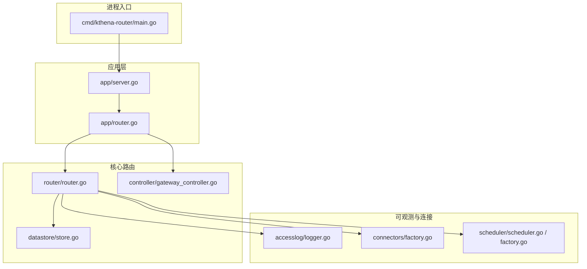
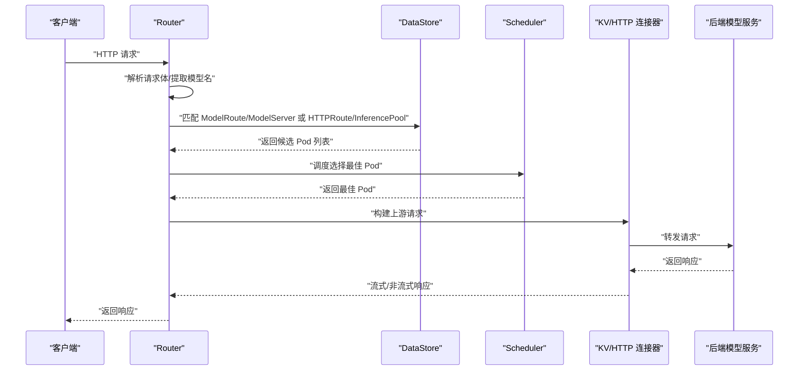
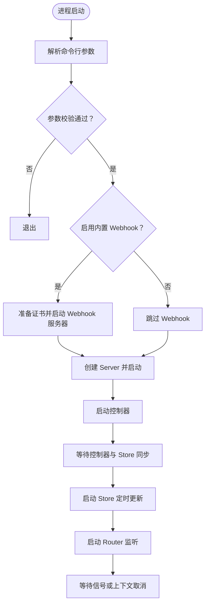
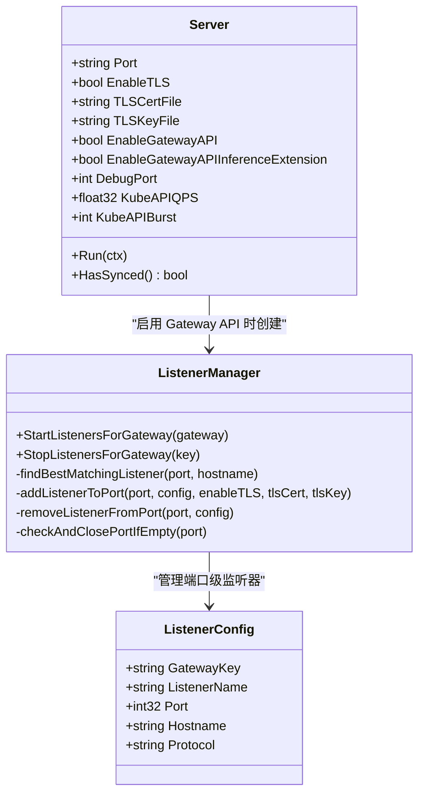
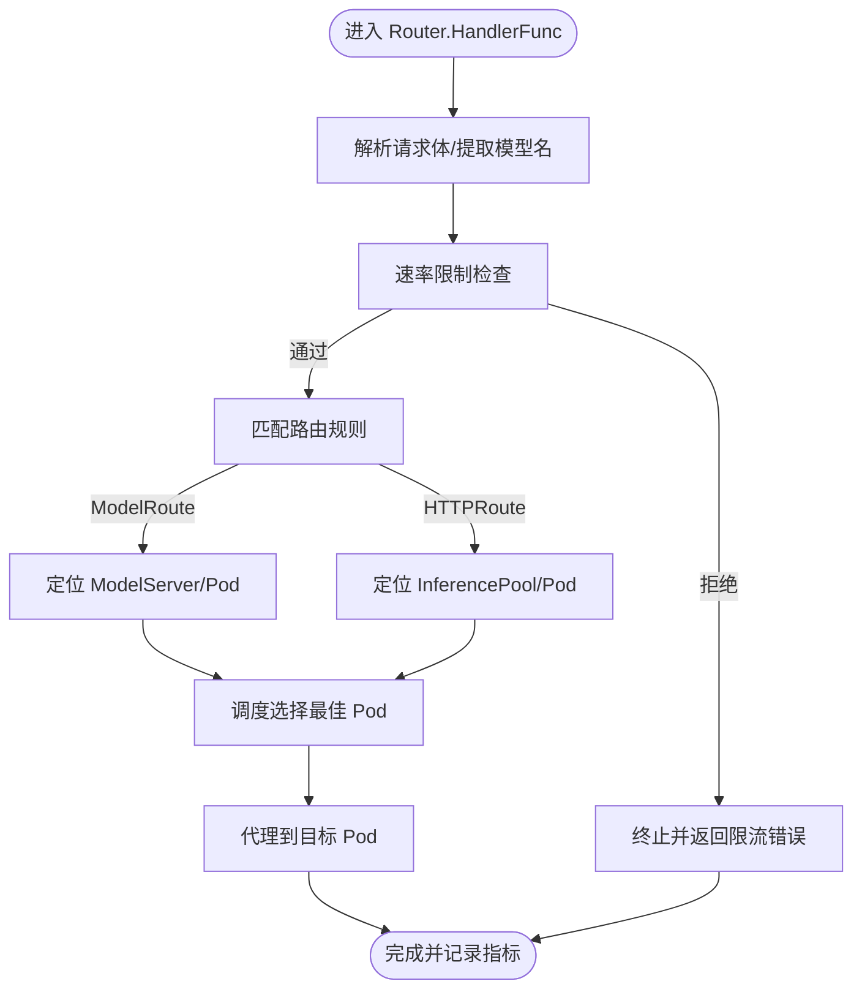
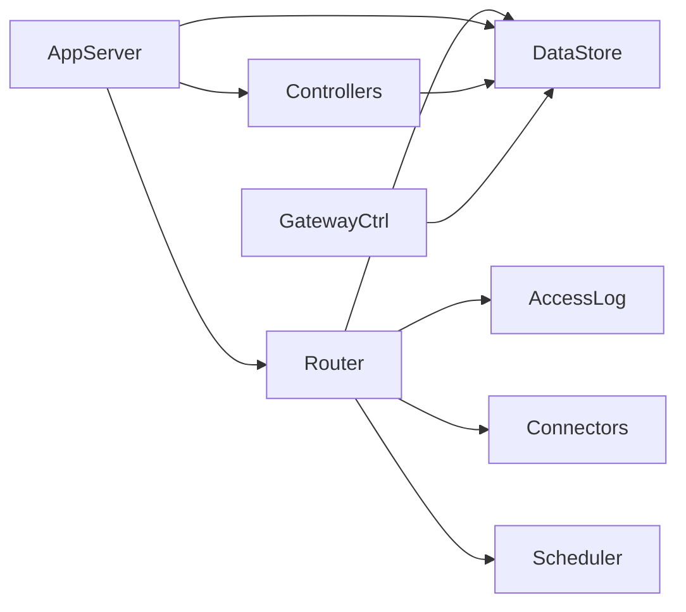

# Kthena Router 核心

<cite>
**本文引用的文件**
- [cmd/kthena-router/main.go](file://cmd/kthena-router/main.go)
- [cmd/kthena-router/app/server.go](file://cmd/kthena-router/app/server.go)
- [cmd/kthena-router/app/router.go](file://cmd/kthena-router/app/router.go)
- [pkg/kthena-router/router/router.go](file://pkg/kthena-router/router/router.go)
- [pkg/kthena-router/datastore/store.go](file://pkg/kthena-router/datastore/store.go)
- [pkg/kthena-router/controller/gateway_controller.go](file://pkg/kthena-router/controller/gateway_controller.go)
- [pkg/kthena-router/accesslog/logger.go](file://pkg/kthena-router/accesslog/logger.go)
- [pkg/kthena-router/connectors/factory.go](file://pkg/kthena-router/connectors/factory.go)
- [pkg/kthena-router/scheduler/scheduler.go](file://pkg/kthena-router/scheduler/scheduler.go)
- [pkg/kthena-router/scheduler/factory.go](file://pkg/kthena-router/scheduler/factory.go)
- [examples/kthena-router/Gateway.yaml](file://examples/kthena-router/Gateway.yaml)
- [examples/kthena-router/ModelRouteSimple.yaml](file://examples/kthena-router/ModelRouteSimple.yaml)
- [docs/kthena/docs/user-guide/config-router.md](file://docs/kthena/docs/user-guide/config-router.md)
</cite>

## 目录
1. [简介](#简介)
2. [项目结构](#项目结构)
3. [核心组件](#核心组件)
4. [架构总览](#架构总览)
5. [详细组件分析](#详细组件分析)
6. [依赖分析](#依赖分析)
7. [性能考虑](#性能考虑)
8. [故障排查指南](#故障排查指南)
9. [结论](#结论)
10. [附录](#附录)

## 简介
本文件面向 Kthena Router 数据平面入口组件，系统性阐述其核心架构与运行机制。重点覆盖以下方面：
- HTTP 服务器初始化与监听模式（默认端口、TLS、Gateway API 动态监听）
- 路由处理流程：请求解析、路由匹配、目标选择、响应返回
- 请求生命周期管理：访问日志、鉴权、速率限制、调度与代理
- 服务器配置参数（端口、TLS、网关 API 支持等）及其作用与配置方法
- 实际启动配置示例与调试技巧

## 项目结构
Kthena Router 的可执行程序位于 cmd/kthena-router，应用层在 app 包中组织；核心路由逻辑在 pkg/kthena-router/router 中实现；数据存储与控制器在 pkg/kthena-router/datastore 与 controller 中实现；访问日志、连接器与调度器分别在 accesslog、connectors、scheduler 子目录中。

图示来源
- [cmd/kthena-router/main.go:1-226](file://cmd/kthena-router/main.go#L1-L226)
- [cmd/kthena-router/app/server.go:1-86](file://cmd/kthena-router/app/server.go#L1-L86)
- [cmd/kthena-router/app/router.go:1-670](file://cmd/kthena-router/app/router.go#L1-L670)
- [pkg/kthena-router/router/router.go:1-800](file://pkg/kthena-router/router/router.go#L1-L800)
- [pkg/kthena-router/datastore/store.go:1-800](file://pkg/kthena-router/datastore/store.go#L1-L800)
- [pkg/kthena-router/controller/gateway_controller.go:1-174](file://pkg/kthena-router/controller/gateway_controller.go#L1-L174)
- [pkg/kthena-router/accesslog/logger.go:1-220](file://pkg/kthena-router/accesslog/logger.go#L1-L220)
- [pkg/kthena-router/connectors/factory.go:1-60](file://pkg/kthena-router/connectors/factory.go#L1-L60)
- [pkg/kthena-router/scheduler/scheduler.go:1-29](file://pkg/kthena-router/scheduler/scheduler.go#L1-L29)
- [pkg/kthena-router/scheduler/factory.go:1-144](file://pkg/kthena-router/scheduler/factory.go#L1-L144)

章节来源
- [cmd/kthena-router/main.go:1-226](file://cmd/kthena-router/main.go#L1-L226)
- [cmd/kthena-router/app/server.go:1-86](file://cmd/kthena-router/app/server.go#L1-L86)
- [cmd/kthena-router/app/router.go:1-670](file://cmd/kthena-router/app/router.go#L1-L670)

## 核心组件
- 进程入口与参数解析：负责命令行参数解析、信号处理、Webhook 证书准备与启动、以及 Server 启动。
- Server：统一协调控制器、数据存储、路由与监听器管理，保证控制器同步后再启动数据更新循环与路由服务。
- Router：核心请求处理器，包含请求解析、鉴权、速率限制、路由匹配、调度与代理转发。
- DataStore：集中式缓存与索引，维护模型服务器、Pod、Gateway、HTTPRoute、InferencePool 等资源状态，并提供回调与公平队列能力。
- Gateway 控制器：监听 Gateway 资源变化，按 GatewayClass 过滤并写入 DataStore，驱动动态监听器管理。
- 访问日志：支持 JSON/文本格式输出到 stdout/stderr/文件，贯穿请求全生命周期。
- 连接器工厂：根据后端类型选择合适的 KV/HTTP 连接器，支持 MoonCake、NIXL、SGLang 等。
- 调度器：基于插件框架的过滤与评分，结合公平队列与令牌追踪，实现高效的目标选择。

章节来源
- [pkg/kthena-router/router/router.go:1-800](file://pkg/kthena-router/router/router.go#L1-L800)
- [pkg/kthena-router/datastore/store.go:1-800](file://pkg/kthena-router/datastore/store.go#L1-L800)
- [pkg/kthena-router/accesslog/logger.go:1-220](file://pkg/kthena-router/accesslog/logger.go#L1-L220)
- [pkg/kthena-router/connectors/factory.go:1-60](file://pkg/kthena-router/connectors/factory.go#L1-L60)
- [pkg/kthena-router/scheduler/scheduler.go:1-29](file://pkg/kthena-router/scheduler/scheduler.go#L1-L29)
- [pkg/kthena-router/scheduler/factory.go:1-144](file://pkg/kthena-router/scheduler/factory.go#L1-L144)

## 架构总览
下图展示从请求进入 Router 到目标后端的完整链路，包括鉴权、速率限制、路由匹配、调度与代理。

图示来源
- [pkg/kthena-router/router/router.go:204-780](file://pkg/kthena-router/router/router.go#L204-L780)
- [pkg/kthena-router/datastore/store.go:178-240](file://pkg/kthena-router/datastore/store.go#L178-L240)
- [pkg/kthena-router/scheduler/scheduler.go:25-29](file://pkg/kthena-router/scheduler/scheduler.go#L25-L29)
- [pkg/kthena-router/connectors/factory.go:38-60](file://pkg/kthena-router/connectors/factory.go#L38-L60)

## 详细组件分析

### 进程入口与启动流程
- 命令行参数解析：支持端口、TLS 证书/密钥、是否启用内置 Webhook、Gateway API 及推理扩展、Webhook 端口与证书路径、调试端口、Kubernetes API 限速等。
- 信号处理：接收 SIGINT/SIGTERM 并优雅关闭。
- Webhook 证书准备：优先从 Secret 读取，其次尝试现有证书文件，最后自动签发并更新 ValidatingWebhook 配置。
- Server 启动：创建 DataStore、初始化 Router、启动控制器、等待控制器与 Store 同步、启动 Store 定时更新、启动路由监听。

图示来源
- [cmd/kthena-router/main.go:40-122](file://cmd/kthena-router/main.go#L40-L122)
- [cmd/kthena-router/main.go:135-195](file://cmd/kthena-router/main.go#L135-L195)
- [cmd/kthena-router/app/server.go:58-81](file://cmd/kthena-router/app/server.go#L58-L81)

章节来源
- [cmd/kthena-router/main.go:40-122](file://cmd/kthena-router/main.go#L40-L122)
- [cmd/kthena-router/main.go:135-195](file://cmd/kthena-router/main.go#L135-L195)
- [cmd/kthena-router/app/server.go:58-81](file://cmd/kthena-router/app/server.go#L58-L81)

### HTTP 服务器初始化与监听模式
- 默认模式：在指定端口启动 HTTP 服务器，提供 /healthz、/readyz、/metrics 与 /v1 路由组，使用中间件进行访问日志与鉴权。
- Gateway 模式：当启用 Gateway API 时，通过 ListenerManager 为每个监听端口动态创建独立的 HTTP 服务器，支持多监听器（主机名匹配、通配符、无限制），并在请求到达时设置 GatewayKey 以供后续路由匹配使用。
- TLS：若启用 TLS，则必须同时提供证书与私钥文件；否则启动失败。
- 调试端口：独立的 localhost 服务器提供 /debug/config_dump 下的资源查询接口，便于排障。

图示来源
- [cmd/kthena-router/app/server.go:28-56](file://cmd/kthena-router/app/server.go#L28-L56)
- [cmd/kthena-router/app/router.go:322-638](file://cmd/kthena-router/app/router.go#L322-L638)
- [cmd/kthena-router/app/router.go:182-303](file://cmd/kthena-router/app/router.go#L182-L303)

章节来源
- [cmd/kthena-router/app/router.go:47-105](file://cmd/kthena-router/app/router.go#L47-L105)
- [cmd/kthena-router/app/router.go:107-156](file://cmd/kthena-router/app/router.go#L107-L156)
- [cmd/kthena-router/app/router.go:182-303](file://cmd/kthena-router/app/router.go#L182-L303)
- [cmd/kthena-router/app/router.go:322-638](file://cmd/kthena-router/app/router.go#L322-L638)

### 路由处理流程与请求生命周期
- 请求解析：从请求体解析模型名，记录模型名与输入 token 数量，标记请求处理阶段结束。
- 速率限制：基于统一令牌桶限流器，支持输入/输出 token 与请求数维度的限流。
- 鉴权：通过 JWT Authenticator 对 /v1 路由进行鉴权。
- 路由匹配：
  - ModelServer 路径：优先匹配 ModelRoute/ModelServer，获取目标 Pod 与端口。
  - HTTPRoute 路径：匹配 Gateway 下的 HTTPRoute，解析 InferencePool 与目标端口，支持 URL 重写。
- 调度：根据最佳 Pod 列表选择最优目标，记录路由信息。
- 代理：构建上游请求，支持流式与非流式响应，统计输出 token 并更新令牌计数与队列统计。

图示来源
- [pkg/kthena-router/router/router.go:204-464](file://pkg/kthena-router/router/router.go#L204-L464)
- [pkg/kthena-router/router/router.go:500-672](file://pkg/kthena-router/router/router.go#L500-L672)
- [pkg/kthena-router/router/router.go:714-780](file://pkg/kthena-router/router/router.go#L714-L780)

章节来源
- [pkg/kthena-router/router/router.go:204-464](file://pkg/kthena-router/router/router.go#L204-L464)
- [pkg/kthena-router/router/router.go:500-672](file://pkg/kthena-router/router/router.go#L500-L672)
- [pkg/kthena-router/router/router.go:714-780](file://pkg/kthena-router/router/router.go#L714-L780)

### 访问日志与可观测性
- 日志配置：支持 JSON/文本格式，输出到 stdout/stderr/文件，可通过环境变量控制开关与格式。
- 生命周期打点：记录请求阶段开始/结束、上游处理阶段、错误类型与消息、模型名、路由信息、Pod 选择、Token 数量、耗时分解等。
- 调试端口：/debug/config_dump 提供资源列表与详情查询，便于排障。

章节来源
- [pkg/kthena-router/accesslog/logger.go:44-220](file://pkg/kthena-router/accesslog/logger.go#L44-L220)
- [cmd/kthena-router/app/router.go:107-156](file://cmd/kthena-router/app/router.go#L107-L156)

### 调度器与插件体系
- 接口：定义 Schedule 与 RunPostHooks，用于选择最佳 Pod 与执行后置钩子。
- 插件注册：默认注册评分与过滤插件（如 GPU 缓存使用、最少延迟、最少请求、随机、前缀缓存、KV 缓存感知、LoRA 亲和等）。
- 参数化：通过 ConfigMap 加载调度器配置，支持插件启用/禁用与权重设置。

章节来源
- [pkg/kthena-router/scheduler/scheduler.go:25-29](file://pkg/kthena-router/scheduler/scheduler.go#L25-L29)
- [pkg/kthena-router/scheduler/factory.go:66-144](file://pkg/kthena-router/scheduler/factory.go#L66-L144)
- [docs/kthena/docs/user-guide/config-router.md:9-97](file://docs/kthena/docs/user-guide/config-router.md#L9-L97)

### 连接器与后端适配
- 工厂模式：根据 KVConnectorType 返回对应连接器实例，默认 HTTP 连接器。
- 支持类型：HTTP、LMCache（HTTP）、MoonCake、NIXL、SGLang（内部）。

章节来源
- [pkg/kthena-router/connectors/factory.go:21-60](file://pkg/kthena-router/connectors/factory.go#L21-L60)

### 数据存储与回调
- 资源索引：维护 ModelServer、Pod、Gateway、HTTPRoute、InferencePool 等资源映射与回调。
- 公平队列：基于滑动窗口令牌追踪与优先级队列，支持并发与 QPS 限制。
- 回调机制：当资源变更时触发回调，驱动 Router 与监听器更新。

章节来源
- [pkg/kthena-router/datastore/store.go:162-240](file://pkg/kthena-router/datastore/store.go#L162-L240)
- [pkg/kthena-router/datastore/store.go:410-485](file://pkg/kthena-router/datastore/store.go#L410-L485)

### Gateway 控制器与动态监听
- 过滤：仅处理 GatewayClass 为 kthena-router 的 Gateway。
- 同步：等待 Informer 同步后标记初始同步完成。
- 写入：将 Gateway 写入 DataStore，触发回调，进而由 ListenerManager 启动/停止对应端口监听器。

章节来源
- [pkg/kthena-router/controller/gateway_controller.go:47-174](file://pkg/kthena-router/controller/gateway_controller.go#L47-L174)
- [cmd/kthena-router/app/router.go:48-104](file://cmd/kthena-router/app/router.go#L48-L104)

## 依赖分析
- 组件耦合：
  - Router 依赖 DataStore（查询/匹配）、AccessLog（记录）、Connectors（后端连接）、Scheduler（目标选择）。
  - App 层 Server 协调控制器、Store 与 Router，确保同步后再启动服务。
  - Gateway 控制器向 DataStore 注入 Gateway 资源，驱动动态监听器管理。
- 外部依赖：
  - Kubernetes API（Gateway/HTTPRoute/InferencePool 等 CRD）。
  - Prometheus 客户端（/metrics）。
  - Gin（HTTP 路由与中间件）。

图示来源
- [pkg/kthena-router/router/router.go:73-168](file://pkg/kthena-router/router/router.go#L73-L168)
- [cmd/kthena-router/app/server.go:28-56](file://cmd/kthena-router/app/server.go#L28-L56)
- [pkg/kthena-router/controller/gateway_controller.go:37-101](file://pkg/kthena-router/controller/gateway_controller.go#L37-L101)

章节来源
- [pkg/kthena-router/router/router.go:73-168](file://pkg/kthena-router/router/router.go#L73-L168)
- [cmd/kthena-router/app/server.go:28-56](file://cmd/kthena-router/app/server.go#L28-L56)
- [pkg/kthena-router/controller/gateway_controller.go:37-101](file://pkg/kthena-router/controller/gateway_controller.go#L37-L101)

## 性能考虑
- 公平调度与队列：通过滑动窗口令牌追踪与优先级队列，平衡不同用户与模型的负载，避免饥饿。
- 调度插件：合理配置评分与过滤插件权重，结合后端指标（TTFT/TPOT/KV 缓存）提升命中率与吞吐。
- 速率限制：统一令牌桶限流器减少后端压力，避免突发流量冲击。
- 监听器复用：Gateway 模式下按端口聚合监听器，减少进程与连接开销。
- 日志与指标：访问日志与 Prometheus 指标有助于定位瓶颈与优化策略。

## 故障排查指南
- 启动失败
  - TLS 参数不匹配：需同时提供证书与私钥文件。
  - Gateway API 扩展未启用但开启扩展功能：需要先启用标准 Gateway API。
  - Webhook 证书准备失败：检查 Secret、挂载路径与权限。
- 路由不生效
  - 确认 GatewayClass 名称与控制器一致。
  - 检查 ModelRoute/HTTPRoute 是否正确匹配请求路径与主机名。
  - 使用 /debug/config_dump 查询当前资源状态。
- 限流与排队
  - 查看队列长度与令牌计数，调整公平队列与 QPS 配置。
- 调试端口
  - 通过 localhost:debugPort 获取资源快照，辅助定位问题。

章节来源
- [cmd/kthena-router/main.go:84-98](file://cmd/kthena-router/main.go#L84-L98)
- [cmd/kthena-router/app/router.go:107-156](file://cmd/kthena-router/app/router.go#L107-L156)
- [pkg/kthena-router/datastore/store.go:410-485](file://pkg/kthena-router/datastore/store.go#L410-L485)

## 结论
Kthena Router 通过清晰的分层架构与模块化设计，实现了高性能、可观测且可扩展的数据平面入口。其核心优势在于：
- 灵活的监听模式（默认与 Gateway API 动态监听）
- 完整的请求生命周期管理（解析、鉴权、限流、匹配、调度、代理）
- 可配置的调度与连接器体系
- 强大的可观测性与调试能力

## 附录

### 服务器配置参数与作用
- 端口：对外监听端口（默认 8080）
- TLS：启用 HTTPS，需同时提供证书与私钥文件
- Webhook：启用内置 Admission Webhook 服务器
- Gateway API：启用标准 Gateway API 支持
- 推理扩展：启用 Gateway API Inference Extension（需先启用标准 Gateway API）
- Webhook 端口与证书：Webhook 服务器端口与证书/私钥路径
- 调试端口：本地只听的调试服务器端口
- Kubernetes API 限速：QPS/Burst 用于与 API Server 交互

章节来源
- [cmd/kthena-router/main.go:67-81](file://cmd/kthena-router/main.go#L67-L81)

### 启动配置示例
- 示例 Gateway：定义 GatewayClass 为 kthena-router，监听端口 8081。
- 示例 ModelRoute：将模型名映射到具体 ModelServer。

章节来源
- [examples/kthena-router/Gateway.yaml:1-12](file://examples/kthena-router/Gateway.yaml#L1-L12)
- [examples/kthena-router/ModelRouteSimple.yaml:1-12](file://examples/kthena-router/ModelRouteSimple.yaml#L1-L12)

### 调度器与认证配置示例
- 调度器配置：包含插件启用/禁用与参数，支持权重设置。
- 认证配置：JWT Issuer/Audiences/JWKS URI。

章节来源
- [docs/kthena/docs/user-guide/config-router.md:9-97](file://docs/kthena/docs/user-guide/config-router.md#L9-L97)
- [docs/kthena/docs/user-guide/config-router.md:99-142](file://docs/kthena/docs/user-guide/config-router.md#L99-L142)