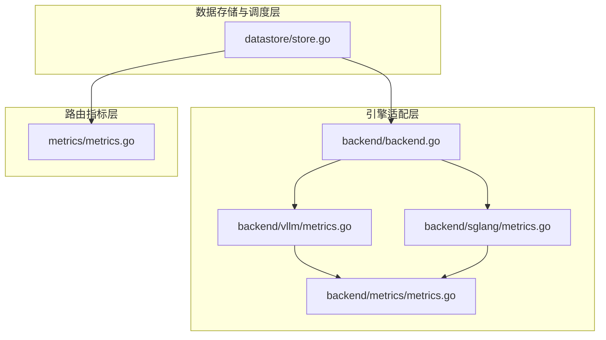
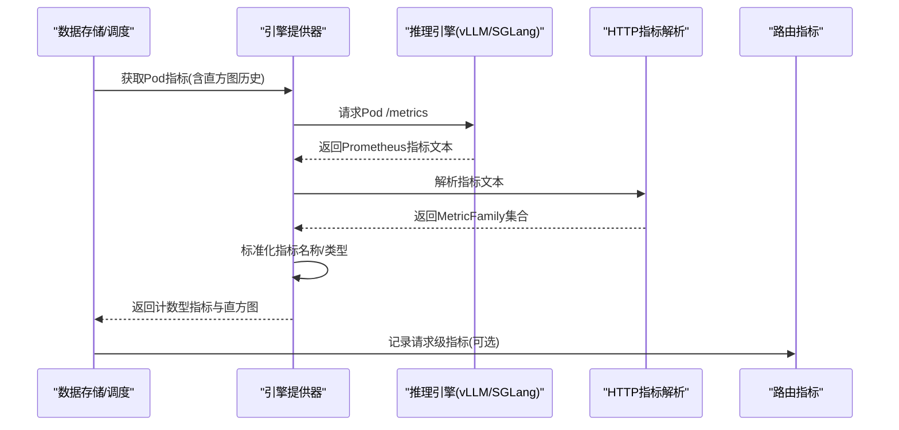
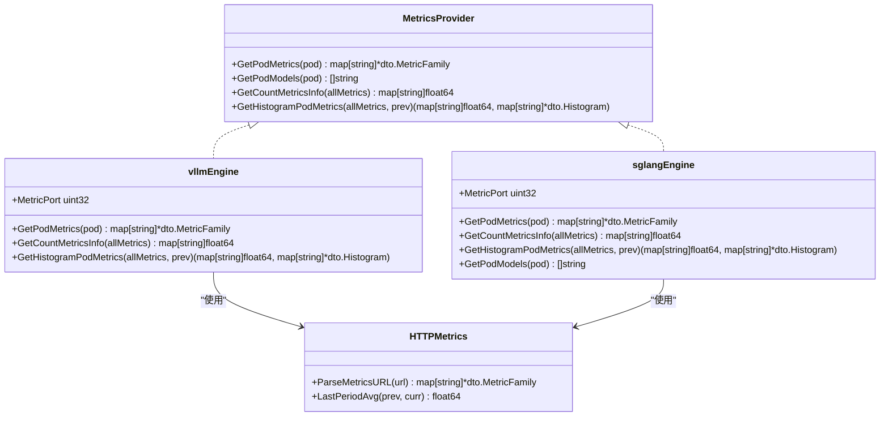
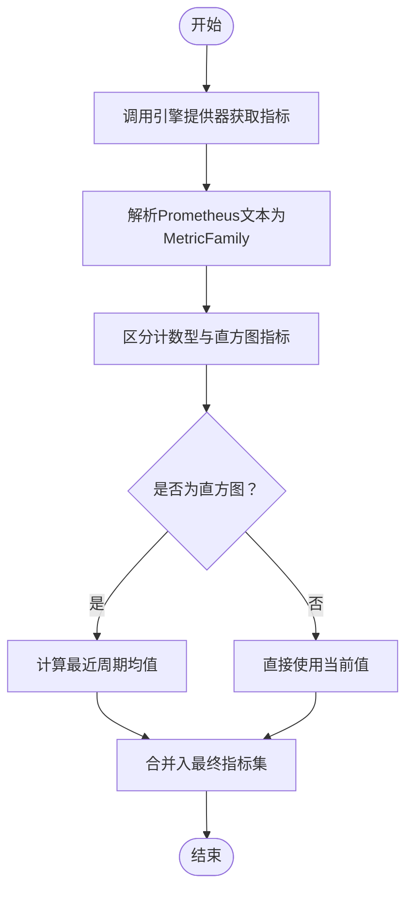
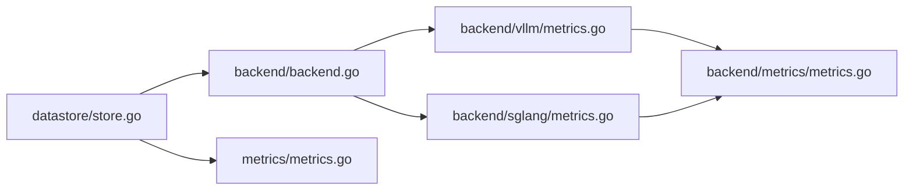

# 后端指标系统

<cite>
**本文引用的文件**
- [metrics.go](file://pkg/kthena-router/backend/metrics/metrics.go)
- [metrics.go](file://pkg/kthena-router/backend/vllm/metrics.go)
- [metrics.go](file://pkg/kthena-router/backend/sglang/metrics.go)
- [backend.go](file://pkg/kthena-router/backend/backend.go)
- [metrics.go](file://pkg/kthena-router/metrics/metrics.go)
- [store.go](file://pkg/kthena-router/datastore/store.go)
- [runtime.md](file://docs/kthena/docs/user-guide/runtime.md)
- [router_test.go](file://pkg/kthena-router/router/router_test.go)
- [store_test.go](file://pkg/kthena-router/datastore/store_test.go)
</cite>

## 目录
1. [简介](#简介)
2. [项目结构](#项目结构)
3. [核心组件](#核心组件)
4. [架构总览](#架构总览)
5. [组件详解](#组件详解)
6. [依赖关系分析](#依赖关系分析)
7. [性能考量](#性能考量)
8. [故障排查指南](#故障排查指南)
9. [结论](#结论)
10. [附录](#附录)

## 简介
本技术文档面向后端指标系统，系统性阐述指标定义、采集与上报机制，覆盖 vLLM 与 SGLang 推理引擎的指标实现细节，明确指标命名规范与聚合策略，并提供配置示例与监控集成方案。同时给出性能影响分析与优化建议，以及基于指标数据进行性能分析与故障排查的方法论。

## 项目结构
围绕指标系统的关键代码主要分布在以下模块：
- 引擎适配层：封装 vLLM 与 SGLang 的指标采集与标准化映射
- 指标注册与记录层：在路由侧统一注册并记录请求级指标
- 数据存储与调度层：周期性拉取后端 Pod 指标，维护直方图状态并参与调度决策
- 文档与测试：提供指标标准化说明与行为验证

图表来源
- [backend.go:37-82](file://pkg/kthena-router/backend/backend.go#L37-L82)
- [metrics.go:58-120](file://pkg/kthena-router/backend/vllm/metrics.go#L58-L120)
- [metrics.go:59-126](file://pkg/kthena-router/backend/sglang/metrics.go#L59-L126)
- [metrics.go:38-73](file://pkg/kthena-router/backend/metrics/metrics.go#L38-L73)
- [metrics.go:54-223](file://pkg/kthena-router/metrics/metrics.go#L54-L223)
- [store.go:135-149](file://pkg/kthena-router/datastore/store.go#L135-L149)

章节来源
- [backend.go:37-82](file://pkg/kthena-router/backend/backend.go#L37-L82)
- [metrics.go:58-120](file://pkg/kthena-router/backend/vllm/metrics.go#L58-L120)
- [metrics.go:59-126](file://pkg/kthena-router/backend/sglang/metrics.go#L59-L126)
- [metrics.go:38-73](file://pkg/kthena-router/backend/metrics/metrics.go#L38-L73)
- [metrics.go:54-223](file://pkg/kthena-router/metrics/metrics.go#L54-L223)
- [store.go:135-149](file://pkg/kthena-router/datastore/store.go#L135-L149)

## 核心组件
- 引擎指标提供器（MetricsProvider）：抽象 vLLM/SGLang 的指标获取与标准化映射
- 引擎适配器（vLLM/SGLang 实现）：负责从后端 Pod 暴露的 /metrics 接口抓取指标，按需计算直方图的“最近周期均值”
- 公共解析器（HTTP 指标解析）：统一解析 Prometheus 文本格式指标
- 路由指标注册与记录（Metrics）：注册并记录请求级指标（请求数、时延、令牌数、队列与调度器插件耗时等）
- 数据存储与调度（Store）：周期性调用引擎提供器获取指标，维护直方图历史，参与公平调度

章节来源
- [backend.go:30-82](file://pkg/kthena-router/backend/backend.go#L30-L82)
- [metrics.go:71-120](file://pkg/kthena-router/backend/vllm/metrics.go#L71-L120)
- [metrics.go:72-126](file://pkg/kthena-router/backend/sglang/metrics.go#L72-L126)
- [metrics.go:38-73](file://pkg/kthena-router/backend/metrics/metrics.go#L38-L73)
- [metrics.go:54-223](file://pkg/kthena-router/metrics/metrics.go#L54-L223)
- [store.go:1168-1188](file://pkg/kthena-router/datastore/store.go#L1168-L1188)

## 架构总览
下图展示从 Pod 指标采集到路由侧指标记录的整体流程：

图表来源
- [store.go:1168-1188](file://pkg/kthena-router/datastore/store.go#L1168-L1188)
- [backend.go:42-65](file://pkg/kthena-router/backend/backend.go#L42-L65)
- [metrics.go:71-79](file://pkg/kthena-router/backend/vllm/metrics.go#L71-L79)
- [metrics.go:72-80](file://pkg/kthena-router/backend/sglang/metrics.go#L72-L80)
- [metrics.go:38-55](file://pkg/kthena-router/backend/metrics/metrics.go#L38-L55)
- [metrics.go:225-259](file://pkg/kthena-router/metrics/metrics.go#L225-L259)

## 组件详解

### 引擎指标提供器与适配器
- 抽象接口（MetricsProvider）：定义获取指标、模型列表、计数型指标信息、直方图指标信息的标准能力
- vLLM 适配器：默认指标端口 8000，从 PodIP:8000/metrics 抓取指标；支持 GPU 缓存使用率、等待/运行中请求数、每输出 token 时间、首 token 时间等
- SGLang 适配器：默认指标端口 30000，从 PodIP:30000/metrics 抓取指标；指标项与 vLLM 对应，用于标准化映射
- 公共解析器：通过 HTTP 客户端抓取 /metrics 文本，使用 Prometheus 解析器转换为 MetricFamily 集合；提供“最近周期均值”计算以平滑直方图波动

图表来源
- [backend.go:30-82](file://pkg/kthena-router/backend/backend.go#L30-L82)
- [metrics.go:58-120](file://pkg/kthena-router/backend/vllm/metrics.go#L58-L120)
- [metrics.go:59-126](file://pkg/kthena-router/backend/sglang/metrics.go#L59-L126)
- [metrics.go:38-73](file://pkg/kthena-router/backend/metrics/metrics.go#L38-L73)

章节来源
- [backend.go:30-82](file://pkg/kthena-router/backend/backend.go#L30-L82)
- [metrics.go:58-120](file://pkg/kthena-router/backend/vllm/metrics.go#L58-L120)
- [metrics.go:59-126](file://pkg/kthena-router/backend/sglang/metrics.go#L59-L126)
- [metrics.go:38-73](file://pkg/kthena-router/backend/metrics/metrics.go#L38-L73)

### 指标标准化与命名规范
- 标准化目标：将不同引擎的原始指标名映射为统一前缀与语义的指标名，便于在 Prometheus/Grafana 中一致呈现
- 标准化清单（前缀 kthena:*）：
  - generation_tokens_total → kthena:generation_tokens_total
  - num_requests_waiting → kthena:num_requests_waiting
  - time_to_first_token_seconds → kthena:time_to_first_token_seconds
  - time_per_output_token_seconds → kthena:time_per_output_token_seconds
  - e2e_request_latency_seconds → kthena:e2e_request_latency_seconds
- 原则：仅对内置映射覆盖的指标进行标准化，保留原始指标不变，可同时获得“原始 + 标准化”指标

章节来源
- [runtime.md:121-134](file://docs/kthena/docs/user-guide/runtime.md#L121-L134)

### 路由侧指标注册与记录
- 注册维度：模型、路径、状态码、错误类型、令牌类型、插件、限流类型、用户 ID、模型服务/路由等
- 指标类别：
  - 请求总量、端到端时延直方图、预填/解码阶段时延直方图
  - 输入/输出令牌总量
  - 公平调度队列大小、排队时延、取消/出队次数、在途请求数、优先级刷新/堆重建次数
  - 调度器插件处理耗时
  - 速率限制触发次数
- 记录方式：提供统一 Recorder 结构体，贯穿请求生命周期自动打点与观测

章节来源
- [metrics.go:54-223](file://pkg/kthena-router/metrics/metrics.go#L54-L223)
- [metrics.go:225-448](file://pkg/kthena-router/metrics/metrics.go#L225-L448)

### 数据存储与调度中的指标采集
- 周期性更新：Store 在后台定时任务中调用引擎提供器获取指标
- 指标类型：
  - 计数型指标：GPU 缓存使用率、等待/运行中请求数
  - 直方图指标：每输出 token 时间、首 token 时间
- 直方图聚合策略：采用“最近周期均值”算法，避免历史累积带来的漂移，确保新旧样本差分的稳定性
- 模型列表：SGLang 引擎通过公共方法从指标端口查询已加载模型列表

图表来源
- [store.go:1168-1188](file://pkg/kthena-router/datastore/store.go#L1168-L1188)
- [metrics.go:97-119](file://pkg/kthena-router/backend/vllm/metrics.go#L97-L119)
- [metrics.go:98-120](file://pkg/kthena-router/backend/sglang/metrics.go#L98-L120)
- [metrics.go:57-72](file://pkg/kthena-router/backend/metrics/metrics.go#L57-L72)

章节来源
- [store.go:1168-1188](file://pkg/kthena-router/datastore/store.go#L1168-L1188)
- [metrics.go:97-119](file://pkg/kthena-router/backend/vllm/metrics.go#L97-L119)
- [metrics.go:98-120](file://pkg/kthena-router/backend/sglang/metrics.go#L98-L120)
- [metrics.go:57-72](file://pkg/kthena-router/backend/metrics/metrics.go#L57-L72)

### vLLM 与 SGLang 特定指标采集方法
- vLLM
  - 指标端口：默认 8000
  - 关键指标：GPU 缓存使用率、等待/运行中请求数、每输出 token 时间、首 token 时间
  - 采集流程：HTTP 抓取 -> 解析 -> 标准化 -> 计数型/直方图分离
- SGLang
  - 指标端口：默认 30000
  - 关键指标：token 使用量（映射为 GPU 缓存使用率）、等待/运行中请求数、每输出 token 时间、首 token 时间
  - 采集流程：HTTP 抓取 -> 解析 -> 标准化 -> 计数型/直方图分离
  - 模型列表：通过公共方法从指标端口查询

章节来源
- [metrics.go:29-56](file://pkg/kthena-router/backend/vllm/metrics.go#L29-L56)
- [metrics.go:71-119](file://pkg/kthena-router/backend/vllm/metrics.go#L71-L119)
- [metrics.go:30-57](file://pkg/kthena-router/backend/sglang/metrics.go#L30-L57)
- [metrics.go:72-125](file://pkg/kthena-router/backend/sglang/metrics.go#L72-L125)

### 指标配置示例与监控集成
- 配置要点
  - 引擎类型：在 ModelServer 中声明推理引擎类型（如 vLLM/SGLang），Store 将据此选择对应提供器
  - 指标端口：默认端口已在适配器中硬编码，若后端自定义端口，需在适配器扩展或通过外部配置注入
  - 标准化：启用后可在监控系统中直接使用 kthena:* 前缀指标，无需关心引擎差异
- 监控集成
  - Prometheus：路由侧指标通过标准 /metrics 暴露；后端 Pod 指标通过引擎适配器抓取并标准化
  - Grafana：可直接基于 kthena:* 指标构建面板，或结合原始指标进行交叉分析

章节来源
- [router_test.go:167-181](file://pkg/kthena-router/router/router_test.go#L167-L181)
- [runtime.md:121-134](file://docs/kthena/docs/user-guide/runtime.md#L121-L134)

## 依赖关系分析
- 组件耦合
  - Store 依赖 backend.GetPodMetrics 与 backend.GetPodModels，实现对后端 Pod 的指标与模型列表采集
  - backend 层通过接口抽象屏蔽具体引擎差异，便于扩展其他引擎
  - 路由指标层独立于引擎层，仅在需要时记录请求级指标
- 外部依赖
  - Prometheus 文本解析库用于解析 /metrics 文本
  - Kubernetes Pod IP 与端口用于访问引擎指标端点

图表来源
- [store.go:143-149](file://pkg/kthena-router/datastore/store.go#L143-L149)
- [backend.go:42-82](file://pkg/kthena-router/backend/backend.go#L42-L82)
- [metrics.go:71-79](file://pkg/kthena-router/backend/vllm/metrics.go#L71-L79)
- [metrics.go:72-80](file://pkg/kthena-router/backend/sglang/metrics.go#L72-L80)
- [metrics.go:88-223](file://pkg/kthena-router/metrics/metrics.go#L88-L223)

章节来源
- [store.go:143-149](file://pkg/kthena-router/datastore/store.go#L143-L149)
- [backend.go:42-82](file://pkg/kthena-router/backend/backend.go#L42-L82)
- [metrics.go:71-79](file://pkg/kthena-router/backend/vllm/metrics.go#L71-L79)
- [metrics.go:72-80](file://pkg/kthena-router/backend/sglang/metrics.go#L72-L80)
- [metrics.go:88-223](file://pkg/kthena-router/metrics/metrics.go#L88-L223)

## 性能考量
- 采集频率与开销
  - Store 默认以固定间隔轮询后端 Pod 指标，建议根据集群规模与后端数量调整轮询间隔，避免过度抓取
  - HTTP 抓取设置超时时间，防止阻塞调度循环
- 直方图平滑策略
  - 最近周期均值法有效抑制历史累积影响，降低抖动；但首次样本会返回零值，属于预期行为
- 指标维度与标签基数
  - 路由指标包含多维标签（模型、路径、状态码、用户 ID 等），高基数可能导致指标体量增长，建议在监控系统中合理裁剪与聚合
- 并发与锁
  - Store 内部使用互斥保护共享状态，注意避免在热路径上执行重操作

章节来源
- [metrics.go:29-35](file://pkg/kthena-router/backend/metrics/metrics.go#L29-L35)
- [metrics.go:108-116](file://pkg/kthena-router/backend/vllm/metrics.go#L108-L116)
- [metrics.go:109-117](file://pkg/kthena-router/backend/sglang/metrics.go#L109-L117)
- [metrics.go:225-339](file://pkg/kthena-router/metrics/metrics.go#L225-L339)

## 故障排查指南
- 无法获取后端指标
  - 检查 Pod 状态与网络连通性（PodIP 可用、端口可达）
  - 核对引擎类型与端口配置（vLLM 默认 8000，SGLang 默认 30000）
  - 查看日志中关于抓取失败与解析错误的提示
- 指标为空或异常
  - 首次采集直方图可能返回零值，属正常；持续异常需检查后端是否暴露指标
  - 确认标准化映射是否生效，必要时对比原始指标与标准化指标
- 模型列表缺失
  - 仅 SGLang 提供模型列表查询能力，确认后端版本与端口正确
- 行为验证参考
  - 单元测试覆盖了 Pod 标签更新不触发重复抓取、模型服务器切换保留指标等场景，可作为回归参考

章节来源
- [store_test.go:1506-1725](file://pkg/kthena-router/datastore/store_test.go#L1506-L1725)
- [store_test.go:1697-1725](file://pkg/kthena-router/datastore/store_test.go#L1697-L1725)
- [metrics.go:122-126](file://pkg/kthena-router/backend/sglang/metrics.go#L122-L126)

## 结论
该指标系统通过引擎适配器与标准化映射，实现了对 vLLM 与 SGLang 的统一可观测；结合路由侧指标与数据存储层的周期性采集与直方图平滑策略，能够稳定支撑调度与性能分析。建议在生产环境中合理设置采集频率与标签维度，配合监控系统进行可视化与告警，以获得更佳的运维体验。

## 附录
- 指标命名规范（节选）
  - kthena:generation_tokens_total
  - kthena:num_requests_waiting
  - kthena:time_to_first_token_seconds
  - kthena:time_per_output_token_seconds
  - kthena:e2e_request_latency_seconds
- 相关实现位置
  - 引擎适配器与解析器：[metrics.go:58-120](file://pkg/kthena-router/backend/vllm/metrics.go#L58-L120)、[metrics.go:59-126](file://pkg/kthena-router/backend/sglang/metrics.go#L59-L126)、[metrics.go:38-73](file://pkg/kthena-router/backend/metrics/metrics.go#L38-L73)
  - 路由指标注册与记录：[metrics.go:54-223](file://pkg/kthena-router/metrics/metrics.go#L54-L223)
  - 数据存储与调度采集：[store.go:1168-1188](file://pkg/kthena-router/datastore/store.go#L1168-L1188)
  - 引擎类型与端口示例：[router_test.go:167-181](file://pkg/kthena-router/router/router_test.go#L167-L181)