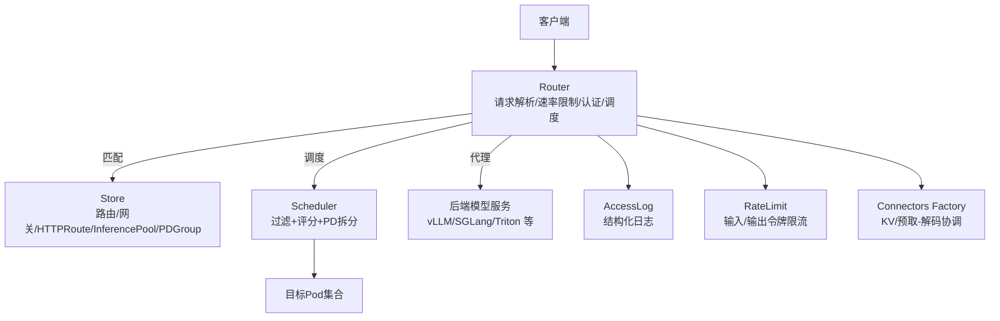
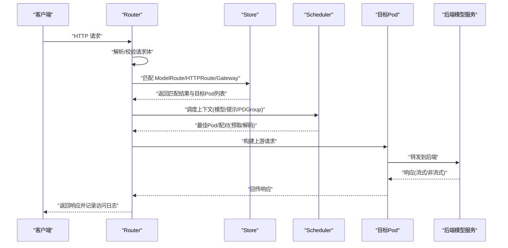
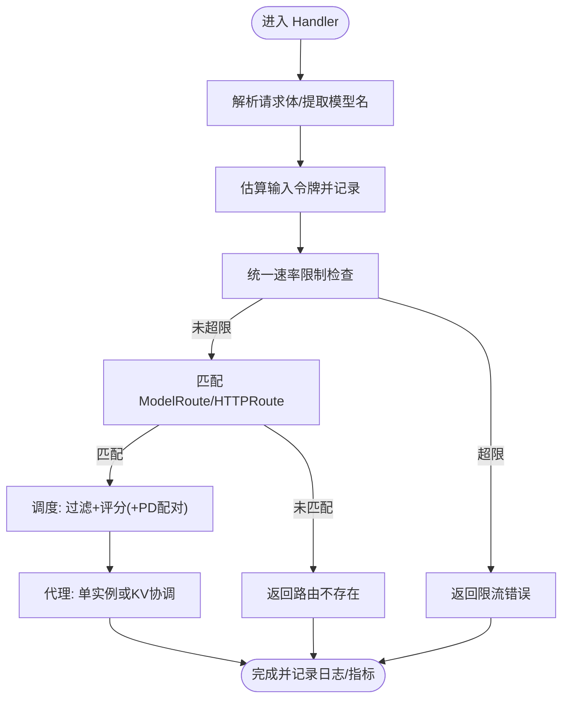
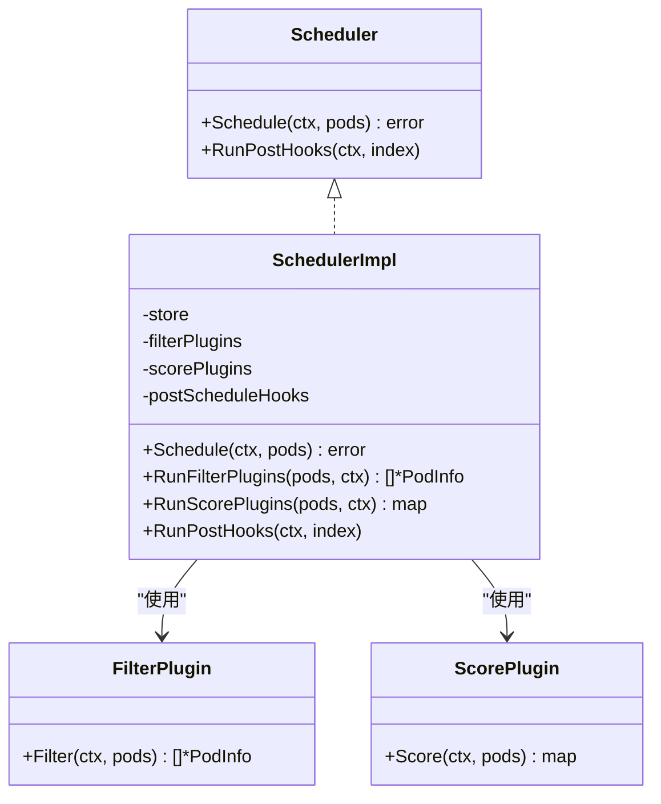
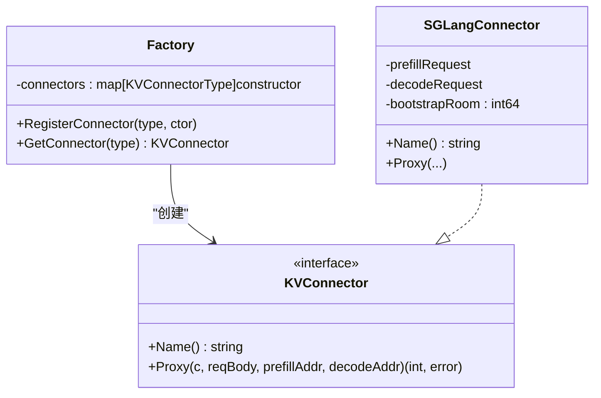
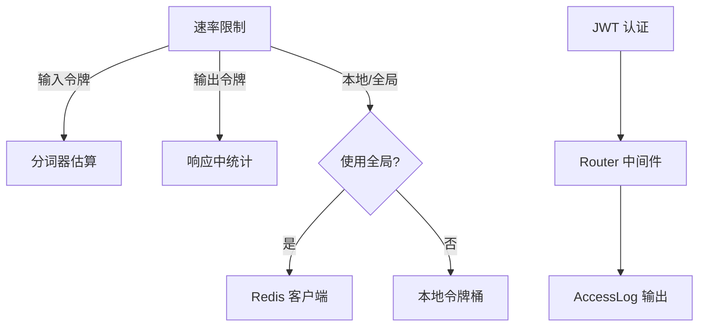
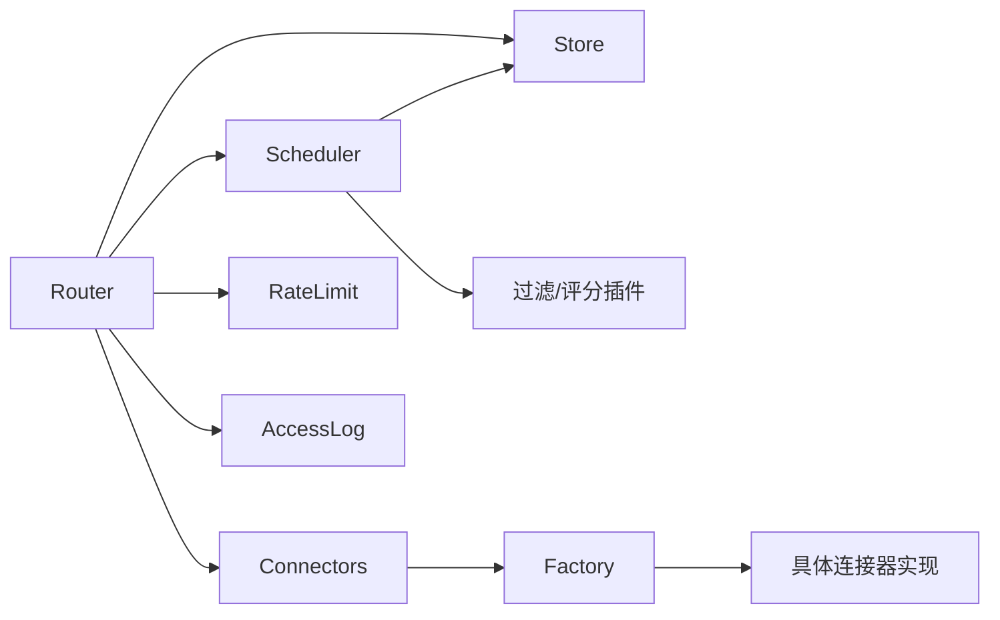

# 数据平面组件

<cite>
**本文引用的文件**
- [cmd/kthena-router/main.go](file://cmd/kthena-router/main.go)
- [pkg/kthena-router/router/router.go](file://pkg/kthena-router/router/router.go)
- [pkg/kthena-router/scheduler/scheduler.go](file://pkg/kthena-router/scheduler/scheduler.go)
- [pkg/kthena-router/scheduler/scheduler_impl.go](file://pkg/kthena-router/scheduler/scheduler_impl.go)
- [pkg/kthena-router/scheduler/plugins/least_request.go](file://pkg/kthena-router/scheduler/plugins/least_request.go)
- [pkg/kthena-router/scheduler/plugins/least_latency.go](file://pkg/kthena-router/scheduler/plugins/least_latency.go)
- [pkg/kthena-router/connectors/factory.go](file://pkg/kthena-router/connectors/factory.go)
- [pkg/kthena-router/connectors/interface.go](file://pkg/kthena-router/connectors/interface.go)
- [pkg/kthena-router/connectors/sglang.go](file://pkg/kthena-router/connectors/sglang.go)
- [pkg/kthena-router/filters/ratelimit/ratelimit.go](file://pkg/kthena-router/filters/ratelimit/ratelimit.go)
- [pkg/kthena-router/accesslog/logger.go](file://pkg/kthena-router/accesslog/logger.go)
- [pkg/kthena-router/datastore/store.go](file://pkg/kthena-router/datastore/store.go)
</cite>

## 目录
1. [简介](#简介)
2. [项目结构](#项目结构)
3. [核心组件](#核心组件)
4. [架构总览](#架构总览)
5. [详细组件分析](#详细组件分析)
6. [依赖分析](#依赖分析)
7. [性能考虑](#性能考虑)
8. [故障排查指南](#故障排查指南)
9. [结论](#结论)
10. [附录](#附录)

## 简介
本文件面向 Kthena 平台的数据平面组件，聚焦于 kthena-router 的架构与实现，涵盖请求处理流水线、调度器系统（含公平调度、最少请求数、延迟感知等）、连接器工厂（多推理引擎适配：vLLM、SGLang、Triton 等）、过滤器系统（速率限制、认证鉴权、访问日志等），并提供配置参数、性能优化策略与故障恢复机制，辅以请求路由示例与调试技巧，帮助开发者理解与扩展数据平面能力。

## 项目结构
kthena-router 作为数据平面入口，负责接收外部请求、进行路由匹配、负载均衡与调度、转发到后端模型服务，并记录可观测性指标与访问日志。其核心模块包括：
- 路由器 Router：统一处理入口、速率限制、认证、调度、代理与日志
- 调度器 Scheduler：插件化过滤与评分，支持 PD 拆分场景
- 连接器工厂 Connectors Factory：按引擎类型选择 KV 缓存/预取-解码协调
- 过滤器 Filters：速率限制、认证鉴权、令牌计数
- 访问日志 AccessLog：结构化输出与可配置格式
- 数据存储 Store：路由规则、Pod 元信息、队列与统计

图表来源
- [pkg/kthena-router/router/router.go:73-169](file://pkg/kthena-router/router/router.go#L73-L169)
- [pkg/kthena-router/scheduler/scheduler_impl.go:40-99](file://pkg/kthena-router/scheduler/scheduler_impl.go#L40-L99)
- [pkg/kthena-router/datastore/store.go:162-240](file://pkg/kthena-router/datastore/store.go#L162-L240)
- [pkg/kthena-router/accesslog/logger.go:28-62](file://pkg/kthena-router/accesslog/logger.go#L28-L62)
- [pkg/kthena-router/filters/ratelimit/ratelimit.go:60-98](file://pkg/kthena-router/filters/ratelimit/ratelimit.go#L60-L98)
- [pkg/kthena-router/connectors/factory.go:21-60](file://pkg/kthena-router/connectors/factory.go#L21-L60)

章节来源
- [pkg/kthena-router/router/router.go:73-169](file://pkg/kthena-router/router/router.go#L73-L169)
- [pkg/kthena-router/scheduler/scheduler_impl.go:40-99](file://pkg/kthena-router/scheduler/scheduler_impl.go#L40-L99)
- [pkg/kthena-router/datastore/store.go:162-240](file://pkg/kthena-router/datastore/store.go#L162-L240)
- [pkg/kthena-router/accesslog/logger.go:28-62](file://pkg/kthena-router/accesslog/logger.go#L28-L62)
- [pkg/kthena-router/filters/ratelimit/ratelimit.go:60-98](file://pkg/kthena-router/filters/ratelimit/ratelimit.go#L60-L98)
- [pkg/kthena-router/connectors/factory.go:21-60](file://pkg/kthena-router/connectors/factory.go#L21-L60)

## 核心组件
- 路由器 Router
  - 统一处理入口，解析请求、计算输入令牌、应用速率限制、执行调度、代理到后端或 KV 协调
  - 支持 Gateway API 与 Inference Extension，兼容 /v1/ 与非 /v1/ 路径
  - 集成访问日志、指标与令牌计数
- 调度器 Scheduler
  - 插件化框架：过滤（如最少等待请求）与评分（如最少请求数、延迟感知）
  - PD 拆分优化：预取/解码配对选择，提升吞吐与时延
  - 公平调度开关与优先级权重
- 连接器工厂 Connectors Factory
  - 工厂模式注册多种 KV 连接器（HTTP、LMCache、MoonCake、NIXL、SGLang）
  - 基于引擎类型自动选择，支持 PD 拆分场景下的预取-解码协调
- 过滤器 Filters
  - 速率限制：本地/全局（Redis）令牌桶，区分输入/输出令牌
  - 认证鉴权：JWT 认证器（通过 Router 注入）
  - 令牌计数：基于分词器估算输入令牌，用于限流与指标
- 访问日志 AccessLog
  - 可配置 JSON/文本格式、输出位置（stdout/stderr/文件）
  - 结构化字段覆盖请求/响应/路由/网关/令牌/耗时等
- 数据存储 Store
  - 路由规则、网关/HTTPRoute/InferencePool、Pod 元信息与运行指标
  - 公平队列与令牌追踪，支持环境变量配置

章节来源
- [pkg/kthena-router/router/router.go:73-169](file://pkg/kthena-router/router/router.go#L73-L169)
- [pkg/kthena-router/scheduler/scheduler.go:25-28](file://pkg/kthena-router/scheduler/scheduler.go#L25-L28)
- [pkg/kthena-router/scheduler/scheduler_impl.go:40-99](file://pkg/kthena-router/scheduler/scheduler_impl.go#L40-L99)
- [pkg/kthena-router/connectors/factory.go:21-60](file://pkg/kthena-router/connectors/factory.go#L21-L60)
- [pkg/kthena-router/connectors/interface.go:23-31](file://pkg/kthena-router/connectors/interface.go#L23-L31)
- [pkg/kthena-router/filters/ratelimit/ratelimit.go:60-98](file://pkg/kthena-router/filters/ratelimit/ratelimit.go#L60-L98)
- [pkg/kthena-router/accesslog/logger.go:28-62](file://pkg/kthena-router/accesslog/logger.go#L28-L62)
- [pkg/kthena-router/datastore/store.go:162-240](file://pkg/kthena-router/datastore/store.go#L162-L240)

## 架构总览
下图展示从客户端到后端的完整数据平面路径，包括路由匹配、调度决策、代理与日志记录。

图表来源
- [pkg/kthena-router/router/router.go:204-315](file://pkg/kthena-router/router/router.go#L204-L315)
- [pkg/kthena-router/router/router.go:317-464](file://pkg/kthena-router/router/router.go#L317-L464)
- [pkg/kthena-router/scheduler/scheduler_impl.go:101-165](file://pkg/kthena-router/scheduler/scheduler_impl.go#L101-L165)
- [pkg/kthena-router/datastore/store.go:178-240](file://pkg/kthena-router/datastore/store.go#L178-L240)

## 详细组件分析

### 路由器 Router
- 请求处理阶段
  - 解析与验证：解析 JSON 请求体，提取模型名与提示
  - 输入令牌估算：使用分词器估算输入令牌，记录到指标与访问日志
  - 速率限制：统一速率限制器检查输入/输出令牌配额
  - 路由匹配：优先匹配 ModelRoute；若失败则匹配 HTTPRoute/InferencePool
  - 调度：根据是否启用公平调度与 PDGroup 决定调度路径
  - 代理：单实例聚合或 KV 协调（预取-解码）
- 关键行为
  - 公平调度开关与权重：支持基于令牌与请求数的优先级
  - 访问日志：贯穿请求处理、上游开始/结束、路由信息、错误标记
  - 指标：活跃下游/上游请求数、令牌用量、调度插件耗时

图表来源
- [pkg/kthena-router/router/router.go:204-315](file://pkg/kthena-router/router/router.go#L204-L315)
- [pkg/kthena-router/router/router.go:317-464](file://pkg/kthena-router/router/router.go#L317-L464)
- [pkg/kthena-router/router/router.go:466-486](file://pkg/kthena-router/router/router.go#L466-L486)

章节来源
- [pkg/kthena-router/router/router.go:73-169](file://pkg/kthena-router/router/router.go#L73-L169)
- [pkg/kthena-router/router/router.go:204-315](file://pkg/kthena-router/router/router.go#L204-L315)
- [pkg/kthena-router/router/router.go:317-464](file://pkg/kthena-router/router/router.go#L317-L464)
- [pkg/kthena-router/router/router.go:466-486](file://pkg/kthena-router/router/router.go#L466-L486)

### 调度器系统（Scheduler）
- 接口与实现
  - 接口定义：Schedule(ctx, pods) 与 RunPostHooks(ctx, index)
  - 实现：插件化过滤与评分，支持 PD 拆分优化
- 插件体系
  - 最少请求数（Filter+Score）：过滤等待请求数阈值，评分以运行/等待请求数加权
  - 最少延迟（Score）：基于 TTFT/TPOT 的线性归一化评分
  - 前缀缓存（PostSchedule Hook）：命中率与缓存命中优化
- PD 拆分调度
  - 优先获取解码 Pod 集合，再为每个解码 Pod 匹配同组预取 Pod，形成配对
  - 仅在存在 PDGroup 时启用，避免额外遍历

图表来源
- [pkg/kthena-router/scheduler/scheduler.go:25-28](file://pkg/kthena-router/scheduler/scheduler.go#L25-L28)
- [pkg/kthena-router/scheduler/scheduler_impl.go:40-99](file://pkg/kthena-router/scheduler/scheduler_impl.go#L40-L99)
- [pkg/kthena-router/scheduler/plugins/least_request.go:34-96](file://pkg/kthena-router/scheduler/plugins/least_request.go#L34-L96)
- [pkg/kthena-router/scheduler/plugins/least_latency.go:37-96](file://pkg/kthena-router/scheduler/plugins/least_latency.go#L37-L96)

章节来源
- [pkg/kthena-router/scheduler/scheduler.go:25-28](file://pkg/kthena-router/scheduler/scheduler.go#L25-L28)
- [pkg/kthena-router/scheduler/scheduler_impl.go:40-99](file://pkg/kthena-router/scheduler/scheduler_impl.go#L40-L99)
- [pkg/kthena-router/scheduler/plugins/least_request.go:34-96](file://pkg/kthena-router/scheduler/plugins/least_request.go#L34-L96)
- [pkg/kthena-router/scheduler/plugins/least_latency.go:37-96](file://pkg/kthena-router/scheduler/plugins/least_latency.go#L37-L96)

### 连接器工厂（Connectors Factory）
- 设计模式
  - 工厂模式：按 KVConnectorType 注册构造器，默认返回 HTTP 连接器
  - 支持引擎类型：HTTP、LMCache（HTTP）、MoonCake、NIXL、SGLang
- SGLang 协作
  - 预取-解码并发启动，通过 bootstrap_room 与 bootstrap_host 协调 KV 缓存传递
  - decode 请求携带 prefill 地址与房间号，prefill 请求携带房间号
  - 任一阶段失败会取消另一阶段，避免悬挂

图表来源
- [pkg/kthena-router/connectors/factory.go:21-60](file://pkg/kthena-router/connectors/factory.go#L21-L60)
- [pkg/kthena-router/connectors/interface.go:23-31](file://pkg/kthena-router/connectors/interface.go#L23-L31)
- [pkg/kthena-router/connectors/sglang.go:42-96](file://pkg/kthena-router/connectors/sglang.go#L42-L96)

章节来源
- [pkg/kthena-router/connectors/factory.go:21-60](file://pkg/kthena-router/connectors/factory.go#L21-L60)
- [pkg/kthena-router/connectors/interface.go:23-31](file://pkg/kthena-router/connectors/interface.go#L23-L31)
- [pkg/kthena-router/connectors/sglang.go:42-96](file://pkg/kthena-router/connectors/sglang.go#L42-L96)

### 过滤器系统（速率限制、认证、访问日志）
- 速率限制
  - 统一 TokenRateLimiter：分别维护输入/输出令牌桶
  - 本地/全局两种模式：全局通过 Redis 实现跨实例一致性
  - 输入令牌估算来自分词器；输出令牌在响应后回填
- 认证鉴权
  - JWT 认证器通过 Router 注入，统一在路由层执行
- 访问日志
  - 可配置格式与输出；结构化字段覆盖请求/路由/网关/令牌/耗时等

图表来源
- [pkg/kthena-router/filters/ratelimit/ratelimit.go:60-98](file://pkg/kthena-router/filters/ratelimit/ratelimit.go#L60-L98)
- [pkg/kthena-router/filters/ratelimit/ratelimit.go:139-204](file://pkg/kthena-router/filters/ratelimit/ratelimit.go#L139-L204)
- [pkg/kthena-router/accesslog/logger.go:28-62](file://pkg/kthena-router/accesslog/logger.go#L28-L62)
- [pkg/kthena-router/router/router.go:798-800](file://pkg/kthena-router/router/router.go#L798-L800)

章节来源
- [pkg/kthena-router/filters/ratelimit/ratelimit.go:60-98](file://pkg/kthena-router/filters/ratelimit/ratelimit.go#L60-L98)
- [pkg/kthena-router/filters/ratelimit/ratelimit.go:139-204](file://pkg/kthena-router/filters/ratelimit/ratelimit.go#L139-L204)
- [pkg/kthena-router/accesslog/logger.go:28-62](file://pkg/kthena-router/accesslog/logger.go#L28-L62)
- [pkg/kthena-router/router/router.go:798-800](file://pkg/kthena-router/router/router.go#L798-L800)

### 数据平面配置参数与环境变量
- 公平调度与优先级
  - ENABLE_FAIRNESS_SCHEDULING：启用公平调度
  - FAIRNESS_QUEUE_TIMEOUT：公平队列超时
  - FAIRNESS_PRIORITY_TOKEN_WEIGHT / FAIRNESS_PRIORITY_REQUEST_NUM_WEIGHT：优先级权重
  - FAIRNESS_WINDOW_SIZE、FAIRNESS_INPUT_TOKEN_WEIGHT、FAIRNESS_OUTPUT_TOKEN_WEIGHT：令牌追踪窗口与权重
  - FAIRNESS_MAX_CONCURRENT、FAIRNESS_MAX_QPS、FAIRNESS_PRIORITY_REFRESH_RETRIES、FAIRNESS_REBUILD_THRESHOLD：队列与重建阈值
- 速率限制
  - RATELIMIT_GLOBAL_REDIS_ADDRESS：全局限流 Redis 地址
  - RATELIMIT_UNIT：时间单位（秒/分钟/小时/天/月）
- 访问日志
  - ACCESS_LOG_ENABLED：是否启用
  - ACCESS_LOG_FORMAT：json/text
  - ACCESS_LOG_OUTPUT：stdout/stderr/文件路径
- 路由器与 Webhook
  - ROUTER_PORT、TLS 证书/密钥、WEBHOOK_PORT、WEBHOOK_CERT/KEY、CERT_SECRET_NAME、SERVICE_NAME、DEBUG_PORT
  - KUBE_API_QPS/KUBE_API_BURST：与 Kubernetes API 交互的速率限制

章节来源
- [pkg/kthena-router/router/router.go:71-168](file://pkg/kthena-router/router/router.go#L71-L168)
- [pkg/kthena-router/datastore/store.go:70-111](file://pkg/kthena-router/datastore/store.go#L70-L111)
- [pkg/kthena-router/datastore/store.go:351-404](file://pkg/kthena-router/datastore/store.go#L351-L404)
- [cmd/kthena-router/main.go:40-122](file://cmd/kthena-router/main.go#L40-L122)

## 依赖分析
- 组件耦合
  - Router 依赖 Store（路由/网关/HTTPRoute/InferencePool/PDGroup）、Scheduler（过滤/评分）、Connectors（KV 协调）、RateLimit（令牌桶）、AccessLog（日志）、Metrics（指标）
  - SchedulerImpl 依赖 Store 获取 Pod 与 PD 分组信息，依赖插件执行过滤与评分
  - Connectors.Factory 将引擎类型映射到具体连接器实现
- 外部依赖
  - Kubernetes API（Gateway API、Inference Extension）
  - Redis（全局速率限制）
  - Gin（HTTP 路由与中间件）

图表来源
- [pkg/kthena-router/router/router.go:73-169](file://pkg/kthena-router/router/router.go#L73-L169)
- [pkg/kthena-router/scheduler/scheduler_impl.go:40-99](file://pkg/kthena-router/scheduler/scheduler_impl.go#L40-L99)
- [pkg/kthena-router/connectors/factory.go:21-60](file://pkg/kthena-router/connectors/factory.go#L21-L60)

章节来源
- [pkg/kthena-router/router/router.go:73-169](file://pkg/kthena-router/router/router.go#L73-L169)
- [pkg/kthena-router/scheduler/scheduler_impl.go:40-99](file://pkg/kthena-router/scheduler/scheduler_impl.go#L40-L99)
- [pkg/kthena-router/connectors/factory.go:21-60](file://pkg/kthena-router/connectors/factory.go#L21-L60)

## 性能考虑
- 调度性能
  - 使用 TopN 选择前 N 个候选，减少后续处理开销
  - PD 拆分场景直接查询解码/预取集合，避免全量扫描
- 速率限制
  - 全局模式通过 Redis 降低热点竞争；本地模式适合低并发场景
  - 输出令牌采用保守检查，避免启动后无法完成的请求
- 日志与指标
  - 结构化日志与细粒度指标，便于定位瓶颈与异常
- 并发与可靠性
  - SGLang 预取-解码并发执行，失败快速取消另一侧，避免资源浪费

[本节为通用指导，不直接分析具体文件]

## 故障排查指南
- 路由失败
  - 检查 ModelRoute/HTTPRoute 是否正确绑定；确认 Gateway/InferencePool 名称与命名空间
  - 查看访问日志中的路由字段与错误类型
- 调度失败
  - 检查过滤插件（等待请求数）是否将所有 Pod 过滤掉
  - 确认 PDGroup 是否正确标注，是否存在解码/预取配对
- 代理失败
  - 核对目标 Pod IP/端口；查看上游开始/结束标记与状态码
  - 对 SGLang，确认 bootstrap_room 与 bootstrap_host 设置一致
- 限流频繁
  - 调整输入/输出令牌配额；切换本地/全局模式；检查分词器估算准确性
- 日志与可观测性
  - 启用 JSON 文本格式与文件输出，结合指标面板定位问题

章节来源
- [pkg/kthena-router/router/router.go:317-464](file://pkg/kthena-router/router/router.go#L317-L464)
- [pkg/kthena-router/router/router.go:714-780](file://pkg/kthena-router/router/router.go#L714-L780)
- [pkg/kthena-router/connectors/sglang.go:86-195](file://pkg/kthena-router/connectors/sglang.go#L86-L195)
- [pkg/kthena-router/accesslog/logger.go:100-128](file://pkg/kthena-router/accesslog/logger.go#L100-L128)

## 结论
Kthena 数据平面以 Router 为核心，结合插件化调度、多引擎连接器与完善的过滤器系统，实现了高可用、可观测、可扩展的推理请求处理链路。通过公平调度、PD 拆分与 KV 协调，平台在复杂拓扑与多引擎环境下仍能保持稳定与高效。建议在生产环境中合理配置速率限制与日志输出，并结合指标面板持续优化调度与代理策略。

[本节为总结性内容，不直接分析具体文件]

## 附录

### 请求路由示例（概念流程）
- /v1/ 路径
  - 优先匹配 ModelRoute，解析模型名与提示，执行速率限制与调度，代理到对应模型服务
- 非 /v1/ 路径
  - 匹配 Gateway 下的 HTTPRoute，解析 InferencePool，执行 URL 重写，再进行调度与代理

章节来源
- [pkg/kthena-router/router/router.go:317-464](file://pkg/kthena-router/router/router.go#L317-L464)
- [pkg/kthena-router/router/router.go:500-622](file://pkg/kthena-router/router/router.go#L500-L622)

### 调试技巧
- 开启调试端口与访问日志，观察请求 ID 与各阶段耗时
- 使用 JSON 格式日志便于结构化分析
- 在公平调度开启时，关注队列长度与优先级刷新次数
- 对 SGLang，确保预取-解码同时发起且参数一致

章节来源
- [cmd/kthena-router/main.go:78-82](file://cmd/kthena-router/main.go#L78-L82)
- [pkg/kthena-router/accesslog/logger.go:28-62](file://pkg/kthena-router/accesslog/logger.go#L28-L62)
- [pkg/kthena-router/datastore/store.go:443-468](file://pkg/kthena-router/datastore/store.go#L443-L468)
- [pkg/kthena-router/connectors/sglang.go:134-195](file://pkg/kthena-router/connectors/sglang.go#L134-L195)