# 插件管理

<cite>
**本文引用的文件**
- [pkg/model-serving-controller/plugins/types.go](file://pkg/model-serving-controller/plugins/types.go)
- [pkg/model-serving-controller/plugins/manager.go](file://pkg/model-serving-controller/plugins/manager.go)
- [pkg/model-serving-controller/plugins/demo_plugin.go](file://pkg/model-serving-controller/plugins/demo_plugin.go)
- [pkg/model-serving-controller/plugins/lws_labels_plugin.go](file://pkg/model-serving-controller/plugins/lws_labels_plugin.go)
- [pkg/model-serving-controller/plugins/manager_test.go](file://pkg/model-serving-controller/plugins/manager_test.go)
- [client-go/applyconfiguration/workload/v1alpha1/pluginspec.go](file://client-go/applyconfiguration/workload/v1alpha1/pluginspec.go)
- [pkg/model-serving-controller/controller/model_serving_controller.go](file://pkg/model-serving-controller/controller/model_serving_controller.go)
</cite>

## 目录
1. [简介](#简介)
2. [项目结构](#项目结构)
3. [核心组件](#核心组件)
4. [架构总览](#架构总览)
5. [组件详解](#组件详解)
6. [依赖关系分析](#依赖关系分析)
7. [性能与可扩展性](#性能与可扩展性)
8. [故障排查指南](#故障排查指南)
9. [结论](#结论)
10. [附录：自定义插件开发指南](#附录自定义插件开发指南)

## 简介
本文件面向 Kthena 模型服务控制器中的“插件框架”，系统化阐述插件工厂（Factory）设计、插件注册机制、插件链构建与执行、配置解析与校验、生命周期钩子、错误传播与恢复策略，并给出自定义插件的开发步骤、配置规范与测试方法。同时对现有实现中未覆盖的“热重载”和“版本兼容性管理”进行概念性说明与实践建议。

## 项目结构
模型服务控制器的插件框架位于 pkg/model-serving-controller/plugins 目录，围绕以下关键文件组织：
- types.go 定义插件接口与钩子请求上下文
- manager.go 实现插件工厂注册表、插件链构建与执行、作用域判定与 JSON 解析辅助
- demo_plugin.go 与 lws_labels_plugin.go 提供内置插件示例
- manager_test.go 提供插件链顺序、作用域与错误传播的单元测试
- client-go applyconfiguration 提供 PluginSpec 的声明式配置应用
- controller/model_serving_controller.go 将插件框架集成到控制器主循环中

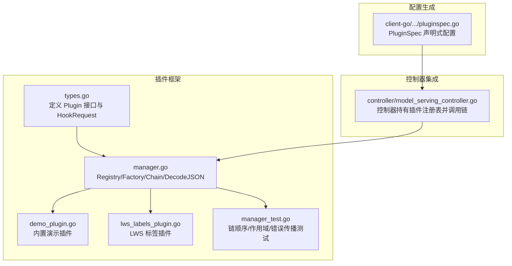

**图表来源**
- [pkg/model-serving-controller/plugins/types.go:37-44](file://pkg/model-serving-controller/plugins/types.go#L37-L44)
- [pkg/model-serving-controller/plugins/manager.go:30-80](file://pkg/model-serving-controller/plugins/manager.go#L30-L80)
- [pkg/model-serving-controller/plugins/demo_plugin.go:28-54](file://pkg/model-serving-controller/plugins/demo_plugin.go#L28-L54)
- [pkg/model-serving-controller/plugins/lws_labels_plugin.go:34-46](file://pkg/model-serving-controller/plugins/lws_labels_plugin.go#L34-L46)
- [pkg/model-serving-controller/plugins/manager_test.go:59-115](file://pkg/model-serving-controller/plugins/manager_test.go#L59-L115)
- [client-go/applyconfiguration/workload/v1alpha1/pluginspec.go:26-39](file://client-go/applyconfiguration/workload/v1alpha1/pluginspec.go#L26-L39)
- [pkg/model-serving-controller/controller/model_serving_controller.go:104-171](file://pkg/model-serving-controller/controller/model_serving_controller.go#L104-L171)

**章节来源**
- [pkg/model-serving-controller/plugins/types.go:1-45](file://pkg/model-serving-controller/plugins/types.go#L1-L45)
- [pkg/model-serving-controller/plugins/manager.go:1-148](file://pkg/model-serving-controller/plugins/manager.go#L1-L148)
- [pkg/model-serving-controller/plugins/demo_plugin.go:1-89](file://pkg/model-serving-controller/plugins/demo_plugin.go#L1-L89)
- [pkg/model-serving-controller/plugins/lws_labels_plugin.go:1-113](file://pkg/model-serving-controller/plugins/lws_labels_plugin.go#L1-L113)
- [pkg/model-serving-controller/plugins/manager_test.go:1-116](file://pkg/model-serving-controller/plugins/manager_test.go#L1-L116)
- [client-go/applyconfiguration/workload/v1alpha1/pluginspec.go:1-72](file://client-go/applyconfiguration/workload/v1alpha1/pluginspec.go#L1-L72)
- [pkg/model-serving-controller/controller/model_serving_controller.go:104-200](file://pkg/model-serving-controller/controller/model_serving_controller.go#L104-L200)

## 核心组件
- 插件接口与钩子
  - Plugin 接口包含名称标识与两个生命周期钩子：OnPodCreate（创建前）、OnPodReady（就绪后）
  - HookRequest 携带 ModelServing、角色名、角色 ID、是否入口 Pod、以及待变更的 Pod 引用
- 工厂与注册表
  - Registry 维护 名称 -> 工厂 的映射；DefaultRegistry 为全局默认注册表
  - Factory 是从 PluginSpec 构造具体 Plugin 的函数类型
- 插件链
  - Chain 由有序 entries 组成，按顺序执行钩子
  - NewChain 校验插件类型、查找工厂、实例化并收集 entries
- 作用域与执行控制
  - shouldRun 根据 Scope.Roles 与 Scope.Target 判定插件在当前 Hook 是否执行
  - 支持目标类型：入口（Entry）与工作节点（Worker），或全部（All）
- 配置解析
  - DecodeJSON 将 apiextensionsv1.JSON 解析到任意结构体，内置插件常用

**章节来源**
- [pkg/model-serving-controller/plugins/types.go:27-44](file://pkg/model-serving-controller/plugins/types.go#L27-L44)
- [pkg/model-serving-controller/plugins/manager.go:30-80](file://pkg/model-serving-controller/plugins/manager.go#L30-L80)
- [pkg/model-serving-controller/plugins/manager.go:114-147](file://pkg/model-serving-controller/plugins/manager.go#L114-L147)

## 架构总览
插件框架在控制器初始化时注入默认注册表，并在 Pod 生命周期钩子中按序调用插件。插件通过 PluginSpec 声明式配置，控制器将其转换为 Chain 并执行。

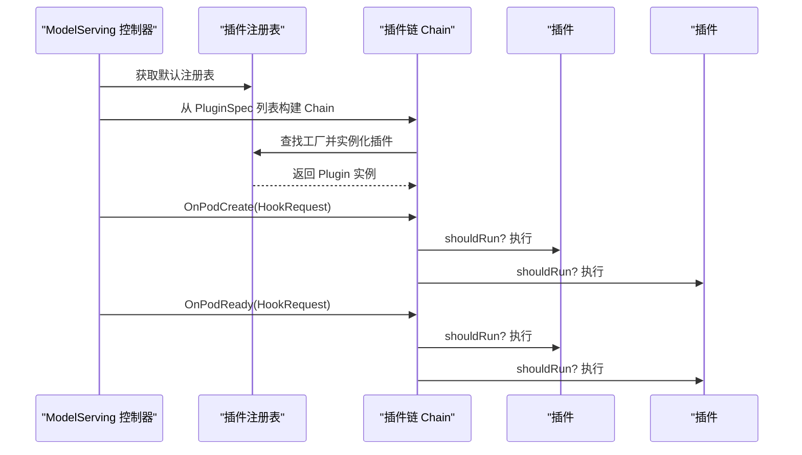

**图表来源**
- [pkg/model-serving-controller/controller/model_serving_controller.go:104-171](file://pkg/model-serving-controller/controller/model_serving_controller.go#L104-L171)
- [pkg/model-serving-controller/plugins/manager.go:59-112](file://pkg/model-serving-controller/plugins/manager.go#L59-L112)
- [pkg/model-serving-controller/plugins/types.go:27-44](file://pkg/model-serving-controller/plugins/types.go#L27-L44)

## 组件详解

### 插件接口与生命周期
- 接口职责
  - Name(): 返回插件标识，用于日志与错误定位
  - OnPodCreate(ctx, req): 在 Pod 创建前进行就地变更（如注解、环境变量、运行时类等）
  - OnPodReady(ctx, req): 在 Pod 进入 Running+Ready 后执行（可用于观测、标记等）
- 请求上下文
  - 包含所属 ModelServing、ServingGroup、角色信息、是否入口 Pod、以及待变更的 Pod 指针

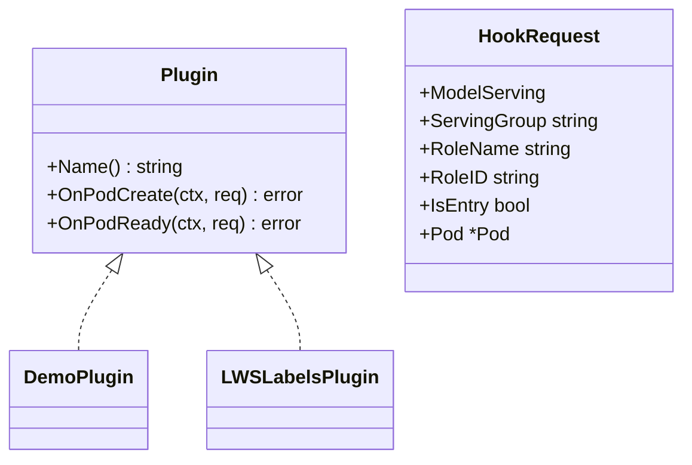

**图表来源**
- [pkg/model-serving-controller/plugins/types.go:37-44](file://pkg/model-serving-controller/plugins/types.go#L37-L44)
- [pkg/model-serving-controller/plugins/demo_plugin.go:37-41](file://pkg/model-serving-controller/plugins/demo_plugin.go#L37-L41)
- [pkg/model-serving-controller/plugins/lws_labels_plugin.go:36-38](file://pkg/model-serving-controller/plugins/lws_labels_plugin.go#L36-L38)

**章节来源**
- [pkg/model-serving-controller/plugins/types.go:27-44](file://pkg/model-serving-controller/plugins/types.go#L27-L44)

### 工厂与注册表
- 注册表
  - NewRegistry 构建空映射
  - Register 将插件名绑定到工厂
  - DefaultRegistry 全局默认注册表，内置插件通过 init() 注册
- 工厂
  - Factory 函数签名：接收 PluginSpec，返回 Plugin 实例与错误
- 使用场景
  - 控制器在构建 Chain 时，依据插件名查找工厂并实例化

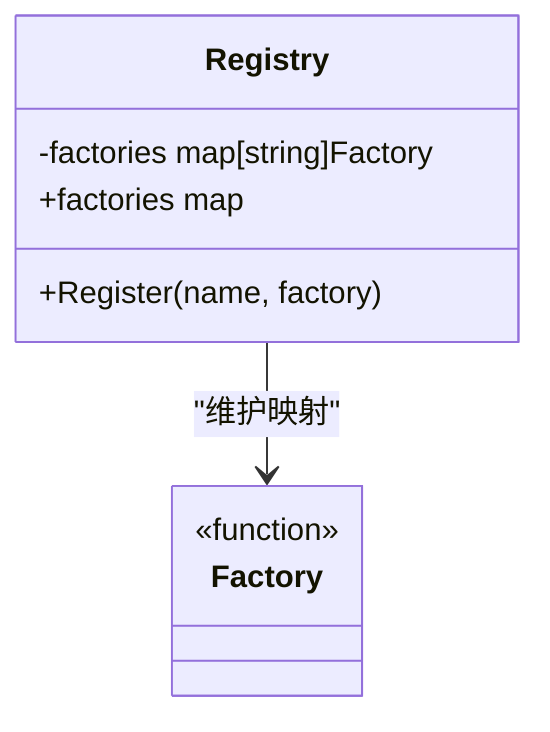

**图表来源**
- [pkg/model-serving-controller/plugins/manager.go:30-46](file://pkg/model-serving-controller/plugins/manager.go#L30-L46)
- [pkg/model-serving-controller/plugins/manager.go:38-42](file://pkg/model-serving-controller/plugins/manager.go#L38-L42)

**章节来源**
- [pkg/model-serving-controller/plugins/manager.go:30-46](file://pkg/model-serving-controller/plugins/manager.go#L30-L46)

### 插件链构建与执行
- 构建流程
  - NewChain 校验插件类型必须为内置类型
  - 从注册表查找工厂，实例化插件
  - 收集为有序 entries，形成 Chain
- 执行流程
  - OnPodCreate/OnPodReady 依次遍历 entries
  - 每个插件执行前先判断 shouldRun（基于 Scope.Roles 与 Scope.Target）
  - 错误以包装形式返回，包含插件名以便定位

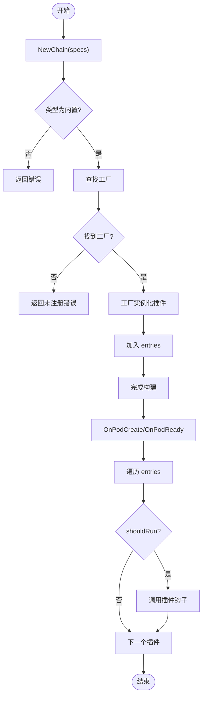

**图表来源**
- [pkg/model-serving-controller/plugins/manager.go:59-112](file://pkg/model-serving-controller/plugins/manager.go#L59-L112)
- [pkg/model-serving-controller/plugins/manager.go:122-139](file://pkg/model-serving-controller/plugins/manager.go#L122-L139)

**章节来源**
- [pkg/model-serving-controller/plugins/manager.go:59-112](file://pkg/model-serving-controller/plugins/manager.go#L59-L112)
- [pkg/model-serving-controller/plugins/manager.go:122-139](file://pkg/model-serving-controller/plugins/manager.go#L122-L139)

### 作用域与执行控制
- 角色过滤：若 Scope.Roles 非空，仅当 req.RoleName 在其中时才执行
- 目标过滤：入口 Pod 仅执行 Target=Entry 或 Target=All 的插件；工作 Pod 仅执行 Target=Worker 或 Target=All 的插件
- 未设置 Scope：默认全量执行

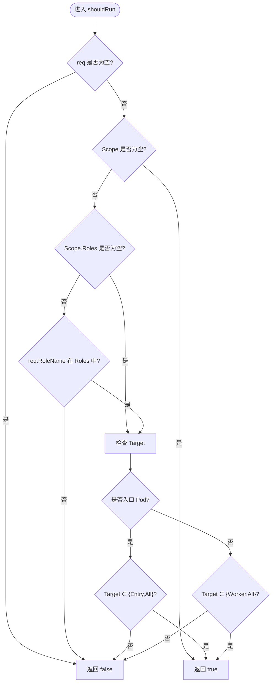

**图表来源**
- [pkg/model-serving-controller/plugins/manager.go:114-139](file://pkg/model-serving-controller/plugins/manager.go#L114-L139)

**章节来源**
- [pkg/model-serving-controller/plugins/manager.go:114-139](file://pkg/model-serving-controller/plugins/manager.go#L114-L139)

### 配置加载与解析
- 配置来源
  - PluginSpec.Config 为 apiextensionsv1.JSON 类型
  - 内置插件通常使用 DecodeJSON 将其反序列化到自定义结构体
- 解析流程
  - 若 Config 为空或长度为 0，直接返回
  - 否则进行 JSON 反序列化到 out 指向的目标结构体
- 示例
  - DemoPlugin 将配置解析为 DemoConfig，包含运行时类、注解与环境变量
  - LWSLabelsPlugin 不需要复杂配置，直接构造插件实例

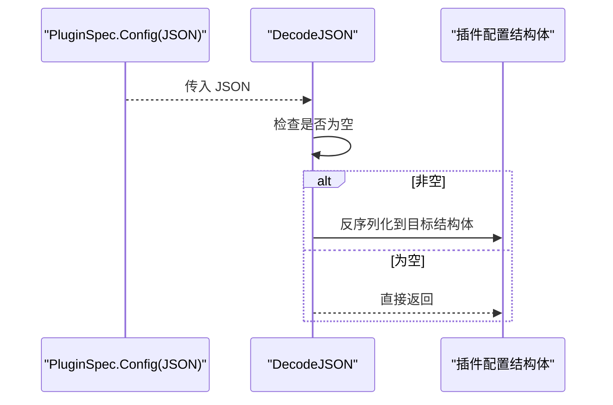

**图表来源**
- [pkg/model-serving-controller/plugins/manager.go:141-147](file://pkg/model-serving-controller/plugins/manager.go#L141-L147)
- [pkg/model-serving-controller/plugins/demo_plugin.go:47-54](file://pkg/model-serving-controller/plugins/demo_plugin.go#L47-L54)

**章节来源**
- [pkg/model-serving-controller/plugins/manager.go:141-147](file://pkg/model-serving-controller/plugins/manager.go#L141-L147)
- [pkg/model-serving-controller/plugins/demo_plugin.go:30-54](file://pkg/model-serving-controller/plugins/demo_plugin.go#L30-L54)

### 内置插件示例

#### DemoPlugin（演示插件）
- 功能
  - 在 OnPodCreate 时修改 Pod 的 RuntimeClassName、注解与容器环境变量
- 注册
  - 通过 init() 将插件名注册到 DefaultRegistry
- 配置
  - DemoConfig 支持运行时类、注解键值对、环境变量列表

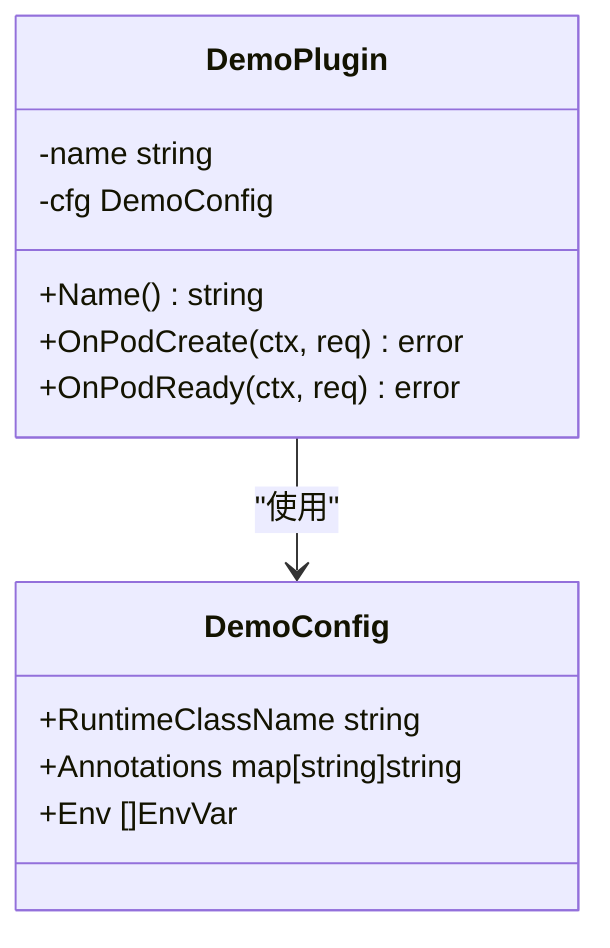

**图表来源**
- [pkg/model-serving-controller/plugins/demo_plugin.go:28-88](file://pkg/model-serving-controller/plugins/demo_plugin.go#L28-L88)

**章节来源**
- [pkg/model-serving-controller/plugins/demo_plugin.go:28-88](file://pkg/model-serving-controller/plugins/demo_plugin.go#L28-L88)

#### LWSLabelsPlugin（LWS 标签插件）
- 功能
  - 在 OnPodCreate 时为 Pod 设置 LWS 相关标签（SetName、GroupIndex、WorkerIndex、GroupUniqueHash）
- 依赖
  - 从 ModelServing OwnerReferences 中提取 LeaderWorkerSet 名称
  - 从 ServingGroup 与 Pod 名称推导索引
- 错误处理
  - 对无效参数返回错误，便于上层定位问题

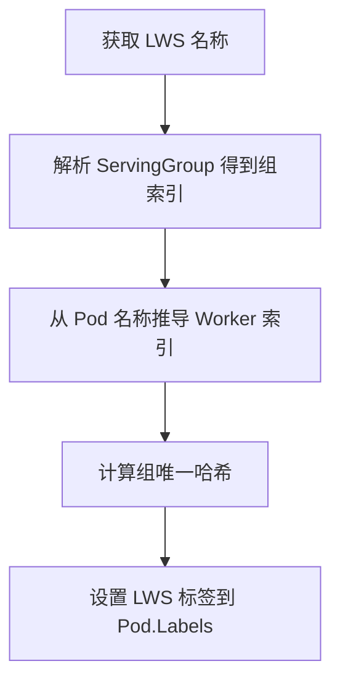

**图表来源**
- [pkg/model-serving-controller/plugins/lws_labels_plugin.go:50-81](file://pkg/model-serving-controller/plugins/lws_labels_plugin.go#L50-L81)
- [pkg/model-serving-controller/plugins/lws_labels_plugin.go:87-112](file://pkg/model-serving-controller/plugins/lws_labels_plugin.go#L87-L112)

**章节来源**
- [pkg/model-serving-controller/plugins/lws_labels_plugin.go:34-85](file://pkg/model-serving-controller/plugins/lws_labels_plugin.go#L34-L85)
- [pkg/model-serving-controller/plugins/lws_labels_plugin.go:87-112](file://pkg/model-serving-controller/plugins/lws_labels_plugin.go#L87-L112)

### 控制器集成与调用
- 初始化
  - 控制器构造时注入 plugins.DefaultRegistry
- 调用点
  - 在 Pod 生命周期钩子中调用 Chain 的 OnPodCreate/OnPodReady
  - 通过 HookRequest 传递上下文与待变更的 Pod

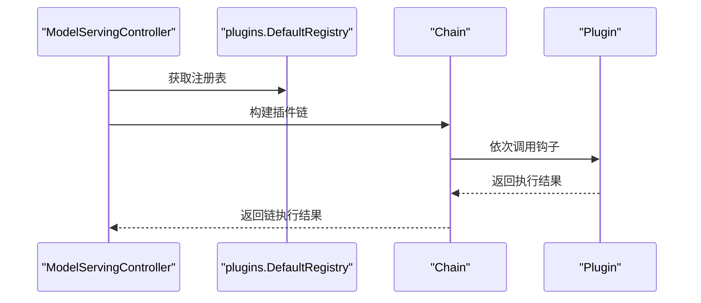

**图表来源**
- [pkg/model-serving-controller/controller/model_serving_controller.go:104-171](file://pkg/model-serving-controller/controller/model_serving_controller.go#L104-L171)
- [pkg/model-serving-controller/plugins/manager.go:59-112](file://pkg/model-serving-controller/plugins/manager.go#L59-L112)

**章节来源**
- [pkg/model-serving-controller/controller/model_serving_controller.go:104-171](file://pkg/model-serving-controller/controller/model_serving_controller.go#L104-L171)

## 依赖关系分析
- 组件耦合
  - 插件链依赖注册表；插件实现依赖 HookRequest 上下文
  - 控制器通过 DefaultRegistry 间接依赖所有已注册插件
- 外部依赖
  - Kubernetes API（Pod、OwnerReferences、Labels/Annotations）
  - LWS 库（LeaderWorkerSet 标签与工具）
- 可能的循环依赖
  - 当前结构清晰，无明显循环导入

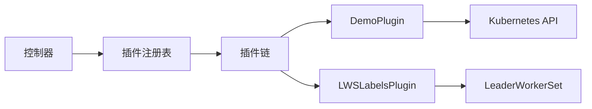

**图表来源**
- [pkg/model-serving-controller/controller/model_serving_controller.go:104-171](file://pkg/model-serving-controller/controller/model_serving_controller.go#L104-L171)
- [pkg/model-serving-controller/plugins/manager.go:30-80](file://pkg/model-serving-controller/plugins/manager.go#L30-L80)
- [pkg/model-serving-controller/plugins/demo_plugin.go:19-26](file://pkg/model-serving-controller/plugins/demo_plugin.go#L19-L26)
- [pkg/model-serving-controller/plugins/lws_labels_plugin.go:19-32](file://pkg/model-serving-controller/plugins/lws_labels_plugin.go#L19-L32)

**章节来源**
- [pkg/model-serving-controller/controller/model_serving_controller.go:104-171](file://pkg/model-serving-controller/controller/model_serving_controller.go#L104-L171)
- [pkg/model-serving-controller/plugins/manager.go:30-80](file://pkg/model-serving-controller/plugins/manager.go#L30-L80)
- [pkg/model-serving-controller/plugins/demo_plugin.go:19-26](file://pkg/model-serving-controller/plugins/demo_plugin.go#L19-L26)
- [pkg/model-serving-controller/plugins/lws_labels_plugin.go:19-32](file://pkg/model-serving-controller/plugins/lws_labels_plugin.go#L19-L32)

## 性能与可扩展性
- 时间复杂度
  - 构建链：O(n)，n 为插件数量
  - 执行钩子：O(n) × 每插件操作次数
- 空间复杂度
  - Chain 存储 n 个插件实例与对应配置
- 可扩展性
  - 新增插件只需实现 Plugin 接口并通过 init() 注册到 DefaultRegistry
  - 插件内部可自由选择是否在 OnPodCreate/OnPodReady 中执行耗时操作
- 优化建议
  - 将非必要逻辑延迟至 OnPodReady
  - 对 Pod 修改尽量批量处理，减少多次写入

[本节为通用指导，无需特定文件来源]

## 故障排查指南
- 常见错误与定位
  - 插件类型不支持：构建链时报错，提示插件类型不受支持
  - 插件未注册：构建链时报错，提示插件未注册
  - 插件钩子报错：OnPodCreate/OnPodReady 报错，错误中包含插件名，便于快速定位
- 单元测试参考
  - 测试链顺序与作用域：验证入口/工作节点插件是否按预期执行
  - 测试错误传播：验证链在某个插件失败时是否正确中断并返回错误
  - 测试类型校验：验证不支持的插件类型会被拒绝

**章节来源**
- [pkg/model-serving-controller/plugins/manager.go:66-76](file://pkg/model-serving-controller/plugins/manager.go#L66-L76)
- [pkg/model-serving-controller/plugins/manager.go:91-93](file://pkg/model-serving-controller/plugins/manager.go#L91-L93)
- [pkg/model-serving-controller/plugins/manager_test.go:59-115](file://pkg/model-serving-controller/plugins/manager_test.go#L59-L115)

## 结论
Kthena 模型服务控制器的插件框架以清晰的接口与注册表为核心，通过插件链在 Pod 生命周期钩子中顺序执行，具备良好的可扩展性与可控的作用域。内置 DemoPlugin 与 LWSLabelsPlugin 展示了典型配置解析与标签注入模式。当前实现未包含“热重载”与“版本兼容性管理”的机制，后续可在控制器层面引入配置监听与插件版本字段，以支持动态更新与兼容性策略。

[本节为总结，无需特定文件来源]

## 附录：自定义插件开发指南

### 开发步骤
- 实现 Plugin 接口
  - 提供 Name() 返回插件名
  - 在 OnPodCreate 中对 req.Pod 进行就地修改
  - 在 OnPodReady 中执行收尾逻辑（如观测、标记）
- 定义配置结构体
  - 为插件定义一个 Go 结构体作为配置载体
  - 在 NewXxxPlugin 中使用 DecodeJSON 将 PluginSpec.Config 反序列化到该结构体
- 注册插件
  - 在 init() 中调用 DefaultRegistry.Register(插件名, NewXxxPlugin)
- 编写测试
  - 使用 HookRequest 构造不同场景（入口/工作节点、不同角色）
  - 断言 Pod 变更符合预期
  - 断言错误传播行为

**章节来源**
- [pkg/model-serving-controller/plugins/types.go:37-44](file://pkg/model-serving-controller/plugins/types.go#L37-L44)
- [pkg/model-serving-controller/plugins/manager.go:141-147](file://pkg/model-serving-controller/plugins/manager.go#L141-L147)
- [pkg/model-serving-controller/plugins/demo_plugin.go:43-54](file://pkg/model-serving-controller/plugins/demo_plugin.go#L43-L54)

### 配置规范
- PluginSpec 字段
  - name：插件名（需与注册名一致）
  - type：插件类型（当前仅支持内置类型）
  - config：JSON 配置对象
  - scope：作用域（可选）
- 声明式配置
  - 可通过 applyconfiguration 生成 PluginSpec 的声明式配置对象

**章节来源**
- [client-go/applyconfiguration/workload/v1alpha1/pluginspec.go:26-71](file://client-go/applyconfiguration/workload/v1alpha1/pluginspec.go#L26-L71)

### 测试方法
- 行为测试
  - 验证不同 Scope.Target 下插件是否按预期执行
  - 验证不同 Scope.Roles 下插件是否被过滤
- 错误测试
  - 验证插件抛出错误时链路是否正确中断
  - 验证不支持的插件类型被拒绝
- 回归测试
  - 保持对现有内置插件行为的回归覆盖

**章节来源**
- [pkg/model-serving-controller/plugins/manager_test.go:59-115](file://pkg/model-serving-controller/plugins/manager_test.go#L59-L115)

### 热重载与版本兼容性（概念性建议）
- 热重载
  - 在控制器中增加对 PluginSpec 的监听，当配置变更时重建 Chain 并替换旧链
  - 对于需要重启才能生效的配置，采用滚动更新策略
- 版本兼容性
  - 在 PluginSpec 中引入版本字段，插件实现根据版本选择解析策略
  - 对破坏性变更提供迁移脚本或双版本共存策略

[本节为概念性建议，无需特定文件来源]