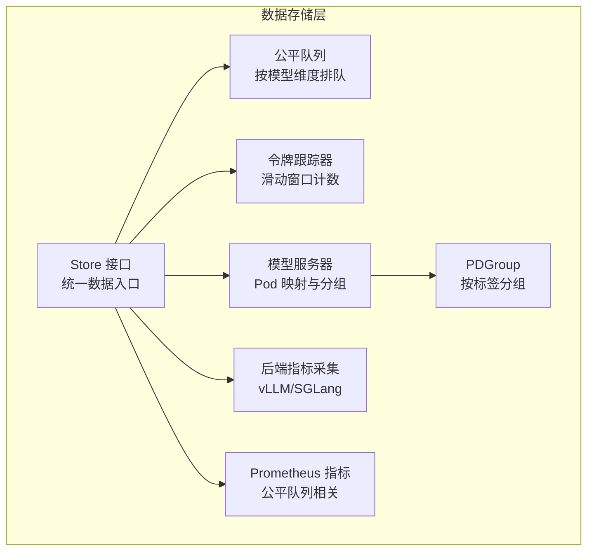
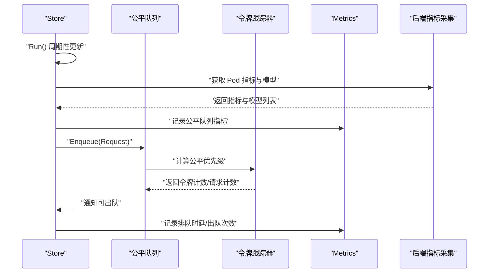
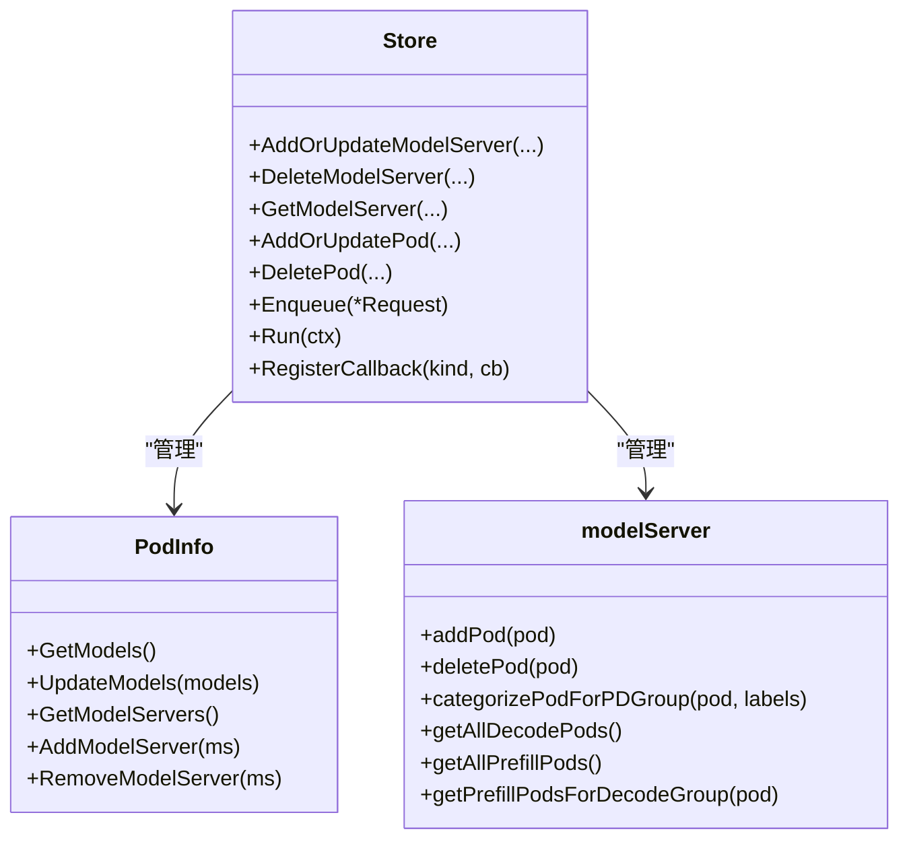
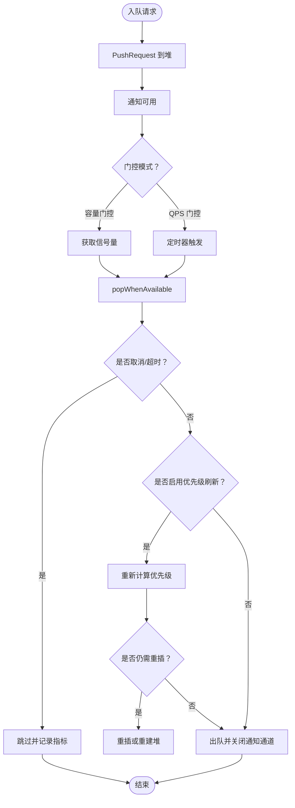
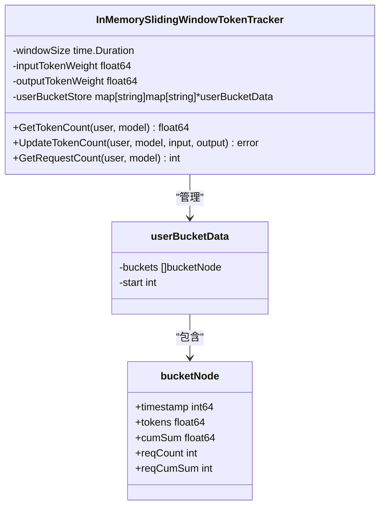
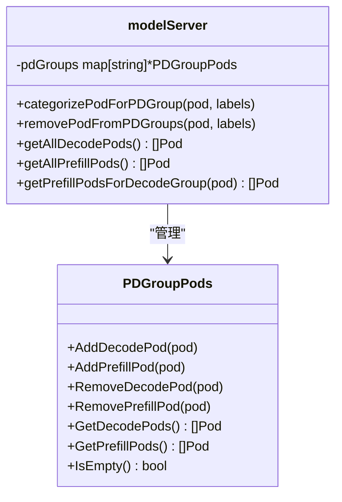
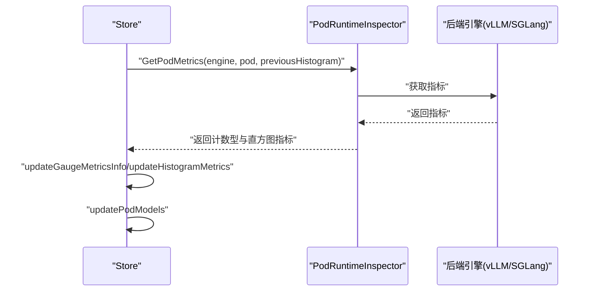
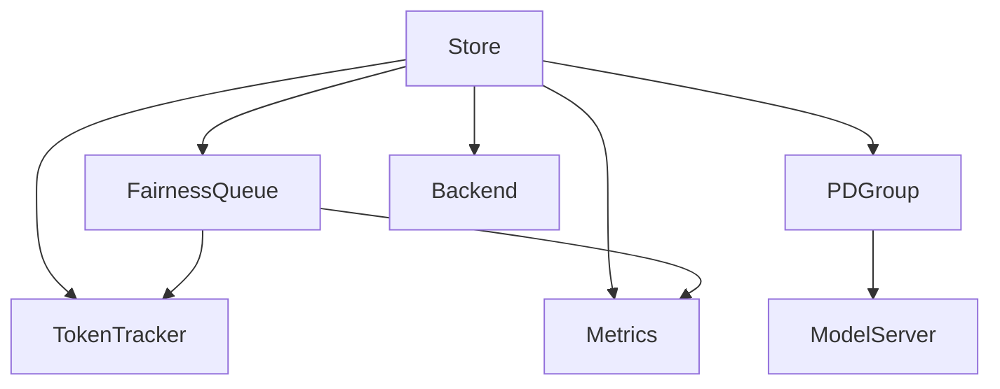

# 数据存储层

<cite>
**本文引用的文件**
- [store.go](file://pkg/kthena-router/datastore/store.go)
- [fairness_queue.go](file://pkg/kthena-router/datastore/fairness_queue.go)
- [token_tracker.go](file://pkg/kthena-router/datastore/token_tracker.go)
- [pdgroup_pods.go](file://pkg/kthena-router/datastore/pdgroup_pods.go)
- [model_server.go](file://pkg/kthena-router/datastore/model_server.go)
- [backend.go](file://pkg/kthena-router/backend/backend.go)
- [metrics.go](file://pkg/kthena-router/metrics/metrics.go)
- [store_test.go](file://pkg/kthena-router/datastore/store_test.go)
</cite>

## 目录
1. [简介](#简介)
2. [项目结构](#项目结构)
3. [核心组件](#核心组件)
4. [架构总览](#架构总览)
5. [详细组件分析](#详细组件分析)
6. [依赖分析](#依赖分析)
7. [性能考虑](#性能考虑)
8. [故障排查指南](#故障排查指南)
9. [结论](#结论)
10. [附录](#附录)

## 简介
本技术文档聚焦于 Kthena 调度器的数据存储层，系统性阐述其设计与实现，涵盖以下关键主题：
- 模型服务器状态管理：如何在运行时维护模型服务器与 Pod 的映射关系，并支持 PD 分组（预取-解码）调度。
- Pod 信息存储：如何采集并缓存后端引擎指标与已加载模型，以及如何安全地并发访问这些信息。
- 公平队列（FairnessQueue）：基于令牌跟踪器的优先级调度策略，支持容量门控与 QPS 门控两种模式。
- 令牌跟踪器（TokenTracker）：滑动窗口内的用户-模型令牌计数与请求计数统计，用于公平调度。
- 预取-解码分组（PDGroup）：按标签分组的解码与预取 Pod 管理，提升 PD 协议下的调度效率。
- 配置选项与性能优化：环境变量驱动的公平队列与令牌跟踪器配置，以及性能调优建议。

## 项目结构
数据存储层位于 pkg/kthena-router/datastore 目录，围绕 Store 接口构建，包含以下模块：
- Store 接口与实现：统一的数据入口，负责模型服务器、Pod、路由、网关等资源的增删改查与回调触发。
- 公平队列：按模型维度维护优先队列，支持令牌权重与请求数量权重的组合优先级。
- 令牌跟踪器：基于滑动窗口的内存令牌计数器，支持输入/输出权重配置。
- PDGroup：按标签分组的解码/预取 Pod 管理，支持快速查找匹配的解码/预取 Pod。
- 后端指标采集：通过后端引擎抽象获取 Pod 指标与已加载模型。
- 指标记录：Prometheus 指标定义与公平队列相关指标记录。

图表来源
- [store.go:161-240](file://pkg/kthena-router/datastore/store.go#L161-L240)
- [fairness_queue.go:102-145](file://pkg/kthena-router/datastore/fairness_queue.go#L102-L145)
- [token_tracker.go:56-110](file://pkg/kthena-router/datastore/token_tracker.go#L56-L110)
- [pdgroup_pods.go:26-39](file://pkg/kthena-router/datastore/pdgroup_pods.go#L26-L39)
- [model_server.go:27-45](file://pkg/kthena-router/datastore/model_server.go#L27-L45)
- [backend.go:30-40](file://pkg/kthena-router/backend/backend.go#L30-L40)
- [metrics.go:54-85](file://pkg/kthena-router/metrics/metrics.go#L54-L85)

章节来源
- [store.go:161-240](file://pkg/kthena-router/datastore/store.go#L161-L240)
- [fairness_queue.go:102-145](file://pkg/kthena-router/datastore/fairness_queue.go#L102-L145)
- [token_tracker.go:56-110](file://pkg/kthena-router/datastore/token_tracker.go#L56-L110)
- [pdgroup_pods.go:26-39](file://pkg/kthena-router/datastore/pdgroup_pods.go#L26-L39)
- [model_server.go:27-45](file://pkg/kthena-router/datastore/model_server.go#L27-L45)
- [backend.go:30-40](file://pkg/kthena-router/backend/backend.go#L30-L40)
- [metrics.go:54-85](file://pkg/kthena-router/metrics/metrics.go#L54-L85)

## 核心组件
- Store 接口：提供模型服务器、Pod、路由、网关、推理池等资源的增删改查方法，以及公平队列入队、统计查询、回调注册与运行控制。
- PodInfo：封装 Pod 的运行时指标与模型集合，提供线程安全的访问方法。
- modelServer：维护模型服务器对象及其关联的 Pod 集合，并按 PDGroup 标签进行分类。
- PDGroupPods：按 PDGroup 值维护解码/预取 Pod 集合，支持增删与查询。
- RequestPriorityQueue：基于堆的优先队列，支持公平优先级计算与通知通道。
- InMemorySlidingWindowTokenTracker：基于滑动窗口的令牌计数器，支持输入/输出权重与请求计数。
- Metrics：Prometheus 指标定义与公平队列相关指标记录。

章节来源
- [store.go:161-240](file://pkg/kthena-router/datastore/store.go#L161-L240)
- [store.go:248-266](file://pkg/kthena-router/datastore/store.go#L248-L266)
- [model_server.go:27-45](file://pkg/kthena-router/datastore/model_server.go#L27-L45)
- [pdgroup_pods.go:26-39](file://pkg/kthena-router/datastore/pdgroup_pods.go#L26-L39)
- [fairness_queue.go:102-145](file://pkg/kthena-router/datastore/fairness_queue.go#L102-L145)
- [token_tracker.go:56-110](file://pkg/kthena-router/datastore/token_tracker.go#L56-L110)
- [metrics.go:54-85](file://pkg/kthena-router/metrics/metrics.go#L54-L85)

## 架构总览
数据存储层以 Store 为核心，围绕以下流程工作：
- 初始化：创建 Store 实例，初始化令牌跟踪器与公平队列配置。
- 运行：周期性更新 Pod 指标与模型列表。
- 资源变更：监听模型服务器、Pod、路由、网关等资源变化，更新内部映射。
- 公平调度：请求入队到对应模型的优先队列，按令牌权重与请求数量权重计算优先级。
- PD 分组：根据 PDGroup 标签选择匹配的解码/预取 Pod，提升调度效率。
- 指标记录：记录公平队列大小、排队时延、取消次数、出队次数、在途请求数等。

图表来源
- [store.go:410-430](file://pkg/kthena-router/datastore/store.go#L410-L430)
- [store.go:443-468](file://pkg/kthena-router/datastore/store.go#L443-L468)
- [fairness_queue.go:203-283](file://pkg/kthena-router/datastore/fairness_queue.go#L203-L283)
- [token_tracker.go:194-243](file://pkg/kthena-router/datastore/token_tracker.go#L194-L243)
- [metrics.go:291-339](file://pkg/kthena-router/metrics/metrics.go#L291-L339)

## 详细组件分析

### Store 接口与实现
- 统一入口：提供模型服务器、Pod、路由、网关、推理池等资源的增删改查方法。
- 回调机制：支持注册回调函数，在资源变更时异步触发。
- 公平队列：按模型维度维护等待队列，支持 QPS 或容量门控模式。
- PD 分组：提供按 PDGroup 获取解码/预取 Pod 的接口。
- 运行控制：Run 方法启动周期性指标与模型更新任务。

图表来源
- [store.go:161-240](file://pkg/kthena-router/datastore/store.go#L161-L240)
- [store.go:248-266](file://pkg/kthena-router/datastore/store.go#L248-L266)
- [model_server.go:27-45](file://pkg/kthena-router/datastore/model_server.go#L27-L45)

章节来源
- [store.go:161-240](file://pkg/kthena-router/datastore/store.go#L161-L240)
- [store.go:248-266](file://pkg/kthena-router/datastore/store.go#L248-L266)
- [model_server.go:27-45](file://pkg/kthena-router/datastore/model_server.go#L27-L45)

### 公平队列（FairnessQueue）
- 配置项：最大并发、最大 QPS、优先级刷新重试次数、重建阈值、令牌权重、请求数量权重。
- 优先级计算：基于令牌跟踪器的令牌计数与请求计数，支持组合权重。
- 出队策略：
  - 容量门控：使用信号量限制在途请求数。
  - QPS 门控：固定速率定时器出队。
- 优先级刷新：在出队时可选地重新计算根优先级，必要时重建堆以保持稳定性。

图表来源
- [fairness_queue.go:183-200](file://pkg/kthena-router/datastore/fairness_queue.go#L183-L200)
- [fairness_queue.go:203-283](file://pkg/kthena-router/datastore/fairness_queue.go#L203-L283)
- [fairness_queue.go:334-412](file://pkg/kthena-router/datastore/fairness_queue.go#L334-L412)

章节来源
- [fairness_queue.go:31-64](file://pkg/kthena-router/datastore/fairness_queue.go#L31-L64)
- [fairness_queue.go:71-88](file://pkg/kthena-router/datastore/fairness_queue.go#L71-L88)
- [fairness_queue.go:183-200](file://pkg/kthena-router/datastore/fairness_queue.go#L183-L200)
- [fairness_queue.go:203-283](file://pkg/kthena-router/datastore/fairness_queue.go#L203-L283)
- [fairness_queue.go:334-412](file://pkg/kthena-router/datastore/fairness_queue.go#L334-L412)

### 令牌跟踪器（TokenTracker）
- 滑动窗口：固定窗口大小，按时间戳切片存储桶，支持压缩与裁剪。
- 权重：输入令牌权重与输出令牌权重，用于优先级计算。
- 并发安全：读写锁保护，按需写锁裁剪过期桶。
- 查询与更新：按用户-模型维度查询活跃窗口内的令牌总数与请求计数；更新时合并同秒桶或追加新桶。

图表来源
- [token_tracker.go:56-110](file://pkg/kthena-router/datastore/token_tracker.go#L56-L110)
- [token_tracker.go:117-156](file://pkg/kthena-router/datastore/token_tracker.go#L117-L156)
- [token_tracker.go:194-243](file://pkg/kthena-router/datastore/token_tracker.go#L194-L243)
- [token_tracker.go:245-307](file://pkg/kthena-router/datastore/token_tracker.go#L245-L307)
- [token_tracker.go:309-356](file://pkg/kthena-router/datastore/token_tracker.go#L309-L356)

章节来源
- [token_tracker.go:56-110](file://pkg/kthena-router/datastore/token_tracker.go#L56-L110)
- [token_tracker.go:117-156](file://pkg/kthena-router/datastore/token_tracker.go#L117-L156)
- [token_tracker.go:194-243](file://pkg/kthena-router/datastore/token_tracker.go#L194-L243)
- [token_tracker.go:245-307](file://pkg/kthena-router/datastore/token_tracker.go#L245-L307)
- [token_tracker.go:309-356](file://pkg/kthena-router/datastore/token_tracker.go#L309-L356)

### 预取-解码分组（PDGroup）
- 分类：根据 PDGroup 配置中的 GroupKey 与 DecodeLabels/PrefillLabels 对 Pod 进行分类。
- 存储：每个 PDGroup 值对应一组 PDGroupPods，分别维护解码与预取 Pod 集合。
- 查询：支持获取所有解码/预取 Pod，以及根据解码 Pod 所属 PDGroup 值获取匹配的预取 Pod。

图表来源
- [model_server.go:76-103](file://pkg/kthena-router/datastore/model_server.go#L76-L103)
- [model_server.go:115-132](file://pkg/kthena-router/datastore/model_server.go#L115-L132)
- [model_server.go:134-156](file://pkg/kthena-router/datastore/model_server.go#L134-L156)
- [model_server.go:158-180](file://pkg/kthena-router/datastore/model_server.go#L158-L180)
- [pdgroup_pods.go:26-39](file://pkg/kthena-router/datastore/pdgroup_pods.go#L26-L39)
- [pdgroup_pods.go:41-75](file://pkg/kthena-router/datastore/pdgroup_pods.go#L41-L75)
- [pdgroup_pods.go:77-96](file://pkg/kthena-router/datastore/pdgroup_pods.go#L77-L96)

章节来源
- [model_server.go:76-103](file://pkg/kthena-router/datastore/model_server.go#L76-L103)
- [model_server.go:115-132](file://pkg/kthena-router/datastore/model_server.go#L115-L132)
- [model_server.go:134-156](file://pkg/kthena-router/datastore/model_server.go#L134-L156)
- [model_server.go:158-180](file://pkg/kthena-router/datastore/model_server.go#L158-L180)
- [pdgroup_pods.go:26-39](file://pkg/kthena-router/datastore/pdgroup_pods.go#L26-L39)
- [pdgroup_pods.go:41-75](file://pkg/kthena-router/datastore/pdgroup_pods.go#L41-L75)
- [pdgroup_pods.go:77-96](file://pkg/kthena-router/datastore/pdgroup_pods.go#L77-L96)

### Pod 信息存储与后端指标采集
- PodInfo：封装 Pod 的运行时指标（GPU 缓存使用率、等待/运行中请求数、TPOT、TTFT）与模型集合，提供线程安全的访问方法。
- 指标更新：周期性从后端引擎（vLLM/SGLang）拉取指标与模型列表，更新 PodInfo。
- 指标类型：计数型指标与直方图指标分离处理，避免覆盖。

图表来源
- [store.go:1168-1197](file://pkg/kthena-router/datastore/store.go#L1168-L1197)
- [store.go:1210-1265](file://pkg/kthena-router/datastore/store.go#L1210-L1265)
- [backend.go:42-65](file://pkg/kthena-router/backend/backend.go#L42-L65)

章节来源
- [store.go:248-266](file://pkg/kthena-router/datastore/store.go#L248-L266)
- [store.go:1168-1197](file://pkg/kthena-router/datastore/store.go#L1168-L1197)
- [store.go:1210-1265](file://pkg/kthena-router/datastore/store.go#L1210-L1265)
- [backend.go:42-65](file://pkg/kthena-router/backend/backend.go#L42-L65)

## 依赖分析
- Store 依赖：
  - 公平队列：按模型维度维护等待队列。
  - 令牌跟踪器：用于公平优先级计算。
  - PDGroup：用于 PD 协议下的解码/预取 Pod 选择。
  - 后端指标采集：用于更新 PodInfo。
  - 指标记录：用于记录公平队列相关指标。
- 公平队列依赖：
  - 令牌跟踪器：计算优先级。
  - 指标记录：记录排队时延、出队次数、在途请求数等。
- 令牌跟踪器依赖：
  - 时间与并发控制：保证滑动窗口正确裁剪与读写安全。
- PDGroup 依赖：
  - 模型服务器配置：PDGroup 标签键与标签集。
  - Pod 标签：用于匹配解码/预取 Pod。

图表来源
- [store.go:161-240](file://pkg/kthena-router/datastore/store.go#L161-L240)
- [fairness_queue.go:102-145](file://pkg/kthena-router/datastore/fairness_queue.go#L102-L145)
- [token_tracker.go:56-110](file://pkg/kthena-router/datastore/token_tracker.go#L56-L110)
- [pdgroup_pods.go:26-39](file://pkg/kthena-router/datastore/pdgroup_pods.go#L26-L39)
- [model_server.go:27-45](file://pkg/kthena-router/datastore/model_server.go#L27-L45)
- [backend.go:30-40](file://pkg/kthena-router/backend/backend.go#L30-L40)
- [metrics.go:54-85](file://pkg/kthena-router/metrics/metrics.go#L54-L85)

章节来源
- [store.go:161-240](file://pkg/kthena-router/datastore/store.go#L161-L240)
- [fairness_queue.go:102-145](file://pkg/kthena-router/datastore/fairness_queue.go#L102-L145)
- [token_tracker.go:56-110](file://pkg/kthena-router/datastore/token_tracker.go#L56-L110)
- [pdgroup_pods.go:26-39](file://pkg/kthena-router/datastore/pdgroup_pods.go#L26-L39)
- [model_server.go:27-45](file://pkg/kthena-router/datastore/model_server.go#L27-L45)
- [backend.go:30-40](file://pkg/kthena-router/backend/backend.go#L30-L40)
- [metrics.go:54-85](file://pkg/kthena-router/metrics/metrics.go#L54-L85)

## 性能考虑
- 公平队列
  - 优先级刷新重试次数与重建阈值：合理设置可减少堆重建频率，平衡优先级准确性与开销。
  - 门控模式选择：容量门控适合后端容量受限场景，QPS 门控适合稳定速率控制。
  - 通知通道缓冲：避免阻塞生产者，但需注意过多通知导致的上下文切换。
- 令牌跟踪器
  - 窗口大小：窗口越小，内存占用越低，但可能频繁裁剪；窗口越大，统计更稳定但内存占用更高。
  - 输入/输出权重：权重越高，公平性越强，但可能放大抖动。
  - 并发读写：读多写少场景下，读锁占优，写锁仅在裁剪时获取。
- PDGroup
  - 标签匹配：确保 PDGroup 标签键与标签集配置正确，避免误分类。
  - 分组粒度：分组过细会增加映射复杂度，过粗会降低调度灵活性。
- 指标记录
  - 指标数量与标签基数：避免过多标签组合导致指标基数爆炸。
  - 计数型与直方图分离：避免重复覆盖，提高统计精度。

[本节为通用指导，不直接分析具体文件]

## 故障排查指南
- 公平队列未出队
  - 检查门控模式与 QPS 设置，确认定时器或信号量是否正常。
  - 查看优先级刷新与堆重建日志，确认是否存在频繁重插导致的延迟。
- 令牌计数异常
  - 检查窗口大小与权重配置，确认是否被裁剪或压缩。
  - 核对输入/输出令牌权重，确认是否为负数或非有限值。
- PDGroup 选择错误
  - 检查 PDGroup 标签键与标签集配置，确认 Pod 标签是否匹配。
  - 查看 PDGroupPods 内容，确认解码/预取 Pod 是否正确分类。
- 指标缺失
  - 检查后端引擎是否返回指标，确认计数型与直方图指标分离逻辑。
  - 核对 PodInfo 更新逻辑，确认指标字段是否被覆盖。

章节来源
- [fairness_queue.go:203-283](file://pkg/kthena-router/datastore/fairness_queue.go#L203-L283)
- [fairness_queue.go:334-412](file://pkg/kthena-router/datastore/fairness_queue.go#L334-L412)
- [token_tracker.go:117-156](file://pkg/kthena-router/datastore/token_tracker.go#L117-L156)
- [token_tracker.go:245-307](file://pkg/kthena-router/datastore/token_tracker.go#L245-L307)
- [model_server.go:76-103](file://pkg/kthena-router/datastore/model_server.go#L76-L103)
- [store.go:1210-1265](file://pkg/kthena-router/datastore/store.go#L1210-L1265)

## 结论
Kthena 数据存储层通过 Store 统一入口，结合公平队列与令牌跟踪器实现了面向用户的公平调度，同时通过 PDGroup 提升了 PD 协议下的调度效率。后端指标采集与 Prometheus 指标记录为运维提供了可观测性保障。合理的配置与性能调优可进一步提升系统的吞吐与公平性。

[本节为总结，不直接分析具体文件]

## 附录

### 配置选项与默认值
- 公平队列配置（环境变量）
  - FAIRNESS_MAX_CONCURRENT：最大并发（容量门控），默认 0（禁用）。
  - FAIRNESS_MAX_QPS：最大 QPS（QPS 门控），默认 100。
  - FAIRNESS_PRIORITY_REFRESH_RETRIES：优先级刷新重试次数，0 表示禁用。
  - FAIRNESS_REBUILD_THRESHOLD：堆重建阈值，<=0 表示禁用。
  - FAIRNESS_PRIORITY_TOKEN_WEIGHT：令牌权重，默认 1.0。
  - FAIRNESS_PRIORITY_REQUEST_NUM_WEIGHT：请求数量权重，默认 0.0。
- 令牌跟踪器配置（环境变量）
  - FAIRNESS_WINDOW_SIZE：窗口大小，默认 5 分钟，范围 1 分钟至 1 小时。
  - FAIRNESS_INPUT_TOKEN_WEIGHT：输入令牌权重，默认 1.0。
  - FAIRNESS_OUTPUT_TOKEN_WEIGHT：输出令牌权重，默认 2.0。

章节来源
- [store.go:70-111](file://pkg/kthena-router/datastore/store.go#L70-L111)
- [store.go:351-404](file://pkg/kthena-router/datastore/store.go#L351-L404)
- [token_tracker.go:27-32](file://pkg/kthena-router/datastore/token_tracker.go#L27-L32)
- [token_tracker.go:69-94](file://pkg/kthena-router/datastore/token_tracker.go#L69-L94)

### 关键 API 与数据结构路径
- Store 接口与实现
  - [Store 接口:161-240](file://pkg/kthena-router/datastore/store.go#L161-L240)
  - [PodInfo 结构体:248-266](file://pkg/kthena-router/datastore/store.go#L248-L266)
  - [Run 方法:410-430](file://pkg/kthena-router/datastore/store.go#L410-L430)
  - [Enqueue 方法:443-468](file://pkg/kthena-router/datastore/store.go#L443-L468)
- 公平队列
  - [FairnessQueueConfig:31-64](file://pkg/kthena-router/datastore/fairness_queue.go#L31-L64)
  - [RequestPriorityQueue:102-145](file://pkg/kthena-router/datastore/fairness_queue.go#L102-L145)
  - [PushRequest:183-200](file://pkg/kthena-router/datastore/fairness_queue.go#L183-L200)
  - [Run 方法:334-412](file://pkg/kthena-router/datastore/fairness_queue.go#L334-L412)
- 令牌跟踪器
  - [InMemorySlidingWindowTokenTracker:56-110](file://pkg/kthena-router/datastore/token_tracker.go#L56-L110)
  - [GetTokenCount:194-243](file://pkg/kthena-router/datastore/token_tracker.go#L194-L243)
  - [UpdateTokenCount:245-307](file://pkg/kthena-router/datastore/token_tracker.go#L245-L307)
- PDGroup
  - [modelServer:27-45](file://pkg/kthena-router/datastore/model_server.go#L27-L45)
  - [PDGroupPods:26-39](file://pkg/kthena-router/datastore/pdgroup_pods.go#L26-L39)
  - [分类与查询:76-180](file://pkg/kthena-router/datastore/model_server.go#L76-L180)
- 后端指标采集
  - [MetricsProvider 接口:30-35](file://pkg/kthena-router/backend/backend.go#L30-L35)
  - [GetPodMetrics:42-65](file://pkg/kthena-router/backend/backend.go#L42-L65)
- 指标记录
  - [Metrics 结构体:54-85](file://pkg/kthena-router/metrics/metrics.go#L54-L85)
  - [公平队列指标:291-339](file://pkg/kthena-router/metrics/metrics.go#L291-L339)