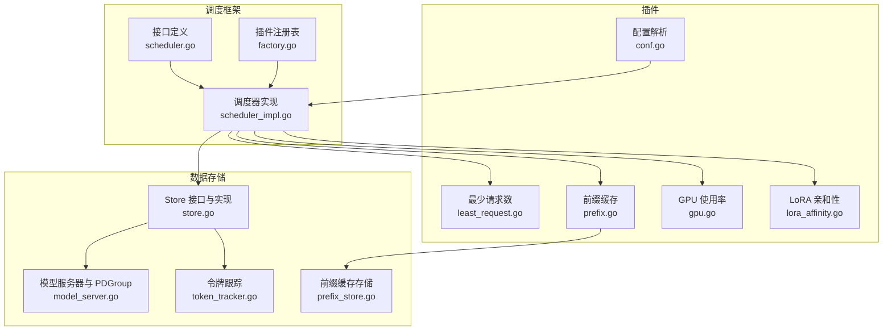
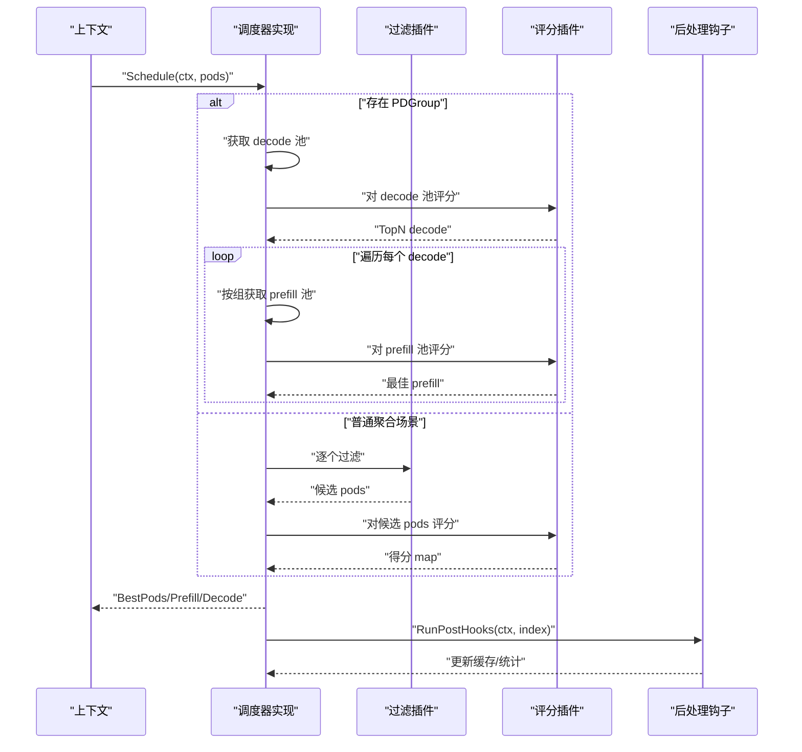
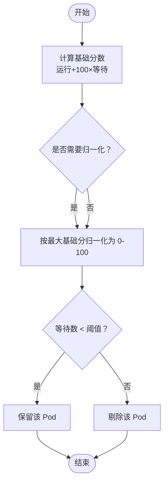
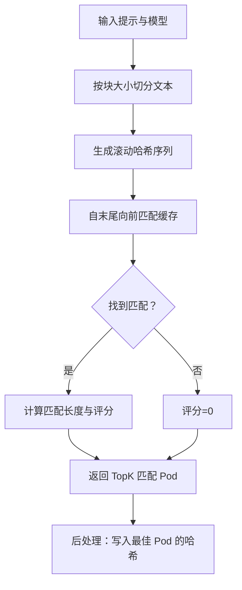
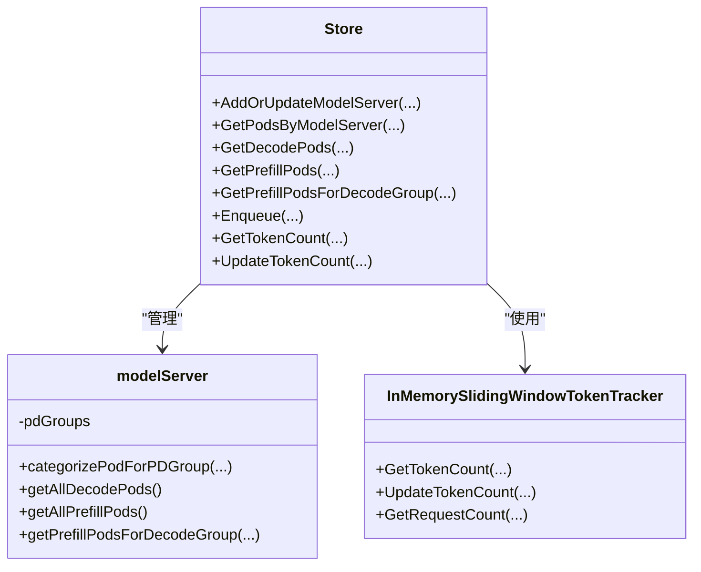
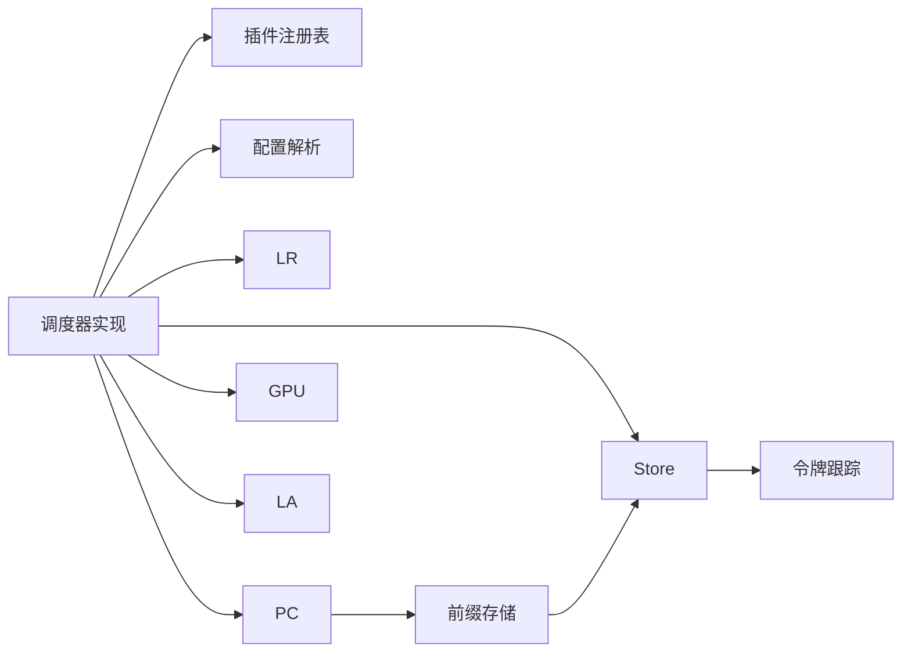

# 调度器系统

<cite>
**本文引用的文件**
- [pkg/kthena-router/scheduler/scheduler.go](file://pkg/kthena-router/scheduler/scheduler.go)
- [pkg/kthena-router/scheduler/scheduler_impl.go](file://pkg/kthena-router/scheduler/scheduler_impl.go)
- [pkg/kthena-router/scheduler/factory.go](file://pkg/kthena-router/scheduler/factory.go)
- [pkg/kthena-router/scheduler/plugins/least_request.go](file://pkg/kthena-router/scheduler/plugins/least_request.go)
- [pkg/kthena-router/scheduler/plugins/prefix.go](file://pkg/kthena-router/scheduler/plugins/prefix.go)
- [pkg/kthena-router/scheduler/plugins/gpu.go](file://pkg/kthena-router/scheduler/plugins/gpu.go)
- [pkg/kthena-router/scheduler/plugins/lora_affinity.go](file://pkg/kthena-router/scheduler/plugins/lora_affinity.go)
- [pkg/kthena-router/scheduler/plugins/conf/conf.go](file://pkg/kthena-router/scheduler/plugins/conf/conf.go)
- [pkg/kthena-router/datastore/store.go](file://pkg/kthena-router/datastore/store.go)
- [pkg/kthena-router/datastore/model_server.go](file://pkg/kthena-router/datastore/model_server.go)
- [pkg/kthena-router/datastore/token_tracker.go](file://pkg/kthena-router/datastore/token_tracker.go)
- [pkg/kthena-router/scheduler/plugins/cache/prefix_store.go](file://pkg/kthena-router/scheduler/plugins/cache/prefix_store.go)
</cite>

## 目录
1. [简介](#简介)
2. [项目结构](#项目结构)
3. [核心组件](#核心组件)
4. [架构总览](#架构总览)
5. [详细组件分析](#详细组件分析)
6. [依赖分析](#依赖分析)
7. [性能考虑](#性能考虑)
8. [故障排查指南](#故障排查指南)
9. [结论](#结论)
10. [附录](#附录)

## 简介
本文件面向 Kthena 路由器调度器系统，提供从架构到实现细节的完整技术文档。重点覆盖以下方面：
- 调度框架：过滤与评分阶段、权重聚合、后处理钩子
- 插件系统：注册机制、默认插件、可配置参数与冲突处理
- 数据存储层：模型服务器状态、队列与令牌跟踪、PDGroup 分组调度
- 内置调度算法：最少请求数、GPU 缓存使用率、前缀缓存匹配、LoRA 亲和性
- 配置方式与扩展方法：基于 YAML 的路由器配置、环境变量与运行时参数
- 性能调优建议与常见问题排查

## 项目结构
Kthena 调度器位于 kthena-router 子模块中，采用“调度框架 + 插件 + 数据存储”的分层设计：
- 调度框架：定义接口、调度器实现、插件注册表与构建工厂
- 插件集合：过滤与评分两类插件，支持参数化配置
- 数据存储：统一 Store 接口，封装 Pod 指标、路由、队列、令牌跟踪与 PDGroup 分组

图表来源
- [pkg/kthena-router/scheduler/scheduler.go:25-28](file://pkg/kthena-router/scheduler/scheduler.go#L25-L28)
- [pkg/kthena-router/scheduler/scheduler_impl.go:40-98](file://pkg/kthena-router/scheduler/scheduler_impl.go#L40-L98)
- [pkg/kthena-router/scheduler/factory.go:29-95](file://pkg/kthena-router/scheduler/factory.go#L29-L95)
- [pkg/kthena-router/scheduler/plugins/least_request.go:29-96](file://pkg/kthena-router/scheduler/plugins/least_request.go#L29-L96)
- [pkg/kthena-router/scheduler/plugins/prefix.go:88-206](file://pkg/kthena-router/scheduler/plugins/prefix.go#L88-L206)
- [pkg/kthena-router/scheduler/plugins/gpu.go:26-49](file://pkg/kthena-router/scheduler/plugins/gpu.go#L26-L49)
- [pkg/kthena-router/scheduler/plugins/lora_affinity.go:25-47](file://pkg/kthena-router/scheduler/plugins/lora_affinity.go#L25-L47)
- [pkg/kthena-router/scheduler/plugins/conf/conf.go:28-102](file://pkg/kthena-router/scheduler/plugins/conf/conf.go#L28-L102)
- [pkg/kthena-router/datastore/store.go:161-240](file://pkg/kthena-router/datastore/store.go#L161-L240)
- [pkg/kthena-router/datastore/model_server.go:27-180](file://pkg/kthena-router/datastore/model_server.go#L27-L180)
- [pkg/kthena-router/datastore/token_tracker.go:34-110](file://pkg/kthena-router/datastore/token_tracker.go#L34-L110)
- [pkg/kthena-router/scheduler/plugins/cache/prefix_store.go:67-94](file://pkg/kthena-router/scheduler/plugins/cache/prefix_store.go#L67-L94)

章节来源
- [pkg/kthena-router/scheduler/scheduler.go:17-28](file://pkg/kthena-router/scheduler/scheduler.go#L17-L28)
- [pkg/kthena-router/scheduler/scheduler_impl.go:59-98](file://pkg/kthena-router/scheduler/scheduler_impl.go#L59-L98)
- [pkg/kthena-router/scheduler/factory.go:65-95](file://pkg/kthena-router/scheduler/factory.go#L65-L95)
- [pkg/kthena-router/datastore/store.go:161-240](file://pkg/kthena-router/datastore/store.go#L161-L240)

## 核心组件
- 调度器接口与实现
  - 接口定义了调度入口与后处理钩子；实现负责过滤、评分、TopN 选择与 PDGroup 优化路径
- 插件注册与构建
  - 注册表集中管理插件构造器；默认注册评分与过滤插件；按配置动态实例化
- 数据存储层
  - Store 提供模型服务器、Pod、路由、网关、推理池等资源的统一访问；内置公平队列与令牌跟踪；支持 PDGroup 快速查找 decode/prefill 对
- 前缀缓存存储
  - 三层映射 + 分片哈希 + LRU，支持滚动哈希匹配与 TopK 返回

章节来源
- [pkg/kthena-router/scheduler/scheduler.go:25-28](file://pkg/kthena-router/scheduler/scheduler.go#L25-L28)
- [pkg/kthena-router/scheduler/scheduler_impl.go:101-164](file://pkg/kthena-router/scheduler/scheduler_impl.go#L101-L164)
- [pkg/kthena-router/scheduler/factory.go:65-95](file://pkg/kthena-router/scheduler/factory.go#L65-L95)
- [pkg/kthena-router/datastore/store.go:161-240](file://pkg/kthena-router/datastore/store.go#L161-L240)
- [pkg/kthena-router/scheduler/plugins/cache/prefix_store.go:67-94](file://pkg/kthena-router/scheduler/plugins/cache/prefix_store.go#L67-L94)

## 架构总览
调度流程分为两阶段：过滤与评分。在 PDGroup 场景下，先对 decode 池打分，再针对每个 decode 找到同组 prefill 并打分，最终形成合法的 prefill-decode 对。

图表来源
- [pkg/kthena-router/scheduler/scheduler_impl.go:101-164](file://pkg/kthena-router/scheduler/scheduler_impl.go#L101-L164)
- [pkg/kthena-router/scheduler/scheduler_impl.go:167-184](file://pkg/kthena-router/scheduler/scheduler_impl.go#L167-L184)
- [pkg/kthena-router/scheduler/scheduler_impl.go:187-223](file://pkg/kthena-router/scheduler/scheduler_impl.go#L187-L223)
- [pkg/kthena-router/scheduler/scheduler_impl.go:225-229](file://pkg/kthena-router/scheduler/scheduler_impl.go#L225-L229)

## 详细组件分析

### 调度器接口与实现
- 接口职责
  - Schedule：接收上下文与候选 Pod 列表，返回最佳选择
  - RunPostHooks：调度后的后处理钩子（如前缀缓存写入）
- 实现要点
  - 过滤阶段：顺序执行过滤插件，记录耗时并短路
  - 评分阶段：对每个插件输出进行加权聚合，TopN 选择
  - PDGroup 优化：decode 与 prefill 同组匹配，避免跨组不一致
  - TopN 选择：固定窗口大小，保证输出稳定性

章节来源
- [pkg/kthena-router/scheduler/scheduler.go:25-28](file://pkg/kthena-router/scheduler/scheduler.go#L25-L28)
- [pkg/kthena-router/scheduler/scheduler_impl.go:101-164](file://pkg/kthena-router/scheduler/scheduler_impl.go#L101-L164)
- [pkg/kthena-router/scheduler/scheduler_impl.go:167-184](file://pkg/kthena-router/scheduler/scheduler_impl.go#L167-L184)
- [pkg/kthena-router/scheduler/scheduler_impl.go:187-223](file://pkg/kthena-router/scheduler/scheduler_impl.go#L187-L223)
- [pkg/kthena-router/scheduler/scheduler_impl.go:225-229](file://pkg/kthena-router/scheduler/scheduler_impl.go#L225-L229)

### 插件系统与注册机制
- 注册表
  - 维护评分与过滤插件的构造器映射
  - 默认注册：GPU 使用率、最少延迟、最少请求数、随机、前缀缓存、KV Cache Aware、最少请求数（过滤）、LoRA 亲和性
- 构建与装配
  - 依据配置加载启用插件与权重，解析各插件参数
  - 处理冲突：当同时配置随机与其他评分插件时，移除随机以避免无意义混合
- 配置格式
  - 支持通过 RouterConfiguration 的 scheduler.plugins 与 pluginConfig 控制启用列表、权重与参数

章节来源
- [pkg/kthena-router/scheduler/factory.go:29-95](file://pkg/kthena-router/scheduler/factory.go#L29-L95)
- [pkg/kthena-router/scheduler/factory.go:114-143](file://pkg/kthena-router/scheduler/factory.go#L114-L143)
- [pkg/kthena-router/scheduler/plugins/conf/conf.go:28-102](file://pkg/kthena-router/scheduler/plugins/conf/conf.go#L28-L102)
- [pkg/kthena-router/scheduler/plugins/conf/conf.go:105-125](file://pkg/kthena-router/scheduler/plugins/conf/conf.go#L105-L125)

### 最少请求数（LeastRequest）算法
- 设计目标
  - 在等待队列长度与运行中的请求数之间取得平衡，优先选择负载较低的 Pod
- 评分策略
  - 基础分数 = 运行中请求数 + 100 × 等待中请求数（等待权重放大）
  - 归一化为 0-100 的分数，最大基础分越小得分越高
- 过滤策略
  - 仅保留等待请求数低于阈值的 Pod

图表来源
- [pkg/kthena-router/scheduler/plugins/least_request.go:68-96](file://pkg/kthena-router/scheduler/plugins/least_request.go#L68-L96)
- [pkg/kthena-router/scheduler/plugins/least_request.go:62-66](file://pkg/kthena-router/scheduler/plugins/least_request.go#L62-L66)

章节来源
- [pkg/kthena-router/scheduler/plugins/least_request.go:34-96](file://pkg/kthena-router/scheduler/plugins/least_request.go#L34-L96)

### GPU 亲和性（GPU 使用率）算法
- 设计目标
  - 优先选择 GPU KV Cache 使用率更低的 Pod，提升显存利用效率
- 评分策略
  - 得分 = (1 − GPU 缓存使用率) × 100

章节来源
- [pkg/kthena-router/scheduler/plugins/gpu.go:26-49](file://pkg/kthena-router/scheduler/plugins/gpu.go#L26-L49)

### 前缀匹配（Prefix）算法
- 设计目标
  - 基于滚动哈希的前缀匹配，最大化缓存命中概率，减少重复解码开销
- 核心流程
  - 将提示文本按块大小切分，生成滚动哈希序列（每块依赖上一块哈希）
  - 在缓存中自末尾向前匹配，首个匹配位置即为最长匹配长度
  - 评分 = 匹配块数 / 总块数 × 100
  - 后处理钩子将最佳 Pod 与其哈希写回缓存，TopK 限制与 LRU 容量控制内存
- 存储结构
  - 三层映射：模型 → 哈希 → Pod 集合（分片哈希表）
  - Pod → 哈希 LRU：用于淘汰同步清理

图表来源
- [pkg/kthena-router/scheduler/plugins/prefix.go:162-188](file://pkg/kthena-router/scheduler/plugins/prefix.go#L162-L188)
- [pkg/kthena-router/scheduler/plugins/prefix.go:190-206](file://pkg/kthena-router/scheduler/plugins/prefix.go#L190-L206)
- [pkg/kthena-router/scheduler/plugins/cache/prefix_store.go:138-195](file://pkg/kthena-router/scheduler/plugins/cache/prefix_store.go#L138-L195)
- [pkg/kthena-router/scheduler/plugins/cache/prefix_store.go:197-238](file://pkg/kthena-router/scheduler/plugins/cache/prefix_store.go#L197-L238)

章节来源
- [pkg/kthena-router/scheduler/plugins/prefix.go:88-206](file://pkg/kthena-router/scheduler/plugins/prefix.go#L88-L206)
- [pkg/kthena-router/scheduler/plugins/cache/prefix_store.go:67-94](file://pkg/kthena-router/scheduler/plugins/cache/prefix_store.go#L67-L94)

### LoRA 亲和性（LoraAffinity）过滤
- 设计目标
  - 仅允许包含指定模型（含 LoRA 适配器）的 Pod 参与调度
- 过滤逻辑
  - 通过模型包含判断进行过滤

章节来源
- [pkg/kthena-router/scheduler/plugins/lora_affinity.go:25-47](file://pkg/kthena-router/scheduler/plugins/lora_affinity.go#L25-L47)

### 数据存储层与 PDGroup 调度
- Store 接口能力
  - 模型服务器、Pod、路由、网关、推理池的增删改查与回调注册
  - 公平队列与令牌跟踪：按用户/模型维度维护滑动窗口内的 token 数与请求次数
  - PDGroup 方法：快速获取 decode/prefill 池及同组 prefill
- PDGroup 分类
  - 依据模型服务器的 PDGroup 标签键，将 Pod 分类为 decode 或 prefill
  - 同一组内进行 prefill-decode 匹配，确保前后处理一致性
- 运行时指标
  - 定期刷新 Pod 的 GPU 缓存使用率、等待/运行中请求数、TTFT/TPOT 等直方图

图表来源
- [pkg/kthena-router/datastore/store.go:161-240](file://pkg/kthena-router/datastore/store.go#L161-L240)
- [pkg/kthena-router/datastore/model_server.go:27-180](file://pkg/kthena-router/datastore/model_server.go#L27-L180)
- [pkg/kthena-router/datastore/token_tracker.go:34-110](file://pkg/kthena-router/datastore/token_tracker.go#L34-L110)

章节来源
- [pkg/kthena-router/datastore/store.go:410-485](file://pkg/kthena-router/datastore/store.go#L410-L485)
- [pkg/kthena-router/datastore/store.go:572-635](file://pkg/kthena-router/datastore/store.go#L572-L635)
- [pkg/kthena-router/datastore/model_server.go:76-180](file://pkg/kthena-router/datastore/model_server.go#L76-L180)
- [pkg/kthena-router/datastore/token_tracker.go:194-307](file://pkg/kthena-router/datastore/token_tracker.go#L194-L307)

## 依赖分析
- 组件耦合
  - 调度器实现依赖 Store 获取 Pod 信息与 PDGroup；依赖插件注册表与配置解析
  - 前缀缓存插件依赖前缀存储与 Store 回调清理
  - 令牌跟踪独立于调度器，但被 Store 用于公平队列
- 外部依赖
  - Prometheus 直方图类型 dto 用于 TTFT/TPOT 指标
  - xxHash 用于高效滚动哈希
  - Istio slices 与 sets 用于集合操作

图表来源
- [pkg/kthena-router/scheduler/scheduler_impl.go:40-98](file://pkg/kthena-router/scheduler/scheduler_impl.go#L40-L98)
- [pkg/kthena-router/scheduler/factory.go:65-95](file://pkg/kthena-router/scheduler/factory.go#L65-L95)
- [pkg/kthena-router/scheduler/plugins/conf/conf.go:82-102](file://pkg/kthena-router/scheduler/plugins/conf/conf.go#L82-L102)
- [pkg/kthena-router/scheduler/plugins/prefix.go:88-206](file://pkg/kthena-router/scheduler/plugins/prefix.go#L88-L206)
- [pkg/kthena-router/scheduler/plugins/cache/prefix_store.go:67-94](file://pkg/kthena-router/scheduler/plugins/cache/prefix_store.go#L67-L94)
- [pkg/kthena-router/datastore/store.go:161-240](file://pkg/kthena-router/datastore/store.go#L161-L240)
- [pkg/kthena-router/datastore/token_tracker.go:34-110](file://pkg/kthena-router/datastore/token_tracker.go#L34-L110)

章节来源
- [pkg/kthena-router/scheduler/scheduler_impl.go:40-98](file://pkg/kthena-router/scheduler/scheduler_impl.go#L40-L98)
- [pkg/kthena-router/scheduler/plugins/cache/prefix_store.go:90-94](file://pkg/kthena-router/scheduler/plugins/cache/prefix_store.go#L90-L94)

## 性能考虑
- 评分与过滤的复杂度
  - 评分阶段对每个候选 Pod 计算一次分数，整体 O(N)，N 为候选数量
  - 过滤阶段按序短路，通常能快速缩小候选集
- TopN 选择
  - 固定窗口大小，排序成本可控；建议根据并发与延迟需求调整
- 前缀缓存
  - 滚动哈希自末尾匹配，平均匹配效率高；TopK 与 LRU 控制内存占用
  - 块大小与最大匹配块数影响吞吐与命中率，需结合模型与输入特征调优
- 令牌跟踪与公平队列
  - 滑动窗口与权重可调；窗口过小会频繁清理，过大则内存占用上升
  - 公平队列 QPS 与并发上限影响排队与响应时间

## 故障排查指南
- 调度失败
  - 过滤阶段可能将所有候选剔除：检查过滤插件阈值与 Pod 状态
  - PDGroup 未找到合法 prefill-decode 对：确认模型服务器标签键与 Pod 分类正确
- 评分异常
  - 权重冲突导致随机插件被移除：仅允许独立使用随机插件
  - GPU 使用率或等待/运行中请求数异常：检查后端指标采集与 Store 更新周期
- 前缀缓存命中低
  - 块大小与最大匹配块数设置不当；确认提示长度与模型特性匹配
  - LRU 容量不足导致频繁淘汰：适当增大容量或降低 TopK
- 公平队列积压
  - 调整窗口大小、权重与 QPS 上限；监控队列长度与请求计数

章节来源
- [pkg/kthena-router/scheduler/scheduler_impl.go:167-184](file://pkg/kthena-router/scheduler/scheduler_impl.go#L167-L184)
- [pkg/kthena-router/scheduler/scheduler_impl.go:108-158](file://pkg/kthena-router/scheduler/scheduler_impl.go#L108-L158)
- [pkg/kthena-router/scheduler/plugins/conf/conf.go:105-125](file://pkg/kthena-router/scheduler/plugins/conf/conf.go#L105-L125)
- [pkg/kthena-router/datastore/store.go:443-468](file://pkg/kthena-router/datastore/store.go#L443-L468)
- [pkg/kthena-router/datastore/token_tracker.go:194-307](file://pkg/kthena-router/datastore/token_tracker.go#L194-L307)

## 结论
Kthena 调度器通过清晰的框架与插件体系，结合数据存储层的状态感知与队列/令牌跟踪，实现了对模型推理场景的高效调度。最少请求数、GPU 使用率与前缀缓存等算法共同作用，兼顾吞吐与延迟；PDGroup 机制保障了预填充与解码的一致性。通过可配置的插件与环境变量，系统具备良好的可扩展性与可运维性。

## 附录

### 调度器配置示例（YAML）
- 路由器配置项
  - scheduler.plugins.score.enabled：启用的评分插件及其权重
  - scheduler.plugins.filter.enabled：启用的过滤插件列表
  - scheduler.pluginConfig：各插件的参数（如最少请求数的最大等待数、前缀缓存的块大小与匹配上限等）
- 环境变量（令牌跟踪与公平队列）
  - FAIRNESS_WINDOW_SIZE：令牌跟踪窗口大小
  - FAIRNESS_INPUT_TOKEN_WEIGHT / FAIRNESS_OUTPUT_TOKEN_WEIGHT：输入/输出 token 权重
  - FAIRNESS_MAX_CONCURRENT / FAIRNESS_MAX_QPS / FAIRNESS_PRIORITY_REFRESH_RETRIES / FAIRNESS_REBUILD_THRESHOLD / FAIRNESS_PRIORITY_TOKEN_WEIGHT / FAIRNESS_PRIORITY_REQUEST_NUM_WEIGHT：公平队列相关参数

章节来源
- [pkg/kthena-router/scheduler/plugins/conf/conf.go:28-102](file://pkg/kthena-router/scheduler/plugins/conf/conf.go#L28-L102)
- [pkg/kthena-router/datastore/store.go:70-111](file://pkg/kthena-router/datastore/store.go#L70-L111)
- [pkg/kthena-router/datastore/store.go:351-404](file://pkg/kthena-router/datastore/store.go#L351-L404)