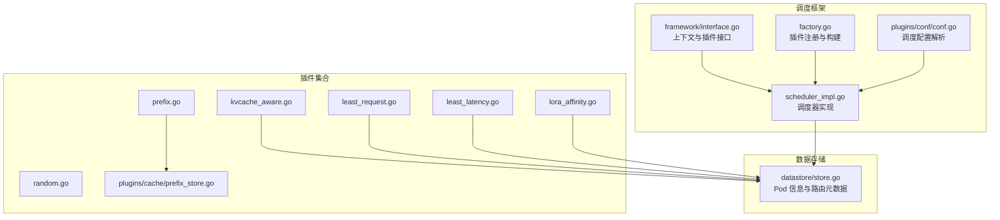
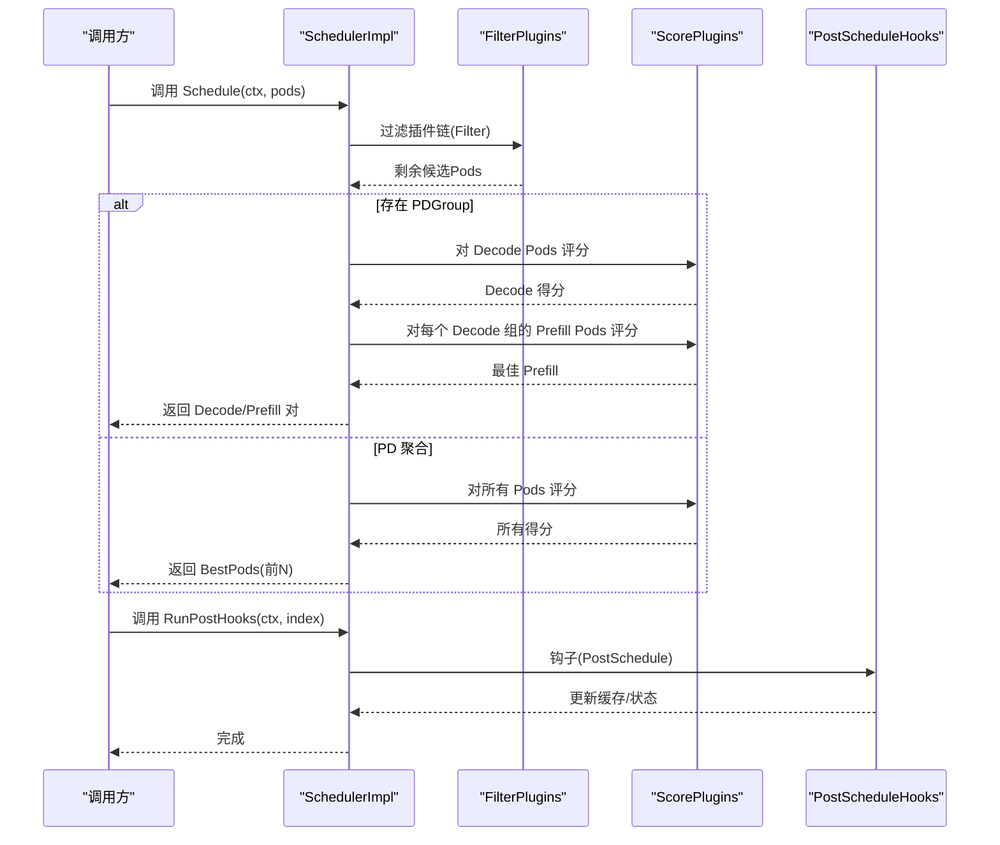
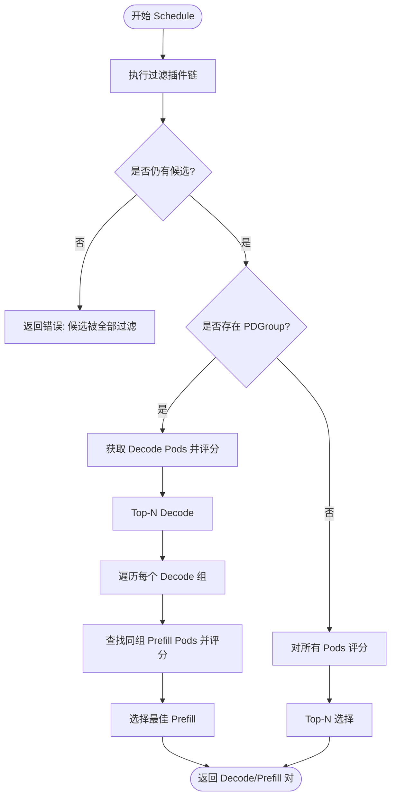
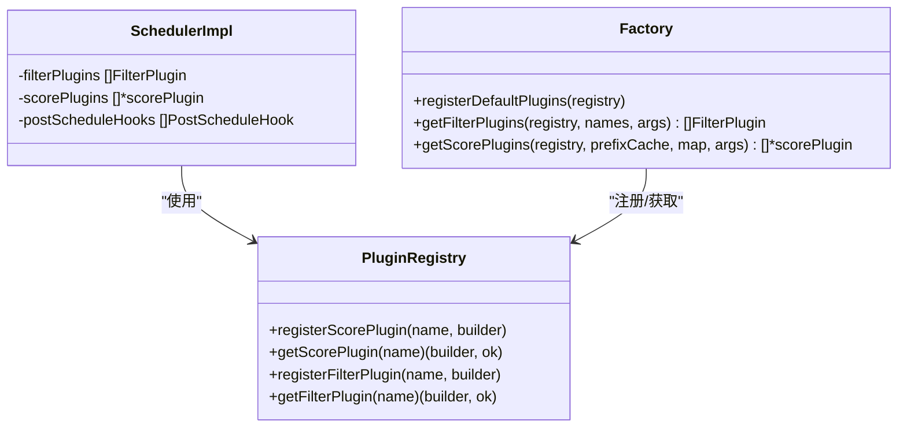
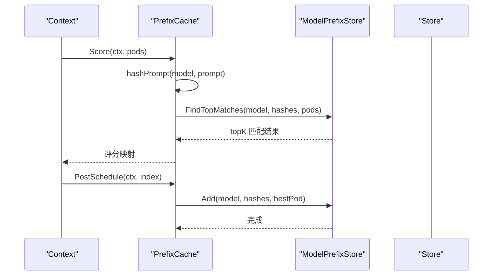
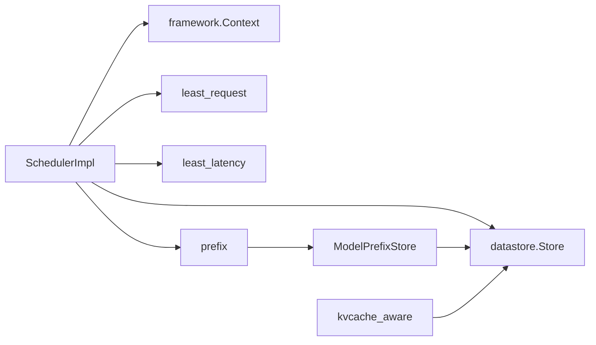

# 调度框架

<cite>
**本文引用的文件**
- [pkg/kthena-router/scheduler/scheduler.go](file://pkg/kthena-router/scheduler/scheduler.go)
- [pkg/kthena-router/scheduler/scheduler_impl.go](file://pkg/kthena-router/scheduler/scheduler_impl.go)
- [pkg/kthena-router/scheduler/factory.go](file://pkg/kthena-router/scheduler/factory.go)
- [pkg/kthena-router/scheduler/plugins/conf/conf.go](file://pkg/kthena-router/scheduler/plugins/conf/conf.go)
- [pkg/kthena-router/scheduler/framework/interface.go](file://pkg/kthena-router/scheduler/framework/interface.go)
- [pkg/kthena-router/datastore/store.go](file://pkg/kthena-router/datastore/store.go)
- [pkg/kthena-router/scheduler/plugins/least_request.go](file://pkg/kthena-router/scheduler/plugins/least_request.go)
- [pkg/kthena-router/scheduler/plugins/least_latency.go](file://pkg/kthena-router/scheduler/plugins/least_latency.go)
- [pkg/kthena-router/scheduler/plugins/random.go](file://pkg/kthena-router/scheduler/plugins/random.go)
- [pkg/kthena-router/scheduler/plugins/kvcache_aware.go](file://pkg/kthena-router/scheduler/plugins/kvcache_aware.go)
- [pkg/kthena-router/scheduler/plugins/prefix.go](file://pkg/kthena-router/scheduler/plugins/prefix.go)
- [pkg/kthena-router/scheduler/plugins/lora_affinity.go](file://pkg/kthena-router/scheduler/plugins/lora_affinity.go)
- [pkg/kthena-router/scheduler/plugins/cache/prefix_store.go](file://pkg/kthena-router/scheduler/plugins/cache/prefix_store.go)
</cite>

## 目录
1. [简介](#简介)
2. [项目结构](#项目结构)
3. [核心组件](#核心组件)
4. [架构总览](#架构总览)
5. [详细组件分析](#详细组件分析)
6. [依赖分析](#依赖分析)
7. [性能考虑](#性能考虑)
8. [故障排查指南](#故障排查指南)
9. [结论](#结论)
10. [附录](#附录)

## 简介
本文件面向 Kthena 路由器调度框架，系统性阐述调度器接口与实现原理，覆盖以下主题：
- Scheduler 接口定义与职责边界
- Schedule 方法的执行流程（过滤、评分、PD 拆分调度）
- RunPostHooks 钩子机制与后处理缓存更新
- 上下文管理（Context）与插件注册机制（Plugin Registry）
- 调度生命周期管理与错误处理策略
- 多 Pod 调度决策、性能优化与可扩展性建议
- 配置示例与扩展指南

## 项目结构
调度相关代码主要位于 pkg/kthena-router/scheduler 目录，包含接口定义、调度器实现、插件注册工厂、插件配置与具体插件实现等模块。

**图表来源**
- [pkg/kthena-router/scheduler/framework/interface.go:28-67](file://pkg/kthena-router/scheduler/framework/interface.go#L28-L67)
- [pkg/kthena-router/scheduler/scheduler_impl.go:101-165](file://pkg/kthena-router/scheduler/scheduler_impl.go#L101-L165)
- [pkg/kthena-router/scheduler/factory.go:66-95](file://pkg/kthena-router/scheduler/factory.go#L66-L95)
- [pkg/kthena-router/scheduler/plugins/conf/conf.go:82-103](file://pkg/kthena-router/scheduler/plugins/conf/conf.go#L82-L103)
- [pkg/kthena-router/scheduler/plugins/prefix.go:162-188](file://pkg/kthena-router/scheduler/plugins/prefix.go#L162-L188)
- [pkg/kthena-router/scheduler/plugins/cache/prefix_store.go:138-195](file://pkg/kthena-router/scheduler/plugins/cache/prefix_store.go#L138-L195)
- [pkg/kthena-router/datastore/store.go:186-189](file://pkg/kthena-router/datastore/store.go#L186-L189)

**章节来源**
- [pkg/kthena-router/scheduler/scheduler.go:25-28](file://pkg/kthena-router/scheduler/scheduler.go#L25-L28)
- [pkg/kthena-router/scheduler/scheduler_impl.go:101-165](file://pkg/kthena-router/scheduler/scheduler_impl.go#L101-L165)
- [pkg/kthena-router/scheduler/factory.go:66-95](file://pkg/kthena-router/scheduler/factory.go#L66-L95)
- [pkg/kthena-router/scheduler/plugins/conf/conf.go:82-103](file://pkg/kthena-router/scheduler/plugins/conf/conf.go#L82-L103)
- [pkg/kthena-router/scheduler/framework/interface.go:28-67](file://pkg/kthena-router/scheduler/framework/interface.go#L28-L67)
- [pkg/kthena-router/datastore/store.go:186-189](file://pkg/kthena-router/datastore/store.go#L186-L189)

## 核心组件
- 调度器接口：定义 Schedule 与 RunPostHooks 两个关键方法，分别负责调度决策与后处理钩子。
- 调度器实现：封装过滤插件链、评分插件聚合、Top-N 选择、PD 拆分调度与后处理钩子执行。
- 插件注册工厂：统一注册默认插件，按配置动态构建过滤与评分插件列表。
- 插件配置：支持从 YAML 解析启用/禁用插件、权重与参数，自动处理冲突与默认值。
- 上下文 Context：承载模型名、提示词、PD 分组信息、候选 Pod 列表与指标记录器。
- 数据存储 Store：提供 Pod 信息、模型路由、PD 分组查询与回调注册，支撑调度决策。

**章节来源**
- [pkg/kthena-router/scheduler/scheduler.go:25-28](file://pkg/kthena-router/scheduler/scheduler.go#L25-L28)
- [pkg/kthena-router/scheduler/scheduler_impl.go:40-47](file://pkg/kthena-router/scheduler/scheduler_impl.go#L40-L47)
- [pkg/kthena-router/scheduler/factory.go:66-95](file://pkg/kthena-router/scheduler/factory.go#L66-L95)
- [pkg/kthena-router/scheduler/plugins/conf/conf.go:82-103](file://pkg/kthena-router/scheduler/plugins/conf/conf.go#L82-L103)
- [pkg/kthena-router/scheduler/framework/interface.go:28-47](file://pkg/kthena-router/scheduler/framework/interface.go#L28-L47)
- [pkg/kthena-router/datastore/store.go:162-240](file://pkg/kthena-router/datastore/store.go#L162-L240)

## 架构总览
调度框架采用“插件化 + 工厂 + 配置”的组合模式，通过 Context 在过滤与评分阶段传递状态，并在评分后进行 Top-N 选择与 PD 拆分调度。后处理钩子用于更新缓存或外部状态。

**图表来源**
- [pkg/kthena-router/scheduler/scheduler_impl.go:101-165](file://pkg/kthena-router/scheduler/scheduler_impl.go#L101-L165)
- [pkg/kthena-router/scheduler/scheduler_impl.go:225-229](file://pkg/kthena-router/scheduler/scheduler_impl.go#L225-L229)
- [pkg/kthena-router/scheduler/scheduler_impl.go:187-223](file://pkg/kthena-router/scheduler/scheduler_impl.go#L187-L223)

## 详细组件分析

### 调度器接口与实现
- 接口职责
  - Schedule(ctx, pods): 执行过滤与评分，产出调度结果（BestPods 或 Decode/Prefill 对）。
  - RunPostHooks(ctx, index): 在调度完成后执行后处理钩子，如更新前缀缓存。
- 实现要点
  - 过滤插件链：逐个执行 Filter，记录耗时并以 MetricsRecorder 记录；若某插件将候选清空则报错返回。
  - 评分插件聚合：对每个插件输出的得分按权重加权求和，最终取 Top-N。
  - PD 拆分调度：当存在 PDGroup 时，先对 Decode Pods 评分并取 Top-N，再为每个 Decode Pod 查找同组 Prefill Pods 并各自评分选最佳。
  - 后处理钩子：当前包含 PrefixCache 的 PostSchedule，将最终选择的 Pod 与其哈希加入缓存。

**图表来源**
- [pkg/kthena-router/scheduler/scheduler_impl.go:101-165](file://pkg/kthena-router/scheduler/scheduler_impl.go#L101-L165)
- [pkg/kthena-router/scheduler/scheduler_impl.go:167-185](file://pkg/kthena-router/scheduler/scheduler_impl.go#L167-L185)
- [pkg/kthena-router/scheduler/scheduler_impl.go:187-223](file://pkg/kthena-router/scheduler/scheduler_impl.go#L187-L223)

**章节来源**
- [pkg/kthena-router/scheduler/scheduler.go:25-28](file://pkg/kthena-router/scheduler/scheduler.go#L25-L28)
- [pkg/kthena-router/scheduler/scheduler_impl.go:101-165](file://pkg/kthena-router/scheduler/scheduler_impl.go#L101-L165)
- [pkg/kthena-router/scheduler/scheduler_impl.go:167-185](file://pkg/kthena-router/scheduler/scheduler_impl.go#L167-L185)
- [pkg/kthena-router/scheduler/scheduler_impl.go:187-223](file://pkg/kthena-router/scheduler/scheduler_impl.go#L187-L223)
- [pkg/kthena-router/scheduler/scheduler_impl.go:225-229](file://pkg/kthena-router/scheduler/scheduler_impl.go#L225-L229)

### 上下文管理（Context）
- 字段说明
  - 模型名、提示词、哈希数组（用于缓存）
  - ModelServer 名称、PDGroup 对象
  - Decode/Prefill/BestPods 列表
  - MetricsRecorder 用于记录插件耗时
- 使用场景
  - 过滤/评分插件读取运行指标与模型信息
  - 后处理钩子写入缓存命中哈希

**章节来源**
- [pkg/kthena-router/scheduler/framework/interface.go:28-47](file://pkg/kthena-router/scheduler/framework/interface.go#L28-L47)

### 插件注册机制与配置
- 插件注册
  - 默认注册：最少请求、最低延迟、随机、前缀缓存、KV 缓存感知、最少请求过滤、LoRA 亲和过滤。
  - 注册方式：通过 PluginRegistry 维护名称到构建函数映射，按需实例化。
- 配置加载
  - 支持从 YAML 中声明启用的评分/过滤插件及其权重、参数。
  - 自动处理随机插件与其他评分插件共用的冲突，避免混合使用。
  - 参数解析失败时回退默认值并告警。

**图表来源**
- [pkg/kthena-router/scheduler/factory.go:29-63](file://pkg/kthena-router/scheduler/factory.go#L29-L63)
- [pkg/kthena-router/scheduler/factory.go:66-95](file://pkg/kthena-router/scheduler/factory.go#L66-L95)
- [pkg/kthena-router/scheduler/factory.go:97-143](file://pkg/kthena-router/scheduler/factory.go#L97-L143)
- [pkg/kthena-router/scheduler/scheduler_impl.go:59-99](file://pkg/kthena-router/scheduler/scheduler_impl.go#L59-L99)

**章节来源**
- [pkg/kthena-router/scheduler/factory.go:66-95](file://pkg/kthena-router/scheduler/factory.go#L66-L95)
- [pkg/kthena-router/scheduler/factory.go:97-143](file://pkg/kthena-router/scheduler/factory.go#L97-L143)
- [pkg/kthena-router/scheduler/plugins/conf/conf.go:82-103](file://pkg/kthena-router/scheduler/plugins/conf/conf.go#L82-L103)
- [pkg/kthena-router/scheduler/plugins/conf/conf.go:107-125](file://pkg/kthena-router/scheduler/plugins/conf/conf.go#L107-L125)

### 典型插件实现与特性

#### 最少请求数（least-request）
- 角色：Filter + Score
- 过滤逻辑：基于等待中的请求数阈值过滤高负载 Pod。
- 评分逻辑：综合“运行中请求 + 等待中请求×权重”计算相对分数，归一化到 0-100。

**章节来源**
- [pkg/kthena-router/scheduler/plugins/least_request.go:62-96](file://pkg/kthena-router/scheduler/plugins/least_request.go#L62-L96)

#### 最低延迟（least-latency）
- 角色：Score
- 特点：基于 TTFT/TPOT 的线性归一化，权重因子可配置，避免极端值影响。

**章节来源**
- [pkg/kthena-router/scheduler/plugins/least_latency.go:65-96](file://pkg/kthena-router/scheduler/plugins/least_latency.go#L65-L96)

#### 随机（random）
- 角色：Score（仅独立使用）
- 特点：测试用途，不建议与其他评分插件混用。

**章节来源**
- [pkg/kthena-router/scheduler/plugins/random.go:58-73](file://pkg/kthena-router/scheduler/plugins/random.go#L58-L73)

#### KV 缓存感知（kvcache-aware）
- 角色：Score
- 特点：基于 Redis 的块级哈希匹配，统计最长连续匹配长度作为得分；依赖分词器与 Redis 客户端。

**章节来源**
- [pkg/kthena-router/scheduler/plugins/kvcache_aware.go:153-192](file://pkg/kthena-router/scheduler/plugins/kvcache_aware.go#L153-L192)
- [pkg/kthena-router/scheduler/plugins/kvcache_aware.go:194-238](file://pkg/kthena-router/scheduler/plugins/kvcache_aware.go#L194-L238)
- [pkg/kthena-router/scheduler/plugins/kvcache_aware.go:247-299](file://pkg/kthena-router/scheduler/plugins/kvcache_aware.go#L247-L299)

#### 前缀缓存（prefix-cache）
- 角色：Score + PostScheduleHook
- 特点：将提示词切分为固定大小块并生成滚动哈希，使用三层映射与 LRU 管理命中缓存；评分基于最长匹配前缀比例；调度后将最佳 Pod 与哈希写回缓存。

**图表来源**
- [pkg/kthena-router/scheduler/plugins/prefix.go:162-188](file://pkg/kthena-router/scheduler/plugins/prefix.go#L162-L188)
- [pkg/kthena-router/scheduler/plugins/prefix.go:190-206](file://pkg/kthena-router/scheduler/plugins/prefix.go#L190-L206)
- [pkg/kthena-router/scheduler/plugins/cache/prefix_store.go:138-195](file://pkg/kthena-router/scheduler/plugins/cache/prefix_store.go#L138-L195)
- [pkg/kthena-router/scheduler/plugins/cache/prefix_store.go:197-238](file://pkg/kthena-router/scheduler/plugins/cache/prefix_store.go#L197-L238)

**章节来源**
- [pkg/kthena-router/scheduler/plugins/prefix.go:162-188](file://pkg/kthena-router/scheduler/plugins/prefix.go#L162-L188)
- [pkg/kthena-router/scheduler/plugins/prefix.go:190-206](file://pkg/kthena-router/scheduler/plugins/prefix.go#L190-L206)
- [pkg/kthena-router/scheduler/plugins/cache/prefix_store.go:138-195](file://pkg/kthena-router/scheduler/plugins/cache/prefix_store.go#L138-L195)
- [pkg/kthena-router/scheduler/plugins/cache/prefix_store.go:197-238](file://pkg/kthena-router/scheduler/plugins/cache/prefix_store.go#L197-L238)

#### LoRA 亲和（lora-affinity）
- 角色：Filter
- 特点：仅保留已加载目标 LoRA 的 Pod。

**章节来源**
- [pkg/kthena-router/scheduler/plugins/lora_affinity.go:43-47](file://pkg/kthena-router/scheduler/plugins/lora_affinity.go#L43-L47)

### 数据存储与 PD 拆分调度
- Store 提供：
  - GetDecodePods / GetPrefillPods / GetPrefillPodsForDecodeGroup：O(1) 查询 PD 分组内的 Pods。
  - RegisterCallback：监听 Pod 生命周期事件，清理缓存。
- 调度流程：
  - 若存在 PDGroup，则优先走 Decode/Prefill 双阶段评分与配对。
  - 否则对所有候选 Pods 进行评分并 Top-N。

**章节来源**
- [pkg/kthena-router/datastore/store.go:186-189](file://pkg/kthena-router/datastore/store.go#L186-L189)
- [pkg/kthena-router/datastore/store.go:612-635](file://pkg/kthena-router/datastore/store.go#L612-L635)
- [pkg/kthena-router/scheduler/scheduler_impl.go:108-158](file://pkg/kthena-router/scheduler/scheduler_impl.go#L108-L158)

## 依赖分析
- 耦合关系
  - SchedulerImpl 依赖 Store 获取 PD 分组与 Pod 信息，依赖 MetricsRecorder 记录插件耗时。
  - 插件通过 framework 接口与 Context 解耦，便于替换与扩展。
  - PrefixCache 依赖 ModelPrefixStore 与 Store 回调，形成闭环。
- 可能的循环依赖
  - 当前未见直接循环导入；插件与 Store 通过接口解耦，避免循环依赖风险。
- 外部依赖
  - Redis（KV 缓存感知插件）
  - Prometheus 指标（MetricsRecorder）

**图表来源**
- [pkg/kthena-router/scheduler/scheduler_impl.go:40-47](file://pkg/kthena-router/scheduler/scheduler_impl.go#L40-L47)
- [pkg/kthena-router/scheduler/plugins/prefix.go:97-105](file://pkg/kthena-router/scheduler/plugins/prefix.go#L97-L105)
- [pkg/kthena-router/scheduler/plugins/cache/prefix_store.go:82-94](file://pkg/kthena-router/scheduler/plugins/cache/prefix_store.go#L82-L94)
- [pkg/kthena-router/scheduler/plugins/kvcache_aware.go:130-139](file://pkg/kthena-router/scheduler/plugins/kvcache_aware.go#L130-L139)

**章节来源**
- [pkg/kthena-router/scheduler/scheduler_impl.go:40-47](file://pkg/kthena-router/scheduler/scheduler_impl.go#L40-L47)
- [pkg/kthena-router/scheduler/plugins/prefix.go:97-105](file://pkg/kthena-router/scheduler/plugins/prefix.go#L97-L105)
- [pkg/kthena-router/scheduler/plugins/cache/prefix_store.go:82-94](file://pkg/kthena-router/scheduler/plugins/cache/prefix_store.go#L82-L94)
- [pkg/kthena-router/scheduler/plugins/kvcache_aware.go:130-139](file://pkg/kthena-router/scheduler/plugins/kvcache_aware.go#L130-L139)

## 性能考虑
- 评分与过滤的 O(N) 复杂度：评分插件对每个 Pod 生成分数，整体为 O(P×K)，K 为插件数；Top-N 选择为 O(P log P)。
- PD 拆分调度优化：通过 Store 的 O(1) 查询减少遍历成本；Decode 与 Prefill 各自 Top-N，降低无效计算。
- 缓存命中：PrefixCache 与 KVCacheAware 通过哈希/块级匹配提升命中率，减少重复计算。
- 并发与锁：Store 内部使用 RWMutex 保护共享状态；PrefixStore 使用分片哈希与 LRU，降低锁竞争。
- 指标记录：通过 MetricsRecorder 记录各插件耗时，便于定位瓶颈。

[本节为通用性能讨论，无需列出具体文件来源]

## 故障排查指南
- 过滤阶段无候选
  - 现象：过滤插件链执行后候选为空，返回错误。
  - 排查：检查过滤插件阈值设置（如最少请求数），确认 Pod 指标是否异常。
- PD 拆分调度失败
  - 现象：未找到 Decode/Prefill 对或同组 Prefill 为空。
  - 排查：确认 Store 中 PD 分组标签与命名空间正确；检查 ModelServer 与 Pod 的分类是否一致。
- 前缀缓存未命中
  - 现象：PrefixCache 得分偏低。
  - 排查：调整块大小、最大匹配块数与缓存容量；确认 Prompt 文本非空且哈希生成正常。
- KV 缓存感知插件异常
  - 现象：Redis 查询超时或返回空。
  - 排查：检查 Redis 连接配置、键格式与字段命名；确认分词器可用且 Token 化成功。
- 随机插件冲突
  - 现象：与其他评分插件混用导致评分无意义。
  - 排查：仅启用随机插件或移除随机插件。

**章节来源**
- [pkg/kthena-router/scheduler/scheduler_impl.go:167-185](file://pkg/kthena-router/scheduler/scheduler_impl.go#L167-L185)
- [pkg/kthena-router/scheduler/scheduler_impl.go:112-116](file://pkg/kthena-router/scheduler/scheduler_impl.go#L112-L116)
- [pkg/kthena-router/scheduler/plugins/conf/conf.go:107-125](file://pkg/kthena-router/scheduler/plugins/conf/conf.go#L107-L125)
- [pkg/kthena-router/scheduler/plugins/prefix.go:162-188](file://pkg/kthena-router/scheduler/plugins/prefix.go#L162-L188)
- [pkg/kthena-router/scheduler/plugins/kvcache_aware.go:194-238](file://pkg/kthena-router/scheduler/plugins/kvcache_aware.go#L194-L238)

## 结论
Kthena 调度框架通过清晰的接口与插件化设计，实现了可配置、可观测、可扩展的推理 Pod 选择能力。其核心优势在于：
- 明确的过滤/评分/后处理三段式流程
- PD 拆分调度的高效实现
- 前缀与 KV 缓存感知的智能评分
- 丰富的配置与默认插件，便于快速落地

建议在生产环境中结合指标监控与缓存策略，持续优化插件权重与参数，以获得更优的吞吐与延迟表现。

[本节为总结性内容，无需列出具体文件来源]

## 附录

### 配置示例与扩展指南
- 调度配置（YAML）
  - 插件启用/禁用与权重：在 plugins.score.enabled 与 plugins.filter.enabled 中声明。
  - 插件参数：通过 pluginConfig 为指定插件注入参数。
  - 冲突处理：若同时启用随机插件与其他评分插件，将移除随机插件并告警。
- 扩展新插件
  - 实现 framework.ScorePlugin 或 framework.FilterPlugin 接口。
  - 在工厂中注册插件构建函数（registerScorePlugin/registerFilterPlugin）。
  - 在配置中启用新插件并设置权重与参数。
- 后处理钩子
  - 实现 framework.PostScheduleHook 接口，在 RunPostHooks 中统一执行。
  - 适用于缓存更新、状态同步等场景。

**章节来源**
- [pkg/kthena-router/scheduler/plugins/conf/conf.go:82-103](file://pkg/kthena-router/scheduler/plugins/conf/conf.go#L82-L103)
- [pkg/kthena-router/scheduler/plugins/conf/conf.go:107-125](file://pkg/kthena-router/scheduler/plugins/conf/conf.go#L107-L125)
- [pkg/kthena-router/scheduler/factory.go:66-95](file://pkg/kthena-router/scheduler/factory.go#L66-L95)
- [pkg/kthena-router/scheduler/scheduler_impl.go:95-98](file://pkg/kthena-router/scheduler/scheduler_impl.go#L95-L98)
- [pkg/kthena-router/scheduler/framework/interface.go:62-66](file://pkg/kthena-router/scheduler/framework/interface.go#L62-L66)