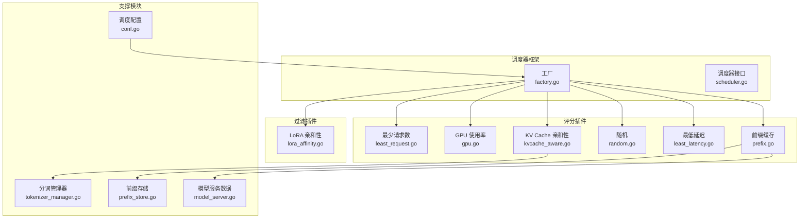
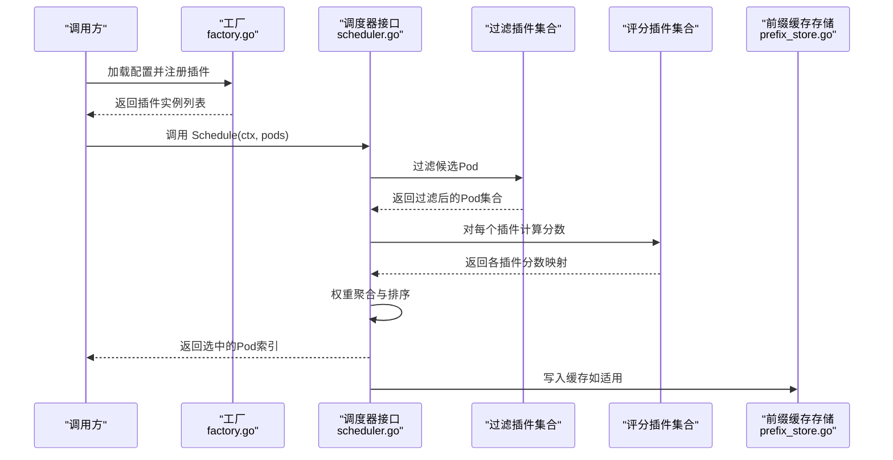
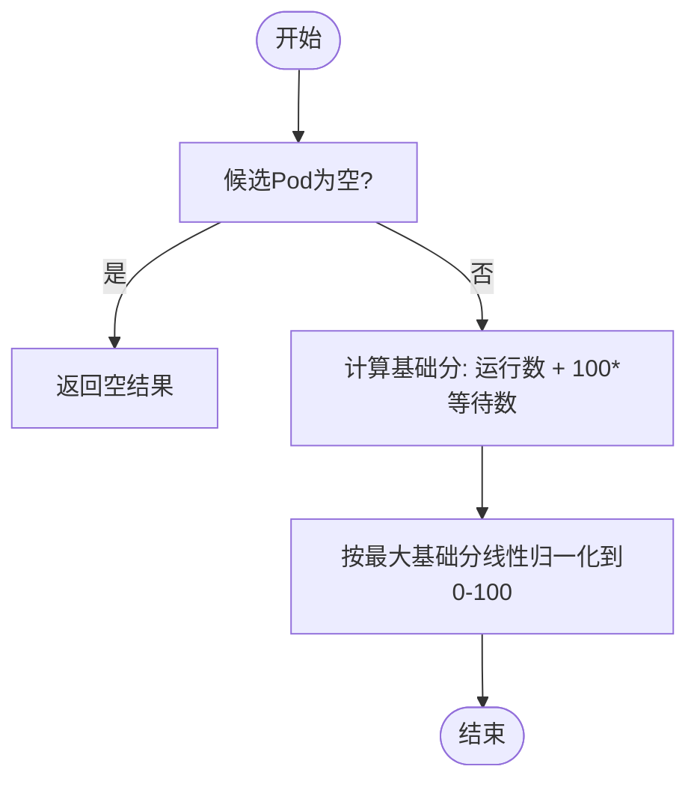
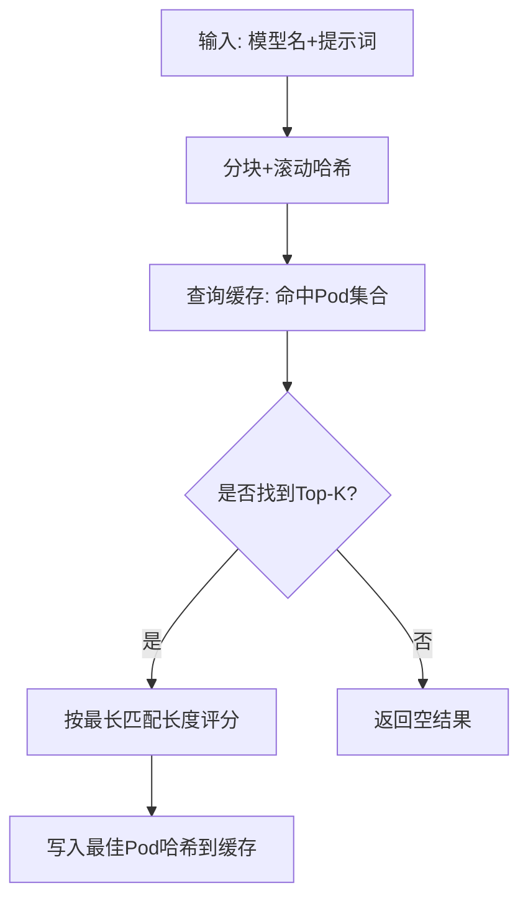
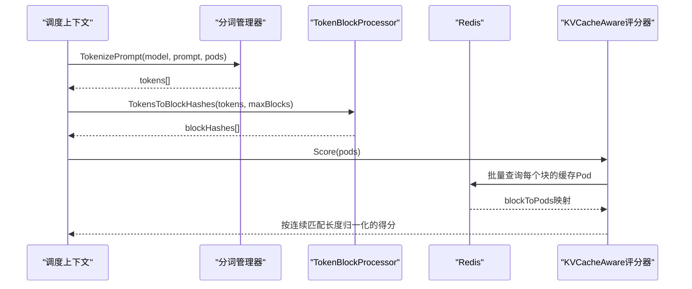
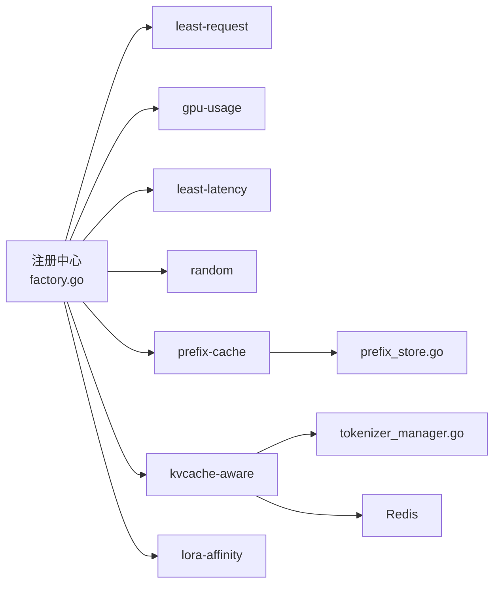

# 调度算法插件

<cite>
**本文引用的文件**
- [factory.go](file://pkg/kthena-router/scheduler/factory.go)
- [scheduler.go](file://pkg/kthena-router/scheduler/scheduler.go)
- [least_request.go](file://pkg/kthena-router/scheduler/plugins/least_request.go)
- [gpu.go](file://pkg/kthena-router/scheduler/plugins/gpu.go)
- [prefix.go](file://pkg/kthena-router/scheduler/plugins/prefix.go)
- [random.go](file://pkg/kthena-router/scheduler/plugins/random.go)
- [kvcache_aware.go](file://pkg/kthena-router/scheduler/plugins/kvcache_aware.go)
- [lora_affinity.go](file://pkg/kthena-router/scheduler/plugins/lora_affinity.go)
- [least_latency.go](file://pkg/kthena-router/scheduler/plugins/least_latency.go)
- [tokenizer_manager.go](file://pkg/kthena-router/scheduler/plugins/tokenization/tokenizer_manager.go)
- [prefix_store.go](file://pkg/kthena-router/scheduler/plugins/cache/prefix_store.go)
- [conf.go](file://pkg/kthena-router/scheduler/plugins/conf/conf.go)
- [model_server.go](file://pkg/kthena-router/datastore/model_server.go)
</cite>

## 目录
1. [简介](#简介)
2. [项目结构](#项目结构)
3. [核心组件](#核心组件)
4. [架构总览](#架构总览)
5. [详细组件分析](#详细组件分析)
6. [依赖分析](#依赖分析)
7. [性能考虑](#性能考虑)
8. [故障排查指南](#故障排查指南)
9. [结论](#结论)
10. [附录：算法选择与配置示例](#附录算法选择与配置示例)

## 简介
本文件系统性梳理 Kthena 路由器调度算法插件体系，覆盖内置与高级调度算法的实现原理、评分与过滤机制、权重配置、性能特征与适用场景，并提供可操作的算法选择指南与配置示例。重点算法包括：最少请求数（least-request）、GPU 使用率（gpu-usage）、前缀匹配（prefix-cache）、随机选择（random）、最低延迟（least-latency）、KV Cache 亲和性（kvcache-aware）、LoRA 适配器亲和性（lora-affinity）。文档同时解释调度器注册、工厂构建与运行时权重聚合流程。

## 项目结构
围绕调度插件的核心目录与文件如下：
- 调度器框架与工厂
  - 调度器接口与运行钩子：[scheduler.go](file://pkg/kthena-router/scheduler/scheduler.go)
  - 插件注册与构建：[factory.go](file://pkg/kthena-router/scheduler/factory.go)
- 内置评分/过滤插件
  - 最少请求数：[least_request.go](file://pkg/kthena-router/scheduler/plugins/least_request.go)
  - GPU 使用率：[gpu.go](file://pkg/kthena-router/scheduler/plugins/gpu.go)
  - 前缀缓存：[prefix.go](file://pkg/kthena-router/scheduler/plugins/prefix.go)
  - 随机选择：[random.go](file://pkg/kthena-router/scheduler/plugins/random.go)
  - 最低延迟：[least_latency.go](file://pkg/kthena-router/scheduler/plugins/least_latency.go)
  - LoRA 亲和性：[lora_affinity.go](file://pkg/kthena-router/scheduler/plugins/lora_affinity.go)
- 高级算法
  - KV Cache 亲和性：[kvcache_aware.go](file://pkg/kthena-router/scheduler/plugins/kvcache_aware.go)
  - 分词令牌化管理：[tokenizer_manager.go](file://pkg/kthena-router/scheduler/plugins/tokenization/tokenizer_manager.go)
- 缓存与数据结构
  - 前缀缓存存储：[prefix_store.go](file://pkg/kthena-router/scheduler/plugins/cache/prefix_store.go)
  - 模型服务与 PD Group 数据组织：[model_server.go](file://pkg/kthena-router/datastore/model_server.go)
- 配置加载
  - 调度器配置解析与冲突处理：[conf.go](file://pkg/kthena-router/scheduler/plugins/conf/conf.go)

图表来源
- [factory.go:66-95](file://pkg/kthena-router/scheduler/factory.go#L66-L95)
- [least_request.go:29](file://pkg/kthena-router/scheduler/plugins/least_request.go#L29)
- [gpu.go:26](file://pkg/kthena-router/scheduler/plugins/gpu.go#L26)
- [prefix.go:88](file://pkg/kthena-router/scheduler/plugins/prefix.go#L88)
- [random.go:29](file://pkg/kthena-router/scheduler/plugins/random.go#L29)
- [least_latency.go:32](file://pkg/kthena-router/scheduler/plugins/least_latency.go#L32)
- [kvcache_aware.go:50](file://pkg/kthena-router/scheduler/plugins/kvcache_aware.go#L50)
- [lora_affinity.go:25](file://pkg/kthena-router/scheduler/plugins/lora_affinity.go#L25)
- [tokenizer_manager.go:31](file://pkg/kthena-router/scheduler/plugins/tokenization/tokenizer_manager.go#L31)
- [prefix_store.go:68](file://pkg/kthena-router/scheduler/plugins/cache/prefix_store.go#L68)
- [model_server.go:27](file://pkg/kthena-router/datastore/model_server.go#L27)
- [conf.go:28](file://pkg/kthena-router/scheduler/plugins/conf/conf.go#L28)

章节来源
- [factory.go:66-95](file://pkg/kthena-router/scheduler/factory.go#L66-L95)
- [conf.go:82-103](file://pkg/kthena-router/scheduler/plugins/conf/conf.go#L82-L103)

## 核心组件
- 工厂与注册中心
  - 维护评分与过滤插件的注册表，按名称构建实例；默认注册内置与高级插件。
  - 支持权重为负值时自动修正为 0，并对“前缀缓存”插件进行特殊处理（在工厂中注入实例而非通过构造函数）。
- 调度器接口
  - 定义 Schedule 与 RunPostHooks 两个关键方法，分别负责调度决策与后处理钩子（如写入缓存）。
- 配置加载
  - 解析调度器配置，提取启用的评分/过滤插件及其权重，执行“随机插件冲突检测”（若与其他评分插件共用则移除）。
- 数据存储与 PD Group
  - 提供模型服务下 Pod 的分类与检索能力，支持预填/解码阶段的分组协同。

章节来源
- [factory.go:29-63](file://pkg/kthena-router/scheduler/factory.go#L29-L63)
- [factory.go:114-143](file://pkg/kthena-router/scheduler/factory.go#L114-L143)
- [scheduler.go:25-28](file://pkg/kthena-router/scheduler/scheduler.go#L25-L28)
- [conf.go:82-125](file://pkg/kthena-router/scheduler/plugins/conf/conf.go#L82-L125)
- [model_server.go:76-180](file://pkg/kthena-router/datastore/model_server.go#L76-L180)

## 架构总览
调度流程概览：请求进入调度器后，先通过过滤插件筛除不满足条件的候选 Pod，再由各评分插件计算分数，结合权重聚合得到最终得分，选择最高分 Pod 执行推理或解码任务。对于 KV Cache 与前缀缓存类插件，在评分后会写入缓存以提升后续命中率。

图表来源
- [factory.go:66-95](file://pkg/kthena-router/scheduler/factory.go#L66-L95)
- [scheduler.go:25-28](file://pkg/kthena-router/scheduler/scheduler.go#L25-L28)
- [prefix_store.go:197-238](file://pkg/kthena-router/scheduler/plugins/cache/prefix_store.go#L197-L238)

## 详细组件分析

### 最少请求数（least-request）
- 角色与职责
  - 同时实现过滤与评分接口：过滤阶段基于“等待请求数阈值”筛除过载 Pod；评分阶段以“运行中请求数 + 等待请求数的加权和”作为基础分，再线性归一化到 0-100。
- 关键参数
  - MaxWaitingRequests：等待请求数阈值，默认从配置反序列化，失败时使用默认值。
- 评分与权重
  - 等待请求数权重较大（代码注释说明），用于抑制排队队列较长的 Pod。
- 适用场景
  - 需要快速分流、避免热点 Pod 的通用均衡策略；适合突发流量或长尾请求。

图表来源
- [least_request.go:68-96](file://pkg/kthena-router/scheduler/plugins/least_request.go#L68-L96)

章节来源
- [least_request.go:29-56](file://pkg/kthena-router/scheduler/plugins/least_request.go#L29-L56)
- [least_request.go:62-96](file://pkg/kthena-router/scheduler/plugins/least_request.go#L62-L96)

### GPU 使用率（gpu-usage）
- 角色与职责
  - 评分插件，依据 GPU 缓存使用率进行打分：使用率越低，得分越高。
- 评分与权重
  - 得分 = (1 - GPU缓存使用率) × 100，范围 0-100。
- 适用场景
  - 推理后端具备 GPU 缓存状态上报能力时，优先调度空闲资源的节点，提升吞吐。

章节来源
- [gpu.go:26-49](file://pkg/kthena-router/scheduler/plugins/gpu.go#L26-L49)

### 前缀匹配（prefix-cache）
- 角色与职责
  - 评分插件，基于提示词滚动哈希的前缀匹配，评估候选 Pod 的缓存命中潜力。
- 核心机制
  - 将提示词按固定字节块滚动哈希，形成链式依赖；匹配从末尾向前推进，首个匹配位置即决定最长匹配长度。
  - 评分 = 匹配块数 / 总块数 × 100；未匹配得分为 0。
  - 通过 LRU 缓存记录每个 Pod 的哈希序列，支持容量与 Top-K 返回。
- 关键参数
  - BlockSizeToHash、MaxBlocksToMatch、MaxHashCacheSize、TopKMatches；均支持从配置反序列化，非法值回退默认。
- 适用场景
  - 类似提示词重复出现的推理工作负载，显著降低 KV 缓存 miss 成本。

图表来源
- [prefix.go:162-188](file://pkg/kthena-router/scheduler/plugins/prefix.go#L162-L188)
- [prefix.go:208-248](file://pkg/kthena-router/scheduler/plugins/prefix.go#L208-L248)
- [prefix_store.go:138-195](file://pkg/kthena-router/scheduler/plugins/cache/prefix_store.go#L138-L195)

章节来源
- [prefix.go:88-156](file://pkg/kthena-router/scheduler/plugins/prefix.go#L88-L156)
- [prefix.go:162-206](file://pkg/kthena-router/scheduler/plugins/prefix.go#L162-L206)
- [prefix_store.go:68-94](file://pkg/kthena-router/scheduler/plugins/cache/prefix_store.go#L68-L94)

### 随机选择（random）
- 角色与职责
  - 评分插件，为每个 Pod 生成 0-100 的随机分数。
- 重要约束
  - 不应与其它评分插件混用；当与其它评分插件同时启用时，配置加载阶段会移除该插件并记录警告。
- 适用场景
  - 测试与验证调度行为的基准场景。

章节来源
- [random.go:29-73](file://pkg/kthena-router/scheduler/plugins/random.go#L29-L73)
- [conf.go:105-125](file://pkg/kthena-router/scheduler/plugins/conf/conf.go#L105-L125)

### 最低延迟（least-latency）
- 角色与职责
  - 评分插件，基于 TTFT 与 TPOT 的最小化目标进行评分；支持 TTFT/TPOT 权重因子。
- 计算流程
  - 先遍历候选 Pod 计算 TTFT/TPOT 的 min/max；
  - 若存在差异，则线性归一化到 0-100；否则统一给最高分；
  - 最终分数 = w×TTFT_score + (1-w)×TPOT_score。
- 适用场景
  - 对首 token 延迟敏感的交互式应用，强调响应速度。

章节来源
- [least_latency.go:32-96](file://pkg/kthena-router/scheduler/plugins/least_latency.go#L32-L96)
- [least_latency.go:98-130](file://pkg/kthena-router/scheduler/plugins/least_latency.go#L98-L130)

### KV Cache 亲和性（kvcache-aware）
- 角色与职责
  - 评分插件，基于分词后的 token 块哈希，查询 Redis 中的跨 Pod 缓存命中情况，计算块级连续匹配得分。
- 核心流程
  - 提示词标准化与分词：通过 TokenizerManager 选择可用 Pod 的远程分词器，支持文本与对话模板两种输入。
  - Token 切块与哈希：按块大小切分 token 序列，计算标准化哈希（SHA-256 取高位正整数）。
  - Redis 查询：批量查询每个块对应的已缓存 Pod 名称集合。
  - 得分计算：从第一个块开始，逐步筛选仍存活的 Pod 并累计匹配长度，最终按比例归一化到 0-100。
- 关键参数
  - BlockSizeToHash、MaxBlocksToMatch；默认分别为 128 与 128。
- 适用场景
  - 大模型推理中，高重复提示词或长上下文对话，最大化 KV Cache 复用收益。

图表来源
- [kvcache_aware.go:153-192](file://pkg/kthena-router/scheduler/plugins/kvcache_aware.go#L153-L192)
- [kvcache_aware.go:194-238](file://pkg/kthena-router/scheduler/plugins/kvcache_aware.go#L194-L238)
- [kvcache_aware.go:247-299](file://pkg/kthena-router/scheduler/plugins/kvcache_aware.go#L247-L299)
- [tokenizer_manager.go:89-147](file://pkg/kthena-router/scheduler/plugins/tokenization/tokenizer_manager.go#L89-L147)

章节来源
- [kvcache_aware.go:50-140](file://pkg/kthena-router/scheduler/plugins/kvcache_aware.go#L50-L140)
- [kvcache_aware.go:153-192](file://pkg/kthena-router/scheduler/plugins/kvcache_aware.go#L153-L192)
- [tokenizer_manager.go:31-87](file://pkg/kthena-router/scheduler/plugins/tokenization/tokenizer_manager.go#L31-L87)

### LoRA 适配器亲和性（lora-affinity）
- 角色与职责
  - 过滤插件，仅保留包含当前请求模型（含 LoRA 适配器标识）的 Pod。
- 适用场景
  - 多 LoRA 模型混合部署且需要严格隔离或亲和的场景。

章节来源
- [lora_affinity.go:25-47](file://pkg/kthena-router/scheduler/plugins/lora_affinity.go#L25-L47)

## 依赖分析
- 插件注册与构建
  - 默认注册评分插件：gpu-usage、least-latency、least-request、random、prefix-cache、kvcache-aware；过滤插件：least-request、lora-affinity。
  - “前缀缓存”插件通过工厂单独注入实例，不参与常规构造函数注册。
- 权重与冲突处理
  - 加载配置时，若同时启用“random”与其它评分插件，将移除“random”并告警。
- 数据与缓存
  - 前缀缓存依赖 ModelPrefixStore 的三层数组结构与 LRU；KV Cache 亲和性依赖 Redis 与分词器。
- PD Group 协同
  - 模型服务层提供 PD Group 的解码/预填 Pod 分类，便于跨阶段协同调度。

图表来源
- [factory.go:66-95](file://pkg/kthena-router/scheduler/factory.go#L66-L95)
- [prefix_store.go:68-94](file://pkg/kthena-router/scheduler/plugins/cache/prefix_store.go#L68-L94)
- [tokenizer_manager.go:31-44](file://pkg/kthena-router/scheduler/plugins/tokenization/tokenizer_manager.go#L31-L44)

章节来源
- [factory.go:66-95](file://pkg/kthena-router/scheduler/factory.go#L66-L95)
- [conf.go:105-125](file://pkg/kthena-router/scheduler/plugins/conf/conf.go#L105-L125)

## 性能考虑
- 评分复杂度
  - least-request：O(n)，一次遍历求极值，一次遍历归一化。
  - least-latency：O(n)，两次遍历（极值+评分）。
  - prefix-cache：哈希分块 O(k)，查询缓存 O(k)，Top-K 匹配 O(k×候选数)。
  - kvcache-aware：分词 O(k')，切块与哈希 O(k')，Redis 批量查询 O(b)（b 为块数），得分聚合 O(b)。
  - random：O(n)。
- 缓存与内存
  - prefix-cache 的 LRU 与三层数组结构需合理设置 MaxHashCacheSize 与 TopK，避免内存膨胀。
  - KV Cache 亲和性依赖 Redis，批量查询与超时控制（默认 5 秒）影响整体延迟。
- 资源竞争
  - 在高并发下，建议减少不必要的评分插件组合，优先使用“最低延迟+最少请求数”或“前缀缓存+GPU 使用率”的轻量组合。

## 故障排查指南
- “随机插件冲突”
  - 现象：同时启用 random 与其他评分插件时被移除。
  - 处理：仅在测试环境使用 random，生产环境移除。
  - 参考：[conf.go:105-125](file://pkg/kthena-router/scheduler/plugins/conf/conf.go#L105-L125)
- “前缀缓存无结果”
  - 现象：提示词为空或模型名缺失导致直接返回空结果。
  - 处理：检查 Prompt 结构与模型名；确认 BlockSize/MaxBlocks 参数合理。
  - 参考：[prefix.go:162-167](file://pkg/kthena-router/scheduler/plugins/prefix.go#L162-L167)
- “KV Cache 亲和性未命中”
  - 现象：分词失败或 Redis 查询异常。
  - 处理：确认 vLLM 远程分词器可达；检查 Redis 连接与键格式；适当增大 MaxBlocksToMatch。
  - 参考：[kvcache_aware.go:194-238](file://pkg/kthena-router/scheduler/plugins/kvcache_aware.go#L194-L238)
- “GPU 使用率异常”
  - 现象：GPU 使用率为 0 或异常高。
  - 处理：确认后端指标上报正常；检查 GPU 缓存使用率字段含义。
  - 参考：[gpu.go:41-49](file://pkg/kthena-router/scheduler/plugins/gpu.go#L41-L49)

章节来源
- [conf.go:105-125](file://pkg/kthena-router/scheduler/plugins/conf/conf.go#L105-L125)
- [prefix.go:162-167](file://pkg/kthena-router/scheduler/plugins/prefix.go#L162-L167)
- [kvcache_aware.go:194-238](file://pkg/kthena-router/scheduler/plugins/kvcache_aware.go#L194-L238)
- [gpu.go:41-49](file://pkg/kthena-router/scheduler/plugins/gpu.go#L41-L49)

## 结论
Kthena 调度算法插件体系以“过滤 + 多评分插件 + 权重聚合”为核心范式，既支持通用均衡策略（最少请求数、GPU 使用率、最低延迟），也提供面向 KV Cache 复用的高级能力（前缀缓存、KV Cache 亲和性）。通过合理的参数配置与插件组合，可在不同业务场景下取得吞吐与延迟的平衡。建议在生产环境中优先采用“最少请求数 + 前缀缓存/最低延迟 + LoRA 亲和性（可选）”的组合，并根据后端指标与业务 SLA 动态调整权重与参数。

## 附录：算法选择与配置示例
- 算法选择指南
  - 通用均衡：least-request + gpu-usage；适合流量波动大、资源利用率均衡需求。
  - 低延迟优先：least-latency；适合交互式应用，强调首 token 延迟。
  - 长上下文/重复提示：prefix-cache + least-request；提升缓存命中，避免过载。
  - 大模型 KV 复用：kvcache-aware + least-request；最大化 KV Cache 复用收益。
  - LoRA 隔离：lora-affinity；确保适配器一致性。
- 配置要点
  - 权重：通过调度器配置的 enabled 列表指定插件与权重；工厂会将负权重修正为 0。
  - 冲突：random 不应与其它评分插件共用，配置加载阶段会自动移除。
  - 参数：前缀缓存与 KV Cache 亲和性支持块大小、最大块数、缓存容量、TopK 等参数，需结合业务规模与内存预算调优。

章节来源
- [conf.go:82-103](file://pkg/kthena-router/scheduler/plugins/conf/conf.go#L82-L103)
- [conf.go:105-125](file://pkg/kthena-router/scheduler/plugins/conf/conf.go#L105-L125)
- [factory.go:114-143](file://pkg/kthena-router/scheduler/factory.go#L114-L143)