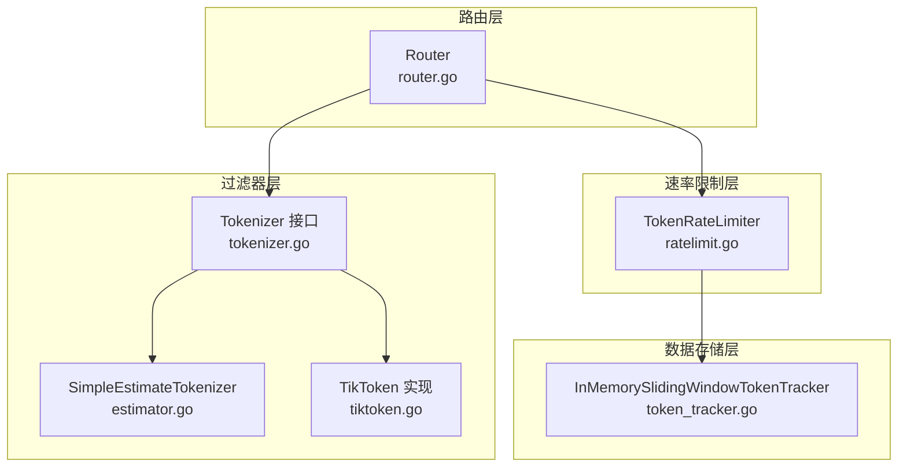
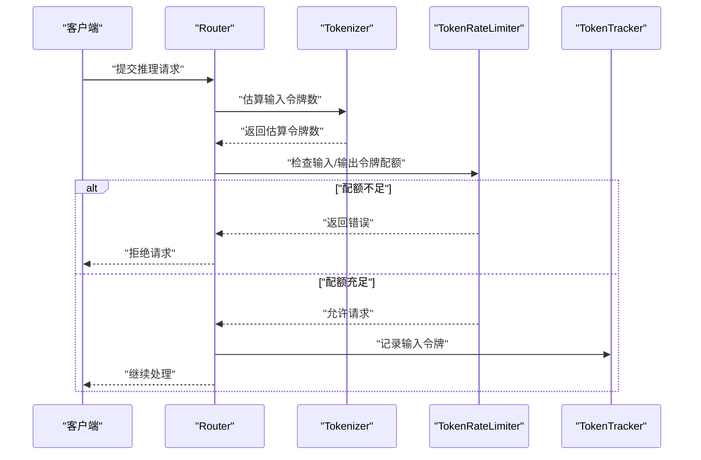
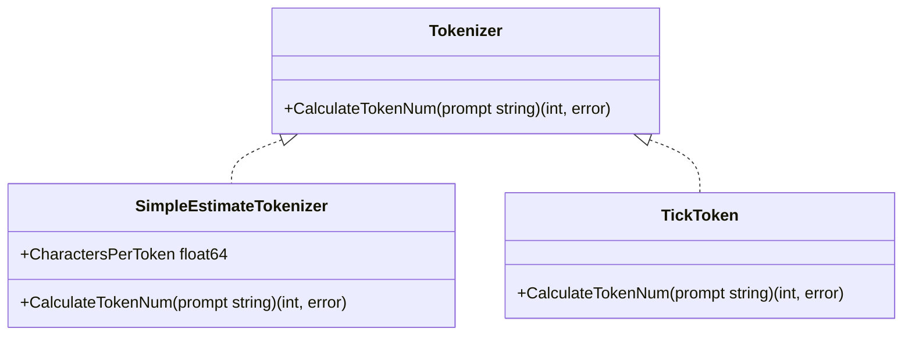
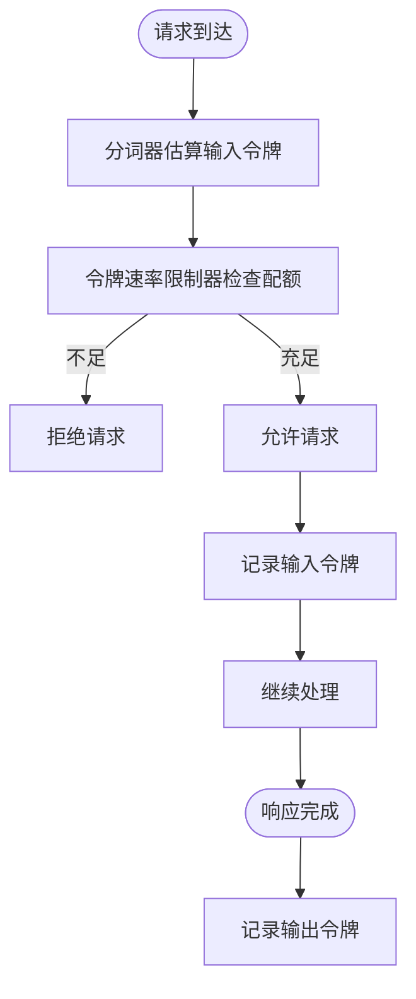
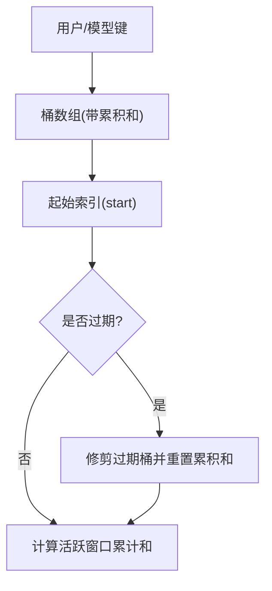
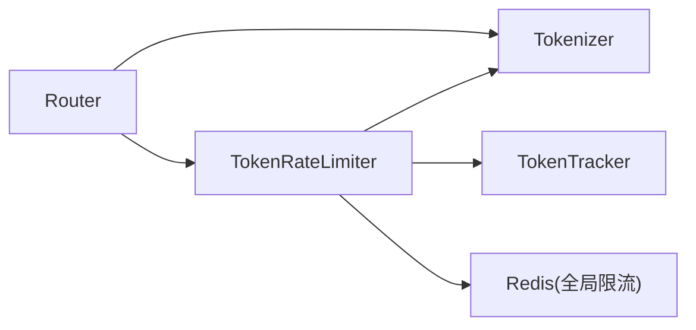

# 分词器过滤器

<cite>
**本文引用的文件**
- [tokenizer.go](file://pkg/kthena-router/filters/tokenizer/tokenizer.go)
- [estimator.go](file://pkg/kthena-router/filters/tokenizer/estimator.go)
- [tiktoken.go](file://pkg/kthena-router/filters/tokenizer/tiktoken.go)
- [estimator_test.go](file://pkg/kthena-router/filters/tokenizer/estimator_test.go)
- [ratelimit.go](file://pkg/kthena-router/filters/ratelimit/ratelimit.go)
- [router.go](file://pkg/kthena-router/router/router.go)
- [token_tracker.go](file://pkg/kthena-router/datastore/token_tracker.go)
- [token_tracker_test.go](file://pkg/kthena-router/datastore/token_tracker_test.go)
- [modelroute_types.go](file://pkg/apis/networking/v1alpha1/modelroute_types.go)
- [rate-limit.md](file://docs/kthena/docs/user-guide/rate-limit.md)
</cite>

## 目录
1. [简介](#简介)
2. [项目结构](#项目结构)
3. [核心组件](#核心组件)
4. [架构总览](#架构总览)
5. [组件详细分析](#组件详细分析)
6. [依赖关系分析](#依赖关系分析)
7. [性能考量](#性能考量)
8. [故障排查指南](#故障排查指南)
9. [结论](#结论)
10. [附录](#附录)

## 简介
本技术文档聚焦于“分词器过滤器”在速率限制中的作用，系统阐述以下内容：
- 输入/输出令牌的估算算法与准确性优化策略
- SimpleEstimateTokenizer 与 TikToken 的实现差异及适用场景
- 分词器配置指南（模型兼容性、分词精度与性能权衡）
- 分词结果对速率限制的影响（实时性与准确性保障）
- 性能优化建议与自定义分词器开发指南

## 项目结构
围绕分词器与速率限制的关键目录与文件如下：
- 过滤器层：分词器接口与两种实现（估算与 TikToken）
- 速率限制层：基于令牌数的本地/全局限流器
- 路由层：请求接入点，调用分词器进行预估并执行限流
- 数据存储层：滑动窗口令牌跟踪器，用于统计用户/模型维度的令牌消耗与请求数

图表来源
- [tokenizer.go:19-21](file://pkg/kthena-router/filters/tokenizer/tokenizer.go#L19-L21)
- [estimator.go:25-44](file://pkg/kthena-router/filters/tokenizer/estimator.go#L25-L44)
- [tiktoken.go:26-35](file://pkg/kthena-router/filters/tokenizer/tiktoken.go#L26-L35)
- [ratelimit.go:61-98](file://pkg/kthena-router/filters/ratelimit/ratelimit.go#L61-L98)
- [router.go:73-100](file://pkg/kthena-router/router/router.go#L73-L100)
- [token_tracker.go:56-110](file://pkg/kthena-router/datastore/token_tracker.go#L56-L110)

章节来源
- [tokenizer.go:19-21](file://pkg/kthena-router/filters/tokenizer/tokenizer.go#L19-L21)
- [estimator.go:25-44](file://pkg/kthena-router/filters/tokenizer/estimator.go#L25-L44)
- [tiktoken.go:26-35](file://pkg/kthena-router/filters/tokenizer/tiktoken.go#L26-L35)
- [ratelimit.go:61-98](file://pkg/kthena-router/filters/ratelimit/ratelimit.go#L61-L98)
- [router.go:73-100](file://pkg/kthena-router/router/router.go#L73-L100)
- [token_tracker.go:56-110](file://pkg/kthena-router/datastore/token_tracker.go#L56-L110)

## 核心组件
- 分词器接口与实现
  - 接口定义：统一的令牌数量计算方法
  - 简易估算实现：按字符/字符块估算令牌数，适合快速预估与低开销场景
  - TikToken 实现：基于官方 BPE 编码，提供更准确的令牌计数
- 令牌速率限制器
  - 支持本地与全局（Redis）两种模式
  - 预估输入令牌并进行准入检查；输出令牌在响应后记录
- 滑动窗口令牌跟踪器
  - 维护每个用户/模型在时间窗内的令牌累计与请求数
  - 提供高并发下的读写锁与惰性修剪机制
- 路由器
  - 在请求进入时调用分词器估算令牌，执行速率限制判断
  - 记录输入令牌指标，并在后续流程中更新输出令牌

章节来源
- [tokenizer.go:19-21](file://pkg/kthena-router/filters/tokenizer/tokenizer.go#L19-L21)
- [estimator.go:25-44](file://pkg/kthena-router/filters/tokenizer/estimator.go#L25-L44)
- [tiktoken.go:26-35](file://pkg/kthena-router/filters/tokenizer/tiktoken.go#L26-L35)
- [ratelimit.go:61-98](file://pkg/kthena-router/filters/ratelimit/ratelimit.go#L61-L98)
- [token_tracker.go:56-110](file://pkg/kthena-router/datastore/token_tracker.go#L56-L110)
- [router.go:73-100](file://pkg/kthena-router/router/router.go#L73-L100)

## 架构总览
下图展示从请求到限流与令牌统计的整体流程。

图表来源
- [router.go:263-292](file://pkg/kthena-router/router/router.go#L263-L292)
- [ratelimit.go:101-126](file://pkg/kthena-router/filters/ratelimit/ratelimit.go#L101-L126)
- [token_tracker.go:245-307](file://pkg/kthena-router/datastore/token_tracker.go#L245-L307)

## 组件详细分析

### 分词器接口与实现
- 接口设计
  - 统一的令牌估算入口，便于替换与扩展
- SimpleEstimateTokenizer
  - 基于字符/字符块估算令牌数，适合快速估算与低开销场景
  - 对空提示直接返回 0；字符数采用 Unicode rune 计数，避免字节误判
  - 当字符每令牌比值非正时返回错误
- TikToken
  - 使用官方 BPE 编码，提供更贴近真实模型的令牌计数
  - 通过离线加载器减少外部依赖风险
  - 错误时返回零计数并上抛错误

图表来源
- [tokenizer.go:19-21](file://pkg/kthena-router/filters/tokenizer/tokenizer.go#L19-L21)
- [estimator.go:25-44](file://pkg/kthena-router/filters/tokenizer/estimator.go#L25-L44)
- [tiktoken.go:26-35](file://pkg/kthena-router/filters/tokenizer/tiktoken.go#L26-L35)

章节来源
- [tokenizer.go:19-21](file://pkg/kthena-router/filters/tokenizer/tokenizer.go#L19-L21)
- [estimator.go:25-44](file://pkg/kthena-router/filters/tokenizer/estimator.go#L25-L44)
- [tiktoken.go:26-35](file://pkg/kthena-router/filters/tokenizer/tiktoken.go#L26-L35)
- [estimator_test.go:21-81](file://pkg/kthena-router/filters/tokenizer/estimator_test.go#L21-L81)

### 令牌估算算法与准确性优化
- 算法要点
  - SimpleEstimateTokenizer：以字符/字符块为单位估算令牌数，适合粗粒度预估与快速路径
  - TikToken：基于模型编码表进行精确编码，适合需要更高精度的场景
- 准确性优化策略
  - 在路由层对估算失败或异常进行降级回退（如使用默认估算）
  - 对 Unicode 文本使用 rune 计数，避免字节长度误判
  - 对于多语言混合文本，优先选择 TikToken 以提升准确性
- 复杂度与性能
  - SimpleEstimateTokenizer：O(n) 字符计数，常数级内存
  - TikToken：依赖外部编码表与 BPE 解码，开销相对较高但更准确

章节来源
- [estimator.go:35-44](file://pkg/kthena-router/filters/tokenizer/estimator.go#L35-L44)
- [tiktoken.go:28-35](file://pkg/kthena-router/filters/tokenizer/tiktoken.go#L28-L35)
- [estimator_test.go:21-81](file://pkg/kthena-router/filters/tokenizer/estimator_test.go#L21-L81)

### 速率限制与分词器集成
- 预估与准入
  - 路由器在接收请求时调用分词器估算输入令牌数
  - 令牌速率限制器根据模型维度检查输入/输出令牌配额
  - 若输出令牌可用额度不足，提前拒绝可能无法完成的请求
- 输出令牌记录
  - 请求完成后记录实际输出令牌数，用于后续统计与限流
- 全局与本地限流
  - 本地限流：基于进程内令牌桶，低延迟、低耦合
  - 全局限流：基于 Redis，跨实例一致的配额控制

图表来源
- [router.go:263-292](file://pkg/kthena-router/router/router.go#L263-L292)
- [ratelimit.go:101-137](file://pkg/kthena-router/filters/ratelimit/ratelimit.go#L101-L137)

章节来源
- [router.go:263-292](file://pkg/kthena-router/router/router.go#L263-L292)
- [ratelimit.go:101-137](file://pkg/kthena-router/filters/ratelimit/ratelimit.go#L101-L137)

### 滑动窗口令牌跟踪器
- 设计目标
  - 维护每个用户/模型在固定时间窗内的令牌累计与请求数
  - 支持高并发读写与惰性修剪，降低内存占用
- 关键特性
  - 时间窗大小与令牌权重可配置
  - 读路径采用读写锁，写路径仅在需要修剪时加锁
  - 对负令牌进行钳制，确保统计稳健性
- 复杂度
  - 读/写操作平均 O(1)，最坏 O(B_u)（B_u 为用户当前桶数）
  - 内存紧凑：超过半数桶被修剪时进行显式复制与重基

图表来源
- [token_tracker.go:56-110](file://pkg/kthena-router/datastore/token_tracker.go#L56-L110)
- [token_tracker.go:118-156](file://pkg/kthena-router/datastore/token_tracker.go#L118-L156)
- [token_tracker.go:158-192](file://pkg/kthena-router/datastore/token_tracker.go#L158-L192)
- [token_tracker.go:194-307](file://pkg/kthena-router/datastore/token_tracker.go#L194-L307)

章节来源
- [token_tracker.go:56-110](file://pkg/kthena-router/datastore/token_tracker.go#L56-L110)
- [token_tracker.go:118-156](file://pkg/kthena-router/datastore/token_tracker.go#L118-L156)
- [token_tracker.go:158-192](file://pkg/kthena-router/datastore/token_tracker.go#L158-L192)
- [token_tracker.go:194-307](file://pkg/kthena-router/datastore/token_tracker.go#L194-L307)
- [token_tracker_test.go:54-93](file://pkg/kthena-router/datastore/token_tracker_test.go#L54-L93)
- [token_tracker_test.go:257-294](file://pkg/kthena-router/datastore/token_tracker_test.go#L257-L294)
- [token_tracker_test.go:296-391](file://pkg/kthena-router/datastore/token_tracker_test.go#L296-L391)
- [token_tracker_test.go:523-566](file://pkg/kthena-router/datastore/token_tracker_test.go#L523-L566)
- [token_tracker_test.go:641-663](file://pkg/kthena-router/datastore/token_tracker_test.go#L641-L663)

### 分词器配置指南
- 模型兼容性
  - SimpleEstimateTokenizer：适用于所有模型的通用估算
  - TikToken：需与模型使用的编码表匹配，建议优先用于主流开源模型
- 分词精度与性能权衡
  - 精度优先：TikToken 更贴近真实模型编码
  - 性能优先：SimpleEstimateTokenizer 开销更低，适合高吞吐预估
- 配置项与示例
  - 模型维度的速率限制参数（输入/输出令牌/单位），支持本地或全局模式
  - 全局模式需提供 Redis 地址，确保跨实例一致性

章节来源
- [modelroute_types.go:122-148](file://pkg/apis/networking/v1alpha1/modelroute_types.go#L122-L148)
- [rate-limit.md:131-164](file://docs/kthena/docs/user-guide/rate-limit.md#L131-L164)

## 依赖关系分析
- 组件耦合
  - Router 依赖 Tokenizer 与 TokenRateLimiter
  - TokenRateLimiter 依赖 Tokenizer 与 TokenTracker（滑动窗口）
- 外部依赖
  - TikToken 依赖官方 BPE 编码与加载器
  - 全局限流依赖 Redis 客户端
- 循环依赖
  - 未发现循环依赖，模块边界清晰

图表来源
- [router.go:73-100](file://pkg/kthena-router/router/router.go#L73-L100)
- [ratelimit.go:61-98](file://pkg/kthena-router/filters/ratelimit/ratelimit.go#L61-L98)
- [token_tracker.go:56-110](file://pkg/kthena-router/datastore/token_tracker.go#L56-L110)

章节来源
- [router.go:73-100](file://pkg/kthena-router/router/router.go#L73-L100)
- [ratelimit.go:61-98](file://pkg/kthena-router/filters/ratelimit/ratelimit.go#L61-L98)
- [token_tracker.go:56-110](file://pkg/kthena-router/datastore/token_tracker.go#L56-L110)

## 性能考量
- 分词器性能
  - SimpleEstimateTokenizer：O(n) 字符计数，适合高频预估
  - TikToken：BPE 编码开销较高，建议在需要高精度时使用
- 速率限制器性能
  - 本地限流：低延迟、无网络抖动
  - 全局限流：Redis 网络往返带来额外延迟，建议合理设置连接池与超时
- 令牌跟踪器性能
  - 读写锁分离，惰性修剪降低写放大
  - 并发读写场景下，尽量避免频繁小批量更新，合并写入可提升吞吐

## 故障排查指南
- 常见问题
  - 分词器估算异常：检查字符每令牌比值是否为正；必要时降级为默认估算
  - TikToken 加载失败：确认离线加载器可用与编码表存在
  - 全局限流连接失败：检查 Redis 地址与网络连通性
  - 令牌统计不准确：核对时间窗大小与令牌权重配置
- 关键日志与指标
  - 路由层记录“输入令牌数”与“速率限制超出类型”
  - 令牌跟踪器提供请求计数与令牌累计，便于定位异常

章节来源
- [router.go:263-292](file://pkg/kthena-router/router/router.go#L263-L292)
- [ratelimit.go:101-137](file://pkg/kthena-router/filters/ratelimit/ratelimit.go#L101-L137)
- [token_tracker.go:194-307](file://pkg/kthena-router/datastore/token_tracker.go#L194-L307)
- [rate-limit.md:131-164](file://docs/kthena/docs/user-guide/rate-limit.md#L131-L164)

## 结论
- 分词器在速率限制中承担“预估—准入—记录”的关键角色
- SimpleEstimateTokenizer 与 TikToken 各有侧重：前者追求性能与通用性，后者追求精度与模型契合度
- 通过滑动窗口令牌跟踪器与本地/全局限流器，系统实现了高并发、可扩展且可审计的令牌管理
- 建议在生产环境中结合业务特征选择合适的分词器与限流模式，并持续监控令牌统计与限流命中率

## 附录
- 自定义分词器开发指南
  - 实现统一接口，确保幂等与线程安全
  - 明确错误传播策略，提供降级回退方案
  - 对外部依赖（如模型编码表）进行容错与缓存
  - 编写单元测试覆盖边界条件（空提示、负权重、Unicode 文本等）