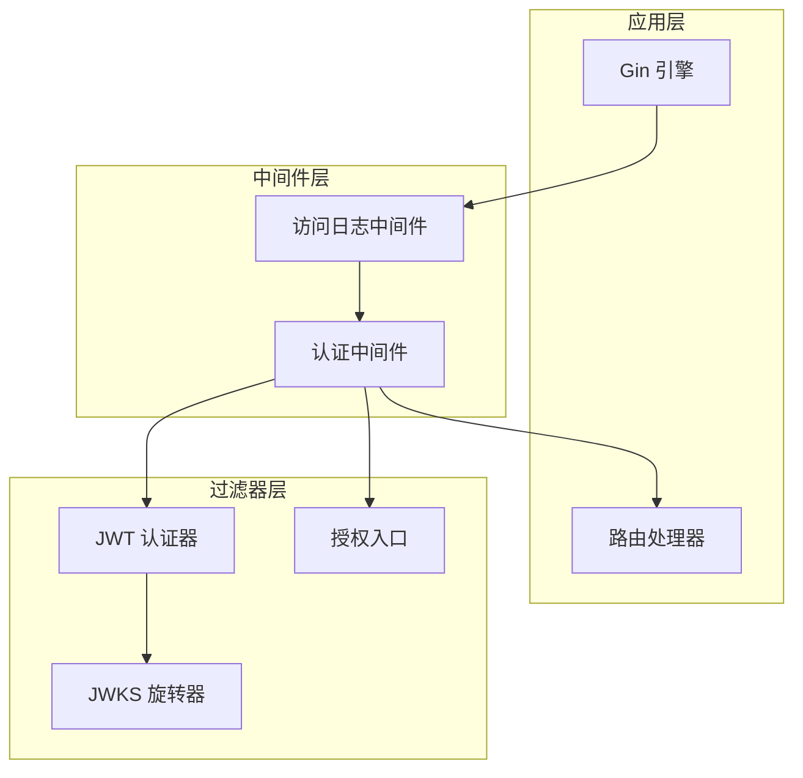
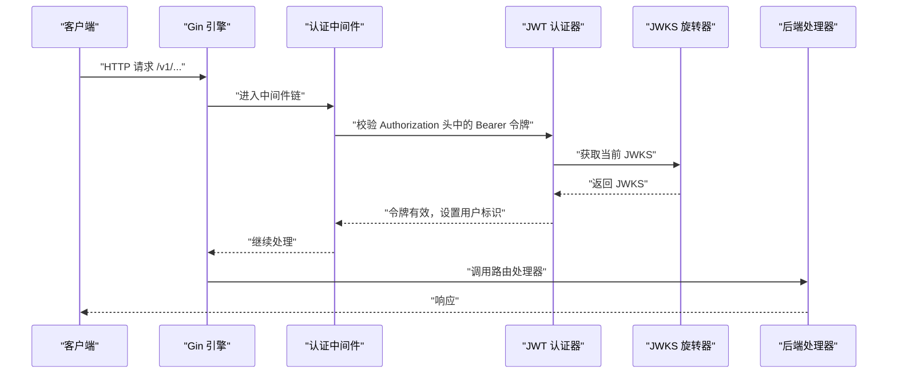
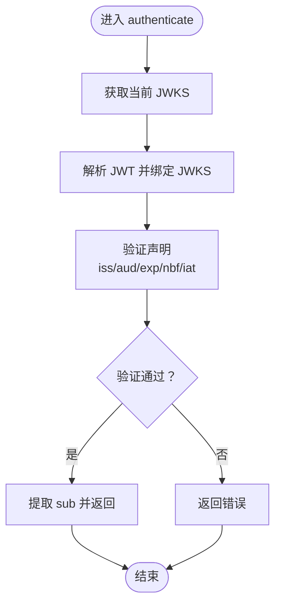
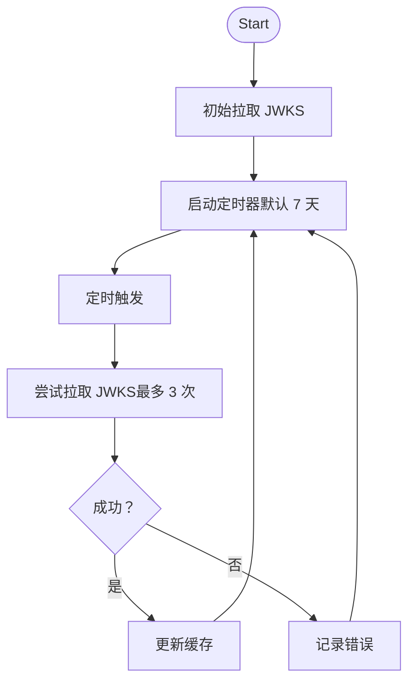
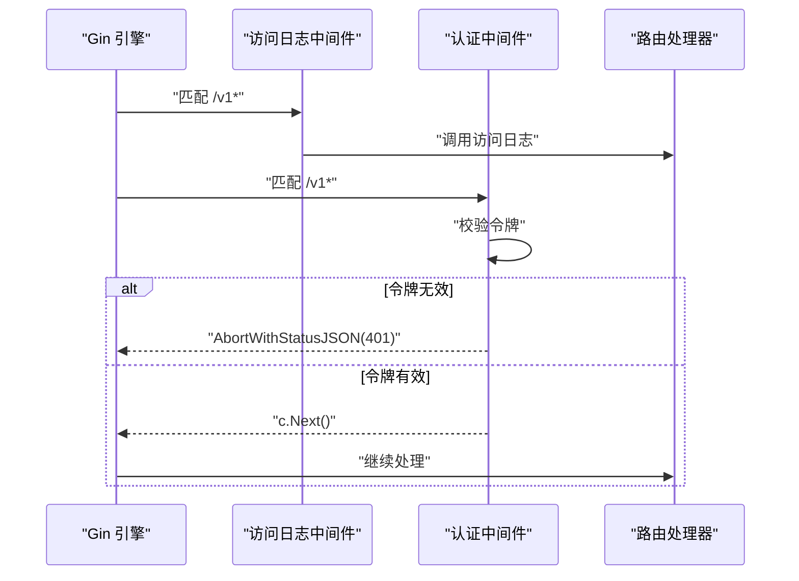
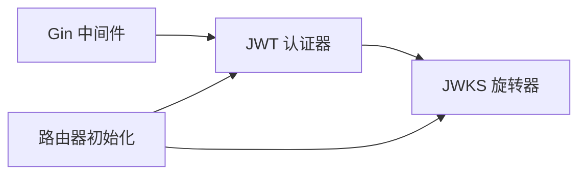

# 认证授权过滤器

<cite>
**本文引用的文件**
- [authentication.go](file://pkg/kthena-router/filters/auth/authentication.go)
- [jwt.go](file://pkg/kthena-router/filters/auth/jwt.go)
- [authorization.go](file://pkg/kthena-router/filters/auth/authorization.go)
- [router.go](file://cmd/kthena-router/app/router.go)
- [router.go](file://pkg/kthena-router/router/router.go)
- [config-router.md](file://docs/kthena/docs/user-guide/config-router.md)
- [router-observability.md](file://docs/kthena/docs/user-guide/router-observability.md)
</cite>

## 目录
1. [简介](#简介)
2. [项目结构](#项目结构)
3. [核心组件](#核心组件)
4. [架构总览](#架构总览)
5. [详细组件分析](#详细组件分析)
6. [依赖关系分析](#依赖关系分析)
7. [性能考量](#性能考量)
8. [故障排除指南](#故障排除指南)
9. [结论](#结论)
10. [附录](#附录)

## 简介
本技术文档围绕 Kthena Router 的认证授权过滤器展开，重点覆盖以下方面：
- JWT 认证机制：令牌解析、签名验证与过期检查流程
- 授权过滤器：当前实现中的授权入口与策略现状
- 认证中间件配置：密钥管理（JWKS）、令牌颁发方与受众、刷新机制
- 安全最佳实践：HTTPS 要求、令牌存储与传输安全、权限最小化
- 常见认证场景示例与故障排除

## 项目结构
认证授权相关代码主要位于 kthena-router 子模块中，采用分层设计：
- 过滤器层：提供 JWT 认证与授权入口（当前授权逻辑为空）
- 中间件层：在 HTTP 路由器中注入 Gin 中间件
- 配置层：通过 ConfigMap 提供认证参数（issuer、audiences、jwksUri）

图表来源
- [router.go:245-260](file://cmd/kthena-router/app/router.go#L245-L260)
- [authentication.go:50-73](file://pkg/kthena-router/filters/auth/authentication.go#L50-L73)
- [jwt.go:45-78](file://pkg/kthena-router/filters/auth/jwt.go#L45-L78)
- [authorization.go:23-24](file://pkg/kthena-router/filters/auth/authorization.go#L23-L24)

章节来源
- [router.go:245-260](file://cmd/kthena-router/app/router.go#L245-L260)
- [router.go:156-168](file://pkg/kthena-router/router/router.go#L156-L168)

## 核心组件
- JWTAuthenticator：负责从请求头提取 Bearer 令牌，使用 JWKS 验证签名与关键声明（iss、aud、exp、nbf、iat），并将用户标识写入上下文
- JWKSRotator：周期性从 jwksUri 拉取 JWKS 并缓存，支持停止与并发安全读取
- Gin 中间件：在 /v1 路径组启用访问日志与认证中间件
- 授权入口：当前为空实现，保留扩展点

章节来源
- [authentication.go:50-102](file://pkg/kthena-router/filters/auth/authentication.go#L50-L102)
- [jwt.go:45-85](file://pkg/kthena-router/filters/auth/jwt.go#L45-L85)
- [authorization.go:23-24](file://pkg/kthena-router/filters/auth/authorization.go#L23-L24)
- [router.go:653-669](file://cmd/kthena-router/app/router.go#L653-L669)

## 架构总览
下图展示从客户端到后端处理的整体调用链，以及认证中间件在其中的位置。

图表来源
- [router.go:653-669](file://cmd/kthena-router/app/router.go#L653-L669)
- [authentication.go:311-330](file://pkg/kthena-router/filters/auth/authentication.go#L311-L330)
- [jwt.go:80-85](file://pkg/kthena-router/filters/auth/jwt.go#L80-L85)

## 详细组件分析

### JWT 认证器（JWTAuthenticator）
- 功能要点
  - 从 Authorization 头提取 Bearer 令牌
  - 使用 JWKS 验证签名与算法推断
  - 校验关键声明：iss、aud（可选）、exp、nbf、iat
  - 将用户标识（sub）写入上下文，供后续处理器使用
- 关键流程
  - 解析令牌 -> 获取 JWKS -> 验证签名 -> 验证声明 -> 设置上下文

图表来源
- [authentication.go:82-118](file://pkg/kthena-router/filters/auth/authentication.go#L82-L118)
- [authentication.go:104-284](file://pkg/kthena-router/filters/auth/authentication.go#L104-L284)

章节来源
- [authentication.go:44-48](file://pkg/kthena-router/filters/auth/authentication.go#L44-L48)
- [authentication.go:82-118](file://pkg/kthena-router/filters/auth/authentication.go#L82-L118)
- [authentication.go:172-284](file://pkg/kthena-router/filters/auth/authentication.go#L172-L284)

### JWKS 旋转器（JWKSRotator）
- 功能要点
  - 初始化时拉取一次 JWKS
  - 后台定时轮询刷新（默认 7 天）
  - 支持最大重试次数（默认 3 次）
  - 提供并发安全的读取接口
- 关键流程
  - 启动 -> 初始拉取 -> 定时循环 -> 拉取失败重试 -> 更新缓存

图表来源
- [jwt.go:63-104](file://pkg/kthena-router/filters/auth/jwt.go#L63-L104)
- [jwt.go:106-143](file://pkg/kthena-router/filters/auth/jwt.go#L106-L143)

章节来源
- [jwt.go:45-85](file://pkg/kthena-router/filters/auth/jwt.go#L45-L85)
- [jwt.go:106-143](file://pkg/kthena-router/filters/auth/jwt.go#L106-L143)

### 授权过滤器（Authorize）
- 当前状态：授权入口函数存在但未实现具体逻辑
- 建议：结合用户标识与资源权限模型扩展授权策略（如基于角色或路径的 ACL）

章节来源
- [authorization.go:23-24](file://pkg/kthena-router/filters/auth/authorization.go#L23-L24)

### 认证中间件集成
- 在 /v1 路径组启用访问日志与认证中间件
- 认证中间件仅对 /v1 前缀生效
- 认证失败时返回 401，并终止后续处理

图表来源
- [router.go:640-669](file://cmd/kthena-router/app/router.go#L640-L669)

章节来源
- [router.go:245-260](file://cmd/kthena-router/app/router.go#L245-L260)
- [router.go:640-669](file://cmd/kthena-router/app/router.go#L640-L669)

## 依赖关系分析
- 组件耦合
  - Gin 中间件依赖 JWT 认证器
  - JWT 认证器依赖 JWKS 旋转器
  - 路由初始化阶段创建认证器并注入到路由器
- 外部依赖
  - jwx/jwt/jws：JWT 解析与密钥集验证
  - Gin：HTTP 中间件与上下文
  - Kubernetes ConfigMap：认证配置来源

图表来源
- [router.go:156-168](file://pkg/kthena-router/router/router.go#L156-L168)
- [authentication.go:56-73](file://pkg/kthena-router/filters/auth/authentication.go#L56-L73)
- [jwt.go:54-61](file://pkg/kthena-router/filters/auth/jwt.go#L54-L61)

章节来源
- [router.go:156-168](file://pkg/kthena-router/router/router.go#L156-L168)
- [authentication.go:56-73](file://pkg/kthena-router/filters/auth/authentication.go#L56-L73)
- [jwt.go:54-61](file://pkg/kthena-router/filters/auth/jwt.go#L54-L61)

## 性能考量
- JWKS 刷新频率：默认每周刷新一次，降低网络与解析开销
- 并发安全：JWKS 缓存使用读写锁保护，避免竞态
- 令牌解析：使用算法自动推断，减少显式配置复杂度
- 建议
  - 对于高并发场景，建议评估刷新间隔与重试策略
  - 结合上游缓存与本地预热，进一步降低延迟

## 故障排除指南
- 常见问题与定位
  - 无 JWKS 或刷新失败：检查 jwksUri 可达性与格式；确认旋转器是否正常运行
  - 令牌缺失或格式错误：确认客户端是否正确携带 Authorization: Bearer <token>
  - 声明校验失败：核对 issuer、audiences 是否与签发方一致；检查 exp/nbf/iat 时间戳
  - HTTPS 配置：若启用 TLS，需同时提供证书与私钥文件
- 参考配置
  - 认证配置示例：参见用户指南中的 ConfigMap 示例
  - 访问日志配置：可通过环境变量或 ConfigMap 控制格式与输出

章节来源
- [config-router.md:99-152](file://docs/kthena/docs/user-guide/config-router.md#L99-L152)
- [router-observability.md:94-118](file://docs/kthena/docs/user-guide/router-observability.md#L94-L118)
- [router.go:271-286](file://cmd/kthena-router/app/router.go#L271-L286)

## 结论
本认证授权过滤器以 Gin 中间件为核心，结合 JWKS 旋转与严格声明校验，提供了可扩展的 JWT 认证能力。授权策略目前预留扩展点，建议结合业务需求完善 ACL 与细粒度权限控制。通过合理的配置与监控，可在保证安全性的同时兼顾性能与可观测性。

## 附录

### 配置项与最佳实践
- 认证配置（来自 ConfigMap）
  - issuer：期望的签发方
  - audiences：期望的受众列表（可选）
  - jwksUri：JWKS 提供地址
- 最佳实践
  - 强制 HTTPS：确保传输安全
  - 令牌存储：客户端侧避免持久化明文令牌；服务端仅在内存中使用
  - 权限最小化：基于角色或资源的最小授权原则
  - 审计与日志：开启结构化访问日志，便于追踪与合规

章节来源
- [config-router.md:37-46](file://docs/kthena/docs/user-guide/config-router.md#L37-L46)
- [config-router.md:99-152](file://docs/kthena/docs/user-guide/config-router.md#L99-L152)
- [router-observability.md:94-118](file://docs/kthena/docs/user-guide/router-observability.md#L94-L118)