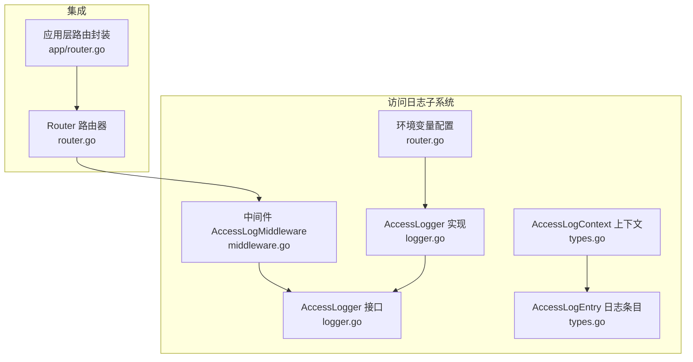
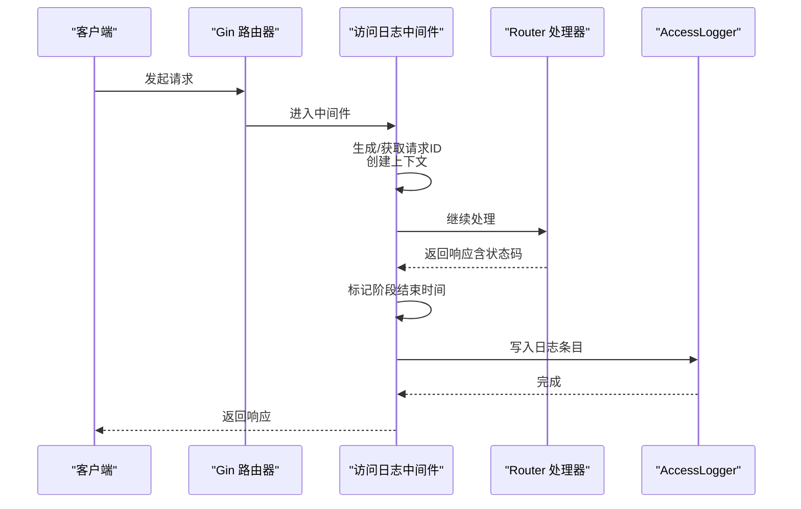
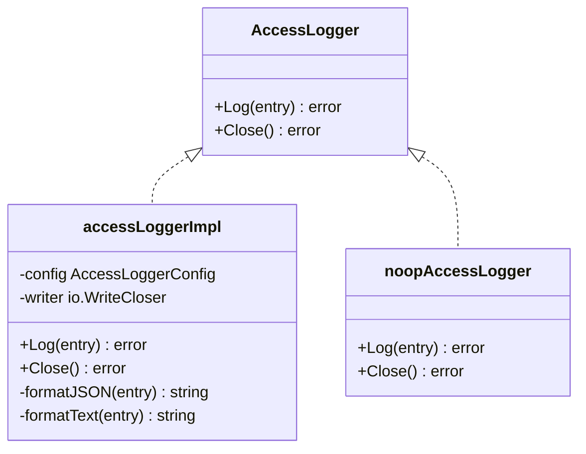
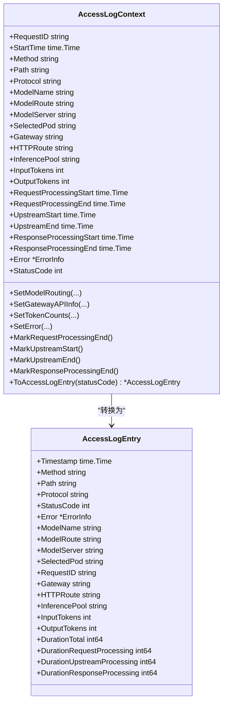
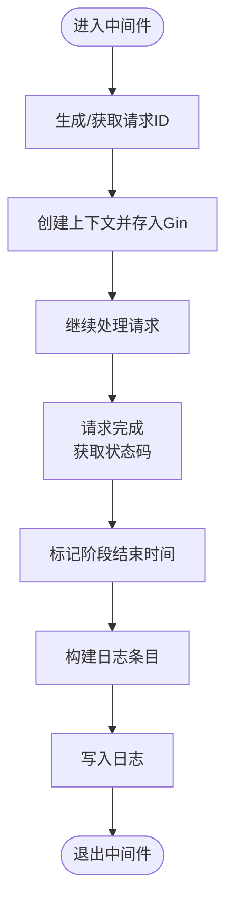
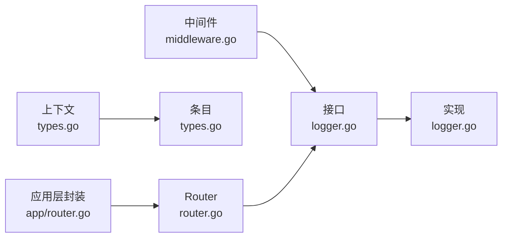

# 访问日志系统

<cite>
**本文档引用的文件**
- [logger.go](file://pkg/kthena-router/accesslog/logger.go)
- [middleware.go](file://pkg/kthena-router/accesslog/middleware.go)
- [types.go](file://pkg/kthena-router/accesslog/types.go)
- [logger_test.go](file://pkg/kthena-router/accesslog/logger_test.go)
- [router.go](file://pkg/kthena-router/router/router.go)
- [router-access-log-fields.md](file://docs/kthena/docs/reference/router-access-log-fields.md)
- [router.go](file://cmd/kthena-router/app/router.go)
</cite>

## 目录
1. [简介](#简介)
2. [项目结构](#项目结构)
3. [核心组件](#核心组件)
4. [架构总览](#架构总览)
5. [详细组件分析](#详细组件分析)
6. [依赖关系分析](#依赖关系分析)
7. [性能考量](#性能考量)
8. [故障排查指南](#故障排查指南)
9. [结论](#结论)
10. [附录](#附录)

## 简介
本技术文档围绕 Kthena Router 的访问日志系统进行深入解析，涵盖日志中间件的实现架构、日志记录生命周期与请求处理流程、日志字段定义与含义、配置选项（日志级别、输出格式、性能影响控制）、日志分析与监控最佳实践，以及性能调优与故障诊断方法。目标是帮助开发者与运维人员高效理解并正确使用访问日志能力。

## 项目结构
访问日志系统主要由以下模块组成：
- 访问日志接口与实现：负责日志条目的格式化与输出（支持 JSON 与文本两种格式）
- 中间件：在 Gin 请求链路中注入上下文、标记时间点、收集状态码，并在请求完成后写入日志
- 数据模型：定义访问日志条目与上下文结构，用于承载请求元数据、路由信息、令牌统计与耗时分解
- 集成层：在 Router 初始化阶段读取环境变量配置，创建日志器并挂载到 Gin 路由器
- 文档参考：提供字段参考、示例与配置说明

图表来源
- [logger.go:28-136](file://pkg/kthena-router/accesslog/logger.go#L28-L136)
- [types.go:23-97](file://pkg/kthena-router/accesslog/types.go#L23-L97)
- [middleware.go:30-63](file://pkg/kthena-router/accesslog/middleware.go#L30-L63)
- [router.go:125-154](file://pkg/kthena-router/router/router.go#L125-L154)
- [router.go:640-651](file://cmd/kthena-router/app/router.go#L640-L651)

章节来源
- [logger.go:28-136](file://pkg/kthena-router/accesslog/logger.go#L28-L136)
- [types.go:23-97](file://pkg/kthena-router/accesslog/types.go#L23-L97)
- [middleware.go:30-63](file://pkg/kthena-router/accesslog/middleware.go#L30-L63)
- [router.go:125-154](file://pkg/kthena-router/router/router.go#L125-L154)
- [router.go:640-651](file://cmd/kthena-router/app/router.go#L640-L651)

## 核心组件
- 访问日志接口与实现
  - 接口定义了日志写入与关闭能力
  - 支持 JSON 与文本两种输出格式
  - 支持 stdout/stderr/file 输出路径
  - 当禁用或配置为空时返回无操作实现
- 访问日志上下文与条目
  - 上下文记录请求元数据、路由信息、令牌统计与各阶段时间戳
  - 条目为最终序列化的日志对象，包含标准 HTTP 字段、错误信息、AI 特定字段、令牌与耗时分解
- 中间件
  - 在请求进入时生成或复用请求 ID，创建上下文并存入 Gin 上下文
  - 在请求完成时从上下文生成日志条目并写入
  - 提供设置模型名、路由信息、令牌数、错误、以及标记各阶段时间点的辅助函数
- 集成与配置
  - Router 初始化时读取环境变量 ACCESS_LOG_ENABLED/FORMAT/OUTPUT
  - 创建日志器并暴露 AccessLog 方法供路由挂载
  - 应用层封装仅对特定路径（如 /v1/）启用访问日志

章节来源
- [logger.go:28-136](file://pkg/kthena-router/accesslog/logger.go#L28-L136)
- [types.go:23-97](file://pkg/kthena-router/accesslog/types.go#L23-L97)
- [middleware.go:30-138](file://pkg/kthena-router/accesslog/middleware.go#L30-L138)
- [router.go:125-154](file://pkg/kthena-router/router/router.go#L125-L154)
- [router.go:640-651](file://cmd/kthena-router/app/router.go#L640-L651)

## 架构总览
访问日志系统通过中间件在请求生命周期的关键节点采集数据，最终由日志器统一格式化输出。整体流程如下：

图表来源
- [middleware.go:30-63](file://pkg/kthena-router/accesslog/middleware.go#L30-L63)
- [router.go:204-315](file://pkg/kthena-router/router/router.go#L204-L315)
- [logger.go:100-128](file://pkg/kthena-router/accesslog/logger.go#L100-L128)

## 详细组件分析

### 访问日志接口与实现
- 接口与实现
  - 接口定义 Log 与 Close 方法
  - 实现支持 JSON 与文本格式输出
  - 输出目标支持 stdout/stderr/文件路径
  - 禁用时返回无操作实现
- 性能与可靠性
  - 文本格式采用字符串拼接，JSON 使用序列化
  - 文件输出在关闭时才真正关闭句柄
  - 写入失败会返回错误，便于上层感知

图表来源
- [logger.go:28-32](file://pkg/kthena-router/accesslog/logger.go#L28-L32)
- [logger.go:63-67](file://pkg/kthena-router/accesslog/logger.go#L63-L67)
- [logger.go:100-136](file://pkg/kthena-router/accesslog/logger.go#L100-L136)
- [logger.go:210-220](file://pkg/kthena-router/accesslog/logger.go#L210-L220)

章节来源
- [logger.go:28-136](file://pkg/kthena-router/accesslog/logger.go#L28-L136)
- [logger_test.go:235-269](file://pkg/kthena-router/accesslog/logger_test.go#L235-L269)

### 访问日志上下文与条目
- 上下文
  - 记录请求元数据、模型名、路由信息、选择的 Pod、请求 ID
  - 记录令牌输入/输出数量
  - 记录各阶段时间戳（请求处理、上游处理、响应处理）
  - 提供设置路由信息、令牌数、错误、标记阶段结束的方法
- 条目
  - 将上下文转换为最终日志条目，计算总耗时与各阶段耗时
  - 包含标准 HTTP 字段、错误信息、AI 特定字段、令牌与耗时分解

图表来源
- [types.go:64-97](file://pkg/kthena-router/accesslog/types.go#L64-L97)
- [types.go:169-223](file://pkg/kthena-router/accesslog/types.go#L169-L223)

章节来源
- [types.go:64-223](file://pkg/kthena-router/accesslog/types.go#L64-L223)
- [logger_test.go:174-233](file://pkg/kthena-router/accesslog/logger_test.go#L174-L233)

### 中间件与生命周期
- 生命周期
  - 请求进入：生成或复用请求 ID，创建上下文并存入 Gin 上下文
  - 请求处理：业务处理器可调用辅助函数设置模型名、路由信息、令牌数、错误
  - 阶段标记：在请求处理、上游处理、响应处理阶段分别标记开始/结束时间
  - 请求完成：根据状态码生成日志条目并写入
- 辅助函数
  - 设置模型名、路由信息、Gateway API 信息、令牌数、错误
  - 标记各阶段结束时间

图表来源
- [middleware.go:30-63](file://pkg/kthena-router/accesslog/middleware.go#L30-L63)
- [types.go:147-167](file://pkg/kthena-router/accesslog/types.go#L147-L167)
- [types.go:169-223](file://pkg/kthena-router/accesslog/types.go#L169-L223)

章节来源
- [middleware.go:30-138](file://pkg/kthena-router/accesslog/middleware.go#L30-L138)
- [types.go:147-223](file://pkg/kthena-router/accesslog/types.go#L147-L223)

### 配置与集成
- 环境变量
  - ACCESS_LOG_ENABLED：启用/禁用访问日志
  - ACCESS_LOG_FORMAT：日志格式（json/text）
  - ACCESS_LOG_OUTPUT：输出位置（stdout/stderr/文件路径）
- Router 初始化
  - 读取环境变量并创建日志器
  - 暴露 AccessLog 方法供路由挂载
- 应用层封装
  - 仅对 /v1/ 路径启用访问日志中间件

章节来源
- [router.go:125-154](file://pkg/kthena-router/router/router.go#L125-L154)
- [router.go:640-651](file://cmd/kthena-router/app/router.go#L640-L651)
- [router-access-log-fields.md:168-175](file://docs/kthena/docs/reference/router-access-log-fields.md#L168-L175)

## 依赖关系分析
- 组件耦合
  - 中间件依赖日志器接口，解耦具体实现
  - 上下文与条目为纯数据结构，低耦合
  - Router 通过接口持有日志器，便于替换实现
- 外部依赖
  - Gin 作为 Web 框架，中间件在请求链路中执行
  - klog 用于日志器写入失败时的错误记录
- 可能的循环依赖
  - 未发现直接循环依赖；接口分离避免了循环

图表来源
- [middleware.go:30-63](file://pkg/kthena-router/accesslog/middleware.go#L30-L63)
- [logger.go:28-136](file://pkg/kthena-router/accesslog/logger.go#L28-L136)
- [types.go:64-223](file://pkg/kthena-router/accesslog/types.go#L64-L223)
- [router.go:125-154](file://pkg/kthena-router/router/router.go#L125-L154)
- [router.go:640-651](file://cmd/kthena-router/app/router.go#L640-L651)

章节来源
- [middleware.go:30-63](file://pkg/kthena-router/accesslog/middleware.go#L30-L63)
- [logger.go:28-136](file://pkg/kthena-router/accesslog/logger.go#L28-L136)
- [types.go:64-223](file://pkg/kthena-router/accesslog/types.go#L64-L223)
- [router.go:125-154](file://pkg/kthena-router/router/router.go#L125-L154)
- [router.go:640-651](file://cmd/kthena-router/app/router.go#L640-L651)

## 性能考量
- 日志格式选择
  - JSON 更利于结构化采集与分析，文本更易读但解析成本略高
- 输出目标
  - stdout/stderr 直接由进程标准流输出，延迟较低
  - 文件输出需考虑磁盘 I/O 与日志轮转，建议配合外部日志代理
- 时间戳与耗时
  - 各阶段时间戳精确到纳秒级，最终耗时以毫秒展示，开销极小
- 中间件挂载范围
  - 应用层仅对 /v1/ 路径启用，减少无关请求的日志开销
- 错误处理
  - 写入失败通过 klog 记录错误，不影响主请求链路

章节来源
- [logger.go:100-128](file://pkg/kthena-router/accesslog/logger.go#L100-L128)
- [router.go:640-651](file://cmd/kthena-router/app/router.go#L640-L651)
- [types.go:169-223](file://pkg/kthena-router/accesslog/types.go#L169-L223)

## 故障排查指南
- 常见问题
  - 日志未输出：检查 ACCESS_LOG_ENABLED 是否为 true
  - 格式异常：确认 ACCESS_LOG_FORMAT 为 json 或 text
  - 文件无法写入：检查 ACCESS_LOG_OUTPUT 的文件路径权限与存在性
  - 中间件未生效：确认路由已挂载 AccessLog 中间件且匹配路径
- 定位步骤
  - 查看启动日志中的环境变量解析与日志器创建结果
  - 在中间件入口与出口处增加最小化日志，验证是否进入与退出
  - 对于 JSON/文本格式差异，优先使用 JSON 便于结构化分析
- 监控与告警
  - 结合 Prometheus/Grafana 监控 Router 的请求量与错误率，结合访问日志定位异常模式

章节来源
- [router.go:125-154](file://pkg/kthena-router/router/router.go#L125-L154)
- [logger.go:70-98](file://pkg/kthena-router/accesslog/logger.go#L70-L98)
- [router.go:640-651](file://cmd/kthena-router/app/router.go#L640-L651)

## 结论
访问日志系统通过清晰的接口设计与中间件机制，实现了对 AI 推理请求的全生命周期观测。其结构化的字段与分阶段耗时统计，为性能分析、容量规划与故障定位提供了坚实基础。通过合理的配置与集成策略，可在保证可观测性的同时控制性能开销。

## 附录

### 日志字段定义与含义
- 标准 HTTP 字段
  - timestamp：ISO 8601 时间戳
  - method：HTTP 方法
  - path：请求路径
  - protocol：协议版本
  - status_code：响应状态码
- 错误信息
  - error.type：错误类型
  - error.message：错误消息
- AI 特定字段
  - model_name：请求模型名
  - model_route：使用的 ModelRoute 资源
  - model_server：处理请求的 ModelServer
  - selected_pod：实际处理推理的 Pod 名称
  - request_id：请求唯一标识
- Gateway API / Inference Extension 字段
  - gateway：Gateway 名称
  - http_route：HTTPRoute 名称
  - inference_pool：InferencePool 名称
- 令牌信息
  - input_tokens：输入令牌数
  - output_tokens：输出令牌数
- 耗时分解（毫秒）
  - duration_total：总耗时
  - duration_request_processing：请求处理耗时
  - duration_upstream_processing：上游处理耗时
  - duration_response_processing：响应处理耗时

章节来源
- [router-access-log-fields.md:27-175](file://docs/kthena/docs/reference/router-access-log-fields.md#L27-L175)
- [types.go:23-56](file://pkg/kthena-router/accesslog/types.go#L23-L56)

### 配置选项
- ACCESS_LOG_ENABLED：启用/禁用访问日志
- ACCESS_LOG_FORMAT：日志格式（json/text）
- ACCESS_LOG_OUTPUT：输出位置（stdout/stderr/文件路径）

章节来源
- [router-access-log-fields.md:168-175](file://docs/kthena/docs/reference/router-access-log-fields.md#L168-L175)
- [router.go:125-154](file://pkg/kthena-router/router/router.go#L125-L154)

### 最佳实践
- 日志聚合
  - 使用 JSON 格式便于结构化采集与索引
  - 将 stdout/stderr 交由容器日志代理统一收集
- 查询优化
  - 为常用过滤字段建立索引（如 model_name、status_code、gateway、http_route）
  - 利用时间戳进行范围查询与趋势分析
- 存储策略
  - 按天切分日志文件，保留 30-90 天滚动窗口
  - 对高频字段进行采样或降噪，降低存储压力
- 监控与告警
  - 关注错误类型分布与错误率变化
  - 建立耗时分位数（P50/P95/P99）监控，识别性能退化

章节来源
- [router-access-log-fields.md:100-175](file://docs/kthena/docs/reference/router-access-log-fields.md#L100-L175)