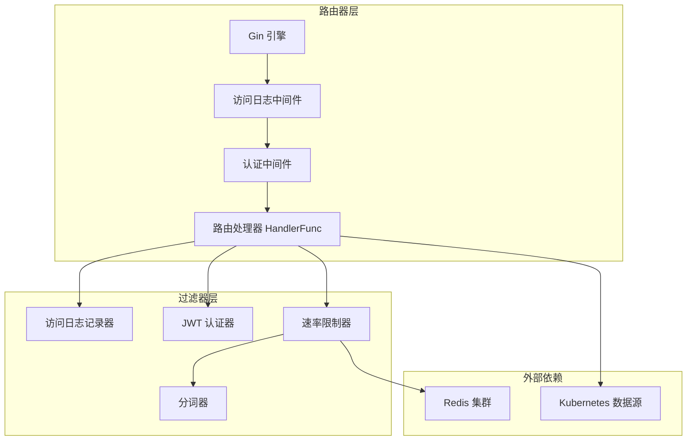
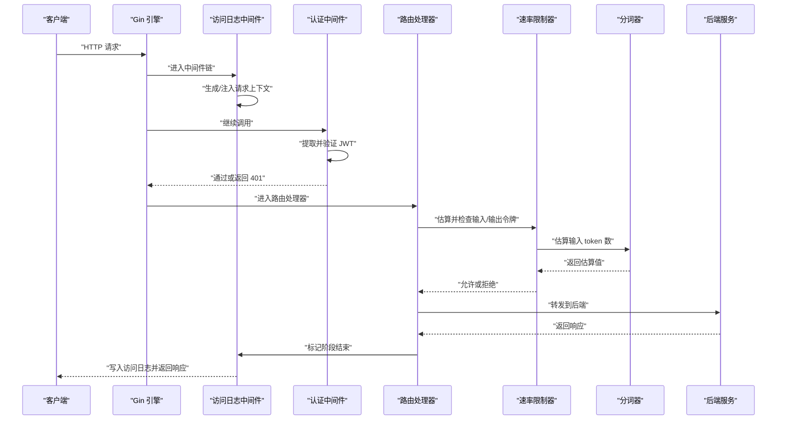
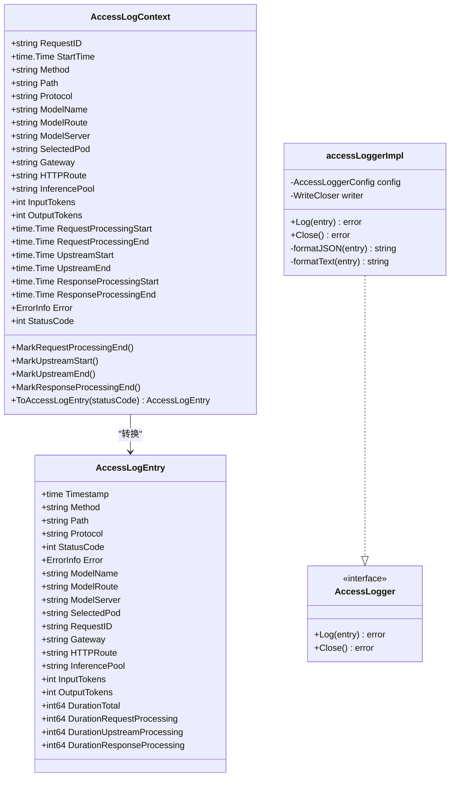
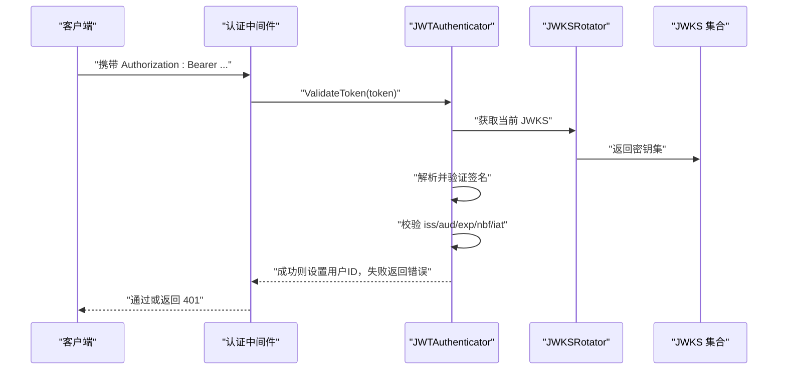
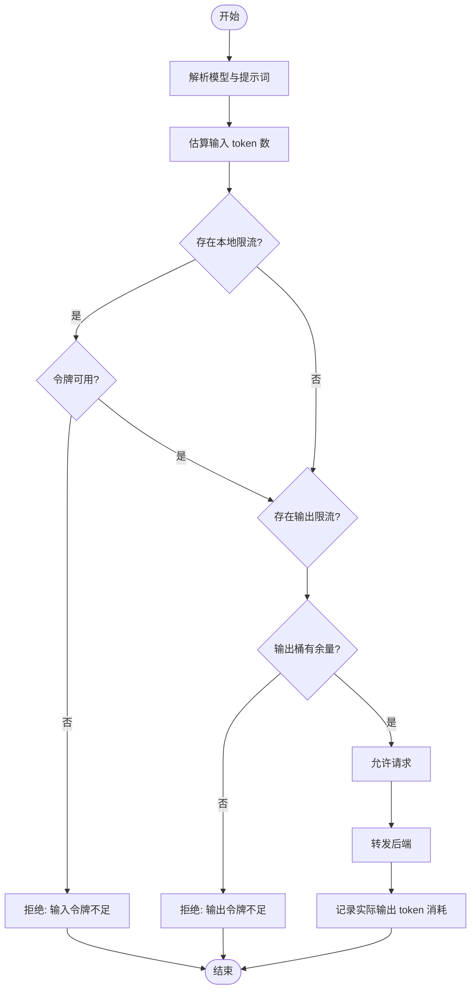
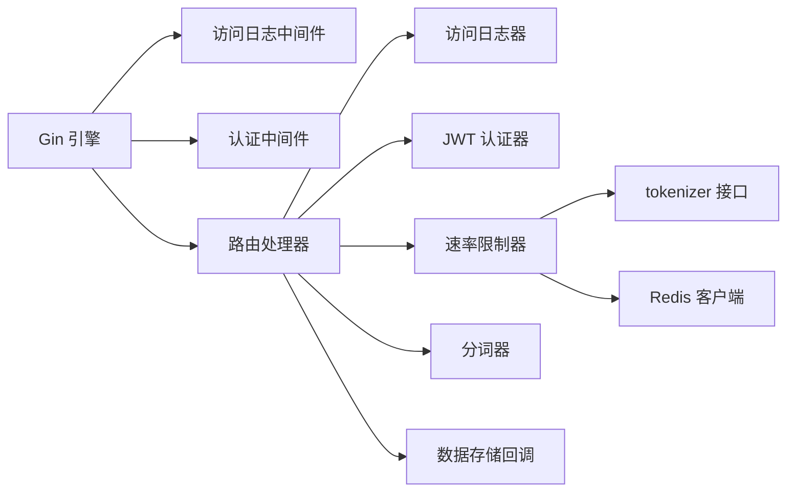

# 过滤器系统

<cite>
**本文引用的文件**   
- [pkg/kthena-router/accesslog/types.go](file://pkg/kthena-router/accesslog/types.go)
- [pkg/kthena-router/accesslog/middleware.go](file://pkg/kthena-router/accesslog/middleware.go)
- [pkg/kthena-router/accesslog/logger.go](file://pkg/kthena-router/accesslog/logger.go)
- [cmd/kthena-router/app/router.go](file://cmd/kthena-router/app/router.go)
- [pkg/kthena-router/router/router.go](file://pkg/kthena-router/router/router.go)
- [pkg/kthena-router/filters/auth/jwt.go](file://pkg/kthena-router/filters/auth/jwt.go)
- [pkg/kthena-router/filters/auth/authentication.go](file://pkg/kthena-router/filters/auth/authentication.go)
- [pkg/kthena-router/filters/auth/authorization.go](file://pkg/kthena-router/filters/auth/authorization.go)
- [pkg/kthena-router/filters/ratelimit/ratelimit.go](file://pkg/kthena-router/filters/ratelimit/ratelimit.go)
- [pkg/kthena-router/filters/ratelimit/global.go](file://pkg/kthena-router/filters/ratelimit/global.go)
- [pkg/kthena-router/filters/tokenizer/tokenizer.go](file://pkg/kthena-router/filters/tokenizer/tokenizer.go)
- [pkg/kthena-router/filters/tokenizer/estimator.go](file://pkg/kthena-router/filters/tokenizer/estimator.go)
- [pkg/apis/networking/v1alpha1/modelroute_types.go](file://pkg/apis/networking/v1alpha1/modelroute_types.go)
- [client-go/applyconfiguration/networking/v1alpha1/ratelimit.go](file://client-go/applyconfiguration/networking/v1alpha1/ratelimit.go)
- [pkg/kthena-router/scheduler/factory.go](file://pkg/kthena-router/scheduler/factory.go)
</cite>

## 目录
1. [简介](#简介)
2. [项目结构](#项目结构)
3. [核心组件](#核心组件)
4. [架构总览](#架构总览)
5. [详细组件分析](#详细组件分析)
6. [依赖关系分析](#依赖关系分析)
7. [性能考量](#性能考量)
8. [故障排查指南](#故障排查指南)
9. [结论](#结论)
10. [附录](#附录)

## 简介
本技术文档围绕过滤器系统展开，重点阐述基于中间件模式的过滤器链设计与执行顺序，以及请求/响应处理机制。文档覆盖以下内置过滤器的功能与实现：速率限制过滤器（本地与全局）、JWT 认证过滤器、授权过滤器（预留）与分词器过滤器。同时，文档详细说明访问日志记录系统的配置与输出格式、字段定义及性能影响，并提供配置示例与自定义过滤器开发指南，最后给出安全配置建议与性能优化策略。

## 项目结构
过滤器系统主要分布在如下模块：
- 访问日志：accesslog（上下文、中间件、日志器）
- 路由器：router（入口处理器、中间件装配）
- 认证与授权：filters/auth（JWT 认证、授权占位）
- 速率限制：filters/ratelimit（本地/全局令牌桶）
- 分词器：filters/tokenizer（接口与估算实现）
- CRD 定义：apis/networking/v1alpha1（模型路由与速率限制配置）

图表来源
- [cmd/kthena-router/app/router.go:242-269](file://cmd/kthena-router/app/router.go#L242-L269)
- [pkg/kthena-router/router/router.go:204-260](file://pkg/kthena-router/router/router.go#L204-L260)
- [pkg/kthena-router/accesslog/middleware.go:30-63](file://pkg/kthena-router/accesslog/middleware.go#L30-L63)
- [pkg/kthena-router/filters/auth/authentication.go:310-331](file://pkg/kthena-router/filters/auth/authentication.go#L310-L331)
- [pkg/kthena-router/filters/ratelimit/ratelimit.go:91-204](file://pkg/kthena-router/filters/ratelimit/ratelimit.go#L91-L204)

章节来源
- [cmd/kthena-router/app/router.go:242-269](file://cmd/kthena-router/app/router.go#L242-L269)
- [pkg/kthena-router/router/router.go:71-224](file://pkg/kthena-router/router/router.go#L71-L224)

## 核心组件
- 访问日志上下文与中间件：在请求进入时生成上下文并记录关键时间点；在请求完成后生成日志条目并写入。
- JWT 认证器：从配置加载 JWKS，周期性轮换密钥，校验签发者、受众、时间戳等声明。
- 速率限制器：支持本地令牌桶与全局 Redis 令牌桶，按输入/输出令牌进行限流；支持根据模型维度独立配置。
- 分词器：提供统一接口，当前默认使用字符数估算 token 数量。
- 路由器：组装中间件链，解析请求、调用过滤器、调度后端、记录指标与日志。

章节来源
- [pkg/kthena-router/accesslog/types.go:23-97](file://pkg/kthena-router/accesslog/types.go#L23-L97)
- [pkg/kthena-router/accesslog/middleware.go:30-138](file://pkg/kthena-router/accesslog/middleware.go#L30-L138)
- [pkg/kthena-router/filters/auth/authentication.go:50-331](file://pkg/kthena-router/filters/auth/authentication.go#L50-L331)
- [pkg/kthena-router/filters/ratelimit/ratelimit.go:60-231](file://pkg/kthena-router/filters/ratelimit/ratelimit.go#L60-L231)
- [pkg/kthena-router/filters/tokenizer/tokenizer.go:19-22](file://pkg/kthena-router/filters/tokenizer/tokenizer.go#L19-L22)

## 架构总览
过滤器系统采用“中间件链 + 路由处理器”的模式。Gin 引擎按注册顺序依次调用中间件，每个中间件可读取/修改上下文、设置错误信息或提前终止请求。路由处理器在中间件之后执行，负责解析请求、调用过滤器（认证、限流、分词统计等），并与后端交互，最终通过访问日志中间件落盘。

图表来源
- [cmd/kthena-router/app/router.go:242-269](file://cmd/kthena-router/app/router.go#L242-L269)
- [pkg/kthena-router/accesslog/middleware.go:30-63](file://pkg/kthena-router/accesslog/middleware.go#L30-L63)
- [pkg/kthena-router/filters/auth/authentication.go:310-331](file://pkg/kthena-router/filters/auth/authentication.go#L310-L331)
- [pkg/kthena-router/router/router.go:204-260](file://pkg/kthena-router/router/router.go#L204-L260)
- [pkg/kthena-router/filters/ratelimit/ratelimit.go:100-126](file://pkg/kthena-router/filters/ratelimit/ratelimit.go#L100-L126)

## 详细组件分析

### 访问日志系统
- 上下文与字段：记录请求元数据、AI 路由信息、网关 API 扩展信息、token 统计与多阶段耗时。
- 中间件：在请求进入时生成上下文（含请求 ID、方法、路径、协议、模型名等），在请求完成时汇总状态码与耗时并写入日志。
- 日志器：支持 JSON 与文本两种格式，支持 stdout/stderr/file 输出，可通过环境变量覆盖默认配置。

图表来源
- [pkg/kthena-router/accesslog/types.go:23-97](file://pkg/kthena-router/accesslog/types.go#L23-L97)
- [pkg/kthena-router/accesslog/types.go:169-224](file://pkg/kthena-router/accesslog/types.go#L169-L224)
- [pkg/kthena-router/accesslog/logger.go:63-136](file://pkg/kthena-router/accesslog/logger.go#L63-L136)

章节来源
- [pkg/kthena-router/accesslog/types.go:23-224](file://pkg/kthena-router/accesslog/types.go#L23-L224)
- [pkg/kthena-router/accesslog/middleware.go:30-138](file://pkg/kthena-router/accesslog/middleware.go#L30-L138)
- [pkg/kthena-router/accesslog/logger.go:54-165](file://pkg/kthena-router/accesslog/logger.go#L54-L165)

### JWT 认证过滤器
- 启动与配置：从路由器配置中读取 JWKS 地址与受众、签发者等参数，启动 JWKS 轮询任务。
- 校验流程：解析 Bearer Token，使用 JWKS 验证签名与算法，再校验签发者、受众、过期时间、生效时间等声明。
- 中间件：在认证启用时，从 Authorization 头提取并验证 JWT，成功则将用户标识写入上下文，失败则返回 401。

图表来源
- [pkg/kthena-router/filters/auth/authentication.go:50-331](file://pkg/kthena-router/filters/auth/authentication.go#L50-L331)
- [pkg/kthena-router/filters/auth/jwt.go:45-144](file://pkg/kthena-router/filters/auth/jwt.go#L45-L144)

章节来源
- [pkg/kthena-router/filters/auth/authentication.go:50-331](file://pkg/kthena-router/filters/auth/authentication.go#L50-L331)
- [pkg/kthena-router/filters/auth/jwt.go:30-144](file://pkg/kthena-router/filters/auth/jwt.go#L30-L144)

### 速率限制过滤器
- 本地令牌桶：基于 golang.org/x/time/rate，按单位时间配额与突发容量控制。
- 全局令牌桶：基于 Redis 的 Lua 原子脚本，确保跨实例一致性；支持按模型/令牌类型（输入/输出）独立配置。
- 分词估算：在请求阶段估算输入 token 数，结合实际输出 token 数在响应阶段回填消耗。
- 配置来源：模型路由 CRD 中的 RateLimit 字段，支持单位（秒/分/时/天/月）与全局 Redis 配置。

图表来源
- [pkg/kthena-router/filters/ratelimit/ratelimit.go:100-137](file://pkg/kthena-router/filters/ratelimit/ratelimit.go#L100-L137)
- [pkg/kthena-router/filters/tokenizer/estimator.go:35-44](file://pkg/kthena-router/filters/tokenizer/estimator.go#L35-L44)

章节来源
- [pkg/kthena-router/filters/ratelimit/ratelimit.go:60-231](file://pkg/kthena-router/filters/ratelimit/ratelimit.go#L60-L231)
- [pkg/kthena-router/filters/ratelimit/global.go:74-292](file://pkg/kthena-router/filters/ratelimit/global.go#L74-L292)
- [pkg/kthena-router/filters/tokenizer/tokenizer.go:19-22](file://pkg/kthena-router/filters/tokenizer/tokenizer.go#L19-L22)
- [pkg/kthena-router/filters/tokenizer/estimator.go:25-44](file://pkg/kthena-router/filters/tokenizer/estimator.go#L25-L44)
- [pkg/apis/networking/v1alpha1/modelroute_types.go:122-155](file://pkg/apis/networking/v1alpha1/modelroute_types.go#L122-L155)

### 授权过滤器（预留）
- 当前实现为空函数，保留扩展点以接入细粒度授权策略（如基于角色/资源/动作的 ABAC/RBAC）。

章节来源
- [pkg/kthena-router/filters/auth/authorization.go:23-25](file://pkg/kthena-router/filters/auth/authorization.go#L23-L25)

### 分词器过滤器
- 接口：统一的 Tokenizer 接口，便于替换不同分词实现。
- 默认实现：简单估算器，按字符数除以每 token 平均字符数估算 token 数。

章节来源
- [pkg/kthena-router/filters/tokenizer/tokenizer.go:19-22](file://pkg/kthena-router/filters/tokenizer/tokenizer.go#L19-L22)
- [pkg/kthena-router/filters/tokenizer/estimator.go:25-44](file://pkg/kthena-router/filters/tokenizer/estimator.go#L25-L44)

## 依赖关系分析
- 中间件装配：Gin 引擎在路由组上注册访问日志与认证中间件，随后挂载路由处理器。
- 路由器依赖：Router 组合了鉴权器、速率限制器、访问日志器、指标器与分词器，并在处理器中调用。
- 速率限制依赖：本地限流依赖 time/rate，全局限流依赖 Redis 客户端；分词器依赖 tokenizer 接口。
- 配置来源：模型路由 CRD 的 RateLimit 字段驱动限流器初始化；路由器从存储回调中更新配置。

图表来源
- [cmd/kthena-router/app/router.go:242-269](file://cmd/kthena-router/app/router.go#L242-L269)
- [pkg/kthena-router/router/router.go:71-224](file://pkg/kthena-router/router/router.go#L71-L224)
- [pkg/kthena-router/filters/ratelimit/ratelimit.go:139-204](file://pkg/kthena-router/filters/ratelimit/ratelimit.go#L139-L204)

章节来源
- [pkg/kthena-router/scheduler/factory.go:43-63](file://pkg/kthena-router/scheduler/factory.go#L43-L63)
- [pkg/kthena-router/router/router.go:101-120](file://pkg/kthena-router/router/router.go#L101-L120)

## 性能考量
- 访问日志：
  - 文本格式更易读但序列化开销略高；JSON 更利于结构化采集与分析。
  - 文件输出相比 stdout/stderr 会引入磁盘 IO，建议在容器中使用 stdout 并由 sidecar 收集。
  - 可通过环境变量动态调整开关与格式，避免频繁重启。
- 速率限制：
  - 本地限流延迟低、无网络开销；全局限流具备一致性但引入 Redis RTT 与 Lua 执行开销。
  - Redis 键过期策略平衡内存占用与准确性；合理设置单位与配额可降低过期频率。
  - 分词估算成本极低，适合在请求早期快速决策；若对精度要求高可替换为精确分词器。
- 认证：
  - JWKS 轮询周期默认较长，减少网络请求；建议在生产环境配置稳定的 JWKS 地址与健康检查。

## 故障排查指南
- 认证失败：
  - 检查 Authorization 头是否为 Bearer Token；确认签发者、受众与过期时间等声明是否满足要求。
  - 若 JWKS 获取失败，查看轮询日志与网络连通性。
- 速率限制：
  - 输入/输出令牌不足：检查模型路由 CRD 的 RateLimit 配置与单位；核对估算字符数与实际 prompt 长度。
  - 全局限流异常：检查 Redis 地址连通性与权限；关注 Lua 脚本执行错误日志。
- 访问日志：
  - 格式不匹配或写入失败：确认日志器配置与输出目标；查看写入错误日志。
  - 字段缺失：确认中间件是否在请求完成后再写入；检查上下文是否被后续中间件覆盖。

章节来源
- [pkg/kthena-router/filters/auth/authentication.go:286-331](file://pkg/kthena-router/filters/auth/authentication.go#L286-L331)
- [pkg/kthena-router/filters/ratelimit/ratelimit.go:33-58](file://pkg/kthena-router/filters/ratelimit/ratelimit.go#L33-L58)
- [pkg/kthena-router/accesslog/logger.go:100-128](file://pkg/kthena-router/accesslog/logger.go#L100-L128)

## 结论
过滤器系统通过中间件链实现了清晰的职责分离：认证、限流、日志与指标各司其职。本地与全局速率限制配合分词估算，既保证了低延迟体验又提供了跨实例一致性。访问日志系统提供了丰富的字段与灵活的输出格式，便于运维与审计。建议在生产环境中优先使用全局限流与 stdout 日志，并结合监控告警完善可观测性。

## 附录

### 过滤器链执行顺序与请求/响应处理
- 注册顺序即执行顺序：访问日志中间件 → 认证中间件 → 路由处理器。
- 处理器内部：解析请求 → 设置模型名 → 创建指标记录器 → 应用过滤器（认证/限流/分词）→ 转发后端 → 记录输出 token → 写入访问日志。

章节来源
- [cmd/kthena-router/app/router.go:242-269](file://cmd/kthena-router/app/router.go#L242-L269)
- [pkg/kthena-router/router/router.go:204-260](file://pkg/kthena-router/router/router.go#L204-L260)

### 访问日志字段定义与输出格式
- 字段清单：时间戳、方法、路径、协议、状态码、错误类型与消息、模型名/路由/服务器/选中 Pod、请求 ID、网关/HTTPRoute/推理池、输入/输出 token、总耗时与三阶段耗时（请求/上游/响应）。
- 输出格式：JSON 或 文本；输出目标：stdout、stderr 或文件。

章节来源
- [pkg/kthena-router/accesslog/types.go:23-56](file://pkg/kthena-router/accesslog/types.go#L23-L56)
- [pkg/kthena-router/accesslog/logger.go:138-165](file://pkg/kthena-router/accesslog/logger.go#L138-L165)

### 速率限制配置示例与 CRD 字段
- CRD 字段：输入/输出令牌配额、单位（秒/分/时/天/月）、全局 Redis 配置（地址）。
- 客户端应用配置：支持设置输入/输出令牌配额、单位与全局字段。

章节来源
- [pkg/apis/networking/v1alpha1/modelroute_types.go:122-155](file://pkg/apis/networking/v1alpha1/modelroute_types.go#L122-L155)
- [client-go/applyconfiguration/networking/v1alpha1/ratelimit.go:40-70](file://client-go/applyconfiguration/networking/v1alpha1/ratelimit.go#L40-L70)

### 自定义过滤器开发指南
- 开发步骤：
  - 在路由器中新增过滤器逻辑（例如鉴权/授权/重写/熔断等）。
  - 将过滤器封装为 Gin 中间件或在处理器内调用。
  - 使用访问日志上下文记录必要的元数据与耗时。
  - 通过数据存储回调或配置中心动态更新过滤器行为。
- 注意事项：
  - 保持无状态与幂等；避免阻塞 IO。
  - 正确设置错误上下文以便访问日志记录。
  - 对外暴露必要的指标以便观测。

章节来源
- [pkg/kthena-router/router/router.go:204-260](file://pkg/kthena-router/router/router.go#L204-L260)
- [pkg/kthena-router/accesslog/middleware.go:75-138](file://pkg/kthena-router/accesslog/middleware.go#L75-L138)

### 安全配置建议
- 认证：
  - 使用 HTTPS 与受信 CA；严格配置 JWKS 地址与受众白名单。
  - 启用 exp/nbf/iat 校验，避免重放攻击。
- 速率限制：
  - 优先使用全局限流以防止绕过；为不同模型/用户设置差异化配额。
  - 结合 IP/来源维度进行额外防护。
- 日志：
  - 避免在日志中输出敏感信息；必要时脱敏处理。

### 性能优化策略
- 限流：
  - 本地限流用于热点模型；全局限流用于跨实例一致性。
  - 合理设置单位与配额，避免过于频繁的键过期。
- 分词：
  - 在高吞吐场景下使用估算器；对长文本或特殊语言考虑精确分词器。
- 日志：
  - 生产环境使用 stdout 并由 sidecar 收集；避免磁盘 IO；按需调整格式与级别。