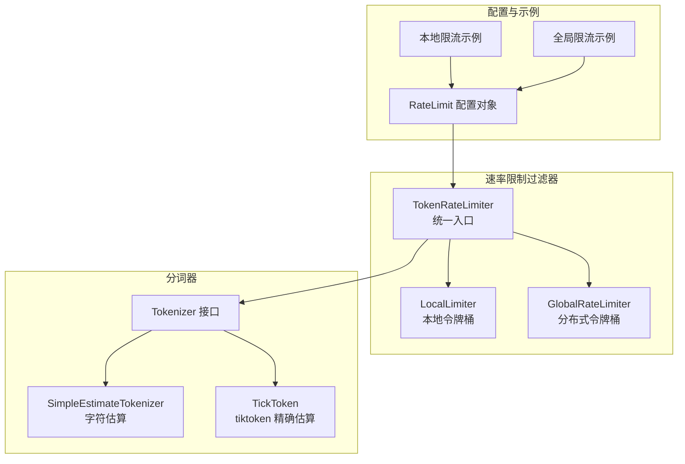
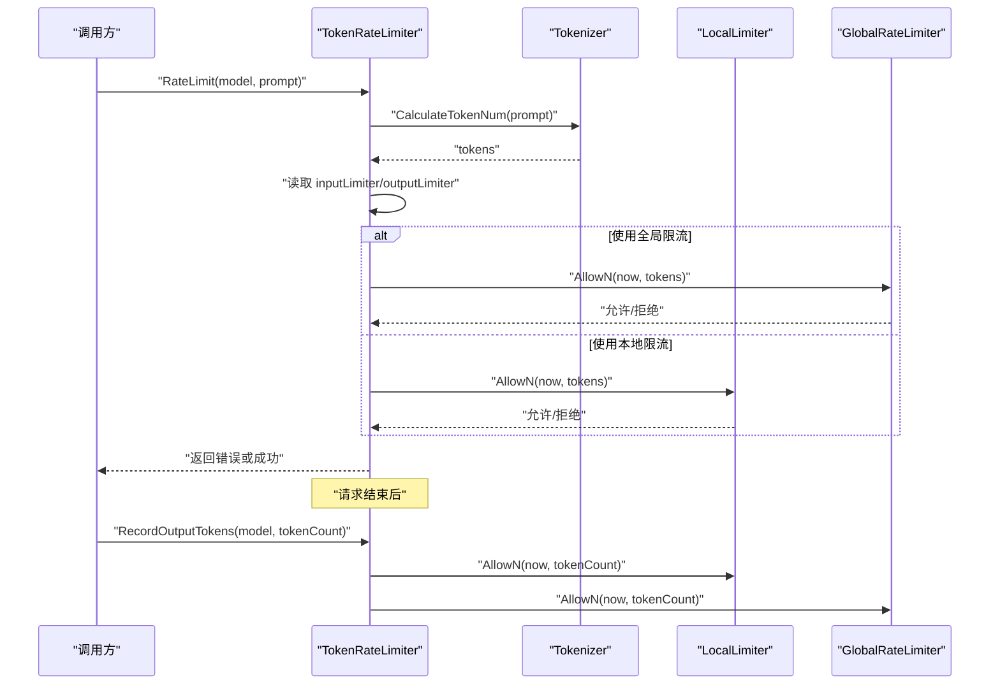
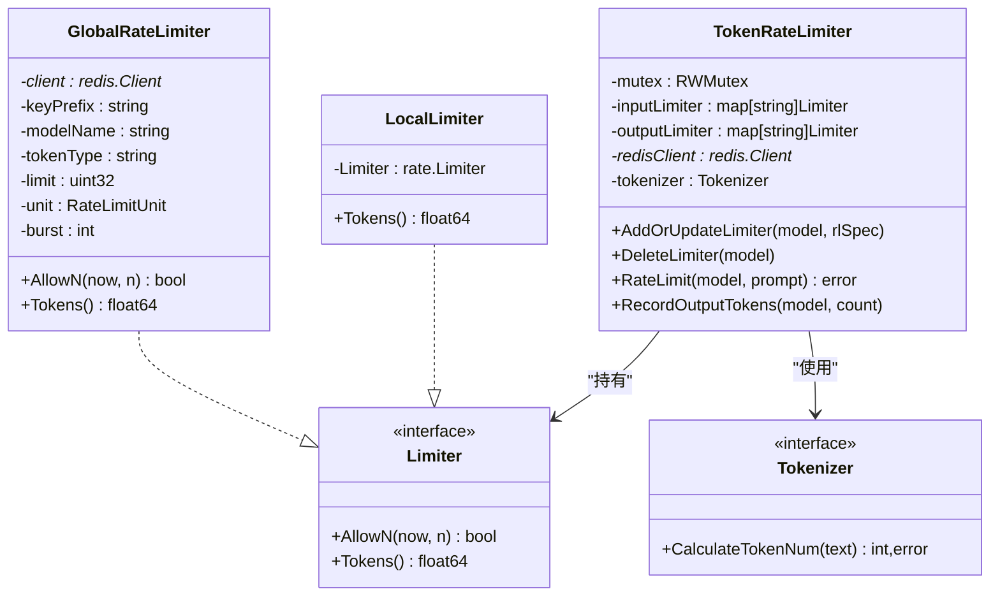
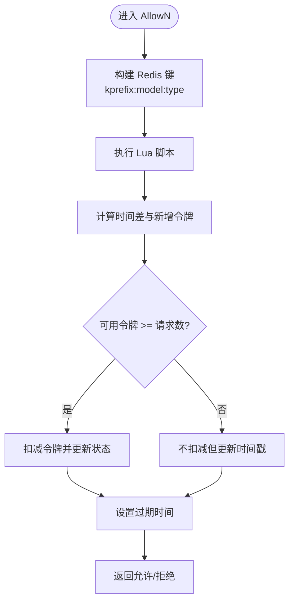
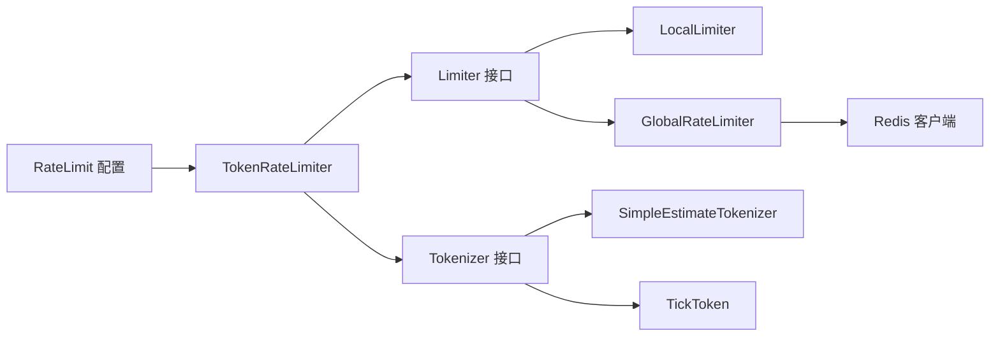
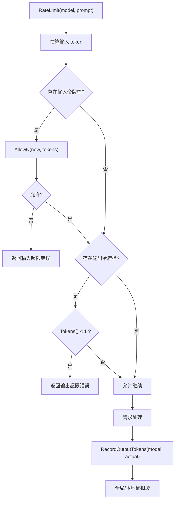

# 速率限制过滤器

<cite>
**本文引用的文件**
- [pkg/kthena-router/filters/ratelimit/ratelimit.go](file://pkg/kthena-router/filters/ratelimit/ratelimit.go)
- [pkg/kthena-router/filters/ratelimit/global.go](file://pkg/kthena-router/filters/ratelimit/global.go)
- [pkg/kthena-router/filters/ratelimit/ratelimit_test.go](file://pkg/kthena-router/filters/ratelimit/ratelimit_test.go)
- [pkg/kthena-router/filters/tokenizer/tokenizer.go](file://pkg/kthena-router/filters/tokenizer/tokenizer.go)
- [pkg/kthena-router/filters/tokenizer/estimator.go](file://pkg/kthena-router/filters/tokenizer/estimator.go)
- [pkg/kthena-router/filters/tokenizer/tiktoken.go](file://pkg/kthena-router/filters/tokenizer/tiktoken.go)
- [client-go/applyconfiguration/networking/v1alpha1/ratelimit.go](file://client-go/applyconfiguration/networking/v1alpha1/ratelimit.go)
- [examples/kthena-router/ModelRouteWithRateLimit.yaml](file://examples/kthena-router/ModelRouteWithRateLimit.yaml)
- [examples/kthena-router/ModelRouteWithGlobalRateLimit.yaml](file://examples/kthena-router/ModelRouteWithGlobalRateLimit.yaml)
</cite>

## 目录
1. [简介](#简介)
2. [项目结构](#项目结构)
3. [核心组件](#核心组件)
4. [架构总览](#架构总览)
5. [组件详解](#组件详解)
6. [依赖关系分析](#依赖关系分析)
7. [性能考量](#性能考量)
8. [故障排查指南](#故障排查指南)
9. [结论](#结论)
10. [附录](#附录)

## 简介
本技术文档围绕速率限制过滤器展开，系统性解析本地与全局速率限制的实现原理，重点覆盖以下方面：
- 令牌桶算法在本地与分布式场景中的应用
- 基于 Redis 的分布式限流机制与原子 Lua 脚本
- 输入输出令牌的双重限制策略：请求前估算输入令牌并进行预检查，请求后记录输出令牌以实现更精确的配额消耗
- TokenRateLimiter 的设计架构：LocalLimiter 与 GlobalRateLimiter 的差异、适用场景与切换逻辑
- 配置示例：单位时间令牌数、突发容量、模型级限流配置
- 错误处理与并发安全：错误类型定义、读写锁保护、Redis 连接与超时控制
- 性能优化：分词器选择（简单估算 vs tiktoken）、并发访问优化、Redis 过期策略

## 项目结构
速率限制相关代码主要位于 kthena-router 的 filters 子模块中，配合 tokenizer 模块用于估算输入提示的 token 数量，并通过 Redis 实现全局一致性。

图表来源
- [pkg/kthena-router/filters/ratelimit/ratelimit.go:60-231](file://pkg/kthena-router/filters/ratelimit/ratelimit.go#L60-L231)
- [pkg/kthena-router/filters/tokenizer/tokenizer.go:19-22](file://pkg/kthena-router/filters/tokenizer/tokenizer.go#L19-L22)
- [pkg/kthena-router/filters/tokenizer/estimator.go:25-44](file://pkg/kthena-router/filters/tokenizer/estimator.go#L25-L44)
- [pkg/kthena-router/filters/tokenizer/tiktoken.go:24-35](file://pkg/kthena-router/filters/tokenizer/tiktoken.go#L24-L35)
- [client-go/applyconfiguration/networking/v1alpha1/ratelimit.go:25-71](file://client-go/applyconfiguration/networking/v1alpha1/ratelimit.go#L25-L71)
- [examples/kthena-router/ModelRouteWithRateLimit.yaml:13-17](file://examples/kthena-router/ModelRouteWithRateLimit.yaml#L13-L17)
- [examples/kthena-router/ModelRouteWithGlobalRateLimit.yaml:14-21](file://examples/kthena-router/ModelRouteWithGlobalRateLimit.yaml#L14-L21)

章节来源
- [pkg/kthena-router/filters/ratelimit/ratelimit.go:17-31](file://pkg/kthena-router/filters/ratelimit/ratelimit.go#L17-L31)
- [pkg/kthena-router/filters/tokenizer/tokenizer.go:17-22](file://pkg/kthena-router/filters/tokenizer/tokenizer.go#L17-L22)

## 核心组件
- TokenRateLimiter：统一的速率限制入口，负责根据模型名维护输入/输出令牌桶，支持本地与全局两种模式的切换；内置分词器用于估算输入 token 数量；提供请求前检查与请求后记录输出 token 的能力。
- LocalLimiter：基于标准库令牌桶实现的本地限流器，适合单实例或无跨实例一致性的场景。
- GlobalRateLimiter：基于 Redis 的分布式令牌桶，使用 Lua 原子脚本保证并发安全与一致性，适合多实例部署的全局限流。
- Tokenizer 接口及其实现：提供估算输入提示 token 数的能力，支持简单估算与 tiktoken 精确估算两种策略。

章节来源
- [pkg/kthena-router/filters/ratelimit/ratelimit.go:60-231](file://pkg/kthena-router/filters/ratelimit/ratelimit.go#L60-L231)
- [pkg/kthena-router/filters/ratelimit/global.go:74-292](file://pkg/kthena-router/filters/ratelimit/global.go#L74-L292)
- [pkg/kthena-router/filters/tokenizer/tokenizer.go:19-22](file://pkg/kthena-router/filters/tokenizer/tokenizer.go#L19-L22)
- [pkg/kthena-router/filters/tokenizer/estimator.go:25-44](file://pkg/kthena-router/filters/tokenizer/estimator.go#L25-L44)
- [pkg/kthena-router/filters/tokenizer/tiktoken.go:24-35](file://pkg/kthena-router/filters/tokenizer/tiktoken.go#L24-L35)

## 架构总览
下图展示了 TokenRateLimiter 在请求生命周期中的调用流程，以及本地与全局限流器的选择逻辑。

图表来源
- [pkg/kthena-router/filters/ratelimit/ratelimit.go:100-137](file://pkg/kthena-router/filters/ratelimit/ratelimit.go#L100-L137)
- [pkg/kthena-router/filters/ratelimit/global.go:98-177](file://pkg/kthena-router/filters/ratelimit/global.go#L98-L177)

## 组件详解

### TokenRateLimiter 设计与实现
- 统一接口：通过 Limiter 接口抽象本地与全局限流器，屏蔽实现细节。
- 并发安全：内部使用读写锁保护 inputLimiter/outputLimiter 映射，避免并发更新与读取冲突。
- 分词器集成：默认使用简单估算分词器，必要时回退到字符长度估算；可替换为 tiktoken 精确估算。
- 请求前检查：估算输入 token 后，先检查输入令牌桶是否允许；再检查输出令牌桶是否有至少 1 个可用 token，避免启动无法完成的请求。
- 请求后记录：在响应生成完成后，调用 RecordOutputTokens 记录实际输出 token 数，使全局/本地桶准确扣减。

图表来源
- [pkg/kthena-router/filters/ratelimit/ratelimit.go:51-137](file://pkg/kthena-router/filters/ratelimit/ratelimit.go#L51-L137)
- [pkg/kthena-router/filters/ratelimit/global.go:74-96](file://pkg/kthena-router/filters/ratelimit/global.go#L74-L96)
- [pkg/kthena-router/filters/tokenizer/tokenizer.go:19-22](file://pkg/kthena-router/filters/tokenizer/tokenizer.go#L19-L22)

章节来源
- [pkg/kthena-router/filters/ratelimit/ratelimit.go:60-231](file://pkg/kthena-router/filters/ratelimit/ratelimit.go#L60-L231)

### LocalLimiter（本地令牌桶）
- 基于标准库令牌桶，适合单实例或不需要跨实例一致性的场景。
- 初始化时根据单位时间令牌数与突发容量计算 refill rate 与 burst。
- Tokens() 返回当前可用令牌数，用于输出令牌的保守检查。

章节来源
- [pkg/kthena-router/filters/ratelimit/ratelimit.go:74-89](file://pkg/kthena-router/filters/ratelimit/ratelimit.go#L74-L89)
- [pkg/kthena-router/filters/ratelimit/ratelimit.go:184-201](file://pkg/kthena-router/filters/ratelimit/ratelimit.go#L184-L201)

### GlobalRateLimiter（分布式令牌桶）
- 使用 Redis 作为共享状态存储，键空间包含模型名与令牌类型（输入/输出）。
- 通过 Lua 脚本原子执行令牌桶算法：计算时间差产生的新令牌、比较与消费、更新状态并设置过期。
- 过期策略：基于单位时间的 3 倍，同时设置最小 10 分钟与最大 90 天的边界，平衡内存占用与功能正确性。
- Tokens() 提供只读查询，同时保持时间同步，便于监控与决策。

图表来源
- [pkg/kthena-router/filters/ratelimit/global.go:98-177](file://pkg/kthena-router/filters/ratelimit/global.go#L98-L177)
- [pkg/kthena-router/filters/ratelimit/global.go:185-221](file://pkg/kthena-router/filters/ratelimit/global.go#L185-L221)

章节来源
- [pkg/kthena-router/filters/ratelimit/global.go:74-292](file://pkg/kthena-router/filters/ratelimit/global.go#L74-L292)

### 分词器集成与估算策略
- Tokenizer 接口统一估算行为，支持多种实现。
- SimpleEstimateTokenizer：按字符估算 token 数，开销低，适合快速估算。
- TickToken：使用 tiktoken 精确估算，准确性更高，适合对 token 成本敏感的场景。
- TokenRateLimiter 默认使用简单估算，若估算失败则回退到字符长度估算，确保稳定性。

章节来源
- [pkg/kthena-router/filters/tokenizer/tokenizer.go:19-22](file://pkg/kthena-router/filters/tokenizer/tokenizer.go#L19-L22)
- [pkg/kthena-router/filters/tokenizer/estimator.go:25-44](file://pkg/kthena-router/filters/tokenizer/estimator.go#L25-L44)
- [pkg/kthena-router/filters/tokenizer/tiktoken.go:24-35](file://pkg/kthena-router/filters/tokenizer/tiktoken.go#L24-L35)
- [pkg/kthena-router/filters/ratelimit/ratelimit.go:100-107](file://pkg/kthena-router/filters/ratelimit/ratelimit.go#L100-L107)

### 配置与示例
- RateLimit 配置对象包含输入/输出单位时间令牌数、时间单位与全局配置（含 Redis 地址）。
- 本地限流示例：在模型路由中直接配置单位时间令牌数与单位。
- 全局限流示例：在本地配置基础上增加 global.redis.address，启用分布式令牌桶。

章节来源
- [client-go/applyconfiguration/networking/v1alpha1/ratelimit.go:25-71](file://client-go/applyconfiguration/networking/v1alpha1/ratelimit.go#L25-L71)
- [examples/kthena-router/ModelRouteWithRateLimit.yaml:13-17](file://examples/kthena-router/ModelRouteWithRateLimit.yaml#L13-L17)
- [examples/kthena-router/ModelRouteWithGlobalRateLimit.yaml:14-21](file://examples/kthena-router/ModelRouteWithGlobalRateLimit.yaml#L14-L21)

## 依赖关系分析
- TokenRateLimiter 依赖 Limiter 接口，从而解耦本地与全局实现。
- GlobalRateLimiter 依赖 Redis 客户端，使用 Lua 原子脚本保证一致性。
- TokenRateLimiter 依赖 Tokenizer 接口，支持不同估算策略。
- 配置层通过 applyconfiguration 将 RateLimit 规则注入到运行时。

图表来源
- [pkg/kthena-router/filters/ratelimit/ratelimit.go:51-137](file://pkg/kthena-router/filters/ratelimit/ratelimit.go#L51-L137)
- [pkg/kthena-router/filters/ratelimit/global.go:74-96](file://pkg/kthena-router/filters/ratelimit/global.go#L74-L96)
- [pkg/kthena-router/filters/tokenizer/tokenizer.go:19-22](file://pkg/kthena-router/filters/tokenizer/tokenizer.go#L19-L22)
- [pkg/kthena-router/filters/tokenizer/estimator.go:25-44](file://pkg/kthena-router/filters/tokenizer/estimator.go#L25-L44)
- [pkg/kthena-router/filters/tokenizer/tiktoken.go:24-35](file://pkg/kthena-router/filters/tokenizer/tiktoken.go#L24-L35)
- [client-go/applyconfiguration/networking/v1alpha1/ratelimit.go:25-71](file://client-go/applyconfiguration/networking/v1alpha1/ratelimit.go#L25-L71)

## 性能考量
- 分词器选择
  - 简单估算：字符数除以固定系数，O(n) 字符串处理，开销小。
  - tiktoken：加载编码器与分词，准确性高，适合高成本场景。
- 并发安全
  - TokenRateLimiter 内部使用读写锁，读多写少场景下读锁提升并发吞吐。
- Redis 性能
  - Lua 原子脚本减少往返次数，降低网络延迟影响。
  - 过期策略在内存与正确性间折中，避免无限增长的键空间。
- 请求前检查
  - 输出令牌保守检查（至少 1 个可用）可避免启动无法完成的请求，减少无效资源占用。

章节来源
- [pkg/kthena-router/filters/ratelimit/ratelimit.go:109-125](file://pkg/kthena-router/filters/ratelimit/ratelimit.go#L109-L125)
- [pkg/kthena-router/filters/ratelimit/global.go:185-221](file://pkg/kthena-router/filters/ratelimit/global.go#L185-L221)

## 故障排查指南
- 错误类型
  - 输入令牌超限：当估算的输入 token 不可被允许时返回。
  - 输出令牌超限：当输出令牌桶可用数量不足 1 时返回。
  - 通用超限：当未区分具体类型时返回。
- 常见问题
  - Redis 连接失败：初始化全局限流时会 Ping Redis，失败会返回连接错误。
  - Lua 脚本异常：Redis 执行结果类型不符或错误会被记录并返回拒绝。
  - 分词器异常：估算失败时回退到字符长度估算，确保服务可用。
- 测试覆盖
  - 基础本地限流、时间重置、输出令牌记录、输入输出组合、删除限流器、输出限流、错误类型断言等。

章节来源
- [pkg/kthena-router/filters/ratelimit/ratelimit.go:33-49](file://pkg/kthena-router/filters/ratelimit/ratelimit.go#L33-L49)
- [pkg/kthena-router/filters/ratelimit/ratelimit.go:148-160](file://pkg/kthena-router/filters/ratelimit/ratelimit.go#L148-L160)
- [pkg/kthena-router/filters/ratelimit/global.go:163-176](file://pkg/kthena-router/filters/ratelimit/global.go#L163-L176)
- [pkg/kthena-router/filters/ratelimit/ratelimit_test.go:26-279](file://pkg/kthena-router/filters/ratelimit/ratelimit_test.go#L26-L279)

## 结论
该速率限制过滤器通过统一的 TokenRateLimiter 抽象，结合本地与全局两种令牌桶实现，提供了灵活且高性能的双令牌限制策略。本地限流适用于单实例场景，全局限流通过 Redis 与原子 Lua 脚本保障跨实例一致性。配合可插拔的分词器，系统在准确性与性能之间提供了良好平衡。建议在高并发与跨实例部署场景优先采用全局限流，并根据业务成本选择合适的分词器实现。

## 附录

### 配置要点与示例路径
- 本地限流配置示例：[examples/kthena-router/ModelRouteWithRateLimit.yaml:13-17](file://examples/kthena-router/ModelRouteWithRateLimit.yaml#L13-L17)
- 全局限流配置示例：[examples/kthena-router/ModelRouteWithGlobalRateLimit.yaml:14-21](file://examples/kthena-router/ModelRouteWithGlobalRateLimit.yaml#L14-L21)
- 配置对象定义：[client-go/applyconfiguration/networking/v1alpha1/ratelimit.go:25-71](file://client-go/applyconfiguration/networking/v1alpha1/ratelimit.go#L25-L71)

### 关键流程图：请求与记录

图表来源
- [pkg/kthena-router/filters/ratelimit/ratelimit.go:100-137](file://pkg/kthena-router/filters/ratelimit/ratelimit.go#L100-L137)
- [pkg/kthena-router/filters/ratelimit/global.go:98-177](file://pkg/kthena-router/filters/ratelimit/global.go#L98-L177)