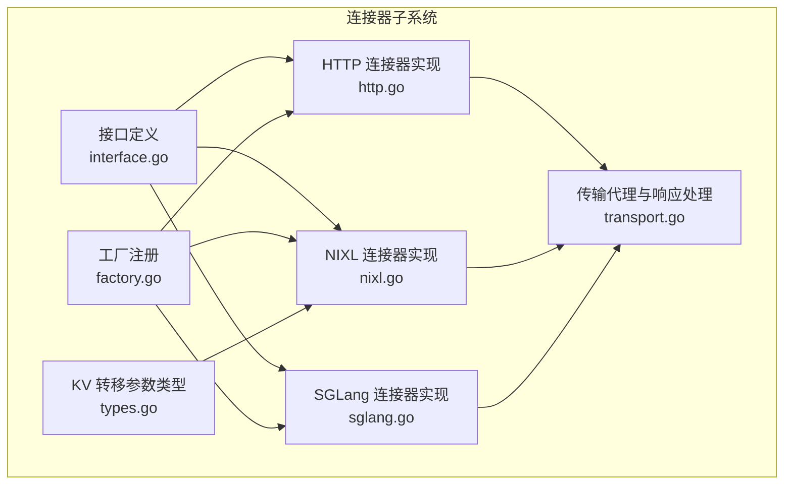
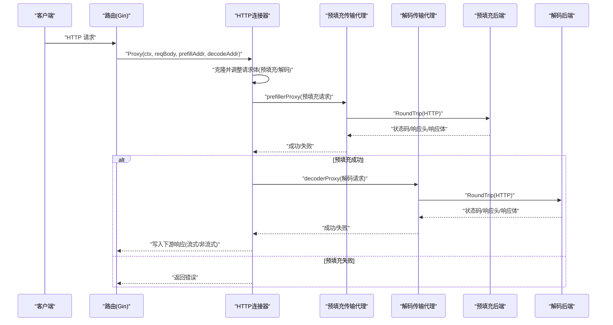
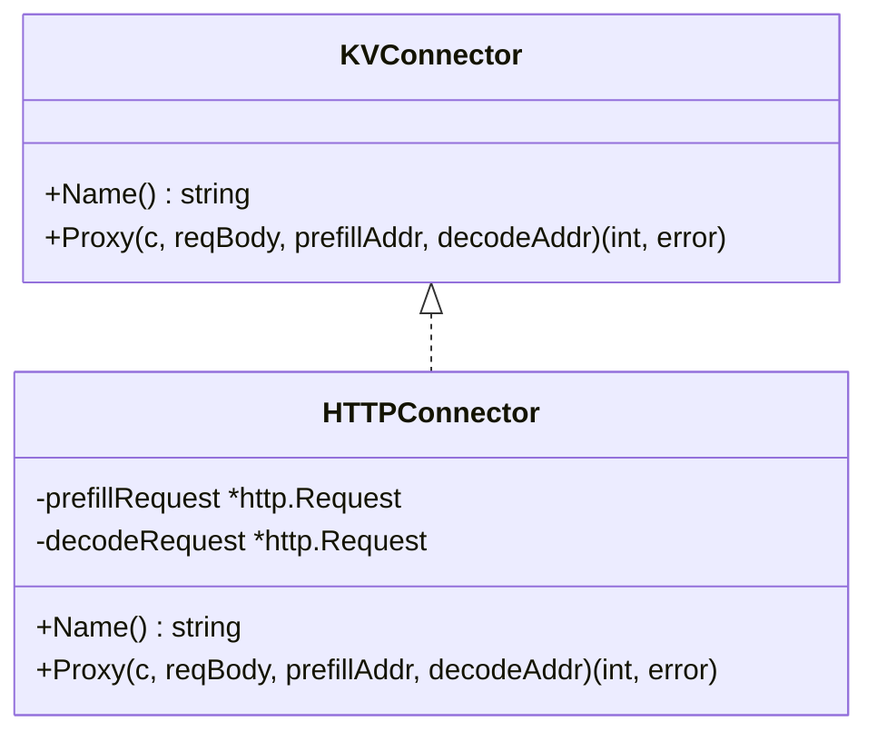
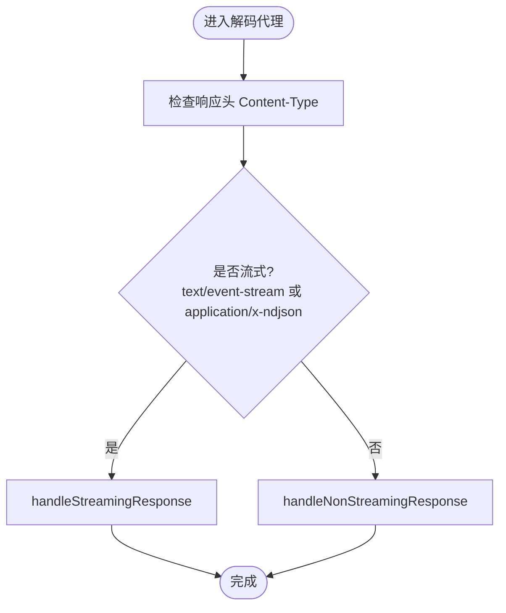
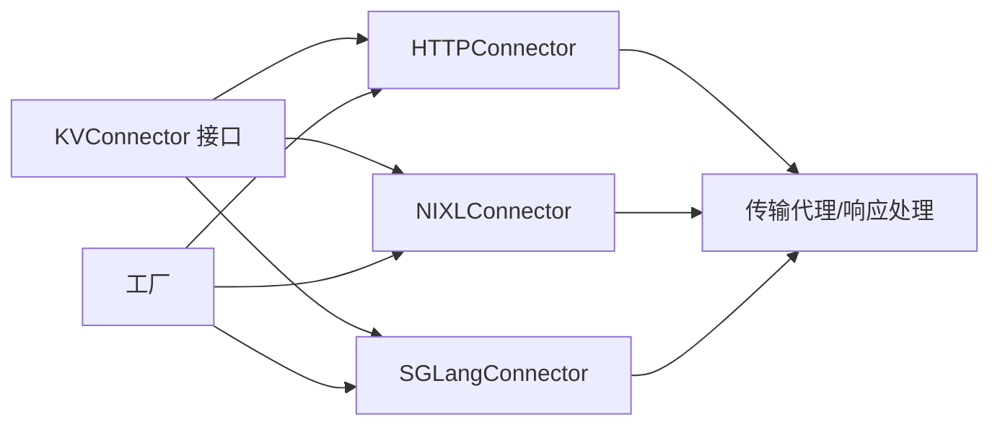

# HTTP 连接器

<cite>
**本文引用的文件**
- [http.go](file://pkg/kthena-router/connectors/http.go)
- [transport.go](file://pkg/kthena-router/connectors/transport.go)
- [interface.go](file://pkg/kthena-router/connectors/interface.go)
- [factory.go](file://pkg/kthena-router/connectors/factory.go)
- [types.go](file://pkg/kthena-router/connectors/types.go)
- [nixl.go](file://pkg/kthena-router/connectors/nixl.go)
- [sglang.go](file://pkg/kthena-router/connectors/sglang.go)
- [connectors_test.go](file://pkg/kthena-router/connectors/connectors_test.go)
- [transport_test.go](file://pkg/kthena-router/connectors/transport_test.go)
- [types.go](file://pkg/kthena-router/common/types.go)
- [modelroute_types.go](file://pkg/apis/networking/v1alpha1/modelroute_types.go)
- [ModelRouteSimple.yaml](file://examples/kthena-router/ModelRouteSimple.yaml)
</cite>

## 目录
1. [简介](#简介)
2. [项目结构](#项目结构)
3. [核心组件](#核心组件)
4. [架构总览](#架构总览)
5. [详细组件分析](#详细组件分析)
6. [依赖关系分析](#依赖关系分析)
7. [性能考量](#性能考量)
8. [故障排查指南](#故障排查指南)
9. [结论](#结论)
10. [附录](#附录)

## 简介
本文件面向“HTTP 连接器”的技术文档，系统阐述其在推理流水线中的职责与实现：以 HTTP 作为传输层，协调预填充（prefill）与解码（decode）阶段之间的 KV 缓存传递；支持非流式与流式响应处理，并对 OpenAI 兼容接口的使用统计进行适配。文档覆盖初始化、请求构建、传输代理、响应处理、错误处理、与工厂模式集成、以及与其他连接器（如 NIXL、SGLang）的差异与适用场景。

## 项目结构
HTTP 连接器位于路由模块的连接器子系统中，采用接口抽象与工厂注册的方式，便于扩展与替换。关键文件如下：
- 接口与工厂：定义统一接口、默认工厂与类型枚举
- HTTP 实现：具体实现预填充与解码的请求构建与传输代理
- 通用传输工具：封装预填充与解码的代理逻辑、流式/非流式响应处理
- 其他连接器：NIXL 与 SGLang 的实现用于对比参考
- 测试：覆盖请求体修改、流式/非流式判断、代理行为等

图表来源
- [interface.go:23-31](file://pkg/kthena-router/connectors/interface.go#L23-L31)
- [factory.go:21-60](file://pkg/kthena-router/connectors/factory.go#L21-L60)
- [http.go:28-120](file://pkg/kthena-router/connectors/http.go#L28-L120)
- [transport.go:33-227](file://pkg/kthena-router/connectors/transport.go#L33-L227)
- [types.go:19-28](file://pkg/kthena-router/connectors/types.go#L19-L28)
- [nixl.go:34-205](file://pkg/kthena-router/connectors/nixl.go#L34-L205)
- [sglang.go:42-222](file://pkg/kthena-router/connectors/sglang.go#L42-L222)

章节来源
- [interface.go:23-31](file://pkg/kthena-router/connectors/interface.go#L23-L31)
- [factory.go:21-60](file://pkg/kthena-router/connectors/factory.go#L21-L60)
- [http.go:28-120](file://pkg/kthena-router/connectors/http.go#L28-L120)
- [transport.go:33-227](file://pkg/kthena-router/connectors/transport.go#L33-L227)
- [types.go:19-28](file://pkg/kthena-router/connectors/types.go#L19-L28)
- [nixl.go:34-205](file://pkg/kthena-router/connectors/nixl.go#L34-L205)
- [sglang.go:42-222](file://pkg/kthena-router/connectors/sglang.go#L42-L222)

## 核心组件
- KVConnector 接口：统一的键值缓存操作接口，定义名称与完整流水线代理方法
- HTTPConnector：基于 HTTP 的默认实现，负责预填充与解码请求的构建与传输
- 传输代理：封装预填充与解码阶段的 RoundTrip 与响应转发
- 工厂模式：按类型注册并获取连接器实例，默认回退到 HTTP 实现
- 请求体适配：根据是否流式与是否已有使用统计开关，自动调整请求字段
- 响应处理：区分流式 SSE/NDJSON 与非流式 JSON，分别走不同的转发路径

章节来源
- [interface.go:23-31](file://pkg/kthena-router/connectors/interface.go#L23-L31)
- [http.go:28-120](file://pkg/kthena-router/connectors/http.go#L28-L120)
- [transport.go:33-227](file://pkg/kthena-router/connectors/transport.go#L33-L227)
- [factory.go:21-60](file://pkg/kthena-router/connectors/factory.go#L21-L60)

## 架构总览
HTTP 连接器在一次完整的推理请求中，执行以下步骤：
1) 从上游 Gin 上下文读取原始请求体，复制两份用于后续阶段
2) 预填充阶段：将请求体调整为非流式、限制最大生成长度，发送至预填充后端
3) 解码阶段：根据请求类型决定是否追加使用统计开关，发送至解码后端
4) 响应阶段：根据 Content-Type 判断流式或非流式，转发给上游客户端

图表来源
- [http.go:64-119](file://pkg/kthena-router/connectors/http.go#L64-L119)
- [transport.go:33-78](file://pkg/kthena-router/connectors/transport.go#L33-L78)

## 详细组件分析

### HTTP 连接器（HTTPConnector）
- 角色定位：默认连接器，适用于通用 HTTP 推理后端
- 关键职责：
  - 构建预填充请求：去除流式相关字段，设置最大生成长度为 1
  - 构建解码请求：根据请求类型添加使用统计开关
  - 执行预填充与解码的顺序调用，处理响应与错误
  - 记录指标：开始/结束各阶段、活跃上游请求数变化

图表来源
- [interface.go:23-31](file://pkg/kthena-router/connectors/interface.go#L23-L31)
- [http.go:28-63](file://pkg/kthena-router/connectors/http.go#L28-L63)

章节来源
- [http.go:28-120](file://pkg/kthena-router/connectors/http.go#L28-L120)

### 传输代理与响应处理（prefillerProxy/decoderProxy）
- 预填充代理：直接通过默认传输 RoundTrip 发送请求，校验状态码范围
- 解码代理：复制响应头、设置状态码，判断是否流式响应并分派处理函数
- 流式处理：逐行读取事件流，解析使用统计并可选择过滤输出
- 非流式处理：拷贝响应体到下游，解析 JSON 中的使用统计

图表来源
- [transport.go:48-78](file://pkg/kthena-router/connectors/transport.go#L48-L78)
- [transport.go:169-173](file://pkg/kthena-router/connectors/transport.go#L169-L173)
- [transport.go:175-205](file://pkg/kthena-router/connectors/transport.go#L175-L205)
- [transport.go:207-226](file://pkg/kthena-router/connectors/transport.go#L207-L226)

章节来源
- [transport.go:33-78](file://pkg/kthena-router/connectors/transport.go#L33-L78)
- [transport.go:169-226](file://pkg/kthena-router/connectors/transport.go#L169-L226)

### 请求体适配与上下文标记
- 预填充请求体：删除流式字段，将最大生成长度设为 1；同时兼容最大补全长度字段
- 解码请求体：非流式请求显式要求使用统计；流式请求若未开启使用统计则追加开关
- 上下文标记：当需要过滤流式使用统计时，在上下文中设置标记键

章节来源
- [transport.go:82-90](file://pkg/kthena-router/connectors/transport.go#L82-L90)
- [transport.go:92-123](file://pkg/kthena-router/connectors/transport.go#L92-L123)
- [transport.go:125-145](file://pkg/kthena-router/connectors/transport.go#L125-L145)
- [types.go:19-22](file://pkg/kthena-router/common/types.go#L19-L22)

### 工厂与类型注册
- 工厂注册：默认注册 HTTP、LMCache（复用 HTTP）、NIXL、SGLang 等连接器
- 获取策略：按类型查找，不存在时回退到 HTTP 连接器
- 类型枚举：由网络 API 类型定义提供

章节来源
- [factory.go:21-60](file://pkg/kthena-router/connectors/factory.go#L21-L60)
- [modelroute_types.go:1-194](file://pkg/apis/networking/v1alpha1/modelroute_types.go#L1-L194)

### 与其他连接器的对比
- NIXL：在预填充后接收 KV 转移参数，解码阶段携带该参数以完成跨节点 KV 传递
- SGLang：要求预填充与解码并发发起，且双方携带唯一房间号与引导主机信息，确保引导交换成功

章节来源
- [nixl.go:114-145](file://pkg/kthena-router/connectors/nixl.go#L114-L145)
- [sglang.go:72-195](file://pkg/kthena-router/connectors/sglang.go#L72-L195)

## 依赖关系分析
- 组件耦合
  - HTTP/NIXL/SGLang 共同依赖传输代理与请求体适配工具
  - 工厂模式降低上层对具体实现的耦合
- 外部依赖
  - 使用标准库 HTTP 传输与 Gin 上下文
  - 日志与指标记录通过通用模块注入

图表来源
- [interface.go:23-31](file://pkg/kthena-router/connectors/interface.go#L23-L31)
- [http.go:28-120](file://pkg/kthena-router/connectors/http.go#L28-L120)
- [nixl.go:34-205](file://pkg/kthena-router/connectors/nixl.go#L34-L205)
- [sglang.go:42-222](file://pkg/kthena-router/connectors/sglang.go#L42-L222)
- [factory.go:21-60](file://pkg/kthena-router/connectors/factory.go#L21-L60)

## 性能考量
- 请求体最小化：预填充阶段仅保留必要字段，减少网络负载
- 流式直通：流式响应按行转发，避免整体缓冲，降低延迟
- 指标观测：通过阶段计数与活跃请求数变化，辅助容量规划与异常定位
- 并发注意：SGLang 需要并发启动预填充与解码，避免因时序导致的握手失败

## 故障排查指南
- 预填充失败
  - 现象：预填充阶段返回非 2xx 状态码或网络错误
  - 排查：检查后端地址可达性、协议一致性（http scheme）、请求体字段是否被正确裁剪
- 解码失败
  - 现象：解码阶段返回非 2xx 状态码或网络错误
  - 排查：确认解码请求体中使用统计开关是否符合预期；检查后端日志
- 流式输出异常
  - 现象：客户端未收到增量数据或使用统计被误过滤
  - 排查：确认 Content-Type 是否为流式类型；检查上下文标记是否正确设置
- 指标不更新
  - 现象：活跃请求数与阶段计数未变化
  - 排查：确认请求上下文中是否存在指标记录器；检查代理链路是否被拦截

章节来源
- [transport.go:33-46](file://pkg/kthena-router/connectors/transport.go#L33-L46)
- [transport.go:48-57](file://pkg/kthena-router/connectors/transport.go#L48-L57)
- [transport.go:175-205](file://pkg/kthena-router/connectors/transport.go#L175-L205)
- [transport.go:207-226](file://pkg/kthena-router/connectors/transport.go#L207-L226)

## 结论
HTTP 连接器以简洁的接口与通用的传输代理，实现了预填充与解码阶段的可靠衔接，具备良好的可扩展性与可观测性。结合工厂模式与类型枚举，可在不同推理引擎间灵活切换。对于需要跨节点 KV 协作或严格时序控制的场景，可选用 NIXL 或 SGLang 连接器。

## 附录

### 初始化与配置要点
- 初始化
  - 通过工厂获取连接器实例，未注册类型时默认回退到 HTTP
- 地址配置
  - 预填充与解码后端地址需在路由规则中明确指定
- 请求体字段
  - 预填充阶段会移除流式字段并将最大生成长度设为 1
  - 解码阶段根据请求类型自动追加使用统计开关

章节来源
- [factory.go:38-59](file://pkg/kthena-router/connectors/factory.go#L38-L59)
- [http.go:64-119](file://pkg/kthena-router/connectors/http.go#L64-L119)
- [transport.go:82-145](file://pkg/kthena-router/connectors/transport.go#L82-L145)

### 测试要点
- 非流式请求：验证解码请求包含使用统计开关
- 流式请求：验证上下文标记与流式开关处理
- 最大补全长度：验证预填充与解码阶段字段处理
- 代理行为：验证状态码与错误消息传播

章节来源
- [connectors_test.go:107-532](file://pkg/kthena-router/connectors/connectors_test.go#L107-L532)
- [transport_test.go:376-649](file://pkg/kthena-router/connectors/transport_test.go#L376-L649)

### 示例与适用场景
- 示例清单
  - 简单模型路由示例：展示路由规则与目标模型绑定
- 适用场景
  - 通用 HTTP 推理后端：优先选择 HTTP 连接器
  - 分布式 KV 共享：选择 NIXL 连接器
  - 强时序/引导协议：选择 SGLang 连接器

章节来源
- [ModelRouteSimple.yaml:1-12](file://examples/kthena-router/ModelRouteSimple.yaml#L1-L12)
- [nixl.go:34-205](file://pkg/kthena-router/connectors/nixl.go#L34-L205)
- [sglang.go:42-222](file://pkg/kthena-router/connectors/sglang.go#L42-L222)