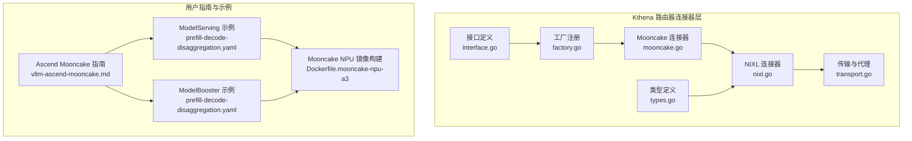
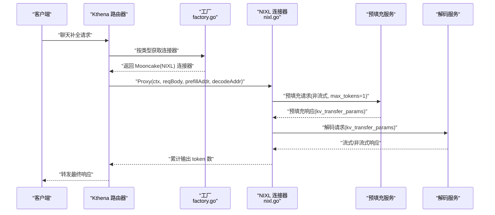
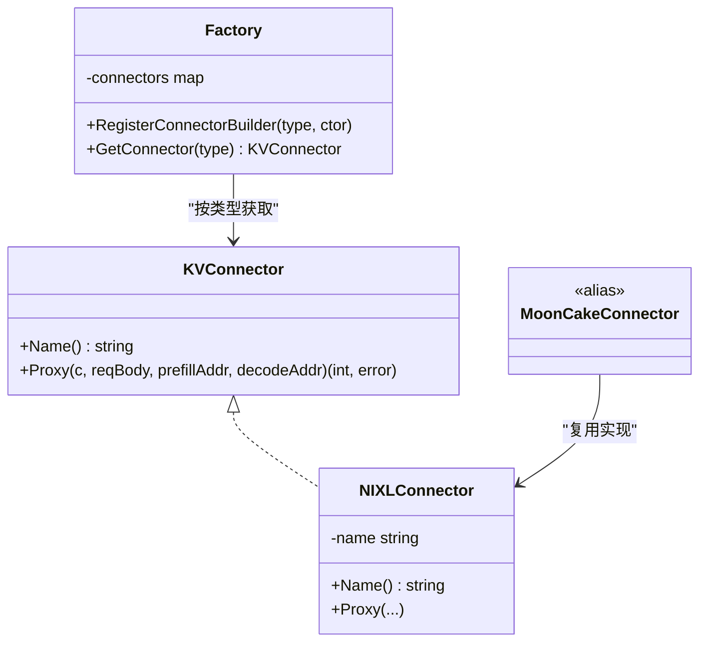
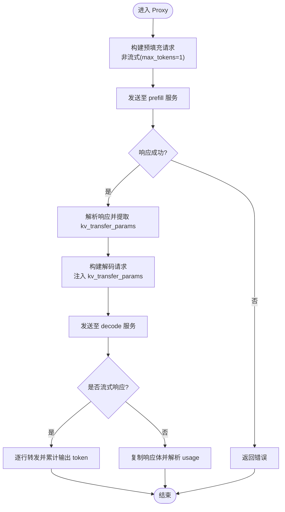
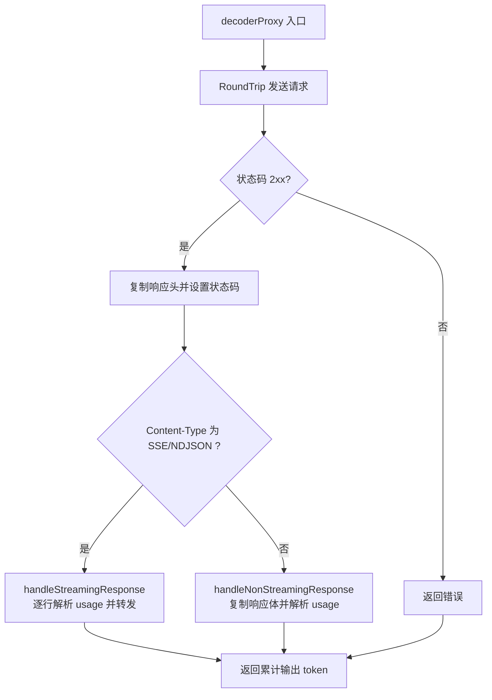
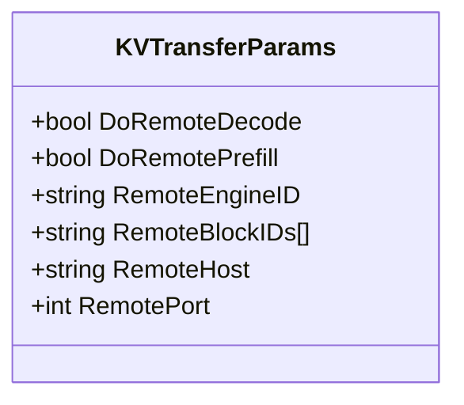
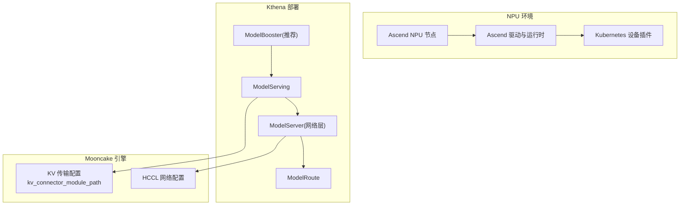
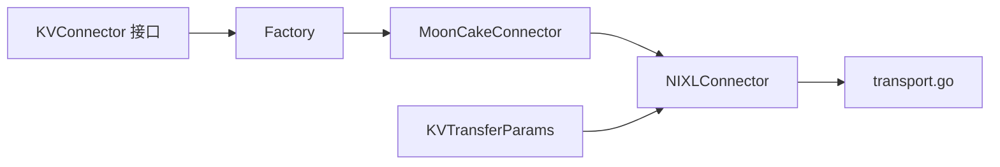

# Mooncake 连接器

<cite>
**本文引用的文件**
- [mooncake.go](file://pkg/kthena-router/connectors/mooncake.go)
- [nixl.go](file://pkg/kthena-router/connectors/nixl.go)
- [factory.go](file://pkg/kthena-router/connectors/factory.go)
- [interface.go](file://pkg/kthena-router/connectors/interface.go)
- [types.go](file://pkg/kthena-router/connectors/types.go)
- [transport.go](file://pkg/kthena-router/connectors/transport.go)
- [vllm-ascend-mooncake.md](file://docs/kthena/docs/user-guide/prefill-decode-disaggregation/vllm-ascend-mooncake.md)
- [prefill-decode-disaggregation.yaml（ModelServing）](file://examples/model-serving/prefill-decode-disaggregation.yaml)
- [Dockerfile.mooncake-npu-a3](file://docker/Dockerfile.mooncake-npu-a3)
- [prefill-decode-disaggregation.yaml（ModelBooster）](file://docs/kthena/docs/assets/examples/model-booster/prefill-decode-disaggregation.yaml)
</cite>

## 目录
1. [简介](#简介)
2. [项目结构](#项目结构)
3. [核心组件](#核心组件)
4. [架构总览](#架构总览)
5. [详细组件分析](#详细组件分析)
6. [依赖分析](#依赖分析)
7. [性能考虑](#性能考虑)
8. [故障排查指南](#故障排查指南)
9. [结论](#结论)
10. [附录](#附录)

## 简介
本技术文档聚焦于 Mooncake 连接器在 Kthena 预填充-解码（Prefill-Decode）解耦推理流水线中的作用与实现，重点阐述其与 Mooncake 引擎的交互机制、Ascend NPU 资源管理与加速推理流程、以及与 NIXL 连接器共享的实现复用关系。Mooncake 在 vLLM Ascend 场景中作为 KV 缓存传输层的关键组件，通过“生产者-消费者”角色分工与端口隔离，配合 HCCL 网络与 NPU 设备插件，实现高吞吐、低延迟的 NPU 加速推理。

## 项目结构
围绕 Mooncake 连接器的相关代码与文档主要分布在以下位置：
- 连接器接口与工厂：定义统一接口、注册与获取机制
- Mooncake 实现：基于 NIXL 的复用实现
- 传输与编解码代理：预填充与解码阶段的请求构建与响应转发
- 用户指南与示例：Ascend NPU 环境、部署步骤与配置要点
- 容器镜像：Mooncake 与 vLLM Ascend 的集成构建

**图表来源**
- [interface.go:23-31](file://pkg/kthena-router/connectors/interface.go#L23-L31)
- [factory.go:21-59](file://pkg/kthena-router/connectors/factory.go#L21-L59)
- [mooncake.go:19-25](file://pkg/kthena-router/connectors/mooncake.go#L19-L25)
- [nixl.go:34-46](file://pkg/kthena-router/connectors/nixl.go#L34-L46)
- [transport.go:33-78](file://pkg/kthena-router/connectors/transport.go#L33-L78)
- [types.go:19-27](file://pkg/kthena-router/connectors/types.go#L19-L27)
- [vllm-ascend-mooncake.md:1-292](file://docs/kthena/docs/user-guide/prefill-decode-disaggregation/vllm-ascend-mooncake.md#L1-L292)
- [prefill-decode-disaggregation.yaml（ModelServing）:1-256](file://examples/model-serving/prefill-decode-disaggregation.yaml#L1-L256)
- [Dockerfile.mooncake-npu-a3:1-26](file://docker/Dockerfile.mooncake-npu-a3#L1-L26)
- [prefill-decode-disaggregation.yaml（ModelBooster）:83-98](file://docs/kthena/docs/assets/examples/model-booster/prefill-decode-disaggregation.yaml#L83-L98)

**章节来源**
- [interface.go:23-31](file://pkg/kthena-router/connectors/interface.go#L23-L31)
- [factory.go:21-59](file://pkg/kthena-router/connectors/factory.go#L21-L59)
- [mooncake.go:19-25](file://pkg/kthena-router/connectors/mooncake.go#L19-L25)
- [nixl.go:34-46](file://pkg/kthena-router/connectors/nixl.go#L34-L46)
- [transport.go:33-78](file://pkg/kthena-router/connectors/transport.go#L33-L78)
- [types.go:19-27](file://pkg/kthena-router/connectors/types.go#L19-L27)
- [vllm-ascend-mooncake.md:1-292](file://docs/kthena/docs/user-guide/prefill-decode-disaggregation/vllm-ascend-mooncake.md#L1-L292)
- [prefill-decode-disaggregation.yaml（ModelServing）:1-256](file://examples/model-serving/prefill-decode-disaggregation.yaml#L1-L256)
- [Dockerfile.mooncake-npu-a3:1-26](file://docker/Dockerfile.mooncake-npu-a3#L1-L26)
- [prefill-decode-disaggregation.yaml（ModelBooster）:83-98](file://docs/kthena/docs/assets/examples/model-booster/prefill-decode-disaggregation.yaml#L83-L98)

## 核心组件
- KVConnector 接口：定义连接器的统一能力，包括名称与预填充-解码全流程代理方法。
- 工厂模式：按类型注册并获取连接器实例，默认 Mooncake 使用 NIXL 实现。
- NIXL 连接器：实现预填充与解码阶段的请求构建、KV 参数传递与流式响应转发。
- 传输与代理：封装预填充/解码阶段的 HTTP 调用、流式/非流式响应处理与令牌用量统计。
- 类型定义：KVTransferParams 用于承载跨阶段的 KV 传输参数。
- 文档与示例：Ascend NPU 环境准备、部署步骤、HCCL 网络配置与 Mooncake 连接器模块路径。

**章节来源**
- [interface.go:23-31](file://pkg/kthena-router/connectors/interface.go#L23-L31)
- [factory.go:21-59](file://pkg/kthena-router/connectors/factory.go#L21-L59)
- [nixl.go:53-112](file://pkg/kthena-router/connectors/nixl.go#L53-L112)
- [transport.go:48-78](file://pkg/kthena-router/connectors/transport.go#L48-L78)
- [types.go:19-27](file://pkg/kthena-router/connectors/types.go#L19-L27)
- [vllm-ascend-mooncake.md:44-53](file://docs/kthena/docs/user-guide/prefill-decode-disaggregation/vllm-ascend-mooncake.md#L44-L53)

## 架构总览
Mooncake 连接器在 Kthena 中以“MooncakeConnector”类型注册，实际运行时复用 NIXL 的实现逻辑，完成预填充阶段与解码阶段的串联。预填充阶段向 prefill 服务发送非流式请求以生成 KV 缓存；随后从预填充响应中提取 KV 传输参数，并将其注入到解码阶段请求中，再将解码阶段的流式响应逐行转发给客户端。

**图表来源**
- [factory.go:38-45](file://pkg/kthena-router/connectors/factory.go#L38-L45)
- [mooncake.go:21-24](file://pkg/kthena-router/connectors/mooncake.go#L21-L24)
- [nixl.go:53-112](file://pkg/kthena-router/connectors/nixl.go#L53-L112)
- [transport.go:33-78](file://pkg/kthena-router/connectors/transport.go#L33-L78)

## 详细组件分析

### 组件一：接口与工厂
- 接口 KVConnector：提供 Name 与 Proxy 方法，统一不同连接器的行为。
- 工厂 Factory：按类型注册连接器构造器，支持 HTTP、LMCache、MoonCake、NIXL、SGLang 等类型，默认 MoonCake 通过工厂映射到 MoonCakeConnector 构造函数。

**图表来源**
- [interface.go:23-31](file://pkg/kthena-router/connectors/interface.go#L23-L31)
- [factory.go:21-59](file://pkg/kthena-router/connectors/factory.go#L21-L59)
- [nixl.go:34-46](file://pkg/kthena-router/connectors/nixl.go#L34-L46)
- [mooncake.go:21-24](file://pkg/kthena-router/connectors/mooncake.go#L21-L24)

**章节来源**
- [interface.go:23-31](file://pkg/kthena-router/connectors/interface.go#L23-L31)
- [factory.go:21-59](file://pkg/kthena-router/connectors/factory.go#L21-L59)
- [mooncake.go:19-25](file://pkg/kthena-router/connectors/mooncake.go#L19-L25)

### 组件二：Mooncake 连接器（NIXL 复用）
- MoonCakeConnector 通过工厂注册为 ConnectorTypeMoonCake，内部直接复用 NIXLConnector 的实现，仅设置名称为 "mooncake"。
- 因此 Mooncake 的行为与 NIXL 一致：预填充阶段发送非流式请求，解码阶段携带 KV 传输参数并转发流式响应。

**图表来源**
- [mooncake.go:21-24](file://pkg/kthena-router/connectors/mooncake.go#L21-L24)
- [nixl.go:53-112](file://pkg/kthena-router/connectors/nixl.go#L53-L112)
- [transport.go:80-108](file://pkg/kthena-router/connectors/transport.go#L80-L108)
- [transport.go:147-173](file://pkg/kthena-router/connectors/transport.go#L147-L173)

**章节来源**
- [mooncake.go:19-25](file://pkg/kthena-router/connectors/mooncake.go#L19-L25)
- [nixl.go:53-112](file://pkg/kthena-router/connectors/nixl.go#L53-L112)
- [transport.go:80-108](file://pkg/kthena-router/connectors/transport.go#L80-L108)

### 组件三：传输与代理（预填充/解码）
- 预填充阶段：使用 prefillerProxy 发送请求，状态码异常即失败。
- 解码阶段：使用 decoderProxy 发送请求，根据 Content-Type 判断是否流式；流式场景逐行读取并解析 usage，非流式场景复制响应体并解析 usage。
- 请求体处理：预填充阶段移除流式字段并将 max_tokens 设置为 1；解码阶段根据是否流式决定是否添加 stream_options.include_usage 或 include_usage。

**图表来源**
- [transport.go:48-78](file://pkg/kthena-router/connectors/transport.go#L48-L78)
- [transport.go:175-205](file://pkg/kthena-router/connectors/transport.go#L175-L205)
- [transport.go:207-226](file://pkg/kthena-router/connectors/transport.go#L207-L226)

**章节来源**
- [transport.go:33-78](file://pkg/kthena-router/connectors/transport.go#L33-L78)
- [transport.go:80-108](file://pkg/kthena-router/connectors/transport.go#L80-L108)
- [transport.go:147-173](file://pkg/kthena-router/connectors/transport.go#L147-L173)

### 组件四：KV 传输参数与类型
- KVTransferParams：承载跨阶段的 KV 传输控制信息，如是否远程预填充/解码、远端主机与端口、远端引擎 ID 等。
- 在 Mooncake/NIXL 流程中，预填充响应会返回 kv_transfer_params，解码阶段将其注入请求体后转发。

**图表来源**
- [types.go:19-27](file://pkg/kthena-router/connectors/types.go#L19-L27)

**章节来源**
- [types.go:19-27](file://pkg/kthena-router/connectors/types.go#L19-L27)
- [nixl.go:140-144](file://pkg/kthena-router/connectors/nixl.go#L140-L144)

### 组件五：Ascend NPU 环境与部署配置
- 硬件与驱动：需要 Ascend NPU 节点、驱动与设备插件。
- 部署方式：推荐使用 ModelBooster 自动化管理；也可使用 ModelServing 手动组合 ModelServer/ModelRoute。
- 关键配置：
  - NPU 资源：huawei.com/ascend-1980
  - HCCL 网络：HCCL_IF_IP、HCCL_SOCKET_IFNAME 等环境变量
  - Mooncake 连接器模块路径：vllm_ascend.distributed.mooncake_connector
  - KV 传输配置：kv_connector、kv_buffer_device、kv_role、kv_parallel_size、kv_port、engine_id、kv_rank、kv_connector_extra_config

**图表来源**
- [vllm-ascend-mooncake.md:44-53](file://docs/kthena/docs/user-guide/prefill-decode-disaggregation/vllm-ascend-mooncake.md#L44-L53)
- [prefill-decode-disaggregation.yaml（ModelServing）:82-83](file://examples/model-serving/prefill-decode-disaggregation.yaml#L82-L83)
- [prefill-decode-disaggregation.yaml（ModelServing）:204-205](file://examples/model-serving/prefill-decode-disaggregation.yaml#L204-L205)
- [prefill-decode-disaggregation.yaml（ModelBooster）:87-97](file://docs/kthena/docs/assets/examples/model-booster/prefill-decode-disaggregation.yaml#L87-L97)

**章节来源**
- [vllm-ascend-mooncake.md:44-53](file://docs/kthena/docs/user-guide/prefill-decode-disaggregation/vllm-ascend-mooncake.md#L44-L53)
- [prefill-decode-disaggregation.yaml（ModelServing）:82-83](file://examples/model-serving/prefill-decode-disaggregation.yaml#L82-L83)
- [prefill-decode-disaggregation.yaml（ModelServing）:204-205](file://examples/model-serving/prefill-decode-disaggregation.yaml#L204-L205)
- [prefill-decode-disaggregation.yaml（ModelBooster）:87-97](file://docs/kthena/docs/assets/examples/model-booster/prefill-decode-disaggregation.yaml#L87-L97)

## 依赖分析
- Mooncake 连接器对 NIXL 的依赖：通过工厂注册与类型映射，MoonCakeConnector 实例在运行时等价于 NIXLConnector。
- NIXL 对传输层的依赖：依赖 transport.go 提供的预填充/解码代理函数与请求体处理工具。
- 接口与工厂：KVConnector 接口与 Factory 提供了连接器的可扩展性与多实现支持。

**图表来源**
- [interface.go:23-31](file://pkg/kthena-router/connectors/interface.go#L23-L31)
- [factory.go:38-45](file://pkg/kthena-router/connectors/factory.go#L38-L45)
- [mooncake.go:21-24](file://pkg/kthena-router/connectors/mooncake.go#L21-L24)
- [nixl.go:34-46](file://pkg/kthena-router/connectors/nixl.go#L34-L46)
- [transport.go:33-78](file://pkg/kthena-router/connectors/transport.go#L33-L78)
- [types.go:19-27](file://pkg/kthena-router/connectors/types.go#L19-L27)

**章节来源**
- [interface.go:23-31](file://pkg/kthena-router/connectors/interface.go#L23-L31)
- [factory.go:21-59](file://pkg/kthena-router/connectors/factory.go#L21-L59)
- [mooncake.go:19-25](file://pkg/kthena-router/connectors/mooncake.go#L19-L25)
- [nixl.go:34-46](file://pkg/kthena-router/connectors/nixl.go#L34-L46)
- [transport.go:33-78](file://pkg/kthena-router/connectors/transport.go#L33-L78)
- [types.go:19-27](file://pkg/kthena-router/connectors/types.go#L19-L27)

## 性能考虑
- 预填充阶段设置 max_tokens=1，减少首 token 计算开销，提升整体吞吐。
- 解码阶段采用流式响应转发，降低端到端延迟，同时在流式场景下按行解析 usage，避免额外的缓冲复制。
- NPU 环境下的 HCCL 网络配置与 Ascend 设备插件直接影响跨节点通信与显存带宽利用。
- ModelBooster/ModelServing 的资源分配与副本规模需结合模型大小与并发需求进行调优。

[本节为通用性能讨论，不直接分析具体文件]

## 故障排查指南
- 预填充/解码阶段状态码异常：检查预填充与解码服务健康状态与端口可达性。
- 缺失 kv_transfer_params：确认预填充响应中包含该字段，或检查 Mooncake 引擎配置。
- 流式响应未正确转发：核对 Content-Type 与流式解析逻辑，确保逐行转发与 usage 累计。
- NPU 环境问题：确认 Ascend 驱动、设备插件与 HCCL 网络配置正确，检查资源配额 huawei.com/ascend-1980 是否满足需求。

**章节来源**
- [transport.go:48-78](file://pkg/kthena-router/connectors/transport.go#L48-L78)
- [nixl.go:140-144](file://pkg/kthena-router/connectors/nixl.go#L140-L144)
- [vllm-ascend-mooncake.md:44-53](file://docs/kthena/docs/user-guide/prefill-decode-disaggregation/vllm-ascend-mooncake.md#L44-L53)

## 结论
Mooncake 连接器在 Kthena 中通过工厂注册与 NIXL 实现复用，提供了与 Ascend NPU 生态兼容的预填充-解码 KV 传输能力。结合 ModelBooster/ModelServing 的自动化与手动部署方案，以及 HCCL 网络与 NPU 资源配置，可在保证低延迟的同时最大化 NPU 计算与内存带宽效率。实际部署中应重点关注 Mooncake 引擎的 KV 传输配置、NPU 环境与网络连通性，以获得稳定且高性能的推理体验。

[本节为总结性内容，不直接分析具体文件]

## 附录
- 参考文档与示例：
  - Ascend Mooncake 指南与部署步骤
  - ModelServing/ModelBooster 的 KV 传输配置示例
  - Mooncake NPU 镜像构建脚本

**章节来源**
- [vllm-ascend-mooncake.md:1-292](file://docs/kthena/docs/user-guide/prefill-decode-disaggregation/vllm-ascend-mooncake.md#L1-L292)
- [prefill-decode-disaggregation.yaml（ModelServing）:1-256](file://examples/model-serving/prefill-decode-disaggregation.yaml#L1-L256)
- [Dockerfile.mooncake-npu-a3:1-26](file://docker/Dockerfile.mooncake-npu-a3#L1-L26)
- [prefill-decode-disaggregation.yaml（ModelBooster）:87-97](file://docs/kthena/docs/assets/examples/model-booster/prefill-decode-disaggregation.yaml#L87-L97)