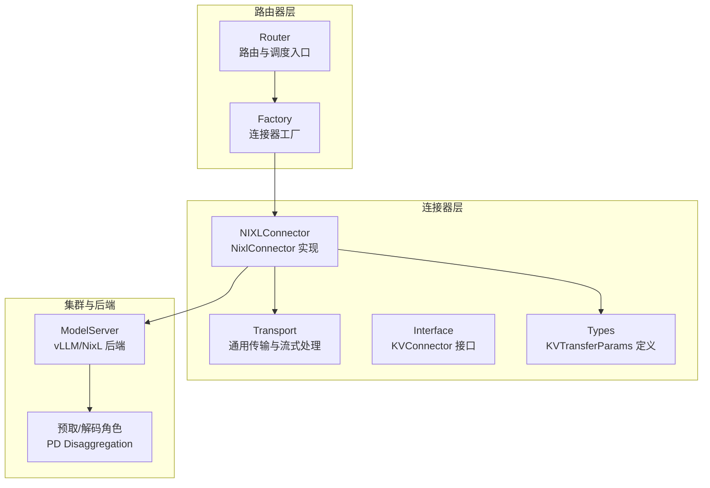
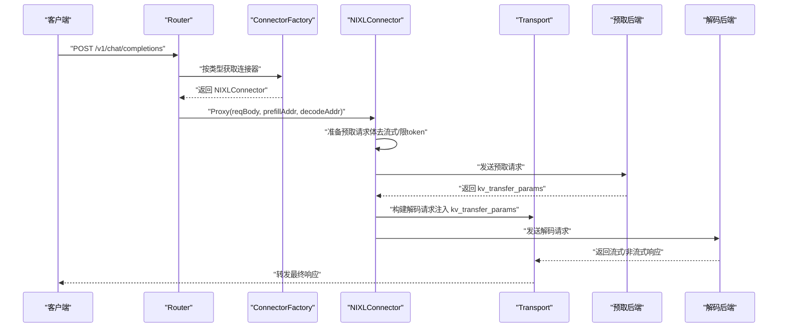
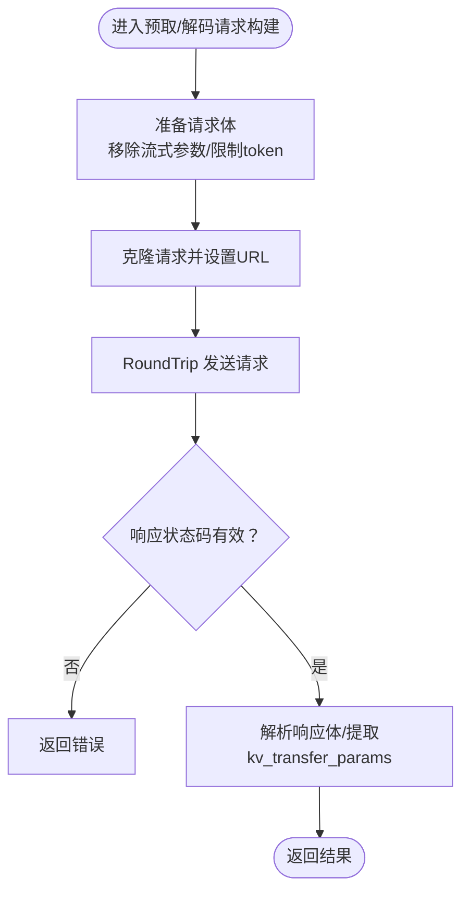
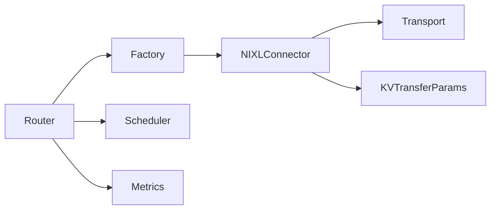

# NixL 连接器

<cite>
**本文引用的文件**
- [nixl.go](file://pkg/kthena-router/connectors/nixl.go)
- [nixl_test.go](file://pkg/kthena-router/connectors/nixl_test.go)
- [factory.go](file://pkg/kthena-router/connectors/factory.go)
- [types.go](file://pkg/kthena-router/connectors/types.go)
- [transport.go](file://pkg/kthena-router/connectors/transport.go)
- [interface.go](file://pkg/kthena-router/connectors/interface.go)
- [mooncake.go](file://pkg/kthena-router/connectors/mooncake.go)
- [router.go](file://pkg/kthena-router/router/router.go)
- [modelserver_types.go](file://pkg/apis/networking/v1alpha1/modelserver_types.go)
- [Qwen3-Coder-30B-A3B-Instruct-PD-Disaggregated-NixlConnector.yaml](file://cli/kthena/helm/templates/Qwen/Qwen3-Coder-30B-A3B-Instruct-PD-Disaggregated-NixlConnector.yaml)
- [vllm-pd-disaggregation.md](file://docs/kthena/docs/user-guide/prefill-decode-disaggregation/vllm-pd-disaggregation.md)
- [model-deployment.md](file://docs/kthena/docs/user-guide/model-deployment.md)
- [multi-node-inference.md](file://docs/kthena/docs/user-guide/multi-node-inference.md)
- [data-parallel-deployment.md](file://docs/kthena/docs/general/data-parallel-deployment.md)
</cite>

## 目录
1. [简介](#简介)
2. [项目结构](#项目结构)
3. [核心组件](#核心组件)
4. [架构总览](#架构总览)
5. [详细组件分析](#详细组件分析)
6. [依赖分析](#依赖分析)
7. [性能考虑](#性能考虑)
8. [故障排查指南](#故障排查指南)
9. [结论](#结论)
10. [附录](#附录)

## 简介
本文件面向 Kthena 的 NixL 连接器，系统性阐述其在分布式推理中的作用与实现原理，覆盖以下主题：
- NixL 推理引擎的分布式架构与 KV 缓存跨阶段传输机制
- 节点管理与任务调度（结合 Kthena 路由器与调度器）
- 与 NixL 集群的通信方式、负载均衡与故障转移策略
- 分布式特性：数据并行与模型并行支持
- 集群配置、网络拓扑与性能优化建议
- 分布式部署最佳实践与运维管理指南

## 项目结构
NixL 连接器位于 kthena 路由器子系统中，作为 KV 缓存传输的桥接层，负责预取（prefill）与解码（decode）阶段之间的参数传递与流式响应处理。



图示来源
- [router.go:156-169](file://pkg/kthena-router/router/router.go#L156-L169)
- [factory.go:48-59](file://pkg/kthena-router/connectors/factory.go#L48-L59)
- [nixl.go:34-46](file://pkg/kthena-router/connectors/nixl.go#L34-L46)
- [transport.go:48-78](file://pkg/kthena-router/connectors/transport.go#L48-L78)
- [types.go:19-27](file://pkg/kthena-router/connectors/types.go#L19-L27)

章节来源
- [router.go:156-169](file://pkg/kthena-router/router/router.go#L156-L169)
- [factory.go:48-59](file://pkg/kthena-router/connectors/factory.go#L48-L59)

## 核心组件
- KVConnector 接口：统一抽象不同 KV 缓存传输实现（HTTP、NIXL、LMCache、MoonCake 等），定义名称与代理方法。
- NIXLConnector：基于 NixL 的高性能内存 KV 缓存传输实现，负责预取与解码阶段的参数透传与流式响应处理。
- Transport 工具：封装预取/解码请求构建、流式响应解析与转发、令牌用量统计等通用逻辑。
- Factory：连接器工厂，按类型注册与获取具体连接器实例。
- 类型定义：KVTransferParams 描述跨阶段传输所需的远程执行参数。

章节来源
- [interface.go:23-31](file://pkg/kthena-router/connectors/interface.go#L23-L31)
- [nixl.go:34-46](file://pkg/kthena-router/connectors/nixl.go#L34-L46)
- [transport.go:80-145](file://pkg/kthena-router/connectors/transport.go#L80-L145)
- [factory.go:48-59](file://pkg/kthena-router/connectors/factory.go#L48-L59)
- [types.go:19-27](file://pkg/kthena-router/connectors/types.go#L19-L27)

## 架构总览
NixL 连接器在 Kthena 中承担“预取-解码”两阶段协调职责：
- 预取阶段：向预取后端发送精简后的请求（移除流式参数、限制 max_tokens/max_completion_tokens），获取 kv_transfer_params。
- 解码阶段：将 kv_transfer_params 注入解码请求，向解码后端发起请求，并通过 decoderProxy 处理解码阶段的流式响应。



图示来源
- [router.go:156-169](file://pkg/kthena-router/router/router.go#L156-L169)
- [factory.go:48-59](file://pkg/kthena-router/connectors/factory.go#L48-L59)
- [nixl.go:53-112](file://pkg/kthena-router/connectors/nixl.go#L53-L112)
- [transport.go:48-78](file://pkg/kthena-router/connectors/transport.go#L48-L78)

## 详细组件分析

### NIXLConnector 组件
- 名称与职责：实现 KVConnector 接口，负责预取-解码两阶段的 KV 参数透传与响应处理。
- 预取阶段：构建精简请求体（移除流式参数、限制 token 数），调用 prefill 并解析返回的 kv_transfer_params。
- 解码阶段：将 kv_transfer_params 注入解码请求，调用 decode 并通过 decoderProxy 处理流式输出。
- 请求体保护：使用深拷贝避免对上游请求体的副作用；在重试场景下确保请求体未被提前消耗。

```mermaid
classDiagram
class KVConnector {
+Name() string
+Proxy(c, reqBody, prefillAddr, decodeAddr) (int, error)
}
class NIXLConnector {
-name string
-prefillRequest *http.Request
-decodeRequestBody map[string]interface{}
+Name() string
+Proxy(c, reqBody, prefillAddr, decodeAddr) (int, error)
-prefill(req, addr) (interface{}, error)
-buildDecodeRequest(c, reqBody, kvTransferParams) *http.Request
-decode(c, req, addr) (int, error)
}
class KVTransferParams {
+DoRemoteDecode bool
+DoRemotePrefill bool
+RemoteEngineID *string
+RemoteBlockIDs []string
+RemoteHost *string
+RemotePort *int
}
KVConnector <|.. NIXLConnector
NIXLConnector --> KVTransferParams : "使用"
```

图示来源
- [interface.go:23-31](file://pkg/kthena-router/connectors/interface.go#L23-L31)
- [nixl.go:34-46](file://pkg/kthena-router/connectors/nixl.go#L34-L46)
- [types.go:19-27](file://pkg/kthena-router/connectors/types.go#L19-L27)

章节来源
- [nixl.go:53-112](file://pkg/kthena-router/connectors/nixl.go#L53-L112)
- [nixl.go:114-173](file://pkg/kthena-router/connectors/nixl.go#L114-L173)
- [nixl.go:175-204](file://pkg/kthena-router/connectors/nixl.go#L175-L204)

### Transport 工具与流式处理
- 预取/解码通用代理：统一处理 RoundTrip、状态码校验与错误传播。
- 请求体准备：在预取阶段移除流式参数并限制 token 数；在解码阶段根据是否流式决定 include_usage 或 stream_options.include_usage。
- 流式响应处理：识别 SSE/NDJSON，逐行解析并累计完成 token 数，支持过滤 usage 输出或直接透传。



图示来源
- [transport.go:80-108](file://pkg/kthena-router/connectors/transport.go#L80-L108)
- [transport.go:109-123](file://pkg/kthena-router/connectors/transport.go#L109-L123)
- [transport.go:125-145](file://pkg/kthena-router/connectors/transport.go#L125-L145)
- [transport.go:169-205](file://pkg/kthena-router/connectors/transport.go#L169-L205)

章节来源
- [transport.go:33-78](file://pkg/kthena-router/connectors/transport.go#L33-L78)
- [transport.go:80-145](file://pkg/kthena-router/connectors/transport.go#L80-L145)
- [transport.go:169-227](file://pkg/kthena-router/connectors/transport.go#L169-L227)

### 连接器工厂与 MoonCake 兼容
- 工厂注册：默认注册 HTTP、LMCache、NIXL、MoonCake、SGLang 等连接器类型。
- MoonCake 兼容：MoonCakeConnector 在当前实现中复用 NIXLConnector，行为一致。

章节来源
- [factory.go:48-59](file://pkg/kthena-router/connectors/factory.go#L48-L59)
- [mooncake.go:19-25](file://pkg/kthena-router/connectors/mooncake.go#L19-L25)

### 路由器与调度集成
- 路由器初始化：创建调度器、鉴权器、速率限制器、访问日志与指标模块，同时初始化连接器工厂。
- 公平调度与优先级：支持基于令牌数与请求数的公平调度权重配置，用于排队与优先级计算。

章节来源
- [router.go:91-169](file://pkg/kthena-router/router/router.go#L91-L169)

## 依赖分析
- 组件耦合：NIXLConnector 依赖 Transport 工具与 KVTransferParams 类型；Router 通过 Factory 获取连接器实例。
- 外部依赖：HTTP RoundTrip、Gin 上下文、Kthena 指标模块。
- 可能的循环依赖：当前文件间无循环导入；接口与实现分离清晰。



图示来源
- [router.go:156-169](file://pkg/kthena-router/router/router.go#L156-L169)
- [factory.go:48-59](file://pkg/kthena-router/connectors/factory.go#L48-L59)
- [nixl.go:34-46](file://pkg/kthena-router/connectors/nixl.go#L34-L46)
- [transport.go:48-78](file://pkg/kthena-router/connectors/transport.go#L48-L78)
- [types.go:19-27](file://pkg/kthena-router/connectors/types.go#L19-L27)

章节来源
- [router.go:156-169](file://pkg/kthena-router/router/router.go#L156-L169)
- [factory.go:48-59](file://pkg/kthena-router/connectors/factory.go#L48-L59)

## 性能考虑
- 预取阶段最小化：移除流式参数与限制 max_tokens/max_completion_tokens，降低预取阶段的 KV 写入与网络开销。
- 流式响应优化：仅在需要时注入 usage，减少额外解析成本；在 SSE/NDJSON 场景下逐行解析，避免一次性缓冲大块数据。
- 指标与度量：通过 Router 中的指标模块记录预取/解码阶段耗时与并发，请结合 Prometheus/Grafana 观测关键指标。
- 资源与网络：结合多节点推理与网络拓扑感知调度，降低跨节点通信延迟。

章节来源
- [transport.go:80-145](file://pkg/kthena-router/connectors/transport.go#L80-L145)
- [transport.go:169-227](file://pkg/kthena-router/connectors/transport.go#L169-L227)
- [multi-node-inference.md:352-374](file://docs/kthena/docs/user-guide/multi-node-inference.md#L352-L374)

## 故障排查指南
- 预取失败：检查预取后端健康状态与网络连通性；确认 kv_transfer_params 是否返回；关注日志中的状态码与错误信息。
- 解码失败：确认解码后端可用性与地址正确性；核对 kv_transfer_params 注入是否成功。
- 流式问题：若出现 usage 重复或缺失，检查 stream_options.include_usage 设置与上下文标记。
- 重试与请求体泄漏：测试用例验证了在重试场景下请求体不会被提前消耗，且原始请求体不被修改，可据此定位问题。

章节来源
- [nixl_test.go:381-431](file://pkg/kthena-router/connectors/nixl_test.go#L381-L431)
- [nixl_test.go:433-464](file://pkg/kthena-router/connectors/nixl_test.go#L433-L464)
- [nixl.go:114-145](file://pkg/kthena-router/connectors/nixl.go#L114-L145)

## 结论
NixL 连接器通过“预取-解码”两阶段的 KV 参数透传与流式响应处理，在 Kthena 中实现了高性能、低延迟的分布式推理路径。结合路由器的调度与工厂化的连接器管理，以及多节点推理与网络拓扑调度能力，能够满足大规模 LLM 推理的高吞吐与低时延需求。建议在生产环境中配合指标监控、合理的资源与网络规划，以及严格的故障演练，持续优化整体性能与稳定性。

## 附录

### 集群配置与网络拓扑
- vLLM PD Disaggregation 示例：预取与解码分别运行独立容器，使用 NixlConnector 作为 KV 传输后端。
- 多节点推理：通过 ModelServing 定义 ServingGroup、Role 与 Pod 的层次关系，结合 Volcano Gang 调度与网络拓扑插件，实现跨节点协同。
- 数据并行：通过 ModelBooster 与 vLLM 的数据并行配置，实现多副本横向扩展与负载分担。

章节来源
- [vllm-pd-disaggregation.md:20-209](file://docs/kthena/docs/user-guide/prefill-decode-disaggregation/vllm-pd-disaggregation.md#L20-L209)
- [multi-node-inference.md:15-82](file://docs/kthena/docs/user-guide/multi-node-inference.md#L15-L82)
- [data-parallel-deployment.md:1-121](file://docs/kthena/docs/general/data-parallel-deployment.md#L1-L121)

### 与 NixL 集群的通信与部署要点
- KV 传输配置：在 vLLM 启动参数中指定 kv-transfer-config，启用 NixlConnector 并声明 kv_role（如 kv_both、kv_producer、kv_consumer）。
- Side Channel：通过环境变量配置 NixL 侧通道主机与端口，确保预取/解码节点间的 KV 传输通道可用。
- Helm 模板示例：模板中展示了 kv-transfer-config 的典型配置项与 GPU 资源限制。

章节来源
- [model-deployment.md:249-440](file://docs/kthena/docs/user-guide/model-deployment.md#L249-L440)
- [Qwen3-Coder-30B-A3B-Instruct-PD-Disaggregated-NixlConnector.yaml:35-43](file://cli/kthena/helm/templates/Qwen/Qwen3-Coder-30B-A3B-Instruct-PD-Disaggregated-NixlConnector.yaml#L35-L43)