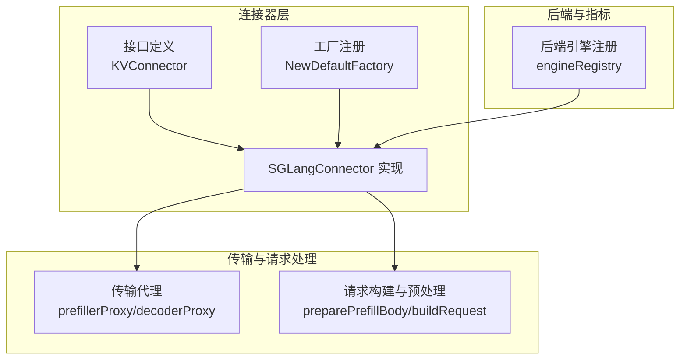
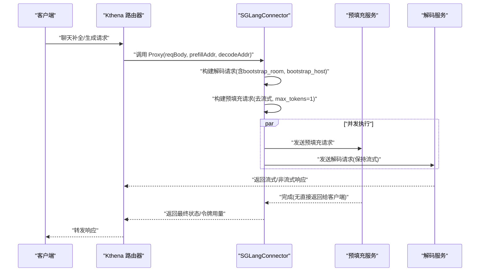
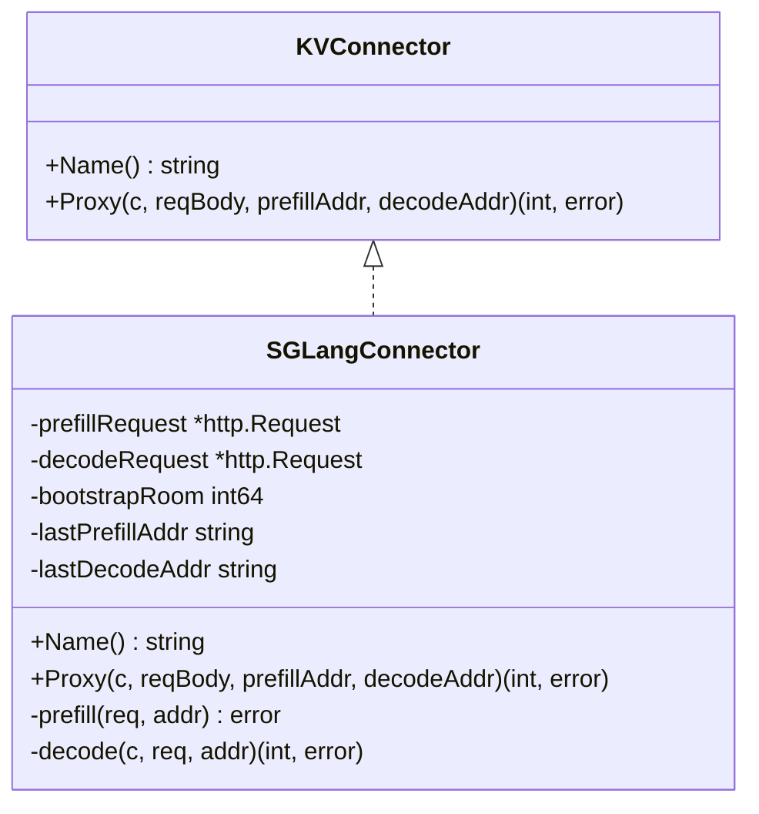
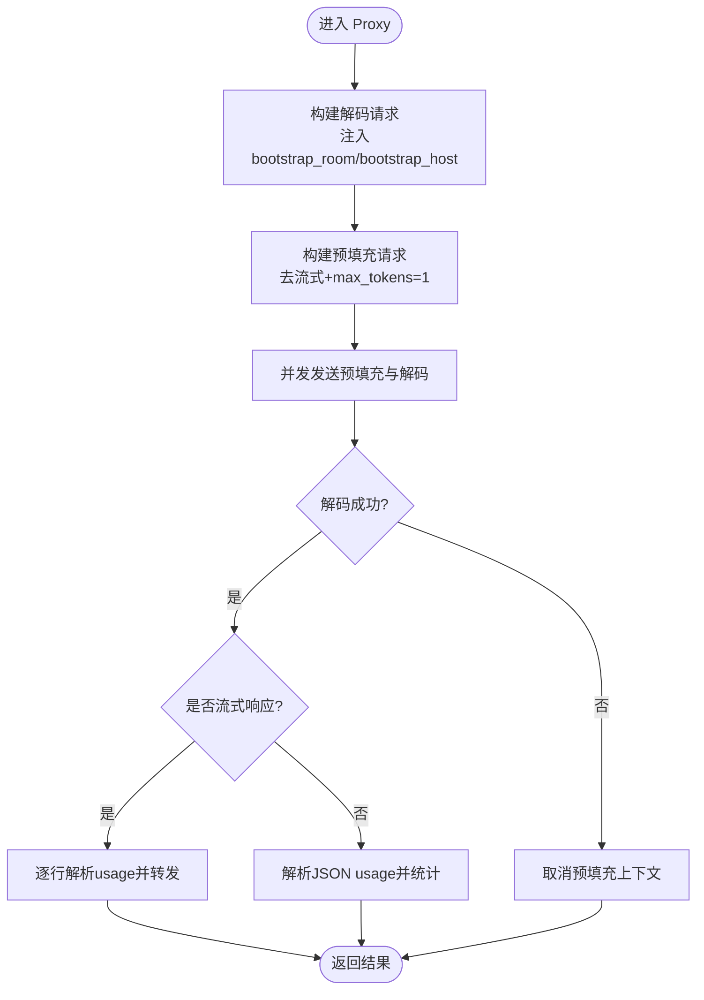
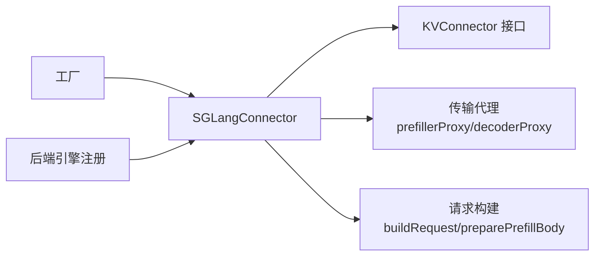

# SGLang 连接器

<cite>
**本文引用的文件**
- [sglang.go](file://pkg/kthena-router/connectors/sglang.go)
- [factory.go](file://pkg/kthena-router/connectors/factory.go)
- [interface.go](file://pkg/kthena-router/connectors/interface.go)
- [types.go](file://pkg/kthena-router/connectors/types.go)
- [transport.go](file://pkg/kthena-router/connectors/transport.go)
- [backend.go](file://pkg/kthena-router/backend/backend.go)
- [ModelServer-sglang.yaml](file://examples/kthena-router/ModelServer-sglang.yaml)
- [LLM-Mock-sglang.yaml](file://examples/kthena-router/LLM-Mock-sglang.yaml)
- [sglang-pd-disaggregation.md](file://docs/kthena/docs/user-guide/prefill-decode-disaggregation/sglang-pd-disaggregation.md)
</cite>

## 目录
1. [简介](#简介)
2. [项目结构](#项目结构)
3. [核心组件](#核心组件)
4. [架构总览](#架构总览)
5. [详细组件分析](#详细组件分析)
6. [依赖分析](#依赖分析)
7. [性能考虑](#性能考虑)
8. [故障排查指南](#故障排查指南)
9. [结论](#结论)
10. [附录](#附录)

## 简介
本技术文档面向 SGLang 连接器，系统性阐述其在 Kthena 路由器中的实现原理、与 SGLang 引擎的通信协议、模型管理与推理优化策略，以及与 vLLM 等其他引擎的对比与选型建议。重点覆盖以下方面：
- SGLang 预填充（Prefill）与解码（Decode）阶段的拆分推理机制与 KV 缓存传递协议
- 连接器如何构建预填充与解码请求、并发调度与错误回退
- 请求路由逻辑、响应处理流程与令牌用量统计
- SGLang 特有功能特性、性能优势与适用场景
- SGLang 连接器的配置指南、部署要求与性能调优建议
- 与 vLLM 的对比分析与选择建议

## 项目结构
SGLang 连接器位于路由器模块中，围绕“连接器接口—工厂注册—传输代理—后端指标”四个层面组织代码，并通过示例与文档提供部署与验证参考。

图表来源
- [sglang.go:42-221](file://pkg/kthena-router/connectors/sglang.go#L42-L221)
- [factory.go:47-59](file://pkg/kthena-router/connectors/factory.go#L47-L59)
- [transport.go:33-108](file://pkg/kthena-router/connectors/transport.go#L33-L108)
- [backend.go:37-40](file://pkg/kthena-router/backend/backend.go#L37-L40)

章节来源
- [sglang.go:42-221](file://pkg/kthena-router/connectors/sglang.go#L42-L221)
- [factory.go:21-59](file://pkg/kthena-router/connectors/factory.go#L21-L59)
- [transport.go:33-108](file://pkg/kthena-router/connectors/transport.go#L33-L108)
- [backend.go:37-40](file://pkg/kthena-router/backend/backend.go#L37-L40)

## 核心组件
- KVConnector 接口：统一抽象不同引擎的 KV 缓存协调与请求代理能力，定义名称与完整预填充-解码代理方法。
- SGLangConnector：实现 SGLang 拆分推理的连接器，负责并发调度预填充与解码、构建请求体、注入引导参数（bootstrap_room、bootstrap_host）、并发控制与错误回退。
- 工厂模式：默认注册 SGLang 连接器，按类型动态获取连接器实例。
- 传输代理：封装预填充与解码阶段的 HTTP 转发、流式/非流式响应处理、令牌用量解析与统计。
- 后端引擎注册：将 SGLang 与 vLLM 的指标采集提供者注册到统一入口，便于运行时查询。

章节来源
- [interface.go:23-31](file://pkg/kthena-router/connectors/interface.go#L23-L31)
- [sglang.go:42-221](file://pkg/kthena-router/connectors/sglang.go#L42-L221)
- [factory.go:47-59](file://pkg/kthena-router/connectors/factory.go#L47-L59)
- [transport.go:33-227](file://pkg/kthena-router/connectors/transport.go#L33-L227)
- [backend.go:37-82](file://pkg/kthena-router/backend/backend.go#L37-L82)

## 架构总览
SGLang 连接器在路由层完成请求的预处理与并发调度，确保预填充与解码阶段同时在途，以满足 SGLang 的 KV 缓存传递协议。整体交互如下：

图表来源
- [sglang.go:86-195](file://pkg/kthena-router/connectors/sglang.go#L86-L195)
- [transport.go:48-78](file://pkg/kthena-router/connectors/transport.go#L48-L78)

章节来源
- [sglang.go:72-195](file://pkg/kthena-router/connectors/sglang.go#L72-L195)
- [transport.go:33-78](file://pkg/kthena-router/connectors/transport.go#L33-L78)

## 详细组件分析

### SGLangConnector 类与协议
- 关键字段
  - 预填充/解码请求缓存与地址记忆，避免重复构造
  - 唯一引导房间号（bootstrap_room），用于 KV 缓存交换的键
  - 解码阶段所需的预填充主机（bootstrap_host），指向预填充服务的 IP
- 并发与超时控制
  - 预填充阶段使用带取消的上下文，一旦解码失败立即取消，防止悬挂等待
  - 同时启动预填充与解码，保证解码接收方能先连接预填充的引导服务器完成元数据交换
- 请求体改造
  - 预填充：移除流式参数，强制 max_tokens/max_completion_tokens 为 1，仅做 KV 预热
  - 解码：保留流式参数与原始 token 上限，注入令牌用量统计开关
- 错误处理
  - 预填充失败或解码失败均记录错误并返回相应状态
  - 通过 metricsRecorder 记录各阶段状态与活跃上游请求数

图表来源
- [interface.go:23-31](file://pkg/kthena-router/connectors/interface.go#L23-L31)
- [sglang.go:50-70](file://pkg/kthena-router/connectors/sglang.go#L50-L70)

章节来源
- [sglang.go:42-221](file://pkg/kthena-router/connectors/sglang.go#L42-L221)

### 请求构建与传输代理
- 预填充请求构建
  - 移除流式参数与流式选项，设置 max_tokens/max_completion_tokens 为 1
  - 仅发送必要的 KV 预热信息，不进行实际生成
- 解码请求构建
  - 保留流式参数与原始 token 上限
  - 注入令牌用量统计（流式时添加 stream_options.include_usage；非流式时添加 include_usage）
- 传输代理
  - 预填充代理：直接转发至预填充服务，校验状态码
  - 解码代理：根据 Content-Type 判断是否为流式响应，分别处理
  - 流式响应：逐行解析，提取令牌用量并可选择过滤 usage 行
  - 非流式响应：解析 JSON 中的 usage 字段，统计完成令牌数

图表来源
- [sglang.go:86-195](file://pkg/kthena-router/connectors/sglang.go#L86-L195)
- [transport.go:80-227](file://pkg/kthena-router/connectors/transport.go#L80-L227)

章节来源
- [transport.go:33-227](file://pkg/kthena-router/connectors/transport.go#L33-L227)

### 工厂与类型注册
- 工厂注册
  - 默认注册 SGLang 连接器，类型常量 ConnectorTypeSGLang 作为内部标识
  - 若未找到对应类型，默认回退为 HTTP 连接器
- 类型定义
  - KVTransferParams 提供跨阶段 KV 传输参数的结构化描述（如远端解码/预填充开关、远端主机与端口等）

章节来源
- [factory.go:21-59](file://pkg/kthena-router/connectors/factory.go#L21-L59)
- [types.go:19-27](file://pkg/kthena-router/connectors/types.go#L19-L27)

### 后端引擎与指标
- 引擎注册
  - 将 SGLang 与 vLLM 的指标提供者注册到统一映射表
- 指标采集
  - 支持按引擎获取 Pod 指标、模型列表，合并计数与直方图指标

章节来源
- [backend.go:37-82](file://pkg/kthena-router/backend/backend.go#L37-L82)

## 依赖分析
SGLang 连接器与其他模块的耦合关系如下：

图表来源
- [sglang.go:42-221](file://pkg/kthena-router/connectors/sglang.go#L42-L221)
- [factory.go:47-59](file://pkg/kthena-router/connectors/factory.go#L47-L59)
- [transport.go:33-108](file://pkg/kthena-router/connectors/transport.go#L33-L108)
- [backend.go:37-40](file://pkg/kthena-router/backend/backend.go#L37-L40)

章节来源
- [sglang.go:42-221](file://pkg/kthena-router/connectors/sglang.go#L42-L221)
- [factory.go:21-59](file://pkg/kthena-router/connectors/factory.go#L21-L59)
- [transport.go:33-108](file://pkg/kthena-router/connectors/transport.go#L33-L108)
- [backend.go:37-40](file://pkg/kthena-router/backend/backend.go#L37-L40)

## 性能考虑
- 并发与时序
  - 预填充与解码必须同时在途，避免预填充因无法建立 KV 缓存交换而超时中止
  - 使用带取消的上下文，一旦解码失败立即终止预填充，减少资源浪费
- 请求体精简
  - 预填充阶段仅保留最小必要参数，降低网络与计算开销
- 流式处理
  - 解码阶段采用流式传输，结合令牌用量解析，提升可观测性与用户体验
- 指标采集
  - 通过后端引擎注册统一采集计数与直方图指标，辅助容量规划与性能优化

## 故障排查指南
- 预填充超时或报错
  - 症状：预填充阶段超时或返回错误
  - 可能原因：解码请求尚未到达，预填充引导服务器未被连接
  - 处理建议：确认并发调度已正确启动，检查解码请求是否携带 bootstrap_host 与 bootstrap_room
- 解码失败
  - 症状：解码阶段返回非 2xx 状态码
  - 处理建议：查看解码服务日志，确认模型加载与端口可达性
- 令牌用量异常
  - 症状：usage 统计缺失或不准确
  - 处理建议：确保流式请求启用 include_usage 或 stream_options.include_usage；非流式请求启用 include_usage

章节来源
- [sglang.go:80-85](file://pkg/kthena-router/connectors/sglang.go#L80-L85)
- [transport.go:175-227](file://pkg/kthena-router/connectors/transport.go#L175-L227)

## 结论
SGLang 连接器通过严格的并发调度与请求体改造，满足 SGLang 拆分推理的 KV 缓存传递协议，确保预填充与解码阶段的时序一致性。配合流式响应与令牌用量统计，提升了可观测性与用户体验。工厂与后端引擎注册机制使扩展与运维更加灵活。在需要强 KV 缓存复用与低延迟首 token 场景下，SGLang 连接器具备明显优势；若更关注吞吐与通用兼容性，可评估 vLLM 方案。

## 附录

### SGLang 连接器配置与部署指南
- 示例资源
  - ModelServer（SGLang）：定义工作负载选择器、端口、模型名、推理引擎类型与流量策略
  - LLM Mock（SGLang）：演示如何暴露与 SGLang 兼容的 Prometheus 指标端点
- 文档指引
  - 官方用户指南提供了基于 ModelServing 的 SGLang 预填充-解码拆分部署步骤与验证命令

章节来源
- [ModelServer-sglang.yaml:1-16](file://examples/kthena-router/ModelServer-sglang.yaml#L1-L16)
- [LLM-Mock-sglang.yaml:1-28](file://examples/kthena-router/LLM-Mock-sglang.yaml#L1-L28)
- [sglang-pd-disaggregation.md:1-227](file://docs/kthena/docs/user-guide/prefill-decode-disaggregation/sglang-pd-disaggregation.md#L1-L227)

### 与 vLLM 的对比与选型建议
- 协议与机制
  - SGLang：依赖预填充-解码拆分与引导服务器进行 KV 缓存交换，强调严格的并发与时序
  - vLLM：通常以内建的 KV 缓存管理与流式生成为主，协议相对简化
- 适用场景
  - SGLang：对首 token 延迟敏感、需要强 KV 缓存复用与精细时序控制的场景
  - vLLM：通用大模型推理、吞吐优先、部署与生态兼容性要求较高的场景
- 选型建议
  - 若业务目标是极致首 token 体验且具备 GPU 集群与运维能力，优先 SGLang
  - 若追求稳定吞吐与生态兼容，优先 vLLM

章节来源
- [backend.go:37-40](file://pkg/kthena-router/backend/backend.go#L37-L40)
- [sglang-pd-disaggregation.md:1-227](file://docs/kthena/docs/user-guide/prefill-decode-disaggregation/sglang-pd-disaggregation.md#L1-L227)