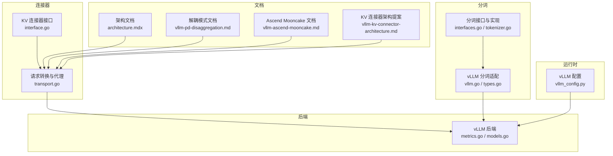
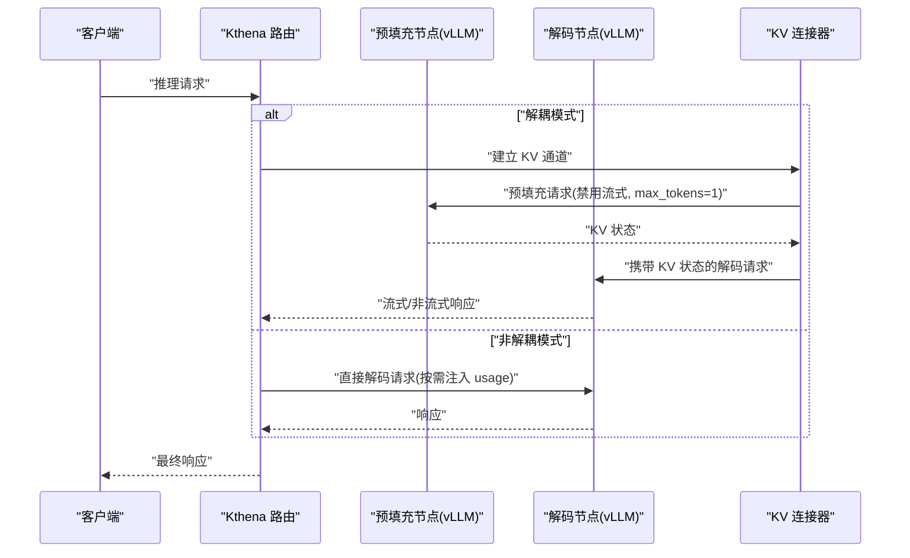
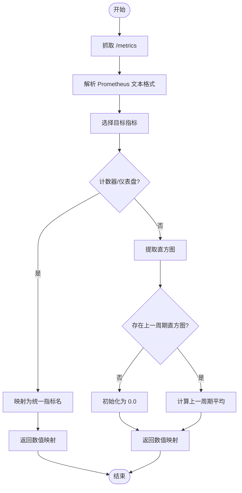
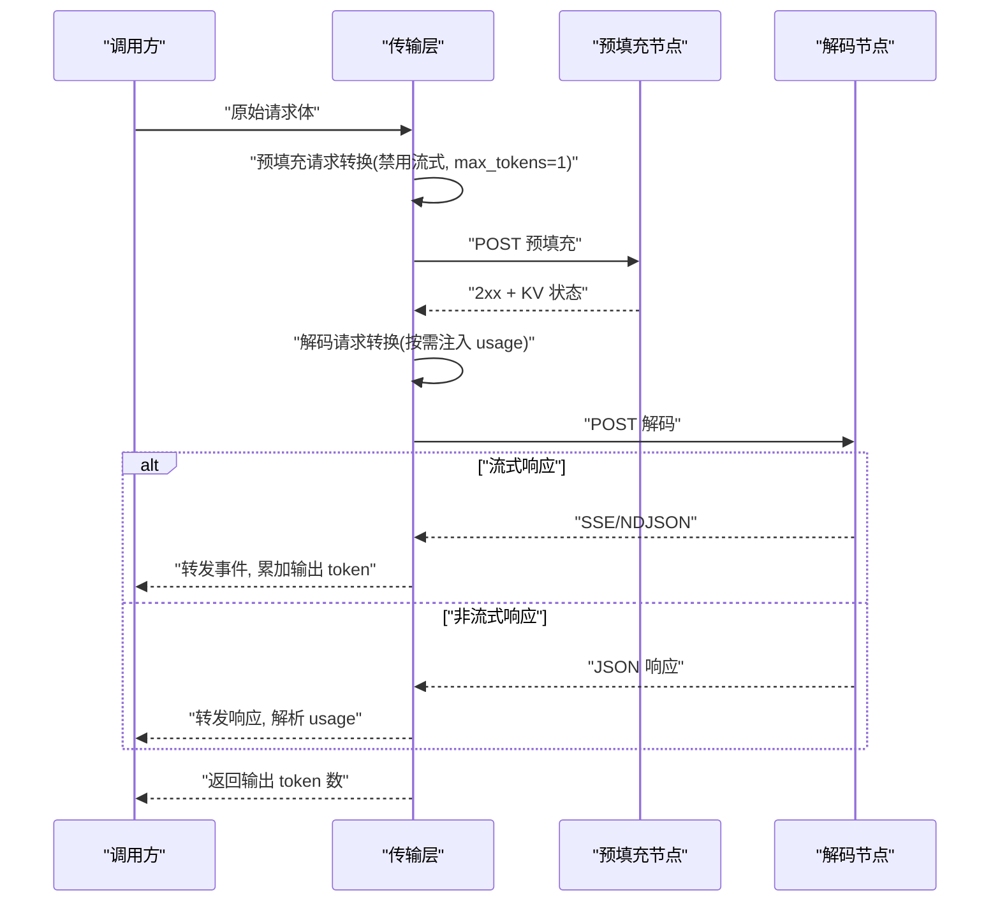
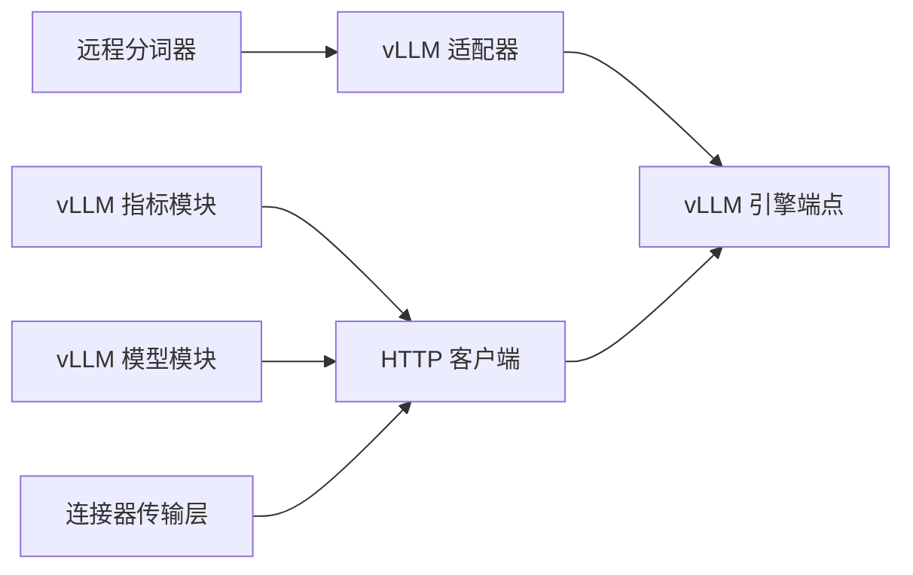

# vLLM 连接器

<cite>
**本文引用的文件**
- [pkg/kthena-router/backend/vllm/metrics.go](file://pkg/kthena-router/backend/vllm/metrics.go)
- [pkg/kthena-router/backend/vllm/models.go](file://pkg/kthena-router/backend/vllm/models.go)
- [pkg/kthena-router/connectors/interface.go](file://pkg/kthena-router/connectors/interface.go)
- [pkg/kthena-router/connectors/transport.go](file://pkg/kthena-router/connectors/transport.go)
- [pkg/kthena-router/connectors/transport_test.go](file://pkg/kthena-router/connectors/transport_test.go)
- [pkg/kthena-router/scheduler/plugins/tokenization/vllm.go](file://pkg/kthena-router/scheduler/plugins/tokenization/vllm.go)
- [pkg/kthena-router/scheduler/plugins/tokenization/interfaces.go](file://pkg/kthena-router/scheduler/plugins/tokenization/interfaces.go)
- [pkg/kthena-router/scheduler/plugins/tokenization/tokenizer.go](file://pkg/kthena-router/scheduler/plugins/tokenization/tokenizer.go)
- [pkg/kthena-router/scheduler/plugins/tokenization/types.go](file://pkg/kthena-router/scheduler/plugins/tokenization/types.go)
- [python/kthena/runtime/vllm_config.py](file://python/kthena/runtime/vllm_config.py)
- [docs/kthena/docs/architecture/architecture.mdx](file://docs/kthena/docs/architecture/architecture.mdx)
- [docs/kthena/docs/user-guide/prefill-decode-disaggregation/vllm-pd-disaggregation.md](file://docs/kthena/docs/user-guide/prefill-decode-disaggregation/vllm-pd-disaggregation.md)
- [docs/kthena/docs/user-guide/prefill-decode-disaggregation/vllm-ascend-mooncake.md](file://docs/kthena/docs/user-guide/prefill-decode-disaggregation/vllm-ascend-mooncake.md)
- [docs/proposal/vllm-kv-connector-architecture.md](file://docs/proposal/vllm-kv-connector-architecture.md)
</cite>

## 目录
1. [简介](#简介)
2. [项目结构](#项目结构)
3. [核心组件](#核心组件)
4. [架构总览](#架构总览)
5. [详细组件分析](#详细组件分析)
6. [依赖分析](#依赖分析)
7. [性能考虑](#性能考虑)
8. [故障排查指南](#故障排查指南)
9. [结论](#结论)
10. [附录](#附录)

## 简介
本文件面向 vLLM 连接器的技术文档，系统阐述其在 Kthena 中的实现与使用方式，覆盖以下方面：
- vLLM 推理引擎的 API 接口与模型加载机制
- 预填充-解码（Prefill-Decode）解耦模式下的请求处理流程
- 连接器与 vLLM 引擎的交互方式、性能指标采集与监控数据格式
- vLLM 特有配置参数、内存管理与 GPU 资源利用策略
- 部署配置、性能优化技巧与故障排查
- 与其他推理引擎（如 SGLang）的集成与迁移建议

## 项目结构
围绕 vLLM 的关键代码分布在如下模块：
- 后端指标与模型列表：backend/vllm
- KV 缓存传输与预填充-解码代理：connectors
- vLLM 分词适配与远程分词器：scheduler/plugins/tokenization
- 运行时 vLLM 配置：python/kthena/runtime
- 架构与用户指南文档：docs



**图表来源**
- [pkg/kthena-router/backend/vllm/metrics.go:1-120](file://pkg/kthena-router/backend/vllm/metrics.go#L1-L120)
- [pkg/kthena-router/backend/vllm/models.go:1-71](file://pkg/kthena-router/backend/vllm/models.go#L1-L71)
- [pkg/kthena-router/connectors/interface.go:1-32](file://pkg/kthena-router/connectors/interface.go#L1-L32)
- [pkg/kthena-router/connectors/transport.go:1-227](file://pkg/kthena-router/connectors/transport.go#L1-L227)
- [pkg/kthena-router/scheduler/plugins/tokenization/vllm.go:1-85](file://pkg/kthena-router/scheduler/plugins/tokenization/vllm.go#L1-L85)
- [pkg/kthena-router/scheduler/plugins/tokenization/interfaces.go:1-44](file://pkg/kthena-router/scheduler/plugins/tokenization/interfaces.go#L1-L44)
- [pkg/kthena-router/scheduler/plugins/tokenization/tokenizer.go:1-96](file://pkg/kthena-router/scheduler/plugins/tokenization/tokenizer.go#L1-L96)
- [pkg/kthena-router/scheduler/plugins/tokenization/types.go:52-77](file://pkg/kthena-router/scheduler/plugins/tokenization/types.go#L52-L77)
- [python/kthena/runtime/vllm_config.py:1-31](file://python/kthena/runtime/vllm_config.py#L1-L31)
- [docs/kthena/docs/architecture/architecture.mdx:121-143](file://docs/kthena/docs/architecture/architecture.mdx#L121-L143)
- [docs/kthena/docs/user-guide/prefill-decode-disaggregation/vllm-pd-disaggregation.md](file://docs/kthena/docs/user-guide/prefill-decode-disaggregation/vllm-pd-disaggregation.md)
- [docs/kthena/docs/user-guide/prefill-decode-disaggregation/vllm-ascend-mooncake.md](file://docs/kthena/docs/user-guide/prefill-decode-disaggregation/vllm-ascend-mooncake.md)
- [docs/proposal/vllm-kv-connector-architecture.md](file://docs/proposal/vllm-kv-connector-architecture.md)

**章节来源**
- [docs/kthena/docs/architecture/architecture.mdx:121-143](file://docs/kthena/docs/architecture/architecture.mdx#L121-L143)

## 核心组件
- vLLM 指标采集与标准化
  - 通过 HTTP 抓取 vLLM 指标端点，映射到统一指标名，支持计数器/仪表盘两类指标，并提供直方图滑动窗口统计。
- vLLM 模型列表获取
  - 从 vLLM 模型端点拉取已加载模型 ID 列表，用于路由与可观测性。
- KV 缓存传输与预填充-解码代理
  - 提供统一的 KV 连接器接口；在解耦模式下，负责构建预填充请求（禁用流式、限制输出长度）、构建解码请求（按需注入 token usage），并透明处理流式/非流式响应。
- vLLM 分词适配与远程分词器
  - 适配 vLLM 的 /tokenize 接口，支持补全与聊天两种输入类型；远程分词器封装 HTTP 客户端与适配器，完成请求准备、发送与响应解析。

**章节来源**
- [pkg/kthena-router/backend/vllm/metrics.go:29-120](file://pkg/kthena-router/backend/vllm/metrics.go#L29-L120)
- [pkg/kthena-router/backend/vllm/models.go:30-71](file://pkg/kthena-router/backend/vllm/models.go#L30-L71)
- [pkg/kthena-router/connectors/interface.go:23-31](file://pkg/kthena-router/connectors/interface.go#L23-L31)
- [pkg/kthena-router/connectors/transport.go:33-227](file://pkg/kthena-router/connectors/transport.go#L33-L227)
- [pkg/kthena-router/scheduler/plugins/tokenization/vllm.go:24-85](file://pkg/kthena-router/scheduler/plugins/tokenization/vllm.go#L24-L85)
- [pkg/kthena-router/scheduler/plugins/tokenization/interfaces.go:21-44](file://pkg/kthena-router/scheduler/plugins/tokenization/interfaces.go#L21-L44)
- [pkg/kthena-router/scheduler/plugins/tokenization/tokenizer.go:23-96](file://pkg/kthena-router/scheduler/plugins/tokenization/tokenizer.go#L23-L96)

## 架构总览
vLLM 连接器在 Kthena 中承担“路由层”与“引擎侧”的桥梁角色：
- 路由层：根据请求特征（是否流式、是否解耦模式）决定是否插入预填充阶段与 KV 缓存传输。
- 引擎侧：对接 vLLM 的 /models 与 /metrics 端点，以及 /tokenize（可选）；在解耦模式下，通过 KV 连接器在预填充与解码节点间传递 KV 状态。



**图表来源**
- [pkg/kthena-router/connectors/transport.go:33-123](file://pkg/kthena-router/connectors/transport.go#L33-L123)
- [pkg/kthena-router/connectors/interface.go:23-31](file://pkg/kthena-router/connectors/interface.go#L23-L31)
- [docs/kthena/docs/user-guide/prefill-decode-disaggregation/vllm-pd-disaggregation.md](file://docs/kthena/docs/user-guide/prefill-decode-disaggregation/vllm-pd-disaggregation.md)

## 详细组件分析

### 组件一：vLLM 指标采集与标准化
- 指标端点：默认访问 http://{podIP}:MetricPort/metrics，当前实现固定 MetricPort=8000。
- 指标映射：将 vLLM 原生指标名映射为统一名称，便于上层调度与告警。
- 指标类型：
  - 计数器/仪表盘：GPU 缓存占用、等待/运行中的请求数等
  - 直方图：首 token 时间、每输出 token 时间
- 直方图处理：基于历史直方图计算“上一周期平均”，避免初始历史偏差。



**图表来源**
- [pkg/kthena-router/backend/vllm/metrics.go:71-119](file://pkg/kthena-router/backend/vllm/metrics.go#L71-L119)

**章节来源**
- [pkg/kthena-router/backend/vllm/metrics.go:29-120](file://pkg/kthena-router/backend/vllm/metrics.go#L29-L120)

### 组件二：vLLM 模型列表获取
- 通过 /v1/models 获取已加载模型 ID 列表，用于路由决策与可观测性展示。
- 返回值为字符串数组，便于后续匹配与过滤。

**章节来源**
- [pkg/kthena-router/backend/vllm/models.go:30-71](file://pkg/kthena-router/backend/vllm/models.go#L30-L71)

### 组件三：KV 连接器接口与预填充-解码代理
- KV 连接器接口定义了 Proxy 方法，负责执行完整的预填充-解码流程并返回解码阶段的输出 token 数量。
- 请求转换逻辑：
  - 预填充请求：移除流式字段，强制 max_tokens=1（或对应的最大补全 token），确保仅产出 KV 状态。
  - 解码请求：根据是否流式自动注入 usage 信息；流式场景注入 stream_options.include_usage，非流式场景注入 include_usage。
- 响应处理：
  - 流式：逐行解析，提取 usage 并累加输出 token 数；可按需过滤 usage 本身。
  - 非流式：解析 JSON 响应体中的 usage 字段。



**图表来源**
- [pkg/kthena-router/connectors/transport.go:82-227](file://pkg/kthena-router/connectors/transport.go#L82-L227)
- [pkg/kthena-router/connectors/interface.go:23-31](file://pkg/kthena-router/connectors/interface.go#L23-L31)

**章节来源**
- [pkg/kthena-router/connectors/interface.go:23-31](file://pkg/kthena-router/connectors/interface.go#L23-L31)
- [pkg/kthena-router/connectors/transport.go:33-227](file://pkg/kthena-router/connectors/transport.go#L33-L227)
- [pkg/kthena-router/connectors/transport_test.go:218-374](file://pkg/kthena-router/connectors/transport_test.go#L218-L374)

### 组件四：vLLM 分词适配与远程分词器
- 适配器支持两种输入：
  - 补全：传入文本与特殊 token 开关
  - 聊天：传入消息列表、生成提示开关、token 字符串返回开关等
- 远程分词器：
  - 将输入封装为 vLLM 期望的请求体，调用 /tokenize，解析响应为内部 TokenizeResult 结构。
  - 支持将 token 序列转为字节数组以便下游使用。

```mermaid
classDiagram
class vllmAdapter {
-model string
+GetTokenizePath() string
+PrepareTokenizeRequest(input) interface{}
+ParseTokenizeResponse(data) TokenizeResult
}
class remoteTokenizerImpl {
-config RemoteTokenizerConfig
-client httpClient
-adapter engineAdapter
+TokenizeInputText(text) []byte
+TokenizeWithOptions(ctx, input) TokenizeResult
+GetEndpoint() string
+Close() error
}
class vllmTokenizeCompletionRequest {
+model string
+prompt string
+add_special_tokens bool
+return_token_strs bool
}
class vllmTokenizeChatRequest {
+model string
+messages Message[]
+add_special_tokens bool
+add_generation_prompt bool
+return_token_strs bool
+chat_template string
+chat_template_kwargs map
+tools interface[]
+mm_processor_kwargs map
}
class vllmTokenizeResponse {
+count int
+max_model_len int
+tokens int[]
+token_strs string[]
}
remoteTokenizerImpl --> vllmAdapter : "使用"
vllmAdapter --> vllmTokenizeCompletionRequest : "生成请求"
vllmAdapter --> vllmTokenizeChatRequest : "生成请求"
vllmAdapter --> vllmTokenizeResponse : "解析响应"
```

**图表来源**
- [pkg/kthena-router/scheduler/plugins/tokenization/vllm.go:24-85](file://pkg/kthena-router/scheduler/plugins/tokenization/vllm.go#L24-L85)
- [pkg/kthena-router/scheduler/plugins/tokenization/interfaces.go:21-44](file://pkg/kthena-router/scheduler/plugins/tokenization/interfaces.go#L21-L44)
- [pkg/kthena-router/scheduler/plugins/tokenization/tokenizer.go:23-96](file://pkg/kthena-router/scheduler/plugins/tokenization/tokenizer.go#L23-L96)
- [pkg/kthena-router/scheduler/plugins/tokenization/types.go:52-77](file://pkg/kthena-router/scheduler/plugins/tokenization/types.go#L52-L77)

**章节来源**
- [pkg/kthena-router/scheduler/plugins/tokenization/vllm.go:24-85](file://pkg/kthena-router/scheduler/plugins/tokenization/vllm.go#L24-L85)
- [pkg/kthena-router/scheduler/plugins/tokenization/interfaces.go:21-44](file://pkg/kthena-router/scheduler/plugins/tokenization/interfaces.go#L21-L44)
- [pkg/kthena-router/scheduler/plugins/tokenization/tokenizer.go:23-96](file://pkg/kthena-router/scheduler/plugins/tokenization/tokenizer.go#L23-L96)
- [pkg/kthena-router/scheduler/plugins/tokenization/types.go:52-77](file://pkg/kthena-router/scheduler/plugins/tokenization/types.go#L52-L77)

### 组件五：运行时 vLLM 配置
- 提供 vLLM 运行时配置项，包括 Pod 标识、模型名、ZMQ 端点、主题过滤、重试间隔、轮询超时与最大重试次数等。
- 该配置用于运行时代理（如 KV 事件订阅）与指标采集的上下文标识。

**章节来源**
- [python/kthena/runtime/vllm_config.py:18-31](file://python/kthena/runtime/vllm_config.py#L18-L31)

## 依赖分析
- 组件内聚与耦合
  - vLLM 指标与模型模块与连接器模块通过统一的 HTTP 客户端与端口约定进行交互，内聚度高、耦合度低。
  - 分词适配器与远程分词器通过接口解耦，便于扩展其他引擎。
- 外部依赖
  - Prometheus 文本格式解析、HTTP 客户端、Kubernetes Pod 元数据（IP/端口）。
- 潜在循环依赖
  - 当前模块以单向依赖为主，未发现循环依赖迹象。



**图表来源**
- [pkg/kthena-router/backend/vllm/metrics.go:71-79](file://pkg/kthena-router/backend/vllm/metrics.go#L71-L79)
- [pkg/kthena-router/backend/vllm/models.go:38-70](file://pkg/kthena-router/backend/vllm/models.go#L38-L70)
- [pkg/kthena-router/connectors/transport.go:33-123](file://pkg/kthena-router/connectors/transport.go#L33-L123)
- [pkg/kthena-router/scheduler/plugins/tokenization/tokenizer.go:29-82](file://pkg/kthena-router/scheduler/plugins/tokenization/tokenizer.go#L29-L82)

**章节来源**
- [pkg/kthena-router/backend/vllm/metrics.go:71-119](file://pkg/kthena-router/backend/vllm/metrics.go#L71-L119)
- [pkg/kthena-router/backend/vllm/models.go:38-70](file://pkg/kthena-router/backend/vllm/models.go#L38-L70)
- [pkg/kthena-router/connectors/transport.go:33-123](file://pkg/kthena-router/connectors/transport.go#L33-L123)
- [pkg/kthena-router/scheduler/plugins/tokenization/tokenizer.go:29-82](file://pkg/kthena-router/scheduler/plugins/tokenization/tokenizer.go#L29-L82)

## 性能考虑
- 指标采集
  - 使用直方图滑动窗口计算上一周期平均，避免初始历史偏差带来的误判。
  - 对计数器/仪表盘类指标采用统一映射，便于跨引擎比较。
- 预填充-解码解耦
  - 预填充阶段强制 max_tokens=1，降低 KV 体积与网络传输开销；解码阶段按需注入 usage，减少不必要的统计成本。
  - 流式响应按行解析，边解析边转发，降低端到端延迟。
- 分词性能
  - 远程分词器支持并发请求，适合批量文本处理场景；注意控制并发度以避免引擎过载。
- 资源利用
  - 通过统一指标观测 GPU 缓存占用与排队情况，结合调度策略动态扩缩容。

[本节为通用性能讨论，不直接分析具体文件]

## 故障排查指南
- 指标无法采集
  - 检查 vLLM 指标端口与 Pod IP 是否可达；确认 /metrics 可正常返回 Prometheus 文本格式。
  - 关注直方图首次周期的初始化逻辑，避免误报。
- 模型列表为空
  - 确认 vLLM 已正确加载模型；检查 /v1/models 返回内容。
- 预填充-解码失败
  - 预填充请求被拒绝：确认已移除流式字段且 max_tokens 设置为 1；检查 KV 连接器代理日志。
  - 解码请求被拒绝：确认请求体中 usage 注入逻辑；检查流式场景的 stream_options.include_usage。
- 流式响应异常
  - 确认 Content-Type 正确（text/event-stream 或 application/x-ndjson）；检查逐行解析与 usage 提取逻辑。
- 分词接口错误
  - 确认 /tokenize 路径与请求体结构；检查适配器对补全/聊天两种输入类型的处理。

**章节来源**
- [pkg/kthena-router/backend/vllm/metrics.go:71-119](file://pkg/kthena-router/backend/vllm/metrics.go#L71-L119)
- [pkg/kthena-router/backend/vllm/models.go:38-70](file://pkg/kthena-router/backend/vllm/models.go#L38-L70)
- [pkg/kthena-router/connectors/transport.go:33-227](file://pkg/kthena-router/connectors/transport.go#L33-L227)
- [pkg/kthena-router/connectors/transport_test.go:498-649](file://pkg/kthena-router/connectors/transport_test.go#L498-L649)
- [pkg/kthena-router/scheduler/plugins/tokenization/vllm.go:42-85](file://pkg/kthena-router/scheduler/plugins/tokenization/vllm.go#L42-L85)

## 结论
vLLM 连接器在 Kthena 中提供了稳定、可扩展的推理接入能力：
- 通过统一指标与模型接口，实现对 vLLM 的可观测与治理；
- 在预填充-解码解耦模式下，借助 KV 连接器实现高效的跨节点 KV 传输；
- 通过分词适配器与远程分词器，满足多样化的文本处理需求；
- 配合运行时配置与文档指导，便于部署与优化。

[本节为总结性内容，不直接分析具体文件]

## 附录

### vLLM 特有配置参数与运行时设置
- 运行时配置项（示例）
  - Pod 标识、模型名、ZMQ 端点、主题过滤、重试间隔、轮询超时、最大重试次数
- vLLM 引擎端口
  - 指标端口默认 8000；可通过配置调整

**章节来源**
- [python/kthena/runtime/vllm_config.py:18-31](file://python/kthena/runtime/vllm_config.py#L18-L31)
- [pkg/kthena-router/backend/vllm/metrics.go:58-69](file://pkg/kthena-router/backend/vllm/metrics.go#L58-L69)

### 部署配置与最佳实践
- 解耦模式部署
  - 参考用户指南文档，明确预填充与解码节点的资源分配与网络拓扑。
- 监控与告警
  - 基于统一指标名建立告警规则，关注 GPU 缓存占用、排队时长与首 token 时间。
- 性能优化
  - 控制并发与批大小；合理设置 max_tokens；启用流式以降低端到端延迟。

**章节来源**
- [docs/kthena/docs/user-guide/prefill-decode-disaggregation/vllm-pd-disaggregation.md](file://docs/kthena/docs/user-guide/prefill-decode-disaggregation/vllm-pd-disaggregation.md)
- [docs/kthena/docs/user-guide/prefill-decode-disaggregation/vllm-ascend-mooncake.md](file://docs/kthena/docs/user-guide/prefill-decode-disaggregation/vllm-ascend-mooncake.md)

### 与其他推理引擎的集成与迁移建议
- 与 SGLang 集成
  - 参考架构文档与控制器实现，了解 SGLang 的端点与指标差异；在适配层进行差异化处理。
- 迁移建议
  - 保持接口一致（如 /models、/metrics、/tokenize），在适配器层替换请求/响应结构；
  - 统一指标映射与调度策略，确保迁移过程可观测与可控。

**章节来源**
- [docs/kthena/docs/architecture/architecture.mdx:121-143](file://docs/kthena/docs/architecture/architecture.mdx#L121-L143)