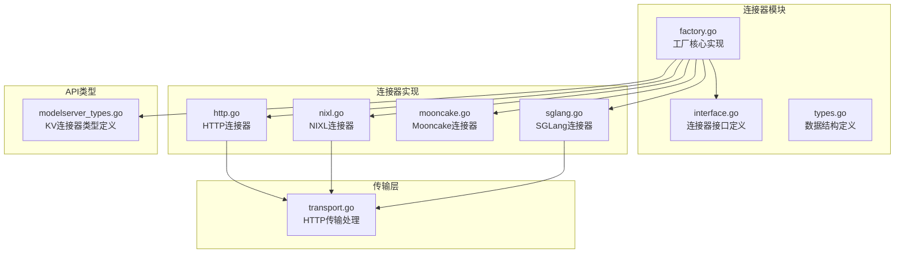
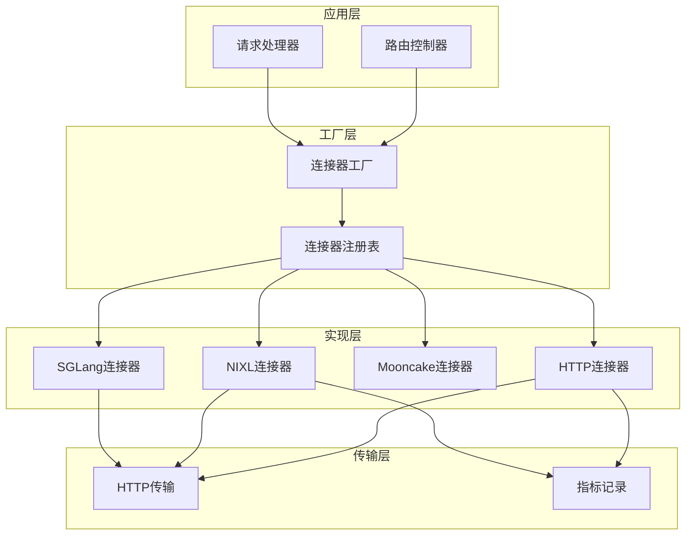
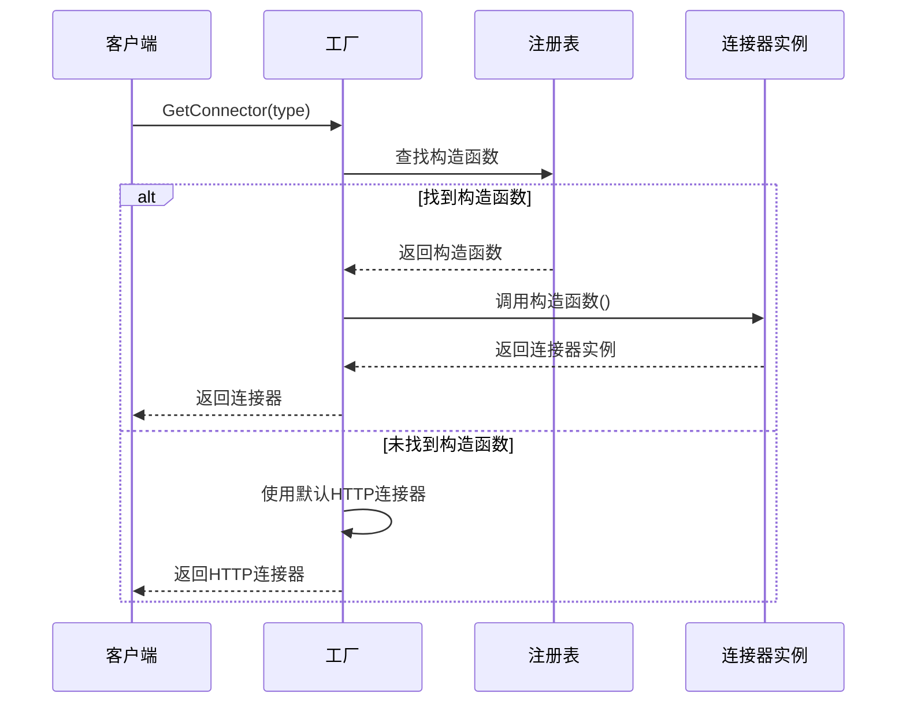
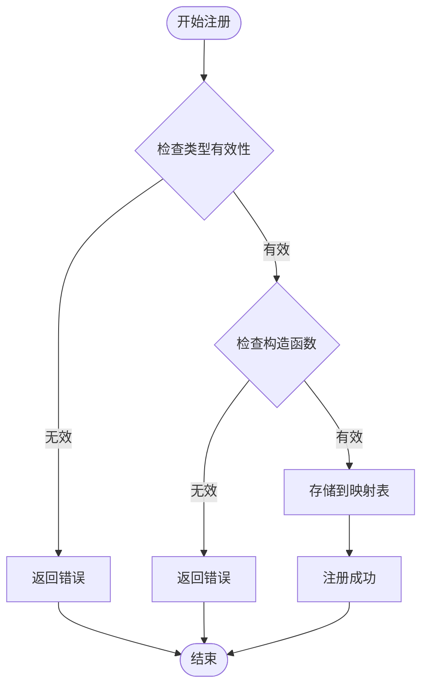
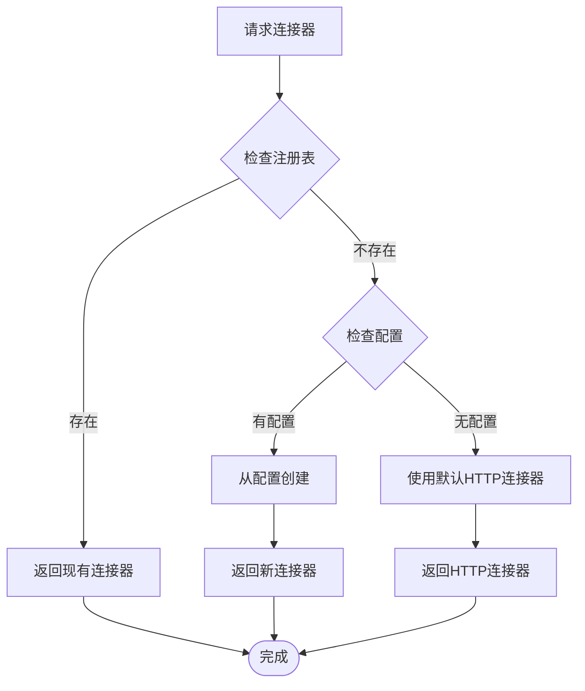
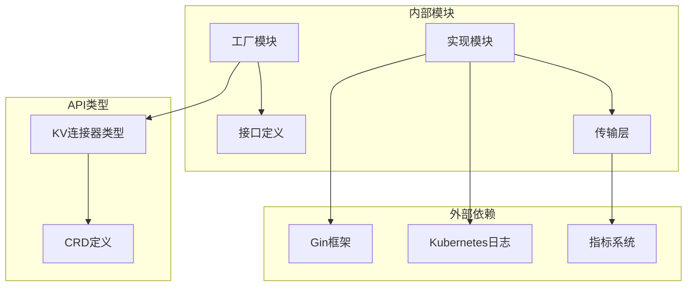

# 工厂模式设计

<cite>
**本文档引用的文件**
- [factory.go](file://pkg/kthena-router/connectors/factory.go)
- [interface.go](file://pkg/kthena-router/connectors/interface.go)
- [types.go](file://pkg/kthena-router/connectors/types.go)
- [http.go](file://pkg/kthena-router/connectors/http.go)
- [transport.go](file://pkg/kthena-router/connectors/transport.go)
- [nixl.go](file://pkg/kthena-router/connectors/nixl.go)
- [mooncake.go](file://pkg/kthena-router/connectors/mooncake.go)
- [sglang.go](file://pkg/kthena-router/connectors/sglang.go)
- [modelserver_types.go](file://pkg/apis/networking/v1alpha1/modelserver_types.go)
- [connectors_test.go](file://pkg/kthena-router/connectors/connectors_test.go)
- [nixl_test.go](file://pkg/kthena-router/connectors/nixl_test.go)
</cite>

## 目录
1. [简介](#简介)
2. [项目结构](#项目结构)
3. [核心组件](#核心组件)
4. [架构概览](#架构概览)
5. [详细组件分析](#详细组件分析)
6. [依赖关系分析](#依赖关系分析)
7. [性能考虑](#性能考虑)
8. [故障排除指南](#故障排除指南)
9. [结论](#结论)
10. [附录](#附录)

## 简介

本文档深入解析Kthena路由器中连接器工厂的工厂模式设计。该系统采用工厂方法模式和简单工厂模式相结合的方式，为不同的KV缓存连接器提供统一的创建和管理机制。通过抽象工厂接口、注册机制和默认工厂构建过程，实现了类型安全的连接器获取机制，并提供了智能的默认连接器选择策略和回退机制。

工厂模式在此系统中的应用体现了以下关键特性：
- **类型安全**：通过枚举类型的连接器类型确保编译时类型检查
- **可扩展性**：支持动态注册新的连接器实现
- **解耦性**：客户端代码与具体连接器实现分离
- **可测试性**：便于单元测试和集成测试

## 项目结构

连接器工厂相关的核心文件组织如下：



**图表来源**
- [factory.go:1-60](file://pkg/kthena-router/connectors/factory.go#L1-L60)
- [interface.go:1-32](file://pkg/kthena-router/connectors/interface.go#L1-L32)
- [http.go:1-120](file://pkg/kthena-router/connectors/http.go#L1-L120)
- [nixl.go:1-205](file://pkg/kthena-router/connectors/nixl.go#L1-L205)
- [transport.go:1-227](file://pkg/kthena-router/connectors/transport.go#L1-L227)

**章节来源**
- [factory.go:17-60](file://pkg/kthena-router/connectors/factory.go#L17-L60)
- [interface.go:17-32](file://pkg/kthena-router/connectors/interface.go#L17-L32)
- [types.go:17-28](file://pkg/kthena-router/connectors/types.go#L17-L28)

## 核心组件

### 工厂接口设计

工厂模式的核心是抽象工厂接口，它定义了连接器创建的标准契约：

```mermaid
classDiagram
class Factory {
-map[KVConnectorType] func() KVConnector connectors
+NewFactory() Factory
+RegisterConnectorBuilder(type, constructor) void
+GetConnector(type) KVConnector
}
class KVConnector {
<<interface>>
+Name() string
+Proxy(context, reqBody, prefillAddr, decodeAddr) (int, error)
}
class HTTPConnector {
-prefillRequest *http.Request
-decodeRequest *http.Request
+Name() string
+Proxy(context, reqBody, prefillAddr, decodeAddr) (int, error)
}
class NIXLConnector {
-name string
-prefillRequest *http.Request
-decodeRequestBody map[string]interface{}
+Name() string
+Proxy(context, reqBody, prefillAddr, decodeAddr) (int, error)
}
Factory --> KVConnector : creates
KVConnector <|.. HTTPConnector
KVConnector <|.. NIXLConnector
```

**图表来源**
- [factory.go:21-45](file://pkg/kthena-router/connectors/factory.go#L21-L45)
- [interface.go:23-31](file://pkg/kthena-router/connectors/interface.go#L23-L31)
- [http.go:28-43](file://pkg/kthena-router/connectors/http.go#L28-L43)
- [nixl.go:34-51](file://pkg/kthena-router/connectors/nixl.go#L34-L51)

### 连接器类型系统

系统定义了标准化的连接器类型枚举，确保类型安全：

| 连接器类型 | 枚举值 | 实现描述 |
|-----------|--------|----------|
| HTTP | "http" | 基础HTTP传输，无特殊KV缓存处理 |
| NIXL | "nixl" | 高性能分布式内存KV缓存 |
| LMCache | "lmcache" | LMCache KV缓存（复用HTTP实现） |
| MoonCake | "mooncake" | MoonCake KV缓存（复用NIXL实现） |

**章节来源**
- [modelserver_types.go:104-120](file://pkg/apis/networking/v1alpha1/modelserver_types.go#L104-L120)
- [factory.go:47-59](file://pkg/kthena-router/connectors/factory.go#L47-L59)

## 架构概览

连接器工厂的整体架构采用分层设计，实现了清晰的关注点分离：



**图表来源**
- [factory.go:21-59](file://pkg/kthena-router/connectors/factory.go#L21-L59)
- [http.go:28-120](file://pkg/kthena-router/connectors/http.go#L28-L120)
- [nixl.go:34-205](file://pkg/kthena-router/connectors/nixl.go#L34-L205)
- [sglang.go:42-222](file://pkg/kthena-router/connectors/sglang.go#L42-L222)

## 详细组件分析

### 工厂类结构设计

工厂类采用组合模式和映射表实现，提供了线程安全的连接器注册和获取机制：

#### 工厂类属性分析

| 属性名称 | 类型 | 描述 | 初始化方式 |
|---------|------|------|-----------|
| connectors | map[KVConnectorType]func() KVConnector | 连接器构造函数映射表 | NewFactory() |
| KVConnectorType | 枚举类型 | 连接器类型标识符 | v1alpha1包定义 |
| constructor | func() KVConnector | 连接器构造函数签名 | 具体实现提供 |

#### 工厂方法实现



**图表来源**
- [factory.go:38-45](file://pkg/kthena-router/connectors/factory.go#L38-L45)

**章节来源**
- [factory.go:21-60](file://pkg/kthena-router/connectors/factory.go#L21-L60)

### 连接器注册表工作原理

注册表采用键值对存储模式，通过连接器类型作为键，构造函数作为值：

#### 注册流程分析



**图表来源**
- [factory.go:33-36](file://pkg/kthena-router/connectors/factory.go#L33-L36)

#### 默认工厂构建过程

默认工厂通过集中注册所有内置连接器实现：

| 连接器类型 | 构造函数 | 备注 |
|-----------|----------|------|
| ConnectorTypeHTTP | NewHTTPConnector | 基础HTTP实现 |
| ConnectorTypeLMCache | NewHTTPConnector | 复用HTTP实现 |
| ConnectorTypeMoonCake | NewMoonCakeConnector | 复用NIXL实现 |
| ConnectorTypeNIXL | NewNIXLConnector | 高性能实现 |
| ConnectorTypeSGLang | NewSGLangConnector | 内部实现 |

**章节来源**
- [factory.go:47-59](file://pkg/kthena-router/connectors/factory.go#L47-L59)

### 类型安全的连接器获取机制

系统通过接口隔离和类型约束确保类型安全：

#### 接口设计原则

```mermaid
classDiagram
class KVConnector {
<<interface>>
+Name() string
+Proxy(context, reqBody, prefillAddr, decodeAddr) (int, error)
}
class HTTPConnector {
-prefillRequest *http.Request
-decodeRequest *http.Request
+Name() string
+Proxy(context, reqBody, prefillAddr, decodeAddr) (int, error)
}
class NIXLConnector {
-name string
-prefillRequest *http.Request
-decodeRequestBody map[string]interface{}
+Name() string
+Proxy(context, reqBody, prefillAddr, decodeAddr) (int, error)
}
class SGLangConnector {
-prefillRequest *http.Request
-decodeRequest *http.Request
-bootstrapRoom int64
+Name() string
+Proxy(context, reqBody, prefillAddr, decodeAddr) (int, error)
}
KVConnector <|.. HTTPConnector
KVConnector <|.. NIXLConnector
KVConnector <|.. SGLangConnector
```

**图表来源**
- [interface.go:23-31](file://pkg/kthena-router/connectors/interface.go#L23-L31)
- [http.go:28-43](file://pkg/kthena-router/connectors/http.go#L28-L43)
- [nixl.go:34-51](file://pkg/kthena-router/connectors/nixl.go#L34-L51)
- [sglang.go:50-70](file://pkg/kthena-router/connectors/sglang.go#L50-L70)

### 默认连接器选择策略和回退机制

系统实现了智能的默认连接器选择策略：

#### 回退机制流程



**图表来源**
- [factory.go:38-45](file://pkg/kthena-router/connectors/factory.go#L38-L45)

**章节来源**
- [factory.go:38-45](file://pkg/kthena-router/connectors/factory.go#L38-L45)

## 依赖关系分析

连接器工厂的依赖关系体现了清晰的层次结构：



**图表来源**
- [factory.go:19](file://pkg/kthena-router/connectors/factory.go#L19)
- [http.go:19-26](file://pkg/kthena-router/connectors/http.go#L19-L26)
- [nixl.go:19-32](file://pkg/kthena-router/connectors/nixl.go#L19-L32)

### 组件耦合度分析

| 组件 | 内聚性 | 耦合度 | 依赖方向 |
|------|--------|--------|----------|
| 工厂类 | 高内聚 | 低耦合 | 单向依赖 |
| 接口定义 | 高内聚 | 最低 | 抽象依赖 |
| 连接器实现 | 中等内聚 | 低耦合 | 双向依赖 |
| 传输层 | 高内聚 | 低耦合 | 单向依赖 |

**章节来源**
- [interface.go:19-31](file://pkg/kthena-router/connectors/interface.go#L19-L31)
- [transport.go:19-31](file://pkg/kthena-router/connectors/transport.go#L19-L31)

## 性能考虑

### 工厂模式性能特征

工厂模式在此系统中的性能表现：

#### 时间复杂度
- **注册操作**: O(1) - 哈希表插入
- **获取操作**: O(1) - 哈希表查找
- **构造函数调用**: O(1) - 函数指针调用

#### 空间复杂度
- **注册表存储**: O(n) - n为已注册连接器数量
- **连接器实例**: 动态分配，按需创建

### 连接器性能优化

#### HTTP连接器优化
- **请求复用**: 复用HTTP连接减少连接开销
- **流式处理**: 支持流式响应处理
- **指标监控**: 内置性能指标收集

#### NIXL连接器优化
- **批量传输**: 支持批量KV缓存传输
- **并发处理**: 并发预填充和解码
- **内存管理**: 优化内存使用效率

## 故障排除指南

### 常见问题诊断

#### 连接器注册问题
- **症状**: 获取连接器返回nil
- **原因**: 连接器未正确注册
- **解决方案**: 检查RegisterConnectorBuilder调用

#### 类型不匹配问题
- **症状**: 编译错误或运行时类型断言失败
- **原因**: KVConnectorType枚举值不正确
- **解决方案**: 验证枚举值与注册时一致

#### 性能问题
- **症状**: 请求延迟增加
- **原因**: 连接池耗尽或网络延迟
- **解决方案**: 检查连接器配置和网络状况

**章节来源**
- [connectors_test.go:48-86](file://pkg/kthena-router/connectors/connectors_test.go#L48-L86)
- [nixl_test.go:32-379](file://pkg/kthena-router/connectors/nixl_test.go#L32-L379)

## 结论

Kthena路由器的连接器工厂设计成功实现了以下目标：

1. **类型安全**: 通过枚举类型和接口隔离确保编译时类型检查
2. **可扩展性**: 支持动态注册新的连接器实现
3. **解耦性**: 客户端代码与具体实现完全分离
4. **可维护性**: 清晰的职责分离和模块化设计

该工厂模式设计为系统的未来发展奠定了坚实基础，支持新的连接器类型扩展和性能优化。

## 附录

### 最佳实践指南

#### 添加新连接器类型步骤
1. **定义连接器类型**: 在KVConnectorType中添加新枚举值
2. **实现连接器接口**: 创建新的连接器实现
3. **注册连接器**: 在NewDefaultFactory中注册新连接器
4. **编写测试**: 添加单元测试验证功能
5. **更新文档**: 更新相关文档和示例

#### 扩展指南
- **性能优化**: 考虑连接池管理和缓存策略
- **监控增强**: 添加详细的性能指标和错误统计
- **配置管理**: 提供更灵活的配置选项
- **错误处理**: 改进错误恢复和重试机制

### 维护建议

1. **定期审查**: 定期审查连接器实现和注册表状态
2. **性能监控**: 建立性能监控和告警机制
3. **兼容性测试**: 确保向后兼容性和版本升级平滑过渡
4. **文档更新**: 保持文档与代码同步更新